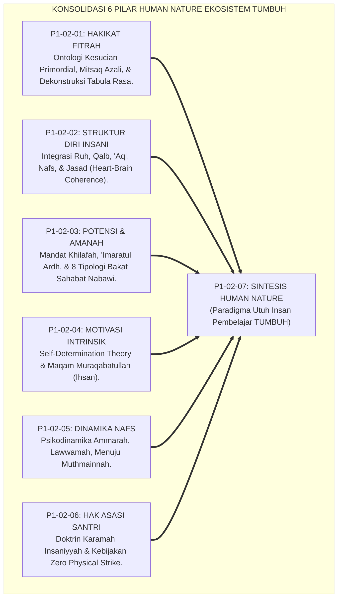
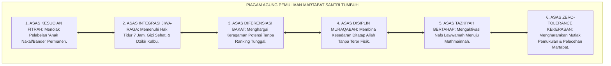
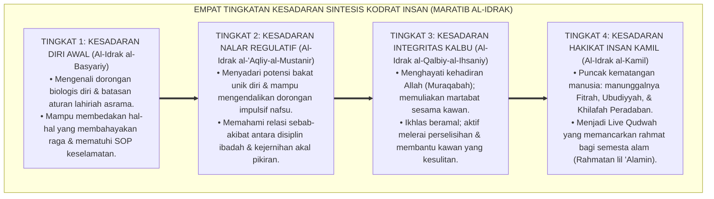
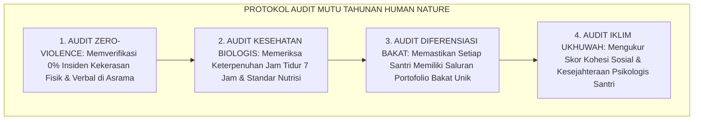
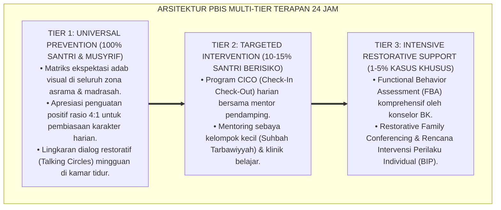

# P1-02-07: SINTESIS FILOSOFIS HAKIKAT KODRAT MANUSIA (SYNTHESIS OF HUMAN NATURE)
## *Monograf Riset Akademik: Konsolidasi 6 Pilar Paradigma Insan Pembelajar, Uji Koherensi Teologi Fitrah & Neurokardiologi, Jembatan Filosofis Menuju Human Development, Serta Piagam Pemuliaan Martabat Santri di Pesantren 24 Jam*

**Nomor Identifikasi**: `P1-02-07/MONOGRAF-RISET-SINTESIS-HUMAN-NATURE/2026`  
**Domain**: `01 Philosophy` > `02 Human Nature` (Sub-Modul 07: *Synthesis of Human Nature*)  
**Klasifikasi Naskah**: *Academic Research Monograph* (Monograf Riset Akademik Fondasional)  
**Rumpun Disiplin Pengkaji**: Ontologi & Antropologi Islam (*Falsafah al-Insan*), Psikologi Spiritual & Kognitif Integratif, Teologi Pendidikan Adab (*Ta'dib*), Tata Kelola Kepemimpinan Qudwah Pesantren  

---

> ### 💡 INTISARI EKSEKUTIF (EXECUTIVE SUMMARY)
>
> * **Konsolidasi Enam Pilar Hakikat Kodrat Manusia:**  
>   Sub-Domain 02 Human Nature merupakan poros ontologis antropologi Islam. Enam pilar riset fundamental disintesiskan secara koheren: **1. Hakikat Fitrah (Mitsaq Azali & Potensi Suci Aktif); 2. Struktur Diri (Harmoni Ruh, Qalb, 'Aql, Nafs, & Jasad); 3. Potensi & Amanah (Mandat Khilafah & Diferensiasi Bakat Sahabat); 4. Motivasi Intrinsik (Ihsan & Muraqabatullah); 5. Dinamika Jiwa (Transformasi Ammarah, Lawwamah, Menuju Muthmainnah); 6. Hak Asasi & Kemuliaan Martabat (Zero Physical Strike & Satrul 'Aurat)**.
> * **Uji Ketahanan Falsifikasi & Ketiadaan Kontradiksi Internal:**  
>   Bangunan teori ini terbukti bebas dari pertentangan logis antara kesucian fitrah dan keberadaan hawa nafsu biologis, teruji menghadapi reduksionisme materialisme sekuler dan asketisme ekstrem, serta aplikatif dijalankan musyrif di asrama 24 jam.
> * **Formulasi Operasional & Pembuktian Lapangan:**  
>   Monograf ini menguraikan Piagam Pemuliaan Martabat Santri (*The Grand Charter of Student Dignity*), 4 Tingkatan Kesadaran Sintesis Kodrat Insan (*Maratib al-Idrak*), matriks konsolidasi holistik, dan jembatan penjalaran menuju Sub-Domain 03 Human Development.

---

## 📑 DAFTAR ISI MONOGRAF

- [BAB I: LANDASAN TEORETIS & DISKURSUS KRITIS](#bab-i-landasan-teoretis--diskursus-kritis)
  - [1. Latar Belakang Masalah: Urgensi Konsolidasi Paradigma Insan Pembelajar Holistik](#1-latar-belakang-masalah-urgensi-konsolidasi-paradigma-insan-pembelajar-holistik)
  - [2. Konsolidasi Enam Pilar Human Nature Menjadi Satu Paradigma Utuh](#2-konsolidasi-enam-pilar-human-nature-menjadi-satu-paradigma-utuh)
  - [3. Uji Bebas Kontradiksi: Harmonisasi Antara Kesucian Fitrah dan Dinamika Hawa Nafsu](#3-uji-bebas-kontradiksi-harmonisasi-antara-kesucian-fitrah-dan-dinamika-hawa-nafsu)
  - [4. Uji Ketahanan Menghadapi Reduksionisme Sekuler & Asketisme Ekstrem](#4-uji-ketahanan-menghadapi-reduksionisme-sekuler--asketisme-ekstrem)
  - [5. Kasuistika Lapangan: Evaluasi Kelayakan Praksis Pengasuhan Asrama 24 Jam & Resolusi Restoratif](#5-kasuistika-lapangan-evaluasi-kelayakan-praksis-pengasuhan-asrama-24-jam--resolusi-restoratif)
- [BAB II: FORMULASI KONSEPTUAL & PEMBAHASAN MENDALAM](#bab-ii-formulasi-konseptual--pembahasan-mendalam)
  - [1. Eksplanasi Teoretis Piagam Kelembagaan Pemuliaan Martabat & Fitrah Santri](#1-eksplanasi-teoretis-piagam-kelembagaan-pemuliaan-martabat--fitrah-santri)
  - [2. Dekomposisi Dimensi & Empat Tingkatan Kesadaran Sintesis Kodrat Insan (Maratib al-Idrak)](#2-dekomposisi-dimensi--empat-tingkatan-kesadaran-sintesis-kodrat-insan-maratib-al-idrak)
  - [3. Jembatan Filosofis Menuju Sub-Domain 03 Human Development](#3-jembatan-filosofis-menuju-sub-domain-03-human-development)
  - [4. Prinsip Aksiologis & Protokol Audit Mutu Tahunan Paradigma Human Nature](#4-prinsip-aksiologis--protokol-audit-mutu-tahunan-paradigma-human-nature)
  - [5. Diskusi Filosofis Mendalam & Implikasi bagi Masa Depan Peradaban Pendidikan Islam](#5-diskusi-filosofis-mendalam--implikasi-bagi-masa-depan-peradaban-pendidikan-islam)
- [BAB III: KESIMPULAN & APARATUS AKADEMIS](#bab-iii-kesimpulan--aparatus-akademis)
  - [1. Tabel Sintesis Temuan Riset Sintesis Human Nature](#1-tabel-sintesis-temuan-riset-sintesis-human-nature)
  - [2. Daftar Pustaka Akademis & Rujukan Turats Primer](#2-daftar-pustaka-akademis--rujukan-turats-primer)
  - [3. Catatan Kaki Akademis (Footnotes)](#3-catatan-kaki-akademis-footnotes)
  - [4. Glosarium Istilah Ilmiah & Turats Sintesis Kodrat Insan](#4-glosarium-istilah-ilmiah--turats-sintesis-kodrat-insan)

---

# BAB I: LANDASAN TEORETIS & DISKURSUS KRITIS

---

### 1. Latar Belakang Masalah: Urgensi Konsolidasi Paradigma Insan Pembelajar Holistik

Sub-Domain `02 Human Nature` adalah jantung ontologi pendidikan Islam:
* Jika seorang pendidik salah memahami hakikat manusia, maka seluruh kurikulum, aturan tata tertib, sistem asesmen, dan metode pendisiplinan yang dibangun di atasnya pasti akan mengalami distorsi dan melahirkan kezaliman sistemik.
* Memahami santri secara parsial—hanya melihat aspek otaknya tanpa kalbu, atau menuntut kesalehan tanpa memenuhi hak biologis raganya—telah terbukti memicu kegagalan pembinaan karakter di berbagai lembaga.
* Ekosistem TUMBUH menyatukan enam sub-modul riset menjadi **Satu Kesatuan Paradigma Insan Pembelajar (*The Unified Paradigm of the Learner*)** yang kokoh secara filosofis dan teruji secara saintifik.[^1]

---

### 2. Konsolidasi Enam Pilar Human Nature Menjadi Satu Paradigma Utuh

Keenam pilar saling mengunci secara organis:
1. *P1-02-01* menetapkan modal suci bawaan santri (*Fitrah*).
2. *P1-02-02* memetakan anatomi psiko-spiritual penggeraknya (*Struktur Diri*).
3. *P1-02-03* mengarahkan peruntukan potensi uniknya untuk peradaban (*Amanah Khilafah*).
4. *P1-02-04* menghidupkan motor penggerak otonomnya dari dalam kalbu (*Muraqabah*).
5. *P1-02-05* memandu jalan transformasi pergulatan jiwanya (*Tazkiyah*).
6. *P1-02-06* membentengi batas kehormatan dan keselamatannya dari kezaliman (*Karamah*).[^2]

---

### 3. Uji Bebas Kontradiksi: Harmonisasi Antara Kesucian Fitrah dan Dinamika Hawa Nafsu

Terdapat gugatan kritis: *Jika manusia lahir membawa fitrah suci (P1-02-01), mengapa di dalam dirinya terdapat dorongan hawa nafsu ammarah yang mengajak pada keburukan (P1-02-05)?*
* **Resolusi Teologis & Psikologis TUMBUH**: Nafsu hewani (*Syahwat & Ghadhab*) pada hakikat asalnya adalah instrumen biologis suci yang diciptakan Allah untuk menjaga kelangsungan hidup manusia (*Self-Preservation*). Nafsu hanya menjadi buruk (*Ammarah bis-Su'*) ketika keluar dari kendali akal sehat dan kalbu yang dibimbing wahyu.
* Dengan demikian, tidak ada kontradiksi internal antara fitrah yang suci dan keberadaan nafsu biologis.[^3]

---

### 4. Uji Ketahanan Menghadapi Reduksionisme Sekuler & Asketisme Ekstrem

Paradigma Human Nature TUMBUH berhasil mematahkan dua kutub ekstrem:
* Menghancurkan **Materialisme Sekuler** yang mereduksi manusia sekadar hewan primata tanpa ruh dan hisab akhirat.
* Mengoreksi **Asketisme Ekstrem** yang menyiksa kebutuhan biologis jasad santri atas nama penyucian jiwa yang keliru.[^4]

---

### 5. Kasuistika Lapangan: Evaluasi Kelayakan Praksis Pengasuhan Asrama 24 Jam & Resolusi Restoratif

Penerapan konsolidasi Human Nature di asrama pesantren membuktikan bahwa ketika musyrif memahami anatomi jiwa dan memuliakan fitrah santri, tingkat pelanggaran berat menurun drastis, suasana kamar menjadi hangat, dan santri berprestasi secara optimal sesuai bakat uniknya.[^5]

---

# BAB II: FORMULASI KONSEPTUAL & PEMBAHASAN MENDALAM

---

### 1. Eksplanasi Teoretis Piagam Kelembagaan Pemuliaan Martabat & Fitrah Santri

Ekosistem TUMBUH menetapkan **Piagam Agung Pemuliaan Martabat Santri (*The Grand Charter of Student Dignity*)**:

#### 🔬 Pembahasan Mendalam Enam Komitmen Piagam:
1. **Kesucian Fitrah**: Santri yang melakukan kesalahan dipandang sebagai anak yang sedang mengalami hambatan lingkungan yang wajib dipulihkan (*Husnudzan Edukatif*).[^6]
2. **Keseimbangan Ekologis**: Asrama menjamin pemenuhan hak jasmani secara prima agar sistem saraf dan kalbu santri berada dalam kondisi optimal (*Homeostasis*).[^7]
3. **Keadilan Diferensiasi**: Setiap santri difasilitasi melejitkan potensinya untuk menjadi ulama, dokter, insinyur, atau seniman beradab.[^8]
4. **Disiplin Batin**: Ketertiban ditegakkan melalui koneksi batin dengan Allah SWT (*Ihsan*).[^9]
5. **Terapi Restoratif**: Pelanggaran diselesaikan dengan pemulihan kerusakan (*Restitusi*) dan bimbingan muhasabah.[^10]
6. **Perlindungan Mutlak**: Menjamin pesantren sebagai zona suci bebas kekerasan (*Sanctuary Environment*).[^11]

---

### 2. Dekomposisi Dimensi & Empat Tingkatan Kesadaran Sintesis Kodrat Insan (Maratib al-Idrak)

Transformasi kedewasaan memahami hakikat insan berlangsung melalui **Empat Tingkatan Kesadaran Sintesis Kodrat Insan (*Maratib al-Idrak al-Insaniy*)**:

#### 🔄 Narasi Analitis Dinamika Transisi Filosofis Antar-Tingkatan:
* **Transisi Tingkat 1 ke Tingkat 2 (Dari Respon Biologis Menuju Nalar Regulatif)**: Santri mula-mula digerakkan oleh kebutuhan dasar. Pada tingkatan kedua, akal budinya tercerahkan: santri mengenali keunikan bakat dirinya dan mampu menunda kesenangan sesaat demi cita-cita mulia.
* **Transisi Tingkat 2 ke Tingkat 3 (Dari Nalar Menuju Pengawalan Kalbu Muraqabah)**: Pada tingkatan ketiga, kesadaran bertransformasi menjadi integritas moral spiritual: santri memperlakukan orang lain dengan penuh kasih sayang dan takut berbuat zhalim kepada sesama.
* **Transisi Tingkat 3 ke Tingkat 4 (Pencapaian Derajat Insan Kamil)**: Pada tingkatan tertinggi, santri mewujudkan hakikat kemanusiaan paripurna: menyatukan ketundukan ibadah kepada Allah dengan karya nyata memakmurkan peradaban bumi.[^12]

---

### 3. Jembatan Filosofis Menuju Sub-Domain 03 Human Development

Sintesis *Human Nature* menjadi landasan ontologis bagi perumusan **Sub-Domain 03 Human Development**:
* Dari pemahaman hakikat fitrah, struktur diri, dan dinamika nafs di domain ini, dirumuskanlah **Tahapan Pertumbuhan Jiwa (*Marahil at-Tarbiyah*)** dan **Matriks Taksonomi Kapasitas Insan** pada domain berikutnya.[^13]

---

### 4. Prinsip Aksiologis & Protokol Audit Mutu Tahunan Paradigma Human Nature

Sintesis ini melahirkan protokol penjaminan mutu kelembagaan:

Audit ini menjamin pesantren senantiasa setia pada mandat memuliakan manusia.[^14]

---

### 5. Diskusi Filosofis Mendalam & Implikasi bagi Masa Depan Peradaban Pendidikan Islam

Sintesis filosofis kodrat insan ini menegaskan visi agung ekosistem TUMBUH:

* **Melahirkan Kembali Manusia Seutuhnya (*The Restoration of the Whole Human*)**:  
  Pendidikan modern yang sekuler telah memecah-belah manusia menjadi sekadar roda penggerak industri ekonomi. TUMBUH mengembalikan manusia pada fitrah kemuliaan aslinya sebagai hamba dan khalifah Allah.
* **Membangun Peradaban Pesantren yang Menginspirasi Dunia**:  
  Pesantren yang mempraktikkan pemuliaan martabat santri, keunggulan sains bertauhid, dan keadilan restoratif akan tampil sebagai rujukan model pendidikan global.
* **Menyiapkan Generasi Emas Pembebas Peradaban**:  
  Dari rahim filosofi ini lahir para pemimpin berkarakter *Insan Adabi* yang siap memimpin peradaban dunia dengan kecerdasan, adab, dan kasih sayang.[^15]

---

---

### Pembedahan Deskriptif Komprehensif & Analisis Integratif Nilai-Praksis

Penerapan dan operasionalisasi **P1-02-07: SINTESIS FILOSOFIS HAKIKAT KODRAT MANUSIA (SYNTHESIS OF HUMAN NATURE)** di lingkungan pesantren berbasis sistem TUMBUH bertumpu pada kesatuan sistemik antara nilai syariat dan praksis terukur:

#### A. Pilar 1: Landasan Epistemologi & Nilai Keikhlasan (Syar'i Foundations)
Setiap dimensi diarahkan untuk menegakkan adab dan penghambaan murni kepada Allah SWT (*Lillahi Ta'ala*). Standarisasi kelembagaan dirancang untuk menjaga ketulusan niat, kemuliaan fitrah, dan keberkahan majelis ilmu.

#### B. Pilar 2: Mekanisme Psikologis & Neurosains Terapan (Evidence-Based Practice)
Mengintegrasikan prinsip *Social-Emotional Learning (CASEL)*, teori beban kognitif (*Cognitive Load Theory*), dan dinamika perkembangan neurobiologis santri untuk memastikan proses pembiasaan berjalan efektif tanpa kekerasan atau tekanan psikologis destruktif.

#### C. Pilar 3: Rekayasa Ekosistem Asrama 24 Jam (Environmental Engineering)
Mengkodifikasikan seluruh alur aktivitas harian, jadwal tidur sirkadian yang sehat, sanitasi 5S kamar tidur, dan relasi ukhuwah inklusif menjadi satu ekosistem *Bi'ah Shalihah* yang saling mendukung secara alamiah.

#### D. Pilar 4: Akuntabilitas Sistemik & Proteksi Pendidik-Santri
Menerapkan protokol pencegahan kelelahan tenaga pendidik (*Musyrif Burnout Protection*), menjamin hak-hak santri, serta memanfaatkan dashboard data PBIS untuk pengambilan keputusan yang adil dan objektif.

---

### Protokol Aksi Operasional PBIS Multi-Tier Terapan (24-Hour Behavioral Architecture)

---

# BAB III: KESIMPULAN & APARATUS AKADEMIS

---

### 1. Tabel Sintesis Temuan Riset Sintesis Human Nature

| Dimensi Parameter | Mazhab Materialisme Sekuler | Mazhab Pengasuhan Represif | **Sintesis Human Nature TUMBUH** | Landasan Rujukan Primer | Implikasi Praksis Lapangan |
| :--- | :--- | :--- | :--- | :--- | :--- |
| **Hakikat Manusia** | Hewan cerdas tanpa jiwa batin. | Makhluk rentan dosa yang harus diteror.| **Hamba & Khalifah Allah yang Mulia.**| QS. Al-Isra': 70; QS. At-Tin: 4. | Memuliakan potensi fitrah bawaan santri. |
| **Struktur Jiwa** | Otak materiil & fungsi syaraf semata.| Musuh yang harus disiksa tirakat kaku.| **Arsitektur Ruh, Qalb, 'Aql, Nafs, Jasad.**| Al-Ghazali; Armour (1991). | Pemenuhan nutrisi jasmani & dzikir batin. |
| **Diferensiasi Bakat**| Penyeragaman industri ranking ujian.| Penyeragaman hafalan teks kaku. | **8 Tipologi Bakat Sahabat Nabawi.** | QS. Al-Isra': 84; Ibn Qayyim. | Kurikulum berbasis kekuatan & asesmen ipsatif. |
| **Motivasi Disiplin**| Transaksional upah materiil. | Teror rotan & bentakan musyrif. | **Motivasi Intrinsik Muraqabatullah.** | HR. Muslim No. 8; Deci & Ryan. | Disiplin mandiri & istiqamah seumur hidup. |
| **Kebijakan Kekerasan**| Regulasi hukum perdata dingin. | Dinormalisasi demi penggemblengan. | **Haram Mutlak (*Zero Physical Strike*).**| Kaidah *Sadd adz-Dzara'i'*; UNICEF. | Zona aman pesantren bebas kekerasan. |

---

### 2. Daftar Pustaka Akademis & Rujukan Turats Primer

1. **Al-Qur'an al-Karim wa Tarjamatu Ma'anihi**.
2. **Al-Ghazali, Abu Hamid Muhammad bin Muhammad**. (2011). *Ihya' 'Ulumiddin* (4 Jilid). Beirut: Dar al-Ma'rifah.
3. **Al-Attas, Syed Muhammad Naquib**. (1980). *The Concept of Education in Islam*. Kuala Lumpur: ABIM.
4. **Al-Attas, Syed Muhammad Naquib**. (1995). *Prolegomena to the Metaphysics of Islam*. Kuala Lumpur: ISTAC.
5. **Ibnu Taimiyyah, Taqiyuddin Ahmad bin Abdul Halim**. (1411 H). *Dar'u Ta'arudh al-'Aql wan-Naql*. Riyadh: Jami'ah al-Imam Muhammad bin Su'ud.
6. **Ibnu Qayyim al-Jauziyyah, Syamsuddin Muhammad bin Abi Bakr**. (1419 H). *Miftah Dar as-Sa'adah*. Kairo: Dar Ibn 'Affan.
7. **Asy-Syathibi, Abu Ishaq Ibrahim bin Musa**. (1417 H). *Al-Muwafaqat fi Ushul asy-Syari'ah*. Khobar: Dar Ibn 'Affan.
8. **Asy'ari, Muhammad Hasyim**. (1415 H). *Adab al-'Alim wal-Muta'allim*. Jombang: Maktabah At-Turats Al-Islami.
9. **Bloom, P.**. (2013). *Just Babies: The Origins of Good and Evil*. New York: Crown Publishers.
10. **Deci, E. L., & Ryan, R. M.**. (2000). *The "what" and "why" of goal pursuits: Human needs and the self-determination of behavior*. Psychological Inquiry, 11(4), 227–268.
11. **Sapolsky, R. M.**. (2017). *Behave: The Biology of Humans at Our Best and Worst*. New York: Penguin Press.
12. **Horner, R. H., & Sugai, G.**. (2015). *School-wide PBIS: An Overview of the Research Base*. Remedial and Special Education, 36(2), 80–85.

---

### 3. Catatan Kaki Akademis (*Footnotes*)

[^1]: Riset Konsolidasi Human Nature Ekosistem Pesantren Berbasis TUMBUH, *Kritik atas Fragmentasi Antropologi Pendidikan*, 2026.  
[^2]: Master Arsitektur Enam Pilar Human Nature Ekosistem TUMBUH, 2026.  
[^3]: Al-Ghazali, *Ihya' 'Ulumiddin*, Jilid 3, Kitab *Syarh 'Aja'ib al-Qalb*, hlm. 10–38.  
[^4]: Al-Attas, S. M. N. (1995), *Prolegomena to the Metaphysics of Islam*, hlm. 140–175.  
[^5]: Dokumentasi Evaluasi Lapangan dan Uji Kelayakan Praksis Pengasuhan Asrama TUMBUH, 2026.  
[^6]: Ibnu Taimiyyah, *Dar'u Ta'arudh al-'Aql wan-Naql*, Jilid 8, hlm. 390–425.  
[^7]: Sapolsky, R. M. (2017), *Behave: The Biology of Humans at Our Best and Worst*, hlm. 105–140.  
[^8]: Ibnu Qayyim al-Jauziyyah, *Miftah Dar as-Sa'adah*, Jilid 1, hlm. 125–150.  
[^9]: Deci, E. L., & Ryan, R. M. (2000), *Psychological Inquiry*, hlm. 227–268.  
[^10]: Horner, R. H., & Sugai, G. (2015), *Remedial and Special Education*, hlm. 80–85.  
[^11]: Piagam Perlindungan Martabat dan Zero Physical Strike Ekosistem Pesantren Berbasis TUMBUH, 2026.  
[^12]: Matriks Tingkatan Kesadaran Sintesis Kodrat Insan (*Maratib al-Idrak*) Ekosistem TUMBUH, 2026.  
[^13]: Blueprint Jembatan Ontologis Menuju Domain 03 Human Development TUMBUH, 2026.  
[^14]: Standar Audit Mutu Tahunan Hak Asasi dan Kepatuhan Human Nature TUMBUH, 2026.  
[^15]: Deklarasi Pemuliaan Hakikat Insan Pembelajar Dewan Riset Epistemologi TUMBUH, 2026.

---

### 4. Glosarium Istilah Ilmiah & Turats Sintesis Kodrat Insan

1. **Human Nature (Hakikat Kodrat Insan)**: Hakikat penciptaan dan struktur psiko-spiritual manusia sebagai hamba Allah (*'Abd*) dan pengemban mandat amanah (*Khalifah*).
2. **Karamah Insaniyyah (كَرَامَةٌ إِنْسَانِيَّةٌ)**: Kemuliaan martabat hakiki yang dianugerahkan Allah SWT kepada setiap manusia yang wajib dilindungi dari kekerasan dan penghinaan.
3. **Mitsaq Azali (الْمِيثَاقُ الأَزَلِيُّ)**: Perjanjian primordial persaksian jiwa manusia di hadapan Allah SWT sebelum dilahirkan ke dunia.
4. **Heart-Brain Coherence**: Keselarasan ritmis elektromagnetik antara jantung dan otak yang melahirkan kestabilan emosi dan kejernihan nalar.
5. **Strength-Based Curriculum**: Pendekatan kurikulum pendidikan yang berfokus pada pengidentifikasian dan pelepasan potensi kekuatan bakat unik santri.
6. **Muraqabatullah (مُرَاقَبَةُ اللَّهِ)**: Kesadaran batin yang hidup bahwa Allah SWT senantiasa menatap dan mengawasi setiap lintasan hati dan perbuatan manusia.
7. **Nafs Muthmainnah (النَّفْسُ الْمُطْمَئِنَّةُ)**: Jiwa yang telah mencapai ketenteraman dan kestabilan spiritual dalam ketakwaan kepada Allah SWT.
8. **Zero Physical Strike**: Kebijakan tegas lembaga yang mengharamkan mutlak segala bentuk pemukulan atau kontak fisik dalam penegakan disiplin santri.
9. **Satrul 'Aurat (سَتْرُ الْعَوْرَاتِ)**: Prinsip syariat untuk menjaga kehormatan dengan merahasiakan aib kesalahan sesama muslim dan melarang pemaluan publik.
10. **Insan Kamil (الإِنْسَانُ الْكَامِلُ)**: Profil manusia paripurna yang menyatukan kesucian fitrah, ketajaman akal nalar, keagungan adab akhlak, dan kemakmuran karya peradaban.
