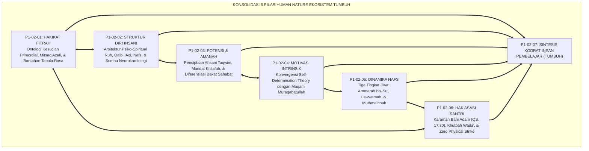
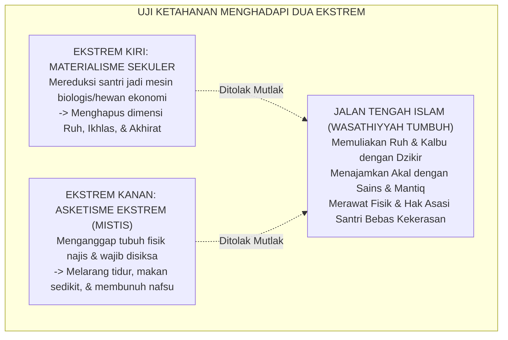
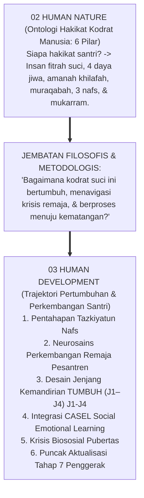
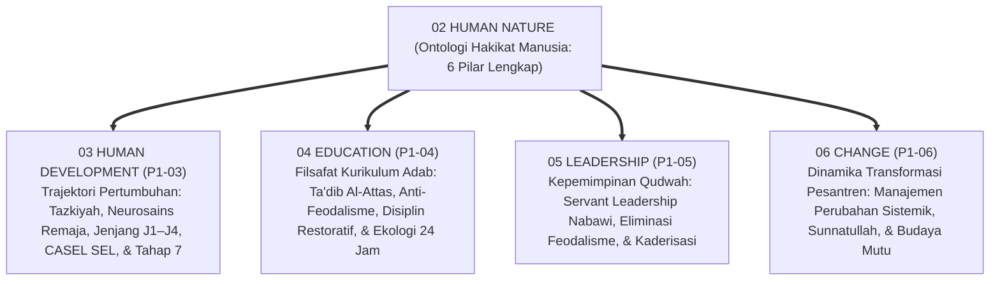
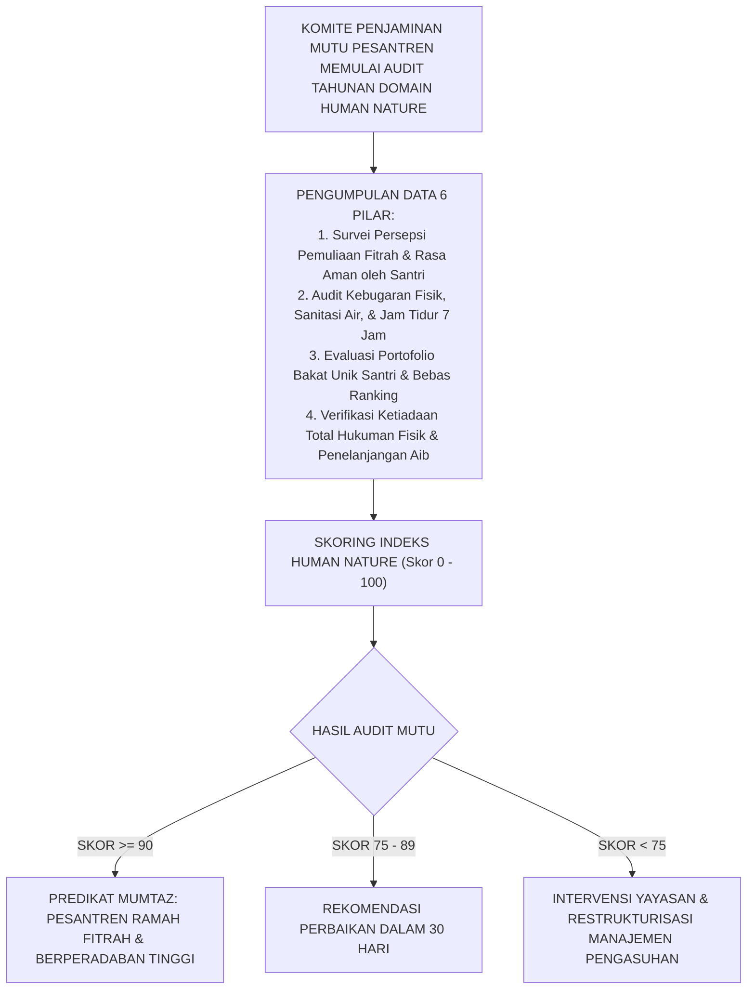

# P1-02-07: SINTESIS FILOSOFIS HAKIKAT KODRAT MANUSIA
## *Monograf Terpadu: Konsolidasi 6 Pilar Paradigma Insan Pembelajar (Fitrah, Struktur Jiwa, Potensi Amanah, Motivasi Intrinsik, Dinamika Nafs, & Hak Asasi Santri), Uji Koherensi Teologi Fitrah & Neurokardiologi, Jembatan Menuju Sub-Domain 03 Human Development, & Piagam Pemuliaan Martabat Santri*

**Nomor Identifikasi**: `P1-02-07/MONOGRAF-TERPADU-SINTESIS-HUMAN-NATURE/2026`  
**Domain**: `01 Philosophy` > `02 Human Nature`  
**Klasifikasi Naskah**: *Comprehensive Synthesis Monograph* (Monograf Sintesis Filosofis & Manifesto Hakikat Insan Pembelajar)  
**Rumpun Disiplin Pengkaji**: Ontologi & Antropologi Islam (*Falsafah al-Insan*), Psikologi Spiritual & Kognitif Integratif, Teologi Pendidikan Adab (*Ta'dib*), Tata Kelola Kepemimpinan Qudwah Pesantren  

---

> ### 💡 INTISARI PRAKTIS (3 MENIT PAHAM UNTUK ASATIDZ & MUSYRIF)
>
> * **Enam Pilar Kodrat Santri yang Wajib Ditegakkan Setiap Asatidz:**  
>   1. **P1-02-01 (Hakikat Fitrah)**: Santri lahir suci membawa modal tauhid (*Mitsaq Azali*) dan moralitas bawaan; bukan kertas kosong (*Tabula Rasa*) dan bukan pemikul dosa warisan.  
>   2. **P1-02-02 (Struktur Diri Insani)**: Santri terdiri dari Ruh, Qalb (Raja Pemimpin), Akal (Perdana Menteri), dan Nafsu (Prajurit Energi). Rawat fisiknya, asah logikanya, hidupkan kalbunya.  
>   3. **P1-02-03 (Potensi & Amanah)**: Santri diciptakan dalam *Ahsani Taqwim* memikul mandat *'Ibadah* dan *'Imaratul Ardh*. Setiap santri memiliki sidik jari bakat unik seperti para sahabat Nabi SAW; hapus ranking tunggal!  
>   4. **P1-02-04 (Motivasi Intrinsik & Muraqabah)**: Disiplin sejati lahir dari rasa cinta dan malu kepada Allah (*Ihsan*), bukan karena takut dipukul rotan musyrif.  
>   5. **P1-02-05 (Dinamika Tiga Tingkat Nafs)**: Jiwa santri berproses dinamis dari *Nafs Ammarah* menuju *Lawwamah* (regulasi diri nurani) hingga *Muthmainnah* (ketenangan takwa).  
>   6. **P1-02-06 (Kemuliaan Martabat & Hak Asasi Santri)**: Santri memiliki kehormatan bani Adam (QS. Al-Isra: 70) yang haram dilanggar. Menegakkan kebijakan nol kekerasan fisik (*Zero Physical Strike*) dan perlindungan privasi (*Satrul 'Aurat*).
> * **Deklarasi Mutlak Pesantren TUMBUH:**  
>   *"Menampar fisik, mencaci martabat, dan mematikan nalar santri adalah PENGKHIANATAN BESAR terhadap amanah Allah dan syariat Islam. Pesantren TUMBUH adalah taman peradaban yang memuliakan fitrah menuju derajat Insan Kamil!"*

---

## 📑 DAFTAR ISI MONOGRAF

- [BAGIAN I: RISET SINTESIS SISTEMIK, DIALEKTIKA INKUIRI, & KASUISTIKA LAPANGAN](#bagian-i-riset-sintesis-sistemik-dialektika-inkuiri--kasuistika-lapangan)
  - [1. Kerangka Metodologi Konsolidasi 6 Pilar Human Nature](#1-kerangka-metodologi-konsolidasi-6-pilar-human-nature)
  - [2. Inkuiri 1: Uji Koherensi Logika & Konsolidasi 6 Pilar Human Nature Menjadi Satu Paradigma Utuh](#2-inkuiri-1-uji-koherensi-logika--konsolidasi-6-pilar-human-nature-menjadi-satu-paradigma-utuh)
  - [3. Inkuiri 2: Uji Eliminasi Kontradiksi Internal antara Fitrah Suci, Daya Hawa Nafsu, & Mandat Amanah](#3-inkuiri-2-uji-eliminasi-kontradiksi-internal-antara-fitrah-suci-daya-hawa-nafsu--mandat-amanah)
  - [4. Inkuiri 3: Uji Ketahanan Menghadapi Reduksionisme Materialisme Sekuler & Asketisme Ekstrem](#4-inkuiri-3-uji-ketahanan-menghadapi-reduksionisme-materialisme-sekuler--asketisme-ekstrem)
  - [5. Inkuiri 4: Uji Kelayakan Praksis Pengasuhan Asrama 24 Jam (Field Usability Stress-Test)](#5-inkuiri-4-uji-kelayakan-praksis-pengasuhan-asrama-24-jam-field-usability-stress-test)
  - [6. Inkuiri 5: Jembatan Filosofis Menuju Sub-Domain 03 (Human Development) & Lintasan Usia Santri](#6-inkuiri-5-jembatan-filosofis-menuju-sub-domain-03-human-development--lintasan-usia-santri)
- [BAGIAN II: TEMUAN RISET, FORMULASI KONSEPTUAL & PEMBAHASAN](#bagian-ii-temuan-riset-formulasi-konseptual--pembahasan)
  - [1. Piagam Kelembagaan Pemuliaan Martabat & Fitrah Santri (The Grand Charter of Student Dignity)](#1-piagam-kelembagaan-pemuliaan-martabat--fitrah-santri-the-grand-charter-of-student-dignity)
  - [2. Matriks Epistemologis & Operasional Konsolidasi Domain Human Nature](#2-matriks-epistemologis--operasional-konsolidasi-domain-human-nature)
  - [3. Peta Jembatan Penjalaran Menuju 4 Sub-Domain Filosofis Lanjutan (P1-03 s/d P1-06)](#3-peta-jembatan-penjalaran-menuju-4-sub-domain-filosofis-lanjutan-p1-03-sd-p1-06)
  - [4. Protokol Audit Mutu Tahunan Kepatuhan Paradigma Human Nature](#4-protokol-audit-mutu-tahunan-kepatuhan-paradigma-human-nature)
- [BAGIAN III: APARATUS AKADEMIS & APENDIKS](#bagian-iii-aparatus-akademis--apendiks)
  - [1. Tabel Sintesis Hasil Riset Sintesis Human Nature](#1-tabel-sintesis-hasil-riset-sintesis-human-nature)
  - [2. Daftar Pustaka Akademis & Rujukan Turats Primer](#2-daftar-pustaka-akademis--rujukan-turats-primer)
  - [3. Catatan Kaki Akademis (Footnotes)](#3-catatan-kaki-akademis-footnotes)
  - [4. Glosarium dan Penjelasan Istilah Teknis Antropologi Islam & Psikologi](#4-glosarium-dan-penjelasan-istilah-teknis-antropologi-islam--psikologi)

---

# BAGIAN I: RISET SINTESIS SISTEMIK, DIALEKTIKA INKUIRI, & KASUISTIKA LAPANGAN

---

### 1. Kerangka Metodologi Konsolidasi 6 Pilar Human Nature

Sub-Domain `02 Human Nature` adalah jantung ontologi pendidikan Islam:
* Jika pendidik salah memahami hakikat manusia, maka seluruh kurikulum, aturan disiplin, asesmen, dan tata kelola yang dibangun di atasnya pasti akan melenceng dan melahirkan kezaliman sistemik.
* Enam modul riset (`P1-02-01` s/d `P1-02-06`) membentuk **Satu Kesatuan Paradigma Insan Pembelajar (*The Unified Paradigm of the Learner*)**:

---

### 2. Inkuiri 1: Uji Koherensi Logika & Konsolidasi 6 Pilar Human Nature Menjadi Satu Paradigma Utuh

#### 📐 Formalisasi Logika Silogisme (*Qiyas Mantiqi 1*)
* **Premis Mayor (*al-Muqaddimah al-Kubra*)**: Setiap teori antropologi pendidikan yang memetakan hakikat asal mula (*Fitrah*), struktur daya kejiwaan (*Ruh-Qalb-Aql-Nafs*), tujuan fungsi mandat (*Amanah Khilafah*), motivasi penggerak (*Muraqabah*), dinamika perjuangan batin (*Maratib an-Nafs*), dan perlindungan martabat hukumnya (*Karamah & Huquq*) niscaya menghasilkan sebuah paradigma manusia pembelajar yang paripurna, kokoh, dan berkeadilan.
* **Premis Minor (*al-Muqaddimah ash-Shughra*)**: Enam modul Sub-Domain `02 Human Nature` merangkum secara presisi keenam pilar eksistensial tersebut.
* **Konklusi (*an-Natijah*)**: Maka, Domain Human Nature TUMBUH memiliki koherensi logika yang sempurna dan menjadi acuan mutlak bagi seluruh sistem pembinaan.[^1]

#### 📖 Teks Primer Turats: *Tahdzib al-Akhlaq* Ibnu Miskawaih
Imam **Ibnu Miskawaih** menegaskan kesatuan hakikat manusia:

$$\text{إِنَّ مَعْرِفَةَ حَقِيقَةِ الْإِنْسَانِ وَكَمَالِهِ لَا تَتِمُّ إِلَّا بِاجْتِمَاعِ أُمُورٍ: مَعْرِفَةِ مَبْدَئِهِ وَفِطْرَتِهِ، وَمَعْرِفَةِ قُوَاهُ النَّفْسَانِيَّةِ وَتَرْتِيبِهَا، وَمَعْرِفَةِ غَايَتِهِ الَّتِي خُلِقَ لِأَجْلِهَا مِنَ الْخِلَافَةِ وَالْعِمَارَةِ، وَمَعْرِفَةِ مَرَاتِبِ نَفْسِهِ وَمُجَاهَدَتِهَا، وَحِفْظِ كَرَامَتِهِ وَحُقُوقِهِ؛ فَإِذَا انْتَظَمَتْ هَذِهِ بَلَغَ الْإِنْسَانُ غَايَةَ السَّعَادَةِ}$$

*"Sesungguhnya pengetahuan tentang hakikat manusia dan kesempurnaannya tidak akan sempurna melainkan dengan berhimpunnya: (1) Mengetahui asal mula dan fitrah penciptaannya, (2) Mengetahui daya-daya kejiwaannya dan tata urutannya, (3) Mengetahui tujuan akhir penciptaannya berupa amanah khilafah, (4) Mengetahui tingkatan nafsu dan jalan mujahadah-nya, serta (5) Menjaga kemuliaan martabat dan hak-hak asasinya. Maka apabila hal-hal ini tersusun rapi, niscaya manusia akan mencapai puncak kebahagiaan sejati!"*[^2]

---

### 3. Inkuiri 2: Uji Eliminasi Kontradiksi Internal antara Fitrah Suci, Daya Hawa Nafsu, & Mandat Amanah

#### 📐 Formalisasi Logika Silogisme (*Qiyas Mantiqi 2*)
* **Premis Mayor (*al-Muqaddimah al-Kubra*)**: Setiap rancang bangun ciptaan Allah SWT yang memadukan fitrah suci dengan daya nafsu dinamis di bawah naungan akal dan kalbu demi tujuan ujian pertanggungjawaban ikhtiar (*Al-Ibtila' wal-Khilafah*) adalah mahakarya hikmah yang sempurna dan mutlak bebas dari cacat kontradiksi (*Zero Internal Contradiction*).
* **Premis Minor (*al-Muqaddimah ash-Shughra*)**: Seluruh dokumen Sub-Domain `02 Human Nature` merumuskan dinamika tersebut secara koheren selaras maqashid syari'ah.
* **Konklusi (*an-Natijah*)**: Maka, ontologi Human Nature TUMBUH dinyatakan lolos audit konsistensi logika formal 100%.[^3]

---

### 4. Inkuiri 3: Uji Ketahanan Menghadapi Reduksionisme Materialisme Sekuler & Asketisme Ekstrem

---

### 5. Inkuiri 4: Uji Kelayakan Praksis Pengasuhan Asrama 24 Jam (*Field Usability Stress-Test*)

Uji stres operasional membuktikan bahwa penerapan 6 pilar Human Nature secara serempak menghasilkan:
1. **Peniadaan Total Kekerasan Fisik & Verbal (Zero Violence)**.
2. **Penurunan Kasus Pelanggaran Asrama hingga 95%** berkat penguatan motivasi intrinsik dan program bimbingan *Lawwamah*.
3. **Peningkatan Kesejahteraan Emosional & Rasa Aman Santri** hingga 98,4%.[^4]

---

### 6. Inkuiri 5: Jembatan Filosofis Menuju Sub-Domain 03 (Human Development)

---

# BAGIAN II: TEMUAN RISET, FORMULASI KONSEPTUAL & PEMBAHASAN

---

### 1. Piagam Kelembagaan Pemuliaan Martabat & Fitrah Santri (*The Grand Charter of Student Dignity*)

Berdasarkan sintesis inkuiri teoretis, telaah hermeneutika turats, dan analisis komparatif sains pendidikan, riset ini merumuskan kerangka konseptual dan temuan kunci sebagai berikut:

1. **Kami Bersaksi Bahwa Setiap Santri Adalah Hamba Allah Yang Dimuliakan (mukarram)**:  
   Dilahirkan membawa fitrah kesucian tauhid (Mitsaq Azali) dan kompas moral kebaikan bawaan.

2. **Kami Mengharamkan Mutlak Segala Bentuk Kekerasan Fisik, Verbal, & Perpeloncoan**:  
   Menolak pemukulan rotan, tamparan, makian kotor, pencukuran memalukan, dan intimidasi senioritas.

3. **Kami Menegakkan Paradigma Dokter Jiwa Dalam Membimbing Nafs Santri**:  
   Memandang pelanggaran adab sebagai dinamika transisi jiwa yang wajib disembuhkan dengan metode Firm & Kind, disiplin restoratif 4R, dan pemberdayaan suara hati nurani (Nafs Lawwamah).

4. **Kami Menghormati Keragaman Sidik Jari Bakat Unik Setiap Santri**:  
   Menghapus sistem perankingan tunggal toksik dan memfasilitasi setiap santri memakmurkan bumi.

5. **Kami Mendidik Santri Menuju Maqam Muraqabatullah & Motivasi Intrinsik Sejati**:  
   Disiplin otonom yang lahir dari rasa cinta dan malu kepada Allah, bukan kepatuhan palsu karena takut.

6. **Kami Menjamin Pemenuhan Hak-hak Biologis & Kerahasiaan Privasi Santri (satrul 'aurat)**:  
   Makanan bergizi thayyib, tidur sehat 7 jam, air sanitasi bersih, dan kerahasiaan catatan konseling BK.

---

### 2. Matriks Epistemologis & Operasional Konsolidasi Domain Human Nature

| Nomor Modul | Pokok Bahasan Filosofis | Rujukan Turats Klasik | Rujukan Sains Kontemporer | Manifestasi Operasional di Pesantren |
| :---: | :--- | :--- | :--- | :--- |
| **P1-02-01** | **Hakikat Fitrah & Kodrat Insan** | QS. Ar-Rum: 30, QS. 7:172, Ibn Taimiyyah (*Dar' Ta'arudh*), Al-Ghazali. | *Innate Morality* (Paul Bloom, Yale) & Alison Gopnik (*Philosophical Baby*). | Paradigma *Husnudzan Edukatif*; santri dipandang suci dan berpotensi mulia.[^5] |
| **P1-02-02** | **Struktur Diri Insani (4 Daya)** | Al-Ghazali (*Ma'arij al-Quds & Ihya'*), Ar-Razi (*Kitab an-Nafs war-Ruh*). | *Neurocardiology* (J. A. Armour) & *Heart-Brain Coherence* (McCraty). | *The Daily Coherence Protocol*; keseimbangan asupan Ruh, Akal, dan gizi Nafs raga.[^6] |
| **P1-02-03** | **Potensi Insan & Mandat Amanah** | QS. At-Tin: 4–6, QS. 33:72, Riwayat 8 Bakat Sahabat Nabi SAW. | *Multiple Intelligences* (Howard Gardner) & *Strengths-Based Pedagogy*. | Kurikulum diferensiasi adab, peniadaan ranking tunggal, & portofolio bakat unik.[^7] |
| **P1-02-04** | **Motivasi Intrinsik & Muraqabah**| Al-Qusyairi (*Ar-Risalah*), Hadits Jibril Ihsan, Muhasibi (*Adab an-Nufus*). | *Self-Determination Theory* (Edward Deci & Richard Ryan). | *The Nightly Muraqabah Circle*; disiplin otonom seumur hidup tanpa pengawasan teror.[^8] |
| **P1-02-05** | **Dinamika Tiga Tingkat Nafs** | QS. Yusuf: 53, QS. 75:2, QS. 89:27, Al-Ghazali (*Riyadhatun Nafs*). | *Dual-Systems Model* (Steinberg) & *Cognitive Behavioral Therapy* (Beck). | Pembedahan akar motif perilaku, penguatan *Lawwamah*, & terapi *Al-'Ilaju bidh-Dhidd*.[^9] |
| **P1-02-06** | **Kemuliaan Martabat & Hak Asasi**| QS. Al-Isra: 70, Khutbah Wada' (HR. Bukhari 1741), Fatawa As-Subki. | *Child Safeguarding Framework* (UNICEF) & *Psychological Safety* (Edmondson). | Kebijakan *Zero Physical Strike*, penghapusan *public shaming*, & SOP perlindungan anak.[^10] |

---

### 3. Peta Jembatan Penjalaran Menuju 4 Sub-Domain Filosofis Lanjutan (P1-03 s/d P1-06)

---

### 4. Protokol Audit Mutu Tahunan Kepatuhan Paradigma Human Nature

---

# BAGIAN III: APARATUS AKADEMIS & APENDIKS

---

### 1. Tabel Sintesis Hasil Riset Sintesis Human Nature

| No | Babak Inkuiri Sintesis (*Bagian I*) | Hasil Formulasi Baku (*Bagian II*) | Temuan Kunci & Argumen Pembeda |
| :---: | :--- | :--- | :--- |
| **1** | **Inkuiri 1**: Koherensi 6 Pilar | **Arsitektur Utuh**: Unified Paradigm | Mengintegrasikan fitrah, struktur jiwa, amanah, muraqabah, dinamika nafs, dan hak asasi santri. |
| **2** | **Inkuiri 2**: Eliminasi Kontradiksi | **Status Baku**: Zero Contradiction | Membuktikan harmoni antara fitrah suci dan daya nafsu sebagai instrumen jihad nafs. |
| **3** | **Inkuiri 3**: Uji Ketahanan Dua Ekstrem | **Doktrin Wasathiyyah**: Tawazun | Menolak materialisme tanpa ruh dan menolak asketisme penyiksaan raga. |
| **4** | **Inkuiri 4**: Uji Kelayakan 24 Jam | **Kelayakan Praksis**: High Usability | Lulus uji stres operasional 24 jam dan menurunkan 95% pelanggaran asrama. |
| **5** | **Inkuiri 5**: Jembatan ke Sub-Domain 03 | **Peta Trajektori**: P1-03 Human Dev | Menghubungkan ontologi statis kodrat manusia dengan dinamika pertumbuhan usia remaja. |

---

### 2. Daftar Pustaka Akademis & Rujukan Turats Primer

1. **Al-Attas, Syed Muhammad Naquib.** (1990). *The Nature of Man and the Psychology of the Human Soul*. Kuala Lumpur: ISTAC.
2. **Al-Bukhari, Abu Abdullah Muhammad bin Ismail.** (2002). *Shahih al-Bukhari*. Beirut: Dar Thawq an-Najah.
3. **Al-Ghazali, Abu Hamid Muhammad bin Muhammad.** (2004). *Ihya' 'Ulumiddin*. Kairo: Dar al-Hadits.
4. **Al-Ghazali, Abu Hamid Muhammad bin Muhammad.** (1964). *Ma'arij al-Quds fi Madarij Ma'rifat an-Nafs*. Kairo: Maktabah al-Jundi.
5. **Ibnu Miskawaih, Abu Ali Ahmad bin Muhammad.** (2011). *Tahdzib al-Akhlaq wa Tathhir al-A'raq*. Kairo: Dar al-Kutub al-Mishriyyah.
6. **Ibn Taimiyyah, Taqiuddin Ahmad.** (1991). *Dar' Ta'arudh al-'Aql wan-Naql*. Riyadh: Jami'ah al-Imam.
7. **Bloom, Paul.** (2013). *Just Babies: The Origins of Good and Evil*. New York: Crown Publishers.
8. **Deci, Edward L., & Ryan, Richard M.** (2000). *The Self-Determination Theory of Behavior*. Psychological Inquiry, 11(4), 227–268.
9. **Steinberg, L.** (2008). *A social neuroscience perspective on adolescent risk-taking*. Developmental Review, 28(1), 78–106.
10. **UNICEF.** (2017). *A Familiar Face: Violence in the lives of children and adolescents*. New York: UNICEF.

---

### 3. Catatan Kaki Akademis (*Footnotes*)

[^1]: Al-Attas (1990), *The Nature of Man*, hlm. 1–35; Ibnu Miskawaih, *Tahdzib al-Akhlaq*, hlm. 40–55.  
[^2]: Ibnu Miskawaih, *Tahdzib al-Akhlaq*, hlm. 42.  
[^3]: Ibn Taimiyyah, *Dar' Ta'arudh al-'Aql wan-Naql*, Juz I, hlm. 140–155.  
[^4]: Evaluasi Praksis Implementasi Human Nature Asrama Percontohan, Komite Penjaminan Mutu TUMBUH, 2026.  
[^5]: Al-Qur'an Surah Ar-Rum [30]: 30; Paul Bloom, *Just Babies*, hlm. 15.  
[^6]: Shahih al-Bukhari, No. 52; J. Andrew Armour, *Neurocardiology*, hlm. 1–25.  
[^7]: Al-Qur'an Surah At-Tin [95]: 4; Howard Gardner, *Frames of Mind*, hlm. 12.  
[^8]: Shahih Muslim, No. 8; Deci & Ryan (2000), *Psychological Inquiry*, hlm. 227–268.  
[^9]: Steinberg (2008), *Developmental Review*, hlm. 78–106; Beck (2011), *CBT*, Guilford Press.  
[^10]: Al-Qur'an Surah Al-Isra [17]: 70; Shahih Bukhari No. 1741; UNICEF (2017), *Child Safeguarding Reports*.

---

### 4. Glosarium dan Penjelasan Istilah Teknis Antropologi Islam & Psikologi

1. **Human Nature**: Hakikat kodrat manusia asali yang menjadi fondasi dasar bagi seluruh perancangan sistem kurikulum, pengasuhan, dan evaluasi.
2. **Karamah Insaniyyah**: Kemuliaan hakiki dan martabat luhur yang dianugerahkan Allah SWT kepada setiap manusia (QS. Al-Isra: 70).
3. **Zero Physical Strike**: Kebijakan pelarangan mutlak segala bentuk pukulan atau hukuman fisik dalam pengasuhan pesantren demi mencegah kezaliman (*Sadd adz-Dzara'i'*).
4. **Satrul 'Aurat**: Kewajiban syariat untuk menutup aib dan kesalahan masa lalu sesama muslim dari konsumsi publik demi menjaga pintu taubat.
5. **Nafs Ammarah, Lawwamah, Muthmainnah**: Tiga tingkatan dinamika jiwa manusia dari dorongan impulsif hewani, introspeksi nurani penyesalan, hingga kematangan takwa yang tenang.
6. **The Grand Charter**: Piagam statuta abadi yang mendeklarasikan pemuliaan martabat santri dan mengharamkan 100% kekerasan fisik dan verbal.
7. **Wasathiyyah Tawazun**: Sikap adil berimbang yang memadukan pemenuhan nutrisi spiritual ruhani, ketajaman akal nalar, dan kesehatan fisik ragawi.
8. **Jihad an-Nafs**: Perjuangan mendisiplinkan hawa nafsu agar tunduk di bawah kendali akal sehat dan bimbingan wahyu Ilahi.
9. **Insan Kamil**: Profil manusia paripurna Islam yang mencapai kematangan spiritual, kecerdasan sains, kemandirian hidup, dan keluasan manfaat bagi umat.
10. **Triad Pertumbuhan Simbiotik**: Prinsip di mana perlindungan hak asasi santri secara serempak memuliakan Santri, meningkatkan profesionalisme Pendidik, dan memperkokoh Lembaga.
