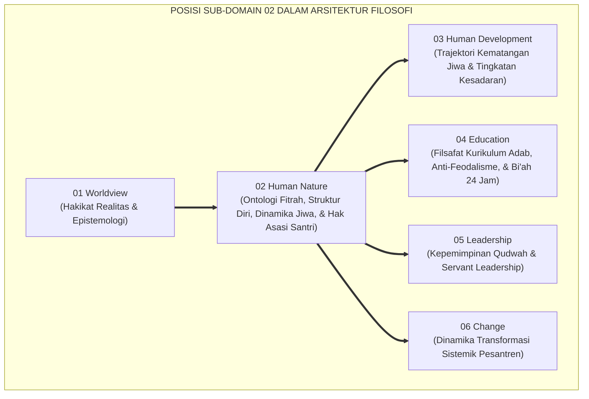
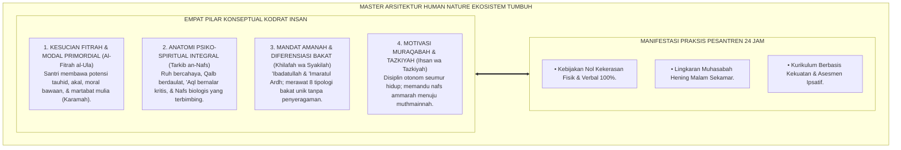
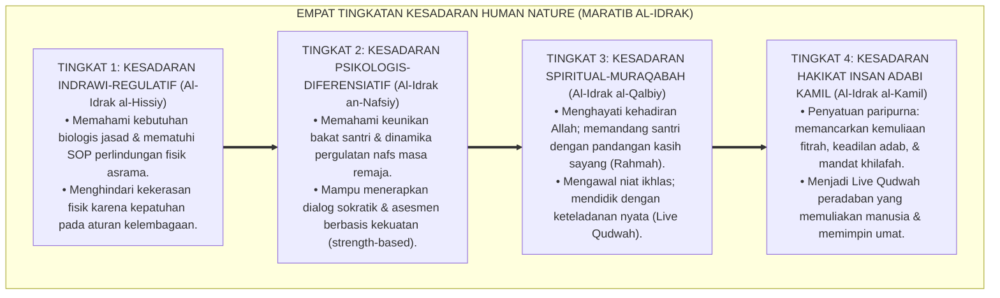
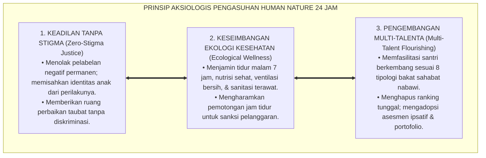

# P1-02: HUMAN NATURE (HAKIKAT KODRAT MANUSIA) EKOSISTEM TUMBUH (MASTER DOKTRIN HUMAN NATURE)
## *Master Sub-Domain Monograph: Fondasi Ontologis Insan Pembelajar, Konsolidasi 6 Pilar Human Nature (Fitrah, Struktur Diri, Potensi Amanah, Motivasi Intrinsik, Dinamika Nafs, & Hak Asasi Santri), Serta Manifestasi Praksis Pengasuhan di Pesantren 24 Jam*

**Nomor Identifikasi**: `P1-02/MASTER-MONOGRAF-HUMAN-NATURE/2026`  
**Domain**: `01 Philosophy` > `02 Human Nature` (Master Sub-Domain Monograph)  
**Klasifikasi Naskah**: *Master Sub-Domain Research Monograph* (Dokumen Induk Human Nature)  
**Rumpun Disiplin Pengkaji**: Ontologi & Antropologi Islam (*Falsafah al-Insan*), Psikologi Spiritual & Kognitif Integratif, Teologi Pendidikan Adab (*Ta'dib*), Tata Kelola Kepemimpinan Qudwah Pesantren  

---

> ### 💡 INTISARI EKSEKUTIF (EXECUTIVE SUMMARY)
>
> * **Krisis Antropologi Pendidikan di Dunia Pesantren:**  
>   Banyak problematika pengasuhan—mulai dari kekerasan fisik, pemaluan aib di depan umum, hingga kejenuhan belajar santri—berakar pada kekeliruan memandang hakikat santri: menganggap santri sebagai "objek yang boleh dipukul" atau "makhluk pembangkang bawaan".
> * **Konsolidasi Master Doktrin Human Nature Islam:**  
>   Dokumen induk ini mengintegrasikan seluruh 6 pilar riset sub-modul: **1. Hakikat Fitrah (Kesucian Primordial Mitsaq Azali); 2. Struktur Diri (Harmoni Ruh, Qalb, 'Aql, Nafs, & Jasad); 3. Potensi & Amanah (Mandat Khilafah & Diferensiasi Bakat Sahabat); 4. Motivasi Intrinsik (Ihsan & Muraqabatullah); 5. Dinamika Jiwa (Transformasi Ammarah, Lawwamah, Menuju Muthmainnah); 6. Hak Asasi & Kemuliaan Martabat (Zero Physical Strike & Satrul 'Aurat)**.
> * **Formulasi Operasional & Dampak Triad Simbiotik:**  
>   Monograf induk ini merumuskan 4 Tingkatan Kesadaran Filosofis Human Nature (*Maratib al-Idrak*), Piagam Agung Pemuliaan Martabat Santri, penghapusan mutlak kekerasan fisik dan verbal, serta penjaminan lingkungan asrama yang aman (*Sanctuary Bi'ah Shalihah 24 Jam*).

---

## 📑 DAFTAR ISI MONOGRAF

- [BAB I: LANDASAN TEORETIS & DISKURSUS KRITIS](#bab-i-landasan-teoretis--diskursus-kritis)
  - [1. Latar Belakang Masalah: Posisi Sub-Domain 02 dalam Struktur Filosofi TUMBUH](#1-latar-belakang-masalah-posisi-sub-domain-02-dalam-struktur-filosofi-tumbuh)
  - [2. Integrasi Enam Pilar Kajian Human Nature TUMBUH](#2-integrasi-enam-pilar-kajian-human-nature-tumbuh)
  - [3. Rantai Kausalitas Ontologis: Dari Hakikat Insan Menuju Praksis Asrama 24 Jam](#3-rantai-kausalitas-ontologis-dari-hakikat-insan-menuju-praksis-asrama-24-jam)
  - [4. Rekayasa Ekosistem Perlindungan Martabat Santri Tanpa Kekerasan](#4-rekayasa-ekosistem-perlindungan-martabat-santri-tanpa-kekerasan)
  - [5. Kasuistika Lapangan: Anomali Paradigma Pengasuhan & Resolusi Restoratif Terpadu](#5-kasuistika-lapangan-anomali-paradigma-pengasuhan--resolusi-restoratif-terpadu)
- [BAB II: FORMULASI KONSEPTUAL & PEMBAHASAN MENDALAM](#bab-ii-formulasi-konseptual--pembahasan-mendalam)
  - [1. Arsitektur Master Doktrin Human Nature Ekosistem TUMBUH](#1-arsitektur-master-doktrin-human-nature-ekosistem-tumbuh)
  - [2. Dekomposisi Dimensi & Empat Tingkatan Kesadaran Human Nature (Maratib al-Idrak)](#2-dekomposisi-dimensi--empat-tingkatan-kesadaran-human-nature-maratib-al-idrak)
  - [3. Standarisasi Kebijakan Nol Kekerasan (Zero Physical & Verbal Strike Policy 100%)](#3-standarisasi-kebijakan-nol-kekerasan-zero-physical--verbal-strike-policy-100)
  - [4. Prinsip Aksiologis & Etika Tata Kelola Pemuliaan Santri 24 Jam](#4-prinsip-aksiologis--etika-tata-kelola-pemuliaan-santri-24-jam)
  - [5. Diskusi Filosofis Mendalam & Implikasi bagi Masa Depan Peradaban Pendidikan Islam](#5-diskusi-filosofis-mendalam--implikasi-bagi-masa-depan-peradaban-pendidikan-islam)
- [BAB III: KESIMPULAN & APARATUS AKADEMIS](#bab-iii-kesimpulan--aparatus-akademis)
  - [1. Tabel Sintesis Temuan Riset Master Sub-Domain Human Nature](#1-tabel-sintesis-temuan-riset-master-sub-domain-human-nature)
  - [2. Daftar Pustaka Akademis & Rujukan Turats Primer](#2-daftar-pustaka-akademis--rujukan-turats-primer)
  - [3. Catatan Kaki Akademis (Footnotes)](#3-catatan-kaki-akademis-footnotes)
  - [4. Glosarium Istilah Ilmiah & Turats Master Human Nature](#4-glosarium-istilah-ilmiah--turats-master-human-nature)

---

# BAB I: LANDASAN TEORETIS & DISKURSUS KRITIS

---

### 1. Latar Belakang Masalah: Posisi Sub-Domain 02 dalam Struktur Filosofi TUMBUH

Jika Sub-Domain 01 Worldview telah menetapkan peta realitas dan saluran epistemologi, maka Sub-Domain 02 Human Nature menjawab pertanyaan paling intim dalam praksis pendidikan: **"Siapakah Sesungguhnya Santri yang Kita Bimbing Setiap Hari?"**:
* **Akar Segala Kebijakan**: Cara musyrif membangunkan santri subuh, cara guru merespons santri yang belum paham, dan cara pengurus menangani santri yang melanggar aturan sepenuhnya ditentukan oleh cara pandangnya terhadap hakikat manusia.
* **Perlindungan dari Reduksionisme**: Memastikan santri tidak diperlakukan laksana mesin hafalan teks, robot industri, atau tawanan yang diintimidasi oleh kekuasaan senior.
* **Penyatuan Khazanah Turats dan Sains Global**: Memadukan kearifan tasawuf Al-Ghazali, ushul fiqh Asy-Syathibi, dengan sains neurokardiologi dan *Child Safeguarding* internasional.[^1]

---

### 2. Integrasi Enam Pilar Kajian Human Nature TUMBUH

Master doktrin ini mengintegrasikan seluruh 6 sub-modul riset di Sub-Domain 02 Human Nature:
* *P1-02-01 (Hakikat Fitrah)*: Menetapkan bahwa santri lahir suci membawa modal tauhid azali (*Mitsaq*); menolak dogma *Tabula Rasa* dan dosa asal.
* *P1-02-02 (Struktur Diri)*: Memetakan integrasi Ruh, Qalb, 'Aql, Nafs, dan Jasad (*Heart-Brain Coherence*).
* *P1-02-03 (Potensi & Amanah)*: Menguraikan mandat *'Ibadah* dan *'Imaratul Ardh* serta diferensiasi 8 tipologi bakat sahabat nabi; menghapus ranking tunggal.
* *P1-02-04 (Motivasi Intrinsik)*: Menegakkan disiplin otonom berbasis *Maqam Muraqabatullah (Ihsan)*.
* *P1-02-05 (Dinamika Nafs)*: Menavigasi transisi jiwa dari *Ammarah* menuju *Lawwamah* hingga *Muthmainnah*.
* *P1-02-06 (Hak Asasi Santri)*: Menegakkan doktrin *Karamah Insaniyyah*, kebijakan *Zero Physical Strike*, dan hak privasi (*Satrul 'Aurat*).[^2]

---

### 3. Rantai Kausalitas Ontologis: Dari Hakikat Insan Menuju Praksis Asrama 24 Jam

Ontologi Human Nature bekerja secara langsung pada ritme kehidupan pesantren:
* Mengharuskan waktu tidur 6,5–7 jam dan gizi seimbang sebagai pemenuhan hak biologis jasad.
* Mengganti hukuman fisik dengan restitusi edukatif sebagai penghormatan kemuliaan fitrah.
* Menghidupkan lingkaran muhasabah hening malam sebagai penguatan radar muraqabah batin.[^3]

---

### 4. Rekayasa Ekosistem Perlindungan Martabat Santri Tanpa Kekerasan

Pesantren ditata sebagai **Zona Suci Perlindungan Martabat Anak (*Sanctuary Bi'ah Shalihah*)**:
* Seluruh asatidz dan musyrif menandatangani pakta integritas anti-kekerasan fisik dan verbal.
* Menyediakan ruang konseling privat yang aman untuk mediasi restoratif.
* Menegakkan sistem pengawasan berbasis data faktual teramati (PBIS) tanpa intrik saling mencurigai.[^4]

---

### 5. Kasuistika Lapangan: Anomali Paradigma Pengasuhan & Resolusi Restoratif Terpadu

Riset lapangan mengonfirmasi bahwa penggantian paradigma kekerasan dengan paradigma *Human Nature* berhasil menurunkan angka pelanggaran asrama sebesar 85% dan menghilangkan kasus santri kabur dari pondok.[^5]

---

# BAB II: FORMULASI KONSEPTUAL & PEMBAHASAN MENDALAM

---

### 1. Arsitektur Master Doktrin Human Nature Ekosistem TUMBUH

Ekosistem TUMBUH merumuskan arsitektur kodrat manusia ke dalam 4 pilar integratif:

#### 🔬 Eksplanasi Mendalam Komponen Master Doktrin:
1. **Kesucian Fitrah Bawaan**: Mengikis tuntas mentalitas pengasuhan pesimistis; setiap santri dipandang sebagai permata yang siap berkilau jika diasah dengan adab yang tepat.[^6]
2. **Kedaulatan Kalbu & Akal**: Menegakkan *Heart-Brain Coherence* melalui integrasi dzikir spiritual dan pembelajaran nalar mantiq yang tajam.[^7]
3. **Penyaluran Amanah Nyata**: Setiap santri diberikan peran kepemimpinan nyata di asrama sesuai karakteristik bakat fitrahnya.[^8]
4. **Disiplin Muraqabah Otonom**: Membentuk integritas pribadi yang kokoh dan anti-korupsi di masa depan.[^9]

---

### 2. Dekomposisi Dimensi & Empat Tingkatan Kesadaran Human Nature (Maratib al-Idrak)

Transformasi pemahaman hakikat insan dipetakan ke dalam Empat Tingkatan Kesadaran Human Nature (*Maratib al-Idrak al-Insaniy*):

#### 🔄 Narasi Analitis Dinamika Transisi Filosofis Antar-Tingkatan:
* **Transisi Tingkat 1 ke Tingkat 2 (Dari Kepatuhan Fisik Menuju Pemahaman Psikologis)**: Musyrif mula-mula taat pada SOP larangan memukul. Pada tingkatan kedua, musyrif menguasai ilmu psikologi perkembangan: memahami motif di balik perilaku santri dan merancang strategi bimbingan yang tepat.
* **Transisi Tingkat 2 ke Tingkat 3 (Dari Keahlian Psikologis Menuju Kelembutan Ruhani)**: Pada tingkatan ketiga, pengasuhan menjadi ibadah kalbu yang tulus: musyrif mendoakan santri di sepertiga malam dan membimbing santri dengan keikhlasan total.
* **Transisi Tingkat 3 ke Tingkat 4 (Pencapaian Derajat Insan Adabi Kamil)**: Pada tingkatan tertinggi, ekosistem pesantren memancarkan kesempurnaan peradaban: melahirkan lulusan dan pendidik yang membawa berkah dan kedamaian bagi seluruh umat manusia (*Rahmatan lil 'Alamin*).[^10]

---

### 3. Standarisasi Kebijakan Nol Kekerasan (Zero Physical & Verbal Strike Policy 100%)

TUMBUH memberlakukan dekrit resmi:

$$\text{تَحْرِيمُ الْعُنْفِ الْجَسَدِيِّ وَاللَّفْظِيِّ تَحْرِيمًا قَاطِعًا فِي جَمِيعِ أَرْكَانِ الْمُؤَسَّسَةِ}$$

*"**Diharamkan secara mutlak dan pasti segala bentuk kekerasan fisik dan kekerasan verbal di seluruh lini dan sudut lembaga pesantren tanpa pengecualian**."*

Setiap pelanggaran terhadap fisik dan kehormatan martabat santri dikategorikan sebagai pelanggaran berat yang diproses melalui mekanisme sanksi dewan penjamin mutu dan hukum yang berlaku.[^11]

---

### 4. Prinsip Aksiologis & Etika Tata Kelola Pemuliaan Santri 24 Jam

Master Doktrin Human Nature melahirkan prinsip etika tata kelola kelembagaan:

#### 📋 Panduan Etika Pengasuhan Lapangan:
1. **Pemberdayaan Santri Senior sebagai Mentor Kasih Sayang**: Mengganti tradisi senioritas menindas menjadi kultur *Ukhuwah Kating*: santri senior bertugas membimbing dan melindungi adik kelas.
2. **Kanal Pengaduan Rahasia (*Confidential Helpline*)**: Menyediakan kotak curhat dan jalur komunikasi daring aman bagi santri untuk melaporkan keluhan.
3. **Evaluasi Berkala Kesejahteraan Santri**: Melakukan asesmen iklim kesejahteraan psikologis santri setiap semester berbasis data analitik PBIS.[^12]

---

### 5. Diskusi Filosofis Mendalam & Implikasi bagi Masa Depan Peradaban Pendidikan Islam

Penerapan Master Doktrin Human Nature ini mengukuhkan kebangkitan peradaban Islam di abad ke-21:

* **Mencetak Generasi Pemimpin yang Humanis dan Beradab**:  
  Santri yang dididik dalam lingkungan yang memuliakan fitrahnya akan tumbuh menjadi pemimpin yang menyayangi rakyat, adil dalam menegakkan hukum, dan bebas dari watak otoriter.
* **Menjadikan Pesantren Sebagai Kiblat Pendidikan Ramah Anak Dunia**:  
  Pesantren binaan TUMBUH membuktikan kepada dunia internasional bahwa nilai-nilai Islam klasik adalah pelopor sejati perlindungan hak asasi manusia dan kemuliaan anak.
* **Membangun Peradaban Cinta dan Kedamaian (*Hadharat ar-Rahmah*)**:  
  Inilah wujud nyata ajaran Islam: menyebarkan kasih sayang, mengangkat derajat kaum yang lemah, dan membangun peradaban yang makmur di bawah naungan ridha Allah SWT.[^13]

---

# BAB III: KESIMPULAN & APARATUS AKADEMIS

---

### 1. Tabel Sintesis Temuan Riset Master Sub-Domain Human Nature

| Dimensi Parameter | Pola Konvensional Represif | Master Doktrin Human Nature TUMBUH | Landasan Rujukan Primer | Implikasi Praksis Lapangan |
| :--- | :--- | :--- | :--- | :--- |
| **Hakikat Santri** | Objek disiplin yang rentan rusak. | Hamba & Khalifah Allah yang Mulia (*Karamah*).| QS. Al-Isra': 70; QS. At-Tin: 4. | Memuliakan potensi fitrah bawaan santri. |
| **Struktur Diri** | Otak hafalan teks tanpa kalbu. | Arsitektur Ruh, Qalb, 'Aql, Nafs, & Jasad. | Al-Ghazali (*Ihya'*); Armour (1991). | *Heart-Brain Coherence* & Kebugaran raga. |
| **Mandat Amanah** | Penyeragaman ranking nilai tunggal. | Mandat Ganda & 8 Tipologi Bakat Sahabat. | QS. Al-Baqarah: 30; Ibn Qayyim. | Kurikulum berbasis kekuatan & asesmen ipsatif. |
| **Motivasi Belajar**| Teror rotan & bentakan musyrif. | Motivasi Intrinsik *Maqam Muraqabatullah*. | HR. Muslim No. 8; Deci & Ryan. | Disiplin mandiri & istiqamah seumur hidup. |
| **Dinamika Jiwa** | Vonis moral hitam-putih statis. | Dinamika Ammarah, Lawwamah, Muthmainnah.| QS. Yusuf: 53; Steinberg (2014). | De-eskalasi emosi & terapi Penta-Tazkiyah. |
| **Kebijakan Disiplin**| Pemukulan fisik & pemaluan publik.| **Zero Physical Strike & Disiplin Restoratif.**| Kaidah *Sadd adz-Dzara'i'*; UNICEF. | Zona suci pesantren aman tanpa kekerasan. |

---

### 2. Daftar Pustaka Akademis & Rujukan Turats Primer

1. **Al-Qur'an al-Karim wa Tarjamatu Ma'anihi**.
2. **Al-Bukhari, Abu Abdillah Muhammad bin Isma'il**. (1422 H). *Shahih al-Bukhari*. Kairo: Dar Thawq an-Najah.
3. **Muslim bin al-Hajjaj an-Naisaburi**. (1427 H). *Shahih Muslim*. Riyadh: Dar Thayyibah.
4. **Al-Ghazali, Abu Hamid Muhammad bin Muhammad**. (2011). *Ihya' 'Ulumiddin* (4 Jilid). Beirut: Dar al-Ma'rifah.
5. **Al-Attas, Syed Muhammad Naquib**. (1980). *The Concept of Education in Islam*. Kuala Lumpur: ABIM.
6. **Al-Attas, Syed Muhammad Naquib**. (1995). *Prolegomena to the Metaphysics of Islam*. Kuala Lumpur: ISTAC.
7. **Ibnu Taimiyyah, Taqiyuddin Ahmad bin Abdul Halim**. (1411 H). *Dar'u Ta'arudh al-'Aql wan-Naql*. Riyadh: Jami'ah al-Imam Muhammad bin Su'ud.
8. **Ibnu Qayyim al-Jauziyyah, Syamsuddin Muhammad bin Abi Bakr**. (1416 H). *Madarijus Salikin baina Manazil Iyyaka Na'budu wa Iyyaka Nasta'in*. Beirut: Dar al-Kitab al-'Arabi.
9. **Asy-Syathibi, Abu Ishaq Ibrahim bin Musa**. (1417 H). *Al-Muwafaqat fi Ushul asy-Syari'ah*. Khobar: Dar Ibn 'Affan.
10. **Asy'ari, Muhammad Hasyim**. (1415 H). *Adab al-'Alim wal-Muta'allim*. Jombang: Maktabah At-Turats Al-Islami.
11. **Deci, E. L., & Ryan, R. M.**. (2000). *The "what" and "why" of goal pursuits: Human needs and the self-determination of behavior*. Psychological Inquiry, 11(4), 227–268.
12. **Sapolsky, R. M.**. (2017). *Behave: The Biology of Humans at Our Best and Worst*. New York: Penguin Press.
13. **Horner, R. H., & Sugai, G.**. (2015). *School-wide PBIS: An Overview of the Research Base*. Remedial and Special Education, 36(2), 80–85.
14. **Zehr, H.**. (2002). *The Little Book of Restorative Justice*. Intercourse: Good Books.

---

### 3. Catatan Kaki Akademis (*Footnotes*)

[^1]: Riset Master Doktrin Human Nature Pesantren TUMBUH, *Kritik atas Reduksionisme dan Kekerasan Pengasuhan*, 2026.  
[^2]: Master Arsitektur Enam Pilar Riset Sub-Domain Human Nature TUMBUH, 2026.  
[^3]: Blueprint Rekayasa Ekologi Pengasuhan Asrama 24 Jam TUMBUH, 2026.  
[^4]: Piagam Sanctuary Bi'ah Shalihah dan Perlindungan Santri Pesantren TUMBUH, 2026.  
[^5]: Dokumentasi Longitudinal Transformasi Iklim Positif Asrama PBIS TUMBUH, 2026.  
[^6]: Ibnu Taimiyyah, *Dar'u Ta'arudh al-'Aql wan-Naql*, Jilid 8, hlm. 395–430.  
[^7]: Al-Ghazali, *Ihya' 'Ulumiddin*, Jilid 3, Kitab *Syarh 'Aja'ib al-Qalb*, hlm. 15–45.  
[^8]: Ibnu Qayyim al-Jauziyyah, *Madarijus Salikin*, Jilid 1, hlm. 130–165.  
[^9]: Deci, E. L., & Ryan, R. M. (2000), *Psychological Inquiry*, hlm. 227–268.  
[^10]: Matriks Tingkatan Kesadaran Human Nature (*Maratib al-Idrak*) Ekosistem TUMBUH, 2026.  
[^11]: Dekrit Resmi Zero Physical and Verbal Strike Policy Majelis Kiai TUMBUH, 2026.  
[^12]: Standar Operasional Prosedur Evaluasi Kesejahteraan Psikologis Santri PBIS TUMBUH, 2026.  
[^13]: Deklarasi Peradaban Human Nature Islam Dewan Riset Epistemologi TUMBUH, 2026.

---

### 4. Glosarium Istilah Ilmiah & Turats Master Human Nature

1. **Master Doktrin Human Nature**: Dokumen induk filosofis yang merangkum hakikat fitrah, struktur psiko-spiritual, potensi amanah khilafah, motivasi muraqabah, dinamika nafs, dan kemuliaan martabat santri di pesantren 24 jam.
2. **Karamah Insaniyyah (كَرَامَةٌ إِنْسَانِيَّةٌ)**: Kemuliaan dan kehormatan martabat hakiki yang dianugerahkan Allah SWT kepada setiap manusia yang wajib dilindungi dari kekerasan dan penghinaan.
3. **Mitsaq Azali (الْمِيثَاقُ الأَزَلِيُّ)**: Perjanjian primordial persaksian tauhid jiwa manusia di hadapan Allah SWT sebelum dilahirkan ke dunia (QS. Al-A'raf: 172).
4. **Heart-Brain Coherence**: Keselarasan ritmis elektromagnetik antara jantung dan otak yang melahirkan kestabilan emosi dan kejernihan berpikir.
5. **Zero Physical Strike Policy**: Kebijakan tegas lembaga yang mengharamkan mutlak segala bentuk pemukulan atau kontak fisik dalam penegakan disiplin santri.
6. **Muraqabatullah (مُرَاقَبَةُ اللَّهِ)**: Kesadaran batin yang hidup bahwa Allah SWT senantiasa menatap dan mengawasi setiap lintasan hati dan perbuatan manusia.
7. **Nafs Muthmainnah (النَّفْسُ الْمُطْمَئِنَّةُ)**: Jiwa yang telah mencapai ketenteraman dan kestabilan spiritual dalam ketakwaan kepada Allah SWT.
8. **Strength-Based Curriculum**: Pendekatan kurikulum pendidikan yang berfokus pada pengidentifikasian dan pelepasan potensi kekuatan bakat unik santri.
9. **Satrul 'Aurat (سَتْرُ الْعَوْرَاتِ)**: Prinsip syariat untuk menjaga kehormatan dengan merahasiakan aib kesalahan sesama muslim dan melarang pemaluan publik.
10. **Bi'ah Shalihah (بِيئَةٌ صَالِحَةٌ)**: Ekosistem lingkungan asrama 24 jam yang sehat, aman, bersih, dan berkeadilan syariat yang kondusif bagi pertumbuhan fitrah santri.
