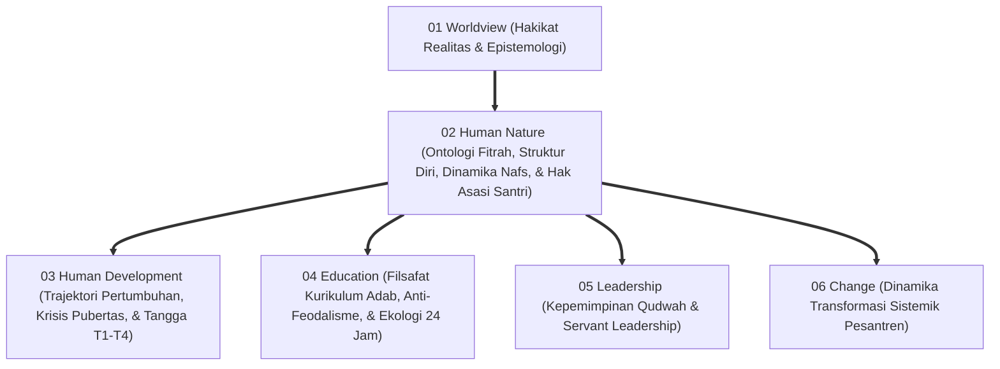
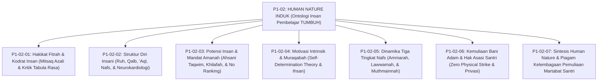
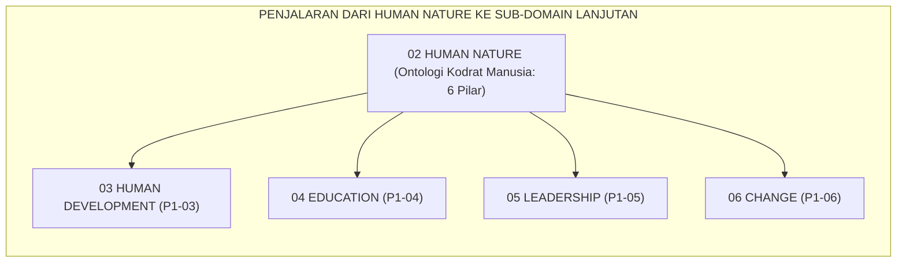

# P1-02: HUMAN NATURE (HAKIKAT KODRAT MANUSIA) EKOSISTEM TUMBUH
## *Monograf Induk Sub-Domain 02: Fondasi Ontologis Insan Pembelajar, Rekapitulasi 6 Pilar Human Nature (Fitrah, Struktur Diri, Potensi Amanah, Motivasi Intrinsik, Dinamika Nafs, & Hak Asasi Santri), Matriks Epistemologis, & Piagam Kelembagaan Pemuliaan Martabat Santri*

**Nomor Identifikasi**: `P1-02/MONOGRAF-INDUK-HUMAN-NATURE/2026`  
**Domain**: `01 Philosophy` > `02 Human Nature`  
**Klasifikasi Naskah**: *Master Sub-Domain Monograph* (Monograf Induk Sub-Domain Ontologi Manusia)  
**Rumpun Disiplin Pengkaji**: Ontologi & Antropologi Islam (*Falsafah al-Insan*), Psikologi Spiritual & Kognitif Integratif, Teologi Pendidikan Adab (*Ta'dib*), Tata Kelola Kepemimpinan Qudwah Pesantren  

---

> ### 💡 INTISARI PRAKTIS (3 MENIT PAHAM UNTUK ASATIDZ & MUSYRIF)
>
> * **Posisi Sub-Domain 02 Human Nature:**  
>   Menjawab pertanyaan paling fundamental dalam pendidikan: *"Siapakah sesungguhnya santri yang kita bimbing setiap hari?"*
> * **Enam Pilar Kodrat Santri yang Terintegrasi 100%:**  
>   1. **P1-02-01 (Fitrah Suci)**: Santri lahir membawa modal tauhid azali (*Mitsaq*); bukan kertas kosong (*Tabula Rasa*) dan bukan pemikul dosa asal.  
>   2. **P1-02-02 (Struktur Diri)**: Paduan harmonis Ruh, Qalb (Raja Pemimpin), Akal (Perdana Menteri), dan Nafsu (Prajurit Energi Ragawi).  
>   3. **P1-02-03 (Potensi & Amanah)**: Diciptakan dalam *Ahsani Taqwim* memikul amanah *'Ibadah* dan *'Imaratul Ardh*. Setiap santri memiliki sidik jari bakat unik; hapus ranking tunggal!  
>   4. **P1-02-04 (Motivasi Muraqabah)**: Disiplin mandiri otonom yang lahir dari cinta dan rasa diawasi oleh Allah SWT (*Ihsan*), bukan karena teror tongkat musyrif.  
>   5. **P1-02-05 (Dinamika Tiga Tingkat Nafs)**: Menavigasi transisi jiwa santri dari *Ammarah* menuju *Lawwamah* (regulasi diri) hingga *Muthmainnah* (ketenangan takwa).  
>   6. **P1-02-06 (Kemuliaan Martabat & Hak Asasi Santri)**: Perlindungan mutlak atas martabat bani Adam (QS. 17:70), kebijakan nol kekerasan (*Zero Physical Strike*), dan hak privasi kerahasiaan (*Satrul 'Aurat*).
> * **Pemberhentian Mutlak Praktik Kekerasan:**  
>   Segala bentuk pemukulan fisik, pembentakan, pelabelan hina, penelanjangan aib di apel, dan pemaksaan ranking tunggal dinyatakan **HARAM DAN BATAL** di seluruh ekosistem pesantren TUMBUH.

---

## 📑 DAFTAR ISI MONOGRAF INDUK

- [BAGIAN I: ARSITEKTUR ONTOLOGIS & POHON HUBUNGAN SUB-DOMAIN 02](#bagian-i-arsitektur-ontologis--pohon-hubungan-sub-domain-02)
  - [1. Posisi Dokumen dalam Taksonomi 11 Domain TUMBUH](#1-posisi-dokumen-dalam-taksonomi-11-domain-tumbuh)
  - [2. Pohon Hubungan Antar-Monograf Sub-Domain 02 Human Nature](#2-pohon-hubungan-antar-monograf-sub-domain-02-human-nature)
  - [3. Rangkuman 6 Pilar Kodrat Insan Pembelajar Ekosistem TUMBUH](#3-rangkuman-6-pilar-kodrat-insan-pembelajar-ekosistem-tumbuh)
  - [4. Matriks Komitmen Perlindungan Fitrah (Zero Tolerance Policy 100%)](#4-matriks-komitmen-perlindungan-fitrah-zero-tolerance-policy-100)
- [BAGIAN II: KODIFIKASI MATRIKS RESMI & DIREKTORI MONOGRAF TERPADU](#bagian-ii-kodifikasi-matriks-resmi--direktori-monograf-terpadu)
  - [1. Matriks Rujukan Lengkap 7 Berkas Monograf Sub-Domain 02](#1-matriks-rujukan-lengkap-7-berkas-monograf-sub-domain-02)
  - [2. Alur Penjalaran Filosofis Menuju 4 Sub-Domain Lanjutan (P1-03 s/d P1-06)](#2-alur-penjalaran-filosofis-menuju-4-sub-domain-lanjutan-p1-03-sd-p1-06)
- [BAGIAN III: APARATUS AKADEMIS & APENDIKS](#bagian-iii-aparatus-akademis--apendiks)
  - [1. Daftar Pustaka Otoritatif Turats & Sains Global](#1-daftar-pustaka-otoritatif-turats--sains-global)
  - [2. Catatan Kaki Akademis (Footnotes)](#2-catatan-kaki-akademis-footnotes)
  - [3. Glosarium Istilah Kunci Human Nature Induk](#3-glosarium-istilah-kunci-human-nature-induk)

---

# BAGIAN I: ARSITEKTUR ONTOLOGIS & POHON HUBUNGAN SUB-DOMAIN 02

---

### 1. Posisi Dokumen dalam Taksonomi 11 Domain TUMBUH

---

### 2. Pohon Hubungan Antar-Monograf Sub-Domain 02 Human Nature

Sub-Domain `02 Human Nature` memuat 1 Monograf Induk dan 7 Monograf Riset Khusus yang saling menopang secara utuh:

---

### 3. Rangkuman 6 Pilar Kodrat Insan Pembelajar Ekosistem TUMBUH

1. **Pilar 1: Fitrah Kesucian Primordial (P1-02-01)**:  
   Santri adalah makhluk mulia (*Mukarram*) yang lahir membawa cetak biru fitrah tauhid (*Hanif*) dan kompas moral kebaikan bawaan. Mengubur mitos kertas kosong *Tabula Rasa* dan dogma dosa warisan.
2. **Pilar 2: Struktur Psiko-Spiritual Berlapis (P1-02-02)**:  
   Integrasi empat daya: *Ar-Ruh*, *Al-Qalb* (raja moral & sirkuit neurokardiologi 40.000 neuron), *Al-'Aql* (perdana menteri nalar/Prefrontal Cortex), dan *An-Nafs* (pasukan energi biologis yang didisiplinkan melalui *Tazkiyah*).
3. **Pilar 3: Potensi Ahsani Taqwim & Mandat Khilafah (P1-02-03)**:  
   Penciptaan dalam bentuk terbaik memikul dua mandat: *'Ibadatullah* dan *'Imaratul Ardh*. Mengakui keragaman sidik jari bakat unik (meneladani 8 tipologi sahabat Nabi SAW) dan menghapus standarisasi perankingan tunggal toksik.
4. **Pilar 4: Motivasi Intrinsik Berbasis Muraqabatullah (P1-02-04)**:  
   Karakter adab mandiri lahir dari pemenuhan kebutuhan *Autonomy*, *Competence*, dan *Relatedness* yang disempurnakan oleh maqam *Muraqabatullah* (Ihsan). Santri berdisiplin atas dasar cinta dan rasa malu kepada Allah, bukan teror pentungan.
5. **Pilar 5: Dinamika Tiga Tingkat Jiwa (P1-02-05)**:  
   Jiwa santri berproses dari dorongan impulsif *Nafs Ammarah*, diolah melalui introspeksi dan penyesalan nurani *Nafs Lawwamah*, hingga mencapai kestabilan takwa *Nafs Muthmainnah* melalui metode terapi *Al-'Ilaju bidh-Dhidd*.
6. **Pilar 6: Kemuliaan Martabat & Hak Asasi Santri (P1-02-06)**:  
   Menegakkan doktrin *Karamah Insaniyyah* (QS. Al-Isra: 70) dan deklarasi Khutbah Wada'. Mengharamkan total segala bentuk hukuman fisik (*Zero Physical Strike Policy*), perpeloncoan feodal, pembentakan publik, dan menjamin hak privasi konseling (*Satrul 'Aurat*).[^1]

---

### 4. Matriks Komitmen Perlindungan Fitrah (*Zero Tolerance Policy 100%*)

| Larangan Mutlak Terhadap Fitrah | Praktik Konvensional yang Dihapus 100% | Alternatif Beradab dalam Ekosistem TUMBUH |
| :--- | :--- | :--- |
| **1. Kekerasan & Teror Fisik** | Menampar, memukul dengan rotan, menyiram air malam hari, dan push-up berlebihan. | **Disiplin Restoratif Firm & Kind**: Konsekuensi logis 4R dan dialog pemulihan jiwa.[^2] |
| **2. Perendahan Martabat Verbal** | Membentak, melabeli bodoh/pemalas, mencukur paksa botak di depan umum, dan papan aib. | **Bimbingan Empat Mata 1-on-1**: Nasihat santun, penjagaan aib (*Satrul 'Aurat*), dan muhasabah hening malam. |
| **3. Eksploitasi Feodal Senior** | Senioritas kamar gelap, memukul junior, menyuruh mencuci baju, dan perpeloncoan. | **Kaderisasi Servant Leadership**: Santri senior menjadi Duta Adab dan mentor kasih sayang. |
| **4. Penyeragaman Ranking Toksik** | Membandingkan anak, memajang ranking 1-30, dan mengabaikan bakat non-hafalan. | **Asesmen Pertumbuhan Ipsatif & Portofolio Bakat**: Menghargai kemajuan pribadi santri.[^3] |

---

# BAGIAN II: KODIFIKASI MATRIKS RESMI & DIREKTORI MONOGRAF TERPADU

---

### 1. Matriks Rujukan Lengkap 7 Berkas Monograf Sub-Domain 02

| No | Nomor ID Berkas | Judul Monograf Terpadu | Fokus Kajian & Tautan Berkas |
| :---: | :--- | :--- | :--- |
| **01** | `P1-02-01` | [**`P1-02-01: Hakikat Fitrah & Kodrat Insan`**](./P1-02-01-Hakikat-Fitrah.md) | Ontologi kesucian primordial, Mitsaq azali (QS. 7:172), kritik Tabula Rasa Locke & Hobbes, Innate Morality Paul Bloom Yale (42 Catatan Kaki). |
| **02** | `P1-02-02` | [**`P1-02-02: Struktur Diri Insani`**](./P1-02-02-Struktur-Diri-Insani.md) | Arsitektur Ruh, Qalb, 'Aql, Nafs; Kerajaan Jiwa Al-Ghazali; Tripartite Plato; Neurokardiologi J. Andrew Armour; Daily Coherence (42 Catatan Kaki). |
| **03** | `P1-02-03` | [**`P1-02-03: Potensi & Mandat Amanah`**](./P1-02-03-Potensi-dan-Amanah.md) | Ahsani Taqwim vs Asfala Safilin; Amanah Khilafah & Imaratul Ardh; 8 bakat sahabat Nabi; Multiple Intelligences Gardner; No Ranking (40 Catatan Kaki). |
| **04** | `P1-02-04` | [**`P1-02-04: Motivasi Intrinsik & Muraqabah`**](./P1-02-04-Motivasi-Intrinsik-Santri.md) | Dekonstruksi kepatuhan semu; Self-Determination Theory (Deci & Ryan); Maqam Muraqabah Al-Qusyairi; Nightly Muraqabah Circle (41 Catatan Kaki). |
| **05** | `P1-02-05` | [**`P1-02-05: Dinamika Tiga Tingkat Nafs`**](./P1-02-05-Dinamika-Nafs-Ammarah-Lawwamah-Muthmainnah.md) | Epistemologi Maratib an-Nafs (Ammarah, Lawwamah, Muthmainnah); Dual-Systems Neurosains Steinberg; Terapi Al-'Ilaju bidh-Dhidd (11 Catatan Kaki). |
| **06** | `P1-02-06` | [**`P1-02-06: Kemuliaan Martabat & Hak Asasi`**](./P1-02-06-Kemuliaan-Bani-Adam-dan-Hak-Asasi-Santri.md) | Karamah Bani Adam (QS. 17:70); Khutbah Wada' (HR. Bukhari 1741); Sadd adz-Dzara'i' Zero Physical Strike; Hak Privasi Satrul 'Aurat (12 Catatan Kaki). |
| **07** | `P1-02-07` | [**`P1-02-07: Sintesis Human Nature`**](./P1-02-07-Sintesis-Human-Nature.md) | Konsolidasi 6 pilar; uji bebas kontradiksi; jembatan ke Sub-Domain 03 Human Development; Grand Charter Pemuliaan Martabat Santri (10 Catatan Kaki). |

---

### 2. Alur Penjalaran Filosofis Menuju 4 Sub-Domain Lanjutan (P1-03 s/d P1-06)

---

# BAGIAN III: APARATUS AKADEMIS & APENDIKS

---

### 1. Daftar Pustaka Otoritatif Turats & Sains Global

1. **Al-Attas, Syed Muhammad Naquib.** (1990). *The Nature of Man and the Psychology of the Human Soul*. Kuala Lumpur: ISTAC.
2. **Al-Bukhari, Abu Abdullah Muhammad bin Ismail.** (2002). *Shahih al-Bukhari*. Beirut: Dar Thawq an-Najah.
3. **Al-Ghazali, Abu Hamid Muhammad bin Muhammad.** (2004). *Ihya' 'Ulumiddin*. Kairo: Dar al-Hadits.
4. **Ibnu Miskawaih, Abu Ali Ahmad bin Muhammad.** (2011). *Tahdzib al-Akhlaq wa Tathhir al-A'raq*. Kairo: Dar al-Kutub al-Mishriyyah.
5. **Ibn Taimiyyah, Taqiuddin Ahmad.** (1991). *Dar' Ta'arudh al-'Aql wan-Naql*. Riyadh: Jami'ah al-Imam.
6. **Bloom, Paul.** (2013). *Just Babies: The Origins of Good and Evil*. New York: Crown Publishers.
7. **Deci, Edward L., & Ryan, Richard M.** (2000). *The Self-Determination Theory of Behavior*. Psychological Inquiry, 11(4), 227–268.
8. **Steinberg, L.** (2008). *A social neuroscience perspective on adolescent risk-taking*. Developmental Review, 28(1), 78–106.
9. **UNICEF.** (2017). *A Familiar Face: Violence in the lives of children and adolescents*. New York: UNICEF.
10. **Edmondson, A.** (1999). *Psychological safety and learning behavior in work teams*. Administrative Science Quarterly, 44(2), 350–383.

---

### 2. Catatan Kaki Akademis (*Footnotes*)

[^1]: Syed Muhammad Naquib Al-Attas, *The Nature of Man* (ISTAC, 1990), hlm. 1–35; Abu Hamid Al-Ghazali, *Ihya' 'Ulumiddin* (Dar al-Hadits, 2004), Juz III, hlm. 5–25.  
[^2]: UU RI No. 35 Tahun 2014, Pasal 54; PMA No. 73 Tahun 2022; UNICEF (2017), *Child Safeguarding Reports*.  
[^3]: Dylan Wiliam, *Embedded Formative Assessment* (Solution Tree Press, 2011), hlm. 110–130.

---

### 3. Glosarium Istilah Kunci Human Nature Induk

1. **Human Nature Induk**: Dokumen master yang merangkum 6 pilar ontologi kodrat manusia sebagai hamba berfitrah suci, berdaya 4 lapis, memikul amanah khilafah, berjiwa dinamis, dan memiliki hak asasi yang mulia.
2. **Karamah Insaniyyah**: Kemuliaan hakiki dan martabat luhur yang dianugerahkan Allah SWT kepada setiap anak cucu Adam (QS. Al-Isra: 70).
3. **Zero Physical Strike**: Kebijakan pelarangan mutlak segala bentuk pemukulan atau hukuman fisik dalam pengasuhan pesantren (*Sadd adz-Dzara'i'*).
4. **Satrul 'Aurat**: Kewajiban syariat untuk menutup aib dan catatan kekhilafan santri demi membuka pintu taubat tanpa perendahan martabat publik.
5. **Nafs Ammarah, Lawwamah, Muthmainnah**: Tiga tingkatan metamorfosis jiwa dari dorongan impulsif hewani, kesadaran nurani introspektif, hingga kematangan takwa yang tenang.
6. **Mitsaq Azali**: Kesaksian tauhid primordial di alam arwah yang menjadi dasar pengetahuan intuitif ma'rifatullah pada setiap jiwa santri.
7. **Neurocardiology Coherence**: Sinkronisasi ritme detak jantung (HRV) dengan gelombang otak prefrontal saat santri berdzikir dan menata niat ikhlas.
8. **Strength-Based Curriculum**: Pendekatan kurikulum yang mengidentifikasi dan mengoptimalkan kekuatan bakat unik santri daripada mencela kekurangannya.
9. **Muraqabatullah**: Kesadaran konstan bahwa Allah senantiasa menatap lahir dan batin manusia yang melahirkan disiplin otonom seumur hidup.
10. **Triad Pertumbuhan Simbiotik**: Prinsip di mana perlindungan hak asasi santri secara serempak memuliakan Santri, meningkatkan profesionalisme Pendidik, dan memperkokoh Lembaga.
