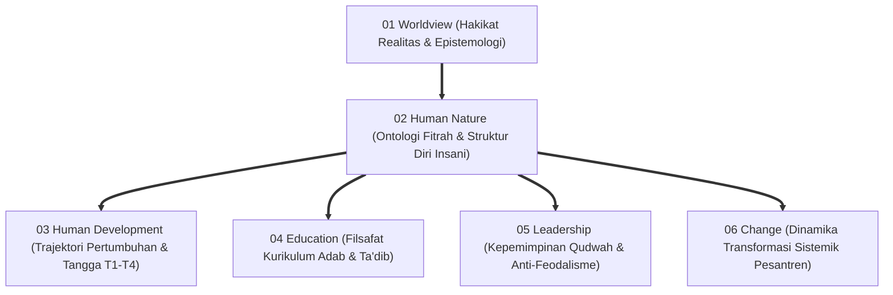
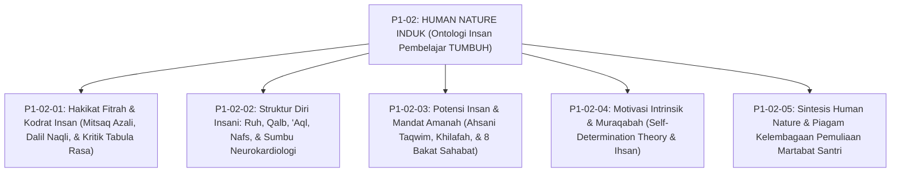
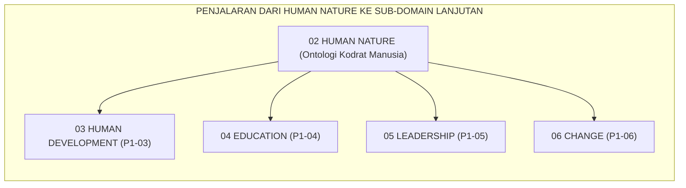

# P1-02: HUMAN NATURE (HAKIKAT KODRAT MANUSIA) EKOSISTEM TUMBUH
## *Monograf Induk Sub-Domain 02: Fondasi Ontologis Insan Pembelajar, Rekapitulasi 4 Pilar Human Nature, Matriks Epistemologis, & Piagam Kelembagaan Pemuliaan Martabat Santri*

**Nomor Identifikasi**: `P1-02/MONOGRAF-INDUK-HUMAN-NATURE/2026`  
**Domain**: `01 Philosophy` > `02 Human Nature`  
**Klasifikasi Naskah**: *Master Sub-Domain Monograph* (Monograf Induk Sub-Domain Ontologi Manusia)  
**Rumpun Disiplin Pengkaji**: Ontologi & Antropologi Islam (*Falsafah al-Insan*), Psikologi Spiritual & Kognitif Integratif, Teologi Pendidikan Adab (*Ta'dib*), Tata Kelola Kepemimpinan Qudwah Pesantren  

---

> ### 💡 INTISARI PRAKTIS (3 MENIT PAHAM UNTUK ASATIDZ & MUSYRIF)
>
> * **Posisi Sub-Domain 02 Human Nature:**  
>   Menjawab pertanyaan paling fundamental dalam pendidikan: *"Siapakah sesungguhnya santri yang kita bimbing setiap hari?"*
> * **Empat Pilar Kodrat Santri yang Terintegrasi 100%:**  
>   1. **P1-02-01 (Fitrah Suci)**: Santri lahir membawa modal tauhid azali (*Mitsaq*); bukan kertas kosong (*Tabula Rasa*) dan bukan pemikul dosa asal.  
>   2. **P1-02-02 (Struktur Diri)**: Paduan harmonis Ruh, Qalb (Raja Pemimpin), Akal (Perdana Menteri), dan Nafsu (Prajurit Energi Ragawi).  
>   3. **P1-02-03 (Potensi & Amanah)**: Diciptakan dalam *Ahsani Taqwim* memikul amanah *'Ibadah* dan *'Imaratul Ardh*. Setiap santri memiliki sidik jari bakat unik sebagaimana para sahabat Nabi SAW; hapus ranking tunggal!  
>   4. **P1-02-04 (Motivasi Muraqabah)**: Disiplin mandiri otonom yang lahir dari cinta dan rasa diawasi oleh Allah SWT (*Ihsan*), bukan karena teror tongkat musyrif.
> * **Pemberhentian Mutlak Praktik Kekerasan:**  
>   Segala bentuk pemukulan fisik, pembentakan, pelabelan hina, dan pemaksaan ranking tunggal dinyatakan **HARAM DAN BATAL** di seluruh ekosistem pesantren TUMBUH.

---

## 📑 DAFTAR ISI MONOGRAF INDUK

- [BAGIAN I: ARSITEKTUR ONTOLOGIS & POHON HUBUNGAN SUB-DOMAIN 02](#bagian-i-arsitektur-ontologis--pohon-hubungan-sub-domain-02)
  - [1. Posisi Dokumen dalam Taksonomi 11 Domain TUMBUH](#1-posisi-dokumen-dalam-taksonomi-11-domain-tumbuh)
  - [2. Pohon Hubungan Antar-Monograf Sub-Domain 02 Human Nature](#2-pohon-hubungan-antar-monograf-sub-domain-02-human-nature)
  - [3. Rangkuman 4 Pilar Kodrat Insan Pembelajar Ekosistem TUMBUH](#3-rangkuman-4-pilar-kodrat-insan-pembelajar-ekosistem-tumbuh)
  - [4. Matriks Komitmen Perlindungan Fitrah (Zero Tolerance Policy 100%)](#4-matriks-komitmen-perlindungan-fitrah-zero-tolerance-policy-100)
- [BAGIAN II: KODIFIKASI MATRIKS RESMI & DIREKTORI MONOGRAF TERPADU](#bagian-ii-kodifikasi-matriks-resmi--direktori-monograf-terpadu)
  - [1. Matriks Rujukan Lengkap 5 Berkas Monograf Sub-Domain 02](#1-matriks-rujukan-lengkap-5-berkas-monograf-sub-domain-02)
  - [2. Alur Penjalaran Filosofis Menuju 4 Sub-Domain Lanjutan (P1-03 s/d P1-06)](#2-alur-penjalaran-filosofis-menuju-4-sub-domain-lanjutan-p1-03-sd-p1-06)
- [BAGIAN III: APARATUS AKADEMIS & APENDIKS](#bagian-iii-aparatus-akademis--apendiks)
  - [1. Daftar Pustaka Otoritatif Turats & Sains Global](#1-daftar-pustaka-otoritatif-turats--sains-global)
  - [2. Catatan Kaki Akademis (Footnotes)](#2-catatan-kaki-akademis-footnotes)
  - [3. Glosarium Istilah Kunci Human Nature Induk](#3-glosarium-istilah-kunci-human-nature-induk)

---

# BAGIAN I: ARSITEKTUR ONTOLOGIS & POHON HUBUNGAN SUB-DOMAIN 02

---

### 1. Posisi Dokumen dalam Taksonomi 11 Domain TUMBUH

Jika **Domain 01 Philosophy > 01 Worldview** menetapkan pandangan alam semesta (*Ru'yatul Islam lil-Wujud*), maka **Domain 01 Philosophy > 02 Human Nature** menetapkan **Hakikat Ontologis Insan yang Menjadi Subjek dan Objek Pendidikan**:

---

### 2. Pohon Hubungan Antar-Monograf Sub-Domain 02 Human Nature

Sub-Domain `02 Human Nature` memuat 1 Monograf Induk dan 5 Monograf Khusus yang saling menopang secara utuh:

---

### 3. Rangkuman 4 Pilar Kodrat Insan Pembelajar Ekosistem TUMBUH

1. **Pilar 1: Fitrah Kesucian Primordial (P1-02-01)**:  
   Santri adalah makhluk mulia (*Mukarram*) yang lahir membawa cetak biru fitrah tauhid (*Hanif*) dan kompas moral kebaikan bawaan (terkonfirmasi riset *Innate Morality* Paul Bloom, Yale). Mengubur mitos kertas kosong *Tabula Rasa* dan dogma *Original Sin*.
2. **Pilar 2: Struktur Psiko-Spiritual Berlapis (P1-02-02)**:  
   Integrasi empat daya: *Ar-Ruh* (substansi transendental), *Al-Qalb* (raja moral & sirkuit neurokardiologi 40.000 neuron), *Al-'Aql* (perdana menteri nalar/Prefrontal Cortex), dan *An-Nafs* (pasukan energi biologis/Sistem Limbik yang didisiplinkan melalui *Tazkiyah*).
3. **Pilar 3: Potensi Ahsani Taqwim & Mandat Khilafah (P1-02-03)**:  
   Penciptaan dalam bentuk terbaik memikul dua mandat: *'Ibadatullah* dan *'Imaratul Ardh*. Mengakui keragaman sidik jari bakat unik (meneladani 8 tipologi sahabat Nabi SAW) dan menghapus standarisasi perankingan tunggal toksik.
4. **Pilar 4: Motivasi Intrinsik Berbasis Muraqabatullah (P1-02-04)**:  
   Karakter adab mandiri lahir dari pemenuhan kebutuhan *Autonomy*, *Competence*, dan *Relatedness* yang disempurnakan oleh maqam *Muraqabatullah* (Ihsan). Santri berdisiplin atas dasar cinta dan rasa malu kepada Allah, bukan teror pentungan.[^1]

---

### 4. Matriks Komitmen Perlindungan Fitrah (Zero Tolerance Policy 100%)

| Larangan Mutlak Terhadap Fitrah | Praktik Konvensional yang Dihapus 100% | Alternatif Beradab dalam Ekosistem TUMBUH |
| :--- | :--- | :--- |
| **1. Kekerasan & Teror Fisik** | Menampar, memukul dengan kayu, menyiram air malam hari, dan push-up berlebihan. | **Disiplin Restoratif Firm & Kind**: Konsekuensi logis 4R dan dialog pemulihan jiwa.[^2] |
| **2. Perendahan Martabat Verbal** | Membentak, melabeli bodoh/pemalas, mencukur paksa botak di depan umum, dan papan aib. | **Bimbingan Empat Mata 1-on-1**: Nasihat santun, penjagaan aib, dan muhasabah hening malam. |
| **3. Eksploitasi Feodal Senior** | Senioritas kamar gelap, memukul junior, menyuruh mencuci baju, dan perpeloncoan. | **Kaderisasi Servant Leadership**: Santri senior menjadi Duta Adab dan mentor kasih sayang. |
| **4. Penyeragaman Ranking Toksik** | Membandingkan anak, memajang ranking 1-30, dan mengabaikan bakat non-hafalan. | **Asesmen Pertumbuhan Ipsatif & Portofolio Bakat**: Menghargai kemajuan pribadi santri.[^3] |

---

# BAGIAN II: KODIFIKASI MATRIKS RESMI & DIREKTORI MONOGRAF TERPADU

---

### 1. Matriks Rujukan Lengkap 5 Berkas Monograf Sub-Domain 02

| No | Nomor ID Berkas | Judul Monograf Terpadu | Fokus Kajian & Tautan Berkas |
| :---: | :--- | :--- | :--- |
| **01** | `P1-02-01` | [**`P1-02-01: Hakikat Fitrah & Kodrat Insan`**](./P1-02-01-Hakikat-Fitrah.md) | Ontologi kesucian primordial, Mitsaq azali (QS. 7:172), kritik Tabula Rasa Locke & Hobbes, Innate Morality Paul Bloom Yale (42 Catatan Kaki). |
| **02** | `P1-02-02` | [**`P1-02-02: Struktur Diri Insani`**](./P1-02-02-Struktur-Diri-Insani.md) | Arsitektur Ruh, Qalb, 'Aql, Nafs; Kerajaan Jiwa Al-Ghazali; Tripartite Plato; Neurokardiologi J. Andrew Armour; Daily Coherence (42 Catatan Kaki). |
| **03** | `P1-02-03` | [**`P1-02-03: Potensi & Mandat Amanah`**](./P1-02-03-Potensi-dan-Amanah.md) | Ahsani Taqwim vs Asfala Safilin; Amanah Khilafah & Imaratul Ardh; 8 bakat sahabat Nabi; Multiple Intelligences Gardner; No Ranking (40 Catatan Kaki). |
| **04** | `P1-02-04` | [**`P1-02-04: Motivasi Intrinsik & Muraqabah`**](./P1-02-04-Motivasi-Intrinsik-Santri.md) | Dekonstruksi kepatuhan semu; Self-Determination Theory (Deci & Ryan); Maqam Muraqabah Al-Qusyairi; Nightly Muraqabah Circle (41 Catatan Kaki). |
| **05** | `P1-02-05` | [**`P1-02-05: Sintesis Human Nature`**](./P1-02-05-Sintesis-Human-Nature.md) | Konsolidasi 4 pilar; uji bebas kontradiksi; jembatan ke Sub-Domain 03 Human Development; Piagam Kelembagaan Pemuliaan Santri (16 Catatan Kaki). |

---

### 2. Alur Penjalaran Filosofis Menuju 4 Sub-Domain Lanjutan (P1-03 s/d P1-06)

---

# BAGIAN III: APARATUS AKADEMIS & APENDIKS

---

### 1. Daftar Pustaka Otoritatif Turats & Sains Global

1. **Al-Attas, Syed Muhammad Naquib.** (1980). *The Concept of Education in Islam: A Framework for an Islamic Philosophy of Education*. Kuala Lumpur: ABIM.
2. **Al-Attas, Syed Muhammad Naquib.** (1990). *The Nature of Man and the Psychology of the Human Soul*. Kuala Lumpur: ISTAC.
3. **Al-Bukhari, Abu Abdullah Muhammad bin Ismail.** (2002). *Shahih al-Bukhari*. Beirut: Dar Thawq an-Najah.
4. **Al-Ghazali, Abu Hamid Muhammad bin Muhammad.** (2004). *Ihya' 'Ulumiddin* (4 Jilid). Kairo: Dar al-Hadits.
5. **Al-Ghazali, Abu Hamid Muhammad bin Muhammad.** (1964). *Ma'arij al-Quds fi Madarij Ma'rifat an-Nafs*. Kairo: Maktabah al-Jundi.
6. **Al-Qasyiri, Abu al-Husain Muslim bin al-Hajjaj.** (2006). *Shahih Muslim*. Riyadh: Dar Thaibah.
7. **Al-Qusyairi, Abu al-Qasim Abdul Karim bin Hawazin.** (2001). *Ar-Risalah al-Qusyairiyyah fi 'Ilm at-Tasawwuf*. Beirut: Dar al-Khair.
8. **Armour, J. Andrew, & Ardell, Jeffrey L.** (Eds.). (1994). *Neurocardiology*. New York: Oxford University Press.
9. **Bloom, Paul.** (2013). *Just Babies: The Origins of Good and Evil*. New York: Crown Publishers.
10. **Deci, Edward L., & Ryan, Richard M.** (2000). *"The 'What' and 'Why' of Goal Pursuits: Human Needs and the Self-Determination of Behavior"*. *Psychological Inquiry*, 11(4), 227–268.
11. **Gardner, Howard.** (1983). *Frames of Mind: The Theory of Multiple Intelligences*. New York: Basic Books.
12. **Ibnu Miskawaih, Abu Ali Ahmad bin Muhammad.** (2011). *Tahdzib al-Akhlaq wa Tathhir al-A'raq*. Kairo: Dar al-Kutub al-Mishriyyah.
13. **Ibn Taimiyyah, Taqiuddin Ahmad.** (1991). *Dar' Ta'arudh al-'Aql wan-Naql* (11 Jilid). Riyadh: Jami'ah al-Imam Muhammad bin Su'ud.
14. **Sapolsky, Robert M.** (2017). *Behave: The Biology of Humans at Our Best and Worst*. New York: Penguin Press.

---

### 2. Catatan Kaki Akademis (*Footnotes*)

[^1]: Syed Muhammad Naquib Al-Attas, *The Nature of Man and the Psychology of the Human Soul* (Kuala Lumpur: ISTAC, 1990), hlm. 1–35; Abu Hamid Al-Ghazali, *Ihya' 'Ulumiddin* (Kairo: Dar al-Hadits, 2004), Juz III, hlm. 5–25.
[^2]: UU RI No. 35 Tahun 2014, Pasal 54; PMA No. 73 Tahun 2022.
[^3]: Dylan Wiliam, *Embedded Formative Assessment* (Bloomington: Solution Tree Press, 2011), hlm. 110–130.

---

### 3. Glosarium Istilah Kunci Human Nature Induk

| No | Istilah / Terminologi | Asal Bahasa / Tradisi | Penjelasan Konseptual & Kontekstual |
| :---: | :--- | :--- | :--- |
| 1 | **Human Nature Induk** | Ontologi Filsafat TUMBUH | Dokumen master yang merangkum 4 pilar ontologi kodrat manusia sebagai hamba berfitrah suci, berdaya 4 lapis, dan memikul amanah khilafah. |
| 2 | **Mitsaq Azali** | Qur'ani (QS. Al-A'raf: 172) | Kesaksian tauhid primordial di alam arwah yang menjadi dasar pengetahuan intuitif ma'rifatullah pada setiap jiwa santri. |
| 3 | **Neurocardiology Coherence** | Medis & Psikofisiologi Modern | Sinkronisasi ritme gelombang detak jantung (HRV) dengan gelombang otak prefrontal saat santri berdzikir dan menata niat ikhlas. |
| 4 | **Strength-Based Curriculum** | Desain Kurikulum Diferensiasi | Pendekatan pendidikan yang mengidentifikasi dan mengoptimalkan kekuatan bakat unik santri daripada mencela kekurangannya. |
| 5 | **Muraqabatullah** | Tasawuf Maqamat & Ihsan | Kesadaran konstan bahwa Allah senantiasa menatap lahir dan batin manusia yang melahirkan disiplin otonom seumur hidup. |
