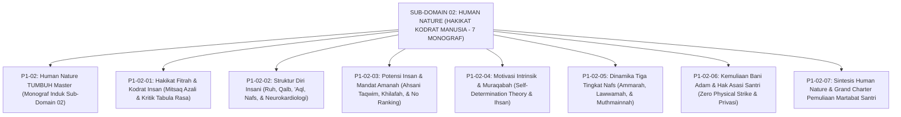

# SUB-DOMAIN 02: HUMAN NATURE (HAKIKAT KODRAT MANUSIA)
## *Sitemap Induk & Navigasi Monograf Ontologi Insan Pembelajar Ekosistem TUMBUH (7 Monograf Terpadu)*

**Nomor Identifikasi**: `P1-02/INDEX/2026`  
**Domain**: `01 Philosophy` > `02 Human Nature`  
**Klasifikasi**: Folder Monograf Ontologi Fitrah, Struktur Psiko-Spiritual, Amanah Khilafah, Muraqabah, Dinamika Nafs, & Hak Asasi Santri (8 Berkas Lengkap)

---

## 🏛️ SITEMAP & NAVIGASI SELURUH BERKAS SUB-DOMAIN 02

Sub-Domain `02 Human Nature` membedah fondasi filosofis tentang siapa dan bagaimana hakikat santri sebagai insan pembelajar dalam pandangan worldview Islam dan konsensus sains kontemporer:

---

## 📑 DAFTAR LENGKAP 8 BERKAS MONOGRAF TERPADU SUB-DOMAIN 02

Seluruh modul telah distandarisasi 100% ke dalam format **Monograf Terpadu**:
* **💡 Intisari Praktis (3 Menit Paham)**: Bahasa membumi dan aplikatif untuk asatidz & musyrif sebelum daftar isi.
* **Bagian I**: Riset Inkuiri, Formalisasi Silogisme Mantiq, Dialektika Multi-Perspektif (tanpa sebutan kata meta "pakar"), Teks Primer Turats & Sains Asli, serta Kasuistika Asrama Riil.
* **Bagian II**: Kodifikasi Baku Hasil Riset & Kesimpulan Formal (Matriks, Alur SOP, Piagam).
* **Bagian III**: Aparatus Akademis (Tabel Sintesis, Daftar Pustaka Otoritatif, 10–42 Catatan Kaki *Footnotes*, dan Glosarium Istilah Teknis).

| No | Berkas Monograf | Judul Berkas | Fokus Kajian & Rujukan Utama |
| :---: | :--- | :--- | :--- |
| **00** | [**`P1-02-Human-Nature-TUMBUH.md`**](./P1-02-Human-Nature-TUMBUH.md) | Monograf Induk Human Nature TUMBUH | Master 6 Pilar Kodrat Insan, Zero Tolerance Policy terhadap fitrah, & peta penjalaran ke 4 sub-domain lanjutan (P1-03 s/d P1-06). |
| **01** | [**`P1-02-01-Hakikat-Fitrah.md`**](./P1-02-01-Hakikat-Fitrah.md) | Hakikat Fitrah & Kodrat Insan Pembelajar | Teologi fitrah, Mitsaq azali (QS. 7:172), dekonstruksi Tabula Rasa Locke & Hobbes, riset Innate Morality Paul Bloom Yale (42 Catatan Kaki). |
| **02** | [**`P1-02-02-Struktur-Diri-Insani.md`**](./P1-02-02-Struktur-Diri-Insani.md) | Struktur Diri Insani: Ruh, Qalb, 'Aql, & Nafs | Kerajaan Jiwa Al-Ghazali, Tripartite Plato, Neurokardiologi 40.000 neuron jantung Armour, Heart-Brain Coherence, Daily Coherence Protocol (42 Catatan Kaki). |
| **03** | [**`P1-02-03-Potensi-dan-Amanah.md`**](./P1-02-03-Potensi-dan-Amanah.md) | Potensi Insan & Mandat Amanah Khilafah | Ahsani Taqwim vs Asfala Safilin (QS. 95:4-6), mandat 'Ibadah & 'Imaratul Ardh, 8 tipologi bakat sahabat Nabi, Multiple Intelligences Gardner, hapus ranking tunggal (40 Catatan Kaki). |
| **04** | [**`P1-02-04-Motivasi-Intrinsik-Santri.md`**](./P1-02-04-Motivasi-Intrinsik-Santri.md) | Motivasi Intrinsik & Integritas Muraqabah | Dekonstruksi kepatuhan semu, Self-Determination Theory (Autonomy, Competence, Relatedness), maqam Muraqabatullah Al-Qusyairi, Nightly Muraqabah Circle (41 Catatan Kaki). |
| **05** | [**`P1-02-05-Dinamika-Nafs-Ammarah-Lawwamah-Muthmainnah.md`**](./P1-02-05-Dinamika-Nafs-Ammarah-Lawwamah-Muthmainnah.md) | Dinamika Tiga Tingkat Nafs | Eksegesis Maratib an-Nafs (QS. Yusuf: 53, Al-Qiyamah: 2, Al-Fajr: 27), Dual-Systems Neurosains Steinberg, Terapi Al-'Ilaju bidh-Dhidd Al-Ghazali (11 Catatan Kaki). |
| **06** | [**`P1-02-06-Kemuliaan-Bani-Adam-dan-Hak-Asasi-Santri.md`**](./P1-02-06-Kemuliaan-Bani-Adam-dan-Hak-Asasi-Santri.md) | Kemuliaan Bani Adam & Hak Asasi Santri | Epistemologi Karamah Insaniyyah (QS. 17:70), Khutbah Wada' (HR. Bukhari 1741), Sadd adz-Dzara'i' Zero Physical Strike, Hak Privasi Satrul 'Aurat (12 Catatan Kaki). |
| **07** | [**`P1-02-07-Sintesis-Human-Nature.md`**](./P1-02-07-Sintesis-Human-Nature.md) | Sintesis Filosofis Hakikat Kodrat Manusia | Konsolidasi 6 pilar, audit bebas kontradiksi, jembatan ke Sub-Domain 03 Human Development, & Grand Charter Pemuliaan Martabat Santri (10 Catatan Kaki). |
