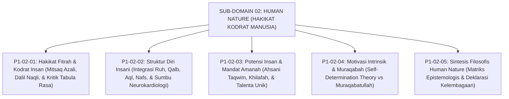

# SUB-DOMAIN 02: HUMAN NATURE (HAKIKAT KODRAT MANUSIA)
## *Sitemap Induk & Navigasi Monograf Ontologi Insan Pembelajar*

**Nomor Identifikasi**: `P1-02/INDEX/2026`  
**Domain**: `01 Philosophy` > `02 Human Nature`  
**Klasifikasi**: Folder Monograf Ontologi Fitrah & Psikologi Spiritual Islam

---

## 🏛️ SITEMAP & NAVIGASI SELURUH BERKAS SUB-DOMAIN 02

Sub-Domain `02 Human Nature` membedah fondasi filosofis tentang siapa dan bagaimana hakikat santri sebagai insan pembelajar dalam pandangan worldview Islam dan sains modern:

---

## 📑 DAFTAR BERKAS MODULAR SUB-DOMAIN 02

| No | Berkas Monograf | Judul Berkas | Fokus Kajian & Rujukan Utama |
| :---: | :--- | :--- | :--- |
| **01** | [**`P1-02-01-Hakikat-Fitrah.md`**](./P1-02-01-Hakikat-Fitrah.md) | Hakikat Fitrah & Kodrat Insan Pembelajar | Teologi fitrah, hermeneutika Mitsaq (QS. Al-A'raf: 172), bantahan atas tabula rasa John Locke & dosa asal, serta sintesis Ibn Taimiyyah & Al-Ghazali. |
| **02** | [**`P1-02-02-Struktur-Diri-Insani.md`**](./P1-02-02-Struktur-Diri-Insani.md) | Struktur Diri Insani: Ruh, Qalb, Aql, & Nafs | Anatomi psiko-spiritual Imam Al-Ghazali (*Ihya & Ma'arij*), perbandingan dengan Plato, dan penemuan neurokardiologi (*Heart-Brain Coherence*). |
| **03** | [**`P1-02-03-Potensi-dan-Amanah.md`**](./P1-02-03-Potensi-dan-Amanah.md) | Potensi Insan & Mandat Amanah Khilafah | Konsep *Ahsani Taqwim* vs *Asfala Safilin*, mandat *'Ibadah & 'Imaratul Ardh*, dan kurikulum berbasis kekuatan (*Strength-Based Curriculum*). |
| **04** | [**`P1-02-04-Motivasi-Intrinsik-Santri.md`**](./P1-02-04-Motivasi-Intrinsik-Santri.md) | Motivasi Intrinsik & Integritas Muraqabah | Kritik atas kepatuhan semu, integrasi *Self-Determination Theory* (Deci & Ryan) dengan maqam *Muraqabatullah* Imam Al-Qusyairi. |
| **05** | [**`P1-02-05-Sintesis-Human-Nature.md`**](./P1-02-05-Sintesis-Human-Nature.md) | Sintesis Filosofis Hakikat Kodrat Manusia | Matriks integrasi 4 modul Human Nature, deklarasi pemuliaan martabat santri, dan jembatan menuju Sub-Domain `03 Human Development`. |
