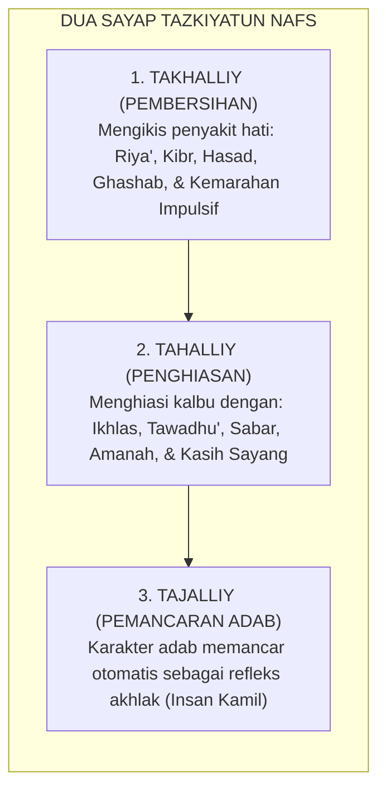
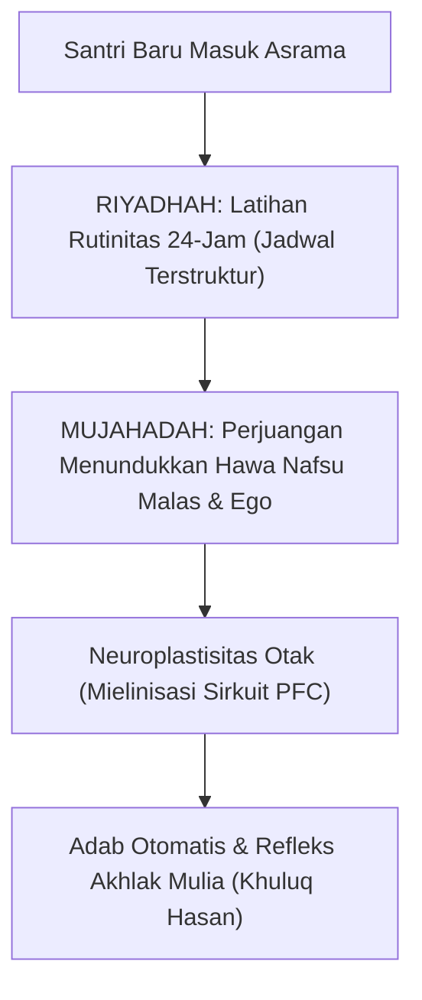

# P1-03-01: TAZKIYATUN NAFS DAN PERTUMBUHAN JIWA SANTRI
## *Proses Penyucian Jiwa Berkelanjutan, Dinamika Riyadhah & Mujahadah, dan Transformasi Karakter Pesantren*

**Nomor Identifikasi**: `P1-03-01/TAZKIYATUN-NAFS/2026`  
**Domain**: `01 Philosophy` > `03 Human Development`  
**Dewan Pakar**: `pakar-filosofi-tumbuh`, `pakar-epistemologi-turats`, `pakar-social-emotional-learning`

---

## 📑 DAFTAR ISI ANALITIS

1. [1. Konsep Dasar: Tazkiyah sebagai Poros Pertumbuhan Karakter](#1-konsep-dasar-tazkiyah-sebagai-poros-pertumbuhan-karakter)
2. [2. Dua Pilar Tazkiyah: Takhalliy (Pengosongan) dan Tahalliy (Penghiasan)](#2-dua-pilar-tazkiyah-takhalliy-pengosongan-dan-tahalliy-penghiasan)
3. [3. Dinamika Metodologis: Riyadhah (Latihan) dan Mujahadah (Perjuangan Batin)](#3-dinamika-metodologis-riyadhah-latihan-dan-mujahadah-perjuangan-batin)
4. [4. Konvergensi dengan Neurosains Neuroplastisitas Pembiasaan 66-Hari](#4-konvergensi-dengan-neurosains-neuroplastisitas-pembiasaan-66-hari)
5. [5. Implikasi bagi Sistem Pengasuhan Pesantren 24-Jam](#5-implikasi-bagi-sistem-pengasuhan-pesantren-24-jam)

---

### 1. Konsep Dasar: Tazkiyah sebagai Poros Pertumbuhan Karakter

Dalam ekosistem TUMBUH, pertumbuhan manusia (*Human Development*) tidak dipahami semata-mata sebagai pertambahan usia biologis atau akumulasi wawasan kognitif. Pertumbuhan sejati adalah **evolusi spiritual-moral (*Spiritual-Moral Evolution*)** yang berpusat pada proses **Tazkiyatun Nafs** (penyucian dan pengembangan jiwa).

Allah SWT menegaskan bahwa keberuntungan eksistensial manusia di dunia dan akhirat bergantung sepenuhnya pada keberhasilan proses tazkiyah ini:

> $$\text{قَدْ أَفْلَحَ مَن زَكَّاهَا ۝ وَقَدْ خَابَ مَن دَسَّاهَا}$$
> 
> *"Sungguh beruntunglah orang yang menyucikan jiwanya, dan sungguh merugilah orang yang mengotorinya."* (QS. Asy-Syams [91]: 9–10).

Kata *Zakka* dalam bahasa Arab memiliki makna ganda yang saling melengkapi: **Thaharah (membersihkan dari kotoran/penyakit batin)** dan **Inma' (menumbuhkan, membesarkan, dan memberkahi potensi kebaikan)**. Tazkiyah bukanlah proses represif yang memasung manusia, melainkan proses pelepasan belenggu hawa nafsu primitif agar potensi kebaikan fitrah santri dapat bertumbuh subur dan mekar sempurna.

---

### 2. Dua Pilar Tazkiyah: Takhalliy dan Tahalliy

Proses pertumbuhan jiwa santri menuntut tahapan sistematis yang dirumuskan para ulama tasawuf:

1. **Takhalliy (التَّخَلِّي - Pengosongan Diri dari Keburukan)**:  
   Sebelum nilai adab luhur dapat tertanam, jiwa santri harus dibersihkan dari virus moral (*Amradh al-Qulub*). Di lingkungan asrama, takhalliy termanifestasi dalam pengikisan budaya *ghashab* (mengambil barang orang tanpa izin), kebiasaan menggunjing (*ghibah*), dan arogansi senioritas.
2. **Tahalliy (التَّحَلِّي - Penghiasan Diri dengan Akhlak Karimah)**:  
   Setelah jiwa dikosongkan dari kotoran, santri dibimbing untuk menghiasi ruang batinnya dengan kebajikan: menjaga pandangan, mendahulukan rekan saat antre, berbicara dengan santun (*Qawlan Karima*), dan berempati kepada santri yang lemah.

---

### 3. Dinamika Metodologis: Riyadhah dan Mujahadah

Imam Al-Ghazali dalam *Ihya 'Ulumiddin* (Jilid III, Kitab *Riyadhatin Nafs wa Tahdhib al-Akhlaq*) menjelaskan instrumen operasional tazkiyah:

> $$\text{اعْلَمْ أَنَّ الْخُلُقَ الْحَسَنَ تَارَةً يَكُونُ بِالطَّبْعِ وَالْفِطْرَةِ، وَتَارَةً يَكُونُ بِاكْتِسَابِ الرِّيَاضَةِ، وَهُوَ حَمْلُ النَّفْسِ عَلَى الْأَعْمَالِ الَّتِي يَقْتَضِيهَا الْخُلُقُ الْمَطْلُوبُ حَتَّى يَصِيرَ ذَلِكَ لَهَا عَادَةً وَطَبِيعَةً ثَانِيَةً}$$
> 
> *"Ketahuilah bahwa akhlak mulia itu adakalanya merupakan anugerah bawaan fitrah sejak lahir, dan adakalanya diperoleh melalui jalan **Riyadhah (latihan pembiasaan)**, yaitu dengan cara memaksa jiwa melakukan amal-amal yang dituntut oleh akhlak tersebut secara konsisten, hingga akhirnya perbuatan tersebut menjadi kebiasaan otomatis dan menjadi watak kedua (*second nature*) bagi dirinya."* (Al-Ghazali, *Ihya*, III: 58).

* **Riyadhah (الرِّيَاضَةُ)**: Latihan kedisiplinan raga dan jadwal hidup harian yang teratur (bangun sebelum subuh, merapikan lemari, halaqah tepat waktu).
* **Mujahadah (الْمُجَاهَدَةُ)**: Perjuangan mental-spiritual melawan bisikan kemalasan dan godaan hawa nafsu (QS. Al-'Ankabut: 69: *"Dan orang-orang yang berjihad untuk (mencari keridhaan) Kami, benar-benar akan Kami tunjukkan kepada mereka jalan-jalan Kami"*).

---

### 4. Konvergensi dengan Neurosains Pembiasaan 66-Hari

Konsep *Riyadhah* dan *Mujahadah* klasik menemukan landasan biologisnya pada teori **Neuroplastisitas dan Pembentukan Kebiasaan Otomatis (*Habit Formation*)**:
* Penelitian Dr. Phillippa Lally (2010) di University College London membuktikan bahwa pembentukan kebiasaan otomatis (*automaticity*) membutuhkan pengulangan harian rata-rata **66 hari berturut-turut**.
* Pada fase 20 hari pertama *mujahadah*, korteks prefrontal (*dlPFC*) bekerja sangat keras untuk menahan dorongan instingtif limbik (*Inhibitory Control*).
* Seiring pengulangan riyadhah yang konsisten, jalur saraf mengalami **mielinisasi tebal**, dan kendali perilaku dialihkan secara bertahap ke sirkuit **Basal Ganglia**, sehingga adab yang awalnya terasa berat bertransformasi menjadi refleks yang ringan dan membahagiakan.

---

### 5. Implikasi bagi Sistem Pengasuhan Pesantren 24-Jam

1. **Jadwal Asrama sebagai Kurikulum Riyadhah**: Rutinitas hidup dari pukul 04.00 hingga 22.00 bukan sekadar tata tertib administratif, melainkan wahana riyadhah spiritual untuk mematangkan sirkuit kendali diri santri.
2. **Peran Musyrif sebagai Murabbi Ruhani**: Musyrif hadir bukan sebagai mandor pengawas yang menakutkan, melainkan sebagai pembimbing jiwa yang mendampingi santri saat mengalami titik jenuh perjuangan mujahadah.
3. **Penyediaan Ruang Evaluasi Harian (*Muhasabah Time*)**: Menyediakan waktu 10 menit hening setiap malam bagi santri untuk menimbang amal dan membersihkan niat.
