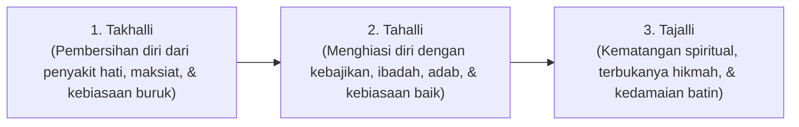

# P1-03-01-Tazkiyatun-Nafs-dan-Pertumbuhan-Jiwa

## Tujuan
Merumuskan doktrin **Tazkiyatun Nafs** (Penyucian Jiwa) sebagai hukum pertumbuhan batiniah (*spiritual and psychological development*) yang menjadi ruh proses pembinaan santri di ekosistem TUMBUH.

---

## Landasan Teologis Tazkiyatun Nafs

Pertumbuhan manusia dalam Islam berpusat pada dinamika pembersihan dan pengembangan jiwa.

> *"Demi jiwa serta penyempurnaan (ciptaan)nya, maka Dia mengilhamkan kepadanya (jalan) kejahatan dan ketakwaannya. Sungguh beruntung orang yang menyucikannya (tazkiyyah), dan sungguh merugi orang yang mengotorinya."*  
> **(QS. Asy-Syams [91]: 7-10)**

> *"Sungguh beruntung orang yang membersihkan diri (dengan beriman), dan mengingat nama Tuhannya, lalu dia sholat."*  
> **(QS. Al-A'la [87]: 14-15)**

---

## 3 Pilar Dinamika Jiwa dalam Khazanah Turats

Menurut Imam Al-Ghazali (*Ihya' 'Ulumiddin*) dan Ibnul Qayyim (*Madarijus Salikin*), proses pertumbuhan jiwa menempuh 3 siklus kontinu:

1. **Takhalli (Dekomposisi Kebiasaan Negatif)**:
   - Menghilangkan penyakit hati (riya', hasad, ujub, dendam, malas) dan meninggalkan pelanggaran adab/syariat.
   - Di pesantren: Santri dibimbing mengenali pemicu perilaku buruknya dan melepaskan kecanduan/godaan yang merusak.
2. **Tahalli (Habituasi Nilai Positif)**:
   - Menanamkan amal sholeh, disiplin ibadah wajib & sunnah, empati sosial, dan adab thalabul 'ilmi.
   - Di pesantren: Membangun rutinitas harian yang teratur, adab santri, dan pelaksanaan program pembiasaan.
3. **Tajalli (Pencapaian Resonansi Hikmah & Ketenangan)**:
   - Terinternalisasinya nilai-nilai kebaikan menjadi karakter spontan (*malakah*). Berbuat baik bukan lagi beban, melainkan kenikmatan batin.

---

## Integrasi dengan Sistem Intervensi Modern

| Dimensi Tazkiyah | Pendekatan Intervensi Modern | Peran di Pesantren TUMBUH |
| :--- | :--- | :--- |
| **Takhalli** | *De-escalation, Root-cause Analysis, Restorative Dialogue* | Mengidentifikasi akar pemicu pelanggaran, konseling BK, penghentian perilaku maladaptif |
| **Tahalli** | *Explicit Behavioral Instruction, Positive Reinforcement, Skill Building* | Pelatihan keterampilan SEL, penguatan kebiasaan ibadah, reward sosial |
| **Tajalli** | *Mastery, Mentoring/Tarbiyah, Peer-Leadership* | Santri menjadi teladan, mengampu adik kelas, kepemimpinan OSIS |
