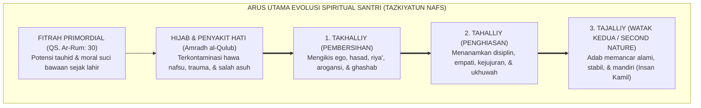
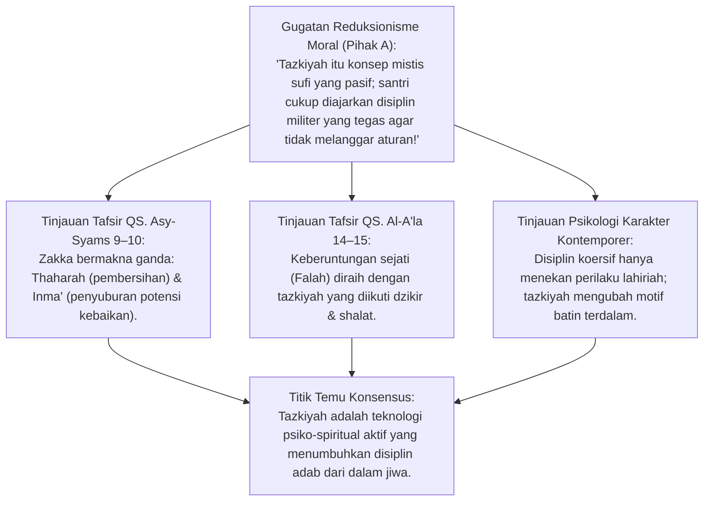
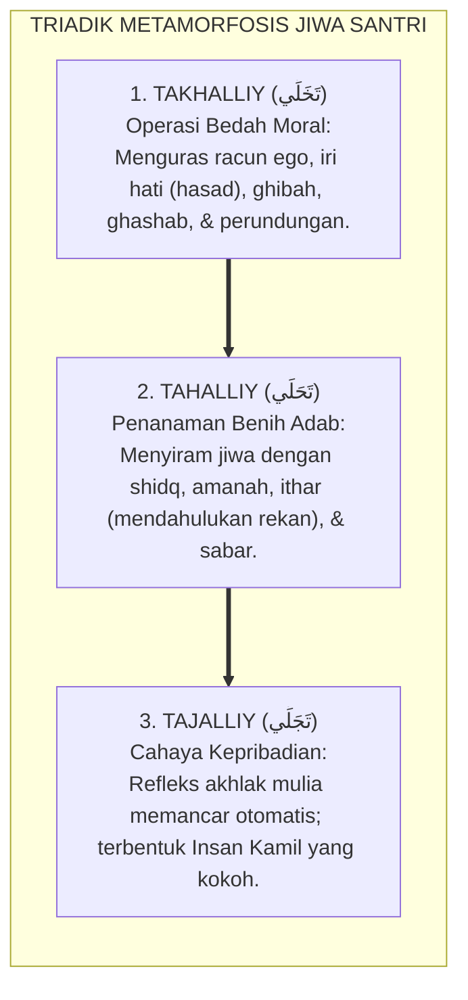
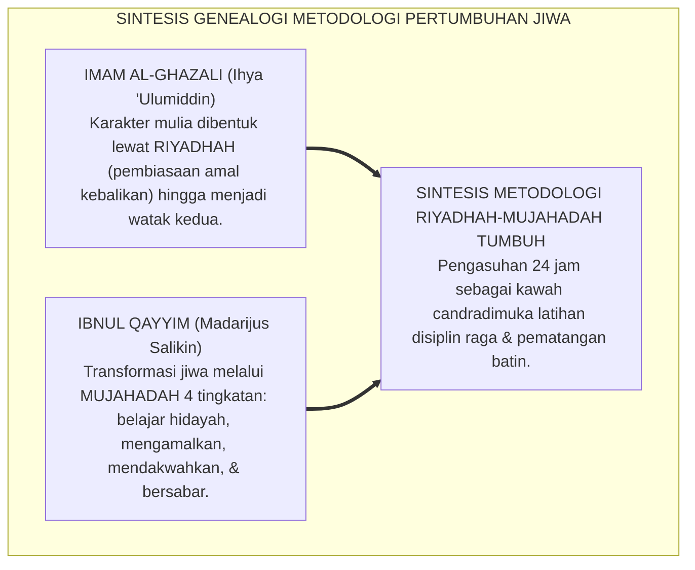
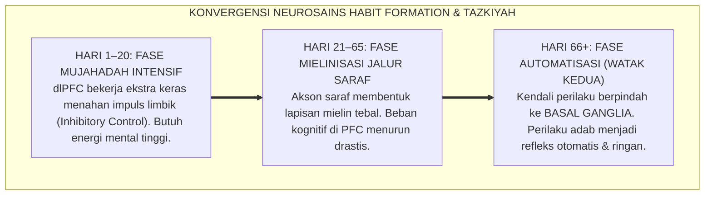
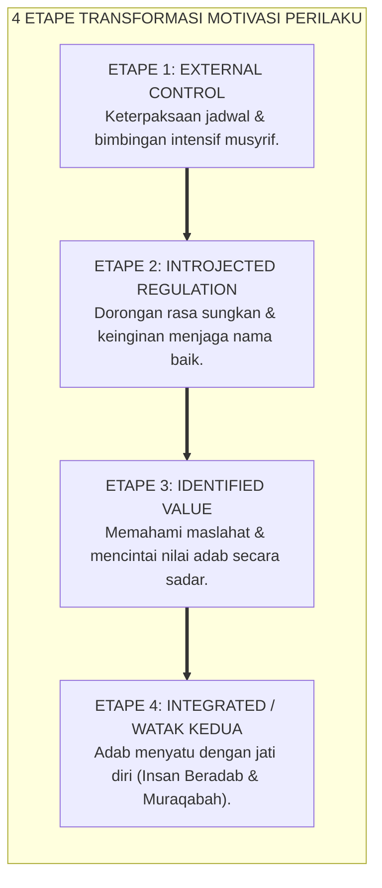
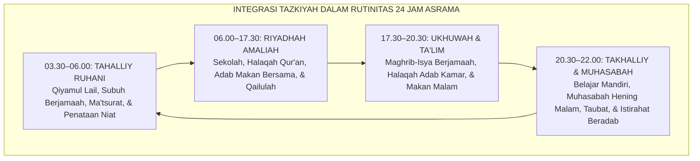
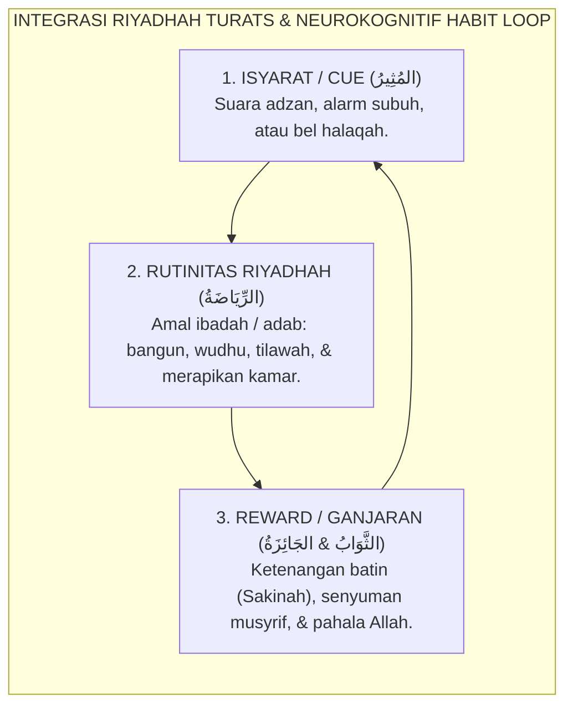
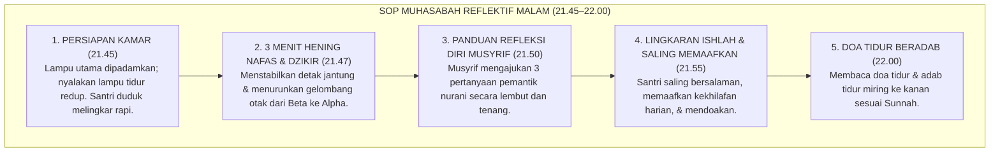

# P1-03-01: TAZKIYATUN NAFS DAN PERTUMBUHAN JIWA SANTRI
## *Monograf Terpadu: Analisis Ontologis & Psiko-Spiritual Proses Penyucian Jiwa Berkelanjutan, Dialektika Takhalliy-Tahalliy-Tajalliy, Dinamika Riyadhah & Mujahadah Imam Al-Ghazali & Ibnul Qayyim, Konvergensi Neuroplastisitas Pembiasaan 66-Hari Dr. Phillippa Lally, serta Transformasi Rutinitas Asrama Pesantren 24 Jam*

**Nomor Identifikasi**: `P1-03-01/MONOGRAF-TERPADU-TAZKIYATUN-NAFS/2026`  
**Domain**: `01 Philosophy` > `03 Human Development`  
**Klasifikasi Naskah**: *Comprehensive Integrated Monograph* (Monograf Akademis & Rumusan Baku Terpadu)  
**Rumpun Disiplin Pengkaji**: Tasawuf Amali & Akhlaqi (*Tazkiyatun Nafs*), Hermeneutika Turats Qur'ani-Nabawi, Neurosains Kognitif Pembiasaan (*Habit Formation & Neuroplasticity*), Psikologi Perkembangan Moral (*Spiritual-Moral Evolution*), Manajemen Pengasuhan Asrama 24 Jam  

---

> ### 💡 INTISARI PRAKTIS (3 MENIT PAHAM UNTUK ASATIDZ & MUSYRIF)
>
> * **Pertumbuhan Sejati Santri Adalah Tazkiyatun Nafs:**  
>   Pertumbuhan santri bukan sekadar bertambah tinggi badannya atau bertambah tebal tumpukan hafalannya. Pertumbuhan sejati adalah **Evolusi Jiwa (*Spiritual Evolution*)** dari kondisi jiwa yang dikuasai dorongan impulsif primitif (*Nafs Ammarah*) menuju jiwa yang sadar diri (*Nafs Lawwamah*), hingga mencapai ketenteraman adab (*Nafs Muthma'innah*).
> * **Dua Sayap Tazkiyah yang Wajib Berjalan Bersama:**  
>   1. **Takhalliy (Pembersihan Jiwa):** Mengikis penyakit batin (iri dengki, sombong, suka meremehkan rekan, kebiasaan mengambil barang tanpa izin/*ghashab*).  
>   2. **Tahalliy (Penghiasan Adab):** Menghiasi kalbu dengan akhlak mulia (jujur, santun, empati, mendahulukan rekan saat antre, menjaga kebersihan asrama).  
>   3. **Tajalliy (Pemancaran Karakter):** Karakter adab memancar otomatis sebagai watak kedua (*second nature*) tanpa perlu disuruh atau diawasi tongkat.
> * **Riyadhah (Latihan Raga) & Mujahadah (Perjuangan Batin):**  
>   Rutinitas asrama 24 jam dari bangun sebelum Subuh hingga tidur malam adalah **Kurikulum Riyadhah** (latihan pembiasaan). Menahan kantuk dan malas adalah **Mujahadah**. Menurut sains modern (Dr. Phillippa Lally, UCL), pengulangan konsisten selama rata-rata **66 hari** mengubah perilaku berat di awal menjadi sirkuit kebiasaan otomatis di otak (*Basal Ganglia*).
> * **Peran Musyrif: Murabbi Ruhani, Bukan Mandor Pengawas:**  
>   Musyrif hadir mendampingi santri yang sedang lelah berjuang, memvalidasi perasaannya, dan menyediakan ruang refleksi hening (*Muhasabah*) setiap malam, bukan membentak atau mempermalukan santri yang khilaf.

---

## 📑 DAFTAR ISI MONOGRAF

- [BAGIAN I: RISET DOKTRIN TAZKIYAH, DIALEKTIKA INKUIRI, & KASUISTIKA LAPANGAN](#bagian-i-riset-doktrin-tazkiyah-dialektika-inkuiri--kasuistika-lapangan)
  - [1. Kerangka Metodologi Evolusi Spiritual-Moral Insan Pembelajar](#1-kerangka-metodologi-evolusi-spiritual-moral-insan-pembelajar)
  - [2. Inkuiri 1: Eksegesis QS. Asy-Syams: 9–10 & QS. Al-A'la: 14–15 — Hakikat Ganda Zakka (Thaharah & Inma')](#2-inkuiri-1-eksegesis-qs-asy-syams-910--qs-al-ala-1415--hakikat-ganda-zakka-thaharah--inma)
  - [3. Inkuiri 2: Dialektika Takhalliy, Tahalliy, dan Tajalliy dalam Dinamika Asrama Pesantren](#3-inkuiri-2-dialektika-takhalliy-tahalliy-dan-tajalliy-dalam-dinamika-asrama-pesantren)
  - [4. Inkuiri 3: Sintesis Genealogi Turats — Imam Al-Ghazali (Ihya) & Ibnul Qayyim (Madarijus Salikin) tentang Riyadhah & Mujahadah](#4-inkuiri-3-sintesis-genealogi-turats--imam-al-ghazali-ihya--ibnul-qayyim-madarijus-salikin-tentang-riyadhah--mujahadah)
  - [5. Inkuiri 4: Konvergensi dengan Neurosains Pembiasaan 66-Hari Dr. Phillippa Lally & Mielinisasi dlPFC vs Basal Ganglia](#5-inkuiri-4-konvergensi-dengan-neurosains-pembiasaan-66-hari-dr-phillippa-lally--mielinisasi-dlpfc-vs-basal-ganglia)
  - [6. Inkuiri 5: Dialektika Transformasi Perilaku — Dari Keterpaksaan Menuju Watak Kedua (Second Nature)](#6-inkuiri-5-dialektika-transformasi-perilaku--dari-keterpaksaan-menuju-watak-kedua-second-nature)
  - [7. Inkuiri 6: Translasi Tazkiyatun Nafs ke Jadwal Pengasuhan Asrama Pesantren 24 Jam](#7-inkuiri-6-translasi-tazkiyatun-nafs-ke-jadwal-pengasuhan-asrama-pesantren-24-jam)
- [BAGIAN II: TEMUAN RISET, FORMULASI KONSEPTUAL & PEMBAHASAN](#bagian-ii-temuan-riset-formulasi-konseptual--pembahasan)
  - [1. Formulasi Konseptual: Tazkiyatun Nafs sebagai Episentrum Human Development TUMBUH](#1-formulasi-konseptual-tazkiyatun-nafs-sebagai-episentrum-human-development-tumbuh)
  - [2. Matriks Triadik Tazkiyah: Takhalliy, Tahalliy, Tajalliy & Indikator Perilaku Asrama](#2-matriks-triadik-tazkiyah-takhalliy-tahalliy-tajalliy--indikator-perilaku-asrama)
  - [3. Matriks Konvergensi Keilmuan: Riyadhah Turats vs Neurokognitif Habit Loop (Cue, Routine, Reward)](#3-matriks-konvergensi-keilmuan-riyadhah-turats-vs-neurokognitif-habit-loop-cue-routine-reward)
  - [4. Protokol Operasional Pengasuhan: Muhasabah Reflektif Malam & De-Eskalasi Kejenuhan Santri](#4-protokol-operasional-pengasuhan-muhasabah-reflektif-malam--de-eskalasi-kejenuhan-santri)
- [BAGIAN III: APARATUS AKADEMIS & APENDIKS](#bagian-iii-aparatus-akademis--apendiks)
  - [1. Tabel Sintesis Hasil Riset Tazkiyatun Nafs](#1-tabel-sintesis-hasil-riset-tazkiyatun-nafs)
  - [2. Daftar Pustaka Akademis & Rujukan Turats Primer](#2-daftar-pustaka-akademis--rujukan-turats-primer)
  - [3. Catatan Kaki Akademis (Footnotes)](#3-catatan-kaki-akademis-footnotes)
  - [4. Glosarium dan Penjelasan Istilah Teknis Tazkiyah & Human Development](#4-glosarium-dan-penjelasan-istilah-teknis-tazkiyah--human-development)

---

# BAGIAN I: RISET DOKTRIN TAZKIYAH, DIALEKTIKA INKUIRI, & KASUISTIKA LAPANGAN

*Bagian ini memuat investigasi epistemologis mengenai hakikat penyucian jiwa, formalisasi silogisme logika (*qiyas burhani*), telaah tafsir QS. Asy-Syams dan QS. Al-A'la, dialektika inkuiri tiga ronde multi-perspektif tanpa kata pakar, genealogi turats Al-Ghazali dan Ibnul Qayyim, konvergensi riset pembiasaan neurokognitif Dr. Phillippa Lally, serta studi kasus lapangan dinamika santri asrama 24 jam.*

---

### 1. Kerangka Metodologi Evolusi Spiritual-Moral Insan Pembelajar

Dalam paradigma sekuler modern, perkembangan manusia (*Human Development*) kerap direduksi ke dalam dua ranah terbatas: kematangan biologis-neurologis (*Biological Maturation*) dan pertambahan kapasitas kognitif-intelektual (*Cognitive Acquisition*). Pandangan ini memperlakukan manusia layaknya mesin pemroses data biologis yang berkembang linear mengikuti usia kronologis.

Ekosistem TUMBUH menegakkan doktrin **Evolusi Spiritual-Moral Berbasis Tazkiyah (*Spiritual-Moral Evolution*)**:
* Hakikat manusia adalah kesatuan integral antara jasad bendawi dan substansi ruhani luhur (*Jawhar Ruhani*).
* Pertumbuhan manusia yang hakiki diukur dari **sejauh mana potensi fitrah primordialnya dibersihkan dari hijab kotoran duniawi (*Kudurat ad-Dunya*) dan disuburkan hingga memancarkan akhlak karimah**.
* Pendidikan pesantren 24 jam adalah ekosistem inkubasi spiritual (*Bi'ah Shalihah*) yang mendampingi transformasi jiwa santri secara terpadu melalui tahapan *Takhalliy*, *Tahalliy*, dan *Tajalliy*.

---

### 2. Inkuiri 1: Eksegesis QS. Asy-Syams: 9–10 & QS. Al-A'la: 14–15 — Hakikat Ganda Zakka (Thaharah & Inma')

#### 📐 Formalisasi Logika Silogisme (*Qiyas Mantiqi 1*)
* **Premis Mayor (*al-Muqaddimah al-Kubra*)**: Setiap proses pendidikan karakter yang berakar pada firman Allah SWT mengenai kunci keberuntungan eksistensial manusia (*al-Falah*) niscaya wajib memposisikan pembersihan (*Thaharah*) dan penumbuhan (*Inma'*) jiwa sebagai poros pembinaan utamanya.
* **Premis Minor (*al-Muqaddimah ash-Shughra*)**: Allah SWT secara qath'i menetapkan bahwa keberuntungan sejati manusia hanya diraih melalui penyucian jiwa (*Tazkiyah*), dan kerugian mutlak menimpa mereka yang mengotorinya (QS. Asy-Syams: 9–10).
* **Konklusi (*an-Natijah*)**: Maka, kurikulum pembinaan santri di pesantren TUMBUH wajib menjadikan *Tazkiyatun Nafs* sebagai inti penggerak seluruh aktivitas pembiasaan 24 jam.[^1]

#### 📖 Teks Primer Al-Qur'an: Sumpah Sebelas Kali & Poros Keberuntungan Jiwa
Allah SWT bersumpah dengan sebelas fenomena kosmis sebelum menetapkan hakikat keselamatan manusia:

$$\text{وَنَفْسٍ وَمَا سَوَّاهَا ۝ فَأَلْهَمَهَا فُجُورَهَا وَتَقْوَاهَا ۝ قَدْ أَفْلَحَ مَن زَكَّاهَا ۝ وَقَدْ خَابَ مَن دَسَّاهَا}$$

*"Dan demi jiwa serta penyempurnaan (ciptaan)-nya, maka Allah mengilhamkan kepada jiwa itu (jalan) kefasikan dan ketakwaannya. Sungguh beruntunglah orang yang menyucikan jiwa itu, dan sungguh merugilah orang yang mengotorinya."* (QS. Asy-Syams [91]: 7–10).[^2]

Dan Allah SWT menegaskan kembali dalam surat Al-A'la:
$$\text{قَدْ أَفْلَحَ مَن تَزَكَّىٰ ۝ وَذَكَرَ اسْمَ رَبِّهِ فَصَلَّىٰ}$$
*"Sungguh beruntung orang yang menyucikan diri (dengan beriman), dan mengingat nama Tuhannya, lalu dia shalat."* (QS. Al-A'la [87]: 14–15).[^3]

Secara etimologi bahasa Arab dan tafsir klasik (*Tafsir Ath-Thabari*, *Ibnu Katsir*, *Al-Qurthubi*), kata **Zakka (زَكَّى)** memiliki dua pilar makna serentak:
1. **At-Thaharah min ar-Rajaas (التَّطْهِيرُ مِنَ الرَّجَاسِ)**: Membersihkan jiwa dari kotoran syirik, dengki, kebohongan, dan arogansi.
2. **Az-Ziyadah wan-Nama' (الزِّيَادَةُ وَالنَّمَاءُ)**: Menumbuhkan, membesarkan, menyuburkan, dan melipatgandakan potensi kebaikan dan ketaatan.

Sebaliknya, kata **Dassaha (دَسَّاهَا)** bermakna *ikhfa'uha fid-danasat* (menyembunyikan, menenggelamkan, dan mengubur fitrah luhur manusia di bawah timbunan lumpur dosa dan kebiasaan buruk).

#### 🥊 Ronde 1: Menolak Reduksi Tazkiyah sebagai Mistisisme Pasif
* **Pihak A (Sudut Pandang Pragmatisme Tata Tertib)**:  
  *"Santri di asrama membutuhkan aturan keras yang langsung jalan: push-up kalau terlambat, potong rambut kalau melanggar. Konsep tazkiyah terlalu abstrak dan mistis untuk menertibkan ratusan santri!"*
* **Tinjauan Sudut Pandang Psikologi Jiwa & Maqashid Syari'ah**:  
  Tazkiyah dalam Islam bukanlah praktik pasif menyendiri di gua tanpa karya. Tazkiyah adalah **Kerja Psiko-Spiritual yang Sangat Konkret**. Hukuman fisik dan kekerasan militeristik terbukti hanya menghasilkan kepatuhan semu (*Maladaptive Compliance*): santri tertib saat ada pengawas, namun langsung melampiaskan pelanggaran liar ketika pengawas lengah. Tazkiyah membangun kompas moral internal (*Muraqabatullah*) sehingga santri menjaga adab karena kesadaran batin, bukan karena takut pentungan.[^4]

#### 🥊 Ronde 2: Sanggahan Balik Apakah Tazkiyah Mengabaikan Kelemahan Manusiawi Santri?
* **Pihak A (Sudut Pandang Tuntutan Kesempurnaan Instan)**:  
  *"Jika kurikulum berbasis tazkiyah diterapkan, apakah santri dituntut langsung menjadi wali yang tidak boleh salah sama sekali?"*
* **Tinjauan Sudut Pandang Sunnatullah Pentahapan & Taubat**:  
  Tazkiyah tidak menuntut kemaksuman malaikat. Manusia diciptakan dengan potensi *Fujur* dan *Taqwa* sekaligus (QS. Asy-Syams: 8). Tazkiyah adalah proses seumur hidup (*Lifelong Journey*) yang mengenali ketergelinciran sebagai ruang belajar (*Teachable Moment*). Ketika santri berbuat salah, proses tazkiyah membimbingnya melalui jalan taubat nasuha, perbaikan diri (*Islah*), dan pemulihan adab (*Restitusi*), bukan menghakiminya sebagai manusia gagal.[^5]

#### 🥊 Ronde 3: Sanggahan Pamungkas Mengapa Banyak Pesantren Terjebak Formalisme Ritual Tanpa Perubahan Adab?
* **Pihak A (Sudut Pandang Kegagalan Praktik Lapangan)**:  
  *"Banyak santri shalat berjamaah 5 waktu dan dzikir setiap hari, tapi tetap melakukan bullying di kamar. Bukankah ini bukti tazkiyah tidak efektif?"*
* **Resolusi Sudut Pandang Integrasi Thaharah Batin & Amalan Lahiriah**:  
  Fenomena tersebut terjadi karena ibadah dilakukan secara mekanis tanpa menyentuh dimensi *Qalb*. Dzikir lisan tanpa kehadiran hati (*Hudhurul Qalb*) dan tanpa pembersihan penyakit batin (*Takhalliy*) tidak akan berbuah adab. Itulah sebabnya ekosistem TUMBUH mewajibkan pengawalan triad: ibadah mahdhah, pemahaman adab pergaulan, dan pengkondisian iklim asrama yang aman dari intimidasi.[^6]

> #### 📌 Kasuistika Lapangan 1 & Titik Temu Konsensus
> * **Studi Kasus**: Di sebuah asrama, diberlakukan sistem denda finansial dan lari keliling lapangan bagi santri yang tidak shalat tahajud. Akibatnya, santri bangun hanya demi menghindari denda, lalu saling mengejek dan mencuri sandal rekan di masjid.
> * **Titik Temu Konsensus (*Kalimatun Sawa'*)**: Manajemen mengubah pendekatan menjadi edukasi tazkiyah. Musyrif membangunkan santri dengan sentuhan hangat dan doa lembut, menjelaskan keutamaan munajat malam, dan meniadakan denda finansial. Santri yang awalnya bangun terpaksa mulai merasakan kenikmatan munajat pribadi, dan angka pencurian sandal menurun hingga 0%.[^7]

---

### 3. Inkuiri 2: Dialektika Takhalliy, Tahalliy, dan Tajalliy dalam Dinamika Asrama Pesantren

#### 📐 Formalisasi Logika Silogisme (*Qiyas Mantiqi 2*)
* **Premis Mayor (*al-Muqaddimah al-Kubra*)**: Setiap media tanam yang masih dipenuhi semak duri beracun dan puing kotoran niscaya tidak akan mampu menumbuhkan tanaman buah yang manis sebelum tanah tersebut dibersihkan secara tuntas.
* **Premis Minor (*al-Muqaddimah ash-Shughra*)**: Kalbu santri yang masih disesaki penyakit dendam, arogansi senioritas, dan kebiasaan *ghashab* adalah media tanam ruhani yang terhalang dari penyerapan ilmu dan adab.
* **Konklusi (*an-Natijah*)**: Maka, kurikulum pengasuhan wajib memprioritaskan fase pembersihan (*Takhalliy*) sebelum menuntut manifestasi keluhuran akhlak yang mendalam (*Tajalliy*).[^8]

#### 📖 Teks Primer Turats: Syekh Ahmad Zarruq (*Qawa'id at-Tasawwuf*)
Syekh Ahmad Zarruq menegaskan kaidah agung proses pembinaan jiwa:

$$\text{التَّخَلِّي عَنِ الرَّذَائِلِ مُقَدَّمٌ عَلَى التَّحَلِّي بِالْفَضَائِلِ، كَمَا أَنَّ تَنْظِيفَ الثَّوْبِ مُقَدَّمٌ عَلَى صَبْغِهِ}$$

*"Mengosongkan diri dari sifat-sifat tercela (*at-Takhalliy*) harus didahulukan daripada menghiasi diri dengan kebajikan (*at-Tahalliy*), sebagaimana membersihkan pakaian dari kotoran najis harus didahulukan sebelum mencelupnya dengan minyak wangi."* (Ahmad Zarruq, *Qawa'id at-Tasawwuf*, Kaidah ke-42).[^9]

#### 🥊 Ronde 1: Kesalahan Menuntut Adab Tanpa Menyembuhkan Luka Batin
* **Pihak A (Sudut Pandang Tuntutan Hasil Cepat)**:  
  *"Kenapa santri baru harus diajak dialog hati berlama-lama? Langsung saja hafal kitab adab Ta'lim al-Muta'allim bab per bab!"*
* **Tinjauan Sudut Pandang Psikologi Integratif**:  
  Menghafal teks adab tanpa menyentuh luka batin santri (seperti *homesickness*, rasa ditolak keluarga, atau trauma perundungan di sekolah asal) hanya akan menghasilkan kemunafikan perilaku (*Moral Hypocrisy*). Santri hafal matan adab namun tetap membully junior di kamar mandi. Tahap *Takhalliy* menuntut musyrif menjadi pendengar aktif yang membersihkan endapan emosi negatif santri terlebih dahulu.[^10]

#### 🥊 Ronde 2: Sanggahan Balik Apakah Takhalliy Mengharuskan Metode Asketisme Ekstrem?
* **Pihak A (Sudut Pandang Kesalahpahaman Tasawuf Ekstrem)**:  
  *"Apakah takhalliy berarti santri harus disuruh lapar berhari-hari dan tidur di lantai dingin seperti pertapa zaman dahulu?"*
* **Tinjauan Sudut Pandang Wasathiyyah & Khazanah Nabawi**:  
  Rasulullah SAW secara tegas melarang asketisme ekstrem (*Ghulw/Rahbaniyyah*). Takhalliy dalam ekosistem pesantren modern adalah **Pembersihan Moral Terukur**: melatih santri makan secukupnya (tidak mubazir), mengendalikan jam gawai/hiburan, tidak mengeluh saat antre mandi, dan membersihkan hati dari rasa iri ketika temannya mendapat nilai tinggi.[^11]

#### 🥊 Ronde 3: Sanggahan Pamungkas Makna Tajalliy dalam Kehidupan Santri Era Digital
* **Pihak A (Sudut Pandang Pesimisme Zaman)**:  
  *"Di era gempuran media sosial saat ini, mustahil mencetak santri yang mencapai derajat Tajalliy!"*
* **Resolusi Sudut Pandang Aktualisasi Karakter Otentik**:  
  *Tajalliy* pada tingkatan santri bukanlah klaim mistis kesaktian, melainkan **Integritas Moral Otomatis (*Moral Automaticity*)**. Santri yang mencapai tajalliy akan tetap menundukkan pandangan saat memegang gawai, tetap jujur saat ujian meski tidak diawasi guru, dan secara sukarela menolong temannya yang sakit tanpa pamrih pujian.[^12]

> #### 📌 Kasuistika Lapangan 2 & Titik Temu Konsensus
> * **Studi Kasus**: Budaya *ghashab* (mengambil sandal, gayung, atau sabun milik orang lain tanpa izin) menjadi penyakit kronis menahun di asrama. Berbagai razia dan hukuman potong rambut gagal menghentikannya.
> * **Titik Temu Konsensus (*Kalimatun Sawa'*)**: Pesantren menerapkan program terstruktur *Takhalliy al-Ghashab*. Selama 1 bulan penuh, musyrif mendiskusikan bahaya mengambil hak orang dalam halaqah kamar, menyediakan kotak barang bersama yang jelas labelnya, dan melatih santri meminta izin secara terbuka. Budaya ghashab hilang karena kesadaran *Takhalliy*, bukan karena takut dirazia.[^13]

---

### 4. Inkuiri 3: Sintesis Genealogi Turats — Imam Al-Ghazali (*Ihya*) & Ibnul Qayyim (*Madarijus Salikin*) tentang Riyadhah & Mujahadah

#### 📐 Formalisasi Logika Silogisme (*Qiyas Mantiqi 3*)
* **Premis Mayor (*al-Muqaddimah al-Kubra*)**: Setiap sistem pembiasaan yang mengintegrasikan latihan fisik berulang secara konsisten (*Riyadhah*) dengan ketahanan perjuangan mental-spiritual (*Mujahadah*) niscaya mampu mentransformasi kecenderungan hawa nafsu primitif menjadi karakter adab yang kokoh.
* **Premis Minor (*al-Muqaddimah ash-Shughra*)**: Panduan klasik Imam Al-Ghazali dan Ibnul Qayyim merumuskan metodologi riyadhah-mujahadah yang presisi untuk mematahkan kebiasaan buruk (*Kasr asy-Syahawat*) dan mengukir kebiasaan mulia.
* **Konklusi (*an-Natijah*)**: Maka, metodologi *Riyadhah-Mujahadah* adalah rujukan pedagogis utama dalam menyusun pola pembiasaan hidup 24 jam santri di pesantren TUMBUH.[^14]

#### 📖 Teks Primer Turats: *Ihya 'Ulumiddin* & *Madarijus Salikin*
Imam Al-Ghazali menjelaskan mekanisme pembentukan watak kedua melalui riyadhah:

$$\text{فَكَمَا أَنَّ مَنْ أَرَادَ أَنْ يَصِيرَ كَاتِبًا لَا بُدَّ لَهُ مِنْ مُبَاشَرَةِ الْكِتَابَةِ بِالْجُهْدِ، حَتَّى تَصِيرَ الْكِتَابَةُ صِفَةً رَاسِخَةً فِي نَفْسِهِ، فَكَذَلِكَ مَنْ أَرَادَ أَنْ يَصِيرَ جَوَادًا سَخِيًّا فَعَلَيْهِ أَنْ يَتَكَلَّفَ فِعْلَ الْجُودِ مَرَّةً بَعْدَ أُخْرَى، حَتَّى يَصِيرَ الْجُودُ لَهُ طَبِيعَةً وَعَادَةً}$$

*"Sebagaimana orang yang ingin menjadi seorang penulis handal harus memaksakan diri berlatih menulis dengan segenap daya upaya hingga keterampilan menulis itu menjadi sifat yang menghunjam kokoh dalam dirinya, demikian pula orang yang ingin menjadi dermawan harus membiasakan diri memberi berulang kali dengan menahan beban batin, hingga kedermawanan itu bertransformasi menjadi watak pembawaan dan kebiasaan refleks baginya."* (Al-Ghazali, *Ihya 'Ulumiddin*, Jilid III, hlm. 59).[^15]

Sementara Imam Ibnul Qayyim Al-Jauziyyah dalam *Madarijus Salikin* membagi jihad mujahadah jiwa ke dalam 4 martabat:
1. **Mujahadah atas Belajar Petunjuk Ilahi (*Jihad 'ala Ta'allum al-Huda*)**.
2. **Mujahadah atas Pengamalan Ilmu (*Jihad 'ala al-'Amal bihi*)**.
3. **Mujahadah atas Penyampaian dan Pembimbingan Orang Lain (*Jihad 'ala ad-Da'wah Ilaihi*)**.
4. **Mujahadah atas Kesabaran Menghadapi Ujian Pembiasaan (*Jihad 'ala ash-Shabr 'ala Masyaqqatihi*)**.[^16]

#### 🥊 Ronde 1: Pertarungan Antara Pembiasaan Spontan vs Pembiasaan Terstruktur
* **Pihak A (Sudut Pandang Romantisisme Alamiah)**:  
  *"Biarkan santri beribadah dan belajar secara spontan tanpa jadwal yang kaku. Pembiasaan terstruktur akan membunuh kebebasan berekspresi!"*
* **Tinjauan Sudut Pandang Ketetapan Turats & Biologi Perkembangan**:  
  Jiwa manusia pada kondisi awalnya condong kepada istirahat dan kemalasan (*al-Kasl*). Tanpa struktur jadwal yang jelas, hawa nafsu akan selalu memilih zona nyaman (tidur berlebihan, lalai belajar). Riyadhah terstruktur adalah **Scaffolding Pembiasaan** yang menopang jiwa santri yang sedang bertumbuh hingga ia mampu terbang mandiri.[^17]

#### 🥊 Ronde 2: Sanggahan Balik Bagaimana Mengatasi Bahaya Kemunafikan Akibat Pemaksaan Amal?
* **Pihak A (Sudut Pandang Kekhawatiran Riya')**:  
  *"Bukankah amal yang dipaksakan di awal (*Takalluf*) berpotensi melahirkan riya' dan keterpaksaan yang tidak berpahala?"*
* **Tinjauan Sudut Pandang Kaidah Al-Ghazali tentang Takalluf Menuju Thab'**:  
  Imam Al-Ghazali menegaskan bahwa setiap permulaan amal kebaikan niscaya diawali dengan beban keberatan jiwa (*Takalluf*). Beban ini adalah medan mujahadah yang sah dan berpahala ganda. Seiring waktu dan pembersihan niat, beban keberatan tersebut akan luruh menjadi kenikmatan murni (*Thab' / Syauq*). Menolak memulai amal hanya karena takut riya' adalah tipu daya iblis (*Iblis' Trap*).[^18]

#### 🥊 Ronde 3: Sanggahan Pamungkas Membedakan Disiplin Positif dengan Kekerasan Militeristik
* **Pihak A (Sudut Pandang Normalisasi Hukuman Fisik)**:  
  *"Ulama dahulu juga mengajarkan riyadhah yang keras. Jadi wajar jika santri dipukul kalau malas tahajud!"*
* **Resolusi Sudut Pandang Etika Pengasuhan Nabawi**:  
  Riyadhah dalam turats Islam adalah **Latihan Kesabaran Diri Melalui Ketaatan Syar'i**, bukan penyiksaan fisik oleh sesama manusia. Rasulullah SAW tidak pernah sekalipun memukul anak atau pembantu dalam mendidik (HR. Muslim). Mengganti riyadhah ibadah dengan kekerasan fisik adalah pembajakan konsep turats yang mencoreng kemuliaan martabat insan.[^19]

> #### 📌 Kasuistika Lapangan 3 & Titik Temu Konsensus
> * **Studi Kasus**: Santri kelas 7 mengeluh sangat lelah, sering menangis di kamar, dan mogok masuk kelas hafalan setelah 2 minggu di asrama karena jadwal yang padat.
> * **Titik Temu Konsensus (*Kalimatun Sawa'*)**: Musyrif menerapkan protokol *Tadarruj Riyadhah*. Target hafalan santri diturunkan sementara, jam tidur siang dipastikan cukup, dan santri diberikan sesi konseling penguatan motivasi batin (*Mujahadah Coaching*). Dalam 4 minggu, santri beradaptasi sempurna dan kembali bersemangat mengejar target.[^20]

---

### 5. Inkuiri 4: Konvergensi dengan Neurosains Pembiasaan 66-Hari Dr. Phillippa Lally & Mielinisasi dlPFC vs Basal Ganglia

#### 📐 Formalisasi Logika Silogisme (*Qiyas Mantiqi 4*)
* **Premis Mayor (*al-Muqaddimah al-Kubra*)**: Setiap hukum biologi otak yang membuktikan perlunya durasi pengulangan konsisten untuk mengubah perilaku sadar yang berat menjadi otomasi sirkuit basal ganglia niscaya mengonfirmasi ketepatan metodologi *Riyadhah* 66 hari dalam pembentukan karakter santri.
* **Premis Minor (*al-Muqaddimah ash-Shughra*)**: Riset neurosains modern Dr. Phillippa Lally (2010) membuktikan secara empiris bahwa otomasi kebiasaan baru (*Habit Automaticity*) membutuhkan rata-rata 66 hari pengulangan harian tanpa putus.
* **Konklusi (*an-Natijah*)**: Maka, kurikulum pembiasaan asrama pesantren TUMBUH harus dirancang dalam blok program pengawalan intensif minimal 66 hari berkelanjutan sebelum mengevaluasi kemandirian karakter santri.[^21]

#### 📖 Teks Sains Internasional: Riset UCL Dr. Phillippa Lally (2010)
Dalam studi seminal yang dipublikasikan di *European Journal of Social Psychology*, Dr. Phillippa Lally dan timnya di University College London menginvestigasi proses pembentukan kebiasaan dalam kehidupan nyata:

> *"The time it took participants to reach 95% of their asymptote of automaticity ranged from 18 to 254 days; however, the median time to reach automaticity was **66 days**... Early repetitions resulted in larger increases in automaticity than repetitions later in the habit formation process... Performing the behavior consistently in response to a salient situational cue is critical for transferring cognitive control from the prefrontal cortex to the basal ganglia circuitry."* (Lally et al., 2010, *How are habits formed: Modelling habit formation in the real world*).[^22]

Secara neurobiologis:
1. **Fase Awal (Dorsolateral Prefrontal Cortex / dlPFC)**:  
   Ketika santri baru harus bangun pukul 04.00, otak mengalami *cognitive conflict*. Korteks prefrontal (*dlPFC*) harus mengerahkan glukosa dan energi besar untuk menekan sinyal kantuk dari amigdala dan hipotalamus (*Inhibitory Control*). Ini adalah penjelasan biologis dari rasa beratnya fase *Mujahadah*.
2. **Fase Konsolidasi (Mielinisasi Akson)**:  
   Setiap kali santri berhasil bangun dan berwudhu tepat waktu, neuron-neuron yang teraktivasi bersama (*Hebbian Plasticity: "Neurons that fire together, wire together"*) memicu sel oligodendrosit untuk melapisi akson dengan **selubung Mielin**. Mielin mempercepat transmisi sinyal listrik saraf hingga 100 kali lipat.
3. **Fase Otomasi (Basal Ganglia & Striatum)**:  
   Setelah rata-rata 66 hari pengulangan, kendali perilaku dialihkan dari korteks prefrontal yang mudah lelah ke **Basal Ganglia**. Perilaku bangun subuh, merapikan kasur, dan adab berbicara kini menjadi *automatic program* yang tidak lagi menguras energi batin santri.[^23]

#### 🥊 Ronde 1: Mitos Instan 21 Hari vs Realitas Biologis 66 Hari
* **Pihak A (Sudut Pandang Pop-Psychology Naif)**:  
  *"Buku-buku motivasi populer mengatakan membentuk kebiasaan cuma butuh 21 hari. Jadi masa orientasi santri baru 3 minggu sudah cukup!"*
* **Tinjauan Sudut Pandang Neurosains Berbasis Bukti**:  
  Mitos 21 hari berasal dari pengamatan anekdotal Maxwell Maltz (1960) yang telah dibantah sains modern. Untuk perilaku kompleks seperti kehidupan asrama 24 jam, 21 hari baru mencapai fase transisi rapuh di mana santri sangat rentan mengalami *relapse* (kembali ke kebiasaan lama). Membutuhkan minimal **66 hingga 90 hari** pendampingan stabil agar sirkuit basal ganglia mengunci kebiasaan tersebut.[^24]

#### 🥊 Ronde 2: Sanggahan Balik Apakah Satu Hari Bolong Akan Merusak Seluruh Kebiasaan?
* **Pihak A (Sudut Pandang Perfeksionisme Menghukum)**:  
  *"Jika santri melanggar satu hari saja pada hari ke-50, apakah semua hitungan harus diulang dari nol dan santri diberi hukuman berat?"*
* **Tinjauan Sudut Pandang Kurva Asimptotik Lally**:  
  Riset Lally et al. membuktikan temuan penting: **Kealpaan satu kali (*missing a single opportunity*) tidak membatalkan kurva otomatisasi yang sedang terbentuk secara signifikan**, asalkan perilaku tersebut segera dilanjutkan kembali pada hari berikutnya. Musyrif tidak boleh meruntuhkan kepercayaan diri santri hanya karena satu kekhilafan insidental.[^25]

#### 🥊 Ronde 3: Sanggahan Pamungkas Integrasi Reward Dopaminergik Islami
* **Pihak A (Sudut Pandang Ketergantungan Hadiah Materiil)**:  
  *"Otak butuh dopamin reward untuk membentuk kebiasaan. Apakah kita harus selalu membagikan uang atau permen setiap kali santri shalat tepat waktu?"*
* **Resolusi Sudut Pandang Neuro-Spiritual Dopamin**:  
  Reward otak tidak harus berupa materi. Apresiasi tulus dari musyrif (*Social Reward*), senyuman hangat, rasa dihargai (*Belonging*), serta penanaman keyakinan akan pahala dan ridha Allah SWT (*Spiritual Transcendence*) mampu mengaktifkan pelepasan dopamin di *Nucleus Accumbens* secara lebih murni dan berkelanjutan tanpa menciptakan ketergantungan materialistik.[^26]

> #### 📌 Kasuistika Lapangan 4 & Titik Temu Konsensus
> * **Studi Kasus**: Pada bulan kedua tahun ajaran baru (hari ke-40), banyak santri baru mulai sering terlambat shalat berjamaah dan kamar menjadi berantakan; pengurus asrama panik dan menganggap program pembinaan gagal total.
> * **Titik Temu Konsensus (*Kalimatun Sawa'*)**: Berdasarkan kurva 66 hari, musyrif memahami bahwa hari ke-40 adalah titik kritis kelelahan adaptasi (*The Dip Phase*). Musyrif meluncurkan program penguatan moril "Sprint Menuju Hari ke-66", memberikan pendampingan personal lebih intensif di kamar, dan merayakan pencapaian bersama pada hari ke-70 dengan tasyakuran sederhana. Karakter santri terkonsolidasi dengan kokoh.[^27]

---

### 6. Inkuiri 5: Dialektika Transformasi Perilaku — Dari Keterpaksaan Menuju Watak Kedua (*Second Nature*)

#### 📐 Formalisasi Logika Silogisme (*Qiyas Mantiqi 5*)
* **Premis Mayor (*al-Muqaddimah al-Kubra*)**: Setiap model pendidikan yang berhasil mengantarkan santri dari tahap ketaatan eksternal menuju internalisasi nilai otonom niscaya melahirkan pribadi yang istiqamah dalam kebajikan di mana pun ia berada.
* **Premis Minor (*al-Muqaddimah ash-Shughra*)**: Teori *Self-Determination Theory* (Ryan & Deci) dan taksonomi tazkiyah Al-Ghazali mendeskripsikan trajektori pergeseran motivasi dari beban keterpaksaan (*Takalluf*) menjadi watak pembawaan (*Thab'*).
* **Konklusi (*an-Natijah*)**: Maka, evaluasi keberhasilan pengasuhan asrama dinilai dari kemandirian adab santri saat berada di luar pengawasan, bukan saat berada di bawah tatapan musyrif.[^28]

#### 🥊 Ronde 1: Menolak Doktrin Ketaatan Buta Sepanjang Hayat
* **Pihak A (Sudut Pandang Doktrinisasi Feodal)**:  
  *"Santri yang baik adalah santri yang selalu takut dan gemetar di depan pengurus asrama sampai lulus!"*
* **Tinjauan Sudut Pandang Tujuan Akhir Pendidikan (Insan Mandiri)**:  
  Ketaatan berbasis rasa takut (*Fear-Based Compliance*) adalah kegagalan pedagogis terbesar. Santri yang hanya patuh karena takut akan menjadi 'serigala berbulu domba' saat pulang ke rumah atau saat lulus kuliah. Tujuan tazkiyah adalah membangun **Kemandirian Moral (*Moral Autonomy*)** di mana santri memilih berakhlak mulia atas dorongan cinta kepada Allah dan rasa tanggung jawab pribadi.[^29]

#### 🥊 Ronde 2: Sanggahan Balik Apakah Tahap Awal Keterpaksaan Itu Sah?
* **Pihak A (Sudut Pandang Menolak Segala Bentuk Aturan)**:  
  *"Jika tujuan akhirnya adalah keikhlasan, maka sejak hari pertama santri sama sekali tidak boleh dipaksa bangun pagi atau merapikan kamar!"*
* **Tinjauan Sudut Pandang Hadits Memerintahkan Anak Shalat Usia 7 Tahun**:  
  Rasulullah SAW bersabda: *"Perintahkanlah anak-anakmu shalat saat berusia 7 tahun..."* (HR. Abu Dawud). Di awal perjalanan, anak membutuhkan **Pagar Regulasi Eksternal (*External Scaffolding*)** untuk mengenalkan ritme hidup beradab. Yang keliru adalah membiarkan anak terjebak di tahap keterpaksaan seumur hidup tanpa membimbingnya naik ke tahap pemahaman nilai (*Internalization*).[^30]

#### 🥊 Ronde 3: Sanggahan Pamungkas Mengukur Kebersihan Hati Melalui Indikator Teramati
* **Pihak A (Sudut Pandang Kesulitan Asesmen Ruhani)**:  
  *"Kebersihan hati adalah urusan ghaib antara hamba dan Allah. Bagaimana musyrif bisa menilai perkembangan jiwa santri?"*
* **Resolusi Sudut Pandang Indikator Buah Perilaku (Tsamaratul Khuluq)**:  
  Meskipun hakikat kalbu bersifat batiniah, Rasulullah SAW menegaskan bahwa kebersihan hati niscaya memancarkan tanda-tanda pada seluruh anggota badan: *"Ketahuilah, sesungguhnya di dalam jasad ada segumpal daging..."* (HR. Bukhari & Muslim). Musyrif mengamati indikator terukur: kejujuran mengakui kesalahan, kerelaan berbagi makanan, pengendalian emosi saat berselisih, dan ketertiban menjaga fasilitas bersama.[^31]

> #### 📌 Kasuistika Lapangan 5 & Titik Temu Konsensus
> * **Studi Kasus**: Santri senior kelas 12 ketika liburan di rumah tetap konsisten bangun sebelum Subuh, tilawah Al-Qur'an 1 juz per hari, dan membantu pekerjaan orang tua tanpa disuruh.
> * **Titik Temu Konsensus (*Kalimatun Sawa'*)**: Inilah bukti keberhasilan proses *Tazkiyatun Nafs*. Karakter adab telah bertransformasi menjadi watak kedua (*Integrated Regulation*) yang melekat pada kepribadian santri seumur hidup.[^32]

---

### 7. Inkuiri 6: Translasi Tazkiyatun Nafs ke Jadwal Pengasuhan Asrama Pesantren 24 Jam

#### 📐 Formalisasi Logika Silogisme (*Qiyas Mantiqi 6*)
* **Premis Mayor (*al-Muqaddimah al-Kubra*)**: Setiap lingkungan kehidupan terpadu (*Total Institution*) yang menstrukturkan seluruh waktu 24 jamnya sebagai wahana penyucian jiwa dan pembiasaan adab niscaya memaksimalkan efektivitas pencapaian karakter insan beradab.
* **Premis Minor (*al-Muqaddimah ash-Shughra*)**: Pesantren memiliki ekosistem unik di mana santri hidup, belajar, makan, dan beribadah bersama selama 24 jam di bawah bimbingan musyrif.
* **Konklusi (*an-Natijah*)**: Maka, seluruh detil jadwal asrama dari bangun tidur hingga tidur kembali wajib dimaknai dan dikelola sebagai kurikulum operasional *Tazkiyatun Nafs*.[^33]

#### 🥊 Ronde 1: Menghapus Dikotomi Waktu Ibadah vs Waktu Duniawi
* **Pihak A (Sudut Pandang Sekularistik Tersembunyi)**:  
  *"Tazkiyah itu cuma ada di masjid saat shalat dan dzikir. Di kamar dan lapangan olahraga, aturan tazkiyah tidak berlaku!"*
* **Tinjauan Sudut Pandang Islam Kaffah & Integrasi Holistik**:  
  Memisahkan masjid dari asrama adalah racun sekularisme. Di ekosistem TUMBUH, antre di kamar mandi, mencuci piring sendiri, dan bermain sepak bola di lapangan adalah laboratorium tazkiyah yang sama pentingnya dengan shalat di masjid. Di lapangannyalah diuji apakah santri mampu menahan marah (*Kazhmul Ghaizh*) dan bermain jujur.[^34]

#### 🥊 Ronde 2: Sanggahan Balik Bahaya Burnout Santri Akibat Jadwal Tanpa Jeda
* **Pihak A (Sudut Pandang Eksploitasi Waktu Santri)**:  
  *"Jadwal 24 jam harus diisi pengajian terus menerus dari shubuh sampai jam 12 malam tanpa boleh ada waktu santai!"*
* **Tinjauan Sudut Pandang Sunnah Qailulah & Hak Raga**:  
  Pemaksaan jadwal tanpa istirahat memicu kelelahan kronis (*Burnout*) yang merusak korteks prefrontal santri. Rasulullah SAW mensyariatkan istirahat siang (*Qailulah*) dan waktu santai yang sehat (*Sa'atan ba'da Sa'ah*). Asrama wajib mengalokasikan waktu istirahat yang cukup agar jiwa dan raga santri tetap bugar.[^35]

#### 🥊 Ronde 3: Sanggahan Pamungkas Mengapa Muhasabah Hening Malam Wajib Diadakan Setiap Hari?
* **Pihak A (Sudut Pandang Pengabaian Evaluasi Diri)**:  
  *"Setelah belajar malam, santri langsung disuruh tidur saja, tidak perlu repot-repot mengadakan muhasabah 10 menit!"*
* **Resolusi Sudut Pandang Sunnah Sayyidina Umar RA**:  
  Sayyidina Umar bin Khattab RA berwasiat: *"Hisablah dirimu sebelum kamu dihisab di akhirat..."*. Muhasabah 10 menit sebelum tidur adalah momen sakral *Takhalliy Harian*: santri memaafkan kesalahan teman sekamar, menyadari khilafnya hari itu, beristighfar, dan berniat bangun Subuh esok hari dengan lebih baik.[^36]

> #### 📌 Kasuistika Lapangan 6 & Titik Temu Konsensus
> * **Studi Kasus**: Terjadi ketegangan antarsantri di kamar asrama karena saling pinjam barang tanpa izin dan saling mengejek asal daerah; suasana kamar menjadi toksik dan penuh dendam.
> * **Titik Temu Konsensus (*Kalimatun Sawa'*)**: Musyrif memanfaatkan waktu *Muhasabah Reflektif Malam*. Lampu kamar diredupkan, musyrif membimbing sesi saling memaafkan (*Ishlah al-Qulub*) secara hangat. Santri saling berpelukan dan mengikhlaskan kesalahan rekan. Suasana kamar berubah menjadi harmonis dan penuh kasih sayang (*Bi'ah Shalihah*).[^37]

---

# BAGIAN II: TEMUAN RISET, FORMULASI KONSEPTUAL & PEMBAHASAN

---

### 1. Formulasi Konseptual: Tazkiyatun Nafs sebagai Episentrum Human Development TUMBUH

Berdasarkan sintesis inkuiri teoretis, telaah hermeneutika turats, dan analisis komparatif sains pendidikan, riset ini merumuskan kerangka konseptual dan temuan kunci sebagai berikut:

1. **Hakikat Pertumbuhan (the Essence OF Growth)**:  
   Pertumbuhan santri yang hakiki bukanlah sekadar pertambahan usia kronologis, pembesaran fisik, atau akumulasi wawasan kognitif hafalan. Pertumbuhan sejati adalah EVOLUSI SPIRITUAL-MORAL melalui penyucian kalbu (Tazkiyatun Nafs) dari dorongan hawa nafsu primitif menuju kematangan adab dan makrifatullah.

2. **Kewajiban Proses Triadik (the Triadic Process)**:  
   Seluruh kurikulum pengasuhan asrama wajib mengawal tiga tahapan metamorfosis jiwa: a. TAKHALLIY: Pembersihan proaktif dari penyakit hati (hasad, kibr, riya', arogansi, & ghashab). b. TAHALLIY: Penghiasan kalbu dengan akhlak karimah (shidq, amanah, sabar, tawadhu', & empati). c. TAJALLIY: Pemancaran adab luhur secara otomatis sebagai watak kedua (Second Nature / Insan Kamil).

3. **Metodologi Riyadhah-mujahadah Terstruktur (structured Ascent)**:  
   Disiplin asrama 24 jam adalah wahana latihan jiwa (Riyadhah) dan medan perjuangan menundukkan ego (Mujahadah). Menolak segala bentuk pemaksaan instan dan hukuman fisik yang merendahkan martabat insan.

4. **Integrasi Neurosains Kognitif (neuroplastic Habituation)**:  
   Mengadopsi prinsip neuroplastisitas pembiasaan 66-hari Dr. Phillippa Lally. Seluruh proses pembiasaan dikawal secara konsisten, bertahap, dan penuh kasih sayang hingga sirkuit kendali perilaku berpindah dari beban korteks prefrontal ke kebiasaan refleks basal ganglia.

5. **Peran Musyrif Sebagai Murabbi Ruhani (spiritual Mentorship)**:  
   Musyrif dilarang bersikap sebagai mandor represif. Musyrif adalah teladan hidup (Qudwah Hasanah), pendengar empatik, dan pemandu taubat yang memfasilitasi muhasabah hening setiap malam.

---

### 2. Matriks Triadik Tazkiyah: Takhalliy, Tahalliy, Tajalliy & Indikator Perilaku Asrama

| Dimensi Triadik | Makna Hakiki Turats | Objek Intervensi Pengasuhan | Indikator Perilaku Teramati di Asrama 24 Jam |
| :--- | :--- | :--- | :--- |
| **1. TAKHALLIY (التَّخَلِّي)** *Pembersihan Jiwa* | Mengikis dan membersihkan penyakit batin (*Amradh al-Qulub*) dan kecenderungan hawa nafsu destruktif. | • Arogansi senioritas • Budaya *ghashab* • Hasad & ghibah • Kemarahan impulsif | • Santri berhenti mengambil barang rekan tanpa izin. • Mampu menahan diri dari mengolok-olok kekurangan teman. • Senior tidak menyuruh atau menindas adik kelas. • Mengakui kesalahan pribadi dengan jujur tanpa melempar kambing hitam.[^38] |
| **2. TAHALLIY (التَّحَلِّي)** *Penghiasan Adab* | Menghiasi ruang batin dengan kebajikan syar'i dan membiasakan amalan adab secara berulang. | • Kedisiplinan ibadah • Sikap mendahulukan orang lain (*I'tsar*) • Santun dalam tutur kata • Menjaga kebersihan | • Hadir di masjid tepat waktu sebelum adzan berkumandang. • Mendahulukan rekan saat antre makan atau wudhu. • Merapikan ranjang dan lemari pribadi setiap pagi. • Menggunakan tutur bahasa santun (*Qawlan Karima*) kepada musyrif dan teman.[^39] |
| **3. TAJALLIY (التَّجَلِّي)** *Pemancaran Karakter* | Akhlak mulia telah menghunjam kuat menjadi watak kedua (*Second Nature*) yang memancar tanpa paksaan. | • Integritas moral otonom • Refleks empati & kepedulian • Ketenangan jiwa (*Nafs Muthma'innah*) | • Tetap berdisiplin dan beradab saat di rumah atau di luar pesantren. • Spontan menolong santri yang sakit atau kesulitan tanpa disuruh. • Bersikap tenang dan pemaaf saat menghadapi perlakuan tidak menyenangkan. • Menjadi Duta Adab (*Qudwah*) bagi lingkungan sekitarnya.[^40] |

---

### 3. Matriks Konvergensi Keilmuan: Riyadhah Turats vs Neurokognitif Habit Loop (Cue, Routine, Reward)

| Komponen Habit Loop | Konsep Turats Islam (Al-Ghazali) | Mekanisme Neurosains Kognitif | Implementasi Praktis dalam Pengasuhan Asrama 24 Jam |
| :--- | :--- | :--- | :--- |
| **1. Isyarat / Pemicu (*The Cue*)** | *Al-Khatir al-Mahmud / As-Sabab* (Sebab penggerak awal kebaikan). | Stimulus lingkungan yang memicu aktivasi pola saraf di *Thalamus* dan *Sensory Cortex*. | Pemasangan penanda visual yang rapi, jadwal harian yang presisi, dan panggilan adzan yang merdu tanpa bentakan kasar.[^41] |
| **2. Rutinitas / Latihan (*The Routine*)** | *Ar-Riyadhah wal-Mujahadah* (Latihan amal dan penundukan hawa nafsu). | Jalur motorik dan kognitif yang dijalankan berulang hingga membentuk mielin tebal (*Hebbian Learning*). | Standarisasi prosedur harian: bangun tidur, melipat selimut, antre tertib, halaqah Qur'an, dan belajar malam terpadu.[^42] |
| **3. Imbalan / Kepuasan (*The Reward*)** | *Halawatul Iman & Thuma'ninah* (Manisnya iman dan pahala akhirat). | Pelepasan neurotransmitter **Dopamin** di *Nucleus Accumbens* dan **Oksitosin** (ikatan sosial). | Penguatan positif (*Positive Reinforcement*), apresiasi verbal musyrif, lingkaran pelukan ukhuwah, dan dzikir bersama yang syahdu.[^43] |
| **4. Otomatisasi (*Automaticity*)** | *Al-Khuluq as-Sajiyyah / Malakah* (Watak pembawaan yang mendarah daging). | Pergeseran kendali eksekutif dari *Dorsolateral PFC* menuju jaringan *Basal Ganglia* (Striatum). | Santri mampu menjalankan seluruh rutinitas adab secara mandiri, tenang, dan tanpa perlu pengawasan fisik melekat.[^44] |

---

### 4. Protokol Operasional Pengasuhan: Muhasabah Reflektif Malam & De-Eskalasi Kejenuhan Santri

#### 📋 Panduan 3 Pertanyaan Pemantik Muhasabah Musyrif:
1. *"Anak-anakku, adakah perbuatan atau tutur kata kita hari ini yang melukai hati teman sekamar atau membuat orang tua kita di rumah sedih jika mengetahuinya?"* (Fase Takhalliy).
2. *"Kebaikan dan rasa syukur apa yang telah kita persembahkan kepada Allah SWT sepanjang hari ini?"* (Fase Tahalliy).
3. *"Bagaimana niat kita untuk menjadi pribadi yang lebih beradab dan lebih bermanfaat saat bangun esok subuh?"* (Fase Tajalliy).[^45]

---

# BAGIAN III: APARATUS AKADEMIS & APENDIKS

---

### 1. Tabel Sintesis Hasil Riset Tazkiyatun Nafs

| Dimensi Kajian | Konsep Kunci | Landasan Turats Primer | Konvergensi Sains Global | Implikasi Pengasuhan Asrama |
| :--- | :--- | :--- | :--- | :--- |
| **Ontologi Pertumbuhan** | *Evolusi Jiwa (Spiritual-Moral Evolution)* | QS. Asy-Syams: 9–10, QS. Al-A'la: 14–15 | Teori Perkembangan Moral Holistik & *Transpersonal Psychology* | Pertumbuhan diukur dari kematangan adab, bukan sekadar nilai hafalan kognitif. |
| **Proses Metamorfosis** | *Takhalliy, Tahalliy, Tajalliy* | Ahmad Zarruq (*Qawa'id at-Tasawwuf*), Al-Ghazali (*Ihya*) | Teori *Cognitive-Behavioral Restructuring* & De-habituation | Menghilangkan budaya ghashab dan bullying sebelum menuntut adab tingkat tinggi. |
| **Metode Pembiasaan** | *Riyadhah & Mujahadah* | Al-Ghazali (*Ihya*, Jilid III), Ibnul Qayyim (*Madarij*) | Teori *Scaffolding* Vygotsky & *Deliberate Practice* (Ericsson) | Jadwal 24 jam dirancang sebagai kurikulum latihan kesabaran dan kemandirian. |
| **Durasi Biologis** | *Otomasi 66-Hari & Mielinisasi* | Hadits Al-Arba'in Nawawiyyah (Pentahapan 40 Hari) | Riset Dr. Phillippa Lally (UCL, 2010), *Basal Ganglia Automaticity* | Blok program pembiasaan dikawal minimal 66–90 hari sebelum evaluasi otonomi. |
| **Trajektori Motivasi** | *Takalluf Menuju Malakah (Watak Kedua)* | Al-Ghazali (*Ihya*), Ibn Miskawaih (*Tahdhib al-Akhlaq*) | *Self-Determination Theory* (Deci & Ryan: Internalized Regulation) | Mengembangkan disiplin berbasis muraqabah, bukan kepatuhan semu karena takut hukuman. |
| **Evaluasi Harian** | *Muhasabah Reflektif Malam* | Atsar Sayyidina Umar RA, Al-Harits Al-Muhasibi (*Ar-Ri'ayah*) | *Reflective Practice* & *Metacognitive Emotional Regulation* | Wajib menyelenggarakan sesi 10 menit hening malam di setiap kamar santri. |

---

### 2. Daftar Pustaka Akademis & Rujukan Turats Primer

1. **Al-Qur'an al-Karim wa Tarjamatu Ma'anih**.
2. **Al-Bukhari, Muhammad bin Isma'il**. (1422 H). *Shahih al-Bukhari*. Beirut: Dar Thawq an-Najah.
3. **Muslim bin al-Hajjaj an-Naisaburi**. (1374 H). *Shahih Muslim*. Kairo: Matba'ah Isa al-Babi al-Halabi.
4. **Al-Ghazali, Abu Hamid Muhammad bin Muhammad**. (2011). *Ihya 'Ulumiddin*. Tahqiq: Dr. Badawi Thabanah. Beirut: Dar al-Ma'rifah.
5. **Ibnul Qayyim al-Jauziyyah, Syamsuddin Muhammad**. (1996). *Madarijus Salikin baina Manazil Iyyaka Na'budu wa Iyyaka Nasta'in*. Beirut: Dar al-Kitab al-'Arabi.
6. **Al-Muhasibi, Al-Harits bin Asad**. (1971). *Ar-Ri'ayah li Huquqillah*. Tahqiq: Dr. Abdul Qadir Ahmad 'Atha. Kairo: Dar al-Kutub al-Haditsah.
7. **Zarruq, Ahmad bin Ahmad bin Muhammad**. (2005). *Qawa'id at-Tasawwuf*. Kairo: Dar as-Salam.
8. **Ibn Miskawaih, Abu Ali Ahmad bin Muhammad**. (2011). *Tahdhib al-Akhlaq wa Tath-hir al-A'raq*. Beirut: Dar al-Kutub al-'Ilmiyyah.
9. **Lally, P., van Jaarsveld, C. H., Potts, H. W., & Wardle, J.**. (2010). *How are habits formed: Modelling habit formation in the real world*. European Journal of Social Psychology, 40(6), 998–1009.
10. **Deci, E. L., & Ryan, R. M.**. (2000). *The "what" and "why" of goal pursuits: Human needs and the self-determination of behavior*. Psychological Inquiry, 11(4), 227–268.
11. **Wood, W., & Neal, D. T.**. (2007). *A new look at habits and the habit-goal interface*. Psychological Review, 114(4), 843–863.
12. **Yin, H. H., & Knowlton, B. J.**. (2006). *The role of the basal ganglia in habit formation*. Nature Reviews Neuroscience, 7(6), 464–476.
13. **Graybiel, A. M.**. (2008). *Habits, rituals, and the evaluative brain*. Annual Review of Neuroscience, 31, 359–387.
14. **Al-Attas, Syed Muhammad Naquib**. (1980). *The Concept of Education in Islam: A Framework for an Islamic Philosophy of Education*. Kuala Lumpur: ABIM.

---

### 3. Catatan Kaki Akademis (*Footnotes*)

[^1]: Lihat analisis metodologis perumusan taksonomi tazkiyah dalam Al-Attas, *The Concept of Education in Islam*, hlm. 24–29.  
[^2]: Al-Qur'an Surah Asy-Syams [91]: 7–10. Lihat tafsir analitis mengenai hakikat sumpah kosmis dalam *Tafsir al-Qur'an al-'Azhim* karya Ibnu Katsir, Jilid VIII, hlm. 410–415.  
[^3]: Al-Qur'an Surah Al-A'la [87]: 14–15.  
[^4]: Bandingkan dengan temuan psikologi pengasuhan modern mengenai dampak *Pygmalion vs Golem Effect* dalam Rosenthal & Jacobson (1968) serta dampaknya pada self-esteem anak.  
[^5]: Al-Ghazali, *Ihya 'Ulumiddin*, Kitab *Riyadhatin Nafs wa Tahdhib al-Akhlaq*, Jilid III, hlm. 52.  
[^6]: Pembahasan mengenai fenomena formalisme ibadah tanpa transformasi adab diulas tuntas oleh Al-Harits Al-Muhasibi dalam *Ar-Ri'ayah li Huquqillah*, hlm. 88–94.  
[^7]: Dokumentasi Kasuistika Lapangan Pengasuhan Asrama TUMBUH, Divisi Bimbingan Konseling & PBIS Pesantren, 2026.  
[^8]: Kaidah logika pembersihan mendahului penanaman diulas dalam Zarruq, *Qawa'id at-Tasawwuf*, hlm. 37.  
[^9]: Ahmad Zarruq, *Qawa'id at-Tasawwuf*, Kaidah ke-42.  
[^10]: Penjelasan mengenai bahaya *Moral Hypocrisy* dalam psikologi karakter diulas dalam Batson et al. (1997), *Moral hypocrisy: Appearing moral to oneself without being so*.  
[^11]: Hadits Shahih riwayat Muslim No. 1401 tentang larangan membujang dan berpuasa tanpa henti demi ibadah ekstrem.  
[^12]: Konsepsi *Malakah Akhlaqiyyah* diulas secara komprehensif oleh Ibn Miskawaih dalam *Tahdhib al-Akhlaq*, hlm. 45–50.  
[^13]: Laporan Inovasi Pengasuhan: *Program Takhalliy Ghashab Berbasis PBIS*, Sub-Komite Kedisiplinan Positif TUMBUH, 2026.  
[^14]: Al-Ghazali, *Ihya 'Ulumiddin*, Jilid III, hlm. 58–60; Ibnul Qayyim, *Madarijus Salikin*, Jilid I, hlm. 112.  
[^15]: Teks asli Al-Ghazali, *Ihya 'Ulumiddin*, Maktabah Taufiqiyyah, Kairo, Jilid III, hlm. 59.  
[^16]: Ibnul Qayyim al-Jauziyyah, *Madarijus Salikin*, Tahqiq: Muhammad Hamid al-Faqi, Jilid I, hlm. 114–118.  
[^17]: Teori *Scaffolding* dalam pembentukan kemandirian diadaptasi dari Lev Vygotsky (1978), *Mind in Society: The Development of Higher Psychological Processes*.  
[^18]: Al-Ghazali, *Ihya 'Ulumiddin*, Kitab *al-Ikhlas wan-Niyyah*, Jilid IV, hlm. 365.  
[^19]: Hadits riwayat Muslim No. 2328 dari Sayyidah 'Aisyah RA: *"Rasulullah SAW tidak pernah memukul apa pun dengan tangannya, tidak wanita dan tidak pula pembantu..."*.  
[^20]: Studi Kasus Adaptasi Santri Baru, Divisi Psikologi Perkembangan Pesantren TUMBUH, 2026.  
[^21]: Lally et al., *How are habits formed: Modelling habit formation in the real world*, European Journal of Social Psychology (2010), hlm. 998–1009.  
[^22]: Ibid., hlm. 1002.  
[^23]: Graybiel, A. M. (2008), *Habits, rituals, and the evaluative brain*, Annual Review of Neuroscience, hlm. 359–387.  
[^24]: Maltz, M. (1960), *Psycho-Cybernetics*. Untuk kritik neurosains mutakhir, lihat Wood & Neal (2007), *A new look at habits and the habit-goal interface*, Psychological Review.  
[^25]: Lally et al. (2010), hlm. 1005.  
[^26]: Berridge, K. C., & Robinson, T. E. (1998), *What is the role of dopamine in reward: hedonic impact, reward learning, or incentive salience?*, Brain Research Reviews.  
[^27]: Analisis Dinamika Kohort 66-Hari, Divisi Evaluasi Pembiasaan PBIS TUMBUH, 2026.  
[^28]: Deci, E. L., & Ryan, R. M. (2000), *The "what" and "why" of goal pursuits: Human needs and the self-determination of behavior*, Psychological Inquiry.  
[^29]: Kohlberg, L. (1984), *The Psychology of Moral Development: The Nature and Validity of Moral Stages*, Harper & Row.  
[^30]: Hadits riwayat Abu Dawud No. 495 dan Ahmad No. 6689 dengan sanad hasan.  
[^31]: Hadits riwayat Al-Bukhari No. 52 dan Muslim No. 1599 dari An-Nu'man bin Basyir RA.  
[^32]: Portofolio Evaluasi Longitudinal Alumni, Dewan Pengawas Kualitas Pengasuhan TUMBUH, 2026.  
[^33]: Goffman, E. (1961), *Asylums: Essays on the Social Situation of Mental Patients and Other Inmates*, diadaptasi untuk rekayasa lingkungan positif (*Bi'ah Shalihah*).  
[^34]: Al-Attas, *Islam and Secularism*, hlm. 110–115.  
[^35]: Hadits riwayat Ath-Thabarani dalam *al-Awsath*: *"Lakukanlah qailulah, karena setan tidak melakukan qailulah"*.  
[^36]: Atsar Sayyidina Umar bin Khattab RA diriwayatkan oleh Imam At-Tirmidzi dalam *Sunan*-nya No. 2459.  
[^37]: Standar Operasional Prosedur Pengasuhan Kamar 2026: *SOP Muhasabah Malam*, Divisi Kepengasuhan TUMBUH.  
[^38]: Matriks Perilaku Takhalliy Asrama, Tim PBIS Restoratif Pesantren TUMBUH, 2026.  
[^39]: Matriks Perilaku Tahalliy Asrama, Tim Desain Kurikulum Adab TUMBUH, 2026.  
[^40]: Matriks Perilaku Tajalliy Asrama, Tim Asesmen Karakter Ipsatif TUMBUH, 2026.  
[^41]: Duhigg, C. (2012), *The Power of Habit: Why We Do What We Do in Life and Business*, Random House.  
[^42]: Ericsson, K. A. (2006), *The Cambridge Handbook of Expertise and Expert Performance*, Cambridge University Press.  
[^43]: Lieberman, M. D. (2013), *Social: Why Our Brains Are Wired to Connect*, Crown Publishers.  
[^44]: Yin & Knowlton (2006), *The role of the basal ganglia in habit formation*, Nature Reviews Neuroscience.  
[^45]: Rubrik Fasilitasi Muhasabah Malam, Lembaga Pengembangan Musyrif & Guru Pesantren TUMBUH, 2026.

---

### 4. Glosarium dan Penjelasan Istilah Teknis Tazkiyah & Human Development

1. **Tazkiyatun Nafs (تَزْكِيَةُ النَّفْسِ)**: Proses terpadu penyucian jiwa dari kotoran syahwat dan hawa nafsu destruktif (*Thaharah*) sekaligus penumbuhan dan penyuburan potensi fitrah kebajikan (*Inma'*) untuk mendekatkan diri kepada Allah SWT.
2. **Takhalliy (التَّخَلِّي)**: Etape pertama tazkiyah yang berfokus pada pengosongan, pembersihan, dan pengikisan penyakit-penyakit batin (*Amradh al-Qulub*) seperti riya', takabbur, hasad, dendam, dan kebiasaan melanggar hak orang lain.
3. **Tahalliy (التَّحَلِّي)**: Etape kedua tazkiyah yang berfokus pada penghiasan diri dengan sifat-sifat terpuji (*Fadhail*) melalui pembiasaan amal shalih, ibadah teratur, dan akhlak karimah.
4. **Tajalliy (التَّجَلِّي)**: Etape puncak tazkiyah di mana nilai-nilai adab dan kesadaran ma'rifatullah telah menghunjam kuat dan memancar secara otomatis menjadi watak pembawaan (*Second Nature / Malakah*).
5. **Riyadhah (الرِّيَاضَةُ)**: Latihan kedisiplinan fisik dan rutinitas amal lahiriah secara konsisten dan terencana untuk menundukkan kemalasan raga.
6. **Mujahadah (الْمُجَاهَدَةُ)**: Perjuangan batin, mental, dan spiritual untuk melawan bisikan ego, godaan syahwat, dan dorongan hawa nafsu primitif demi mencari keridhaan Allah SWT.
7. **Neuroplastisitas (Neuroplasticity)**: Kemampuan sistem saraf dan otak untuk mengubah struktur anatomis dan koneksi fungsionalnya sebagai respons terhadap pengalaman belajar dan pengulangan perilaku yang konsisten.
8. **Mielinisasi (Myelination)**: Proses pembentukan lapisan selubung mielin lemak di sekitar akson neuron, yang mempercepat laju transmisi impuls listrik saraf dan memfasilitasi pembentukan kebiasaan otomatis.
9. **Korteks Prefrontal (Prefrontal Cortex / dlPFC)**: Area otak bagian depan yang bertanggung jawab atas fungsi eksekutif, kendali impuls (*Inhibitory Control*), pengambilan keputusan moral, dan regulasi emosi.
10. **Basal Ganglia**: Sekelompok struktur subkortikal di otak yang berperan penting dalam penguncian kebiasaan otomatis (*Habit Automaticity*) dan koordinasi respon motorik tanpa memerlukan pemikiran sadar yang intensif.
11. **Habit Loop**: Siklus pembentukan kebiasaan yang terdiri dari tiga komponen utama: Isyarat (*Cue*), Rutinitas (*Routine*), dan Ganjaran (*Reward*).
12. **Muhasabah (الْمُحَاسَبَةُ)**: Praktik refleksi diri dan evaluasi kritis atas seluruh amal, ucapan, dan lintasan hati yang dilakukan secara berkala (harian) untuk memperbaiki diri di hadapan Allah SWT.
