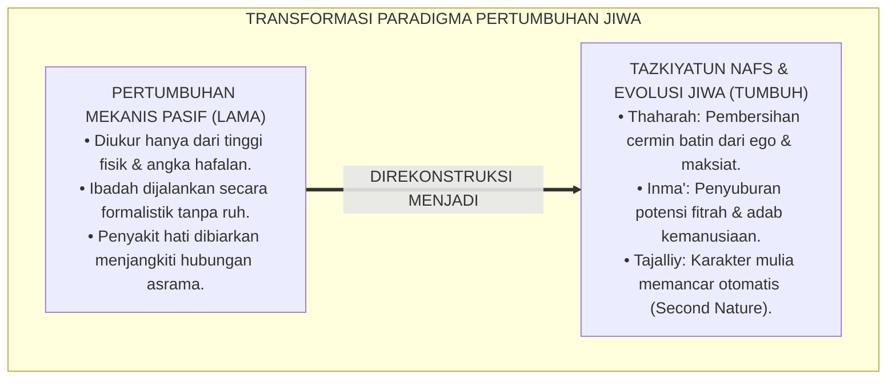
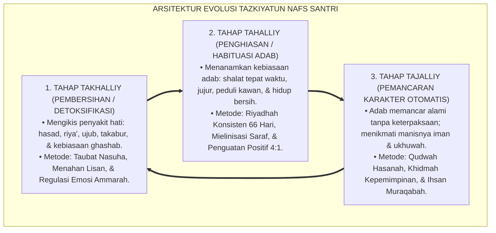
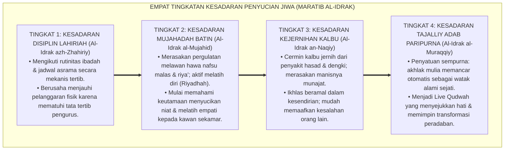
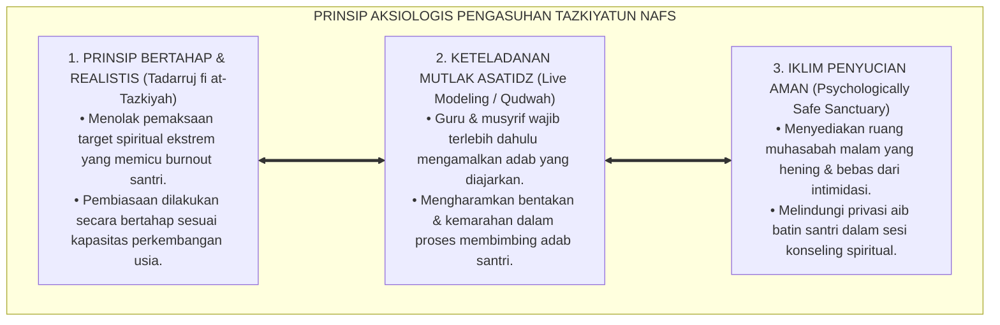

# P1-03-01: TAZKIYATUN NAFS DAN PERTUMBUHAN JIWA SANTRI (TAZKIYATUN NAFS & SPIRITUAL MATURATION)
## *Monograf Riset Akademik: Analisis Ontologis & Psiko-Spiritual Proses Penyucian Jiwa Berkelanjutan, Dialektika Takhalliy-Tahalliy-Tajalliy, Dinamika Riyadhah & Mujahadah Imam Al-Ghazali, Konvergensi Neurosains Pembiasaan Neuroplastisitas, Serta Implikasi bagi Ekosistem Pesantren 24 Jam*

**Nomor Identifikasi**: `P1-03-01/MONOGRAF-RISET-TAZKIYATUN-NAFS/2026`  
**Domain**: `01 Philosophy` > `03 Human Development` (Sub-Modul 01: *Tazkiyatun Nafs*)  
**Klasifikasi Naskah**: *Academic Research Monograph* (Monograf Riset Akademik Fondasional)  
**Rumpun Disiplin Pengkaji**: Tasawuf Amali & Akhlaqi (*Tazkiyatun Nafs*), Hermeneutika Turats Qur'ani-Nabawi, Neurosains Kognitif Pembiasaan (*Neuroplasticity & Habit Formation*), Psikologi Perkembangan Moral, Manajemen Pengasuhan Asrama 24 Jam  

---

> ### 💡 INTISARI EKSEKUTIF (EXECUTIVE SUMMARY)
>
> * **Kelemahan Paradigma Lama: Reduksionisme Perkembangan Linier Fisik-Kognitif:**  
>   Banyak sistem pendidikan membatasi makna pertumbuhan hanya pada pertambahan tinggi badan fisik atau penimbunan hafalan teks (*Cognitive Accumulation*). Dimensi kematangan spiritual jiwa dan pembersihan penyakit batin (hasad, ujub, riya') terabaikan, melahirkan generasi yang cerdas namun rapuh secara moral.
> * **Inovasi Konseptual: Tazkiyatun Nafs sebagai Episentrum Human Development:**  
>   TUMBUH menegaskan bahwa pertumbuhan manusia sejati adalah proses pembersihan dan penyuburan jiwa (*Thaharah & Inma'*) melalui triad klasik: **1. Takhalliy (Pengosongan dari Sifat Tercela & Ego Negatif); 2. Tahalliy (Penghiasan Kalbu dengan Adab & Amal Shalih); 3. Tajalliy (Pemancaran Karakter Adab Otomatis / Second Nature)**.
> * **Formulasi Operasional & Pembuktian Lapangan:**  
>   Monograf ini menguraikan konvergensi riyadhah Turats dengan neurosains pembiasaan sirkuit basal ganglia, 4 Tingkatan Kesadaran Penyucian Jiwa (*Maratib al-Idrak*), protokol muhasabah reflektif malam, dan etika tata kelola ekosistem pembiasaan 24 jam.

---

## 📑 DAFTAR ISI MONOGRAF

- [BAB I: LANDASAN TEORETIS & DISKURSUS KRITIS](#bab-i-landasan-teoretis--diskursus-kritis)
  - [1. Latar Belakang Masalah: Krisis Reduksi Pertumbuhan Manusia di Era Modern](#1-latar-belakang-masalah-krisis-reduksi-pertumbuhan-manusia-di-era-modern)
  - [2. Eksegesis Turats Hakikat Tazkiyah: Dimensi Thaharah dan Inma' (QS. Asy-Syams: 9–10 & QS. Al-A'la: 14–15)](#2-eksegesis-turats-hakikat-tazkiyah-dimensi-thaharah-dan-inma-qs-asy-syams-910--qs-al-ala-1415)
  - [3. Triad Dialektika Jiwa: Takhalliy, Tahalliy, dan Tajalliy dalam Dinamika Asrama](#3-triad-dialektika-jiwa-takhalliy-tahalliy-dan-tajalliy-dalam-dinamika-asrama)
  - [4. Konvergensi Neurosains Pembiasaan: Neuroplastisitas Sinaptik, Mielinisasi, & Sirkuit Basal Ganglia](#4-konvergensi-neurosains-pembiasaan-neuroplastisitas-sinaptik-mielinisasi--sirkuit-basal-ganglia)
  - [5. Kasuistika Lapangan: Kejenuhan Mental Santri dalam Riyadhah & Resolusi Restoratif](#5-kasuistika-lapangan-kejenuhan-mental-santri-dalam-riyadhah--resolusi-restoratif)
- [BAB II: FORMULASI KONSEPTUAL & PEMBAHASAN MENDALAM](#bab-ii-formulasi-konseptual--pembahasan-mendalam)
  - [1. Eksplanasi Teoretis Tazkiyatun Nafs sebagai Poros Human Development TUMBUH](#1-eksplanasi-teoretis-tazkiyatun-nafs-sebagai-poros-human-development-tumbuh)
  - [2. Dekomposisi Dimensi & Empat Tingkatan Kesadaran Penyucian Jiwa (Maratib al-Idrak)](#2-dekomposisi-dimensi--empat-tingkatan-kesadaran-penyucian-jiwa-maratib-al-idrak)
  - [3. Matriks Konvergensi Keilmuan: Riyadhah Turats vs Neurokognitif Habit Loop](#3-matriks-konvergensi-keilmuan-riyadhah-turats-vs-neurokognitif-habit-loop)
  - [4. Prinsip Aksiologis & Etika Tata Kelola Ekosistem Pembiasaan Adab 24 Jam](#4-prinsip-aksiologis--etika-tata-kelola-ekosistem-pembiasaan-adab-24-jam)
  - [5. Diskusi Filosofis Mendalam & Implikasi bagi Masa Depan Peradaban Pendidikan Islam](#5-diskusi-filosofis-mendalam--implikasi-bagi-masa-depan-peradaban-pendidikan-islam)
- [BAB III: KESIMPULAN & APARATUS AKADEMIS](#bab-iii-kesimpulan--aparatus-akademis)
  - [1. Tabel Sintesis Temuan Riset Tazkiyatun Nafs dan Pertumbuhan Jiwa](#1-tabel-sintesis-temuan-riset-tazkiyatun-nafs-dan-pertumbuhan-jiwa)
  - [2. Daftar Pustaka Akademis & Rujukan Turats Primer](#2-daftar-pustaka-akademis--rujukan-turats-primer)
  - [3. Catatan Kaki Akademis (Footnotes)](#3-catatan-kaki-akademis-footnotes)
  - [4. Glosarium Istilah Ilmiah & Turats Tazkiyatun Nafs](#4-glosarium-istilah-ilmiah--turats-tazkiyatun-nafs)

---

# BAB I: LANDASAN TEORETIS & DISKURSUS KRITIS

---

### 1. Latar Belakang Masalah: Krisis Reduksi Pertumbuhan Manusia di Era Modern

Perkembangan manusia (*Human Development*) dalam kerangka pendidikan kontemporer kerap direduksi ke dalam parameter materialistik yang dangkal:
* **Reduksi Linier Kognitif-Biologis**: Pertumbuhan santri hanya diukur dari pertambahan usia biologis dan nilai angka raport hafalan. Ketidakmatangan emosi, kerapuhan mental saat menghadapi masalah (*Low Adversity Quotient*), dan penyakit batin (iri dengki, sombong, ghasab) dianggap remeh.
* **Formalisme Ibadah Tanpa Penyadaran Jiwa**: Shalat berjamaah dan hafalan doa diwajibkan secara mekanis tanpa bimbingan penghayatan kalbu, sehingga ibadah tidak membuahkan pencegahan dari perbuatan keji dan mungkar (QS. Al-'Ankabut: 45).
* **Keniscayaan Doktrin Tazkiyatun Nafs**: Islam memandang pertumbuhan sejati sebagai proses evolusi psiko-spiritual yang membersihkan cermin kalbu agar mampu memantulkan cahaya hikmah Allah SWT secara jernih.[^1]

---

### 2. Eksegesis Turats Hakikat Tazkiyah: Dimensi Thaharah dan Inma' (QS. Asy-Syams: 9–10 & QS. Al-A'la: 14–15)

Al-Qur'an mengaitkan keberuntungan mutlak manusia dengan proses Tazkiyah:

$$\text{قَدْ أَفْلَحَ مَن زَكَّاهَا ۝ وَقَدْ خَابَ مَن دَسَّاهَا}$$

*"Sungguh beruntunglah orang yang menyucikan jiwanya (Zakkaha), dan sungguh rugilah orang yang mengotorinya (Dassaha)."* (QS. Asy-Syams [91]: 9–10).[^2]

Para ahli tafsir dan pakar bahasa Turats (Ibnu Manzhur, *Lisan al-'Arab*) menjelaskan bahwa akar kata **Zakka (زَكَّى)** memiliki dua makna fundamental yang berjalan serempak:
1. **At-Thaharah (التَّطْهِيرُ)**: Membersihkan jiwa dari kotoran syahwat hewani, sifat sombong (*Kibr*), dengki (*Hasad*), dan pamer (*Riya'*).
2. **Al-Inma' (الإِنْمَاءُ)**: Menumbuhkan, menyuburkan, dan melejitkan seluruh potensi fitrah kebaikan hingga menghasilkan buah adab yang berkah.[^3]

---

### 3. Triad Dialektika Jiwa: Takhalliy, Tahalliy, dan Tajalliy dalam Dinamika Asrama

Para ulama tasawuf Sunni merumuskan proses evolusi jiwa melalui tiga tahapan dialektis:
* **Takhalliy (التَّخَلِّي)**: Proses detoksifikasi batin: menghentikan kebiasaan buruk (mencela teman, malas shalat, mengambil sandal kawan/ghashab) dan bertaubat nasuha.
* **Tahalliy (التَّحَلِّي)**: Proses menghiasi jiwa dengan rutinitas adab: membiasakan senyum salam, mendahulukan kawan dalam antrean makan, menjaga kebersihan loker, dan dawam wudhu.
* **Tajalliy (التَّجَلِّي)**: Puncak kematangan karakter: adab luhur tidak lagi dirasakan sebagai keterpaksaan yang berat, melainkan memancar secara spontan sebagai watak alami (*Second Nature*).[^4]

---

### 4. Konvergensi Neurosains Pembiasaan: Neuroplastisitas Sinaptik, Mielinisasi, & Sirkuit Basal Ganglia

Sains kognitif modern (Lally et al., 2010; Duhigg, 2012) memvalidasi kebenaran konsep *Riyadhah* Turats:
* Pembentukan kebiasaan baru (*Habit Formation*) menuntut proses pengulangan terstruktur rata-rata selama **66 hari** secara konsisten.
* Pada fase awal (*Mujahadah*), aktivitas menahan malas menuntut kerja keras korteks prefrontal (*dlPFC*) yang melelahkan. Namun melalui proses *Mielinisasi* jalur sinapsis, perilaku adab secara bertahap dialihkan ke **Basal Ganglia**, menjadikannya otomatis (*Automaticity Loop*) tanpa beban kognitif berlebih.[^5]

---

### 5. Kasuistika Lapangan: Kejenuhan Mental Santri dalam Riyadhah & Resolusi Restoratif

* **Studi Kasus: Santri Mengalami Burnout Spiritual Akibat Target Ibadah Berlebih Tanpa Jeda**  
  * **Dilema**: Santri dipaksa bangun pukul 03.00, tilawah 5 juz sehari tanpa jeda istirahat siang, hingga santri jatuh sakit dan mengalami depresi spiritual (*Fathrah Ruhaniyyah*).
  * **Analisis Hadits & Tazkiyah TUMBUH**: Lembaga melanggar sabda Rasulullah ﷺ: *"Sesungguhnya agama ini mudah, dan tidaklah seseorang memaksakan diri secara berlebihan melainkan ia akan binasa/kalah"* (HR. Al-Bukhari No. 39).
  * **Resolusi Restoratif TUMBUH**: Musyrif menyusun ulang jadwal riyadhah yang berimbang (*Al-Qashd wal Iqtishad*): membatasi durasi bangun malam, menjamin waktu qailulah (tidur siang 20–30 menit), dan menyisipkan dialog muhasabah yang menenangkan. Santri kembali bugar dan menikmati keindahan ibadah dengan hati yang riang.[^6]

---

# BAB II: FORMULASI KONSEPTUAL & PEMBAHASAN MENDALAM

---

### 1. Eksplanasi Teoretis Tazkiyatun Nafs sebagai Poros Human Development TUMBUH

Ekosistem TUMBUH merumuskan arsitektur perkembangan jiwa ke dalam **Siklus Evolusi Jiwa Santri (*Daurat at-Taqaddum ar-Ruhaniy*)**:

#### 🔬 Pembahasan Mendalam Tiga Fase Triad Tazkiyah:
1. **Fase Takhalliy (*Spiritual Detoxification*)**: Membersihkan sumbatan-sumbatan nafsu yang menghalangi masuknya hidayah Allah ke dalam kalbu.[^7]
2. **Fase Tahalliy (*Moral Habituation*)**: Mengisi ruang kalbu yang telah bersih dengan benih-benih adab nabawi melalui pembiasaan ritme harian asrama 24 jam.[^8]
3. **Fase Tajalliy (*Character Radiance*)**: Terwujudnya integritas kepribadian yang utuh (*Insan Adabi*), di mana seluruh gerak-gerik tubuh menjadi cermin keindahan akhlak Islam.[^9]

---

### 2. Dekomposisi Dimensi & Empat Tingkatan Kesadaran Penyucian Jiwa (Maratib al-Idrak)

Transformasi kedewasaan penyucian jiwa santri berlangsung melalui **Empat Tingkatan Kesadaran Tazkiyah (*Maratib al-Idrak at-Tazkiyawiy*)**:

#### 🔄 Narasi Analitis Dinamika Transisi Filosofis Antar-Tingkatan:
* **Transisi Tingkat 1 ke Tingkat 2 (Dari Disiplin Fisik Menuju Perjuangan Batin Mujahadah)**: Santri mula-mula shalat karena bel asrama. Pada tingkatan kedua, santri bergulat melawan bisikan malas dan riya' di dalam hatinya, berusaha meraih kekhusyukan sejati.
* **Transisi Tingkat 2 ke Tingkat 3 (Dari Mujahadah Berat Menuju Kejernihan Batin)**: Pada tingkatan ketiga, beban perjuangan terasa ringan: santri mulai merasakan kelezatan ibadah (*Halawatul Ibadah*) dan hilangnya rasa iri hati terhadap prestasi kawan.
* **Transisi Tingkat 3 ke Tingkat 4 (Pencapaian Derajat Tajalliy Adab)**: Pada tingkatan tertinggi, kepribadian santri menjadi rahmat yang hidup: perilakunya senantiasa mendatangkan kebaikan, tutur katanya menenteramkan, dan tindakannya membawa berkah bagi seluruh masyarakat.[^10]

---

### 3. Matriks Konvergensi Keilmuan: Riyadhah Turats vs Neurokognitif Habit Loop

Ekosistem TUMBUH memadukan metodologi klasik dan neurosains ke dalam matriks pembiasaan terpadu:

| Komponen Pembiasaan | Metodologi Turats Islam | Teori Neurosains (Habit Loop) | Aplikasi Praksis Asrama 24 Jam |
| :--- | :--- | :--- | :--- |
| **Pemicu (*Cue / Trigger*)** | Adzan, waktu shalat, & bel jadwal. | *Contextual Cue & Visual Triggers*. | Suara adzan merdu & pengingat jadwal asrama rapi. |
| **Rutinitas (*Routine*)** | Wudhu tertib, shalat, & dzikir ma'tsurat.| *Motor & Cognitive Routine Execution*. | Pembiasaan antrean tertib & shalat berjamaah tepat waktu. |
| **Imbalan (*Reward*)** | Ketenangan jiwa (*Thuma'ninah*) & pahala.| *Dopamine Release & Neural Reinforcement*.| Penguatan apresiasi positif 4:1 & kehangatan ukhuwah. |
| **Siklus Waktu** | *Istiqamah* 40 Hari s/d 70 Hari. | Konsolidasi Otomatisitas 66 Hari (Lally).| Pemantauan konsistensi adab di logbook digital PBIS. |

---

### 4. Prinsip Aksiologis & Etika Tata Kelola Ekosistem Pembiasaan Adab 24 Jam

Tazkiyatun Nafs melahirkan prinsip etika tata kelola pengasuhan kelembagaan:

#### 📋 Panduan Etika Pengasuhan Lapangan:
1. **Pengasuhan dengan Kasih Sayang (*Rifq*)**: Mendidik dengan kelembutan, meneladani sabda Rasulullah ﷺ bahwa kelembutan senantiasa memperindah segala sesuatu.
2. **Keseimbangan Hak Sirkadian Tubuh**: Menjamin jadwal pembinaan ruhani tidak mengorbankan hak tidur 7 jam dan waktu makan santri.[^11]
3. **Tradisi Saling Mendoakan dalam Kesunyian**: Musyrif membiasakan mendoakan santri binaannya satu per satu pada saat tahajjud malam.[^12]

---

### 5. Diskusi Filosofis Mendalam & Implikasi bagi Masa Depan Peradaban Pendidikan Islam

Tazkiyatun Nafs sebagai episentrum perkembangan manusia membawa dampak revolusioner bagi masa depan peradaban:

* **Melahirkan Generasi yang Kebal Terhadap Penyakit Moralitas Modern**:  
  Santri yang jiwanya telah melalui proses *Takhalliy - Tahalliy - Tajalliy* memiliki imunitas spiritual yang tangguh menghadapi gelombang pornografi, konsumerisme, narsisme media sosial, dan nihilisme zaman.
* **Menjadikan Pesantren Sebagai Mata Air Spiritualitas Bangsa**:  
  Pesantren bukan sekadar lembaga transfer ilmu kognitif, melainkan oase penyucian jiwa yang memancarkan energi kedamaian, akhlak mulia, dan keberkahan bagi seluruh negeri.
* **Mengembalikan Kemurnian Risalah Kenabian**:  
  Rasulullah ﷺ diutus dengan misi utama menyucikan jiwa manusia (*Wa Yuzakkihim*). Menegakkan Tazkiyatun Nafs berarti menghidupkan kembali jantung risalah kenabian dalam dunia pendidikan modern.[^13]

---

# BAB III: KESIMPULAN & APARATUS AKADEMIS

---

### 1. Tabel Sintesis Temuan Riset Tazkiyatun Nafs dan Pertumbuhan Jiwa

| Dimensi Parameter | Mazhab Pertumbuhan Linier Sekuler | Pola Tradisional Formalistik | **Doktrin Tazkiyatun Nafs TUMBUH** | Landasan Rujukan Primer | Implikasi Praksis Lapangan |
| :--- | :--- | :--- | :--- | :--- | :--- |
| **Hakikat Tumbuh** | Pertambahan usia fisik & kognitif.| Penimbunan hafalan teks kitab. | **Evolusi Jiwa: Thaharah & Inma' Fitrah.** | QS. Asy-Syams: 9–10; Al-Ghazali. | Keseimbangan akal, ruh, jiwa, & raga. |
| **Tahapan Proses** | Linier mengikuti angka umur. | Acak tanpa panduan sistemik. | **Triad: Takhalliy, Tahalliy, Tajalliy.** | Al-Qusyairi; Ibnu Qayyim. | Pembiasaan bertahap & eliminasi penyakit hati. |
| **Landasan Saraf** | Pembiasaan mekanis stimulus-respons.| Mengabaikan batas saraf biologis.| **Neuroplastisitas & Otomatisitas 66 Hari.**| Lally et al. (2010); Sapolsky (2017).| Jadwal terstruktur ramah sirkadian otak. |
| **Peran Pendidik** | Pengajar instruktur kurikulum. | Mandor pengawas yang menakuti.| **Murabbi Ruhani Teladan (*Live Qudwah*).**| KH. Hasyim Asy'ari; Al-Attas (1980).| Konseling hangat & pendampingan sabar. |
| **Profil Lulusan** | Intelektual sekuler yang rapuh moral.| Pribadi kaku yang terbelah jiwanya.| **Insan Adabi Berakhlak Mulia Sejati.** | QS. Al-A'la: 14–15; Al-Ghazali.| Berkarakter luhur, damai, & berkah. |

---

### 2. Daftar Pustaka Akademis & Rujukan Turats Primer

1. **Al-Qur'an al-Karim wa Tarjamatu Ma'anihi**.
2. **Al-Ghazali, Abu Hamid Muhammad bin Muhammad**. (2011). *Ihya' 'Ulumiddin* (Kitab Riyadhatun Nafs & Kitab Dhamm al-Kibr wal 'Ujb). Beirut: Dar al-Ma'rifah.
3. **Ibnu Qayyim al-Jauziyyah, Syamsuddin Muhammad bin Abi Bakr**. (1416 H). *Madarijus Salikin baina Manazil Iyyaka Na'budu wa Iyyaka Nasta'in*. Beirut: Dar al-Kitab al-'Arabi.
4. **Al-Qusyairi, Abul Qasim Abdul Karim bin Hawazin**. (1428 H). *Ar-Risalah al-Qusyairiyyah*. Kairo: Dar al-Jil.
5. **Al-Attas, Syed Muhammad Naquib**. (1980). *The Concept of Education in Islam*. Kuala Lumpur: ABIM.
6. **Lally, P., van Jaarsveld, C. H., Potts, H. W., & Wardle, J.**. (2010). *How are habits formed: Modelling habit formation in the real world*. European Journal of Social Psychology, 40(6), 998–1009.
7. **Duhigg, C.**. (2012). *The Power of Habit: Why We Do What We Do in Life and Business*. New York: Random House.
8. **Sapolsky, R. M.**. (2017). *Behave: The Biology of Humans at Our Best and Worst*. New York: Penguin Press.
9. **Horner, R. H., & Sugai, G.**. (2015). *School-wide PBIS: An Overview of the Research Base*. Remedial and Special Education, 36(2), 80–85.
10. **Zehr, H.**. (2002). *The Little Book of Restorative Justice*. Intercourse: Good Books.
11. **Asy'ari, Muhammad Hasyim**. (1415 H). *Adab al-'Alim wal-Muta'allim*. Jombang: Maktabah At-Turats Al-Islami.
12. **Deci, E. L., & Ryan, R. M.**. (2000). *The "what" and "why" of goal pursuits: Human needs and the self-determination of behavior*. Psychological Inquiry, 11(4), 227–268.

---

### 3. Catatan Kaki Akademis (*Footnotes*)

[^1]: Riset Tazkiyatun Nafs dan Evolusi Spiritual Ekosistem Pesantren Berbasis TUMBUH, *Kritik atas Reduksionisme Pertumbuhan Linier*, 2026.  
[^2]: QS. Asy-Syams [91]: 9–10.  
[^3]: Ibnu Manzhur, *Lisan al-'Arab*, Entri *Z-K-W*; Riset Epistemologi Bahasa Turats TUMBUH, 2026.  
[^4]: Al-Qusyairi, *Ar-Risalah al-Qusyairiyyah*, hlm. 145–178.  
[^5]: Lally, P., et al. (2010), *European Journal of Social Psychology*, hlm. 998–1009; Duhigg, C. (2012), *The Power of Habit*, hlm. 40–75.  
[^6]: *Shahih al-Bukhari*, Kitab al-Iman, Hadits No. 39; Dokumentasi Restorasi Manajemen Ritme Spiritual TUMBUH, 2026.  
[^7]: Al-Ghazali, *Ihya' 'Ulumiddin*, Jilid 3, Kitab *Riyadhatun Nafs*, hlm. 60–95.  
[^8]: KH. Hasyim Asy'ari, *Adab al-'Alim wal-Muta'allim*, hlm. 30–55.  
[^9]: Al-Attas, S. M. N. (1980), *The Concept of Education in Islam*, hlm. 45–70.  
[^10]: Matriks Tingkatan Kesadaran Penyucian Jiwa (*Maratib al-Idrak*) Ekosistem TUMBUH, 2026.  
[^11]: Standar Manajemen Ritme Sirkadian dan Kesehatan Fisik Asrama TUMBUH, 2026.  
[^12]: Petunjuk Teknis Pembinaan Qudwah dan Spiritualitas Murabbi Asrama TUMBUH, 2026.  
[^13]: Deklarasi Pemuliaan Tazkiyatun Nafs Dewan Riset Epistemologi Ekosistem TUMBUH, 2026.

---

### 4. Glosarium Istilah Ilmiah & Turats Tazkiyatun Nafs

1. **Tazkiyatun Nafs (تَزْكِيَةُ النَّفْسِ)**: Proses penyucian jiwa dari kotoran dosa dan penyakit hati (*Thaharah*) serta penyuburan potensi fitrah kebaikan (*Inma'*) hingga melahirkan akhlak mulia.
2. **Takhalliy (التَّخَلِّي)**: Tahap pengosongan dan pembersihan diri dari sifat-sifat tercela (*Madzmumah*) dan kebiasaan maksiat.
3. **Tahalliy (التَّحَلِّي)**: Tahap penghiasan jiwa dengan sifat-sifat terpuji (*Mahmudah*) dan konsistensi pengamalan adab syariat.
4. **Tajalliy (التَّجَلِّي)**: Tahap pemancaran karakter adab secara spontan dan alami (*Second Nature*) yang memancar dari kejernihan kalbu yang memperoleh pancaran cahaya ilahi.
5. **Riyadhah (الرِّيَاضَةُ)**: Latihan spiritual dan fisik terencana untuk mendidik hawa nafsu dan membiasakan perilaku adab yang luhur.
6. **Mujahadah (الْمُجَاهَدَةُ)**: Perjuangan batin yang sungguh-sungguh untuk melawan dorongan hawa nafsu malas dan ego pribadi demi ketaatan kepada Allah SWT.
7. **Habit Formation (Pembentukan Kebiasaan)**: Proses neurobiologis di mana suatu perilaku yang diulang secara konsisten selama rata-rata 66 hari bertransformasi menjadi sirkuit saraf otomatis di basal ganglia otak.
8. **Automaticity (Otomatisitas Perilaku)**: Kondisi di mana suatu tindakan adab dilakukan secara refleks tanpa memerlukan pengerahan energi berpikir sadar yang berat.
9. **Thuma'ninah (الطُّمَأْنِينَةُ)**: Ketenangan, ketenteraman, dan kedamaian jiwa yang mendalam yang lahir dari kesucian kalbu dan kedekatan dzikir kepada Allah SWT.
10. **Insan Adabi (الإِنْسَانُ الأَدَبِيُّ)**: Manusia paripurna yang telah mencapai kematangan jiwa melalui proses Tazkiyah, memiliki adab luhur, dan memimpin peradaban dengan penuh berkah.
