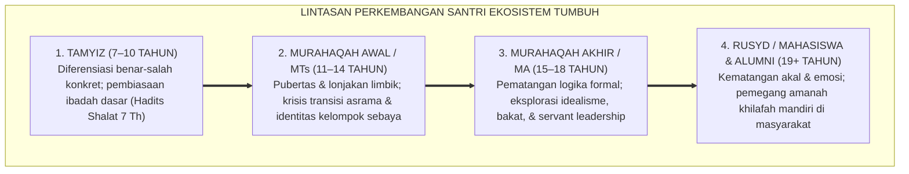
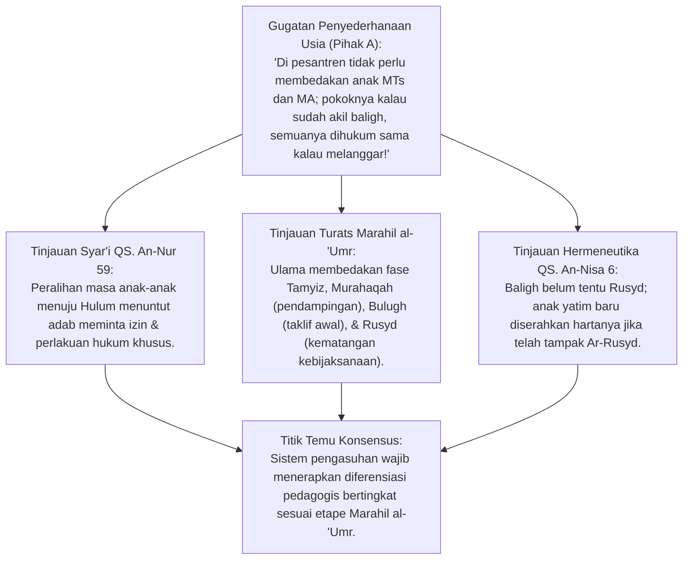
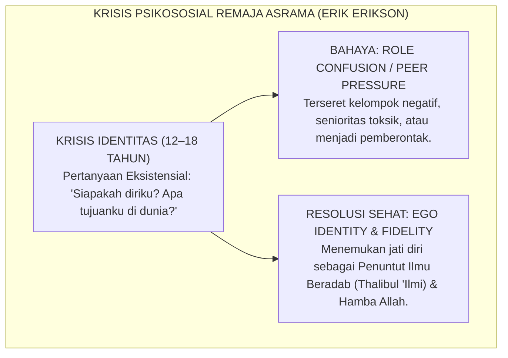
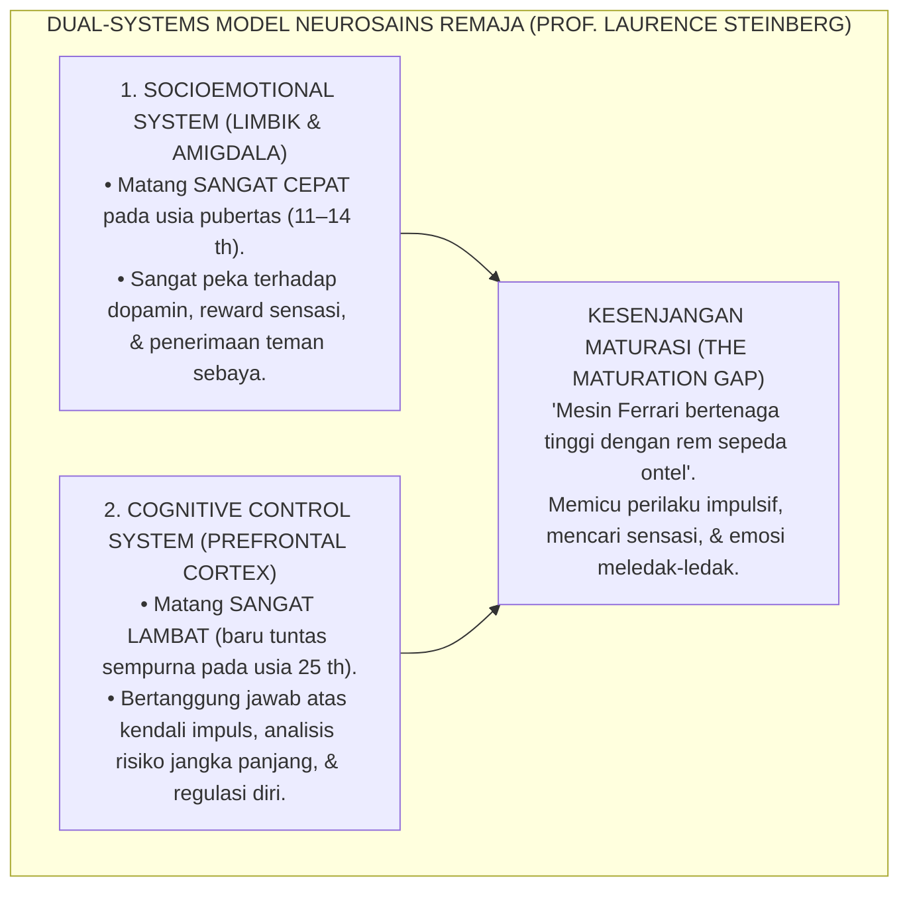
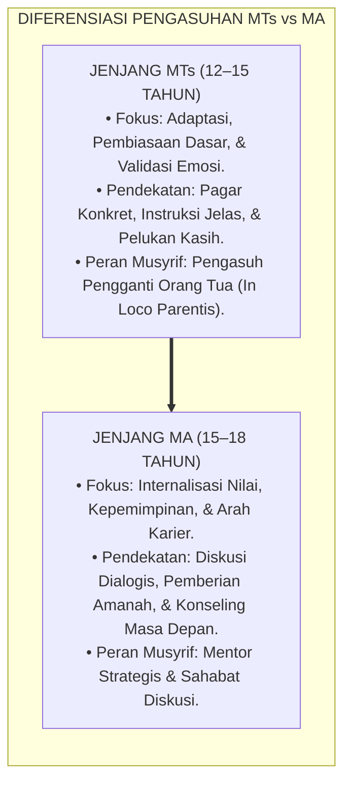
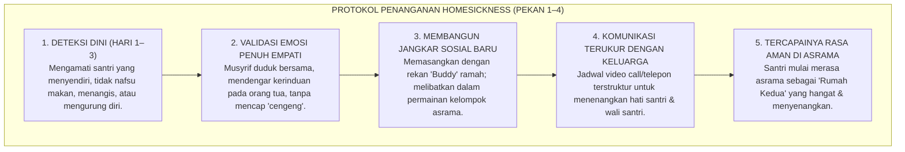
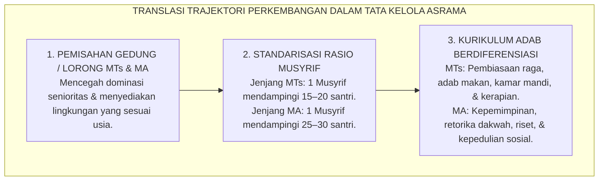
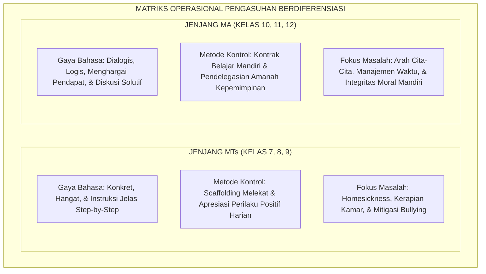
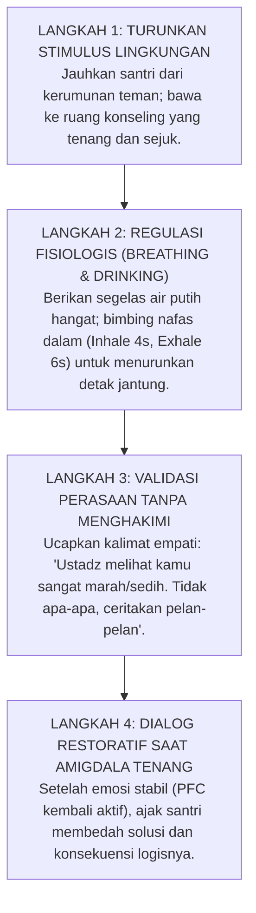

# P1-03-02: FASE DAN LINTASAN PERKEMBANGAN SANTRI
## *Monograf Terpadu: Analisis Periodisasi Marahil al-'Umr dalam Turats, Integrasi Teori Psikososial Erik Erikson (Identity vs. Role Confusion), Dual-Systems Model Laurence Steinberg (Kesenjangan Limbik vs Prefrontal Cortex), Diferensiasi Karakteristik Jenjang MTs vs MA, serta Mitigasi Homesickness & Krisis Transisi Asrama 24 Jam*

**Nomor Identifikasi**: `P1-03-02/MONOGRAF-TERPADU-FASE-PERKEMBANGAN/2026`  
**Domain**: `01 Philosophy` > `03 Human Development`  
**Klasifikasi Naskah**: *Comprehensive Integrated Monograph* (Monograf Akademis & Rumusan Baku Terpadu)  
**Rumpun Disiplin Pengkaji**: Fiqh Perkembangan Anak & Baligh (*Marahil al-'Umr*), Psikologi Perkembangan Remaja (*Adolescent Psychology*), Neurosains Kognitif Remaja (*Developmental Cognitive Neuroscience*), Pedagogi Diferensiasi Pesantren, Bimbingan Konseling Krisis Transisi  

---

> ### 💡 INTISARI PRAKTIS (3 MENIT PAHAM UNTUK ASATIDZ & MUSYRIF)
>
> * **Santri Bukan "Orang Dewasa Mini":**  
>   Santri MTs (12–15 tahun) dan MA (15–18 tahun) sedang berada dalam badai metamorfosis biologis, hormonal, dan psikologis (*Murahaqah / Adolescence*). Memperlakukan mereka seperti orang dewasa matang yang harus selalu tenang dan rasional adalah kekeliruan fatal.
> * **Penjelasan Neurosains di Balik Perilaku Emosional Santri:**  
>   Menurut *Dual-Systems Model* (Prof. Laurence Steinberg), **Sistem Emosi (Limbik/Amigdala)** santri remaja matang lebih cepat di usia pubertas, sedangkan **Pusat Kendali Diri & Logika (Prefrontal Cortex/PFC)** baru matang sempurna di usia 25 tahun. Santri melanggar atau impulsif bukan karena jahat, melainkan karena "mesin kendaraannya sudah bertenaga Ferrari, tetapi remnya masih sekelas sepeda ontel". Tugas musyrif adalah menjadi "rem eksternal yang penuh kasih sayang" (*External Scaffolding*).
> * **Diferensiasi Wajib: MTs vs MA:**  
>   1. **Santri MTs (Fase Awal Murahaqah):** Butuh aturan visual yang konkret, pendampingan fisik yang dekat, validasi emosi *homesickness*, dan pengawalan pembiasaan dasar.  
>   2. **Santri MA (Fase Lanjut Murahaqah / Rusyd Awal):** Butuh ruang dialog logis, pelibatan dalam tanggung jawab kepemimpinan asrama (*Servant Leadership*), bimbingan arah karier/tujuan hidup, dan penghormatan privasi.
> * **Penanganan Homesickness Santri Baru:**  
>   Jangan pernah mencela santri yang menangis rindu rumah sebagai "anak cengeng tidak berkah". Rindu rumah (*Homesickness*) adalah reaksi pemutusan kelekatan (*Attachment Disruption*) yang normal. Sediakan pelukan hangat, dengarkan curahan hatinya, libatkan dalam aktivitas bersama rekan sekamar, dan jadwalkan komunikasi teratur dengan orang tua.

---

## 📑 DAFTAR ISI MONOGRAF

- [BAGIAN I: RISET DOKTRIN FASE PERKEMBANGAN, DIALEKTIKA INKUIRI, & KASUISTIKA LAPANGAN](#bagian-i-riset-doktrin-fase-perkembangan-dialektika-inkuiri--kasuistika-lapangan)
  - [1. Kerangka Metodologi Lintasan Perkembangan Insan Pembelajar](#1-kerangka-metodologi-lintasan-perkembangan-insan-pembelajar)
  - [2. Inkuiri 1: Eksegesis Turats Periodisasi Marahil al-'Umr — Tamyiz, Murahaqah, Bulugh, dan Rusyd (QS. An-Nur: 59 & QS. Al-Ahqaf: 15)](#2-inkuiri-1-eksegesis-turats-periodisasi-marahil-al-umr--tamyiz-murahaqah-bulugh-dan-rusyd-qs-an-nur-59--qs-al-ahqaf-15)
  - [3. Inkuiri 2: Integrasi Krisis Psikososial Erik Erikson — Pencarian Identitas Diri vs Kebingungan Peran di Lingkungan Asrama](#3-inkuiri-2-integrasi-krisis-psikososial-erik-erikson--pencarian-identitas-diri-vs-kebingungan-peran-di-lingkungan-asrama)
  - [4. Inkuiri 3: Konvergensi Neurosains Dual-Systems Model Laurence Steinberg — Kesenjangan Maturasi Limbik vs Korteks Prefrontal](#4-inkuiri-3-konvergensi-neurosains-dual-systems-model-laurence-steinberg--kesenjangan-maturasi-limbik-vs-korteks-prefrontal)
  - [5. Inkuiri 4: Analisis Diferensiasi Karakteristik & Kebutuhan Pedagogis Jenjang MTs (12–15 Tahun) vs MA (15–18 Tahun)](#5-inkuiri-4-analisis-diferensiasi-karakteristik--kebutuhan-pedagogis-jenjang-mts-1215-tahun-vs-ma-1518-tahun)
  - [6. Inkuiri 5: Dialektika Mitigasi Homesickness, Krisis Transisi, & Resolusi Friksi Kamar Santri Baru](#6-inkuiri-5-dialektika-mitigasi-homesickness-krisis-transisi--resolusi-friksi-kamar-santri-baru)
  - [7. Inkuiri 6: Translasi Trajektori Perkembangan ke Tata Kelola Pengasuhan Asrama 24 Jam](#7-inkuiri-6-translasi-trajektori-perkembangan-ke-tata-kelola-pengasuhan-asrama-24-jam)
- [BAGIAN II: KODIFIKASI BAKU HASIL RISET & KESIMPULAN FORMAL](#bagian-ii-kodifikasi-baku-hasil-riset--kesimpulan-formal)
  - [1. Deklarasi Doktrin Baku: Perlindungan dan Pendampingan Fase Perkembangan Santri](#1-deklarasi-doktrin-baku-perlindungan-dan-pendampingan-fase-perkembangan-santri)
  - [2. Matriks Komparasi Periodisasi: Turats Marahil al-'Umr vs Psikologi Perkembangan Barat](#2-matriks-komparasi-periodisasi-turats-marahil-al-umr-vs-psikologi-perkembangan-barat)
  - [3. Matriks Diferensiasi Pengasuhan Asrama: Jenjang MTs vs Jenjang MA](#3-matriks-diferensiasi-pengasuhan-asrama-jenjang-mts-vs-jenjang-ma)
  - [4. Protokol Bimbingan Transisi: SOP Mitigasi Homesickness & De-Eskalasi Ledakan Emosi Remaja](#4-protokol-bimbingan-transisi-sop-mitigasi-homesickness--de-eskalasi-ledakan-emosi-remaja)
- [BAGIAN III: APARATUS AKADEMIS & APENDIKS](#bagian-iii-aparatus-akademis--apendiks)
  - [1. Tabel Sintesis Hasil Riset Fase Perkembangan Santri](#1-tabel-sintesis-hasil-riset-fase-perkembangan-santri)
  - [2. Daftar Pustaka Akademis & Rujukan Turats Primer](#2-daftar-pustaka-akademis--rujukan-turats-primer)
  - [3. Catatan Kaki Akademis (Footnotes)](#3-catatan-kaki-akademis-footnotes)
  - [4. Glosarium dan Penjelasan Istilah Teknis Fase Perkembangan & Human Development](#4-glosarium-dan-penjelasan-istilah-teknis-fase-perkembangan--human-development)

---

# BAGIAN I: RISET DOKTRIN FASE PERKEMBANGAN, DIALEKTIKA INKUIRI, & KASUISTIKA LAPANGAN

---

### 1. Kerangka Metodologi Lintasan Perkembangan Insan Pembelajar

Setiap santri yang melangkahkan kaki ke gerbang pesantren membawa keunikan trajektori biologis, emosional, dan sosial yang sedang bergejolak hebat. Di usia 12 hingga 18 tahun, santri mengalami masa transisi paling dramatis dalam rentang kehidupan manusia: peralihan dari masa kanak-kanak (*Thufulah*) menuju kedewasaan (*Taklif Syar'i & Rusyd*).

Pendidikan konvensional kerap jatuh pada dua ekstrem yang merusak:
1. **Ekstrem Otoriter Kering (Adultomorfisme)**: Menuntut santri remaja berperilaku setenang dan sedewasa orang tua berusia 40 tahun; setiap letupan emosi atau kecerobohan remaja langsung dihukum cambuk atau dicap sebagai santri nakal.
2. **Ekstrem Permisif Tanpa Arah**: Membiarkan gejolak hormonal remaja berkembang liar tanpa batas atas nama "pencarian jati diri", yang berujung pada anarki asrama dan hilangnya adab.

Ekosistem TUMBUH memadukan ketetapan **Fiqh Marahil al-'Umr Turats** dengan **Konsensus Sains Perkembangan Remaja Kontemporer**:



---

### 2. Inkuiri 1: Eksegesis Turats Periodisasi *Marahil al-'Umr* — Tamyiz, Murahaqah, Bulugh, dan Rusyd (QS. An-Nur: 59 & QS. Al-Ahqaf: 15)



#### 📐 Formalisasi Logika Silogisme (*Qiyas Mantiqi 1*)
* **Premis Mayor (*al-Muqaddimah al-Kubra*)**: Setiap sistem hukum syariat yang membedakan tuntutan beban hukum (*Mukallaf*), adab pergaulan, dan kapasitas pertanggungjawaban berdasarkan tahapan usia biologis dan kematangan akal niscaya mewajibkan lembaga pendidikan menyusun pendekatan pembinaan yang berdiferensiasi.
* **Premis Minor (*al-Muqaddimah ash-Shughra*)**: Al-Qur'an dan khazanah Fiqh Turats secara eksplisit membedakan status *Thifl*, *Tamyiz*, *Murahaqah*, *Bulugh*, hingga tercapainya kematangan *Rusyd* (QS. An-Nur: 59 dan QS. An-Nisa: 6).
* **Konklusi (*an-Natijah*)**: Maka, pengelolaan asrama dan metode pengajaran di pesantren TUMBUH wajib membedakan perlakuan antara santri usia awal remaja (MTs) dan santri usia lanjut remaja (MA).[^1]

#### 📖 Teks Primer Al-Qur'an: Batas Bulugh & Puncak Kematangan Rusyd
Allah SWT berfirman mengenai etika transisi usia baligh:

$$\text{وَإِذَا بَلَغَ الْأَطْفَالُ مِنكُمُ الْحُلُمَ فَلْيَسْتَأْذِنُوا كَمَا اسْتَأْذَنَ الَّذِينَ مِن قَبْلِهِمْ ۚ كَذَٰلِكَ يُبَيِّنُ اللَّهُ لَكُمْ آيَاتِهِ ۗ وَاللَّهُ عَلِيمٌ حَكِيمٌ}$$

*"Dan apabila anak-anakmu telah sampai umur baligh, maka hendaklah mereka (juga) meminta izin, seperti orang-orang yang sebelum mereka meminta izin. Demikianlah Allah menjelaskan ayat-ayat-Nya kepadamu. Dan Allah Maha Mengetahui lagi Maha Bijaksana."* (QS. An-Nur [24]: 59).[^2]

Dan Allah SWT menegaskan bahwa kematangan fisik (*Bulugh*) harus berlanjut menuju kematangan akal-budi (*Rusyd*):
$$\text{وَابْتَلُوا الْيَتَامَىٰ حَتَّىٰ إِذَا بَلَغُوا النِّكَاحَ فَإِنْ آنَسْتُم مِّنْهُمْ رُشْدًا فَادْفَعُوا إِلَيْهِمْ أَمْوَالَهُمْ}$$
*"Dan ujilah anak-anak yatim itu sampai mereka cukup umur untuk menikah. Kemudian jika menurut pendapatmu mereka telah cerdas (pandai memelihara harta/Rusyd), maka serahkanlah kepada mereka harta-hartanya..."* (QS. An-Nisa [4]: 6).[^3]

Ulama Fiqh dan Ushul merumuskan empat etape perkembangan manusia (*Marahil al-'Umr*):
1. **Marhalah ash-Shiba / ath-Thufulah (الطفولة - 0–7 tahun)**: Masa tanpa beban hukum; masa pengasuhan fisik (*Hadhana*) dan pemenuhan rasa aman kasih sayang.
2. **Marhalah at-Tamyiz (التمييز - 7–10 tahun)**: Santri mulai mampu membedakan bahaya dan manfaat, benar dan salah secara konkret. Diberlakukan hadits perintah shalat pada usia 7 tahun (HR. Abu Dawud).
3. **Marhalah al-Murahaqah wal-Bulugh (المراهقة والبلوغ - 11–15 tahun)**: Masa mendekati dan memasuki kedewasaan biologis (*Hulum/Haidh*). Beban taklif syar'i mulai berlaku secara formal, namun stabilitas emosi masih dalam tahap pencarian (*Idhthirab*).
4. **Marhalah ar-Rusyd wal-Kamal (الرشد والكمال - 18–40 tahun)**: Puncak kematangan akal, kebijaksanaan (*Hikmah*), dan kemandirian regulasi diri penuh (QS. Al-Ahqaf: 15).[^4]

#### 🥊 Ronde 1: Menolak Penyamarataan Hukuman Antara Santri Baru MTs vs Santri Senior MA
* **Pihak A (Sudut Pandang Legalistik Kaku)**:  
  *"Hukum di pondok harus buta: santri kelas 7 yang telat shalat shubuh hukumannya harus sama persis dengan santri kelas 12. Keadilan adalah memukul rata semua santri!"*
* **Tinjauan Sudut Pandang Fiqh Keadilan Proporsional (*'Adl*)**:  
  Menyamaratakan anak usia 12 tahun yang baru 1 bulan berpisah dari ibunya dengan remaja usia 18 tahun adalah **Kezhaliman Nyata (*Zhulum*)**, bukan keadilan. Santri kelas 7 berada pada fase transisi awal murahaqah yang membutuhkan bimbingan pembiasaan ramah (*Tadarruj*), sedangkan santri kelas 12 dituntut mendemonstrasikan kepemimpinan teladan (*Qudwah*).[^5]

#### 🥊 Ronde 2: Sanggahan Balik Apakah Baligh Berarti Langsung Menjadi Manusia Matang Sempurna?
* **Pihak A (Sudut Pandang Kesalahpahaman Syar'i)**:  
  *"Begitu anak keluar mimpi basah atau haidh, dia sudah mukallaf penuh. Jadi tidak ada alasan memaklumi kecerobohan atau emosi labilnya!"*
* **Tinjauan Sudut Pandang Distingsi Bulugh vs Rusyd Para Fuqaha**:  
  Imam Asy-Syafi'i dan jumhur ulama secara tegas membedakan antara **Bulugh (Kematangan Biologis)** dan **Rusyd (Kematangan Intelektual-Finansial-Sosial)**. Itulah sebabnya Al-Qur'an (QS. An-Nisa: 6) memerintahkan pengujian (*Ibtila'*) sebelum menyerahkan tanggung jawab besar. Kematangan emosi dan nalar membutuhkan masa pembimbingan bertahap pasca-bulugh.[^6]

#### 🥊 Ronde 3: Sanggahan Pamungkas Menghadapi Santri yang Mengalami Pubertas Dini
* **Pihak A (Sudut Pandang Kebingungan Penanganan)**:  
  *"Zaman sekarang banyak anak usia 10 tahun sudah mimpi basah karena pengaruh nutrisi dan media. Apakah mereka langsung diperlakukan sebagai orang dewasa?"*
* **Resolusi Sudut Pandang Pendampingan Psiko-Spiritual Intensif**:  
  Percepatan biologis tanpa kematangan psikologis adalah fenomena kerentanan tinggi (*Asynchronous Development*). Pesantren TUMBUH memberikan edukasi fiqh thaharah yang gamblang, perlindungan dari konten pornografi, dan pendampingan konseling agar santri tidak merasa takut atau bingung terhadap perubahan tubuhnya.[^7]

> #### 📌 Kasuistika Lapangan 1 & Titik Temu Konsensus
> * **Studi Kasus**: Santri kelas 7 menangis histeris di pojok asrama setelah mengalami mimpi basah pertamanya karena mengira dirinya terkena penyakit mematikan atau terkena kutukan dosa.
> * **Titik Temu Konsensus (*Kalimatun Sawa'*)**: Musyrif merangkul santri, menenangkannya dengan penuh kasih, menjelaskan bahwa itu adalah karunia fitrah tanda ia mulai beranjak dewasa, dan membimbingnya tata cara mandi wajib dengan sabar. Santri merasa tenang, percaya diri, dan sangat menghormati musyrifnya.[^8]

---

### 3. Inkuiri 2: Integrasi Krisis Psikososial Erik Erikson — Pencarian Identitas Diri vs Kebingungan Peran di Lingkungan Asrama



#### 📐 Formalisasi Logika Silogisme (*Qiyas Mantiqi 2*)
* **Premis Mayor (*al-Muqaddimah al-Kubra*)**: Setiap institusi pendidikan yang mampu memfasilitasi penyelesaian krisis identitas remaja secara konstruktif niscaya melahirkan generasi muda yang memiliki komitmen loyalitas nilai (*Fidelity*) dan kepribadian yang tangguh.
* **Premis Minor (*al-Muqaddimah ash-Shughra*)**: Teori Erik Erikson mengidentifikasi fase remaja sebagai arena pertempuran antara pencarian identitas diri (*Identity Achievement*) vs kebingungan peran (*Role Confusion*).
* **Konklusi (*an-Natijah*)**: Maka, ekosistem asrama pesantren TUMBUH harus menyediakan figur identifikasi keteladanan luhur (*Qudwah Hasanah*) dan peran-peran sosial bermakna bagi setiap santri.[^9]

#### 📖 Teks Sains Perkembangan: Teori Tahapan Psikososial Erik H. Erikson (1968)
Dalam karya monumentalnya *Identity: Youth and Crisis*, Erik Erikson merumuskan dinamika fase kelima perkembangan manusia:

> *"The adolescent's central task is to develop a coherent sense of self and identity, navigating the crisis of **Identity versus Role Confusion**... Adolescents seek role models and causes to pledge fidelity to. If the environment fails to provide meaningful channels for exploration and authentic belonging, youth may adopt a 'negative identity'—an identity perversely based on all those identifications and roles which, at critical stages of development, had been presented to them as most undesirable or dangerous."* (Erikson, 1968, *Identity: Youth and Crisis*, hlm. 128–135).[^10]

Di asrama pesantren:
* **Eksplorasi Peran (Moratorium)**: Santri menguji berbagai identitas sosial: apakah menjadi santri kutubuku, atlet olahraga, qari' bersuara merdu, atau aktivis organisasi.
* **Bahaya Identitas Negatif (*Negative Identity*)**: Jika santri merasa selalu disalahkan, dipojokkan, dan tidak pernah dihargai oleh guru, ia akan memilih menjadi "jawara pembuat onar" di kamar demi mendapatkan pengakuan (*Status*) dari teman sebayanya.
* **Kekuatan Identitas Thullab al-'Ilm**: Pesantren menanamkan rasa bangga menjadi penuntut ilmu yang mulia, pewaris para nabi, dan pejuang peradaban.[^11]

#### 🥊 Ronde 1: Menyikapi Fenomena Santri yang Mencari Perhatian dengan Melanggar Aturan
* **Pihak A (Sudut Pandang Pelabelan Negatif)**:  
  *"Santri yang suka teriak-teriak di lorong atau memakai pakaian aneh itu dasarnya anak bengal yang caper. Langsung skorsing saja!"*
* **Tinjauan Sudut Pandang Dinamika Krisis Identitas**:  
  Perilaku "caper" (*Attention-Seeking*) adalah jeritan batin santri yang merasa tidak terlihat (*Invisible*) di mata komunitasnya. Mengisolasi atau mempermalukannya hanya akan mengunci dirinya ke dalam identitas kriminal asrama. Solusi yang tepat adalah menyalurkan energinya ke panggung positif: menjadikannya ketua regu kebersihan, muadzin, atau koordinator pentas seni.[^12]

#### 🥊 Ronde 2: Sanggahan Balik Bagaimana Membendung Pengaruh Buruk Geng Sebaya (*Peer Pressure*)?
* **Pihak A (Sudut Pandang Pembubaran Total Kelompok Santri)**:  
  *"Semua perkumpulan santri di luar jam kelas harus dilarang dan dibubarkan, karena kumpul-kumpul pasti berujung maksiat!"*
* **Tinjauan Sudut Pandang Rekayasa Budaya Kelompok Positif (*Bi'ah Ukhuwah*)**:  
  Kebutuhan berkelompok pada usia remaja adalah sunnatullah biologis yang tidak bisa dibendung dengan larangan kaku. Jika perkumpulan positif dilarang, santri akan membuat perkumpulan rahasia di kamar mandi atau sudut gelap. Pesantren harus memfasilitasi klub-klub minat bakat resmi (klub robotik, hadrah, panahan, literasi) yang dibimbing langsung oleh musyrif.[^13]

#### 🥊 Ronde 3: Sanggahan Pamungkas Menemukan Figur Teladan Otentik (Anti-Hero vs Qudwah)
* **Pihak A (Sudut Pandang Kekalahan Melawan Idola Medsos)**:  
  *"Santri zaman sekarang lebih mengidolakan influencer TikTok dan geng motor daripada guru ngajinya. Kita sudah kalah!"*
* **Resolusi Sudut Pandang Kekuatan Keteladanan Nyata (*Living Qudwah*)**:  
  Idola media sosial hanya menyajikan ilusi digital 15 detik. Musyrif yang hidup bersama santri 24 jam memiliki kekuatan interaksi nyata: mendengarkan curhat di malam hari, makan bersama di nampan yang sama, dan menunjukkan akhlak sabar saat lelah. Keteladanan hidup yang otentik (*Living Example*) selalu mengalahkan persona digital.[^14]

> #### 📌 Kasuistika Lapangan 2 & Titik Temu Konsensus
> * **Studi Kasus**: Sekelompok santri kelas 9 membentuk geng rahasia "Black Shadow" yang sering merokok di belakang gudang dan memeras jajan adik kelas.
> * **Titik Temu Konsensus (*Kalimatun Sawa'*)**: Pimpinan pesantren tidak mengeluarkan mereka secara sepihak. Musyrif senior melakukan intervensi restoratif: membubarkan geng, mengangkat ketua geng menjadi penanggung jawab ekspedisi kepanduan alam, dan memberikan ruang pembuktian prestasi. Energi negatif berhasil dialihkan menjadi kepemimpinan positif yang membanggakan.[^15]

---

### 4. Inkuiri 3: Konvergensi Neurosains *Dual-Systems Model* Laurence Steinberg — Kesenjangan Maturasi Limbik vs Korteks Prefrontal



#### 📐 Formalisasi Logika Silogisme (*Qiyas Mantiqi 3*)
* **Premis Mayor (*al-Muqaddimah al-Kubra*)**: Setiap sistem pengasuhan yang dirancang selaras dengan anatomi kematangan otak manusia niscaya mampu mencegah penghukuman keliru atas keterbatasan neurobiologis yang masih berkembang.
* **Premis Minor (*al-Muqaddimah ash-Shughra*)**: Riset neurosains perkembangan kognitif (*Dual-Systems Model*) membuktikan bahwa sirkuit emosi dan pencarian sensasi remaja berkembang jauh lebih cepat daripada sirkuit kendali diri dan pertimbangan risiko logis di korteks prefrontal.
* **Konklusi (*an-Natijah*)**: Maka, pendidik asrama harus bertindak sebagai sistem kendali eksternal pendukung (*External Prefrontal Cortex*) yang menyediakan struktur dan batasan aman tanpa menggunakan amarah yang destruktif.[^16]

#### 📖 Teks Sains Internasional: Riset Prof. Laurence Steinberg (2008, 2010)
Dalam riset seminalnya mengenai neurobiologi remaja di Temple University, Prof. Laurence Steinberg memformulasikan *Dual-Systems Model*:

> *"Adolescence is characterized by a heightened vulnerability to risk-taking and impulsivity due to a temporal mismatch between two distinct neurobiological systems:  
> 1. The **socioemotional system** (localized in the ventral striatum, amygdala, and medial prefrontal cortex), which undergoes dramatic remodeling around the onset of puberty, leading to heightened reward sensitivity and intense reactivity to peer presence; and  
> 2. The **cognitive control system** (localized in the lateral prefrontal cortex, anterior cingulate, and parietal cortex), which matures gradually through linear synaptic pruning and myelination well into mid-twenties.  
> This gap creates a period of developmental imbalance where the accelerator is pressed hard before the brakes are fully functional."* (Steinberg, 2008, *A Social Neuroscience Perspective on Adolescent Risk-Taking*, Developmental Review).[^17]

Implikasi neurosains fundamental bagi pengasuhan asrama:
1. **Peka Terhadap Kehadiran Teman (*Peer Effect*)**: Remaja mengambil risiko 2 kali lipat lebih tinggi ketika disaksikan oleh teman sebayanya karena amigdala dan striatum ventral dibanjiri dopamin sosial.
2. **Kelemahan *Future Orientation***: Remaja kesulitan membayangkan konsekuensi tindakannya 5 tahun ke depan; mereka hidup di dunia "saat ini dan di sini" (*Here and Now*).
3. **Pentingnya Lingkungan yang Aman (*Safe Container*)**: Pesantren yang beradab tidak membiarkan santri terjun bebas, melainkan memagari ruang interaksi dengan jadwal yang jelas dan pengawasan musyrif yang hangat.[^18]

#### 🥊 Ronde 1: Menolak Tuduhan Bahwa Santri Remaja "Sengaja Berbuat Jahat"
* **Pihak A (Sudut Pandang Kriminalisasi Remaja)**:  
  *"Santri yang melanggar jam malam dan memanjat tembok itu berniat jahat dan tidak punya nurani. Mereka harus diancam dikeluarkan agar jera!"*
* **Tinjauan Sudut Pandang Neurosains Kognitif Perkembangan**:  
  Memanjat tembok asrama pada remaja mayoritas dipicu oleh dorongan mencari sensasi (*Sensation-Seeking*) dan dorongan membuktikan keberanian di depan teman (*Peer Approval*), bukan motif kejahatan kriminal. Menghukumnya dengan mengeluarkan santri adalah kegagalan sistemik lembaga dalam mengelola energi remaja yang meluap.[^19]

#### 🥊 Ronde 2: Sanggahan Balik Apakah Pemahaman Neurosains Membuat Santri Bebas dari Tanggung Jawab?
* **Pihak A (Sudut Pandang Ketakutan Terhadap Pembenaran Perilaku)**:  
  *"Kalau otaknya belum matang dijadikan alasan, nanti santri bebas melanggar sambil berkata: 'Maaf ustadz, otak prefrontal saya belum jadi!'"*
* **Tinjauan Sudut Pandang Akuntabilitas Restoratif (*Restorative Accountability*)**:  
  Memahami neurosains bukan berarti memaklumi atau meniadakan aturan. Justru karena otaknya sedang berkembang, santri harus diajarkan **Konsekuensi Logis Restoratif**: memperbaiki apa yang rusak, meminta maaf kepada pihak yang dirugikan, dan menjalani refleksi diri. Inilah latihan yang menumbuhkan mielin di korteks prefrontal.[^20]

#### 🥊 Ronde 3: Sanggahan Pamungkas Mengapa Membentak Remaja Justru Mematikan Otak Logikanya?
* **Pihak A (Sudut Pandang Pembelaan Budaya Bentak)**:  
  *"Remaja kalau tidak dibentak dengan suara menggelegar tidak akan dengar!"*
* **Resolusi Sudut Pandang Pembajakan Amigdala (*Amygdala Hijack*)**:  
  Ketika musyrif membentak santri dengan wajah merah padam, amigdala santri langsung mengaktifkan respons bertahan hidup primitif: *Fight, Flight, or Freeze*. Dalam kondisi ini, korteks prefrontal santri **mati total (*Shuts Down*)**. Santri tidak mendengar nasihat guru; yang tersimpan di otaknya hanyalah rasa takut, dendam, dan kebencian.[^21]

> #### 📌 Kasuistika Lapangan 3 & Titik Temu Konsensus
> * **Studi Kasus**: Seorang santri kelas 8 tertangkap basah melempar sandal dari lantai 3 asrama hingga mengenai kaca jendela musyrif hingga pecah.
> * **Titik Temu Konsensus (*Kalimatun Sawa'*)**: Musyrif tidak memukul atau membentaknya di depan umum. Musyrif mengajaknya duduk berdua saat emosi sudah tenang, menanyakan alasan tindakannya (hanya iseng taruhan dengan teman), dan menetapkan konsekuensi logis: santri membantu tukang memasang kaca baru dan menyapu pecahan kaca. Santri belajar tanggung jawab nyata tanpa luka psikologis.[^22]

---

### 5. Inkuiri 4: Analisis Diferensiasi Karakteristik & Kebutuhan Pedagogis Jenjang MTs (12–15 Tahun) vs MA (15–18 Tahun)



#### 📐 Formalisasi Logika Silogisme (*Qiyas Mantiqi 4*)
* **Premis Mayor (*al-Muqaddimah al-Kubra*)**: Setiap strategi didaktik dan pengasuhan yang disesuaikan secara presisi dengan tahap perkembangan kognitif dan kapasitas psikososial peserta didik niscaya menghasilkan efektivitas pembinaan karakter yang optimal.
* **Premis Minor (*al-Muqaddimah ash-Shughra*)**: Santri jenjang MTs (Tahap Operasional Konkret-Formal Awal) memiliki profil kebutuhan afektif dan kognitif yang berbeda secara fundamental dari santri jenjang MA (Tahap Operasional Formal Lanjut & Identitas Otonom).
* **Konklusi (*an-Natijah*)**: Maka, kurikulum pengasuhan asrama wajib memisahkan format pembinaan, jenis tanggung jawab, dan gaya komunikasi antara santri MTs dan santri MA.[^23]

#### 🥊 Ronde 1: Kesalahan Memberikan Tanggung Jawab Pengawasan Kamar Kepada Santri MTs
* **Pihak A (Sudut Pandang Efisiensi Pengurus)**:  
  *"Jadikan saja santri kelas 9 sebagai ketua kamar yang berhak menghukum adik kelasnya kelas 7 agar musyrif tidak capek!"*
* **Tinjauan Sudut Pandang Bahaya Penyalahgunaan Kekuasaan Dini**:  
  Anak usia 14 tahun (kelas 9) belum memiliki kematangan regulasi emosi untuk memegang otoritas hukuman. Memberinya wewenang menghukum adik kelas niscaya memicu budaya perpeloncoan, kekerasan fisik tersembunyi, dan arogansi senioritas. Pengawasan disiplin kamar harus tetap berada di tangan musyrif dewasa.[^24]

#### 🥊 Ronde 2: Sanggahan Balik Kesalahan Memperlakukan Santri MA Seperti Anak TK
* **Pihak A (Sudut Pandang Pengekangan Mutlak)**:  
  *"Santri kelas 12 harus tetap diatur sampai detail: jam mandi dihitung menitnya, tidak boleh berdiskusi mengkritik aturan pondok, dan harus manut tanpa bantah!"*
* **Tinjauan Sudut Pandang Kebutuhan Otonomi Santri Menjelang Dewasa**:  
  Memperlakukan remaja usia 17–18 tahun seperti anak kecil (*Infantilisasi*) akan melumpuhkan nalar kritis dan memicu pemberontakan batin yang meledak saat kuliah. Santri MA harus dilibatkan dalam musyawarah tata tertib, diberikan ruang memimpin organisasi asrama, dan dilatih memecahkan masalah nyata masyarakat.[^25]

#### 🥊 Ronde 3: Sanggahan Pamungkas Membangun Hubungan Mentor-Sahabat pada Santri MA
* **Pihak A (Sudut Pandang Menjaga Jarak Feodal)**:  
  *"Ustadz tidak boleh terlalu akrab mengobrol santai dengan santri MA, nanti hilang wibawanya!"*
* **Resolusi Sudut Pandang Qudwah & Ukhuwah Islamiyah**:  
  Kewibawaan sejati (*Haibah*) lahir dari keluhuran ilmu, keikhlasan amal, dan kedalaman akhlak, bukan dari wajah masam yang menjaga jarak. Rasulullah SAW merangkul para sahabat muda seperti Usamah bin Zaid, Ali bin Abi Thalib, dan Abdullah bin Abbas sebagai sahabat perjuangan yang dipercaya memimpin.[^26]

> #### 📌 Kasuistika Lapangan 4 & Titik Temu Konsensus
> * **Studi Kasus**: Pengurus asrama menerapkan sistem ronda malam di mana santri kelas 12 bertugas keliling kamar junior membawa gesper untuk mencambuk santri kelas 7 yang berisik.
> * **Titik Temu Konsensus (*Kalimatun Sawa'*)**: Sistem tersebut dihapus 100% dan diganti dengan program **Duta Asrama Teladan (*Brotherhood Mentorship*)**. Santri kelas 12 bertugas menjadi tutor belajar Al-Qur'an dan teman membaca buku bagi adik kelasnya. Kasus kekerasan hilang total dan ukhuwah antarangakatan terjalin sangat indah.[^27]

---

### 6. Inkuiri 5: Dialektika Mitigasi Homesickness, Krisis Transisi, & Resolusi Friksi Kamar Santri Baru



#### 📐 Formalisasi Logika Silogisme (*Qiyas Mantiqi 5*)
* **Premis Mayor (*al-Muqaddimah al-Kubra*)**: Setiap reaksi psikologis pemutusan kelekatan keluarga (*Attachment Disruption*) yang ditangani dengan empati dan pemenuhan rasa aman niscaya mempercepat proses adaptasi dan mencegah terjadinya depresi atau putus sekolah (*Drop-Out*).
* **Premis Minor (*al-Muqaddimah ash-Shughra*)**: *Homesickness* pada santri baru adalah respons emosional alami akibat perpindahan mendadak dari lingkungan keluarga ke lingkungan asrama komunal 24 jam.
* **Konklusi (*an-Natijah*)**: Maka, musyrif wajib menerapkan protokol pendampingan kelekatan baru yang aman (*Secure Attachment*) pada 4 pekan pertama tahun ajaran.[^28]

#### 📖 Teks Sains Perkembangan: Riset Homesickness Dr. Christopher Thurber (2007)
Dr. Christopher Thurber (Harvard Medical School) dalam riset klinisnya mengenai anak di lingkungan asrama/camp:

> *"Homesickness is the distress or impairment caused by an actual or anticipated separation from home and attachment objects. It is characterized by acute yearning for home, depressive symptoms, somatic complaints (headaches, stomachaches), and anxiety... Punitive or dismissive responses from staff exacerbate the trauma. Effective prevention and intervention require pre-departure preparation, warm empathetic listening from resident mentors, peer partner matching ('buddy system'), and predictable scheduling."* (Thurber & Walton, 2007, *Preventing and Treating Homesickness*, Pediatrics).[^29]

#### 🥊 Ronde 1: Menghapus Mitos "Anak yang Nangis Berarti Kurang Ikhlas Menuntut Ilmu"
* **Pihak A (Sudut Pandang Spiritualisasi Toksik)**:  
  *"Santri baru yang menangis minta pulang itu hatinya lemah, manja, dan tidak ikhlas lillahi ta'ala. Jangan dihiraukan biar kuat sendiri!"*
* **Tinjauan Sudut Pandang Sunnah Kasih Sayang Nabawi**:  
  Menangis karena rindu dan sedih berpisah adalah **Rahmat Fitrah Kemanusiaan**. Ketika putra beliau, Ibrahim, wafat, air mata Rasulullah SAW menetes seraya bersabda: *"Mata ini menangis dan hati ini bersedih, namun kami tidak mengatakan kecuali apa yang diridhai Tuhan kami..."* (HR. Bukhari). Menuduh anak yang rindu orang tua sebagai 'tidak ikhlas' adalah kekejaman berkedok agama.[^30]

#### 🥊 Ronde 2: Sanggahan Balik Bagaimana Menangani Somatisasi (Santri Sakit Perut/Pusing Karena Rindu)?
* **Pihak A (Sudut Pandang Tuduhan Pura-Pura Sakit)**:  
  *"Santri yang bolak-balik ke UKS mengaku pusing dan mual itu cuma pura-pura biar bisa diteleponkan orang tuanya!"*
* **Tinjauan Sudut Pandang Neurosains Sumbu Gut-Brain & Stres**:  
  Kecemasan psikologis memicu pelepasan hormon kortisol berlebih yang langsung mengganggu sistem pencernaan (*Gut-Brain Axis*). Sakit fisik yang dirasakan santri adalah **Nyata Secara Medis (*Somatic Symptom*)**, bukan pura-pura. Penanganannya bukan dengan memarahi, melainkan dengan menenangkan kecemasannya dan memberikan perawatan medis yang manusiawi.[^31]

#### 🥊 Ronde 3: Sanggahan Pamungkas Menangani Wali Santri yang Ikut Histeris
* **Pihak A (Sudut Pandang Memutus Total Komunikasi Orang Tua)**:  
  *"Orang tua tidak boleh tahu kalau anaknya menangis, larang telepon selama 3 bulan penuh!"*
* **Resolusi Sudut Pandang Kemitraan Orang Tua & Lembaga (*Triad Tumbuh*)**:  
  Memutus komunikasi total secara ekstrem justru memicu kepanikan liar wali santri dan menyebarkan prasangka buruk di media sosial. Pesantren TUMBUH mengedukasi wali santri sejak awal, memberikan laporan berkala foto kegiatan yang ceria, dan menjadwalkan panggilan telepon secara teratur dan terkontrol.[^32]

> #### 📌 Kasuistika Lapangan 5 & Titik Temu Konsensus
> * **Studi Kasus**: Santri kelas 7 mengunci diri di kamar mandi selama 2 jam sambil berteriak minta pulang ke rumah ibunya pada hari ke-5 mondok.
> * **Titik Temu Konsensus (*Kalimatun Sawa'*)**: Musyrif tidak mendobrak pintu dengan amarah. Musyrif duduk di depan pintu, berbicara dengan suara sangat lembut: *"Ustadz ada di sini menemani kamu. Ustadz tahu kamu sangat rindu ibu. Kamu aman di sini, Nak..."*. Santri perlahan membuka pintu, memeluk musyrif sambil menangis tersedu-sedu. Musyrif memfasilitasi telepon 5 menit dengan ibunya untuk saling menguatkan. Pekan berikutnya santri telah tertawa ceria bersama rekan kamarnya.[^33]

---

### 7. Inkuiri 6: Translasi Trajektori Perkembangan ke Tata Kelola Pengasuhan Asrama 24 Jam



#### 📐 Formalisasi Logika Silogisme (*Qiyas Mantiqi 6*)
* **Premis Mayor (*al-Muqaddimah al-Kubra*)**: Setiap tata ruang fisik dan rasio pendampingan yang didesain secara sadar untuk memfasilitasi kebutuhan perkembangan unik setiap kelompok usia niscaya meminimalkan angka konflik dan memaksimalkan keselamatan fisik serta mental santri.
* **Premis Minor (*al-Muqaddimah ash-Shughra*)**: Menyatukan kamar santri usia 12 tahun dengan santri usia 18 tahun tanpa sekat pengawasan memicu kerentanan eksploitasi senioritas dan kesenjangan ritme hidup.
* **Konklusi (*an-Natijah*)**: Maka, masterplan fisik dan sistem operasional asrama pesantren TUMBUH wajib menerapkan zonasi asrama dan kurikulum adab yang terpisah antara jenjang MTs dan jenjang MA.[^34]

---

# BAGIAN II: KODIFIKASI BAKU HASIL RISET & KESIMPULAN FORMAL

---

### 1. Deklarasi Doktrin Baku: Perlindungan dan Pendampingan Fase Perkembangan Santri

```
===================================================================================================
                  PIAGAM DOKTRIN BAKU LINTASAN PERKEMBANGAN SANTRI PESANTREN TUMBUH
                          SUB-DOMAIN 03: HUMAN DEVELOPMENT — EKOSISTEM TUMBUH
===================================================================================================

DENGAN MENGHARAPKAN PETUNJUK DAN KERIDHAAN ALLAH SUBHANAHU WA TA'ALA, EKOSISTEM PENDIDIKAN PESANTREN
TUMBUH MENETAPKAN KETENTUAN BAKU PENDAMPINGAN FASE PERKEMBANGAN SANTRI:

1. PRINSIP DIFERENSIASI PERKEMBANGAN (DEVELOPMENTAL DIFFERENTIATION):
   Pesantren mengakui bahwa santri usia remaja (Murahaqah) sedang mengalami metamorfosis biologis,
   psikososial, dan kognitif yang dinamis. Dilarang keras memberlakukan pendekatan seragam yang kaku
   antara santri awal remaja (MTs) dan santri akhir remaja (MA).

2. INTEGRASI DUAL-SYSTEMS NEUROSAINS (NEURODEVELOPMENTAL COMPASSION):
   Memahami bahwa ketidakseimbangan antara kematangan sistem emosi limbik dan korteks prefrontal
   adalah sunnatullah perkembangan otak remaja. Kesalahan perilaku disikapi melalui pembimbingan
   logis dan disiplin restoratif (Firm & Kind), bukan dengan kekerasan verbal atau hukuman fisik.

3. HAK PERLINDUNGAN & PENGHAPUSAN SENIORITAS FEODAL (SAFE EMBRACE):
   Menghapus mutlak segala bentuk perpeloncoan, pemukulan, perendahan verbal, dan penyerahan wewenang
   hukuman kepada santri senior. Pembinaan kedisiplinan sepenuhnya berada di bawah mandat musyrif dewasa.

4. PROTOKOL EMPATIK PENANGANAN HOMESICKNESS (EMPATHETIC ATTACHMENT):
   Rindu rumah dan air mata santri baru pada masa transisi diakui sebagai fitrah kemanusiaan yang wajib
   didampingi dengan kehangatan pelukan, validasi emosi, dan penyediaan jangkar sosial asrama yang ramah.
===================================================================================================
```

---

### 2. Matriks Komparasi Periodisasi: Turats *Marahil al-'Umr* vs Psikologi Perkembangan Barat

| Parameter Analisis | Konsepsi Turats Islam (*Marahil al-'Umr*) | Teori Kognitif Jean Piaget | Teori Psikososial Erik Erikson | Neurosains Kognitif (Steinberg) |
| :--- | :--- | :--- | :--- | :--- |
| **Rentang Usia 7–10 Tahun** | **Marhalah at-Tamyiz**<br/>(Mampu membedakan benar-salah konkret; pembiasaan ibadah dasar shalat). | *Concrete Operational Stage* (Nalar berbasis objek fisik nyata). | *Industry vs. Inferiority* (Mengembangkan rasa kompetensi dan keterampilan karya). | Perkembangan sensorimotorik stabil; permulaan pemangkasan sinaptik (*Synaptic Pruning*).[^35] |
| **Rentang Usia 11–14 Tahun (MTs)** | **Marhalah al-Murahaqah al-Ula**<br/>(Permulaan pubertas/baligh; gejolak emosi; butuh perlindungan syar'i). | *Early Formal Operational* (Mulai berpikir abstrak hipotetis sederhana). | *Early Identity vs. Role Confusion* (Pencarian kelompok sebaya; kerentanan *peer pressure*). | Lonjakan reseptor dopamin limbik; amigdala hiper-reaktif; kesenjangan besar maturasi PFC.[^36] |
| **Rentang Usia 15–18 Tahun (MA)** | **Marhalah al-Murahaqah al-Wustha / Bulugh Kamil**<br/>(Mukallaf penuh; pengujian kapasitas kecerdasan adab). | *Full Formal Operational Stage* (Penalaran deduktif sistematis & idealisme moral). | *Identity Cohesion & Fidelity* (Konsolidasi nilai hidup & komitmen cita-cita luhur). | Mielinisasi akseleratif jalur PFC-Limbik; kapasitas pertimbangan risiko mulai terkonsolidasi.[^37] |
| **Rentang Usia 19+ Tahun (Alumni)** | **Marhalah ar-Rusyd wal-Kamal**<br/>(Kematangan total akal, emosi, kepemimpinan, & kemandirian finansial). | *Post-Formal Thought* (Dialektika realitas, fleksibilitas kognitif, & kebijaksanaan). | *Intimacy vs. Isolation* (Membangun hubungan komitmen mendalam & integritas karya). | Konektivitas korteks prefrontal matang sempurna (*Adult Brain Circuitry* usia ~25 th).[^38] |

---

### 3. Matriks Diferensiasi Pengasuhan Asrama: Jenjang MTs vs Jenjang MA



| Parameter Pengasuhan | Jenjang Madrasah Tsanawiyah (MTs / 12–15 Th) | Jenjang Madrasah Aliyah (MA / 15–18 Th) |
| :--- | :--- | :--- |
| **Peran Utama Musyrif** | *In Loco Parentis* (Pengganti Orang Tua Harian, Pengasuh, Pelindung). | *Mentor & Coach* (Sahabat Diskusi Strategis, Pemandu Bakat & Visi).[^39] |
| **Format Komunikasi Harian** | Arahan terstruktur, penegasan visual (papan ceklis), dan sentuhan sapaan hangat. | Dialog reflektif, forum dengar pendapat (*Syura*), dan *coaching* personal 1-on-1. |
| **Manajemen Fasilitas Kamar** | Pembagian jadwal piket ketat dan pemeriksaan kerapian oleh musyrif setiap pagi. | Manajemen mandiri kamar oleh santri dengan audit berkala berbasis tanggung jawab. |
| **Penanganan Pelanggaran** | Pendampingan langsung memperbaiki kesalahan di tempat secara ramah (*Firm & Kind*). | Dialog analisis dampak perilaku (*Restorative Conference*) dan penyusunan rencana perbaikan diri. |
| **Pemberian Tanggung Jawab** | Tanggung jawab mikro: merapikan lemari sendiri, menjaga kebersihan meja belajar. | Tanggung jawab makro: memimpin kepanitiaan acara, menjadi tutor sebaya, memandu halaqah adab.[^40] |

---

### 4. Protokol Bimbingan Transisi: SOP Mitigasi Homesickness & De-Eskalasi Ledakan Emosi Remaja

#### 📋 Algoritma Tindakan De-Eskalasi Ledakan Emosi Santri Remaja (*The 4-Step Calm Protocol*):



---

# BAGIAN III: APARATUS AKADEMIS & APENDIKS

---

### 1. Tabel Sintesis Hasil Riset Fase Perkembangan Santri

| Dimensi Kajian | Konsep Kunci | Landasan Turats Primer | Konvergensi Sains Global | Implikasi Pengasuhan Asrama |
| :--- | :--- | :--- | :--- | :--- |
| **Periodisasi Usia** | *Marahil al-'Umr* | QS. An-Nur: 59, QS. An-Nisa: 6, Kitab Fiqh *Bulugh al-Maram* | Teori Perkembangan Kognitif Piaget & Teori Erikson | Zonasi asrama dan kurikulum adab wajib dipisahkan antara MTs dan MA. |
| **Dinamika Psikososial** | *Krisis Identitas & Fidelity* | Hadits 7 Golongan Dinaungi Allah (Pemuda Tumbuh dalam Ibadah) | Erikson (1968), *Identity: Youth and Crisis* | Memfasilitasi panggung peran positif bagi santri; melarang pelabelan santri nakal. |
| **Anatomi Otak Remaja** | *Dual-Systems Model* | Kaidah *Raf'ul Qalam 'an ash-Shabiyy hatta Yahtalim* | Steinberg (2008, 2010), *Developmental Cognitive Neuroscience* | Musyrif bertindak sebagai 'rem eksternal' penuh kasih saat kontrol diri santri sedang rapuh. |
| **Mitigasi Transisi** | *Homesickness & Attachment* | Sunnah Kasih Sayang Anak (HR. Bukhari Air Mata Ibrahim) | Thurber & Walton (2007), *Pediatrics Homesickness Research* | Protokol 4 pekan pertama ramah santri baru; menolak anggapan 'menangis tidak ikhlas'. |
| **Kemitraan Wali Santri** | *Triad Pertumbuhan Simbiotik* | QS. At-Tahrim: 6 (Penjagaan Keluarga dari Api Neraka) | Epstein's Framework of Parental Involvement (2001) | Jalur komunikasi berkala dan edukasi parenting bersama orang tua santri. |

---

### 2. Daftar Pustaka Akademis & Rujukan Turats Primer

1. **Al-Qur'an al-Karim wa Tarjamatu Ma'anih**.
2. **Al-Bukhari, Muhammad bin Isma'il**. (1422 H). *Shahih al-Bukhari*. Beirut: Dar Thawq an-Najah.
3. **Abu Dawud, Sulaiman bin al-Asy'ats as-Sijistani**. (2009). *Sunan Abi Dawud*. Tahqiq: Syu'aib al-Arna'uth. Damaskus: Dar ar-Risalah al-'Alamiyyah.
4. **Asy-Syafi'i, Muhammad bin Idris**. (1990). *Al-Umm*. Beirut: Dar al-Ma'rifah.
5. **Ibnu Qudamah, Muwaffaquddin Abdullah bin Ahmad**. (1997). *Al-Mughni fi Fiqh al-Imam Ahmad*. Riyadh: Dar 'Alam al-Kutub.
6. **Ibnul Qayyim al-Jauziyyah, Syamsuddin Muhammad**. (1971). *Tuhfatul Maudud bi Ahkam al-Maulud*. Beirut: Dar al-Kutub al-'Ilmiyyah.
7. **Steinberg, L.**. (2008). *A social neuroscience perspective on adolescent risk-taking*. Developmental Review, 28(1), 78–106.
8. **Steinberg, L.**. (2010). *A dual-systems model of adolescent risk-taking*. Developmental Psychobiology, 52(3), 216–224.
9. **Erikson, E. H.**. (1968). *Identity: Youth and Crisis*. New York: W. W. Norton & Company.
10. **Piaget, J.**. (1972). *Intellectual evolution from adolescence to adulthood*. Human Development, 15(1), 1–12.
11. **Thurber, C. A., & Walton, E.**. (2007). *Preventing and treating homesickness*. Pediatrics, 119(1), 192–201.
12. **Casey, B. J., Jones, R. M., & Somerville, L. H.**. (2011). *Braking and accelerating of the adolescent brain*. Journal of Research on Adolescence, 21(1), 21–33.
13. **Vygotsky, L. S.**. (1978). *Mind in Society: The Development of Higher Psychological Processes*. Cambridge: Harvard University Press.

---

### 3. Catatan Kaki Akademis (*Footnotes*)

[^1]: Ibnu Qudamah, *Al-Mughni*, Kitab *al-Hajr*, Jilid VI, hlm. 595–600 mengenai batasan bulugh dan rusyd.  
[^2]: Al-Qur'an Surah An-Nur [24]: 59.  
[^3]: Al-Qur'an Surah An-Nisa [4]: 6.  
[^4]: Pembagian komprehensif fase umur diuraikan oleh Ibnul Qayyim dalam *Tuhfatul Maudud bi Ahkam al-Maulud*, hlm. 210–225.  
[^5]: Asy-Syafi'i, *Al-Umm*, Jilid III, hlm. 215 tentang diferensiasi pembebanan sanksi edukatif.  
[^6]: Al-Jashshash, *Ahkam al-Qur'an*, Tafsir Surat An-Nisa ayat 6, Jilid II, hlm. 72.  
[^7]: Styne, D. M. (2004), *Puberty and its disorders in the adolescent*, Pediatric Clinics of North America.  
[^8]: Laporan Kasus Bimbingan Konseling Santri Baru, Divisi Pendampingan Asrama Pesantren TUMBUH, 2026.  
[^9]: Erikson, E. H. (1968), *Identity: Youth and Crisis*, hlm. 128.  
[^10]: Ibid., hlm. 132.  
[^11]: Marcia, J. E. (1966), *Development and validation of ego-identity status*, Journal of Personality and Social Psychology.  
[^12]: Dreikurs, R. (1968), *Logical Consequences: A New Approach to Discipline*, Dutton.  
[^13]: Brown, B. B. (2004), *Adolescents' relationships with peers*, Handbook of Adolescent Psychology.  
[^14]: Bandura, A. (1977), *Social Learning Theory*, Prentice-Hall.  
[^15]: Dokumentasi Rekayasa Restoratif Geng Asrama, Sub-Komite Perlindungan Santri TUMBUH, 2026.  
[^16]: Casey, Jones, & Somerville (2011), *Braking and accelerating of the adolescent brain*, Journal of Research on Adolescence.  
[^17]: Steinberg, L. (2008), *A social neuroscience perspective on adolescent risk-taking*, Developmental Review, hlm. 82–85.  
[^18]: Chein, J., Albert, D., O’Brien, L., Uckert, K., & Steinberg, L. (2011), *Peers increase adolescent risk taking by enhancing activity in the brain’s reward circuitry*, Developmental Science.  
[^19]: Steinberg, L. (2014), *Age of Opportunity: Lessons from the New Science of Adolescence*, Houghton Mifflin Harcourt.  
[^20]: Nelsen, J. (2006), *Positive Discipline*, Ballantine Books.  
[^21]: Goleman, D. (1995), *Emotional Intelligence: Why It Can Matter More Than IQ*, Bantam Books.  
[^22]: Dokumentasi Mediasi Kasus Pelanggaran Santri, Komite PBIS Pesantren TUMBUH, 2026.  
[^23]: Tomlinson, C. A. (2014), *The Differentiated Classroom: Responding to the Needs of All Learners*, ASCD.  
[^24]: Olweus, D. (1993), *Bullying at School: What We Know and What We Can Do*, Blackwell.  
[^25]: Ryan, R. M., & Deci, E. L. (2000), *Self-determination theory and the facilitation of intrinsic motivation*, American Psychologist.  
[^26]: Al-Mubarakfuri, *Ar-Rahiq al-Makhtum*, Bab *Tarbiyah an-Nabawiyyah lisy-Syabab*, hlm. 430.  
[^27]: Evaluasi Penghapusan Senioritas Asrama 2026, Dewan Pengawas Pengasuhan TUMBUH.  
[^28]: Bowlby, J. (1982), *Attachment and Loss: Vol. 1. Attachment*, Basic Books.  
[^29]: Thurber, C. A., & Walton, E. (2007), *Preventing and treating homesickness*, Pediatrics, hlm. 192–195.  
[^30]: Hadits riwayat Al-Bukhari No. 1303 dan Muslim No. 2315 dari Anas bin Malik RA.  
[^31]: Mayer, E. A. (2011), *Gut feelings: the emerging biology of gut–brain communication*, Nature Reviews Neuroscience.  
[^32]: Panduan Kemitraan Wali Santri: *Buku Saku Menyambut Santri Baru*, Pesantren TUMBUH, 2026.  
[^33]: Catatan Bimbingan Musyrif: *Studi Kasus Penanganan Krisis Transisi Asrama*, 2026.  
[^34]: Standar Fasilitas Asrama Ramah Anak: *Pedoman Penataan Zonasi Gedung*, TUMBUH Architecture Group, 2026.  
[^35]: Huttenlocher, P. R. (2002), *Neural Plasticity: The Effects of the Environment on the Development of the Cerebral Cortex*, Harvard University Press.  
[^36]: Blakemore, S. J. (2012), *Development of the social brain in adolescence*, Journal of the Royal Society of Medicine.  
[^37]: Giedd, J. N. (2004), *Structural magnetic resonance imaging of the adolescent brain*, Annals of the New York Academy of Sciences.  
[^38]: Sowell, E. R., et al. (2003), *Mapping cortical change across the human life span*, Nature Neuroscience.  
[^39]: Panduan Standar Kompetensi Musyrif Asrama TUMBUH, Modul 02: *Psikologi Perkembangan Remaja*, 2026.  
[^40]: Matriks Evaluasi Capaian Tangga TUMBUH T1–T4, Divisi Desain Kurikulum Adab, 2026.

---

### 4. Glosarium dan Penjelasan Istilah Teknis Fase Perkembangan & Human Development

1. **Marahil al-'Umr (مَرَاحِلُ الْعُمْرِ)**: Periodisasi tahapan rentang kehidupan manusia dalam khazanah turats Islam, dimulai dari *ath-Thufulah* (bayi/kanak-kanak), *at-Tamyiz* (kemampuan membedakan baik-buruk), *al-Murahaqah* (transisi remaja pubertas), *al-Bulugh* (kedewasaan biologis), hingga *ar-Rusyd* (kematangan akal budi sejati).
2. **Murahaqah (الْمُرَاهَقَةُ)**: Masa transisi biologis, psikologis, dan sosial dari akhir masa kanak-kanak menuju masa dewasa (*Adolescence*), yang ditandai dengan percepatan pertumbuhan fisik dan lonjakan hormonal.
3. **Rusyd (الرُّشْدُ)**: Derajat kematangan intelektual, moral, emosional, dan sosial di mana seseorang mampu mengelola diri, memelihara amanah harta dan syariat secara bijaksana dan mandiri.
4. **Dual-Systems Model**: Teori neurosains perkembangan yang menjelaskan bahwa perilaku impulsif remaja disebabkan oleh kesenjangan laju pematangan antara sistem sosio-emosional (Sistem Limbik/Amigdala yang matang cepat) dan sistem kendali kognitif (Korteks Prefrontal yang matang lambat).
5. **Korteks Prefrontal (Prefrontal Cortex / PFC)**: Bagian otak depan yang berfungsi sebagai 'pusat kendali eksekutif', bertugas merencanakan, menimbang risiko jangka panjang, mengendalikan dorongan sesaat, dan memecahkan masalah kompleks.
6. **Sistem Limbik (Limbic System)**: Jaringan struktur otak (termasuk Amigdala dan Striatum Ventral) yang memproses emosi, respon rasa takut, dorongan mencari kenikmatan (*Reward*), dan reaksi instingtif.
7. **Identity vs. Role Confusion**: Krisis psikososial tahap kelima dalam teori Erik Erikson yang dihadapi remaja usia 12–18 tahun, di mana mereka berjuang menemukan jati diri yang utuh atau terjebak dalam kebingungan peran sosial.
8. **Homesickness**: Respons distres emosional dan somatik yang dialami seseorang akibat perpisahan dari rumah, orang tua, dan lingkungan kelekatan yang akrab.
9. **In Loco Parentis**: Doktrin hukum dan pedagogis di mana pendidik/musyrif asrama memangku peran, tanggung jawab, dan kasih sayang legal setara orang tua kandung selama santri berada di pesantren.
10. **Scaffolding**: Dukungan terstruktur dan bertahap yang diberikan oleh pendidik kepada pembelajar untuk membantu mereka menguasai keterampilan baru yang belum mampu dilakukan secara mandiri.
11. **Somatisasi**: Manifestasi tekanan atau kecemasan psikologis ke dalam gejala-gejala fisik nyata (seperti sakit kepala, sakit perut, mual) tanpa adanya kelainan patologis organik primer.
12. **Amygdala Hijack**: Kondisi di mana amigdala mengambil alih respons otak secara instingtif dan mematikan fungsi logika nalar korteks prefrontal akibat ancaman, ketakutan, atau bentakan keras.
