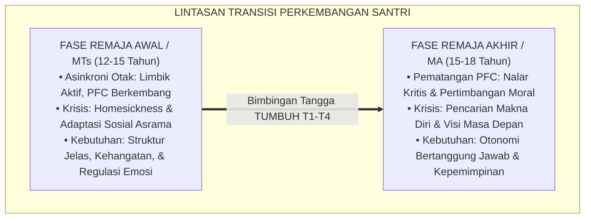
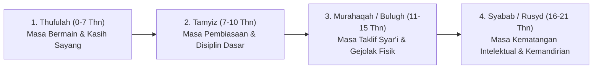

# P1-03-02: FASE DAN LINTASAN PERKEMBANGAN SANTRI
## *Transisi Bio-Psiko-Sosial Remaja Pesantren, Marahil al-'Umr dalam Turats, dan Peta Kematangan Holistik*

**Nomor Identifikasi**: `P1-03-02/LINTASAN-PERKEMBANGAN/2026`  
**Domain**: `01 Philosophy` > `03 Human Development`  
**Dewan Pakar**: `pakar-neurosains-perkembangan`, `pakar-filosofi-tumbuh`, `pakar-psikologi-belajar`

---

## 📑 DAFTAR ISI ANALITIS

1. [1. Realitas Perkembangan: Remaja Pesantren sebagai Fase Krisis Identitas](#1-realitas-perkembangan-remaja-pesantren-sebagai-fase-krisis-identitas)
2. [2. Periodisasi Usia (Marahil al-'Umr) dalam Khazanah Turats Islam](#2-periodisasi-usia-marahil-al-umr-dalam-khazanah-turats-islam)
3. [3. Konvergensi Psikologi Perkembangan: Erikson, Piaget, & Steinberg](#3-konvergensi-psikologi-perkembangan-erikson-piaget--steinberg)
4. [4. Matriks Trajektori Perkembangan Santri MTs dan MA](#4-matriks-trajektori-perkembangan-santri-mts-dan-ma)
5. [5. Implikasi bagi Kebijakan Pembinaan dan Tata Tertib Asrama](#5-implikasi-bagi-kebijakan-pembinaan-dan-tata-tertib-asrama)

---

### 1. Realitas Perkembangan: Remaja Pesantren sebagai Fase Krisis Identitas

Santri yang memasuki jenjang pesantren (usia 12–18 tahun) berada pada pusaran badai perkembangan yang sangat intens: **transisi dari masa kanak-kanak menuju kedewasaan (*adolescence transition*)** yang berlangsung serempak dengan peristiwa perpisahan fisik pertama dari orang tua (*separation from home*).

Di tengah lonjakan hormon pubertas dan perubahan tubuh yang drastis, santri dihadapkan pada tuntutan adaptasi lingkungan baru yang serba mandiri. Ketidakpahaman para pengasuh terhadap krisis perkembangan ini sering kali berujung pada pemberian label negatif yang fatal: santri yang sedang bingung mencari jati diri dicap sebagai "santri pembangkang", dan santri yang mengalami kecemasan perpisahan (*homesickness*) dianggap "santri cengeng".

Ekosistem TUMBUH memandang dinamika remaja ini bukan sebagai penyakit, melainkan **jendela peluang emas (*developmental window of opportunity*)** untuk membentuk fondasi kedewasaan yang kokoh.

---

### 2. Periodisasi Usia (Marahil al-'Umr) dalam Khazanah Turats Islam

Para fukaha dan pakar tarbiyah Islam klasik telah memetakan lintasan usia manusia secara presisi:

1. **Fase Tamyiz (التمييز - Usia 7–10 Tahun)**:  
   Fase di mana anak mulai mampu membedakan hal-hal yang membahayakan dan bermanfaat bagi dirinya. Rasulullah SAW memerintahkan pembiasaan shalat pada fase ini: *"Perintahkan anak-anakmu mendirikan shalat saat berusia tujuh tahun"* (HR. Abu Dawud).
2. **Fase Murahaqah & Bulugh (المراهقة والبلوغ - Usia 11–15 Tahun / Usia Santri MTs)**:  
   Fase dimulainya **Taklif Syar'i** (pertanggungjawaban hukum di hadapan Allah). Perubahan hormonal dan fisik menuntut bimbingan fiqh thaharah, pemahaman batasan aurat, dan regulasi nafsu syahwat.
3. **Fase Rusyd (الرشد - Usia 16–18+ Tahun / Usia Santri MA)**:  
   Al-Qur'an menggunakan istilah *Rusyd* (QS. An-Nisa': 6) untuk menggambarkan kematangan akal, kebijaksanaan dalam mengelola harta, dan kemampuan mengambil keputusan moral secara mandiri.

---

### 3. Konvergensi Teori Perkembangan Modern

Pemikiran Islam ini sejalan dengan teori-teori psikologi perkembangan terkemuka dunia:
* **Teori Perkembangan Psikososial Erik Erikson (1968)**: Remaja berada pada krisis **Identity vs Role Confusion (Identitas vs Kebingungan Peran)**. Pesantren TUMBUH menjadi lingkungan aman (*Bi'ah Shalihah*) yang menyediakan identitas positif bagi santri sebagai penuntut ilmu yang beradab.
* **Teori Perkembangan Kognitif Jean Piaget (1958)**: Santri bertransisi dari tahap *Concrete Operational* menuju **Formal Operational**—mampu berpikir abstrak, menguji hipotesis, dan memahami hikmah filosofis di balik teks-teks syariat.
* **Dual-Systems Model Laurence Steinberg (2008)**: Membuktikan bahwa ketimpangan antara sistem limbik sosio-emosional dan korteks prefrontal membuat remaja sangat rentan terhadap pengaruh teman sebaya (*peer influence*). Oleh karena itu, rekayasa iklim budaya asrama (*peer culture*) menjadi kunci keselamatan santri.

---

### 4. Matriks Trajektori Perkembangan Santri MTs dan MA

| Dimensi Perkembangan | Fase Santri MTs (Kelas 7–9 / 12–15 Tahun) | Fase Santri MA (Kelas 10–12 / 16–18 Tahun) |
| :--- | :--- | :--- |
| **Kognitif & Nalar** | Berpikir operasional konkret-transisional; membutuhkan instruksi visual dan contoh nyata. | Berpikir abstrak, kritis, dan filosofis; mampu menganalisis perbandingan mazhab dan dialektika sains. |
| **Sosio-Emosional** | Sangat dipengaruhi penerimaan teman sekamar; rentan terhadap rasa takut dikucilkan (*fear of rejection*). | Mencari identitas otentik dan peran kepemimpinan; siap menjadi teladan dan mentor bagi yunior. |
| **Spiritual & Adab** | Pembiasaan rutinitas ibadah melalui jadwal terstruktur dan pendampingan melekat musyrif. | Penghayatan nilai muraqabah, kemandirian qiyamul lail, dan keikhlasan niat tanpa pengawasan. |
| **Fisik & Motorik** | Lonjakan pertumbuhan (*growth spurt*), energi fisik melimpah, koordinasi tubuh sedang beradaptasi. | Kekuatan fisik matang, ketahanan tubuh stabil; siap untuk olahraga sunnah intensif dan kemandirian hidup. |

---

### 5. Implikasi bagi Kebijakan Pembinaan dan Tata Tertib Asrama

1. **Diferensiasi Standar Pembinaan Asrama**: Tata tertib dan pendekatan musyrif untuk kamar santri MTs difokuskan pada pendampingan adaptasi dan kehangatan (*Firm & Kind Scaffolding*); sedangkan untuk kamar MA difokuskan pada pemberdayaan kepemimpinan dan otonomi terarah (*Mentorship & Empowerment*).
2. **Mitigasi Tekanan Sebaya Negatif**: Membangun sistem *Peer Mentorship* resmi di mana santri MA dilatih untuk membimbing dan mengayomi adik kelas MTs, memutus siklus perpeloncoan feodal.
3. **Penyediaan Kanal Penyaluran Energi Fisik**: Memberikan fasilitas olahraga, bela diri sunnah, dan kegiatan luar ruangan terprogram agar energi biologis remaja tersalurkan secara sehat dan positif.
