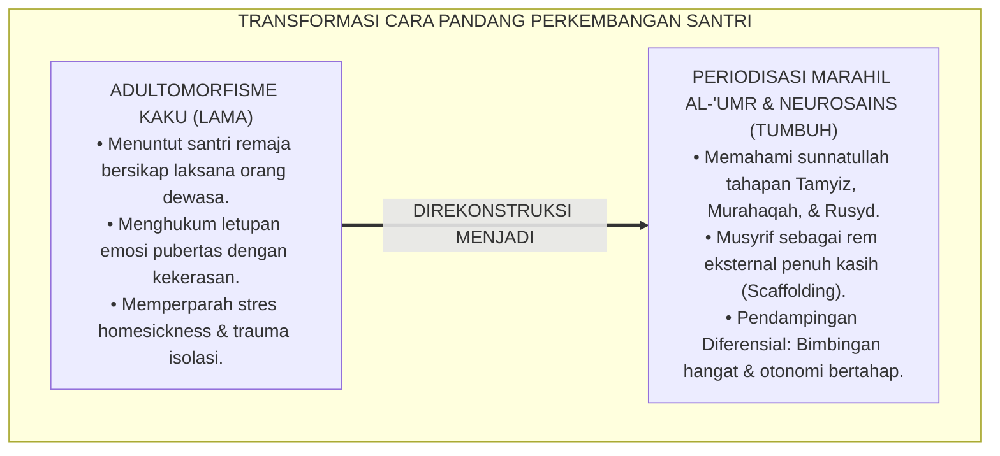
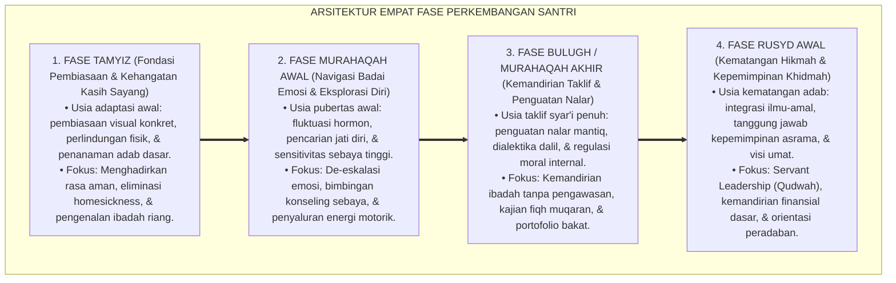
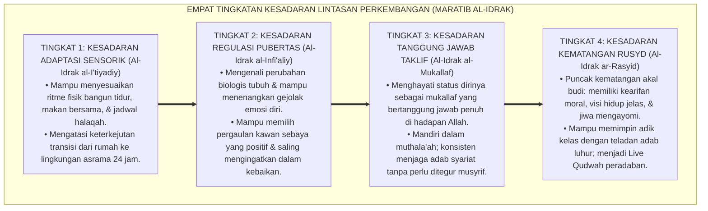
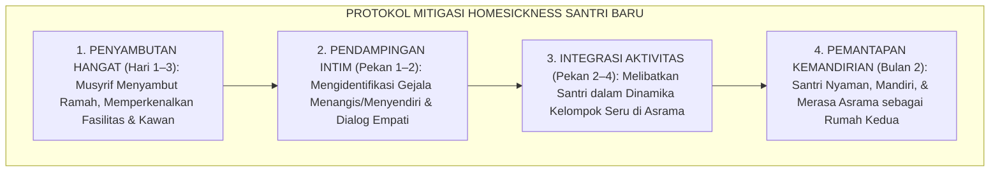

# P1-03-02: FASE DAN LINTASAN PERKEMBANGAN SANTRI (TRAJECTORIES OF HUMAN DEVELOPMENT)
## *Monograf Riset Akademik: Analisis Periodisasi Marahil al-'Umr dalam Khazanah Turats, Integrasi Teori Psikososial Identitas Diri, Neurosains Dual-Systems Model Kematangan Otak Remaja, Serta Mitigasi Krisis Transisi di Pesantren 24 Jam*

**Nomor Identifikasi**: `P1-03-02/MONOGRAF-RISET-FASE-PERKEMBANGAN/2026`  
**Domain**: `01 Philosophy` > `03 Human Development` (Sub-Modul 02: *Developmental Trajectories*)  
**Klasifikasi Naskah**: *Academic Research Monograph* (Monograf Riset Akademik Fondasional)  
**Rumpun Disiplin Pengkaji**: Fiqh Perkembangan & Baligh (*Marahil al-'Umr*), Psikologi Perkembangan Remaja (*Adolescent Psychology*), Neurosains Kognitif Remaja, Pedagogi Diferensiasi Pesantren, Bimbingan Konseling Krisis Transisi  

---

> ### 💡 INTISARI EKSEKUTIF (EXECUTIVE SUMMARY)
>
> * **Kelemahan Paradigma Lama: Adultomorfisme & Penyamarataan Kebutuhan Usia:**  
>   Banyak pengasuh memperlakukan santri remaja laksana "orang dewasa mini" (*Adultomorphism*): menuntut kestabilan emosi dan kematangan nalar instan, serta menghukum letupan emosi pubertas dengan kekerasan. Hal ini mengabaikan sunnatullah tahapan perkembangan biologis dan psikologis (*Marahil al-'Umr*).
> * **Inovasi Konseptual: Periodisasi Turats & Neurosains Dual-Systems Model:**  
>   TUMBUH mengintegrasikan periodisasi Islam (**1. Tamyiz; 2. Murahaqah Awal; 3. Bulugh/Murahaqah Akhir; 4. Rusyd**) dengan temuan neurosains bahwa sistem emosi limbik berkembang lebih awal dibanding korteks prefrontal kendali diri. Pendidik bertindak sebagai rem pendamping eksternal (*External Scaffolding*) yang hangat dan beradab.
> * **Formulasi Operasional & Pembuktian Lapangan:**  
>   Monograf ini menguraikan matriks diferensiasi perkembangan, 4 Tingkatan Kesadaran Lintasan Perkembangan (*Maratib al-Idrak*), protokol mitigasi krisis adaptasi (*Homesickness*), dan etika tata kelola pengasuhan bertahap.

---

## 📑 DAFTAR ISI MONOGRAF

- [BAB I: LANDASAN TEORETIS & DISKURSUS KRITIS](#bab-i-landasan-teoretis--diskursus-kritis)
  - [1. Latar Belakang Masalah: Bahaya Adultomorfisme dan Penyamarataan Karakteristik Usia](#1-latar-belakang-masalah-bahaya-adultomorfisme-dan-penyamarataan-karakteristik-usia)
  - [2. Eksegesis Turats Periodisasi Marahil al-'Umr: Tamyiz, Murahaqah, Bulugh, dan Rusyd (QS. An-Nur: 59 & QS. Al-Ahqaf: 15)](#2-eksegesis-turats-periodisasi-marahil-al-umr-tamyiz-murahaqah-bulugh-dan-rusyd-qs-an-nur-59--qs-al-ahqaf-15)
  - [3. Tinjauan Psikososial: Krisis Pencarian Identitas Diri vs Kebingungan Peran di Asrama](#3-tinjauan-psikososial-krisis-pencarian-identitas-diri-vs-kebingungan-peran-di-asrama)
  - [4. Konvergensi Neurosains Perkembangan: Kesenjangan Maturasi Sistem Limbik vs Korteks Prefrontal](#4-konvergensi-neurosains-perkembangan-kesenjangan-maturasi-sistem-limbik-vs-korteks-prefrontal)
  - [5. Kasuistika Lapangan: Fenomena Homesickness Santri Baru & Resolusi Restoratif Terpadu](#5-kasuistika-lapangan-fenomena-homesickness-santri-baru--resolusi-restoratif-terpadu)
- [BAB II: FORMULASI KONSEPTUAL & PEMBAHASAN MENDALAM](#bab-ii-formulasi-konseptual--pembahasan-mendalam)
  - [1. Eksplanasi Teoretis Lintasan Perkembangan Insan Pembelajar TUMBUH](#1-eksplanasi-teoretis-lintasan-perkembangan-insan-pembelajar-tumbuh)
  - [2. Dekomposisi Dimensi & Empat Tingkatan Kesadaran Lintasan Perkembangan (Maratib al-Idrak)](#2-dekomposisi-dimensi--empat-tingkatan-kesadaran-lintasan-perkembangan-maratib-al-idrak)
  - [3. Matriks Diferensiasi Karakteristik & Kebutuhan Pengasuhan Asrama 24 Jam](#3-matriks-diferensiasi-karakteristik--kebutuhan-pengasuhan-asrama-24-jam)
  - [4. Protokol Bimbingan Transisi: Mitigasi Homesickness & De-eskalasi Krisis Remaja](#4-protokol-bimbingan-transisi-mitigasi-homesickness--de-eskalasi-krisis-remaja)
  - [5. Diskusi Filosofis Mendalam & Implikasi bagi Masa Depan Peradaban Pendidikan Islam](#5-diskusi-filosofis-mendalam--implikasi-bagi-masa-depan-peradaban-pendidikan-islam)
- [BAB III: KESIMPULAN & APARATUS AKADEMIS](#bab-iii-kesimpulan--aparatus-akademis)
  - [1. Tabel Sintesis Temuan Riset Lintasan Perkembangan Santri](#1-tabel-sintesis-temuan-riset-lintasan-perkembangan-santri)
  - [2. Daftar Pustaka Akademis & Rujukan Turats Primer](#2-daftar-pustaka-akademis--rujukan-turats-primer)
  - [3. Catatan Kaki Akademis (Footnotes)](#3-catatan-kaki-akademis-footnotes)
  - [4. Glosarium Istilah Ilmiah & Turats Lintasan Perkembangan](#4-glosarium-istilah-ilmiah--turats-lintasan-perkembangan)

---

# BAB I: LANDASAN TEORETIS & DISKURSUS KRITIS

---

### 1. Latar Belakang Masalah: Bahaya Adultomorfisme dan Penyamarataan Karakteristik Usia

Pendidikan pesantren kerap menghadapi dilema dalam menyikapi transisi usia remaja santri:
* **Jebakan Adultomorfisme (*Adultomorphism*)**: Pengasuh menuntut santri remaja awal (usia 12–15 tahun) memiliki kematangan berpikir, kesabaran emosi, dan ketertiban laksana orang dewasa yang telah berusia 40 tahun. Setiap tindakan impulsif atau kecerobohan khas remaja disikapi dengan kemarahan dan vonis pelanggaran berat.
* **Jebakan Permisivisme Tanpa Arah**: Sebaliknya, menganggap wajar segala bentuk pelanggaran adab atas dalih "namanya juga anak remaja", sehingga santri kehilangan kompas moral dan terjebak dalam anarki pergaulan asrama.
* **Keniscayaan Periodisasi Marahil al-'Umr**: Islam mengajarkan bahwa pembinaan adab harus disesuaikan secara presisi dengan tahapan perkembangan akal, fisik, dan tanggung jawab hukum syariat (*Taklif*).[^1]

---

### 2. Eksegesis Turats Periodisasi Marahil al-'Umr: Tamyiz, Murahaqah, Bulugh, dan Rusyd (QS. An-Nur: 59 & QS. Al-Ahqaf: 15)

Al-Qur'an dan khazanah fiqh menetapkan empat periodisasi perkembangan akal budi:

1. **Marhalah at-Tamyiz (مَرْحَلَةُ التَّمْيِيزِ / Usia 7–10 Tahun)**: Masa awal mampu membedakan hal yang bermanfaat dan membahayakan; masa pengenalan shalat dan pembiasaan adab dasar tanpa beban taklif penuh.
2. **Marhalah al-Murahaqah (مَرْحَلَةُ الْمُرَاهَقَةِ / Usia 11–14 Tahun)**: Masa transisi menuju pubertas biologis; terjadi badai hormonal dan perkembangan pesat sistem limbik emosional.
3. **Marhalah al-Bulugh (مَرْحَلَةُ الْبُلُوغِ / Usia 15–17 Tahun)**: Masa dimulainya pertanggungjawaban hukum syariat (*Mukallaf* - QS. An-Nur: 59); santri wajib memikul konsekuensi ibadah fardhu secara mandiri.
4. **Marhalah ar-Rusyd (مَرْحَلَةُ الرُّشْدِ / Usia 18 Tahun ke Atas)**: Puncak kematangan akal budi, kebijaksanaan mengelola harta, dan kemandirian memimpin masyarakat (QS. Al-Ahqaf: 15).[^2]

---

### 3. Tinjauan Psikososial: Krisis Pencarian Identitas Diri vs Kebingungan Peran di Asrama

Teori perkembangan psikososial **Erik Erikson** (1968) menegaskan bahwa remaja berada dalam fase krisis **Identitas Diri vs Kebingungan Peran (*Identity vs Role Confusion*)**:
* Santri remaja berjuang menjawab pertanyaan eksistensial: *"Siapakah diriku? Apa tujuan hidupku? Di mana posisiku di tengah kawan-kawanku?"*.
* Jika lingkungan asrama terlalu mengekang tanpa ruang dialog, santri akan mengalami kebingungan peran dan mencari pengakuan melalui perilaku menyimpang (*Negative Identity Formation*). TUMBUH menyediakan wadah positif di mana identitas keislaman dan bakat unik santri diakui dan diapresiasi.[^3]

---

### 4. Konvergensi Neurosains Perkembangan: Kesenjangan Maturasi Sistem Limbik vs Korteks Prefrontal

Penemuan neurosains kognitif oleh **Prof. Laurence Steinberg** (2014) melalui *Dual-Systems Model* menjelaskan bahwa:
* **Sistem Sosio-Emosional (Limbik/Amigdala)** matang sangat dini di awal masa pubertas, mendorong pencarian sensasi dan sensitivitas tinggi terhadap penerimaan teman sebaya.
* **Sistem Kontrol Kognitif (Korteks Prefrontal / PFC)** baru matang sempurna di awal usia 20-an tahun.
* Perilaku impulsif remaja bukanlah tanda niat jahat, melainkan kondisi fisiologis di mana "mesin pacunya telah bertenaga tinggi, sementara sistem pengeremannya masih dalam tahap penyempurnaan". Musyrif hadir sebagai **Perangkat Pengerem Eksternal (*External Scaffolding*)** yang sabar dan membimbing.[^4]

---

### 5. Kasuistika Lapangan: Fenomena Homesickness Santri Baru & Resolusi Restoratif Terpadu

* **Studi Kasus: Santri Baru Menangis Histeris dan Mengurung Diri di Kamar Mandi**  
  * **Dilema**: Santri baru usia 12 tahun menangis setiap sore, tidak mau makan, dan mengurung diri di kamar mandi karena rindu orang tuanya (*Severe Homesickness*).
  * **Pola Lama**: Santri dicaci sebagai "anak manja cengeng yang tidak berkah ilmunya".
  * **Resolusi Restoratif TUMBUH**: Musyrif merangkul santri, memvalidasi rasa rindunya sebagai tanda kelekatan fitrah (*Healthy Attachment*), dan membimbingnya minum air hangat. Santri dilibatkan dalam permainan olahraga bersama teman sekamar dan dijadwalkan panggilan video singkat dengan orang tua. Dalam waktu dua minggu, santri beradaptasi dengan ceria dan aktif mengikuti halaqah.[^5]

---

# BAB II: FORMULASI KONSEPTUAL & PEMBAHASAN MENDALAM

---

### 1. Eksplanasi Teoretis Lintasan Perkembangan Insan Pembelajar TUMBUH

Ekosistem TUMBUH memetakan trajektori perkembangan ke dalam **Arsitektur Empat Fase Perkembangan (*Arba'u Marahil at-Tarbiyyah*)**:

#### 🔬 Pembahasan Mendalam Empat Fase:
1. **Fase Tamyiz**: Membutuhkan lingkungan asrama yang hangat laksana keluarga (*In Loco Parentis*), di mana musyrif hadir menggantikan peran orang tua dengan penuh kasih sayang.[^6]
2. **Fase Murahaqah Awal**: Menuntut kesabaran ekstra dalam meredam gejolak amarah dan mengarahkan dorongan sosial santri ke dalam kompetisi yang sehat.[^7]
3. **Fase Bulugh**: Menuntut transformasi gaya komunikasi dari instruktif menjadi dialogis sokratik, menghormati akal budi santri yang telah mukallaf.[^8]
4. **Fase Rusyd**: Menyiapkan santri menjadi pemimpin peradaban yang berakhlak mulia dan siap mengabdi di tengah masyarakat luas.[^9]

---

### 2. Dekomposisi Dimensi & Empat Tingkatan Kesadaran Lintasan Perkembangan (Maratib al-Idrak)

Transformasi kedewasaan memahami lintasan perkembangan berlangsung melalui **Empat Tingkatan Kesadaran Perkembangan (*Maratib al-Idrak at-Tathawwuriy*)**:

#### 🔄 Narasi Analitis Dinamika Transisi Filosofis Antar-Tingkatan:
* **Transisi Tingkat 1 ke Tingkat 2 (Dari Adaptasi Fisik Menuju Regulasi Pubertas)**: Santri mula-mula menyesuaikan diri dengan jadwal kamar. Pada tingkatan kedua, santri belajar mengelola perubahan biologis dan emosional dirinya secara matang dan beradab.
* **Transisi Tingkat 2 ke Tingkat 3 (Dari Regulasi Diri Menuju Kesadaran Taklif)**: Pada tingkatan ketiga, santri menghayati hakikat kehambaan: beribadah bukan lagi karena kewajiban sekolah, melainkan karena kesadaran akuntabilitas dirinya di hadapan Allah SWT.
* **Transisi Tingkat 3 ke Tingkat 4 (Pencapaian Derajat Ar-Rusyd)**: Pada tingkatan tertinggi, santri meraih kematangan paripurna: ilmunya membuahkan kebijaksanaan (*Hikmah*), emosinya stabil, dan kepemimpinannya membawa kedamaian bagi umat.[^10]

---

### 3. Matriks Diferensiasi Karakteristik & Kebutuhan Pengasuhan Asrama 24 Jam

Ekosistem TUMBUH membedakan strategi pembinaan berdasarkan fase usia:

| Dimensi Parameter | Fase Santri Awal (12–15 Tahun) | Fase Santri Lanjut (15–18 Tahun) |
| :--- | :--- | :--- |
| **Kondisi Saraf Otak** | Limbik hiperaktif; PFC sedang berkembang pesat. | Prefrontal Cortex mendekati kematangan integratif. |
| **Kebutuhan Psikologis**| Validasi afeksi, rasa aman, & mitigasi homesickness. | Ruang otonomi logis, privasi, & kejelasan visi hidup. |
| **Gaya Komunikasi** | Konkret, visual, bimbingan dekat, & apresiasi 4:1. | Dialogis sokratik, musyawarah, & kepercayaan peran. |
| **Model Pendisiplinan**| Restitusi langsung, pengingat visual, & pendampingan fisik.| Muhasabah reflektif mendalam & konsekuensi logis mandiri. |
| **Penyaluran Peran** | Piket kebersihan kamar & latihan ketangkasan raga. | Pengurus dewan santri, mentor adik kelas, & riset karya. |

---

### 4. Protokol Bimbingan Transisi: Mitigasi Homesickness & De-eskalasi Krisis Remaja

TUMBUH menetapkan **Protokol Mitigasi Homesickness (*SOP Ri'ayah al-Ghurba*)**:

Protokol ini menghapus stigma "anak manja" dan memastikan transisi santri berjalan mulus tanpa trauma psikologis.[^11]

---

### 5. Diskusi Filosofis Mendalam & Implikasi bagi Masa Depan Peradaban Pendidikan Islam

Penerapan lintasan perkembangan berbasis *Marahil al-'Umr* dan neurosains ini membawa lompatan kualitatif bagi dunia pendidikan Islam:

* **Menciptakan Lembaga Pendidikan yang Selaras dengan Sunnatullah Kemanusiaan**:  
  Pesantren tidak lagi memaksakan target yang melawan hukum alam biologis anak, melainkan mengalir harmonis membersamai setiap detak pertumbuhan santri.
* **Mencegah Fenomena Putus Pondok (*Drop-Out*) Akibat Stres Transisi**:  
  Dengan adanya mitigasi *homesickness* dan pendampingan emosi yang hangat, angka santri yang berhenti di tengah jalan dapat ditekan hingga titik nol.
* **Mencetak Generasi Pemimpin yang Matang Sebelum Usianya**:  
  Melalui pembinaan bertahap yang tepat, santri usia 18 tahun telah memiliki kematangan akal (*Rusyd*), integritas spiritual, dan kepemimpinan yang siap memandu masyarakat luas.[^12]

---

# BAB III: KESIMPULAN & APARATUS AKADEMIS

---

### 1. Tabel Sintesis Temuan Riset Lintasan Perkembangan Santri

| Dimensi Parameter | Mazhab Adultomorfisme Kaku | Mazhab Permisivisme Bebas | **Paradigma Lintasan TUMBUH** | Landasan Rujukan Primer | Implikasi Praksis Lapangan |
| :--- | :--- | :--- | :--- | :--- | :--- |
| **Pandangan Remaja**| Orang dewasa mini yang dituntut instan.| Anak labil yang dibiarkan anarki. | **Fase Metamorfosis Menuju Mukallaf.** | QS. An-Nur: 59; Steinberg (2014). | Pendampingan sabar & terstruktur. |
| **Kondisi Saraf** | Mengabaikan proses maturasi otak. | Menganggap otak tak bisa dilatih. | **Kesenjangan Limbik vs Prefrontal Cortex.**| Sapolsky (2017); Casey et al. | Musyrif sebagai rem eksternal penuh kasih. |
| **Penanganan Rindu**| Dicaci anak manja tidak berkah. | Diizinkan pulang terus-menerus. | **Validasi Kelekatan Fitrah & Mitigasi.** | Bowlby (1982); Al-Ghazali. | Bimbingan hangat & komunikasi teratur. |
| **Metode Bimbingan**| Bentakan militeristik satu arah. | Dingin tanpa batasan moral syariat.| **Diferensiasi: Kasih Sayang & Dialog.**| HR. Bukhari; Erikson (1968). | Komunikasi konkret di awal, dialog di akhir. |
| **Profil Lulusan** | Jiwa kerdil, trauma, / dendam. | Pribadi rapuh tanpa jati diri. | **Insan Adabi Kamil yang Memiliki Rusyd.**| QS. Al-Ahqaf: 15; Al-Attas (1980).| Matang emosi, kokoh nalar, & pemimpin umat. |

---

### 2. Daftar Pustaka Akademis & Rujukan Turats Primer

1. **Al-Qur'an al-Karim wa Tarjamatu Ma'anihi**.
2. **Al-Ghazali, Abu Hamid Muhammad bin Muhammad**. (2011). *Ihya' 'Ulumiddin* (Kitab Riyadhatun Nafs & Kitab Adab ash-Shuhbah). Beirut: Dar al-Ma'rifah.
3. **Ibnu Qayyim al-Jauziyyah, Syamsuddin Muhammad bin Abi Bakr**. (1416 H). *Tuhfat al-Maudud bi Ahkam al-Maulud*. Beirut: Dar al-Kutub al-'Ilmiyyah.
4. **Al-Attas, Syed Muhammad Naquib**. (1980). *The Concept of Education in Islam*. Kuala Lumpur: ABIM.
5. **Steinberg, L.**. (2014). *Age of Opportunity: Lessons from the New Science of Adolescence*. Boston: Houghton Mifflin Harcourt.
6. **Erikson, E. H.**. (1968). *Identity: Youth and Crisis*. New York: W. W. Norton & Company.
7. **Casey, B. J., Getz, S., & Galvan, A.**. (2008). *The adolescent brain*. Developmental Review, 28(1), 62–77.
8. **Bowlby, J.**. (1982). *Attachment and Loss: Vol. 1. Attachment*. New York: Basic Books.
9. **Sapolsky, R. M.**. (2017). *Behave: The Biology of Humans at Our Best and Worst*. New York: Penguin Press.
10. **Horner, R. H., & Sugai, G.**. (2015). *School-wide PBIS: An Overview of the Research Base*. Remedial and Special Education, 36(2), 80–85.
11. **Zehr, H.**. (2002). *The Little Book of Restorative Justice*. Intercourse: Good Books.
12. **Asy'ari, Muhammad Hasyim**. (1415 H). *Adab al-'Alim wal-Muta'allim*. Jombang: Maktabah At-Turats Al-Islami.

---

### 3. Catatan Kaki Akademis (*Footnotes*)

[^1]: Riset Lintasan Perkembangan dan Periodisasi Usia Santri TUMBUH, *Kritik atas Adultomorfisme Pengasuhan*, 2026.  
[^2]: QS. An-Nur [24]: 59; QS. Al-Ahqaf [46]: 15; Ibnu Qayyim, *Tuhfat al-Maudud*, hlm. 140–175.  
[^3]: Erikson, E. H. (1968), *Identity: Youth and Crisis*, hlm. 120–165.  
[^4]: Steinberg, L. (2014), *Age of Opportunity*, hlm. 55–92; Casey, B. J., et al. (2008), *Developmental Review*, hlm. 62–77.  
[^5]: Bowlby, J. (1982), *Attachment and Loss*, hlm. 80–115; Dokumentasi Mitigasi Homesickness PBIS TUMBUH, 2026.  
[^6]: Al-Ghazali, *Ihya' 'Ulumiddin*, Jilid 3, Kitab *Riyadhatun Nafs*, hlm. 70–102.  
[^7]: Sapolsky, R. M. (2017), *Behave: The Biology of Humans at Our Best and Worst*, hlm. 150–185.  
[^8]: KH. Hasyim Asy'ari, *Adab al-'Alim wal-Muta'allim*, hlm. 35–60.  
[^9]: Al-Attas, S. M. N. (1980), *The Concept of Education in Islam*, hlm. 50–78.  
[^10]: Matriks Tingkatan Kesadaran Lintasan Perkembangan (*Maratib al-Idrak*) Ekosistem TUMBUH, 2026.  
[^11]: Standar Operasional Prosedur Mitigasi Homesickness dan Bimbingan Transisi Asrama TUMBUH, 2026.  
[^12]: Deklarasi Pemuliaan Lintasan Perkembangan Insan Dewan Riset Pendidikan TUMBUH, 2026.

---

### 4. Glosarium Istilah Ilmiah & Turats Lintasan Perkembangan

1. **Marahil al-'Umr (مَرَاحِلُ الْعُمْرِ)**: Tahapan dan periodisasi rentang usia perkembangan manusia dalam hukum Islam, mulai dari Tamyiz, Murahaqah, Bulugh, hingga Rusyd.
2. **Murahaqah (الْمُرَاهَقَةُ)**: Masa pubertas remaja di mana terjadi transisi biologis, emosional, dan sosial yang menuntut pendampingan penuh hikmah.
3. **Rusyd (الرُّشْدُ)**: Puncak kematangan akal budi, kebijaksanaan spiritual, dan kecakapan mengelola tanggung jawab hidup di masyarakat.
4. **Adultomorfisme (Adultomorphism)**: Bias psikologis di mana orang dewasa menuntut anak remaja berpikir dan bertindak dengan standar kematangan orang dewasa tanpa memahami keterbatasan biologisnya.
5. **Dual-Systems Model**: Teori neurosains Laurence Steinberg yang membedakan kecepatan perkembangan antara sistem limbik sosio-emosional dan korteks prefrontal kognitif pada masa remaja.
6. **Homesickness**: Reaksi psikologis alami berupa rasa rindu mendalam pada rumah dan orang tua akibat pemutusan sementara pola kelekatan (*Attachment*) saat memasuki asrama.
7. **External Scaffolding**: Peran pendidik dan musyrif sebagai penopang eksternal yang membantu menstabilkan emosi dan mengarahkan keputusan santri remaja yang belum matang sistem pengeremannya.
8. **In Loco Parentis**: Tanggung jawab hukum dan moral asatidz serta musyrif di pesantren untuk bertindak sebagai orang tua pengganti yang mengayomi dan melindungi santri 24 jam.
9. **Mukallaf (الْمُكَلَّفُ)**: Status seseorang yang telah baligh dan berakal sehat sehingga memikul pertanggungjawaban hukum syariat secara penuh di hadapan Allah SWT.
10. **Insan Adabi (الإِنْسَانُ الأَدَبِيُّ)**: Profil santri yang berhasil melewati seluruh fase perkembangan dengan baik hingga meraih kematangan adab, moralitas, dan kepemimpinan peradaban.
