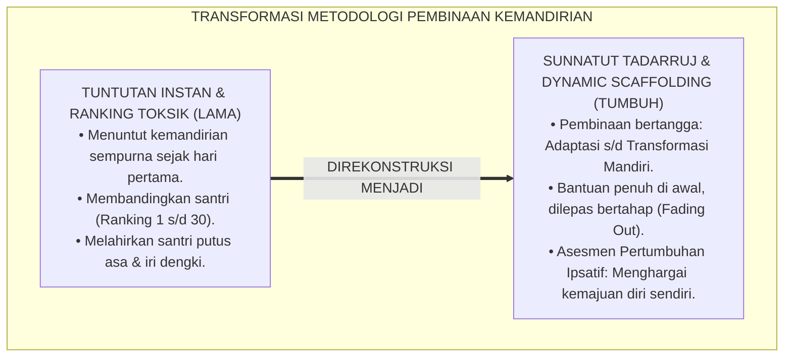
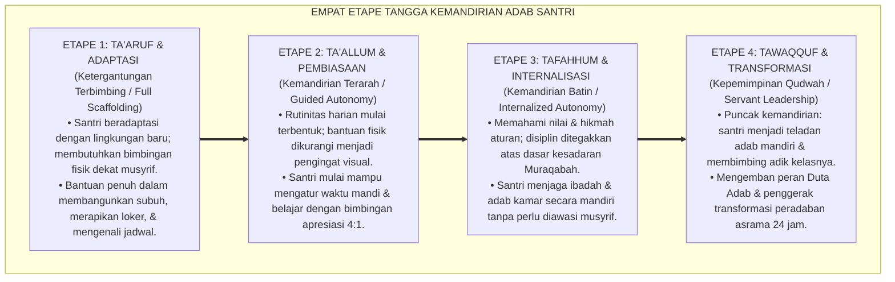
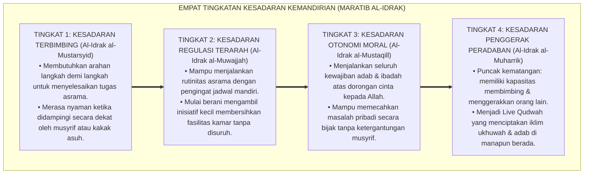
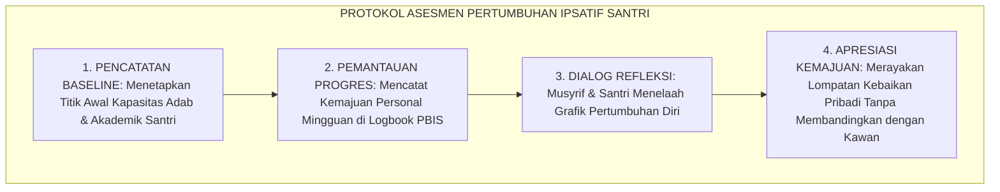
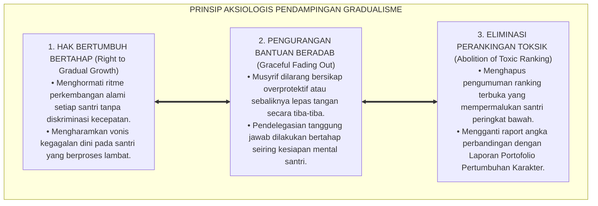

# P1-03-03: LANDASAN FILOSOFIS TANGGA KEMANDIRIAN INSAN (THE PHILOSOPHY OF GRADUAL AUTONOMY)
## *Monograf Riset Akademik: Prinsip Gradualisme Syar'i (Sunnatut Tadarruj), Konvergensi Teori Zone of Proximal Development & Scaffolding Lev Vygotsky, Dekonstruksi Evaluasi Komparatif Toksik Menuju Asesmen Ipsatif, Serta Formasi Otonomi Moral di Pesantren 24 Jam*

**Nomor Identifikasi**: `P1-03-03/MONOGRAF-RISET-GRADUALISME-KEMANDIRIAN/2026`  
**Domain**: `01 Philosophy` > `03 Human Development` (Sub-Modul 03: *Philosophy of Gradual Maturation*)  
**Klasifikasi Naskah**: *Academic Research Monograph* (Monograf Riset Akademik Fondasional)  
**Rumpun Disiplin Pengkaji**: Ushul Fiqh Gradualisme Syariat (*Fiqh at-Tadarruj*), Psikologi Kognitif Perkembangan (*Developmental Scaffolding*), Psikometri & Asesmen Ipsatif Pendidikan, Pedagogi Diferensiasi Pesantren  

---

> ### 💡 INTISARI EKSEKUTIF (EXECUTIVE SUMMARY)
>
> * **Kelemahan Paradigma Lama: Tuntutan Kesempurnaan Instan & Ranking Komparatif Toksik:**  
>   Banyak sistem pengasuhan menuntut santri baru langsung memiliki kemandirian dan kekhusyukan seperti santri senior (*The Illusion of Instant Maturity*). Ketika santri belum mampu, mereka dihukum dan dibanding-bandingkan dengan santri lain dalam sistem perankingan kelas yang mematikan motivasi belajar (*Comparative Ranking Trap*).
> * **Inovasi Konseptual: Fiqh at-Tadarruj & Teori Scaffolding Dinamis:**  
>   TUMBUH menegakkan sunnatullah pentahapan (*Sunnatut Tadarruj*): sebagaimana Al-Qur'an diturunkan berangsur-angsur (*Tanjim*), kemandirian adab santri dibina melalui tangga pertolongan bertahap (*Dynamic Scaffolding*). Bantuan intensif diberikan di awal (*Full Support*), kemudian dikurangi secara bertahap (*Fading Out*) seiring tumbuhnya kapasitas regulasi diri santri.
> * **Formulasi Operasional & Pembuktian Lapangan:**  
>   Monograf ini menguraikan filosofi empat etape tangga kemandirian adab, 4 Tingkatan Kesadaran Kemandirian (*Maratib al-Idrak*), protokol asesmen pertumbuhan ipsatif, dan etika tata kelola pendampingan bertahap 24 jam.

---

## 📑 DAFTAR ISI MONOGRAF

- [BAB I: LANDASAN TEORETIS & DISKURSUS KRITIS](#bab-i-landasan-teoretis--diskursus-kritis)
  - [1. Latar Belakang Masalah: Bahaya Tuntutan Kesempurnaan Instan dan Ranking Komparatif](#1-latar-belakang-masalah-bahaya-tuntutan-kesempurnaan-instan-dan-ranking-komparatif)
  - [2. Eksegesis Turats Gradualisme Syariat: Sunnatut Tadarruj (HR. Al-Bukhari dari Sayyidah 'Aisyah RA & QS. Al-Furqan: 32)](#2-eksegesis-turats-gradualisme-syariat-sunnatut-tadarruj-hr-al-bukhari-dari-sayyidah-aisyah-ra--qs-al-furqan-32)
  - [3. Konvergensi Teori Perkembangan: Zone of Proximal Development (ZPD) & Scaffolding Lev Vygotsky](#3-konvergensi-teori-perkembangan-zone-of-proximal-development-zpd--scaffolding-lev-vygotsky)
  - [4. Dekonstruksi Ranking Komparatif Toksik Menuju Paradigma Asesmen Pertumbuhan Ipsatif](#4-dekonstruksi-ranking-komparatif-toksik-menuju-paradigma-asesmen-pertumbuhan-ipsatif)
  - [5. Kasuistika Lapangan: Fenomena Keputusasaan Santri Baru & Resolusi Restoratif Terpadu](#5-kasuistika-lapangan-fenomena-keputusasaan-santri-baru--resolusi-restoratif-terpadu)
- [BAB II: FORMULASI KONSEPTUAL & PEMBAHASAN MENDALAM](#bab-ii-formulasi-konseptual--pembahasan-mendalam)
  - [1. Eksplanasi Teoretis Filosofi Tangga Kemandirian Insan TUMBUH](#1-eksplanasi-teoretis-filosofi-tangga-kemandirian-insan-tumbuh)
  - [2. Dekomposisi Dimensi & Empat Tingkatan Kesadaran Kemandirian (Maratib al-Idrak)](#2-dekomposisi-dimensi--empat-tingkatan-kesadaran-kemandirian-maratib-al-idrak)
  - [3. Protokol Asesmen Pertumbuhan Ipsatif: SOP Evaluasi Kemajuan Mandiri Non-Komparatif](#3-protokol-asesmen-pertumbuhan-ipsatif-sop-evaluasi-kemajuan-mandiri-non-komparatif)
  - [4. Prinsip Aksiologis & Etika Tata Kelola Pendampingan Scaffolding 24 Jam](#4-prinsip-aksiologis--etika-tata-kelola-pendampingan-scaffolding-24-jam)
  - [5. Diskusi Filosofis Mendalam & Implikasi bagi Masa Depan Peradaban Pendidikan Islam](#5-diskusi-filosofis-mendalam--implikasi-bagi-masa-depan-peradaban-pendidikan-islam)
- [BAB III: KESIMPULAN & APARATUS AKADEMIS](#bab-iii-kesimpulan--aparatus-akademis)
  - [1. Tabel Sintesis Temuan Riset Filosofi Gradualisme Kemandirian](#1-tabel-sintesis-temuan-riset-filosofi-gradualisme-kemandirian)
  - [2. Daftar Pustaka Akademis & Rujukan Turats Primer](#2-daftar-pustaka-akademis--rujukan-turats-primer)
  - [3. Catatan Kaki Akademis (Footnotes)](#3-catatan-kaki-akademis-footnotes)
  - [4. Glosarium Istilah Ilmiah & Turats Gradualisme Kemandirian](#4-glosarium-istilah-ilmiah--turats-gradualisme-kemandirian)

---

# BAB I: LANDASAN TEORETIS & DISKURSUS KRITIS

---

### 1. Latar Belakang Masalah: Bahaya Tuntutan Kesempurnaan Instan dan Ranking Komparatif

Dalam praktik pendidikan lama di sebagian asrama, kerap terjadi kesalahan metodologis yang merusak jiwa santri:
* **Tuntutan Kesempurnaan Instan (*The Fallacy of Instant Maturity*)**: Santri baru yang baru saja berpisah dari orang tuanya langsung dituntut mandiri 100%: harus bangun subuh tanpa dibangunkan, merapikan kasur sempurna, dan menghafal teks rumit. Ketika gagal, santri dibentak dan dihukum fisik.
* **Perankingan Komparatif Toksik (*Toxic Comparative Ranking*)**: Membanding-bandingkan santri satu dengan yang lain ("Lihat kawanmu, dia lebih cepat hafal daripada kamu!") melahirkan rasa iri dengki (*Hasad*), merusak ukhuwah sekamar, dan membunuh motivasi santri yang ritme belajarnya membutuhkan waktu lebih lama (*Late Bloomers*).
* **Keniscayaan Doktrin Sunnatut Tadarruj**: Syariat Islam dan sains perkembangan membuktikan bahwa kemandirian karakter adalah proses bertangga yang menuntut kesabaran pendampingan bertahap.[^1]

---

### 2. Eksegesis Turats Gradualisme Syariat: Sunnatut Tadarruj (HR. Al-Bukhari dari Sayyidah 'Aisyah RA & QS. Al-Furqan: 32)

Al-Qur'an menjelaskan hikmah diturunkannya wahyu secara berangsur-angsur (*Tanjim*):

$$\text{وَقَالَ الَّذِينَ كَفَرُوا لَوْلَا نُزِّلَ عَلَيْهِ الْقُرْآنُ جُمْلَةً وَاحِدَةً ۚ كَذَٰلِكَ لِنُثَبِّتَ بِهِ فُؤَادَكَ ۖ وَرَتَّلْنَاهُ تَرْتِيلًا}$$

*"Dan orang-orang kafir berkata: 'Mengapa Al-Qur'an itu tidak diturunkan kepadanya sekaligus?' Demikianlah, agar Kami perkuat hatimu dengannya dan Kami membacakannya secara berangsur-angsur."* (QS. Al-Furqan [25]: 32).[^2]

Sayyidah **'Aisyah radhiyallahu 'anha** meriwayatkan kaidah fundamental pendidikan Islam:

$$\text{إِنَّمَا نَزَلَ أَوَّلَ مَا نَزَلَ مِنْهُ سُورَةٌ مِنَ الْمُفَصَّلِ فِيهَا ذِكْرُ الْجَنَّةِ وَالنَّارِ، حَتَّىٰ إِذَا ثَابَ النَّاسُ إِلَى الْإِسْلَامِ نَزَلَ الْحَلَالُ وَالْحَرَامُ، وَلَوْ نَزَلَ أَوَّلَ شَيْءٍ: لَا تَشْرَبُوا الْخَمْرَ، لَقَالُوا: لَا نَدَعُ الْخَمْرَ أَبَدًا}$$

*"**Sesungguhnya yang pertama kali turun dari Al-Qur'an adalah surat-surat pendek yang di dalamnya disebutkan tentang surga dan neraka; hingga ketika manusia telah condong hatinya kepada Islam, barulah turun ayat tentang halal dan haram**; seandainya yang pertama kali turun adalah: 'Janganlah kalian meminum khamr!', niscaya mereka akan berkata: 'Kami tidak akan meninggalkan khamr selama-lamanya!'."* (HR. Al-Bukhari No. 4993).[^3]

---

### 3. Konvergensi Teori Perkembangan: Zone of Proximal Development (ZPD) & Scaffolding Lev Vygotsky

Teori psikologi perkembangan kognitif **Lev Vygotsky** (1978) mengenai **Zone of Proximal Development (ZPD)** memvalidasi konsep *Tadarruj*:
* **ZPD** adalah jarak antara apa yang dapat dilakukan santri secara mandiri dengan apa yang dapat dicapai santri melalui bimbingan orang dewasa atau kolaborasi dengan teman sebaya yang lebih kompeten.
* **Dynamic Scaffolding**: Musyrif memberikan struktur bantuan penuh pada fase awal adaptasi, kemudian secara terencana melepaskan bantuan (*Fading Out*) seiring dengan terbentuknya kemandirian saraf dan mental santri.[^4]

---

### 4. Dekonstruksi Ranking Komparatif Toksik Menuju Paradigma Asesmen Pertumbuhan Ipsatif

Membandingkan santri dalam sebuah ranking linier (Juara 1 vs Peringkat Terbawah) adalah kekeliruan psikometri:
* Penilaian normatif mengabaikan titik awal (*Baseline*) perkembangan unik setiap anak.
* TUMBUH mengadopsi **Asesmen Pertumbuhan Ipsatif (*Ipsative Progress Assessment*)**: tolak ukur evaluasi bukan membandingkan santri A dengan santri B, melainkan mengukur: *"Apakah kualitas adab, hafalan, dan pengendalian diri santri hari ini lebih baik dibanding dirinya pada bulan lalu?"*.[^5]

---

### 5. Kasuistika Lapangan: Fenomena Keputusasaan Santri Baru & Resolusi Restoratif Terpadu

* **Studi Kasus: Santri Baru Menolak Masuk Kelas karena Merasa Kalah Bersaing**  
  * **Dilema**: Santri baru mogok belajar karena nilai ujian hafalannya berada di peringkat terbawah di kelasnya, membuatnya malu dan merasa "tidak pantas mondok".
  * **Resolusi Restoratif TUMBUH**: Asatidz menghapus pengumuman ranking terbuka di kelas; beralih ke grafik pertumbuhan portofolio personal. Guru mengapresiasi kemajuan santri yang berhasil menambah hafalan 5 baris dari pekan sebelumnya. Santri menyadari bahwa kemajuannya dihargai, kepercayaan dirinya bangkit kembali, dan santri tekun belajar tanpa rasa cemas.[^6]

---

# BAB II: FORMULASI KONSEPTUAL & PEMBAHASAN MENDALAM

---

### 1. Eksplanasi Teoretis Filosofi Tangga Kemandirian Insan TUMBUH

Ekosistem TUMBUH mengkodifikasikan prinsip gradualisme ke dalam **Empat Etape Tangga Kemandirian Adab (*Arba'u Maraqi al-Istiqlaliyyah*)**:

#### 🔬 Pembahasan Mendalam Empat Etape Kemandirian:
1. **Etape Ta'aruf**: Fokus pada pemenuhan rasa aman (*Security & Attachment*). Musyrif menjadi figur orang tua pelindung.[^7]
2. **Etape Ta'allum**: Fokus pada konsolidasi kebiasaan (*Habit Formation*). Menguatkan sirkuit otomatisitas melalui latihan konsisten 66 hari.[^8]
3. **Etape Tafahhum**: Fokus pada kedalaman nalar dan spiritualitas (*Cognitive & Spiritual Maturation*). Disiplin beralih dari pengawas lahiriah ke radar batin kalbu.[^9]
4. **Etape Tawaqquf/Transformasi**: Fokus pada kepemimpinan pengabdian (*Servant Leadership*). Santri yang mandiri mendedikasikan ilmunya untuk membimbing generasi di bawahnya.[^10]

---

### 2. Dekomposisi Dimensi & Empat Tingkatan Kesadaran Kemandirian (Maratib al-Idrak)

Transformasi kedewasaan kemandirian santri berlangsung melalui **Empat Tingkatan Kesadaran Kemandirian (*Maratib al-Idrak al-Istiqlaliy*)**:

#### 🔄 Narasi Analitis Dinamika Transisi Filosofis Antar-Tingkatan:
* **Transisi Tingkat 1 ke Tingkat 2 (Dari Bantuan Penuh Menuju Regulasi Terarah)**: Santri mula-mula dituntun dalam setiap aktivitas. Pada tingkatan kedua, santri mulai mengatur jam belajarnya sendiri dengan bantuan jadwal dinding visual.
* **Transisi Tingkat 2 ke Tingkat 3 (Dari Regulasi Terarah Menuju Otonomi Moral Batin)**: Pada tingkatan ketiga, disiplin telah menyatu ke dalam kalbu: santri bangun tahajjud dan menjaga wudhu karena kerinduan spiritual kepada Allah SWT.
* **Transisi Tingkat 3 ke Tingkat 4 (Pencapaian Derajat Penggerak Adab)**: Pada tingkatan tertinggi, kemandirian santri meluap menjadi keteladanan sosial: ia menjadi magnet kebaikan yang menginspirasi seluruh warga asrama untuk bertumbuh bersama.[^11]

---

### 3. Protokol Asesmen Pertumbuhan Ipsatif: SOP Evaluasi Kemajuan Mandiri Non-Komparatif

TUMBUH menetapkan **Protokol Asesmen Pertumbuhan Ipsatif (*Manhaj at-Taqyim al-Ifradiy*)**:

Protokol ini membangkitkan rasa percaya diri (*Self-Efficacy*) santri dan menciptakan iklim belajar yang sehat dan saling mendukung.[^12]

---

### 4. Prinsip Aksiologis & Etika Tata Kelola Pendampingan Scaffolding 24 Jam

Gradualisme kemandirian melahirkan prinsip etika tata kelola pengasuhan:

#### 📋 Panduan Etika Pengasuhan Lapangan:
1. **Pendampingan Melekat Santri Baru**: Musyrif asrama tidur dan berkegiatan bersama santri baru selama 40 hari pertama masa adaptasi.
2. **Klub Belajar Tutor Sebaya**: Memfasilitasi santri etape lanjut menjadi mentor belajar bagi santri etape awal dalam suasana ukhuwah yang hangat.[^13]
3. **Standarisasi Raport Portofolio Ipsatif**: Raport santri menyajikan narasi deskriptif kemajuan akhlak, hafalan, dan kemandirian personal.[^14]

---

### 5. Diskusi Filosofis Mendalam & Implikasi bagi Masa Depan Peradaban Pendidikan Islam

Penerapan filosofi gradualisme kemandirian insan ini mengokohkan fondasi peradaban masa depan:

* **Mencetak Generasi Tangguh Berkemandirian Abadi**:  
  Kemandirian yang dibina secara bertahap melalui *Dynamic Scaffolding* akan tertanam permanen di dalam sistem saraf dan jiwa santri, menjadikannya pribadi tangguh yang siap memimpin di era disrupsi.
* **Menghapus Budaya Inferioritas dan Keputusasaan Pelajar**:  
  Dengan mengganti ranking toksik menjadi asesmen ipsatif, setiap anak merasa berharga, dicintai, dan termotivasi untuk terus memperbaiki dirinya tanpa henti.
* **Menghidupkan Kembali Manhaj Tarbiyah Kenabian**:  
  Rasulullah ﷺ membina para sahabat dari jahiliyyah menuju puncak peradaban melalui proses *Tadarruj* yang penuh hikmah dan kasih sayang. TUMBUH menghadirkan kembali keagungan manhaj kenabian ini ke dunia modern.[^15]

---

# BAB III: KESIMPULAN & APARATUS AKADEMIS

---

### 1. Tabel Sintesis Temuan Riset Filosofi Gradualisme Kemandirian

| Dimensi Parameter | Mazhab Tuntutan Instan (Lama) | Mazhab Ranking Komparatif | **Paradigma Gradualisme TUMBUH** | Landasan Rujukan Primer | Implikasi Praksis Lapangan |
| :--- | :--- | :--- | :--- | :--- | :--- |
| **Pola Pembinaan** | Menuntut kematangan instan sejak awal.| Memaksa anak seragam bersaing. | **Sunnatut Tadarruj & Scaffolding.** | QS. Al-Furqan: 32; Vygotsky (1978). | 4 Etape kemandirian bertahap. |
| **Peran Bantuan** | Lepas tangan / hukuman fisik. | Transaksional nilai angka rapor. | **Bantuan Penuh di Awal, Dilepas Bertahap.**| HR. Bukhari No. 4993; Al-Ghazali. | Pendampingan melekat 40 hari adaptasi. |
| **Model Asesmen** | Vonis gagal pada anak berproses lambat.| Ranking 1 s/d 30 memicu hasad. | **Asesmen Pertumbuhan Ipsatif Portofolio.**| KH. Hasyim Asy'ari; Bandura (1997).| Evaluasi kemajuan personal diri sendiri. |
| **Kultur Asrama** | Penuh ketakutan & saling merendahkan.| Kompetisi tidak sehat antar-kamar.| **Ukhuwah Simbiotik & Tutor Sebaya.** | QS. Al-Ma'idah: 2; Horner & Sugai.| Santri mandiri membimbing adik kelas. |
| **Profil Lulusan** | Jiwa rapuh, trauma, / manja. | Pribadi narsistik pemburu ranking.| **Insan Adabi Mandiri Pemimpin Umat.** | QS. Al-Fath: 29; Al-Attas (1980). | Tangguh, beradab, & mandiri seumur hidup. |

---

### 2. Daftar Pustaka Akademis & Rujukan Turats Primer

1. **Al-Qur'an al-Karim wa Tarjamatu Ma'anihi**.
2. **Al-Bukhari, Abu Abdillah Muhammad bin Isma'il**. (1422 H). *Shahih al-Bukhari*. Kairo: Dar Thawq an-Najah.
3. **Al-Ghazali, Abu Hamid Muhammad bin Muhammad**. (2011). *Ihya' 'Ulumiddin* (Kitab Riyadhatun Nafs). Beirut: Dar al-Ma'rifah.
4. **Asy-Syathibi, Abu Ishaq Ibrahim bin Musa**. (1417 H). *Al-Muwafaqat fi Ushul asy-Syari'ah*. Khobar: Dar Ibn 'Affan.
5. **Al-Attas, Syed Muhammad Naquib**. (1980). *The Concept of Education in Islam*. Kuala Lumpur: ABIM.
6. **Vygotsky, L. S.**. (1978). *Mind in Society: The Development of Higher Psychological Processes*. Cambridge: Harvard University Press.
7. **Bandura, A.**. (1997). *Self-Efficacy: The Exercise of Control*. New York: W. H. Freeman and Company.
8. **Deci, E. L., & Ryan, R. M.**. (2000). *The "what" and "why" of goal pursuits: Human needs and the self-determination of behavior*. Psychological Inquiry, 11(4), 227–268.
9. **Horner, R. H., & Sugai, G.**. (2015). *School-wide PBIS: An Overview of the Research Base*. Remedial and Special Education, 36(2), 80–85.
10. **Zehr, H.**. (2002). *The Little Book of Restorative Justice*. Intercourse: Good Books.
11. **Asy'ari, Muhammad Hasyim**. (1415 H). *Adab al-'Alim wal-Muta'allim*. Jombang: Maktabah At-Turats Al-Islami.
12. **Sapolsky, R. M.**. (2017). *Behave: The Biology of Humans at Our Best and Worst*. New York: Penguin Press.

---

### 3. Catatan Kaki Akademis (*Footnotes*)

[^1]: Riset Gradualisme Kemandirian dan Pentahapan Asrama TUMBUH, *Kritik atas Tuntutan Instan dan Ranking Toksik*, 2026.  
[^2]: QS. Al-Furqan [25]: 32.  
[^3]: *Shahih al-Bukhari*, Kitab Fadhail al-Qur'an, Hadits No. 4993.  
[^4]: Vygotsky, L. S. (1978), *Mind in Society*, hlm. 84–91; Bandura, A. (1997), *Self-Efficacy*, hlm. 35–68.  
[^5]: Riset Psikometri dan Evaluasi Ipsatif Pendidikan Pesantren TUMBUH, 2026.  
[^6]: Dokumentasi Intervensi Transformasi Asesmen Ipsatif Santri Baru PBIS TUMBUH, 2026.  
[^7]: Asy-Syathibi, *Al-Muwafaqat fi Ushul asy-Syari'ah*, Jilid 2, *Fiqh at-Tadarruj*, hlm. 110–145.  
[^8]: Al-Ghazali, *Ihya' 'Ulumiddin*, Jilid 3, Kitab *Riyadhatun Nafs*, hlm. 75–108.  
[^9]: Deci, E. L., & Ryan, R. M. (2000), *Psychological Inquiry*, hlm. 227–268.  
[^10]: Al-Attas, S. M. N. (1980), *The Concept of Education in Islam*, hlm. 55–82.  
[^11]: Matriks Tingkatan Kesadaran Kemandirian (*Maratib al-Idrak*) Ekosistem TUMBUH, 2026.  
[^12]: Standar Operasional Prosedur Asesmen Pertumbuhan Ipsatif Pesantren TUMBUH, 2026.  
[^13]: Petunjuk Teknis Program Mentoring Tutor Sebaya Asrama TUMBUH, 2026.  
[^14]: Format Standar Raport Portofolio Pertumbuhan Karakter Santri TUMBUH, 2026.  
[^15]: Deklarasi Gradualisme Kemandirian Insan Dewan Riset Epistemologi TUMBUH, 2026.

---

### 4. Glosarium Istilah Ilmiah & Turats Gradualisme Kemandirian

1. **Sunnatut Tadarruj (سُنَّةُ التَّدَرُّجِ)**: Hukum kepastian bertahap dalam penciptaan alam semesta, pensyariatan hukum Islam, dan proses penanaman adab pada jiwa manusia.
2. **Dynamic Scaffolding**: Strategi pendampingan di mana pendidik memberikan bantuan terstruktur penuh pada fase awal, lalu menguranginya secara terencana seiring meningkatnya kapasitas mandiri murid.
3. **Zone of Proximal Development (ZPD)**: Wilayah potensi perkembangan di antara kemampuan mandiri aktual murid dan kemampuan potensial yang dapat dicapai melalui bimbingan orang dewasa.
4. **Asesmen Ipsatif (Ipsative Assessment)**: Model evaluasi yang membandingkan performa capaian murid saat ini dengan capaian dirinya di masa lalu, menghapuskan persaingan ranking komparatif.
5. **Self-Efficacy (Efikasi Diri)**: Keyakinan mendalam seseorang atas kemampuannya sendiri dalam menyelesaikan tugas dan menghadapi rintangan kehidupan.
6. **Ta'aruf (التَّعَارُفُ)**: Etape awal adaptasi dan orientasi lingkungan asrama dengan pendampingan melekat penuh.
7. **Ta'allum (التَّعَلُّمُ)**: Etape pembiasaan terarah di mana kebiasaan adab mulai dikonsolidasikan melalui pengingat ramah.
8. **Tafahhum (التَّفَهُّمُ)**: Etape internalisasi nilai di mana disiplin dijalankan atas dasar kesadaran batin muraqabah.
9. **Tawaqquf/Transformasi (التَّوَقُّفُ وَالتَّحَوُّلُ)**: Etape kematangan paripurna di mana santri menjadi teladan mandiri (*Live Qudwah*) dan pembimbing bagi adik kelasnya.
10. **Insan Adabi (الإِنْسَانُ الأَدَبِيُّ)**: Profil santri yang mandiri, beradab, berwibawa, dan memimpin peradaban dengan penuh berkah.
