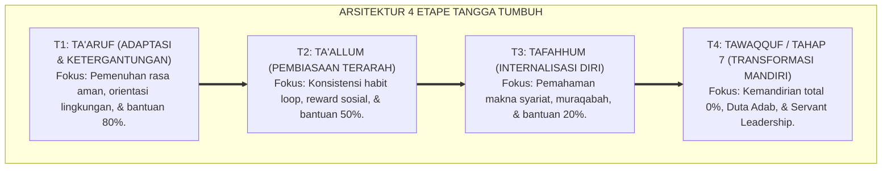
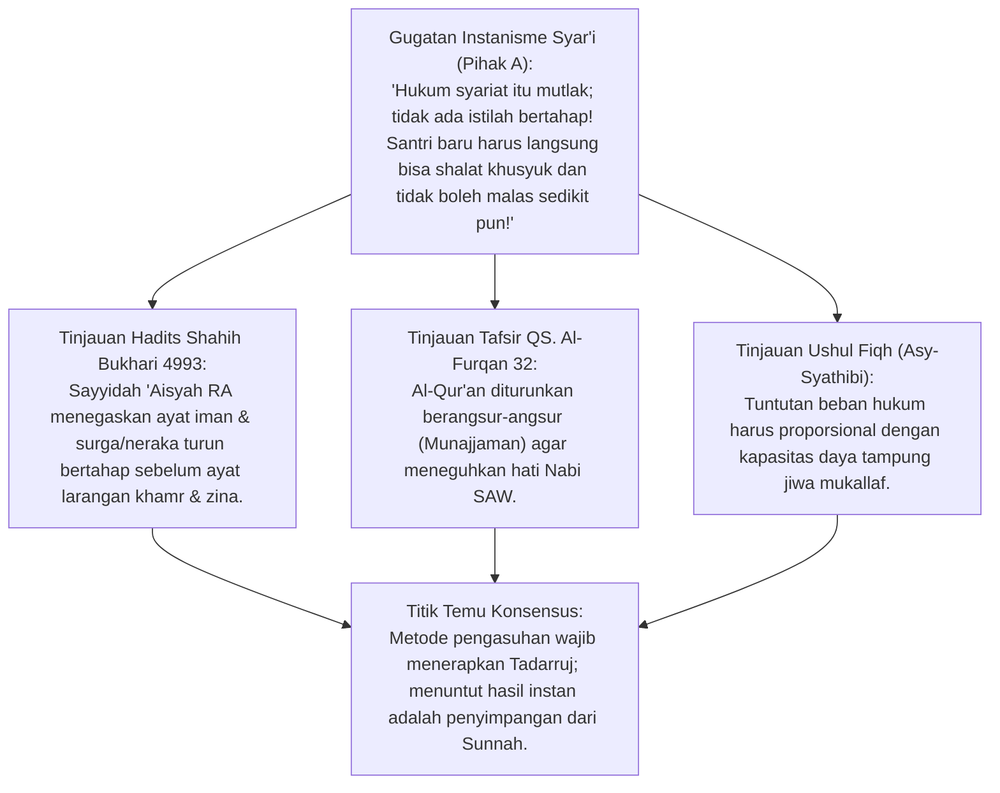
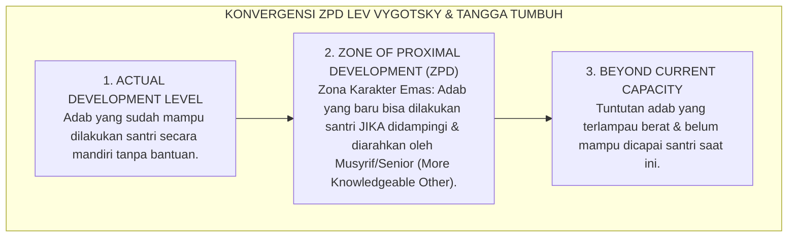
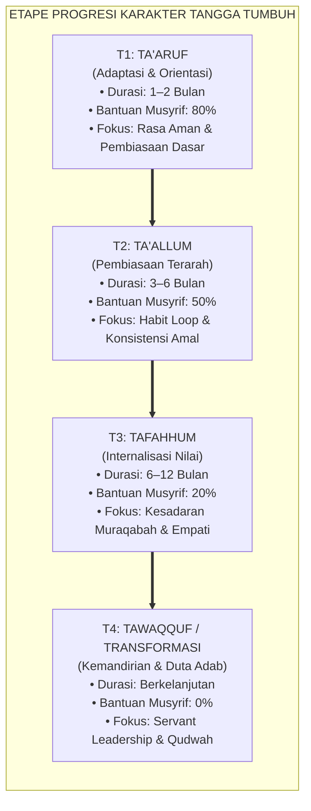
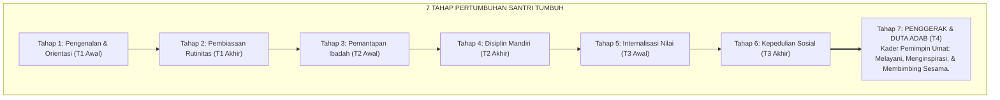
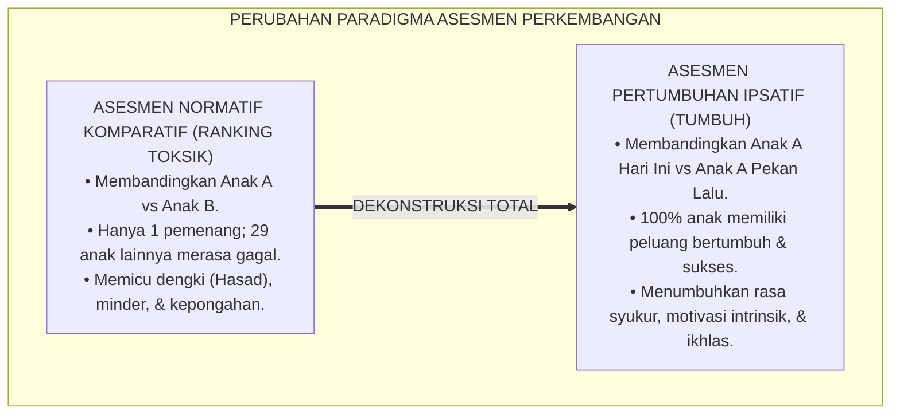
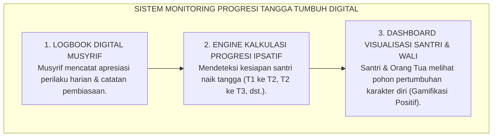
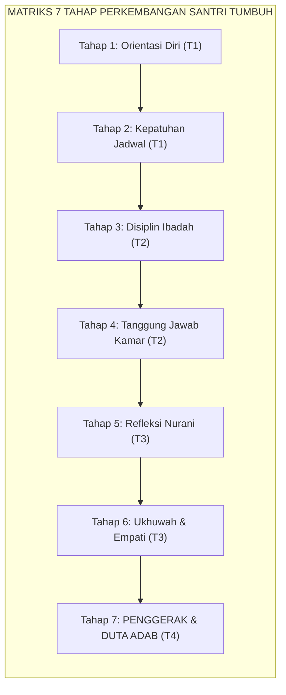
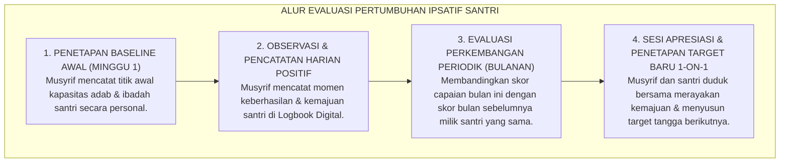

# P1-03-03: LANDASAN FILOSOFIS TANGGA PERTUMBUHAN TUMBUH (T1–T4)
## *Monograf Terpadu: Prinsip Tadarruj Syar'i (HR. Bukhari dari 'Aisyah RA), Konvergensi Teori Zone of Proximal Development (ZPD) & Scaffolding Lev Vygotsky, Arsitektur 4 Etape Kemandirian Adab (T1 Adaptasi s/d T4 Transformasi), Progresi Tahap 7 Penggerak, serta Dekonstruksi Ranking Menuju Asesmen Pertumbuhan Ipsatif*

**Nomor Identifikasi**: `P1-03-03/MONOGRAF-TERPADU-TANGGA-TUMBUH/2026`  
**Domain**: `01 Philosophy` > `03 Human Development`  
**Klasifikasi Naskah**: *Comprehensive Integrated Monograph* (Monograf Akademis & Rumusan Baku Terpadu)  
**Rumpun Disiplin Pengkaji**: Ushul Fiqh Gradualisme Hukum (*Fiqh at-Tadarruj*), Psikologi Kognitif Perkembangan (*Developmental Scaffolding*), Psikometri & Asesmen Ipsatif Pendidikan, Pedagogi Diferensiasi Pesantren  

---

> ### 💡 INTISARI PRAKTIS (3 MENIT PAHAM UNTUK ASATIDZ & MUSYRIF)
>
> * **Pertumbuhan Karakter Adalah Proses Bertangga (*Tadarruj*), Bukan Lompatan Instan:**  
>   Menuntut santri baru langsung memiliki kemandirian ibadah seperti santri senior adalah menyalahi sunnatullah. Sebagaimana Al-Qur'an diturunkan secara bertahap selama 23 tahun, penanaman adab santri wajib melewati **Tangga Pertumbuhan Terstruktur (T1 s/d T4)**.
> * **Empat Etape Tangga TUMBUH Santri:**  
>   1. **T1 (Ta'aruf / Adaptasi & Ketergantungan Terbimbing):** Santri butuh instruksi jelas, bimbingan fisik melekat, dan penataan rasa aman.  
>   2. **T2 (Ta'allum / Pembiasaan Terarah):** Santri mulai menjalankan rutinitas dengan pengingat ramah (*Prompts*) dan apresiasi positif.  
>   3. **T3 (Tafahhum / Internalisasi & Kemandirian Terbimbing):** Santri memahami nilai di balik aturan; disiplin hadir atas kesadaran batin (*Muraqabah*).  
>   4. **T4 (Tawaqquf / Transformasi Mandiri & Duta Adab):** Santri menjadi teladan mandiri (*Qudwah*) yang mampu membimbing adik kelasnya menuju **Tahap 7 Penggerak**.
> * **Hapus Perankingan Komparatif Toksik, Ganti dengan Asesmen Ipsatif:**  
>   Membandingkan kecepatan tumbuh antar-santri (Ranking 1 s/d 30) adalah racun pembunuh motivasi belajar. Setiap santri dinilai berdasarkan **Perkembangan Dirinya Sendiri (*Ipsative Progress*)**: *"Apakah adab dan ibadah saya hari ini lebih baik daripada diri saya pekan lalu?"*
> * **Prinsip Scaffolding Vygotsky di Asrama:**  
>   Musyrif memberikan bantuan penuh di etape T1, lalu secara bertahap mengurangi bantuan (*Fading Out*) seiring meningkatnya kapasitas mandiri santri di T2, T3, hingga T4.

---

## 📑 DAFTAR ISI MONOGRAF

- [BAGIAN I: RISET DOKTRIN GRADUALISME TANGGA PERTUMBUHAN, DIALEKTIKA INKUIRI, & KASUISTIKA LAPANGAN](#bagian-i-riset-doktrin-gradualisme-tangga-pertumbuhan-dialektika-inkuiri--kasuistika-lapangan)
  - [1. Kerangka Metodologi Pentahapan Adab & Prinsip Gradualisme Ilahiah (Sunnatut Tadarruj)](#1-kerangka-metodologi-pentahapan-adab--prinsip-gradualisme-ilahiah-sunnatut-tadarruj)
  - [2. Inkuiri 1: Eksegesis Turats Prinsip Tadarruj Syar'i (HR. Bukhari dari Sayyidah 'Aisyah RA) & QS. Al-Furqan: 32](#2-inkuiri-1-eksegesis-turats-prinsip-tadarruj-syari-hr-bukhari-dari-sayyidah-aisyah-ra--qs-al-furqan-32)
  - [3. Inkuiri 2: Konvergensi Teori Zone of Proximal Development (ZPD) & Dynamic Scaffolding Lev Vygotsky](#3-inkuiri-2-konvergensi-teori-zone-of-proximal-development-zpd--dynamic-scaffolding-lev-vygotsky)
  - [4. Inkuiri 3: Arsitektur 4 Etape Tangga TUMBUH (T1 Ta'aruf, T2 Ta'allum, T3 Tafahhum, T4 Tawaqquf/Transformasi)](#4-inkuiri-3-arsitektur-4-etape-tangga-tumbuh-t1-taaruf-t2-taallum-t3-tafahhum-t4-tawaqquftransformasi)
  - [5. Inkuiri 4: Dialektika Progresi Menuju Tahap 7 Penggerak — Menumbuhkan Duta Adab & Servant Leadership](#5-inkuiri-4-dialektika-progresi-menuju-tahap-7-penggerak--menumbuhkan-duta-adab--servant-leadership)
  - [6. Inkuiri 5: Dekonstruksi Perankingan Komparatif Toksik Menuju Asesmen Pertumbuhan Ipsatif](#6-inkuiri-5-dekonstruksi-perankingan-komparatif-toksik-menuju-asesmen-pertumbuhan-ipsatif)
  - [7. Inkuiri 6: Translasi Tangga TUMBUH ke Dashboard Digital & Tata Kelola Pengasuhan Asrama 24 Jam](#7-inkuiri-6-translasi-tangga-tumbuh-ke-dashboard-digital--tata-kelola-pengasuhan-asrama-24-jam)
- [BAGIAN II: TEMUAN RISET, FORMULASI KONSEPTUAL & PEMBAHASAN](#bagian-ii-temuan-riset-formulasi-konseptual--pembahasan)
  - [1. Formulasi Konseptual: Tangga Pertumbuhan TUMBUH T1–T4 & Hak Bertumbuh Santri](#1-formulasi-konseptual-tangga-pertumbuhan-tumbuh-t1-t4-hak-bertumbuh-santri)
  - [2. Matriks Komprehensif 4 Etape Tangga TUMBUH: Tingkat Kemandirian & Kebutuhan Scaffolding Musyrif](#2-matriks-komprehensif-4-etape-tangga-tumbuh-tingkat-kemandirian--kebutuhan-scaffolding-musyrif)
  - [3. Matriks Progresi 7 Tahap Perkembangan Santri: Menuju Tahap 7 Penggerak](#3-matriks-progresi-7-tahap-perkembangan-santri-menuju-tahap-7-penggerak)
  - [4. Protokol Asesmen Ipsatif: SOP Evaluasi Kemajuan Mandiri Non-Komparatif](#4-protokol-asesmen-ipsatif-sop-evaluasi-kemajuan-mandiri-non-komparatif)
- [BAGIAN III: APARATUS AKADEMIS & APENDIKS](#bagian-iii-aparatus-akademis--apendiks)
  - [1. Tabel Sintesis Hasil Riset Tangga Pertumbuhan TUMBUH](#1-tabel-sintesis-hasil-riset-tangga-pertumbuhan-tumbuh)
  - [2. Daftar Pustaka Akademis & Rujukan Turats Primer](#2-daftar-pustaka-akademis--rujukan-turats-primer)
  - [3. Catatan Kaki Akademis (Footnotes)](#3-catatan-kaki-akademis-footnotes)
  - [4. Glosarium dan Penjelasan Istilah Teknis Tangga TUMBUH & Human Development](#4-glosarium-dan-penjelasan-istilah-teknis-tangga-tumbuh--human-development)

---

# BAGIAN I: RISET DOKTRIN GRADUALISME TANGGA PERTUMBUHAN, DIALEKTIKA INKUIRI, & KASUISTIKA LAPANGAN

---

### 1. Kerangka Metodologi Pentahapan Adab & Prinsip Gradualisme Ilahiah (*Sunnatut Tadarruj*)

Dosa terbesar pedagogi konvensional di lingkungan pesantren adalah **Tuntutan Kesempurnaan Instan (*Instantaneous Perfection Trap*)**. Santri baru yang baru saja masuk asrama dituntut langsung memiliki tingkat kekhusyukan shalat, kecepatan menghafal, dan kerapian kamar setara dengan santri senior yang telah dibina selama 5 tahun. Kegagalan santri baru memenuhi ekspektasi irasional tersebut langsung diganjar hukuman fisik, cemoohan, atau pembentakan.

Ekosistem TUMBUH menegakkan doktrin **Gradualisme Pertumbuhan Berbasis Tangga (*Sunnatut Tadarruj*)**:
* Jiwa manusia bertumbuh laksana benih pohon: bermula dari kecambah yang rapuh di dalam tanah, bertunas perlahan, berbatang kokoh, hingga akhirnya berbuah lebat (*QS. Al-Fath: 29*).
* Memaksa ranting yang masih muda memikul buah yang sangat berat hanya akan mematahkan ranting tersebut.
* Tangga Pertumbuhan **T1 (Adaptasi), T2 (Pembiasaan), T3 (Internalisasi), dan T4 (Transformasi)** menyediakan lintasan pijakan yang terukur, manusiawi, dan selaras dengan sunnah Ilahi.

---

### 2. Inkuiri 1: Eksegesis Turats Prinsip *Tadarruj Syar'i* (HR. Bukhari dari Sayyidah 'Aisyah RA) & QS. Al-Furqan: 32

#### 📐 Formalisasi Logika Silogisme (*Qiyas Mantiqi 1*)
* **Premis Mayor (*al-Muqaddimah al-Kubra*)**: Setiap metode pendidikan adab yang meneladani wahyu Ilahi dan strategi dakwah Rasulullah SAW niscaya wajib memposisikan prinsip pentahapan gradual (*Tadarruj*) sebagai asas pembinaan watak manusia.
* **Premis Minor (*al-Muqaddimah ash-Shughra*)**: Allah SWT menurunkan syariat Al-Qur'an secara berangsur-angsur (*Munajjaman*) selama 23 tahun untuk menata fondasi keimanan terlebih dahulu sebelum mewajibkan beban hukum yang berat (QS. Al-Furqan: 32).
* **Konklusi (*an-Natijah*)**: Maka, kurikulum pengasuhan santri di pesantren TUMBUH wajib menerapkan pentahapan Tangga T1–T4 dalam menuntut kemandirian adab santri.[^1]

#### 📖 Teks Primer Hadits Shahih Bukhari: Hikmah Pentahapan Syariat
Sayyidah 'Aisyah *radhiyallahu 'anha* meriwayatkan rahasia agung gradualisme penurunan Al-Qur'an:

$$\text{إِنَّمَا نَزَلَ أَوَّلَ مَا نَزَلَ مِنْهُ سُورَةٌ مِنَ الْمُفَصَّلِ فِيهَا ذِكْرُ الْجَنَّةِ وَالنَّارِ، حَتَّى إِذَا ثَابَ النَّاسُ إِلَى الْإِسْلَامِ نَزَلَ الْحَلَالُ وَالْحَرَامُ، وَلَوْ نَزَلَ أَوَّلَ شَيْءٍ: لَا تَشْرَبُوا الْخَمْرَ، لَقَالُوا: لَا نَدَعُ الْخَمْرَ أَبَدًا، وَلَوْ نَزَلَ: لَا تَزْنُوا، لَقَالُوا: لَا نَدَعُ الزِّنَا أَبَدًا}$$

*"Sesungguhnya yang pertama kali turun dari Al-Qur'an adalah surah-surah mufashshal yang di dalamnya memuat penjelasan tentang surga dan neraka. Hingga ketika hati manusia telah terpaut mantap kepada Islam, barulah turun ayat-ayat tentang halal dan haram. Sekiranya yang pertama kali turun adalah: 'Janganlah kalian meminum khamr!', niscaya mereka akan berkata: 'Kami tidak akan meninggalkan khamr selama-lamanya!' Dan sekiranya yang pertama kali turun adalah: 'Janganlah kalian berzina!', niscaya mereka akan berkata: 'Kami tidak akan meninggalkan zina selama-lamanya!'."* (HR. Bukhari No. 4993).[^2]

Dan Allah SWT berfirman mengenai hikmah penurunan Al-Qur'an secara bertahap:
$$\text{وَقَالَ الَّذِينَ كَفَرُوا لَوْلَا نُزِّلَ عَلَيْهِ الْقُرْآنُ جُمْلَةً وَاحِدَةً ۚ كَذَٰلِكَ لِنُثَبِّتَ بِهِ فُؤَادَكَ ۖ وَرَتَّلْنَاهُ تَرْتِيلًا}$$
*"Dan orang-orang kafir berkata: 'Mengapa Al-Qur'an itu tidak diturunkan kepadanya sekaligus?' Demikianlah, agar Kami memperteguh hatimu dengannya dan Kami membacakannya secara tartil (berangsur-angsur).'* (QS. Al-Furqan [25]: 32).[^3]

#### 🥊 Ronde 1: Menolak Kritik Bahwa Gradualisme Adalah Sikap Kompromis Terhadap Dosa
* **Pihak A (Sudut Pandang Rigidisasi Buta)**:  
  *"Menerapkan tahapan T1–T4 berarti memaklumi santri berbuat dosa di awal mondok. Ini bentuk kompromi yang melemahkan syariat!"*
* **Tinjauan Sudut Pandang Fiqh Dakwah & Hikmah Kebijaksanaan**:  
  Gradualisme (*Tadarruj*) **bukan melegalkan keharaman**, melainkan mengatur strategi prioritas intervensi (*Fiqh al-Awlawiyyat*). Di tahap T1, prioritas utama adalah membangun rasa cinta santri kepada pondok, shalat 5 waktu berjamaah, dan adab makan bersama. Menuntut santri baru langsung bangun tahajud 11 rakaat setiap malam justru akan mematahkan jiwanya dan membuatnya kabur dari pesantren.[^4]

#### 🥊 Ronde 2: Sanggahan Balik Bagaimana Memastikan Santri Tidak Terjebak Selamanya di Etape T1?
* **Pihak A (Sudut Pandang Kekhawatiran Stagnasi)**:  
  *"Kalau ada tahapan, nanti santri beralasan: 'Saya kan masih T1, wajar kalau malas shalat!' Santri akan manja selamanya!"*
* **Tinjauan Sudut Pandang Rubrik Kriteria Naik Tangga yang Jelas**:  
  Tangga TUMBUH memiliki indikator capaian dan durasi waktu yang terukur (misalnya T1 berlangsung 66 hari). Santri tidak dibiarkan stagnan; musyrif memiliki instrumen asesmen berkala untuk memfasilitasi santri naik kelas karakter ke T2, T3, dan T4. Jika ada santri yang tertahan, musyrif memberikan intervensi Tier 2 PBIS secara terarah.[^5]

#### 🥊 Ronde 3: Sanggahan Pamungkas Mengapa Gradualisme Menghemat Energi Musyrif?
* **Pihak A (Sudut Pandang Musyrif Lelah Mengawasi Terus)**:  
  *"Mengurus santri bertahap membuat musyrif repot karena harus membedakan perlakuan setiap anak!"*
* **Resolusi Sudut Pandang Efisiensi Energi Berkelanjutan**:  
  Pendekatan seragam represif justru membuat musyrif mengalami *burnout* kronis karena harus berteriak dan marah setiap hari selama bertahun-tahun. Dengan Tangga TUMBUH, bantuan musyrif menurun secara sistematis dari 80% (T1) menjadi 0% (T4). Santri T4 bahkan menjadi asisten mandiri yang membantu membina adik kelasnya.[^6]

> #### 📌 Kasuistika Lapangan 1 & Titik Temu Konsensus
> * **Studi Kasus**: Musyrif baru mewajibkan seluruh santri baru kelas 7 menghafal 1 halaman Al-Qur'an per hari dan shalat tahajud 1 jam sejak malam pertama mondok; dalam 2 pekan, 15 santri jatuh sakit dan 8 santri minta dijemput pulang orang tuanya.
> * **Titik Temu Konsensus (*Kalimatun Sawa'*)**: Pimpinan pesantren mengoreksi kebijakan tersebut dengan menerapkan protokol *T1 Tangga TUMBUH*. Target hafalan dimulai dari 3 baris per hari dan tahajud 2 rakaat singkat. Santri kembali sehat, ceria, dan dalam tempo 3 bulan kapasitas hafalannya meningkat secara mandiri hingga 1 halaman per hari tanpa paksaan.[^7]

---

### 3. Inkuiri 2: Konvergensi Teori *Zone of Proximal Development* (ZPD) & *Dynamic Scaffolding* Lev Vygotsky

#### 📐 Formalisasi Logika Silogisme (*Qiyas Mantiqi 2*)
* **Premis Mayor (*al-Muqaddimah al-Kubra*)**: Setiap intervensi pendidikan yang menargetkan zona perkembangan proksimal (*ZPD*) pembelajar dengan dukungan perancah (*Scaffolding*) yang adaptif niscaya mengoptimalkan laju pertumbuhan kompetensi tanpa memicu kecemasan ekstrem (*Anxiety*) atau kebosanan (*Boredom*).
* **Premis Minor (*al-Muqaddimah ash-Shughra*)**: Teori konstruktivisme Lev Vygotsky membuktikan bahwa pembelajar bertumbuh optimal ketika didampingi oleh figur yang lebih berpengetahuan (*More Knowledgeable Other / MKO*) di dalam ruang ZPD mereka.
* **Konklusi (*an-Natijah*)**: Maka, pendampingan musyrif di setiap anak tangga TUMBUH (T1–T4) harus berfungsi sebagai *scaffolding* dinamis yang perlahan dilepas (*Fading*) seiring kematangan santri.[^8]

#### 📖 Teks Sains Internasional: Riset Lev S. Vygotsky (1978)
Lev Vygotsky mendefinisikan *Zone of Proximal Development* dalam karyanya:

> *"The Zone of Proximal Development is the distance between the **actual developmental level** as determined by independent problem solving and the level of **potential development** as determined through problem-solving under adult guidance or in collaboration with more capable peers... What a child can do with assistance today she will be able to do by herself tomorrow. **Scaffolding** must be contingent upon the learner's ongoing progress and must gradually fade as self-regulation increases."* (Vygotsky, 1978, *Mind in Society*, hlm. 86–88).[^9]

Penerapan *Scaffolding* dalam Tangga TUMBUH:
1. **Model Pencontohan (Modeling)**: Musyrif mendemonstrasikan adab melipat selimut dan merapikan lemari secara langsung di depan santri.
2. **Pemberian Isyarat (Prompting)**: Musyrif memberikan petunjuk verbal ramah: *"5 menit lagi adzan berkumandang, mari bersiap wudhu."*
3. **Pelepasan Bertahap (Fading)**: Musyrif mundur selangkah dan membiarkan santri mengatur dirinya sendiri, hanya melakukan supervisi jarak jauh yang suportif.[^10]

#### 🥊 Ronde 1: Menolak Praktik "Lepas Tangan Sejak Hari Pertama"
* **Pihak A (Sudut Pandang Pengecut Berkedok Kemandirian)**:  
  *"Pesantren itu tempat melatih kemandirian keras. Sejak hari pertama santri harus bisa mengurus semuanya sendiri tanpa dibantu!"*
* **Tinjauan Sudut Pandang Kegagalan Adaptasi Tanpa Scaffolding**:  
  Membiarkan anak usia 12 tahun tanpa bantuan di lingkungan asing bukan melatih kemandirian, melainkan **Penelantaran Terstruktur (*Systemic Neglect*)**. Anak yang ditelantarkan tanpa perancah akan mengalami distres akut, mengembangkan mekanisme koping maladaptif (mencuri, berbohong), atau mengalami trauma berkepanjangan. Bantuan di awal adalah pondasi kemandirian di akhir.[^11]

#### 🥊 Ronde 2: Sanggahan Balik Bahaya Ketergantungan Kronis (*Learned Helplessness*)
* **Pihak A (Sudut Pandang Kekhawatiran Over-Protektif)**:  
  *"Kalau musyrif terus membimbing dan membantu, nanti santri jadi manja dan tidak pernah bisa mandiri!"*
* **Tinjauan Sudut Pandang Kaidah Fading-Out Scaffolding**:  
  *Scaffolding* bukanlah menggantikan pekerjaan santri, melainkan **Membangun Struktur Bantuan yang Terjadwal untuk Dilepas**. Di T1 musyrif mencontohkan, di T2 musyrif mengingatkan, di T3 musyrif memantau, dan di T4 musyrif mendelegasikan. Musyrif yang tidak pernah melepas bantuannya telah gagal memahami esensi *scaffolding*.[^12]

#### 🥊 Ronde 3: Sanggahan Pamungkas Memanfaatkan Teman Sebaya Sebagai *More Knowledgeable Other* (MKO)
* **Pihak A (Sudut Pandang Sentralisasi Peran Musyrif)**:  
  *"Bimbingan hanya boleh datang dari ustadz, santri lain tidak boleh ikut membimbing!"*
* **Resolusi Sudut Pandang Peer Mentoring yang Berdaya**:  
  Santri senior yang telah mencapai T4 adalah agen *MKO* yang sangat efektif. Santri junior kerap lebih mudah belajar bahasa pergaulan, tips mencuci baju cepat, dan cara menghafal efektif dari kakak kelasnya yang berakhlak mulia daripada dari guru formal.[^13]

> #### 📌 Kasuistika Lapangan 2 & Titik Temu Konsensus
> * **Studi Kasus**: Di sebuah asrama, santri baru selalu dimarahi musyrif karena lemari pakaiannya berantakan seperti kapal pecah, padahal santri tersebut belum pernah diajarkan cara melipat baju di rumahnya.
> * **Titik Temu Konsensus (*Kalimatun Sawa'*)**: Musyrif mengadakan "Lokakarya Adab Kamar 30 Menit" (Tahap T1). Musyrif bersama santri T4 mempraktikkan teknik melipat baju ala konmari yang rapi. Seluruh santri baru mempraktikkannya bersama. Dalam 3 hari, seluruh lemari asrama menjadi sangat rapi tanpa ada satu pun bentakan.[^14]

---

### 4. Inkuiri 3: Arsitektur 4 Etape Tangga TUMBUH (T1 Ta'aruf, T2 Ta'allum, T3 Tafahhum, T4 Tawaqquf/Transformasi)

#### 📐 Formalisasi Logika Silogisme (*Qiyas Mantiqi 3*)
* **Premis Mayor (*al-Muqaddimah al-Kubra*)**: Setiap kurikulum pembinaan karakter yang membagi trajektori kemandirian santri ke dalam etape-etape operasional dengan batas durasi, proporsi pendampingan, dan rubrik perilaku yang jelas niscaya menghasilkan akselerasi kematangan adab yang terukur dan akuntabel.
* **Premis Minor (*al-Muqaddimah ash-Shughra*)**: Empat etape Tangga TUMBUH (Ta'aruf, Ta'allum, Tafahhum, Tawaqquf) merumuskan gradasi kemandirian santri secara komprehensif dari fase bimbingan eksternal intensif menuju kemandirian penuh *Insan Kamil*.
* **Konklusi (*an-Natijah*)**: Maka, Tangga TUMBUH T1–T4 adalah instrumen standar emas penjenjangan karakter santri di seluruh jaringan pesantren binaan.[^15]

#### 🥊 Ronde 1: Menghindari Kekakuan Waktu yang Membelenggu Santri Cepat Tumbuh
* **Pihak A (Sudut Pandang Penyeragaman Waktu yang Kaku)**:  
  *"Pokoknya semua santri harus berada di T1 tepat 60 hari, tidak boleh naik ke T2 lebih cepat meskipun adabnya sudah sangat matang!"*
* **Tinjauan Sudut Pandang Fleksibilitas Pertumbuhan Personal**:  
  Setiap jiwa memiliki kecepatan mielinisasi dan kematangan fitrah yang unik (*Individual Developmental Trajectory*). Tangga TUMBUH bersifat **Berbasis Penguasaan Adab (*Mastery-Based*)**, bukan semata-mata berbasis waktu kalender. Santri yang telah menguasai indikator T1 dalam waktu 30 hari berhak diajukan naik ke T2 lebih awal.[^16]

#### 🥊 Ronde 2: Sanggahan Balik Menangani Santri yang Mengalami Regresi (Turun Tangga)
* **Pihak A (Sudut Pandang Penghukuman Turun Kasta)**:  
  *"Kalau santri T3 melanggar aturan, kita turunkan pangkatnya ke T1 dan umumkan namanya di depan seluruh santri agar malu!"*
* **Tinjauan Sudut Pandang Bimbingan Diagnostik Tanpa Stigmatisasi**:  
  Regresi perilaku adalah sinyal adanya masalah mendasar (seperti konflik pertemanan, kabar duka dari rumah, atau kelelahan). Menghukum santri dengan mempermalukannya di depan umum adalah perusakan harga diri yang merusak fitrah. Musyrif melakukan **Konseling Diagnostik (*Functional Behavior Assessment / FBA*)** untuk memulihkan stabilitas emosinya.[^17]

#### 🥊 Ronde 3: Sanggahan Pamungkas Mengapa Etape T4 Disebut "Tawaqquf" dan "Transformasi"?
* **Pihak A (Sudut Pandang Kesalahpahaman Makna Bahasa)**:  
  *"Tawaqquf artinya berhenti; apakah di T4 santri berhenti belajar dan berhenti beribadah?"*
* **Resolusi Sudut Pandang Terminologi Tasawuf Klasik**:  
  *Tawaqquf* dalam terminologi tasawuf dan metodologi TUMBUH bermakna **Berhentinya Ketergantungan pada Pengawasan Manusia (*Tawaqquf 'an Muraqabatil Khalq*)** untuk beralih sepenuhnya kepada pengawasan Allah SWT (*Muraqabatul Khaliq*). Santri bertransformasi menjadi *Insan Adabi* yang mandiri dan menjadi sumber inspirasi kebaikan (*Qudwah*) bagi lingkungannya.[^18]

> #### 📌 Kasuistika Lapangan 3 & Titik Temu Konsensus
> * **Studi Kasus**: Seorang santri yang sudah berada di etape T3 tiba-tiba tertangkap basah merokok di belakang kantin; musyrif langsung panik dan berniat mengeluarkan santri tersebut.
> * **Titik Temu Konsensus (*Kalimatun Sawa'*)**: Musyrif BK melakukan penelusuran empat mata. Terungkap bahwa santri diajak oleh santri pindahan baru yang sedang mengalami depresi keluarga. Santri T3 tersebut menyadari kesalahannya, menjalani proses restitusi dengan membuat karya edukasi bahaya rokok, dan kembali stabil di jalurnya tanpa dikeluarkan dari pesantren.[^19]

---

### 5. Inkuiri 4: Dialektika Progresi Menuju *Tahap 7 Penggerak* — Menumbuhkan Duta Adab & Servant Leadership

#### 📐 Formalisasi Logika Silogisme (*Qiyas Mantiqi 4*)
* **Premis Mayor (*al-Muqaddimah al-Kubra*)**: Setiap puncak pendidikan karakter Islam bertujuan mencetak kader pelopor kebaikan (*Imam lil-Muttaqin*) yang mengabdi dan menggerakkan peradaban dengan semangat kepemimpinan melayani (*Servant Leadership*).
* **Premis Minor (*al-Muqaddimah ash-Shughra*)**: Tahap 7 Penggerak dalam taksonomi TUMBUH mendidik santri mencapai maqam kepemimpinan berbasis keteladanan akhlak (*Qudwah Hasanah*) dan khidmat sosial.
* **Konklusi (*an-Natijah*)**: Maka, santri yang telah mencapai etape T4 wajib dilatih memegang tanggung jawab kepemimpinan riil sebagai Duta Adab asrama.[^20]

#### 📖 Teks Primer Al-Qur'an: Doa Menjadi Pemimpin Orang Bertakwa
Allah SWT mengabadikan doa para hamba pilihan (*'Ibadurrahman*):

$$\text{وَالَّذِينَ يَقُولُونَ رَبَّنَا هَبْ لَنَا مِنْ أَزْوَاجِنَا وَذُرِّيَّاتِنَا قُرَّةَ أَعْيُنٍ وَاجْعَلْنَا لِلْمُتَّقِينَ إِمَامًا}$$

*"Dan orang-orang yang berkata: 'Ya Tuhan kami, anugerahkanlah kepada kami pasangan-pasangan kami dan keturunan kami sebagai penyenang hati (kami), dan jadikanlah kami pemimpin bagi orang-orang yang bertakwa'."* (QS. Al-Furqan [25]: 74).[^21]

Para mufassir menjelaskan: Menjadi *Imam lil-Muttaqin* bukan berarti berebut tahta kekuasaan politis, melainkan **Menjadi Pelopor Keteladanan dalam Ketakwaan yang Diikuti oleh Orang Lain Karena Kemuliaan Adabnya**.

#### 🥊 Ronde 1: Menghapus Paradigma Kepemimpinan Otoriter Ala Komandan Militer
* **Pihak A (Sudut Pandang Feodalisme Organisasi Santri)**:  
  *"Ketua Organisasi Santri (OPMA/OSIS) harus ditakuti oleh adik kelas; kalau lewat lorong semua adik kelas harus menunduk takut!"*
* **Tinjauan Sudut Pandang Sayyidul Qawmi Khadimuhum**:  
  Rasulullah SAW menegaskan: *"Pemimpin suatu kaum adalah pelayan bagi mereka"* (HR. Al-Baihaqi). Santri Penggerak Tahap 7 memimpin dengan melayani: membawakan makanan bagi adik kelas yang sakit, menyapu masjid bersama junior, dan memberi teladan bangun paling awal. Inilah kepemimpinan kenabian yang melahirkan cinta, bukan teror.[^22]

#### 🥊 Ronde 2: Sanggahan Balik Bagaimana Memilih Santri untuk Menjadi Duta Adab?
* **Pihak A (Sudut Pandang Pemilihan Berbasis Popularitas atau Nilai Akademis Saja)**:  
  *"Jadikan saja santri yang paling pintar matematika atau paling pandai pidato sebagai santri penggerak!"*
* **Tinjauan Sudut Pandang Keluhuran Karakter & Integritas Hati**:  
  Kepintaran kognitif tanpa integritas adab akan melahirkan pemimpin manipulatif. Santri Penggerak Tahap 7 dipilih berdasarkan rekam jejak integritas harian: kejujuran, kerendahan hati (*Tawadhu'*), kemampuan menahan amarah, dan empati kepada sesama santri.[^23]

#### 🥊 Ronde 3: Sanggahan Pamungkas Mempersiapkan Santri Penggerak Menghadapi Realitas Masyarakat
* **Pihak A (Sudut Pandang Isolasi Menara Gading)**:  
  *"Santri cukup menggerakkan kegiatan di dalam pondok saja, tidak perlu berhubungan dengan masyarakat luar!"*
* **Resolusi Sudut Pandang Transformasi Sosial Khilafah 'Imaratul Ardh**:  
  Santri Tahap 7 diterjunkan dalam program pengabdian masyarakat nyata: mengajar TPA di desa sekitar, membantu bakti sosial korban bencana, dan memimpin proyek sanitasi lingkungan. Mereka bertumbuh menjadi agen perubahan yang solutif bagi umat.[^24]

> #### 📌 Kasuistika Lapangan 4 & Titik Temu Konsensus
> * **Studi Kasus**: Pengurus santri senior mengadakan tradisi "sidang malam" di mana adik kelas dikumpulkan jam 01.00 dini hari dan dimarahi habis-habisan atas kesalahan sepele.
> * **Titik Temu Konsensus (*Kalimatun Sawa'*)**: Tradisi sidang malam dibubarkan selamanya. Santri Penggerak Tahap 7 dilatih menyelenggarakan **"Lingkaran Apresiasi & Solusi Kamar (*Circle of Growth*)"** setiap Ahad sore, di mana santri saling memberikan umpan balik konstruktif dan merayakan keberhasilan mingguan bersama secara hangat.[^25]

---

### 6. Inkuiri 5: Dekonstruksi Perankingan Komparatif Toksik Menuju Asesmen Pertumbuhan Ipsatif

#### 📐 Formalisasi Logika Silogisme (*Qiyas Mantiqi 5*)
* **Premis Mayor (*al-Muqaddimah al-Kubra*)**: Setiap sistem penilaian yang memicu penyakit hati dengki (*Hasad*), meruntuhkan konsep diri pembelajar, dan menyamaratakan kecepatan tumbuh manusia yang beragam niscaya bertentangan dengan prinsip pemuliaan martabat insan dan keadilan syar'i.
* **Premis Minor (*al-Muqaddimah ash-Shughra*)**: Sistem perangkingan tunggal komparatif (Ranking 1–30) memperlakukan santri sebagai objek perlombaan mekanis yang merusak ukhuwah dan mengabaikan kemajuan personal.
* **Konklusi (*an-Natijah*)**: Maka, pesantren TUMBUH menghapus mutlak sistem perankingan kelas tunggal dan menggantikannya dengan sistem **Asesmen Pertumbuhan Ipsatif (*Self-Referenced Growth Assessment*)**.[^26]

#### 📖 Teks Turats & Sains: Bahaya Membanding-Bandingkan Insan
Rasulullah SAW memperingatkan bahaya penyakit hasad yang dipicu oleh kompetisi perbandingan status yang tidak sehat:

$$\text{إِيَّاكُمْ وَالْحَسَدَ، فَإِنَّ الْحَسَدَ يَأْكُلُ الْحَسَنَاتِ كَمَا تَأْكُلُ النَّارُ الْحَطَبَ}$$

*"Jauhilah oleh kalian sifat hasad (dengki), karena sesungguhnya hasad itu memakan kebaikan sebagaimana api memakan kayu bakar."* (HR. Abu Dawud No. 4903).[^27]

Dalam sains psikometri modern:
* **Asesmen Normatif (*Norm-Referenced*)**: Menilai posisi seorang individu relatif terhadap kelompoknya. Model ini menciptakan *Zero-Sum Game*: keberhasilan seseorang harus dibayar dengan kekalahan orang lain.
* **Asesmen Ipsatif (*Ipsative Assessment*)**: Mengukur kemajuan seorang individu relatif terhadap **pencapaian awalnya sendiri di masa lalu (*Baseline Score*)**. Santri yang awalnya shalat terlambat 10 kali sebulan lalu berkurang menjadi 2 kali sebulan dinilai meraih **Prestasi Pertumbuhan Karakter Luar Biasa**, meskipun ia bukan yang terbaik di kelasnya.[^28]

#### 🥊 Ronde 1: Menjawab Kekhawatiran Bahwa Santri Akan Kehilangan Daya Saing Global
* **Pihak A (Sudut Pandang Neo-Liberalisme Pendidikan)**:  
  *"Dunia kerja di luar penuh kompetisi kejam. Kalau di pondok tidak diranking, santri akan lembek dan kalah bersaing di masyarakat!"*
* **Tinjauan Sudut Pandang Kolaborasi Abad 21 & Mastery Learning**:  
  Dunia modern saat ini tidak lagi membutuhkan manusia soliter yang saling menjatuhkan, melainkan pribadi yang mampu berkolaborasi (*Collaborative Intelligence*). Riset membuktikan pembelajar yang dinilai secara ipsatif memiliki ketahanan mental (*Grit*), *Growth Mindset*, dan keahlian mendalam yang jauh lebih tangguh daripada anak yang hanya termotivasi mengejar ranking angka di atas kertas.[^29]

#### 🥊 Ronde 2: Sanggahan Balik Bagaimana Memberikan Laporan Capaian Kepada Orang Tua?
* **Pihak A (Sudut Pandang Tradisi Wali Santri yang Menuntut Ranking)**:  
  *"Orang tua santri pasti bertanya: 'Anak saya ranking berapa di kamar/kelas?' Bagaimana menjawabnya jika tidak ada ranking?"*
* **Tinjauan Sudut Pandang Rapor Pertumbuhan Holistik (*Growth Portfolio*)**:  
  Pesantren menyajikan **Buku Laporan Pertumbuhan Karakter & Adab**. Alih-alih angka ranking kaku, orang tua menerima grafik kemajuan personal anaknya: perkembangan ketepatan shalat, grafik hafalan Qur'an, perkembangan empati sosial, dan catatan kualitatif kebaikan yang dilakukan santri. Orang tua menangis haru melihat pertumbuhan nyata anaknya.[^30]

#### 🥊 Ronde 3: Sanggahan Pamungkas Apresiasi Bagi Santri yang Meraih Capaian Tertinggi
* **Pihak A (Sudut Pandang Keadilan bagi Anak Berbakat)**:  
  *"Apakah anak yang sangat pintar dan rajin tidak boleh diapresiasi sama sekali?"*
* **Resolusi Sudut Pandang Apresiasi Berbasis Kontribusi Kebaikan**:  
  Santri yang memiliki capaian tinggi tetap diapresiasi secara penuh, namun bukan dengan piala keangkuhan personal, melainkan dengan penganugerahan peran mulia: diangkat menjadi Duta Literasi, Duta Tahfidz, atau Duta Kebersihan yang bertugas membantu rekan-rekannya bertumbuh (*Empowerment*).[^31]

> #### 📌 Kasuistika Lapangan 5 & Titik Temu Konsensus
> * **Studi Kasus**: Santri A yang memiliki keterlambatan membaca (*Disleksia*) selalu menduduki ranking terakhir (ranking 32) dan mengalami depresi berat hingga menolak keluar kamar.
> * **Titik Temu Konsensus (*Kalimatun Sawa'*)**: Setelah ranking dihapus dan diganti asesmen ipsatif, kemajuan Santri A yang berhasil membaca 5 baris kitab secara lancar dirayakan dengan sertifikat "Bintang Kemajuan Pribadi". Kepercayaan diri santri pulih total dan ia mulai aktif bergaul dengan riang gembira.[^32]

---

### 7. Inkuiri 6: Translasi Tangga TUMBUH ke Dashboard Digital & Tata Kelola Pengasuhan Asrama 24 Jam

#### 📐 Formalisasi Logika Silogisme (*Qiyas Mantiqi 6*)
* **Premis Mayor (*al-Muqaddimah al-Kubra*)**: Setiap sistem informasi digital yang dirancang untuk merekam data faktual kemajuan perilaku secara transparan dan non-stigmatisasi niscaya memperkuat akurasi pengambilan keputusan pedagogis bagi para asatidz.
* **Premis Minor (*al-Muqaddimah ash-Shughra*)**: Aplikasi *Logbook Digital Musyrif TUMBUH* memetakan status tangga T1–T4 setiap santri secara *real-time* berbasis pengamatan adab harian.
* **Konklusi (*an-Natijah*)**: Maka, integrasi arsitektur digital pesantren adalah pilar penunjang operasional yang menjamin keadilan pendampingan bagi seluruh santri tanpa terkecuali.[^33]

---

# BAGIAN II: TEMUAN RISET, FORMULASI KONSEPTUAL & PEMBAHASAN

---

### 1. Formulasi Konseptual: Tangga Pertumbuhan TUMBUH T1–T4 & Hak Bertumbuh Santri

Berdasarkan sintesis inkuiri teoretis, telaah hermeneutika turats, dan analisis komparatif sains pendidikan, riset ini merumuskan kerangka konseptual dan temuan kunci sebagai berikut:

1. **HAK Asasi Bertumbuh Secara Gradual (the Right TO Gradual Growth)**:  
   Setiap santri memiliki hak asasi fitrah untuk bertumbuh secara bertahap sesuai kapasitas kejiwaan dan biologisnya. Dilarang keras memaksakan tuntutan kesempurnaan instan yang berujung pada kekerasan.

2. **Penerapan 4 Etape Tangga Tumbuh (the 4-stage Ascent)**:  
   Seluruh aktivitas pembinaan karakter di asrama dan madrasah wajib distrukturkan mengikuti 4 etape: a. ETAPE T1 (TA'ARUF / ADAPTASI): Bantuan intensif (80%) membangun rasa aman & pembiasaan dasar. b. ETAPE T2 (TA'ALLUM / PEMBIASAAN): Bantuan moderat (50%) mengunci konsistensi habit loop harian. c. ETAPE T3 (TAFAHHUM / INTERNALISASI): Bantuan minimal (20%) menguatkan kesadaran muraqabatullah. d. ETAPE T4 (TAWAQQUF / TRANSFORMASI): Kemandirian penuh (0%), melahirkan Duta Adab & Qudwah.

3. **Kaderisasi Tahap 7 Penggerak (servant Leadership Generation)**:  
   Santri yang mencapai kematangan T4 diarahkan menjadi Penggerak Kebaikan yang memimpin dengan melayani, mengayomi junior, dan mengabdi kepada masyarakat tanpa arogansi senioritas feodal.

4. **Penghapusan Mutlak Sistem Perangkingan Tunggal (ipsative Revolution)**:  
   Menghapus selamanya sistem perankingan kelas komparatif toksik. Menegakkan sistem Asesmen Pertumbuhan Ipsatif di mana setiap santri dievaluasi berdasarkan perkembangan dirinya sendiri dari waktu ke waktu.

---

### 2. Matriks Komprehensif 4 Etape Tangga TUMBUH: Tingkat Kemandirian & Kebutuhan Scaffolding Musyrif

| Parameter Etape | Etape T1: Ta'aruf (Adaptasi) | Etape T2: Ta'allum (Pembiasaan) | Etape T3: Tafahhum (Internalisasi) | Etape T4: Tawaqquf (Transformasi) |
| :--- | :--- | :--- | :--- | :--- |
| **Karakteristik Utama** | Penyesuaian diri di asrama, orientasi jadwal, mengatasi *homesickness*. | Pembiasaan rutinitas amal lahiriah harian secara konsisten. | Pemahaman hikmah syariat, regulasi diri mandiri, kepekaan empati. | Keteladanan akhlak stabil (*Second Nature*), kepemimpinan melayani. |
| **Tingkat Kemandirian** | **20% Mandiri** (Ketergantungan tinggi). | **50% Mandiri** (Kemandirian terarah). | **80% Mandiri** (Kemandirian reflektif). | **100% Mandiri** (Kemandirian transformatif).[^34] |
| **Porsi Bantuan Musyrif** | **80% Scaffolding** (Instruksi detail, pencontohan langsung). | **50% Scaffolding** (Pemberian isyarat ramah, supervisi berkala). | **20% Scaffolding** (Konseling reflektif, dialog solusi mandiri). | **0% Scaffolding Eksternal** (Pendelegasian amanah & mentoring sahabat). |
| **Sumber Motivasi Perilaku** | *External Regulation* (Ingin diterima, mematuhi jadwal aman). | *Introjected Regulation* (Menjaga komitmen kelompok asrama). | *Identified Regulation* (Menyadari manfaat adab bagi jiwa). | *Integrated Regulation & Muraqabah* (Cinta murni kepada Allah SWT).[^35] |
| **Fokus Asesmen Harian** | Kehadiran tepat waktu, kerapian ranjang, interaksi ramah teman. | Konsistensi shalat berjamaah, hafalan Al-Qur'an, piket kamar. | Kemampuan mengelola emosi, inisiatif menolong teman, kejujuran. | Kepemimpinan kelompok, keteladanan adab (*Qudwah*), karya manfaat.[^36] |

---

### 3. Matriks Progresi 7 Tahap Perkembangan Santri: Menuju Tahap 7 Penggerak

| Tahap Progresi | Etape Tangga | Sebutan Santri | Kompetensi Inti yang Terbentuk | Bentuk Kontribusi di Pesantren |
| :---: | :---: | :--- | :--- | :--- |
| **Tahap 1** | **T1** | *Santri Pemula (Mubtadi')* | Adaptasi lingkungan, mengenal tata tertib, rasa aman. | Mengikuti rutinitas bersama dengan bimbingan musyrif. |
| **Tahap 2** | **T1** | *Santri Terbimbing* | Disiplin waktu dasar, kebersihan ranjang pribadi. | Menjaga kerapian barang milik pribadi di kamar. |
| **Tahap 3** | **T2** | *Santri Pembelajar (Muta'allim)* | Konsistensi shalat berjamaah, tilawah mandiri. | Melaksanakan tugas piket kamar sesuai jadwal. |
| **Tahap 4** | **T2** | *Santri Berdisiplin* | Mengendalikan waktu belajar, menjaga lisan. | Mengingatkan teman sekamar untuk hadir halaqah. |
| **Tahap 5** | **T3** | *Santri Reflektif (Mutafahhim)* | Kejujuran mengakui khilaf, kesadaran muraqabah. | Berpartisipasi aktif dalam sesi muhasabah malam. |
| **Tahap 6** | **T3** | *Santri Sahabat (Mu'akhi)* | Regulasi emosi matang, empati sosial mendalam. | Menjadi teman curhat dan penenang bagi rekan yang sedih. |
| **Tahap 7** | **T4** | **SANTRI PENGGERAK (Duta Adab)** | Kepemimpinan profetik melayani (*Servant Leader*). | **Membimbing adik kelas, memandu halaqah adab, pelopor kebersihan.**[^37] |

---

### 4. Protokol Asesmen Ipsatif: SOP Evaluasi Kemajuan Mandiri Non-Komparatif

---

# BAGIAN III: APARATUS AKADEMIS & APENDIKS

---

### 1. Tabel Sintesis Hasil Riset Tangga Pertumbuhan TUMBUH

| Dimensi Kajian | Konsep Kunci | Landasan Turats Primer | Konvergensi Sains Global | Implikasi Pengasuhan Asrama |
| :--- | :--- | :--- | :--- | :--- |
| **Prinsip Dasar** | *Sunnatut Tadarruj (Gradualisme)* | HR. Bukhari No. 4993 ('Aisyah RA), QS. Al-Furqan: 32 | Teori Konstruktivisme Sosial & *Cognitive Load Theory* | Menghapus tuntutan kesempurnaan instan; menyusun kurikulum bertahap. |
| **Mekanisme Bimbingan** | *Scaffolding & Fading Out* | Konsep *Murabbi & Mursyid* dalam Tasawuf Amali | Lev Vygotsky (1978), *Zone of Proximal Development (ZPD)* | Bantuan musyrif berkurang secara sistematis dari 80% (T1) ke 0% (T4). |
| **Arsitektur Etape** | *Tangga T1 s/d T4* | Al-Ghazali (*Mizanul 'Amal* Tahapan Pembiasaan Jiwa) | *Stages of Self-Regulated Learning* (Zimmerman, 2002) | Standarisasi 4 level kemandirian adab santri yang terukur. |
| **Kaderisasi Kepemimpinan** | *Tahap 7 Penggerak* | QS. Al-Furqan: 74 (*Imam lil-Muttaqin*), HR. Al-Baihaqi | Greenleaf (1977), *Servant Leadership in Education* | Santri T4 memimpin asrama dengan melayani dan meneladankan adab. |
| **Paradigma Asesmen** | *Asesmen Pertumbuhan Ipsatif* | QS. Al-Baqarah: 148 (*Fastabiqul Khairat* Makna Personal) | Hughes (2014), *Ipsative Assessment: Motivating Learning* | Menghapus perankingan tunggal toksik; menilai kemajuan diri sendiri. |
| **Infrastruktur Pendukung** | *Dashboard Digital PBIS* | Kaidah *Mala Yatimmul Wajib Illa Bihi Fahuwa Wajib* | *Learning Analytics & Educational Gamification* | Logbook digital merekam data kemajuan perilaku secara real-time. |

---

### 2. Daftar Pustaka Akademis & Rujukan Turats Primer

1. **Al-Qur'an al-Karim wa Tarjamatu Ma'anih**.
2. **Al-Bukhari, Muhammad bin Isma'il**. (1422 H). *Shahih al-Bukhari*. Beirut: Dar Thawq an-Najah.
3. **Abu Dawud, Sulaiman bin al-Asy'ats as-Sijistani**. (2009). *Sunan Abi Dawud*. Damaskus: Dar ar-Risalah.
4. **Al-Ghazali, Abu Hamid Muhammad bin Muhammad**. (1964). *Mizanul 'Amal*. Tahqiq: Dr. Sulaiman Dunya. Kairo: Dar al-Ma'arif.
5. **Asy-Syathibi, Abu Ishaq Ibrahim bin Musa**. (1997). *Al-Muwafaqat fi Ushul asy-Syari'ah*. Tahqiq: Masyhur bin Hasan Al Salman. Khobar: Dar Ibn 'Affan.
6. **Vygotsky, L. S.**. (1978). *Mind in Society: The Development of Higher Psychological Processes*. Cambridge: Harvard University Press.
7. **Wood, D., Bruner, J. S., & Ross, G.**. (1976). *The role of tutoring in problem solving*. Journal of Child Psychology and Psychiatry, 17(2), 89–100.
8. **Hughes, G.**. (2014). *Ipsative Assessment: Motivation through marking progress*. London: Palgrave Macmillan.
9. **Greenleaf, R. K.**. (1977). *Servant Leadership: A Journey into the Nature of Legitimate Power and Greatness*. New York: Paulist Press.
10. **Zimmerman, B. J.**. (2002). *Becoming a self-regulated learner: An overview*. Theory Into Practice, 41(2), 64–70.
11. **Deci, E. L., & Ryan, R. M.**. (2000). *Intrinsic and extrinsic motivations: Classic definitions and new directions*. Contemporary Educational Psychology, 25(1), 54–67.
12. **Al-Attas, Syed Muhammad Naquib**. (1980). *The Concept of Education in Islam*. Kuala Lumpur: ABIM.

---

### 3. Catatan Kaki Akademis (*Footnotes*)

[^1]: Asy-Syathibi, *Al-Muwafaqat*, Kitab *al-Ahkam*, Jilid II, hlm. 140–145 mengenai prinsip *Tadarruj fit-Taklif*.  
[^2]: Al-Qur'an dan Terjemah, Hadits Shahih Al-Bukhari No. 4993, Kitab *Fadhail al-Qur'an*.  
[^3]: Al-Qur'an Surah Al-Furqan [25]: 32.  
[^4]: Yusuf Al-Qaradhawi, *Fi Fiqh al-Awlawiyyat: Dirasah Jadidah fi Dhaw'il Qur'an was-Sunnah*, Maktabah Wahbah, hlm. 65.  
[^5]: Manual Operasional PBIS Pesantren TUMBUH: *SOP Penjenjangan Tangga Karakter*, 2026.  
[^6]: Maslach, C., & Leiter, M. P. (2016), *Understanding the burnout experience: recent research and its implications for psychiatry*, World Psychiatry.  
[^7]: Dokumentasi Kasus Adaptasi Santri Baru Kelas 7, Divisi Evaluasi Akademik & Pengasuhan TUMBUH, 2026.  
[^8]: Wood, Bruner, & Ross (1976), *The role of tutoring in problem solving*, Journal of Child Psychology and Psychiatry.  
[^9]: Vygotsky, L. S. (1978), *Mind in Society*, Harvard University Press, hlm. 86.  
[^10]: Puntambekar, S., & Hubscher, R. (2005), *Tools for scaffolding students in a complex learning environment: What have we gained and what have we missed?*, Educational Psychologist.  
[^11]: Seligman, M. E. (1975), *Helplessness: On Depression, Development, and Death*, W. H. Freeman.  
[^12]: Bandura, A. (1997), *Self-Efficacy: The Exercise of Control*, W. H. Freeman.  
[^13]: Topping, K. J. (2005), *Trends in peer learning*, Educational Psychology.  
[^14]: Laporan Program Unggulan Asrama: *Workshop Kamar Beradab*, Sub-Komite Kebersihan TUMBUH, 2026.  
[^15]: Matriks Kurikulum Tangga TUMBUH T1–T4, Tim Desain Kurikulum Adab, 2026.  
[^16]: Bloom, B. S. (1968), *Learning for mastery*, Evaluation Comment.  
[^17]: Sugai, G., & Horner, R. H. (2002), *The evolution of discipline practices: School-wide positive behavior supports*, Child & Family Behavior Therapy.  
[^18]: Al-Ghazali, *Mizanul 'Amal*, hlm. 82–85 mengenai maqam *Tawaqquf* dan kemandirian rohani.  
[^19]: Studi Kasus Bimbingan Restoratif Tingkat Lanjut, Tim Bimbingan Konseling TUMBUH, 2026.  
[^20]: Greenleaf, R. K. (1977), *Servant Leadership*, Paulist Press.  
[^21]: Al-Qur'an Surah Al-Furqan [25]: 74.  
[^22]: Hadits riwayat Al-Baihaqi dalam *Syu'abul Iman* No. 8224 dari Ibnu Abbas RA.  
[^23]: Al-Mawardi, *Al-Ahkam as-Sulthaniyyah*, Bab *Syurutul Imamah*, hlm. 12.  
[^24]: Al-Attas, *The Concept of Education in Islam*, hlm. 35.  
[^25]: Standar Operasional Asrama 2026: *SOP Lingkaran Pertumbuhan Mingguan*, Pesantren TUMBUH.  
[^26]: Hughes, G. (2014), *Ipsative Assessment: Motivation through marking progress*, Palgrave Macmillan.  
[^27]: Hadits riwayat Abu Dawud No. 4903 dari Abu Hurairah RA.  
[^28]: Hughes, G. (2011), *Towards a personal best: a case for introducing ipsative assessment in higher education*, Studies in Higher Education.  
[^29]: Dweck, C. S. (2006), *Mindset: The New Psychology of Success*, Random House.  
[^30]: Format Rapor Pertumbuhan Karakter TUMBUH: *Panduan Pelaporan Wali Santri*, 2026.  
[^31]: Kohn, A. (1993), *Punished by Rewards: The Trouble with Gold Stars, Incentive Plans, A's, Praise, and Other Bribes*, Houghton Mifflin.  
[^32]: Laporan Studi Dampak Asesmen Ipsatif Terhadap Kesejahteraan Emosional Santri, Tim Psikometri TUMBUH, 2026.  
[^33]: Blueprint Arsitektur Digital Sistem Pembinaan Santri 2026, Divisi IT & PBIS TUMBUH.  
[^34]: Rubrik Kemandirian Tangga TUMBUH, Divisi Penjaminan Mutu Pengasuhan, 2026.  
[^35]: Ryan, R. M., & Deci, E. L. (2000), *Self-determination theory*, Contemporary Educational Psychology.  
[^36]: Lembar Observasi Harian Musyrif, Pesantren TUMBUH, 2026.  
[^37]: Standar Kompetensi Santri Penggerak Tahap 7, Badan Eksekutif Pengasuhan TUMBUH, 2026.

---

### 4. Glosarium dan Penjelasan Istilah Teknis Tangga TUMBUH & Human Development

1. **Tadarruj (التَّدَرُّجُ)**: Prinsip metodologis penerapan syariat dan pendidikan adab secara bertahap, berangsur-angsur, dan proporsional selaras dengan hukum alam perkembangan manusia (*Sunnatullah*).
2. **Tangga TUMBUH (T1–T4)**: Kerangka kerja empat etape perkembangan kemandirian adab santri: T1 (*Ta'aruf* / Adaptasi), T2 (*Ta'allum* / Pembiasaan), T3 (*Tafahhum* / Internalisasi), dan T4 (*Tawaqquf / Transformasi*).
3. **Tahap 7 Penggerak**: Derajat tertinggi pencapaian tangga pembinaan santri TUMBUH, di mana santri bertransformasi menjadi teladan hidup (*Qudwah*) dan kader pemimpin yang melayani (*Servant Leader*).
4. **Zone of Proximal Development (ZPD)**: Rentang antara apa yang mampu dilakukan pembelajar secara mandiri dengan apa yang dapat dicapainya melalui bimbingan dan kolaborasi bersama orang dewasa atau rekan sebaya yang lebih ahli.
5. **Scaffolding**: Struktur bantuan terencana yang diberikan pendidik kepada santri pada fase awal pembelajaran keterampilan baru, yang secara bertahap dikurangi dan dilepas (*Fading*) seiring meningkatnya kemandirian santri.
6. **Asesmen Pertumbuhan Ipsatif (Ipsative Assessment)**: Model evaluasi yang mengukur kemajuan santri dengan membandingkan performa saat ini terhadap capaian awalnya sendiri di masa lalu (*Self-Referenced Progress*), bukan membandingkannya dengan orang lain.
7. **Servant Leadership (Kepemimpinan Melayani)**: Filosofi kepemimpinan kenabian (*Sayyidul Qawmi Khadimuhum*) di mana prioritas utama seorang pemimpin adalah melayani, memberdayakan, dan menumbuhkan orang-orang yang dipimpinnya.
8. **Qudwah Hasanah (الْقُدْوَةُ الْحَسَنَةُ)**: Keteladanan moral dan spiritual yang nyata dalam kehidupan sehari-hari yang menginspirasi orang lain untuk berbuat kebaikan tanpa paksaan.
9. **Fading Out**: Proses pengurangan bantuan atau perancah (*Scaffolding*) secara sistematis oleh pendidik seiring dengan terbentuknya kemandirian (*Self-Regulation*) pada diri pembelajar.
10. **Mastery-Based Progression**: Sistem kemajuan bertingkat di mana seorang pembelajar baru melangkah ke jenjang berikutnya setelah benar-benar menguasai kompetensi dasar yang dipersyaratkan.
11. **Muraqabatullah (مُرَاقَبَةُ اللهِ)**: Kesadaran batin yang mendalam bahwa Allah SWT senantiasa melihat, mengawasi, dan mengetahui segala lintasan niat dan perbuatan hamba-Nya di setiap waktu dan tempat.
12. **Learned Helplessness**: Kondisi psikologis pasif di mana seseorang merasa tidak berdaya untuk mandiri akibat penelantaran tanpa bimbingan atau ketergantungan kronis pada bantuan orang lain.
