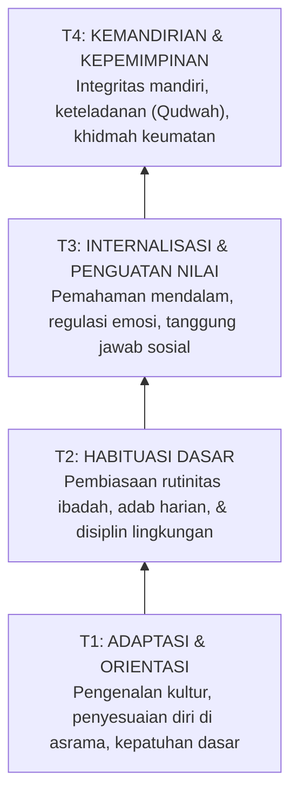

# P1-03-03-Landasan-Filosofis-Tangga-TUMBUH-T1-T4

## Tujuan
Merumuskan landasan filosofis dan konseptual di balik model bertahap **Tangga Perkembangan TUMBUH (T1, T2, T3, T4)** sebagai jalur pembinaan santri yang terukur, terarah, dan berkelanjutan.

---

## Filosofi Tahapan TUMBUH

Pertumbuhan karakter bukanlah peristiwa instan (*one-night transformation*), melainkan proses organik seperti tumbuhnya pohon: berawal dari benih yang dirawat, berakar kuat, bertumbuh tegak, dan menghasilkan buah kebermanfaatan (*QS. Ibrahim [14]: 24-25*).

---

## Rincian Filosofis Masing-Masing Tahap

### 1. Tahap T1 — Adaptasi & Orientasi (*Al-Ta'aruf wa Al-Ta'alluf*)
* **Fokus Utama**: Membangun rasa aman (*psychological safety*), orientasi nilai pesantren, dan adaptasi kehidupan komunal.
* **Peran Pembina**: Pengasuh yang menyambut dengan hangat, membimbing prosedur harian, dan meredakan kecemasan awal (*homesickness*).
* **Indikator**: Mampu mengikuti jadwal dasar, mengenal adab dasar asrama dan masjid.

### 2. Tahap T2 — Habituasi Dasar (*Al-I'tiyad wa Al-Muranaqah*)
* **Fokus Utama**: Pembentukan kebiasaan positif (*habit formation*) melalui rutinitas yang konsisten dan terstruktur.
* **Peran Pembina**: Pengawasan yang konsisten (*Tier 1 PBIS*), apresiasi perilaku positif, dan koreksi edukatif.
* **Indikator**: Sholat berjamaah tepat waktu tanpa disuruh berulang kali, menjaga kebersihan kamar, merapikan barang pribadi.

### 3. Tahap T3 — Internalisasi & Penguatan Nilai (*Al-Tafahhum wa Al-Tamassuk*)
* **Fokus Utama**: Menghubungkan amalan lahiriah dengan pemahaman batiniah (*why we do what we do*). Melatih kecerdasan emosional dan penyelesaian konflik.
* **Peran Pembina**: Fasilitator dialog, mentor diskusi reflektif, pembimbing konseling.
* **Indikator**: Mampu mengelola stres dan amarah, berempati kepada teman, aktif berkontribusi dalam kelompok/klub santri.

### 4. Tahap T4 — Kemandirian & Keteladanan (*Al-Istiqlaliyyah wa Al-Qudwah*)
* **Fokus Utama**: Santri telah mencapai tahap *Self-Regulation* penuh dan menjadi figur teladan (*Qudwah*) bagi adik kelasnya.
* **Peran Pembina**: Mitra pembimbing (*coach*), memberikan ruang kepemimpinan riil (OSIS, pengurus asrama, koordinator program).
* **Indikator**: Mengambil inisiatif kebaikan tanpa instruksi, memimpin dengan adab, menjadi teladan perilaku di segala situasi.
