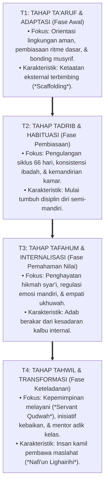

# P1-03-03: LANDASAN FILOSOFIS TANGGA TUMBUH (T1–T4)
## *Prinsip Tadarruj (Gradualisme Ilahiah), Trajektori Kemandirian Moral, dan Konstruksi Empat Etape Karakter*

**Nomor Identifikasi**: `P1-03-03/TANGGA-TUMBUH-T1-T4/2026`  
**Domain**: `01 Philosophy` > `03 Human Development`  
**Dewan Pakar**: `pakar-filosofi-tumbuh`, `pakar-desain-kurikulum-adab`, `pakar-arsitektur-pbis-restoratif`

---

## 📑 DAFTAR ISI ANALITIS

1. [1. Prinsip Tadarruj: Sunnatullah Perubahan Karakter](#1-prinsip-tadarruj-sunnatullah-perubahan-karakter)
2. [2. Arsitektur Empat Etape Tangga TUMBUH (T1–T4)](#2-arsitektur-empat-etape-tangga-tumbuh-t1t4)
3. [3. Progresi Tangga Menuju Tahap 7 Penggerak](#3-progresi-tangga-menuju-tahap-7-penggerak)
4. [4. Matriks Komparasi Indikator Capaian T1 s/d T4](#4-matriks-komparasi-indikator-capaian-t1-sd-t4)
5. [5. Implikasi bagi Sistem Evaluasi Non-Komparatif (Ipsatif)](#5-implikasi-bagi-sistem-evaluasi-non-komparatif-ipsatif)

---

### 1. Prinsip Tadarruj: Sunnatullah Perubahan Karakter

Perubahan akhlak manusia tidak pernah terjadi melalui lompatan kuantum yang instan, melainkan tunduk pada hukum alam penciptaan Allah: **Prinsip Tadarruj (التَّدَرُّجُ - Gradualisme Ilahiah)**. 

Bahkan syariat Islam yang agung diturunkan oleh Allah SWT kepada Rasulullah SAW secara berangsur-angsur selama 23 tahun; penetapan keharaman khamr melalui empat tahapan bertahap; dan perintah shalat diwajibkan secara bertingkat. Sayyidah Aisyah RA meriwayatkan:

> $$\text{إِنَّمَا نَزَلَ أَوَّلَ مَا نَزَلَ مِنْهُ سُورَةٌ مِنَ الْمُفَصَّلِ، فِيهَا ذِكْرُ الْجَنَّةِ وَالنَّارِ، حَتَّى إِذَا ثَابَ النَّاسُ إِلَى الْإِسْلَامِ نَزَلَ الْحَلَالُ وَالْحَرَامُ، وَلَوْ نَزَلَ أَوَّلَ شَيْءٍ: لَا تَشْرَبُوا الْخَمْرَ، لَقَالُوا: لَا نَدَعُ الْخَمْرَ أَبَدًا}$$
> 
> *"Sesungguhnya ayat yang pertama kali turun adalah surah-surah mufashshal yang di dalamnya disebutkan tentang surga dan neraka. Hingga Ketika manusia telah condong dan kokoh di dalam Islam, barulah turun ayat-ayat tentang halal dan haram. Sekiranya yang pertama kali turun adalah: 'Janganlah kalian meminum khamr!', niscaya mereka akan berkata: 'Kami tidak akan meninggalkan khamr selamanya!' "* (HR. Bukhari no. 4993).

Pesantren yang menuntut santri baru langsung memiliki adab sempurna tanpa melalui tahapan adaptasi yang manusiawi hakikatnya sedang melawan sunnatullah pembinaan itu sendiri.

---

### 2. Arsitektur Empat Etape Tangga TUMBUH (T1–T4)

Ekosistem TUMBUH merumuskan lintasan pertumbuhan karakter santri ke dalam **Tangga TUMBUH (T1–T4)**:

---

### 3. Progresi Tangga Menuju Tahap 7 Penggerak

Tangga T1–T4 ini selaras dengan **7 Tahap Kontinuum TUMBUH**:
* **Tahap 1–2 (Santri Baru & Beradaptasi)** $\rightarrow$ Memasuki Tangga **T1**.
* **Tahap 3–4 (Santri Pembelajar & Pengamal Mandiri)** $\rightarrow$ Menapaki Tangga **T2 & T3**.
* **Tahap 5–7 (Santri Teladan, Duta Adab, & Santri Penggerak)** $\rightarrow$ Meraih puncak Tangga **T4**.

Santri yang mencapai Tangga T4 (Tahap 7 Penggerak) tidak hanya mampu menjaga adab dirinya sendiri, melainkan bertindak sebagai **katalisator peradaban (*social change agent*)** yang mengayomi kamarnya, mendamaikan konflik antarsantri, dan meringankan beban para asatidz.

---

### 4. Matriks Komparasi Indikator Capaian T1 s/d T4

| Indikator Perilaku | Tangga T1 (Adaptasi) | Tangga T2 (Habituasi) | Tangga T3 (Internalisasi) | Tangga T4 (Transformasi) |
| :--- | :--- | :--- | :--- | :--- |
| **Kemandirian Ibadah** | Dibangunkan musyrif; hadir shalat berjamaah tepat waktu. | Bangun mandiri dengan alarm; mempersiapkan perlengkapan shalat. | Hadir awal di masjid untuk shalat sunnah rawatib dan tilawah mandiri. | Menjadi imam/muadzin; mengajak dan membangunkan rekan kamar dengan santun. |
| **Kebersihan & Kerapian** | Merapikan ranjang setelah diarahkan dan dicontohkan musyrif. | Rutin merapikan kasur dan lemari sesuai standar harian kamar. | Menjaga kebersihan area bersama (lorong, kamar mandi) tanpa disuruh. | Mengorganisasi kerja bakti asrama; merawat fasilitas umum pondok. |
| **Regulasi Emosi & Adab** | Membutuhkan bantuan pendampingan saat marah atau sedih (*co-regulation*). | Mampu menahan diri dari membalas ejekan; melaporkan masalah ke musyrif. | Mampu meredakan amarah sendiri (*self-regulation*) dan meminta maaf jika khilaf. | Menjadi juru damai (*Restorative Peer Mediator*) bagi rekan yang berselisih. |

---

### 5. Implikasi bagi Sistem Evaluasi Non-Komparatif (Ipsatif)

Tangga T1–T4 menjadi dasar dari **Asesmen Pertumbuhan Ipsatif**:
* Kemajuan santri diukur dari perbandingan antara posisinya hari ini dengan posisinya di masa lalu, bukan dibandingkan dengan santri lain.
* Setiap santri memiliki kecepatan tumbuh yang unik (*unique developmental trajectory*), sehingga apresiasi diberikan pada **usaha dan konsistensi proses perbaikan diri (*growth mindset*)**.
