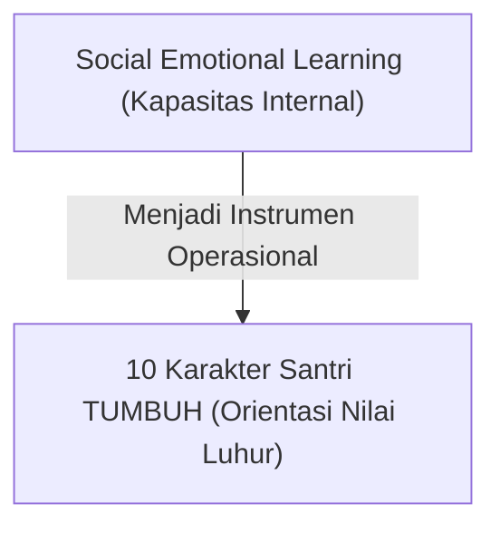

# P1-03-04-Integrasi-SEL-dan-Karakter-Santri

## Tujuan
Mengintegrasikan 5 Kompetensi Inti **Social Emotional Learning (CASEL)** dengan **10 Karakter Santri TUMBUH** yang berakar pada nilai-nilai Islam dan adab kepesantrenan.

---

## Rasional Integrasi

Karakter luhur tidak akan tegak tanpa adanya kecakapan sosial-emosional internal. Seorang santri mungkin menghafal dalil tentang adab dan akhlak, namun jika ia tidak memiliki keterampilan mengenali emosi marahnya (*Self-Awareness*) atau meregulasi impuls agresinya (*Self-Management*), maka nilai tersebut tidak termanifestasi dalam tindakan nyata di asrama.

Oleh karena itu, TUMBUH mendudukkan SEL bukan sebagai doktrin nilai sekuler, melainkan sebagai **perangkat keterampilan teknis psikologis** untuk mengoperasionalkan akhlak Islam.

---

## Matriks Integrasi SEL & Karakter Santri TUMBUH

| 5 Kompetensi CASEL | Makna & Definisi Teknis | Karakter Santri TUMBUH Terkait | Manifestasi Perilaku di Pesantren |
| :--- | :--- | :--- | :--- |
| **1. Self-Awareness** *(Kesadaran Diri)* | Mengenali emosi diri, kekuatan, kelemahan, serta motivasi batin. | **Muhasabah & Shidq (Kejujuran Batin)** | Santri jujur mengakui kesalahan, paham kapan dirinya merasa lelah/marah/sedih, dan menyadari niat ibadahnya. |
| **2. Self-Management** *(Pengelolaan Diri)* | Mengelola stres, mengendalikan impuls, dan mendisiplinkan diri mencapai tujuan. | **Mujahadatun Linafsih & Sabr** | Mampu menahan diri saat digoda teman, bangun subuh tepat waktu secara mandiri, fokus belajar/menghafal. |
| **3. Social Awareness** *(Kesadaran Sosial)* | Memahami perasaan orang lain (empati) dan menghormati norma kelompok. | **Ukhuwah, Mahabbah & Husnudzan** | Peka jika teman sekamar sakit/murung, menghargai perbedaan latar belakang santri, menjaga hak istirahat orang lain. |
| **4. Relationship Skills** *(Keterampilan Relasi)* | Berkomunikasi efektif, bekerja sama, menyelesaikan konflik secara damai. | **Adabul Mu'asyarah & Tawadhu'** | Berbicara sopan santun (*qaulan karima*), mampu musyawarah, menolak bullying, menyelesaikan friksi dengan dialog. |
| **5. Responsible Decision-Making** *(Pengambilan Keputusan)* | Memilih tindakan berdasarkan pertimbangan etika, syariat, dan dampak jangka panjang. | **Hikmah, Amanah & Wara'** | Memilih memanfaatkan waktu luang untuk hal bermanfaat, menolak ajakan melanggar aturan, sadar konsekuensi masa depan. |

---

## Prinsip Pengajaran SEL di Pesantren
1. **Diajarkan Secara Eksplisit (*Explicit Instruction*)**: Keterampilan emosi dan relasi dilatihkan melalui contoh konkret dan studi kasus, bukan diasumsikan "santri sudah paham sendiri".
2. **Diintegrasikan dalam Rutinitas Asrama**: Menjadi bahan evaluasi harian saat pertemuan kamar, halaqah mentoring, atau apel pagi.
3. **Keteladanan Pembina (Qudwah)**: Musyrif dan asatidz menunjukkan ketenangan (*hilm*) saat menghadapi santri yang emosional.
