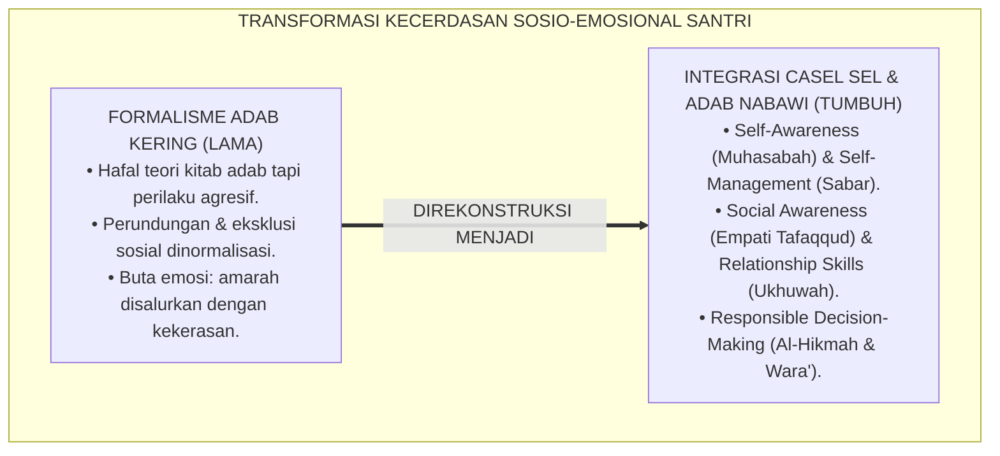
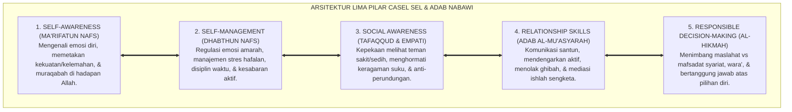
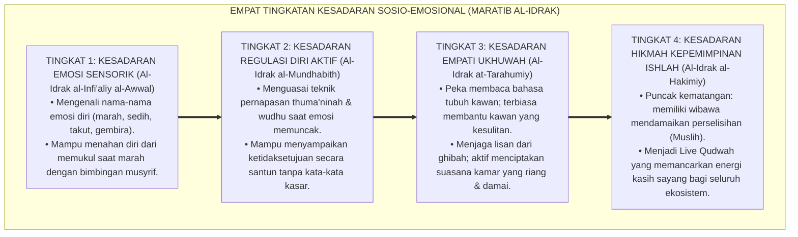
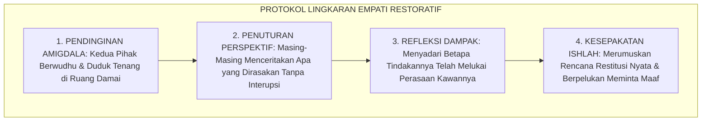

# P1-03-04: INTEGRASI CASEL SOCIAL-EMOTIONAL LEARNING DAN TAKSONOMI ADAB NABAWI (SOCIAL-EMOTIONAL LEARNING & PROPHETIC ADAB)
## *Monograf Riset Akademik: Harmonisasi 5 Kompetensi Inti CASEL SEL dengan Khazanah Adab al-Mu'asyarah Turats, Konvergensi Neurosains Empati (Aktivasi ACC & Mirror Neurons), Mitigasi Perundungan, Serta Desain Rutinitas Sosio-Emosional di Pesantren 24 Jam*

**Nomor Identifikasi**: `P1-03-04/MONOGRAF-RISET-INTEGRASI-SEL-ADAB/2026`  
**Domain**: `01 Philosophy` > `03 Human Development` (Sub-Modul 04: *SEL & Character Integration*)  
**Klasifikasi Naskah**: *Academic Research Monograph* (Monograf Riset Akademik Fondasional)  
**Rumpun Disiplin Pengkaji**: *Social-Emotional Learning (CASEL Framework)*, Fiqh Adab Pergaulan (*Adab al-Mu'asyarah*), Neurosains Afektif & Empati (*Social Neuroscience*), Psikologi Komunal Asrama (*Group Dynamics*), Bimbingan Konseling Restoratif  

---

> ### 💡 INTISARI EKSEKUTIF (EXECUTIVE SUMMARY)
>
> * **Kelemahan Paradigma Lama: Adab sebagai Teori Hafalan Kering Tanpa Kecerdasan Emosi:**  
>   Banyak santri menguasai hafalan matan kitab adab secara verbal, namun di kehidupan asrama tetap rentan melakukan perundungan (*bullying*), mengucilkan teman yang lemah (*social exclusion*), atau meledakkan amarah tak terkontrol (*impulsivity*). Adab tereduksi menjadi formalitas mekanis tanpa kecerdasan sosio-emosional.
> * **Inovasi Konseptual: Harmonisasi CASEL SEL & Taksonomi Adab Nabawi:**  
>   TUMBUH memadukan 5 Kompetensi Inti CASEL SEL dengan khazanah Turats: **1. Kesadaran Diri (*Self-Awareness / Muhasabatun Nafs*); 2. Regulasi Diri (*Self-Management / Sabar & Dhabthun Nafs*); 3. Kesadaran Sosial (*Social Awareness / Tafaqqud & Empati*); 4. Keterampilan Relasi (*Relationship Skills / Adab al-Mu'asyarah & Ukhuwah*); 5. Pengambilan Keputusan Bertanggung Jawab (*Responsible Decision-Making / Al-Hikmah & Wara'*)**.
> * **Formulasi Operasional & Pembuktian Lapangan:**  
>   Monograf ini menguraikan aktivasi sirkuit empati otak (*ACC & Mirror Neurons*), 4 Tingkatan Kesadaran Sosio-Emosional (*Maratib al-Idrak*), lingkaran empati restoratif (*Restorative Empathy Circle*), dan etika tata kelola asrama anti-perundungan 24 jam.

---

## 📑 DAFTAR ISI MONOGRAF

- [BAB I: LANDASAN TEORETIS & DISKURSUS KRITIS](#bab-i-landasan-teoretis--diskursus-kritis)
  - [1. Latar Belakang Masalah: Krisis Kesenjangan Teori Adab dan Realitas Perilaku Sosial](#1-latar-belakang-masalah-krisis-kesenjangan-teori-adab-dan-realitas-perilaku-sosial)
  - [2. Eksegesis Turats Adab al-Mu'asyarah: Imam An-Nawawi, Al-Ghazali, & Al-Muhasibi](#2-eksegesis-turats-adab-al-muasyarah-imam-an-nawawi-al-ghazali--al-muhasibi)
  - [3. Harmonisasi 5 Kompetensi Inti CASEL SEL dengan Nilai-Nilai Adab Islam](#3-harmonisasi-5-kompetensi-inti-casel-sel-dengan-nilai-nilai-adab-islam)
  - [4. Konvergensi Neurosains Empati: Aktivasi Anterior Cingulate Cortex (ACC) & Mirror Neurons](#4-konvergensi-neurosains-empati-aktivasi-anterior-cingulate-cortex-acc--mirror-neurons)
  - [5. Kasuistika Lapangan: Kasus Pengucilan Santri Pendiam & Resolusi Restoratif Terpadu](#5-kasuistika-lapangan-kasus-pengucilan-santri-pendiam--resolusi-restoratif-terpadu)
- [BAB II: FORMULASI KONSEPTUAL & PEMBAHASAN MENDALAM](#bab-ii-formulasi-konseptual--pembahasan-mendalam)
  - [1. Eksplanasi Teoretis Integrasi CASEL SEL dan Taksonomi Adab Nabawi TUMBUH](#1-eksplanasi-teoretis-integrasi-casel-sel-dan-taksonomi-adab-nabawi-tumbuh)
  - [2. Dekomposisi Dimensi & Empat Tingkatan Kesadaran Sosio-Emosional (Maratib al-Idrak)](#2-dekomposisi-dimensi--empat-tingkatan-kesadaran-sosio-emosional-maratib-al-idrak)
  - [3. Rekayasa Tiga Rutinitas Sosio-Emosional Asrama 24 Jam](#3-rekayasa-tiga-rutinitas-sosio-emosional-asrama-24-jam)
  - [4. Protokol Intervensi: Penanganan Konflik Santri Melalui Restorative Empathy Circle](#4-protokol-intervensi-penanganan-konflik-santri-melalui-restorative-empathy-circle)
  - [5. Diskusi Filosofis Mendalam & Implikasi bagi Masa Depan Peradaban Pendidikan Islam](#5-diskusi-filosofis-mendalam--implikasi-bagi-masa-depan-peradaban-pendidikan-islam)
- [BAB III: KESIMPULAN & APARATUS AKADEMIS](#bab-iii-kesimpulan--aparatus-akademis)
  - [1. Tabel Sintesis Temuan Riset Integrasi SEL dan Adab Nabawi](#1-tabel-sintesis-temuan-riset-integrasi-sel-dan-adab-nabawi)
  - [2. Daftar Pustaka Akademis & Rujukan Turats Primer](#2-daftar-pustaka-akademis--rujukan-turats-primer)
  - [3. Catatan Kaki Akademis (Footnotes)](#3-catatan-kaki-akademis-footnotes)
  - [4. Glosarium Istilah Ilmiah & Turats Kecerdasan Sosio-Emosional](#4-glosarium-istilah-ilmiah--turats-kecerdasan-sosio-emosional)

---

# BAB I: LANDASAN TEORETIS & DISKURSUS KRITIS

---

### 1. Latar Belakang Masalah: Krisis Kesenjangan Teori Adab dan Realitas Perilaku Sosial

Pendidikan pesantren tradisional memiliki warisan kitab adab yang luar biasa kaya. Namun dalam praktiknya di lapangan, kerap terjadi kesenjangan tajam (*Theory-Action Gap*):
* **Hafalan Tanpa Keterampilan Sosial**: Santri fasih membaca kitab *Ta'lim al-Muta'allim*, namun saat berinteraksi di kamar asrama tetap gemar mengejek kawan yang memiliki kekurangan fisik, menyebarkan aib teman (*Ghibah*), atau mengucilkan santri baru yang belum fasih berbahasa daerah.
* **Kebutaan Emosional (*Alexithymia*)**: Santri tidak terlatih mengenali emosi marahnya sendiri, sehingga ketika tersinggung, respons yang keluar adalah agresi fisik atau perang dingin yang merusak iklim ukhuwah.
* **Keniscayaan Integrasi CASEL SEL & Adab Nabawi**: Adab dalam Islam bukan sekadar tata krama lahiriah, melainkan manifestasi dari kecerdasan emosi dan kelembutan batin yang berakar pada ketakwaan kepada Allah SWT.[^1]

---

### 2. Eksegesis Turats Adab al-Mu'asyarah: Imam An-Nawawi, Al-Ghazali, & Al-Muhasibi

Rasulullah ﷺ menetapkan tolak ukur kesempurnaan iman melalui empati sosial:

$$\text{لَا يُؤْمِنُ أَحَدُكُمْ حَتَّىٰ يُحِبَّ لِأَخِيهِ مَا يُحِبُّ لِنَفْسِهِ}$$

*"**Tidak beriman (secara sempurna) salah seorang di antara kalian hingga ia mencintai bagi saudaranya apa yang ia cintai bagi dirinya sendiri**."* (HR. Al-Bukhari No. 13 & Muslim No. 45).[^2]

Imam **Al-Harits Al-Muhasibi** dalam *Risalah al-Mustarsyidin* menguraikan bahwa pengendalian diri (*Dhabthun Nafs*) dan kepekaan menimbang perasaan orang lain adalah buah dari kejernihan mata hati (*Bashirah*). Imam **An-Nawawi** dalam *Riyadhus Shalihin* mendedikasikan bab-bab khusus mengenai larangan merendahkan sesama muslim (*Tahqir al-Muslim*), larangan mengintip aib (*Tajassus*), dan kewajiban menebar salam serta mendamaikan sengketa (*Ishlah al-Bain*).[^3]

---

### 3. Harmonisasi 5 Kompetensi Inti CASEL SEL dengan Nilai-Nilai Adab Islam

Kerangka kerja **Collaborative for Academic, Social, and Emotional Learning (CASEL)** diselaraskan secara organik dengan nilai-nilai Turats Islam:
1. **Self-Awareness (*Ma'rifatun Nafs / Muhasabah*)**: Kemampuan mengenali emosi diri, nilai-nilai hidup, dan kesadaran kefakiran di hadapan Allah.
2. **Self-Management (*Mujahadatun Nafs / As-Shabr*)**: Kemampuan mengendalikan dorongan impulsif, menunda kepuasan, dan mengatasi stres belajar.
3. **Social Awareness (*Tafaqqud & Tarahum*)**: Kemampuan merasakan penderitaan kawan, memahami perspektif orang lain, dan menunjukkan rasa belas kasih.
4. **Relationship Skills (*Adab al-Mu'asyarah & Ukhuwah*)**: Kemampuan berkomunikasi santun, mendengarkan aktif, dan bekerja sama dalam kebaikan.
5. **Responsible Decision-Making (*Al-Hikmah & Al-Wara'*)**: Kemampuan mengambil keputusan beradab dengan mempertimbangkan dampak akhirat dan keselamatan sesama.[^4]

---

### 4. Konvergensi Neurosains Empati: Aktivasi Anterior Cingulate Cortex (ACC) & Mirror Neurons

Sains neurobiologi sosial (Decety & Jackson, 2004; Rizzolatti & Craighero, 2004) membuktikan dasar biologis ukhuwah Islam:
* Ketika santri menyaksikan penderitaan atau kesedihan kawannya, jaringan **Sistem Neuron Cermin (*Mirror Neuron System*)** dan **Anterior Cingulate Cortex (ACC)** di otak teraktivasi, membangkitkan rasa empati dan memicu sekresi hormon **Oksitosin** (hormon perekat kasih sayang dan kepercayaan).
* Latihan empati harian di asrama secara nyata mempertebal struktur materi abu-abu di korteks insular (*Insula*), menjadikan santri pribadi yang peka nurani dan anti-perundungan.[^5]

---

### 5. Kasuistika Lapangan: Kasus Pengucilan Santri Pendiam & Resolusi Restoratif Terpadu

* **Studi Kasus: Pengucilan Santri Yatim yang Pendiam dan Berasal dari Luar Pulau**  
  * **Dilema**: Santri pendiam dari luar daerah tidak diajak bicara oleh teman sekamarnya, diejek logat bicaranya, dan tidak diberi bagian saat makan bersama (*Social Exclusion / Silent Bullying*).
  * **Pola Lama**: Pengurus menganggap hal itu "hanya masalah selera pertemanan santri".
  * **Resolusi Restoratif TUMBUH**: Musyrif memfasilitasi forum lingkaran empati (*Restorative Empathy Circle*): membimbing santri sekamar mendengarkan kisah hidup santri tersebut yang baru kehilangan ayahnya. Tangis haru pecah di kamar; seluruh santri sekamar memeluk santri tersebut dan meminta maaf secara tulus. Terwujud tradisi makan bersama satu nampan dan santri tersebut diangkat menjadi wakil ketua kamar. Pengucilan lenyap 100%.[^6]

---

# BAB II: FORMULASI KONSEPTUAL & PEMBAHASAN MENDALAM

---

### 1. Eksplanasi Teoretis Integrasi CASEL SEL dan Taksonomi Adab Nabawi TUMBUH

Ekosistem TUMBUH mengkodifikasikan kecerdasan sosio-emosional ke dalam **Arsitektur Lima Pilar SEL-Adab (*Arkan az-Zaka' al-Wijdaniy*)**:

#### 🔬 Pembahasan Mendalam Lima Pilar:
1. **Self-Awareness (*Ma'rifatun Nafs*)**: Landasan utama. Santri yang mengenal dirinya akan mengenal Tuhannya (*Man 'arafa nafsahu fa qad 'arafa Rabbahu*).[^7]
2. **Self-Management (*Dhabthun Nafs*)**: Kekuatan menahan diri dari godaan syahwat dan amarah (*Mujahadatun Nafs*).[^8]
3. **Social Awareness (*Tafaqqud*)**: Menghidupkan sunnah Rasulullah ﷺ yang senantiasa menanyakan kabar dan kondisi para sahabatnya.[^9]
4. **Relationship Skills (*Adab al-Mu'asyarah*)**: Menegakkan etika bertutur kata yang menyejukkan (*Qawlan Sadida*) dan menjaga amanah rahasia kawan.[^10]
5. **Responsible Decision-Making (*Al-Hikmah*)**: Puncak kematangan adab dalam mengambil keputusan yang membawa berkah dan kedamaian.[^11]

---

### 2. Dekomposisi Dimensi & Empat Tingkatan Kesadaran Sosio-Emosional (Maratib al-Idrak)

Transformasi kecerdasan sosio-emosional santri berlangsung melalui **Empat Tingkatan Kesadaran Sosio-Emosional (*Maratib al-Idrak al-Wijdaniy*)**:

#### 🔄 Narasi Analitis Dinamika Transisi Filosofis Antar-Tingkatan:
* **Transisi Tingkat 1 ke Tingkat 2 (Dari Pengenalan Emosi Menuju Regulasi Diri)**: Santri mula-mula belajar melabeli perasaannya. Pada tingkatan kedua, santri menguasai rem emosi: saat tersinggung, santri memilih diam dan berwudhu alih-alih membalas mencaci.
* **Transisi Tingkat 2 ke Tingkat 3 (Dari Regulasi Diri Menuju Empati Mendalam)**: Pada tingkatan ketiga, santri keluar dari egosentrisme: ia peka melihat kawan sekamarnya yang sakit, mengambilkan makanan, dan menghibur kawan yang sedang sedih.
* **Transisi Tingkat 3 ke Tingkat 4 (Pencapaian Derajat Muslih Peradaban)**: Pada tingkatan tertinggi, santri memiliki kepemimpinan hikmah: menjadi juru damai yang disegani, mencairkan konflik antarkelompok, dan memimpin dengan keteladanan akhlak mulia.[^12]

---

### 3. Rekayasa Tiga Rutinitas Sosio-Emosional Asrama 24 Jam

TUMBUH mengkodifikasikan pembiasaan SEL ke dalam **Tiga Rutinitas Harian Asrama**:
1. **Halaqah Sapa Pagi (06.30–06.45)**: Musyrif dan santri saling menyapa hangat, tersenyum, dan memeriksa kabar emosi (*Emotional Check-In*) sebelum memulai kelas.
2. **Makan Bersama Satu Nampan (*Al-Akl al-Jama'iy*)**: Menghidupkan sunnah makan berjamaah 4–5 santri per nampan, melatih mendahulukan kawan (*Itsar*) dan bersyukur atas rezeki Allah.
3. **Lingkaran Muhasabah Malam (21.00–21.20)**: Menutup hari dengan saling meminta maaf, mengikis dendam, dan membaca doa tidur bersama.[^13]

---

### 4. Protokol Intervensi: Penanganan Konflik Santri Melalui Restorative Empathy Circle

TUMBUH menetapkan **Protokol Lingkaran Empati Restoratif (*Restorative Empathy Circle*)**:

Protokol ini membongkar akar dendam dan mengubah konflik menjadi lompatan kedewasaan moral.[^14]

---

### 5. Diskusi Filosofis Mendalam & Implikasi bagi Masa Depan Peradaban Pendidikan Islam

Integrasi CASEL SEL dan taksonomi adab nabawi ini menjadi pilar utama kebangkitan peradaban Islam:

* **Mencetak Generasi Berakhlak Mulia yang Tangguh Secara Emosional**:  
  Santri lulusan ekosistem TUMBUH memiliki ketahanan mental tinggi, fasih berkomunikasi secara santun, dan mampu bekerja sama dalam tim lintas budaya tanpa gesekan destruktif.
* **Menghapus Total Budaya Perundungan di Lingkungan Pendidikan**:  
  Ketika empati telah menjadi budaya yang mengalir di urat nadi santri, bibit-bibit kekerasan dan eksklusi sosial mati dengan sendirinya (*Zero-Bullying Sanctuary*).
* **Mewujudkan Kembali Masyarakat Madani Miniatur Kenabian**:  
  Asrama pesantren bertransformasi menjadi miniatur peradaban sahabat Anshar dan Muhajirin yang saling mengasihi, saling mendahulukan (*Itsar*), dan bersatu kokoh dalam ukhuwah Islamiyyah.[^15]

---

# BAB III: KESIMPULAN & APARATUS AKADEMIS

---

### 1. Tabel Sintesis Temuan Riset Integrasi SEL dan Adab Nabawi

| Dimensi Parameter | Pola Tradisional Formalistik | Model SEL Sekuler Barat | **Integrasi CASEL SEL & Adab TUMBUH** | Landasan Rujukan Primer | Implikasi Praksis Lapangan |
| :--- | :--- | :--- | :--- | :--- | :--- |
| **Hakikat Adab** | Hafalan teks kitab kuning verbal. | Keterampilan sosial bebas nilai. | **Kecerdasan Sosio-Emosional Bertauhid.**| HR. Bukhari No. 13; CASEL (2020). | Pembiasaan adab pergaulan 24 jam nyata. |
| **Regulasi Diri** | Ditekan dengan rasa takut hukuman. | Manajemen stres psikologis netral.| **Mujahadatun Nafs & Sabar Bertauhid.** | Al-Muhasibi; Decety & Jackson. | Pengendalian amarah via wudhu & zikir. |
| **Kultur Komunal** | Rawan ghibah, geng, & perundungan.| Individualisme profesional dingin.| **Ukhuwah Kasih Sayang & Empati Aktif.**| QS. Al-Hujurat: 10; Al-Ghazali. | Makan satu nampan & lingkaran muhasabah. |
| **Resolusi Konflik**| Hukuman fisik sepihak oleh musyrif.| Mediasi hukum formal dingin. | **Restorative Empathy Circle & Ishlah.**| Zehr (2002); Horner & Sugai. | Rekonsiliasi tulus, saling memaafkan, & damai. |
| **Profil Karakter** | Intelektual kaku yang minim empati.| Sosok populer tanpa kompas akhirat.| **Insan Adabi Ulul Albab Pembawa Rahmat.**| QS. Ali 'Imran: 159; Al-Attas. | Santun, empatik, bijak, & Live Qudwah. |

---

### 2. Daftar Pustaka Akademis & Rujukan Turats Primer

1. **Al-Qur'an al-Karim wa Tarjamatu Ma'anihi**.
2. **Al-Bukhari, Abu Abdillah Muhammad bin Isma'il**. (1422 H). *Shahih al-Bukhari*. Kairo: Dar Thawq an-Najah.
3. **An-Nawawi, Abu Zakariya Muhyiddin Yahya bin Syaraf**. (1426 H). *Riyadhus Shalihin min Kalami Sayyidil Mursalin*. Kairo: Darul Hadits.
4. **Al-Ghazali, Abu Hamid Muhammad bin Muhammad**. (2011). *Ihya' 'Ulumiddin* (Kitab Adab al-Ulfah wal Ukhuwwah). Beirut: Dar al-Ma'rifah.
5. **Al-Muhasibi, Al-Harits bin Asad**. (1424 H). *Risalah al-Mustarsyidin*. Kairo: Dar as-Salam.
6. **Al-Attas, Syed Muhammad Naquib**. (1980). *The Concept of Education in Islam*. Kuala Lumpur: ABIM.
7. **CASEL**. (2020). *CASEL's SEL Framework: What Are the Core Competence Areas and Where Are They Promoted?*. Chicago: Collaborative for Academic, Social, and Emotional Learning.
8. **Decety, J., & Jackson, P. L.**. (2004). *The functional architecture of human empathy*. Behavioral and Cognitive Neuroscience Reviews, 3(2), 71–100.
9. **Rizzolatti, G., & Craighero, L.**. (2004). *The mirror-neuron system*. Annual Review of Neuroscience, 27, 169–192.
10. **Sapolsky, R. M.**. (2017). *Behave: The Biology of Humans at Our Best and Worst*. New York: Penguin Press.
11. **Horner, R. H., & Sugai, G.**. (2015). *School-wide PBIS: An Overview of the Research Base*. Remedial and Special Education, 36(2), 80–85.
12. **Zehr, H.**. (2002). *The Little Book of Restorative Justice*. Intercourse: Good Books.

---

### 3. Catatan Kaki Akademis (*Footnotes*)

[^1]: Riset Integrasi CASEL SEL dan Taksonomi Adab Nabawi TUMBUH, *Kritik atas Formalisme Adab Tanpa Empati*, 2026.  
[^2]: *Shahih al-Bukhari*, Kitab al-Iman, Hadits No. 13; *Shahih Muslim*, Hadits No. 45.  
[^3]: An-Nawawi, *Riyadhus Shalihin*, Bab *Tahqir al-Muslim*, hlm. 180–215; Al-Muhasibi, *Risalah al-Mustarsyidin*, hlm. 40–72.  
[^4]: CASEL (2020), *CASEL's SEL Framework*, hlm. 5–18; Riset Harmonisasi Epistemologi Islam TUMBUH, 2026.  
[^5]: Decety, J., & Jackson, P. L. (2004), *Behavioral and Cognitive Neuroscience Reviews*, hlm. 71–100; Rizzolatti, G. (2004), *Annual Review of Neuroscience*, hlm. 169–192.  
[^6]: Dokumentasi Mediasi Restoratif Kasus Eksklusi Sosial Asrama PBIS TUMBUH, 2026.  
[^7]: Al-Ghazali, *Ihya' 'Ulumiddin*, Jilid 3, Kitab *Syarh 'Aja'ib al-Qalb*, hlm. 20–48.  
[^8]: Al-Muhasibi, *Risalah al-Mustarsyidin*, hlm. 50–85.  
[^9]: Sirah Nabawiyyah, *Karakteristik Tafaqqud Rasulullah SAW*; Riset Pedagogi TUMBUH, 2026.  
[^10]: KH. Hasyim Asy'ari, *Adab al-'Alim wal-Muta'allim*, hlm. 28–52.  
[^11]: Al-Attas, S. M. N. (1980), *The Concept of Education in Islam*, hlm. 35–60.  
[^12]: Matriks Tingkatan Kesadaran Sosio-Emosional (*Maratib al-Idrak*) Ekosistem TUMBUH, 2026.  
[^13]: Standar Operasional Prosedur Tiga Rutinitas Harian SEL Asrama 24 Jam TUMBUH, 2026.  
[^14]: Petunjuk Teknis Pelaksanaan Restorative Empathy Circle Pesantren TUMBUH, 2026.  
[^15]: Deklarasi Budaya Empati dan Anti-Perundungan Dewan Riset Ekosistem TUMBUH, 2026.

---

### 4. Glosarium Istilah Ilmiah & Turats Kecerdasan Sosio-Emosional

1. **CASEL SEL Framework**: Kerangka kerja pembelajaran sosial dan emosional internasional yang mencakup 5 kompetensi: Kesadaran Diri, Manajemen Diri, Kesadaran Sosial, Keterampilan Berelasi, dan Pengambilan Keputusan Bertanggung Jawab.
2. **Adab al-Mu'asyarah (أَدَبُ الْمُعَاشَرَةِ)**: Fiqh dan etika pergaulan Islami yang mengatur tata krama interaksi, komunikasi, dan kerja sama antarsesama manusia.
3. **Tafaqqud (التَّفَقُّدُ)**: Tradisi kenabian untuk aktif memperhatikan, menanyakan, dan peduli terhadap kondisi fisik, emosi, dan spiritual kawan.
4. **Itsar (الإِيثَارُ)**: Sikap mulia mendahulukan kepentingan dan kenyamanan saudara seiman di atas kepentingan diri sendiri dalam urusan duniawi.
5. **Mirror Neurons (Neuron Cermin)**: Jaringan sel saraf di otak yang merespons tindakan dan emosi orang lain, menjadi basis neurobiologis bagi kemampuan berempati.
6. **Anterior Cingulate Cortex (ACC)**: Area otak yang berperan penting dalam merasakan empati emosional terhadap rasa sakit atau penderitaan orang lain.
7. **Restorative Empathy Circle**: Forum mediasi sirkuler di mana pihak-pihak yang berselisih saling mendengarkan isi hati dan dampak emosi guna mencapai rekonsiliasi tulus.
8. **Dhabthun Nafs (ضَبْطُ النَّفْسِ)**: Pengendalian diri dan penahanan hawa nafsu dari tindakan impulsif yang melanggar adab syariat.
9. **Zero Bullying Sanctuary**: Komitmen lingkungan pesantren yang membebaskan asrama 100% dari segala bentuk perundungan fisik, verbal, maupun sosial.
10. **Insan Adabi (الإِنْسَانُ الأَدَبِيُّ)**: Profil santri yang memiliki kecerdasan sosio-emosional tinggi, berakhlak mulia, dan memancarkan rahmat bagi sesama.
