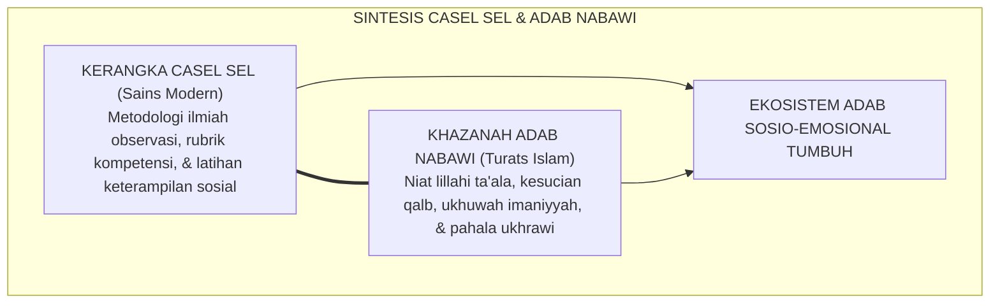
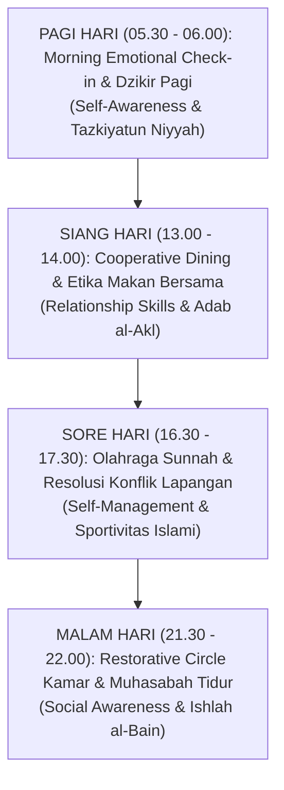

# P1-03-04: INTEGRASI SOCIAL-EMOTIONAL LEARNING (CASEL SEL) DENGAN TAKSONOMI ADAB NABAWI
## *Sintesis 5 Kompetensi Sosio-Emosional Global dengan Khazanah Akhlakul Karimah di Kehidupan Pesantren 24-Jam*

**Nomor Identifikasi**: `P1-03-04/INTEGRASI-SEL-ADAB/2026`  
**Domain**: `01 Philosophy` > `03 Human Development`  
**Dewan Pakar**: `pakar-social-emotional-learning`, `pakar-filosofi-tumbuh`, `pakar-desain-kurikulum-adab`

---

## 📑 DAFTAR ISI ANALITIS

1. [1. Urgensi Kecerdasan Sosio-Emosional di Kehidupan Berasrama](#1-urgensi-kecerdasan-sosio-emosional-di-kehidupan-berasrama)
2. [2. Kerangka Kerja CASEL SEL: 5 Kompetensi Inti](#2-kerangka-kerja-casel-sel-5-kompetensi-inti)
3. [3. Matriks Pemetaan Integratif: CASEL SEL vs Adab Turats Islam](#3-matriks-pemetaan-integratif-casel-sel-vs-adab-turats-islam)
4. [4. Praktik Integrasi SEL dalam Rutinitas 24-Jam Asrama](#4-praktik-integrasi-sel-dalam-rutinitas-24-jam-asrama)
5. [5. Dampak Neurobiologis Pembelajaran Sosio-Emosional Islami](#5-dampak-neurobiologis-pembelajaran-sosio-emosional-islami)

---

### 1. Urgensi Kecerdasan Sosio-Emosional di Kehidupan Berasrama

Tinggal bersama ratusan santri dari berbagai latar belakang budaya dalam ruang asrama selama 24 jam sehari adalah laboratorium sosial yang sangat menantang. Gesekan antarpribadi, perebutan fasilitas, kelelahan fisik, dan perbedaan temperamen dapat memicu konflik horizontal tatkala santri tidak memiliki **Kecerdasan Sosio-Emosional (*Social and Emotional Competence*)**.

Kajian internasional (*Collaborative for Academic, Social, and Emotional Learning / CASEL*, Durlak et al., 2011) membuktikan bahwa pendidikan karakter yang mengintegrasikan kompetensi sosio-emosional mampu menurunkan tingkat perundungan (*bullying*) hingga 40%, meningkatkan iklim keamanan sekolah, dan mendongkrak capaian akademik santri.

Ekosistem TUMBUH memadukan kerangka kerja saintifik CASEL SEL ini dengan khazanah **Adab Nabawi**, mentransformasikan teori psikologi modern menjadi laku spiritual yang sarat pahala ibadah.

---

### 2. Kerangka Kerja CASEL SEL: 5 Kompetensi Inti

CASEL (2020) merumuskan 5 kompetensi sosio-emosional fundamental manusia:
1. **Self-Awareness (Kesadaran Diri)**: Mengenali emosi, pikiran, nilai, dan pengaruhnya pada perilaku.
2. **Self-Management (Manajemen Diri)**: Mengelola emosi, mengendalikan impuls, dan memotivasi diri.
3. **Social Awareness (Kesadaran Sosial)**: Berempati dan memahami perspektif orang lain dari latar belakang beragam.
4. **Relationship Skills (Keterampilan Relasi)**: Membangun relasi sehat, berkomunikasi efektif, dan bekerja sama.
5. **Responsible Decision-Making (Pengambilan Keputusan Bertanggung Jawab)**: Mengambil pilihan etis berdasarkan norma sosial dan keselamatan.

---

### 3. Matriks Pemetaan Integratif: CASEL SEL vs Adab Turats Islam

| 5 Kompetensi CASEL SEL | Konsep Adab Turats Islam | Dalil Nash & Kitab Rujukan | Manifestasi Perilaku Santri di Asrama |
| :--- | :--- | :--- | :--- |
| **1. Self-Awareness** | **Muhasabatun Nafs & Ma'rifatun Nafs** | *"Hisablah diri kalian sebelum kalian dihisab"* (Umar bin Khattab RA; Al-Muhasibi, *Ar-Ri'ayah*). | Santri mengenali pemicu amarahnya dan mengakui kesalahannya dengan jujur. |
| **2. Self-Management** | **Mujahadatun Nafs & Shabr** | *"Bukanlah orang kuat itu yang menang gulat, melainkan yang mampu menguasai dirinya saat marah"* (HR. Bukhari). | Santri menahan diri dari membanting pintu atau memukul saat merasa kesal. |
| **3. Social Awareness** | **Ukhuwah, Mahabbah, & Ta'athuf** | *"Perumpamaan orang-orang mukmin dalam kasih sayang laksana satu tubuh"* (HR. Muslim). | Santri peka menolong rekan kamar yang sedang sakit atau bersedih. |
| **4. Relationship Skills** | **Adab al-Mu'asyarah & Husnul Khuluq** | *Adab al-Mu'asyarah* Imam An-Nawawi; *Bidayatul Hidayah* Al-Ghazali. | Santri berkomunikasi dengan bahasa santun, mendengarkan, dan berbagi tugas kamar. |
| **5. Responsible Decision-Making** | **Al-Hikmah & Wara'** | *"Tinggalkan yang meragukanmu menuju yang tidak meragukanmu"* (HR. Tirmidzi; *Al-Muwafaqat* Asy-Syathibi). | Santri menolak ajakan ghashab sandal dan memilih menaati aturan pondok. |

---

### 4. Praktik Integrasi SEL dalam Rutinitas 24-Jam Asrama

---

### 5. Dampak Neurobiologis Pembelajaran Sosio-Emosional Islami

Integrasi adab nabawi dengan latihan kompetensi SEL melatih sirkuit **Anterior Cingulate Cortex (ACC)** dan **Insula** di otak santri:
* Meningkatkan kapasitas empati afektif (*Theory of Mind*).
* Menurunkan reaktivitas impulsif amigdala hingga mencapai status ketenangan emosi (*Ventral Vagal Tone*).
* Menghasilkan lingkungan pesantren yang aman secara psikologis (*psychologically safe environment*), di mana setiap santri merasa diterima, dihargai, dan terlindungi dari kekerasan.
