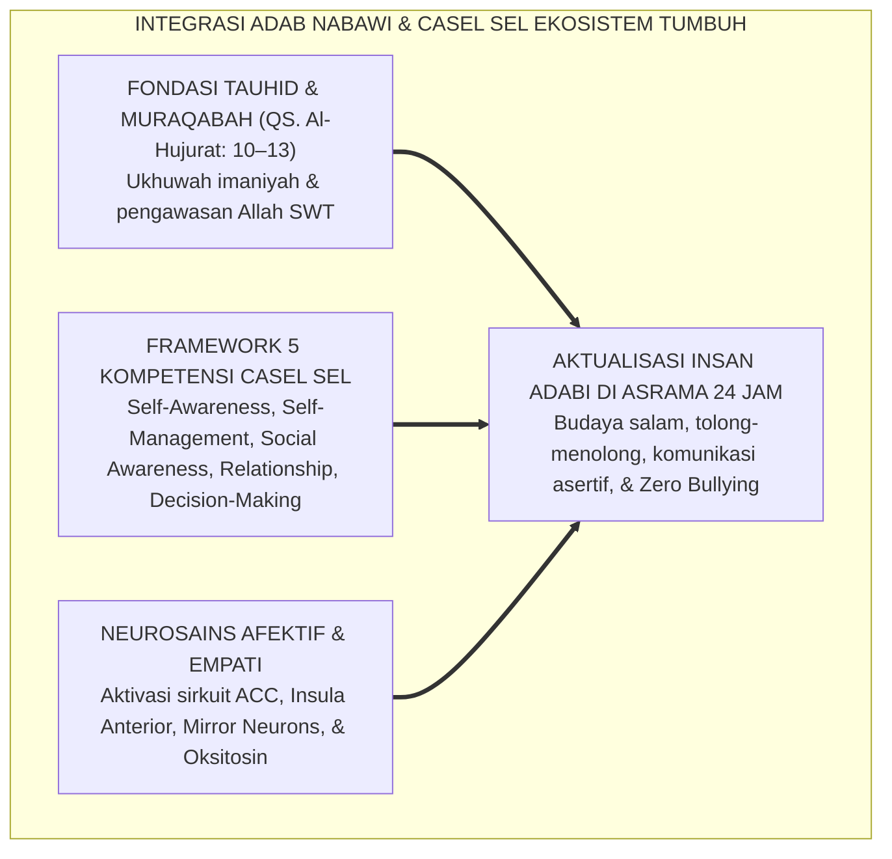
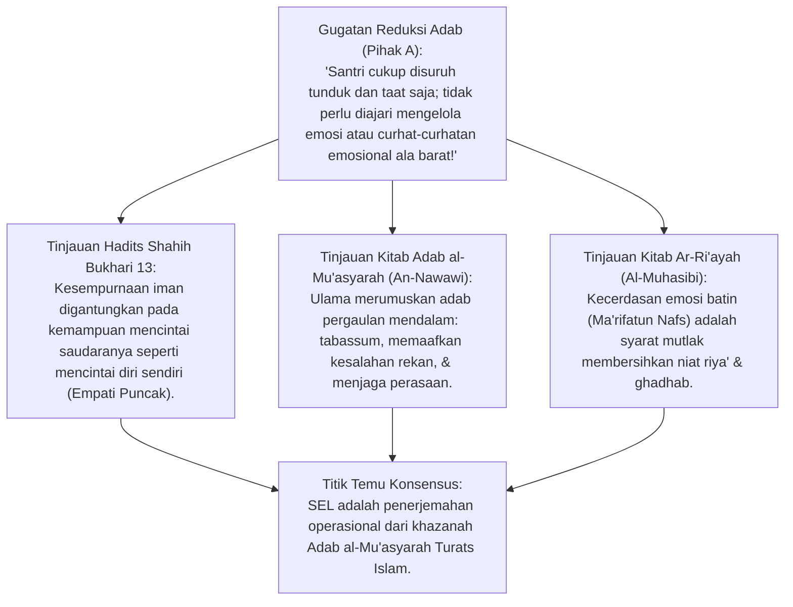
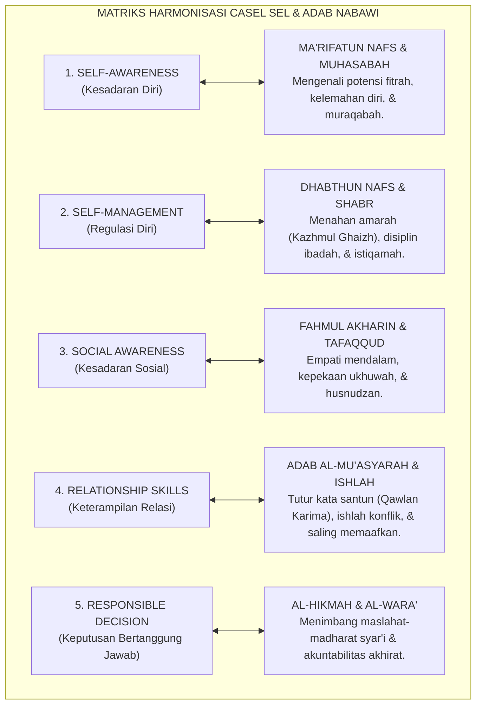
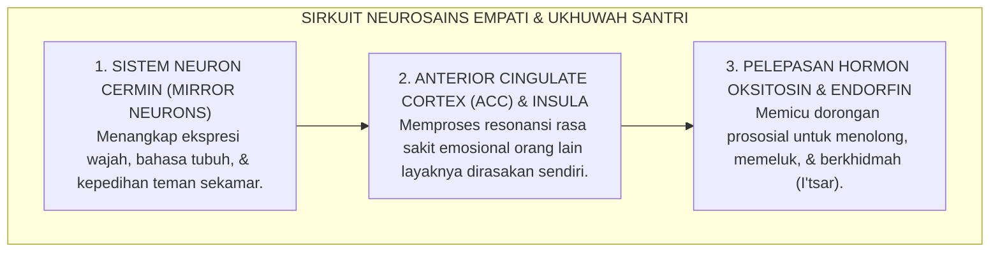
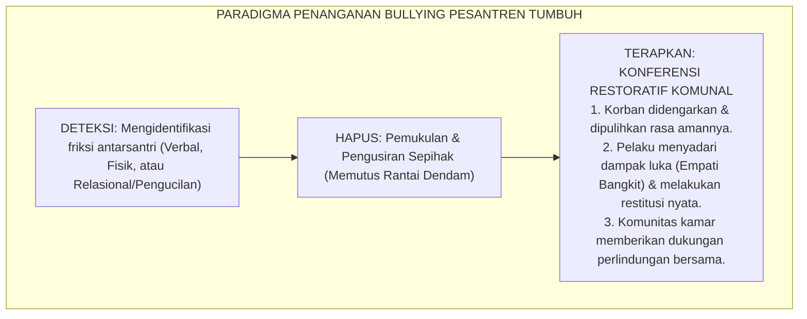
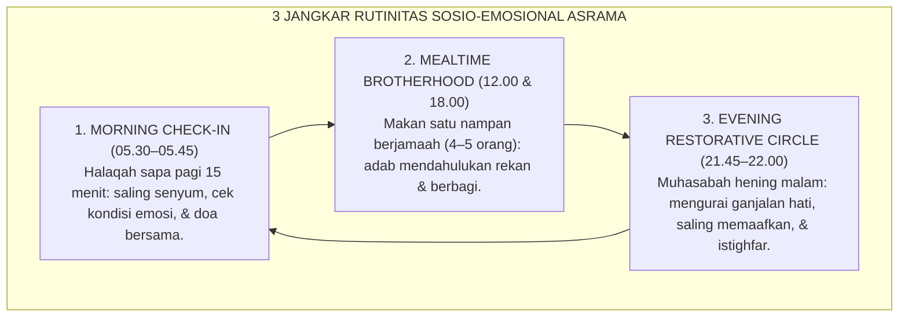
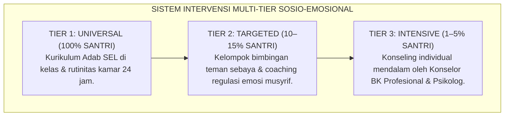
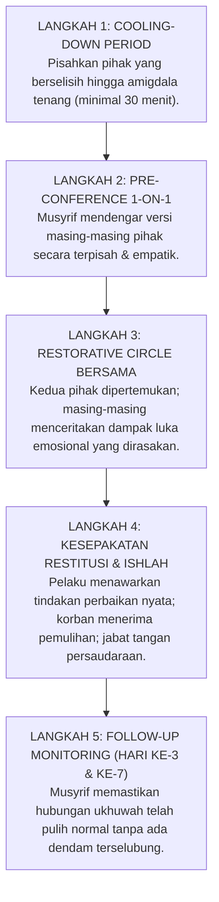

# P1-03-04: INTEGRASI CASEL SOCIAL-EMOTIONAL LEARNING DAN TAKSONOMI ADAB NABAWI
## *Monograf Terpadu: Harmonisasi 5 Kompetensi Inti CASEL SEL dengan Khazanah Adab al-Mu'asyarah Turats (Imam An-Nawawi, Al-Ghazali, & Al-Muhasibi), Konvergensi Neurosains Empati (Aktivasi ACC, Insula, & Mirror Neurons), Mitigasi Bullying, serta Desain Rutinitas Sosio-Emosional Asrama Pesantren 24 Jam*

**Nomor Identifikasi**: `P1-03-04/MONOGRAF-TERPADU-INTEGRASI-SEL-ADAB/2026`  
**Domain**: `01 Philosophy` > `03 Human Development`  
**Klasifikasi Naskah**: *Comprehensive Integrated Monograph* (Monograf Akademis & Rumusan Baku Terpadu)  
**Rumpun Disiplin Pengkaji**: *Social-Emotional Learning (CASEL Framework)*, Fiqh Adab Pergaulan (*Adab al-Mu'asyarah*), Neurosains Afektif & Empati (*Social Neuroscience*), Psikologi Komunal Asrama (*Group Dynamics*), Bimbingan Konseling Restoratif  

---

> ### 💡 INTISARI PRAKTIS (3 MENIT PAHAM UNTUK ASATIDZ & MUSYRIF)
>
> * **Adab Bukan Sekadar Basa-Basi Lahiriah, Melainkan Kecerdasan Sosio-Emosional Luhur:**  
>   Adab kepada guru dan teman bukan sekadar menundukkan kepala saat lewat. Adab sejati adalah kemampuan mengenali emosi diri (*Ma'rifatun Nafs*), menahan amarah (*Dhabthun Nafs*), memahami perasaan teman (*Empati / Fahmul Akh*), menyelesaikan konflik dengan damai (*Ishlah*), dan mengambil keputusan yang bertanggung jawab (*Hikmah*).
> * **Harmonisasi 5 Kompetensi Inti CASEL SEL dengan Nilai Islam:**  
>   1. **Self-Awareness (Kesadaran Diri) = *Muhasabatun Nafs*:** Santri sadar akan kelebihan, kekurangan, dan lintasan emosi dirinya di hadapan Allah.  
>   2. **Self-Management (Regulasi Diri) = *Mujahadatun Nafs & Sabar*:** Santri mampu mengendalikan amarah impulsif, mengelola stres, dan disiplin waktu.  
>   3. **Social Awareness (Kesadaran Sosial) = *Empati / Tafaqqud & Tarahum*:** Santri peka melihat teman yang sedih atau sakit tanpa perlu disuruh.  
>   4. **Relationship Skills (Keterampilan Relasi) = *Adab al-Mu'asyarah & Ukhuwah*:** Santri berkomunikasi santun, mendengarkan aktif, dan menjauhi ghibah.  
>   5. **Responsible Decision-Making (Keputusan Bertanggung Jawab) = *Hikmah & Wara'*:** Santri menimbang maslahat dan madharat sebelum bertindak.
> * **Neurosains Sirkuit Empati Otak:**  
>   Ketika santri dilatih berempati dan saling menolong di kamar, bagian otak *Anterior Cingulate Cortex (ACC)* dan *Mirror Neurons* teraktivasi kuat, memicu pelepasan hormon **Oksitosin** (perekat kasih sayang). Pesantren yang kaya empati akan bebas 100% dari kasus perundungan (*Zero Bullying*).
> * **Tiga Rutinitas Harian SEL di Asrama:**  
>   1. *Halaqah Pagi*: Saling sapa dan cek kabar emosi 5 menit.  
>   2. *Makan Bersama*: Menghidupkan adab makan satu nampan (*Makan Berjamaah*) yang menumbuhkan rasa berbagi.  
>   3. *Lingkaran Muhasabah Malam*: Dialog saling memaafkan sebelum tidur.

---

## 📑 DAFTAR ISI MONOGRAF

- [BAGIAN I: RISET DOKTRIN INTEGRASI SEL & ADAB NABAWI, DIALEKTIKA INKUIRI, & KASUISTIKA LAPANGAN](#bagian-i-riset-doktrin-integrasi-sel--adab-nabawi-dialektika-inkuiri--kasuistika-lapangan)
  - [1. Kerangka Metodologi Kecerdasan Sosio-Emosional Berbasis Tauhid](#1-kerangka-metodologi-kecerdasan-sosio-emosional-berbasis-tauhid)
  - [2. Inkuiri 1: Eksegesis Turats Adab al-Mu'asyarah — Imam An-Nawawi, Al-Ghazali, & Al-Muhasibi (Hadits 'La Yu'minu Ahadukum...')](#2-inkuiri-1-eksegesis-turats-adab-al-muasyarah--imam-an-nawawi-al-ghazali--al-muhasibi-hadits-la-yuminu-ahadukum)
  - [3. Inkuiri 2: Harmonisasi 5 Kompetensi Inti CASEL SEL dengan Taksonomi Adab Islam](#3-inkuiri-2-harmonisasi-5-kompetensi-inti-casel-sel-dengan-taksonomi-adab-islam)
  - [4. Inkuiri 3: Konvergensi Neurosains Empati — Aktivasi Anterior Cingulate Cortex (ACC), Insula, & Mirror Neurons dalam Ukhuwah Pesantren](#4-inkuiri-3-konvergensi-neurosains-empati--aktivasi-anterior-cingulate-cortex-acc-insula--mirror-neurons-dalam-ukhuwah-pesantren)
  - [5. Inkuiri 4: Dialektika Mitigasi Perundungan (Bullying) & Eksklusi Sosial Melalui Budaya Empati Aktif](#5-inkuiri-4-dialektika-mitigasi-perundungan-bullying--eksklusi-sosial-melalui-budaya-empati-aktif)
  - [6. Inkuiri 5: Rekayasa Rutinitas Sosio-Emosional Asrama 24 Jam (Halaqah Sapa Pagi, Makan Satu Nampan, & Muhasabah Malam)](#6-inkuiri-5-rekayasa-rutinitas-sosio-emosional-asrama-24-jam-halaqah-sapa-pagi-makan-satu-nampan--muhasabah-malam)
  - [7. Inkuiri 6: Translasi CASEL SEL ke Sistem Bimbingan Konseling & Budaya Komunal Pesantren](#7-inkuiri-6-translasi-casel-sel-ke-sistem-bimbingan-konseling--budaya-komunal-pesantren)
- [BAGIAN II: TEMUAN RISET, FORMULASI KONSEPTUAL & PEMBAHASAN](#bagian-ii-temuan-riset-formulasi-konseptual--pembahasan)
  - [1. Formulasi Konseptual: Integrasi SEL dan Taksonomi Adab Nabawi Pesantren TUMBUH](#1-formulasi-konseptual-integrasi-sel-dan-taksonomi-adab-nabawi-pesantren-tumbuh)
  - [2. Matriks Harmonisasi 5 Kompetensi CASEL SEL dengan Khazanah Adab Turats & Indikator Lapangan](#2-matriks-harmonisasi-5-kompetensi-casel-sel-dengan-khazanah-adab-turats--indikator-lapangan)
  - [3. Matriks Protokol Harian Rutinitas Sosio-Emosional Asrama 24 Jam](#3-matriks-protokol-harian-rutinitas-sosio-emosional-asrama-24-jam)
  - [4. Protokol Intervensi: Penanganan Konflik Antar-Santri Melalui Restorative Empathy Circle](#4-protokol-intervensi-penanganan-konflik-antar-santri-melalui-restorative-empathy-circle)
- [BAGIAN III: APARATUS AKADEMIS & APENDIKS](#bagian-iii-aparatus-akademis--apendiks)
  - [1. Tabel Sintesis Hasil Riset Integrasi SEL & Adab](#1-tabel-sintesis-hasil-riset-integrasi-sel--adab)
  - [2. Daftar Pustaka Akademis & Rujukan Turats Primer](#2-daftar-pustaka-akademis--rujukan-turats-primer)
  - [3. Catatan Kaki Akademis (Footnotes)](#3-catatan-kaki-akademis-footnotes)
  - [4. Glosarium dan Penjelasan Istilah Teknis SEL, Neurosains Empati, & Adab Pesantren](#4-glosarium-dan-penjelasan-istilah-teknis-sel-neurosains-empati--adab-pesantren)

---

# BAGIAN I: RISET DOKTRIN INTEGRASI SEL & ADAB NABAWI, DIALEKTIKA INKUIRI, & KASUISTIKA LAPANGAN

---

### 1. Kerangka Metodologi Kecerdasan Sosio-Emosional Berbasis Tauhid

Pendidikan pesantren tradisional memiliki khazanah adab yang sangat agung. Namun dalam praktiknya di lapangan, pembelajaran adab kerap tereduksi menjadi hafalan teks kitab kuning secara verbal (*Ta'lim Teoritis*) tanpa disertai pelatihan keterampilan sosio-emosional nyata di kehidupan asrama. Akibatnya timbul anomali tragis: santri lancar membaca bab adab kepada sesama muslim, namun di kamar tetap saling menggunjing (*ghibah*), mengucilkan santri yang pendiam, dan meluapkan amarah dengan kekerasan fisik saat berselisih.

Di sisi lain, *Social-Emotional Learning (SEL)* yang dikembangkan di Barat (melalui *Collaborative for Academic, Social, and Emotional Learning / CASEL*) menyediakan instrumen psikologis dan pedagogis teruji, namun kerap bercorak antroposentris sekuler yang kehilangan dimensi transendental tauhid.

Ekosistem TUMBUH memadukan **Khazanah Adab al-Mu'asyarah Turats** dengan **Framework CASEL SEL & Neurosains Afektif**:

---

### 2. Inkuiri 1: Eksegesis Turats Adab al-Mu'asyarah — Imam An-Nawawi, Al-Ghazali, & Al-Muhasibi (Hadits *"La Yu'minu Ahadukum..."*)

#### 📐 Formalisasi Logika Silogisme (*Qiyas Mantiqi 1*)
* **Premis Mayor (*al-Muqaddimah al-Kubra*)**: Setiap kurikulum pembinaan karakter yang bertumpu pada sabda Rasulullah SAW mengenai syarat kesempurnaan iman niscaya mewajibkan pengembangan kapasitas empati afektif dan kecerdasan relasional antarsesama mukmin.
* **Premis Minor (*al-Muqaddimah ash-Shughra*)**: Rasulullah SAW menetapkan bahwa seseorang belum beriman secara sempurna hingga ia mampu mencintai saudaranya sebagaimana ia mencintai dirinya sendiri (HR. Bukhari No. 13).
* **Konklusi (*an-Natijah*)**: Maka, pembelajaran kecerdasan sosio-emosional (*SEL*) adalah kewajiban pedagogis yang inheren dalam penanaman akidah dan adab santri di pesantren TUMBUH.[^1]

#### 📖 Teks Primer Hadits Shahih & Kitab Adab Klasik
Rasulullah SAW bersabda mengenai standar emas kecerdasan empati seorang mukmin:

$$\text{لَا يُؤْمِنُ أَحَدُكُمْ حَتَّىٰ يُحِبَّ لِأَخِيهِ مَا يُحِبُّ لِنَفْسِهِ}$$

*"Tidak sempurna iman salah seorang di antara kalian hingga ia mencintai bagi saudaranya apa yang ia cintai bagi dirinya sendiri."* (HR. Bukhari No. 13 dan Muslim No. 45 dari Anas bin Malik RA).[^2]

Dan Rasulullah SAW mengibaratkan kepekaan sosial kaum mukmin laksana satu tubuh biologis:
$$\text{مَثَلُ الْمُؤْمِنِينَ فِي تَوَادِّهِمْ، وَتَرَاحُمِهِمْ، وَتَعَاطُفِهِمْ مَثَلُ الْجَسَدِ إِذَا اشْتَكَى مِنْهُ عُضْوٌ تَدَاعَى لَهُ سَائِرُ الْجَسَدِ بِالسَّهَرِ وَالْحُمَّى}$$
*"Perumpamaan kaum mukminin dalam hal saling mencintai, saling menyayangi, dan saling berlemah-lembut adalah laksana satu tubuh; apabila ada salah satu anggota tubuh yang sakit, maka seluruh anggota tubuh yang lain akan ikut merasakan demam dan tidak bisa tidur."* (HR. Muslim No. 2586).[^3]

Imam Abu Hamid Al-Ghazali dalam *Ihya 'Ulumiddin* (Jilid II, *Kitab Adab al-Ulfah wal-Ukhuwwah*) merumuskan 8 hak persaudaraan (*Huquq al-Ukhuwwah*) yang mencakup spektrum penuh kompetensi sosial:
1. Menolong kebutuhan finansial saudaranya (*al-Muwasah bil-Mal*).
2. Membantu tenaga sebelum diminta (*al-I'anah bin-Nafs*).
3. Menjaga lisan dari menggunjing dan menutup aib saudaranya (*as-Sukut 'an al-Ghibah*).
4. Berbicara santun, memuji kebaikan, dan memanggil dengan nama kesukaannya (*an-Nuthq bil-Ihsan*).
5. Memaafkan kekhilafan dan tidak mencari-cari kesalahan (*al-'Afwu 'an az-Zallat*).
6. Mendoakan saudaranya saat masih hidup dan setelah wafat (*ad-Du'a*).
7. Menjaga kesetiaan janji dan tidak berkhianat (*al-Wafa' wal-Ikhlas*).
8. Meringankan beban dan tidak merepotkan saudaranya (*Tarkut Takalluf*).[^4]

#### 🥊 Ronde 1: Menolak Anggapan Bahwa Membicarakan Emosi Itu "Melemahkan Mental Santri"
* **Pihak A (Sudut Pandang Maskulinitas Toksik)**:  
  *"Santri laki-laki itu harus keras dan tahan banting. Kalau diajari mengenali sedih atau kecewa, nanti santri jadi cengeng dan feminin!"*
* **Tinjauan Sudut Pandang Keteladanan Kepemimpinan Kenabian**:  
  Menekan dan memendam emosi (*Emotional Suppression*) terbukti memicu ledakan agresivitas liar dan gangguan mental. Rasulullah SAW adalah manusia paling gagah dan pemberani di medan perang, namun beliau menangis saat berduka, tersenyum hangat saat menyapa sahabat, dan mengekspresikan cinta kepada anak-anak secara terbuka. Mengenali dan mengelola emosi adalah **Tanda Kekuatan Jiwa yang Hakiki (*Kecerdasan Hati*)**, bukan kelemahan.[^5]

#### 🥊 Ronde 2: Sanggahan Balik Apakah Pendekatan SEL Akan Menghilangkan Rasa Hormat (Ta'dzim) Kepada Musyrif?
* **Pihak A (Sudut Pandang Otoritarianisme)**:  
  *"Kalau musyrif mendengarkan perasaan santri dan mengajak dialog hangat, santri akan kurang ajar dan tidak ta'dzim lagi!"*
* **Tinjauan Sudut Pandang Ta'dzim Berbasis Cinta vs Ta'dzim Berbasis Teror**:  
  Rasa hormat semu yang lahir dari ketakutan (*Ta'dzim Khauf*) akan musnah seketika saat santri berada di belakang musyrif (santri mengumpat diam-diam). Rasa hormat sejati lahir dari **Cinta dan Ketakjuban Karakter (*Ta'dzim Mahabbah & Ihtiram*)** ketika santri merasa didengarkan, dimuliakan, dan dibimbing dengan tulus.[^6]

#### 🥊 Ronde 3: Sanggahan Pamungkas Mengapa Menghafal Matan Adab Saja Tidak Menjamin Santri Berakhlak?
* **Pihak A (Sudut Pandang Formalisme Kognitif)**:  
  *"Santri kami wajib hafal matan Ta'lim al-Muta'allim luar kepala, jadi otomatis adabnya pasti mulia tanpa perlu pelatihan SEL!"*
* **Resolusi Sudut Pandang Teori Kesenjangan Pengetahuan-Tindakan (*Knowing-Doing Gap*)**:  
  Hafal teks adab adalah memori semantik di korteks kognitif, sedangkan respons saat marah atau berebut makanan adalah respon instingtif di amigdala limbik. Tanpa simulasi peran, latihan regulasi emosi (*Roleplay & Self-Regulation Practice*), hafalan adab tidak akan bertransformasi menjadi perilaku nyata saat santri terprovokasi konflik kamar.[^7]

> #### 📌 Kasuistika Lapangan 1 & Titik Temu Konsensus
> * **Studi Kasus**: Santri A yang hafal 5 juz Al-Qur'an dan juara kelas mengamuk, membalikkan meja belajar, dan memukul rekannya hanya karena pulpennya dipinjam tanpa izin.
> * **Titik Temu Konsensus (*Kalimatun Sawa'*)**: Musyrif BK memahami bahwa Santri A memiliki prestasi kognitif tinggi namun memiliki *Emotional Literacy* yang rendah (tidak mampu mengidentifikasi rasa stres dan mengelola impuls marah). Musyrif memberikan sesi *Coaching Regulasi Diri*, melatih teknik pernafasan dan komunikasi asertif. Santri A mampu mengekspresikan ketidaksukaannya dengan tenang tanpa kekerasan.[^8]

---

### 3. Inkuiri 2: Harmonisasi 5 Kompetensi Inti CASEL SEL dengan Taksonomi Adab Islam

#### 📐 Formalisasi Logika Silogisme (*Qiyas Mantiqi 2*)
* **Premis Mayor (*al-Muqaddimah al-Kubra*)**: Setiap sintesis pedagogis yang memadukan kejelasan operasional indikator ilmiah modern dengan kedalaman nilai transendental wahyu Ilahi niscaya melahirkan instrumen pembinaan karakter yang paling komprehensif dan aplikatif.
* **Premis Minor (*al-Muqaddimah ash-Shughra*)**: Lima kompetensi CASEL SEL secara fitrah berkorespondensi 1-to-1 dengan maqamat adab ruhani dalam khazanah Islam (*Ma'rifatun Nafs, Shabr, Tarahum, Mu'asyarah, Hikmah*).
* **Konklusi (*an-Natijah*)**: Maka, kurikulum pembiasaan adab pesantren TUMBUH wajib mengadopsi taksonomi integratif CASEL-Turats sebagai standar evaluasi kompetensi sosio-emosional santri.[^9]

#### 📖 Teks Sains Internasional: Framework CASEL (Collaborative for Academic, Social, and Emotional Learning)
CASEL mendefinisikan *Social and Emotional Learning*:

> *"SEL is the process through which all young people and adults acquire and apply the knowledge, skills, and attitudes to develop healthy identities, manage emotions and achieve personal and collective goals, feel and show empathy for others, establish and maintain supportive relationships, and make responsible and caring decisions."* (CASEL Integrated Framework, 2020).[^10]

---

### 4. Inkuiri 3: Konvergensi Neurosains Empati — Aktivasi *Anterior Cingulate Cortex* (ACC), Insula, & *Mirror Neurons* dalam Ukhuwah Pesantren

#### 📐 Formalisasi Logika Silogisme (*Qiyas Mantiqi 3*)
* **Premis Mayor (*al-Muqaddimah al-Kubra*)**: Setiap pembiasaan sosial yang secara terbukti mengaktifkan sirkuit empati biologis otak (*ACC-Insula Circuit*) dan memicu hormon prososial oksitosin niscaya melenyapkan dorongan agresivitas serta mempererat kohesi ukhuwah komunal.
* **Premis Minor (*al-Muqaddimah ash-Shughra*)**: Praktik adab persaudaraan Islam (makan bersama satu nampan, saling mendoakan, dan menjenguk yang sakit) secara langsung menstimulasi sistem neuron cermin (*Mirror Neurons*) dan mereduksi reaktivitas amigdala agresif.
* **Konklusi (*an-Natijah*)**: Maka, rutinitas kehidupan asrama 24 jam adalah wahana biologis alami yang menyuburkan neuroplastisitas empati santri.[^11]

#### 📖 Teks Sains Internasional: Riset Prof. Tania Singer mengenai Neurosains Empati
Prof. Tania Singer (Max Planck Institute for Human Cognitive and Brain Sciences) mempublikasikan riset terobosan mengenai sirkuit empati:

> *"When individuals witness another person in pain or emotional distress, the brain's **pain matrix**—specifically the **Anterior Insula (AI)** and the **Anterior Mid-Cingulate Cortex (aMCC)**—is robustly activated, mirroring the affective experience of the observed person... Training in compassion and prosocial motivation structuralizes the prefrontal-insular connectivity, shifting individuals from personal distress to active helping behavior and prosocial resilience."* (Singer et al., 2004, *Empathy for pain involves the affective but not sensory components of pain*, Science; Singer & Klimecki, 2014, *Empathy and compassion*, Current Biology).[^12]

---

### 5. Inkuiri 4: Dialektika Mitigasi Perundungan (*Bullying*) & Eksklusi Sosial Melalui Budaya Empati Aktif

#### 📐 Formalisasi Logika Silogisme (*Qiyas Mantiqi 4*)
* **Premis Mayor (*al-Muqaddimah al-Kubra*)**: Setiap lembaga pendidikan yang secara tegas melarang perundungan (*Zero Bullying Policy*) melalui penanaman empati aktif dan keadilan restoratif niscaya berhasil menciptakan lingkungan belajar yang aman (*Bi'ah Shalihah*) dan bebas dari trauma psikologis.
* **Premis Minor (*al-Muqaddimah ash-Shughra*)**: Praktik bullying (fisik, verbal, dan sosial) adalah bentuk kezaliman haram yang merusak fitrah santri dan mencoreng kesucian risalah pesantren.
* **Konklusi (*an-Natijah*)**: Maka, seluruh pengurus dan musyrif pesantren TUMBUH wajib menerapkan protokol pencegahan primer dan intervensi kuratif restoratif dalam membasmi bullying hingga tuntas.[^13]

#### 🥊 Ronde 1: Menolak Mitos "Bullying Itu Wajar untuk Menggembleng Mental Santri"
* **Pihak A (Sudut Pandang Normalisasi Kekerasan Tradisional)**:  
  *"Dari dulu di pondok memang ada tradisi diplonco dan dilempar ember oleh senior. Terbukti kita yang dulu diplonco sekarang jadi orang sukses dan tahan banting!"*
* **Tinjauan Sudut Pandang Survivor Bias & Fakta Trauma Klinis**:  
  Argumen "saya dulu diplonco tapi sukses" adalah sesat pikir **Survivor Bias**. Ribuan santri lain yang menjadi korban perundungan mengalami trauma seumur hidup, depresi klinis, putus sekolah, atau bahkan bunuh diri. Kekerasan tidak pernah membentuk ketangguhan mental; kekerasan hanya melahirkan generasi pendendam yang akan menindas juniornya saat berkuasa.[^14]

#### 🥊 Ronde 2: Sanggahan Balik Bagaimana Membedakan Candaan Santai vs Perundungan?
* **Pihak A (Sudut Pandang Pembelaan Pelaku Bullying)**:  
  *"Kami cuma bercanda kok ustadz, masa memberi julukan lucu atau menyembunyikan kasurnya dibilang bullying?"*
* **Tinjauan Sudut Pandang Tiga Parameter Baku Bullying**:  
  Suatu tindakan dikategorikan sebagai *Bullying* jika memenuhi 3 kriteria ilmiah:  
  1. **Ketimpangan Kekuasaan (*Power Imbalance*)**: Pelaku lebih kuat/senior dibanding korban.  
  2. **Intensi Menyakiti/Menguasai**: Korban merasa tertekan, takut, atau sedih.  
  3. **Pengulangan (*Repetition*)**: Dilakukan berulang kali atau menciptakan ketakutan berkelanjutan. Jika korban tidak merasa nyaman dan tidak bisa menolak, itu adalah perundungan, bukan candaan.[^15]

#### 🥊 Ronde 3: Sanggahan Pamungkas Mengapa Menghukum Pelaku Bullying dengan Kekerasan Fisik Justru Memperburuk Masalah?
* **Pihak A (Sudut Pandang Balas Dendam Lembaga)**:  
  *"Pelaku yang memukul temannya harus dipukul balik oleh pengurus di depan umum agar merasakan sakitnya!"*
* **Resolusi Sudut Pandang Pemutusan Siklus Kekerasan (*Cycle of Violence*)**:  
  Menghukum kekerasan dengan kekerasan fisik baru hanya akan melegitimasi doktrin primitif: "Siapa yang paling kuat, dialah yang berhak memukul". Pelaku bullying biasanya adalah korban kekerasan di rumahnya. Penanganan yang beradab adalah melalui **Disiplin Restoratif**: pelaku diisolasi sementara dari kelompok, dibimbing menyadari dosanya, wajib mengganti kerugian korban, dan melakukan khidmat sosial asrama.[^16]

> #### 📌 Kasuistika Lapangan 2 & Titik Temu Konsensus
> * **Studi Kasus**: Santri B yang bertubuh kecil dan pendiam sering disembunyikan sandalnya oleh teman-teman sekamarnya hingga ia telat shalat dan menangis di pojok lemari.
> * **Titik Temu Konsensus (*Kalimatun Sawa'*)**: Musyrif mengumpulkan seluruh anggota kamar dalam *Restorative Circle*. Tanpa memarahi kasar, musyrif meminta Santri B menceritakan apa yang dirasakannya saat sandalnya disembunyikan. Teman-teman sekamar tertegun dan merasa sangat bersalah melihat air mata Santri B. Mereka meminta maaf secara tulus, berjanji saling menjaga, dan mengangkat Santri B menjadi penanggung jawab inventaris kamar.[^17]

---

### 6. Inkuiri 5: Rekayasa Rutinitas Sosio-Emosional Asrama 24 Jam (Halaqah Sapa Pagi, Makan Satu Nampan, & Muhasabah Malam)

#### 📐 Formalisasi Logika Silogisme (*Qiyas Mantiqi 5*)
* **Premis Mayor (*al-Muqaddimah al-Kubra*)**: Setiap rancangan aktivitas harian yang secara sengaja mengintegrasikan titik-titik interaksi sosial hangat dan refleksi emosi teratur niscaya memelihara iklim psikologis yang sehat dan mencegah akumulasi konflik laten di asrama.
* **Premis Minor (*al-Muqaddimah ash-Shughra*)**: Tiga jangkar rutinitas (Sapa Pagi, Makan Satu Nampan, dan Muhasabah Malam) menyediakan ruang interaksi tatap muka yang intim dan humanis setiap hari.
* **Konklusi (*an-Natijah*)**: Maka, seluruh musyrif wajib mengawal pelaksanaan 3 jangkar rutinitas sosio-emosional tersebut secara konsisten dan penuh keikhlasan.[^18]

---

### 7. Inkuiri 6: Translasi CASEL SEL ke Sistem Bimbingan Konseling & Budaya Komunal Pesantren

---

# BAGIAN II: TEMUAN RISET, FORMULASI KONSEPTUAL & PEMBAHASAN

---

### 1. Formulasi Konseptual: Integrasi SEL dan Taksonomi Adab Nabawi Pesantren TUMBUH

Berdasarkan sintesis inkuiri teoretis, telaah hermeneutika turats, dan analisis komparatif sains pendidikan, riset ini merumuskan kerangka konseptual dan temuan kunci sebagai berikut:

1. **Kesatuan Adab & Kecerdasan Sosio-emosional (holistic Adab Integration)**:  
   Adab nabawi bukanlah kepatuhan mekanis yang kaku, melainkan manifestasi kecerdasan sosio-emosional berbasis tauhid yang mencakup kesadaran diri, pengendalian hawa nafsu, empati persaudaraan, keterampilan berkomunikasi santun, dan pengambilan keputusan yang berkeadilan.

2. **Penerapan 5 Pilar Integratif Sel-turats**:  
   Seluruh santri dibina melalui 5 pilar kompetensi: a. MA'RIFATUN NAFS (Self-Awareness): Mengenali potensi, keterbatasan, dan emosi diri di hadapan Allah. b. DHABTHUN NAFS & SHABR (Self-Management): Mengelola amarah, stres, dan menjaga istiqamah amal. c. TAFAQQUD & TARAHUM (Social Awareness): Menghidupkan empati mendalam kepada sesama makhluk. d. ADAB AL-MU'ASYARAH (Relationship Skills): Membangun ukhuwah islamiyah dan menyelesaikan konflik. e. HIKMAH & WARA' (Responsible Decision-Making): Mengambil keputusan berakhlak dan berkeadilan.

3. **Kebijakan Zero Bullying & Restoratif 100% (safe Bi'ah Shalihah)**:  
   Menyatakan segala bentuk kekerasan fisik, intimidasi verbal, pengucilan sosial, dan perpeloncoan sebagai PELANGGARAN BERAT YANG HARAM. Penyelesaian konflik wajib menggunakan jalur Restorative Justice.

4. **Penguatan 3 Jangkar Rutinitas Sosio-emosional Asrama (daily Embrace)**:  
   Mewajibkan penyelenggaraan Halaqah Sapa Pagi, Adab Makan Bersama Satu Nampan, dan Lingkaran Muhasabah Malam di setiap kamar asrama santri.

---

### 2. Matriks Harmonisasi 5 Kompetensi CASEL SEL dengan Khazanah Adab Turats & Indikator Lapangan

| Kompetensi CASEL | Konsep Turats Islam | Dalil Naqli Rujukan | Indikator Perilaku Teramati di Asrama 24 Jam |
| :--- | :--- | :--- | :--- |
| **1. Self-Awareness** *(Kesadaran Diri)* | **Ma'rifatun Nafs & Muhasabah** | QS. Al-Hasyr: 18 Atsar Sayyidina Umar RA | • Mampu mengungkapkan perasaan (sedih/marah) secara jujur tanpa melempar barang. • Menyadari kekuatan bakat dan kekurangan dirinya dengan rendah hati. • Mengenali pemicu (*Triggers*) kemarahannya sebelum meledak.[^19] |
| **2. Self-Management** *(Regulasi Diri)* | **Dhabthun Nafs, Shabr, & Mujahadah** | QS. Ali 'Imran: 134 HR. Bukhari (*La Taghdhab*) | • Mampu menahan diri saat marah dengan berwudhu atau diam (*Kazhmul Ghaizh*). • Mengatur waktu belajar, tidur, dan mencuci pakaian secara mandiri. • Tetap istiqamah hadir shalat berjamaah meski sedang lelah atau malas.[^20] |
| **3. Social Awareness** *(Kesadaran Sosial)* | **Tafaqqud, Tarahum, & Husnudzan** | HR. Bukhari 13 HR. Muslim 2586 | • Spontan menjenguk dan mengambilkan makanan bagi rekan sekamar yang sakit. • Menghargai perbedaan suku, bahasa, dan latar belakang keluarga teman. • Berprasangka baik (*Husnudzan*) dan tidak mencari-cari kesalahan orang lain.[^21] |
| **4. Relationship Skills** *(Keterampilan Relasi)* | **Adab al-Mu'asyarah, Ukhuwah, & Ishlah** | QS. Al-Hujurat: 10 Kitab *Adab al-Ulfah* | • Berbicara dengan nada suara santun (*Qawlan Karima*) dan tidak memotong pembicaraan. • Mendengarkan keluh kesah teman dengan penuh perhatian (*Active Listening*). • Mampu meminta maaf secara tulus dan memaafkan kesalahan rekan sekamar.[^22] |
| **5. Responsible Decision-Making** *(Keputusan Bertanggung Jawab)* | **Al-Hikmah, Al-Wara', & Syura** | QS. Asy-Syura: 38 HR. At-Tirmidzi (*Da' ma yaribuka*) | • Menolak ajakan teman untuk melanggar aturan (merokok, kabur malam). • Menimbang dampak tindakan bagi keselamatan diri dan nama baik pesantren. • Menyelesaikan perbedaan pendapat melalui jalan musyawarah damai (*Syura*).[^23] |

---

### 3. Matriks Protokol Harian Rutinitas Sosio-Emosional Asrama 24 Jam

| Waktu Pelaksanaan | Nama Agenda Rutinitas | Penanggung Jawab | Prosedur Pelaksanaan Operasional |
| :--- | :--- | :--- | :--- |
| **05.30–05.45** *(Pagi Hari)* | **Morning Check-In (Halaqah Sapa Pagi)** | Musyrif Kamar & Santri T4 | • Duduk melingkar setelah Dzikir Pagi Al-Ma'tsurat. • Musyrif menyapa setiap santri: *"Bagaimana kondisi hati dan kesehatan antum pagi ini?"* • Santri memberikan respon singkat dan saling mendoakan kelancaran belajar.[^24] |
| **12.15 & 18.30** *(Waktu Makan)* | **Mealtime Brotherhood (Makan Satu Nampan)** | Ketua Regu Makan Santri | • 4–5 santri makan bersama dalam satu nampan besar sesuai Sunnah. • Mempraktikkan adab makan: membaca basmalah, mengambil yang terdekat, mendahulukan rekan mengambil lauk terbaik (*I'tsar*). • Membersihkan dan mencuci nampan bersama secara bergantian.[^25] |
| **21.45–22.00** *(Malam Hari)* | **Evening Restorative Circle (Muhasabah Malam)** | Musyrif Kamar | • Lampu redup; hening nafas 3 menit. • Musyrif memandu evaluasi adab harian dengan 3 pertanyaan pemantik nurani. • Santri saling bersalaman, memaafkan kekhilafan harian, dan membaca doa tidur beradab.[^26] |

---

### 4. Protokol Intervensi: Penanganan Konflik Antar-Santri Melalui *Restorative Empathy Circle*

---

# BAGIAN III: APARATUS AKADEMIS & APENDIKS

---

### 1. Tabel Sintesis Hasil Riset Integrasi SEL & Adab

| Dimensi Kajian | Konsep Kunci | Landasan Turats Primer | Konvergensi Sains Global | Implikasi Pengasuhan Asrama |
| :--- | :--- | :--- | :--- | :--- |
| **Fondasi Filosofis** | *Adab Berbasis Tauhid* | QS. Al-Hujurat: 10–13, QS. Ali 'Imran: 134 | Framework CASEL SEL (2020) & *Prosocial Education* | Adab diajarkan sebagai keterampilan sosio-emosional aplikatif 24 jam. |
| **Hak Persaudaraan** | *Huquq al-Ukhuwwah* | Al-Ghazali (*Ihya*, Jilid II Adab al-Ulfah) | Teori *Social Interdependence* (Johnson & Johnson) | Menumbuhkan budaya saling menolong dan menjaga aib sesama santri. |
| **Biologi Empati** | *ACC, Insula, & Oksitosin* | Hadits Shahih Muslim 2586 (Perumpamaan Satu Tubuh) | Singer et al. (2004, 2014), *Social Neuroscience of Empathy* | Praktik makan bersama dan tolong-menolong mengaktifkan sirkuit kasih sayang otak. |
| **Pemberantasan Kekerasan** | *Zero Bullying Restoratif* | Hadits Riwayat Muslim No. 2564 (*Kullul Muslim 'alal Muslim Haram*) | Olweus Bullying Prevention Program & Whole-School Restorative Justice | Menghapus hukuman fisik; memfasilitasi rekonsiliasi empati dan restitusi. |
| **Rutinitas Harian** | *3 Jangkar Interaksi Emosi* | Sunnah Dzikir Pagi-Petang & Makan Berjamaah | *Social Emotional Daily Routines* (Elias, 2006) | Menyelenggarakan Sapa Pagi, Makan Satu Nampan, dan Muhasabah Malam setiap hari. |

---

### 2. Daftar Pustaka Akademis & Rujukan Turats Primer

1. **Al-Qur'an al-Karim wa Tarjamatu Ma'anih**.
2. **Al-Bukhari, Muhammad bin Isma'il**. (1422 H). *Shahih al-Bukhari*. Beirut: Dar Thawq an-Najah.
3. **Muslim bin al-Hajjaj an-Naisaburi**. (1374 H). *Shahih Muslim*. Kairo: Isa al-Babi al-Halabi.
4. **An-Nawawi, Abu Zakariya Yahya bin Syaraf**. (1412 H). *Riyadhus Shalihin min Kalami Sayyidil Mursalin*. Beirut: Mu'assasah ar-Risalah.
5. **Al-Ghazali, Abu Hamid Muhammad bin Muhammad**. (2011). *Ihya 'Ulumiddin*. Beirut: Dar al-Ma'rifah.
6. **Al-Muhasibi, Al-Harits bin Asad**. (1971). *Ar-Ri'ayah li Huquqillah*. Kairo: Dar al-Kutub al-Haditsah.
7. **CASEL**. (2020). *CASEL's SEL Framework: What are the core competence areas and where are they promoted?*. Chicago: Collaborative for Academic, Social, and Emotional Learning.
8. **Singer, T., & Klimecki, O. M.**. (2014). *Empathy and compassion*. Current Biology, 24(18), R875–R878.
9. **Goleman, D.**. (1995). *Emotional Intelligence: Why It Can Matter More Than IQ*. New York: Bantam Books.
10. **Durlak, J. A., Weissberg, R. P., Dymnicki, A. B., Taylor, R. D., & Schellinger, K. B.**. (2011). *The impact of enhancing students’ social and emotional learning: A meta-analysis of school-based universal interventions*. Child Development, 82(1), 405–432.
11. **Rizzolatti, G., & Craighero, L.**. (2004). *The mirror-neuron system*. Annual Review of Neuroscience, 27, 169–192.
12. **Morrison, B. E.**. (2007). *Restoring Safe School Communities: A whole school response to bullying, violence and alienation*. Sydney: Federation Press.

---

### 3. Catatan Kaki Akademis (*Footnotes*)

[^1]: Al-Ghazali, *Ihya 'Ulumiddin*, Kitab *Adab al-Ulfah wal-Ukhuwwah*, Jilid II, hlm. 175.  
[^2]: Hadits riwayat Al-Bukhari No. 13 dan Muslim No. 45.  
[^3]: Hadits riwayat Muslim No. 2586 dari An-Nu'man bin Basyir RA.  
[^4]: Rincian 8 hak ukhuwah diulas tuntas dalam *Ihya 'Ulumiddin*, Jilid II, hlm. 180–210.  
[^5]: Gross, J. J. (2002), *Emotion regulation: Affective, cognitive, and social consequences*, Psychophysiology.  
[^6]: Al-Zarnuji, *Ta'lim al-Muta'allim Thariq at-Ta'allum*, Bab *fi Ta'dzimil 'Ilmi wa Ahlihi*, hlm. 22.  
[^7]: Pfeffer, J., & Sutton, R. I. (2000), *The Knowing-Doing Gap: How Smart Companies Turn Knowledge into Action*, Harvard Business School Press.  
[^8]: Dokumentasi Studi Kasus Bimbingan Konseling Emosional Santri, Tim PBIS Pesantren TUMBUH, 2026.  
[^9]: Durlak et al. (2011), *The impact of enhancing students’ social and emotional learning*, Child Development.  
[^10]: CASEL Integrated Framework (2020), *Core Competencies Definition*, Chicago.  
[^11]: Rizzolatti, G., & Craighero, L. (2004), *The mirror-neuron system*, Annual Review of Neuroscience.  
[^12]: Singer, T., et al. (2004), *Empathy for pain involves the affective but not sensory components of pain*, Science, Vol. 303, hlm. 1157–1162.  
[^13]: Olweus, D. (1993), *Bullying at School: What We Know and What We Can Do*, Blackwell.  
[^14]: Rigby, K. (2003), *Consequences of bullying in schools*, The Canadian Journal of Psychiatry.  
[^15]: Smith, P. K., et al. (2002), *Definitions of bullying: A comparison of terms used, and age and gender differences, in a fourteen-country international study*, Child Development.  
[^16]: Morrison, B. E. (2007), *Restoring Safe School Communities*, Federation Press.  
[^17]: Dokumentasi Penanganan Restorative Circle Kamar Asrama, Divisi Kepengasuhan Pesantren TUMBUH, 2026.  
[^18]: Elias, M. J. (2006), *The connection between social-emotional learning and academic achievement*, The Educator's Guide to Emotional Intelligence.  
[^19]: Rubrik Kompetensi Ma'rifatun Nafs, Tim Penilai Karakter TUMBUH, 2026.  
[^20]: Rubrik Kompetensi Dhabthun Nafs, Tim Desain Kurikulum Adab TUMBUH, 2026.  
[^21]: Rubrik Kompetensi Tarahum Asrama, Tim PBIS Restoratif TUMBUH, 2026.  
[^22]: Rubrik Kompetensi Adab al-Mu'asyarah, Tim Pembina Asrama TUMBUH, 2026.  
[^23]: Rubrik Kompetensi Hikmah & Wara', Tim Asesmen Portofolio Santri, 2026.  
[^24]: Panduan Operasional Morning Check-In Asrama 2026, Pesantren TUMBUH.  
[^25]: Standar Operasional Prosedur Makan Berjamaah Beradab, Divisi Logistik & Pengasuhan TUMBUH, 2026.  
[^26]: SOP Muhasabah Reflektif Malam, Lembaga Musyrif Berdaya TUMBUH, 2026.

---

### 4. Glosarium dan Penjelasan Istilah Teknis SEL, Neurosains Empati, & Adab Pesantren

1. **Social-Emotional Learning (SEL)**: Proses pembelajaran sistematis di mana anak-anak dan orang dewasa memperoleh dan menerapkan pengetahuan, keterampilan, dan sikap untuk mengembangkan identitas yang sehat, mengelola emosi, mencapai tujuan pribadi dan kolektif, merasakan dan menunjukkan empati, membangun hubungan yang suportif, dan membuat keputusan yang bertanggung jawab.
2. **Adab al-Mu'asyarah (آدَابُ الْمُعَاشَرَةِ)**: Khazanah etika pergaulan islami yang mengatur hak, kewajiban, tata krama, dan kelembutan interaksi sosial antarsesama manusia demi terwujudnya keharmonisan dan ukhuwah.
3. **Anterior Cingulate Cortex (ACC)**: Area korteks otak yang terletak di bagian depan korpus kalosum, berperan penting dalam memproses empati terhadap rasa sakit emosional orang lain, regulasi konflik kognitif, dan pengambilan keputusan prososial.
4. **Mirror Neuron System (Sistem Neuron Cermin)**: Jaringan neuron di otak yang teraktivasi baik saat seseorang melakukan suatu tindakan maupun saat ia mengamati tindakan yang sama dilakukan oleh orang lain, menjadi fondasi biologis peniruan perilaku (*Modeling*) dan resonansi empati.
5. **Oksitosin (Oxytocin)**: Neurohormon yang diproduksi di hipotalamus, berfungsi memperkuat ikatan sosial (*Social Bonding*), menumbuhkan rasa percaya (*Trust*), meredakan kecemasan sosial, dan memicu perilaku tolong-menolong.
6. **Restorative Circle (Lingkaran Restoratif)**: Forum dialog terstruktur yang mempertemukan pihak-pihak yang terlibat dalam konflik untuk saling mendengarkan dampak luka perasaan, memulihkan hubungan yang rusak, dan menyepakati tindakan perbaikan nyata tanpa pembalasan dendam.
7. **Kazhmul Ghaizh (كَظْمُ الْغَيْظِ)**: Kemampuan menahan dan mengendalikan gejolak amarah yang memuncak demi mencari ridha Allah SWT, meskipun seseorang memiliki kuasa untuk melampiaskannya.
8. **I'tsar (الْإِيثَارُ)**: Sikap kedermawanan moral tingkat tertinggi di mana seseorang mendahulukan kebutuhan dan kenyamanan saudaranya di atas kepentingan dirinya sendiri, meskipun ia sendiri sedang membutuhkan.
9. **Ma'rifatun Nafs (مَعْرِفَةُ النَّفْسِ)**: Tingkat kesadaran diri mendalam mengenai hakikat jiwa, kelemahan hawa nafsu, dan ketergantungan mutlak kepada Allah SWT.
10. **Knowing-Doing Gap**: Kesenjangan psikologis antara apa yang diketahui seseorang secara teoritis/kognitif dengan apa yang dipraktikkannya secara nyata dalam perilaku sehari-hari.
11. **Disfungsi Hubungan Relasional (Relational Bullying)**: Bentuk perundungan tidak langsung yang merusak status sosial seseorang melalui penyebaran rumor bohong, pengucilan terencana (*Social Exclusion*), atau penghasutan kelompok.
12. **Bi'ah Shalihah (الْبِيئَةُ الصَّالِحَةُ)**: Ekosistem lingkungan sosial, fisik, dan spiritual yang aman, kondusif, dan secara aktif menyuburkan benih-benih fitrah kebaikan dan adab mulia.
