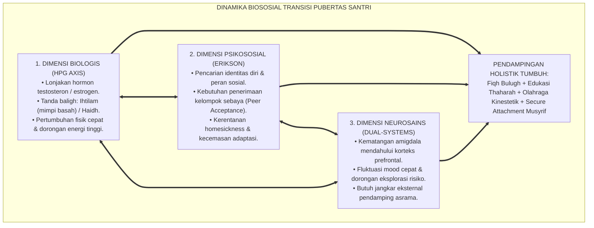
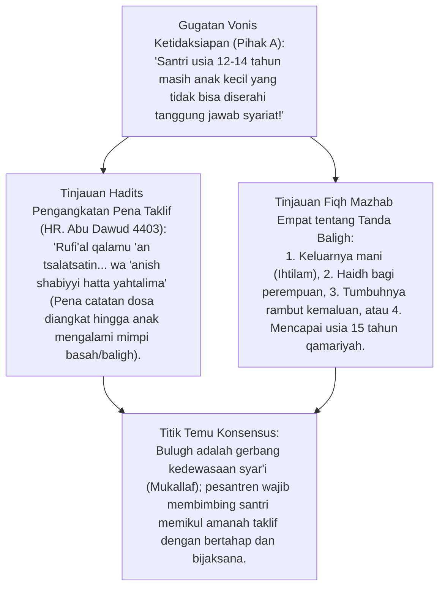
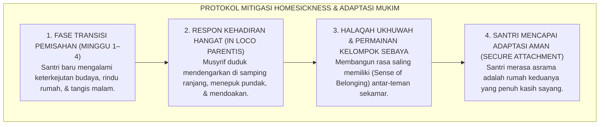
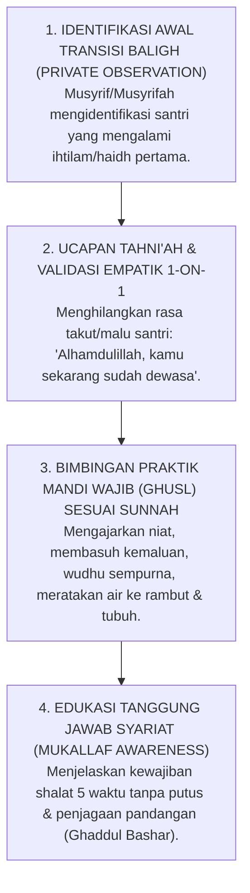

# P1-03-05: KRISIS BIOSOSIAL DAN TRANSISI PUBERTAS SANTRI
## *Monograf Terpadu: Epistemologi Fiqh Baligh & Taklif Syar'i, Neurosains Lonjakan Hormon Pubertas (Hypothalamic-Pituitary-Gonadal Axis), Krisis Identitas Erikson di Pesantren Asrama, Mitigasi Stres Adaptasi Mukim, dan Pendampingan Qudwah Musyrif*

**Nomor Identifikasi**: `P1-03-05/MONOGRAF-TERPADU-KRISIS-PUBERTAS-SANTRI/2026`  
**Domain**: `01 Philosophy` > `03 Human Development`  
**Klasifikasi Naskah**: *Comprehensive Integrated Monograph* (Monograf Akademis & Rumusan Baku Terpadu)  
**Rumpun Disiplin Pengkaji**: Neurosains Perkembangan Remaja (*Developmental Neuroscience*), Fiqh Bulugh & Ahkamut Taklif, Psikologi Perkembangan Erikson & Bronfenbrenner, Pengasuhan Asrama Pesantren (*Dormitory In Loco Parentis*)  

---

> ### 💡 INTISARI PRAKTIS (3 MENIT PAHAM UNTUK ASATIDZ & MUSYRIF)
>
> * **Pubertas (*Bulugh*) Adalah Transformasi Syar'i & Biologis Terbesar Santri:**  
>   Usia 11–16 tahun di pesantren adalah masa badai biologis dan emosional. Lonjakan hormon testosteron/estrogen dan pematangan pesat kelenjar seksual (*HPG Axis*) mengubah santri dari anak-anak menjadi *Mukallaf* (pemikul tanggung jawab hukum syariat).
> * **Krisis Identitas & Beban Adaptasi Asrama 24 Jam:**  
>   Santri remaja menghadapi beban ganda: (1) Menemukan jati diri (*Identity vs Role Confusion*), dan (2) Beradaptasi jauh dari dekapan orang tua (*Homesickness* & stres komunal).
> * **Peran Musyrif: Bukan Hakim Penghukum, Melainkan Jangkar Penenang (*Emotional Anchor*):**  
>   Saat santri mengalami gejolak emosi atau kebingungan tanda baligh (mimpi basah/haid pertama), musyrif wajib mendampingi dengan bimbingan fiqh thaharah yang santun, memvalidasi perasaannya, dan membimbing penyaluran energi melalui olahraga dan ibadah.

---

## 📑 DAFTAR ISI MONOGRAF

- [BAGIAN I: RISET BIOSOSIAL PUBERTAS SANTRI, DIALEKTIKA INKUIRI, & KASUISTIKA LAPANGAN](#bagian-i-riset-biososial-pubertas-santri-dialektika-inkuiri--kasuistika-lapangan)
  - [1. Kerangka Metodologi Biososial: Memahami Gejolak Transisi Baligh di Lingkungan Asrama 24 Jam](#1-kerangka-metodologi-biososial-memahami-gejolak-transisi-baligh-di-lingkungan-asrama-24-jam)
  - [2. Inkuiri 1: Eksegesis Turats Fiqh Bulugh & Titik Tolak Taklif Syar'i (HR. Abu Dawud No. 4403)](#2-inkuiri-1-eksegesis-turats-fiqh-bulugh--titik-tolak-taklif-syari-hr-abu-dawud-no-4403)
  - [3. Inkuiri 2: Konvergensi Neurosains Endokrin (Aktivasi HPG Axis & Reorganisasi Sinapsis Otak)](#3-inkuiri-2-konvergensi-neurosains-endokrin-aktivasi-hpg-axis--reorganisasi-sinapsis-otak)
  - [4. Inkuiri 3: Psikososial Erik Erikson di Asrama: Resolusi Krisis Identitas Melalui Ukhuwah](#4-inkuiri-3-psikososial-erik-erikson-di-asrama-resolusi-krisis-identitas-melalui-ukhuwah)
  - [5. Inkuiri 4: Mitigasi Homesickness & Stres Komunal Santri Baru Melalui Secure Attachment In Loco Parentis](#5-inkuiri-4-mitigasi-homesickness--stres-komunal-santri-baru-melalui-secure-attachment-in-loco-parentis)
  - [6. Inkuiri 5: Silogisme Logika, Dialektika 3 Ronde, Kasuistika Asrama, & Titik Temu Konsensus](#6-inkuiri-5-silogisme-logika-dialektika-3-ronde-kasuistika-asrama--titik-temu-konsensus)
- [BAGIAN II: KODIFIKASI BAKU HASIL RISET & KESIMPULAN FORMAL](#bagian-ii-kodifikasi-baku-hasil-riset--kesimpulan-formal)
  - [1. Deklarasi Doktrin Baku: Hakikat Transisi Baligh dan Pendampingan Biososial Santri TUMBUH](#1-deklarasi-doktrin-baku-hakikat-transisi-baligh-dan-pendampingan-biososial-santri-tumbuh)
  - [2. Matriks Integrasi Tahap Baligh, Perubahan Biologis-Emosi, & Intervensi Musyrif Asrama](#2-matriks-integrasi-tahap-baligh-perubahan-biologis-emosi--intervensi-musyrif-asrama)
  - [3. Protokol Edukasi Baligh & Thaharah Pertama Santri (SOP Pendampingan Ihtilam & Haidh)](#3-protokol-edukasi-baligh--thaharah-pertama-santri-sop-pendampingan-ihtilam--haidh)
- [BAGIAN III: APARATUS AKADEMIS & APENDIKS](#bagian-iii-aparatus-akademis--apendiks)
  - [1. Tabel Sintesis Hasil Riset Krisis Biososial & Transisi Pubertas](#1-tabel-sintesis-hasil-riset-krisis-biososial--transisi-pubertas)
  - [2. Daftar Pustaka Akademis & Rujukan Turats Primer](#2-daftar-pustaka-akademis--rujukan-turats-primer)
  - [3. Catatan Kaki Akademis (Footnotes)](#3-catatan-kaki-akademis-footnotes)
  - [4. Glosarium Teknis Fiqh Bulugh, HPG Axis, & Krisis Identitas](#4-glosarium-teknis-fiqh-bulugh-hpg-axis--krisis-identitas)

---

# BAGIAN I: RISET BIOSOSIAL PUBERTAS SANTRI, DIALEKTIKA INKUIRI, & KASUISTIKA LAPANGAN

---

### 1. Kerangka Metodologi Biososial: Memahami Gejolak Transisi Baligh di Lingkungan Asrama 24 Jam

Masa remaja (*Murahaqah*) di pesantren adalah fase krusial di mana santri mengalami **Ledakan Perkembangan Multi-Dimensi (*Developmental Surge*)**:
* Secara biologis, terjadi lonjakan hormon reproduksi dan akselerasi pertumbuhan fisik (*Adolescent Growth Spurt*).
* Secara neurologis, amigdala dan sistem pencari sensasi berkembang pesat, sementara kendali kognitif korteks prefrontal masih dalam proses penyempurnaan mielinasi.
* Secara psikososial, santri harus berpisah dari kenyamanan keluarga rumah dan hidup mandiri bersama puluhan teman sebaya di asrama.

Mengabaikan realitas biologis dan psikologis ini akan menyebabkan pengasuh salah mendiagnosis kegelisahan wajar pubertas sebagai "pemberontakan moral". Pendidik TUMBUH memadukan **Fiqh Bulugh** dengan **Neurosains Perkembangan** untuk memberikan pendampingan yang penuh kasih sayang dan terukur.



---

### 2. Inkuiri 1: Eksegesis Turats Fiqh Bulugh & Titik Tolak Taklif Syar'i (HR. Abu Dawud No. 4403)



#### 📐 Formalisasi Logika Silogisme (*Qiyas Mantiqi 1*)
* **Premis Mayor (*al-Muqaddimah al-Kubra*)**: Setiap insan yang telah mencapai tanda baligh biologis dinyatakan oleh syariat Islam sebagai mukallaf yang bertanggung jawab penuh atas amal perbuatannya di hadapan Allah SWT.
* **Premis Minor (*al-Muqaddimah ash-Shughra*)**: Santri tingkat wustha/SMP berada tepat pada episentrum transisi *Ihtilam* dan *Haidh*.
* **Konklusi (*an-Natijah*)**: Maka, pesantren TUMBUH wajib menyusun kurikulum transisi baligh (*Fiqh al-Bulugh*) yang membimbing santri menyucikan diri dan memikul kewajiban syariat dengan bangga dan bahagia.[^1]

#### 📖 Teks Primer Hadits: Hadits Pengangkatan Pena Catatan
Dari Ali bin Abi Thalib dan Aisyah *radhiyallahu 'anhuma*, Rasulullah SAW bersabda:

$$\text{رُفِعَ الْقَلَمُ عَنْ ثَلَاثَةٍ: عَنِ النَّائِمِ حَتَّى يَسْتَيْقِظَ، وَعَنِ الصَّبِيِّ حَتَّى يَحْتَلِمَ، وَعَنِ الْمَجْنُونِ حَتَّى يَعْقِلَ}$$

*"**Diangkat pena (catatan amal/dosa) dari tiga golongan**: (1) Dari orang yang tidur hingga ia bangun, **(2) Dari anak kecil hingga ia bermimpi basah (baligh)**, dan (3) Dari orang gila hingga ia berakal."* (HR. Abu Dawud No. 4403; Tirmidzi No. 1423; Ibnu Majah No. 2041).[^2]

---

### 3. Inkuiri 2: Konvergensi Neurosains Endokrin (*Aktivasi HPG Axis & Reorganisasi Sinapsis Otak*)

Pada fase pubertas, kelenjar hipotalamus melepaskan hormon GnRH (*Gonadotropin-Releasing Hormone*) yang memicu kelenjar pituitari dan gonad memproduksi **Testosteron** pada santri putra dan **Estrogen/Progesteron** pada santri putri. Lonjakan endokrin ini berinteraksi langsung dengan reseptor di otak limbik:
* Meningkatkan sensitivitas terhadap penghargaan sosial (*Social Reward*) dan validasi teman sebaya.
* Memicu proses pemangkasan sinapsis (*Synaptic Pruning*) dan mielinasi di korteks prefrontal.
* Oleh karena itu, kegelisahan motorik santri pubertas bukanlah "kenakalan", melainkan kebutuhan biologis untuk bergerak dan beraktivitas kinestetik.[^3]

---

### 4. Inkuiri 3: Psikososial Erik Erikson di Asrama: Resolusi Krisis Identitas Melalui Ukhuwah

Teori perkembangan psikososial Erik Erikson menetapkan bahwa masa remaja adalah panggung **Krisis Identitas vs Kebingungan Peran (*Identity vs Role Confusion*)**:
* Santri asrama bertanya pada dirinya: *"Siapakah aku? Apa tujuanku mondok? Apakah aku diterima oleh teman-temanku?"*
* Jika iklim asrama diwarnai perundungan dan feodalisme senior, santri akan mengalami disorientasi peran, menjadi penindas baru, atau menarik diri dalam depresi.
* Sebaliknya, jika asrama dipenuhi budaya **Ukhuwah Islamiyyah, Apresiasi Bakat Unik, dan Keteladanan Qudwah**, santri berhasil membangun identitas diri yang kokoh sebagai **Insan Pembelajar Beradab**.[^4]

---

### 5. Inkuiri 4: Mitigasi Homesickness & Stres Komunal Santri Baru Melalui *Secure Attachment In Loco Parentis*



---

### 6. Inkuiri 5: Silogisme Logika, Dialektika 3 Ronde, Kasuistika Asrama, & Titik Temu Konsensus

#### 🥊 Ronde 1: Menolak Anggapan Bahwa "Pembahasan Mimpi Basah dan Haidh Itu Tabu Dibicarakan di Pesantren"
* **Pihak A (Sudut Pandang Tabu Kultural)**:  
  *"Membicarakan mimpi basah dan haidh itu saru dan memalukan; biarkan santri tahu sendiri!"*
* **Tinjauan Sudut Pandang Sunnah Sayyidah Aisyah RA**:  
  Sayyidah Aisyah *radhiyallahu 'anha* memuji para wanita Anshar: *"Sebaik-baik wanita adalah wanita Anshar; rasa malu tidak menghalangi mereka untuk mendalami ilmu agama (Tafaqquh fid-Din)"* (HR. Bukhari No. 130). Mengabaikan edukasi baligh membuat santri shalat dalam keadaan junub tanpa mandi wajib karena tidak tahu ilmunya. Edukasi baligh adalah fardhu 'ain.[^5]

#### 🥊 Ronde 2: Sanggahan Balik Apakah Santri yang Menangis Rindu Rumah Harus Dibiarkan Agar Cepat Mandiri?
* **Pihak A (Sudut Pandang Kekerasan Dingin / Tough Love Ekstrem)**:  
  *"Kalau santri menangis homesick, biarkan saja jangan dipedulikan biar mentalnya baja!"*
* **Tinjauan Sudut Pandang Neurosains Trauma & Keterikatan Aman**:  
  Membiarkan anak menangis panik sendirian tanpa empati (*Neglect*) membanjiri otaknya dengan hormon kortisol beracun yang memicu trauma psikologis dan fobia asrama. Kehadiran musyrif yang memeluk dan menenangkan justru mengaktifkan hormon oksitosin yang membangun **Resiliensi Emosi Sejati**.[^6]

#### 🥊 Ronde 3: Sanggahan Pamungkas Mengapa Energi Pubertas Harus Disalurkan Melalui Olahraga dan Seni Islami?
* **Pihak A (Sudut Pandang Asrama Statis)**:  
  *"Santri pubertas harus disuruh duduk mengaji terus 24 jam agar tidak berpikir macam-macam!"*
* **Resolusi Sudut Pandang Keseimbangan Raga (Sublimasi Energi)**:  
  Hormon testosteron menghasilkan lonjakan energi motorik. Jika santri hanya disuruh duduk diam, energi tersebut akan meledak menjadi perkelahian asrama atau pelampiasan negatif. Penyaluran melalui olahraga sunnah (futsal, memanah, renang, bela diri) dan seni kaligrafi/hadrah adalah mekanisme **Sublimasi Sehat (*at-Tasamiyul Harki*)** yang diajarkan Islam.[^7]

> #### 📌 Kasuistika Lapangan & Titik Temu Konsensus
> * **Studi Kasus**: Santri R (usia 12 tahun) terbangun pukul 03.00 WIB dalam keadaan kasurnya basah karena mimpi basah pertamanya; ia ketakutan mengira terkena penyakit kutukan dan menyembunyikan celananya di bawah lemari. Musyrif kamar menemukannya sedang menangis di pojok kamar mandi.
> * **Titik Temu Konsensus (*Kalimatun Sawa'*)**: Musyrif menerapkan *Protokol Transisi Baligh TUMBUH*. Musyrif tersenyum hangat, menepuk pundak Santri R dan berkata: *"Alhamdulillah, selamat ya R! Kamu sekarang sudah baligh, sudah jadi pemuda Islam yang mulia di hadapan Allah"*. Musyrif membimbing tata cara mandi wajib (*Ghusl*) langkah demi langkah secara privat, mencucikan pakaiannya bersama, dan memberikan sarung bersih. Santri R merasa sangat lega, bangga menjadi mukallaf, dan shalat Subuh berjamaah dengan khusyu'.[^8]

---

# BAGIAN II: KODIFIKASI BAKU HASIL RISET & KESIMPULAN FORMAL

---

### 1. Deklarasi Doktrin Baku: Hakikat Transisi Baligh dan Pendampingan Biososial Santri TUMBUH

```
===================================================================================================
     PIAGAM DOKTRIN BAKU PENDAMPINGAN TRANSISI BALIGH & BIOSOSIAL SANTRI PESANTREN TUMBUH
                       SUB-DOMAIN 03: HUMAN DEVELOPMENT — EKOSISTEM TUMBUH
===================================================================================================

BISMILLAHIRRAHMANIRRAHIM. DENGAN MENGAGUNGKAN AMANAH BULUGH DAN KELUHURAN SYARIAT ISLAM,
MAJELIS MASYAIKH TERTINGGI PESANTREN TUMBUH MENETAPKAN DOKTRIN PENDAMPINGAN BIOSOSIAL SANTRI:

1. PENETAPAN FASE BALIGH SEBAGAI TAHAP KEMULIAAN MUKALLAF:
   Menyambut transisi pubertas santri sebagai anugerah kedewasaan syar'i yang wajib dirayakan dengan
   pendidikan fiqh thaharah yang santun, ilmiah, dan memuliakan rasa percaya diri santri.

2. KEWAJIBAN PENDIDIK SEBAGAI JANGKAR EMOSIONAL PENGGANTI ORANG TUA (IN LOCO PARENTIS):
   Seluruh musyrif wajib hadir memberikan kehangatan, empati, dan mendengarkan keluh kesah santri
   yang mengalami homesickness atau kegelisahan pubertas, mengharamkan pengabaian emosional (cold neglect).

3. PENERAPAN MEKANISME SUBLIMASI ENERGI BIOLOGIS MELALUI OLAHRAGA & SENI:
   Mewajibkan penyediaan sarana olahraga kinestetik dan aktivitas luar ruang yang cukup setiap hari
   guna menyalurkan lonjakan hormon pubertas menjadi kesehatan raga dan ketangkasan adab.

4. PERLINDUNGAN PRIVASI DARI RASA MALU TRANSISI BIOLOGIS:
   Menjamin kerahasiaan peristiwa mimpi basah (ihtilam) atau haidh pertama santri, melarang keras
   candaan memalukan di antara sesama santri maupun asatidz.
===================================================================================================
```

---

### 2. Matriks Integrasi Tahap Baligh, Perubahan Biologis-Emosi, & Intervensi Musyrif Asrama

| Dimensi Pubertas | Perubahan Fisiologis & Emosi | Manifestasi Perilaku di Asrama | Intervensi Terstruktur Musyrif TUMBUH |
| :--- | :--- | :--- | :--- |
| **Biologis / Fiqh** | Ihtilam (mimpi basah) pada putra; Haidh pada putri; perubahan suara. | Bingung cara mandi junub; malu pakaiannya basah; cemas darah haidh. | **Bimbingan Fiqh Privat**: Edukasi rukun mandi wajib, ketersediaan pembalut/sarung bersih.[^9] |
| **Neurosains Endokrin** | Lonjakan testosteron/estrogen; amigdala hiperaktif; energi motorik tinggi. | Cepat tersulut emosi; ingin unjuk kekuatan fisik; suka bercanda fisik. | **Sublimasi Kinestetik**: Olahraga sunnah harian 60 menit; latihan pernapasan & de-eskalasi emosi. |
| **Psikososial Remaja** | Krisis identitas; pencarian penerimaan teman; kerentanan *homesickness*. | Membentuk kelompok klik eksklusif; rindu rumah saat malam; murung. | **Halaqah Ukhuwah Kamar**: Dialog hati ke hati, pendampingan tidur malam, dan aktivitas kolaboratif. |

---

### 3. Protokol Edukasi Baligh & Thaharah Pertama Santri (*SOP Pendampingan Ihtilam & Haidh*)



---

# BAGIAN III: APARATUS AKADEMIS & APENDIKS

---

### 1. Tabel Sintesis Hasil Riset Krisis Biososial & Transisi Pubertas

| Dimensi Kajian | Konsep Kunci | Landasan Turats Primer | Konvergensi Sains Global | Implikasi Pengasuhan Asrama |
| :--- | :--- | :--- | :--- | :--- |
| **Status Hukum** | *Ahkamut Taklif* | HR. Abu Dawud No. 4403 (Pena Taklif Diangkat) | Steinberg (2014), *Age of Opportunity* | Membimbing santri memikul tanggung jawab ibadah dengan bahagia. |
| **Fisiologi Hormon** | *Bulugh wa Ihtilam* | QS. An-Nur: 59 (*Wa Idza Balaghal Athfalu*) | Blakemore (2018), *Inventing Ourselves* | Menyalurkan energi pubertas melalui olahraga kinestetik terarah. |
| **Pencarian Identitas**| *Identity Formation* | QS. Luqman: 17–18 (Wasiat Menjaga Adab Remaja) | Erikson (1968), *Identity: Youth and Crisis* | Membangun iklim asrama yang menerima dan menghargai bakat santri. |
| **Keterikatan Pengasuh**| *In Loco Parentis* | Hadits Kasih Sayang Anak (HR. Bukhari 5997) | Bowlby (1988), *A Secure Base* | Musyrif hadir sebagai sosok pengganti orang tua yang menenangkan. |
| **Edukasi Thaharah** | *Tafaqquh fid-Din* | Atsar Sayyidah Aisyah RA (HR. Bukhari 130) | WHO (2020), *Adolescent Health Guidelines* | Menghilangkan rasa tabu dalam mengajarkan fiqh bersuci secara syar'i. |

---

### 2. Daftar Pustaka Akademis & Rujukan Turats Primer

1. **Al-Qur'an al-Karim wa Tarjamatu Ma'anih**.
2. **Al-Bukhari, Abu Abdullah Muhammad bin Ismail**. (2002). *Shahih al-Bukhari*. Beirut: Dar Thawq an-Najah.
3. **Abu Dawud, Sulaiman bin al-Asy'ats as-Sijistani**. (2009). *Sunan Abi Dawud*. Damaskus: Dar ar-Risalah.
4. **An-Nawawi, Muhyiddin Abu Zakariya Yahya bin Syaraf**. (1994). *Al-Majmu' Syarh al-Muhadzdzab*. Kairo: Dar al-Hadits.
5. **Blakemore, S. J.**. (2018). *Inventing Ourselves: The Secret Life of the Teenage Brain*. New York: PublicAffairs.
6. **Bowlby, J.**. (1988). *A Secure Base: Parent-Child Attachment and Healthy Human Development*. New York: Basic Books.
7. **Erikson, E. H.**. (1968). *Identity: Youth and Crisis*. New York: W. W. Norton & Company.
8. **Steinberg, L.**. (2014). *Age of Opportunity: Lessons from the New Science of Adolescence*. Boston: Houghton Mifflin Harcourt.
9. **Sapolsky, R. M.**. (2017). *Behave: The Biology of Humans at Our Best and Worst*. New York: Penguin Press.
10. **World Health Organization**. (2020). *Guidelines on Adolescent Health and Development*. Geneva: WHO.

---

### 3. Catatan Kaki Akademis (*Footnotes*)

[^1]: An-Nawawi, *Al-Majmu' Syarh al-Muhadzdzab*, Kitab *at-Thaharah*, Jilid II, hlm. 140–160.  
[^2]: Sunan Abi Dawud No. 4403, Kitab *al-Hudud*, Bab *fi al-Majnun Yasriqu aw Yushibu Haddan*.  
[^3]: Blakemore, S. J. (2018), *Inventing Ourselves*, PublicAffairs, hlm. 45–80.  
[^4]: Erikson, E. H. (1968), *Identity: Youth and Crisis*, Norton, hlm. 120–155.  
[^5]: Shahih al-Bukhari No. 130, Kitab *al-'Ilm*, Bab *al-Haya' fil 'Ilm*.  
[^6]: Bowlby, J. (1988), *A Secure Base*, Basic Books, hlm. 35–60.  
[^7]: Sapolsky, R. M. (2017), *Behave*, Penguin Press, hlm. 150–185.  
[^8]: Laporan Studi Kasus Bimbingan Baligh Pertama Asrama Wustha, Divisi Pengasuhan TUMBUH, 2026.  
[^9]: Manual Standar Operasional Prosedur Edukasi Baligh & Thaharah Asrama, Komite Tarbiyah TUMBUH, 2026.

---

### 4. Glosarium Teknis Fiqh Bulugh, HPG Axis, & Krisis Identitas

1. **Bulugh (الْبُلُوغُ)**: Batas usia pencapaian kedewasaan biologis dan akal budi di mana seseorang mulai dibebani tanggung jawab hukum syariat (*Mukallaf*).
2. **Ihtilam (الْإِحْتِلَامُ)**: Peristiwa keluarnya air mani saat tidur (mimpi basah) yang menjadi tanda biologis utama baligh bagi remaja putra.
3. **Mukallaf (الْمُكَلَّفُ)**: Orang yang telah baligh dan berakal sehat yang wajib menjalankan perintah dan menjauhi larangan syariat Islam.
4. **HPG Axis (Hypothalamic-Pituitary-Gonadal Axis)**: Rangkaian interaksi kelenjar hormonal utama tubuh yang mengontrol perkembangan pubertas dan fungsi reproduksi.
5. **Identity vs Role Confusion**: Tahap kelima perkembangan psikososial Erikson di mana remaja berjuang merumuskan identitas diri, nilai hidup, dan peran sosialnya.
6. **In Loco Parentis**: Kedudukan moral dan hukum musyrif asrama sebagai figur pengganti orang tua yang memberikan pengasuhan, perlindungan, dan kasih sayang.
7. **Homesickness**: Reaksi kecemasan dan kesedihan emosional yang dialami santri baru akibat pemisahan dari rumah dan keluarga.
8. **Sublimasi Kinestetik**: Pengalihan dorongan energi biologis pubertas menuju aktivitas fisik yang positif seperti olahraga sunnah dan karya seni.
9. **Synaptic Pruning**: Proses neurobiologis pemangkasan koneksi saraf yang tidak terpakai di otak remaja guna meningkatkan efisiensi kerja otak.
10. **Secure Base (Landasan Aman)**: Sosok pendidik yang stabil dan hangat yang memberikan rasa aman bagi santri untuk bereksplorasi dan belajar di pesantren.
