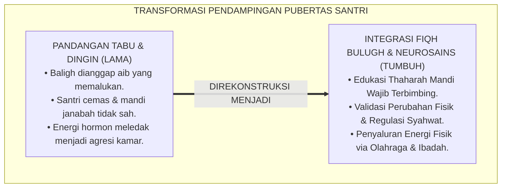
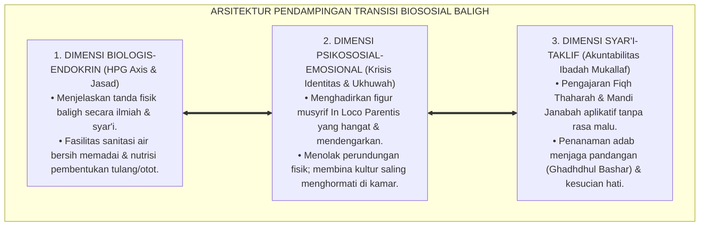
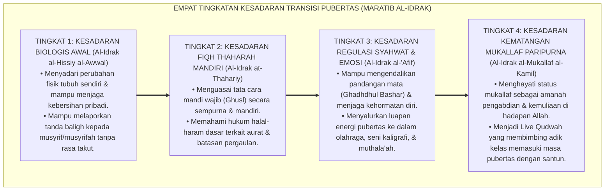
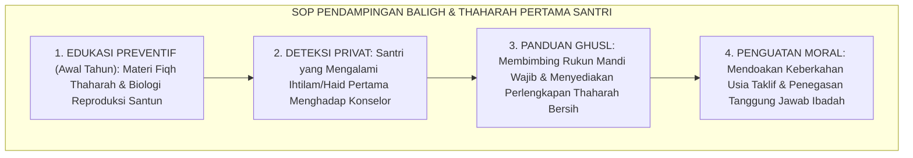
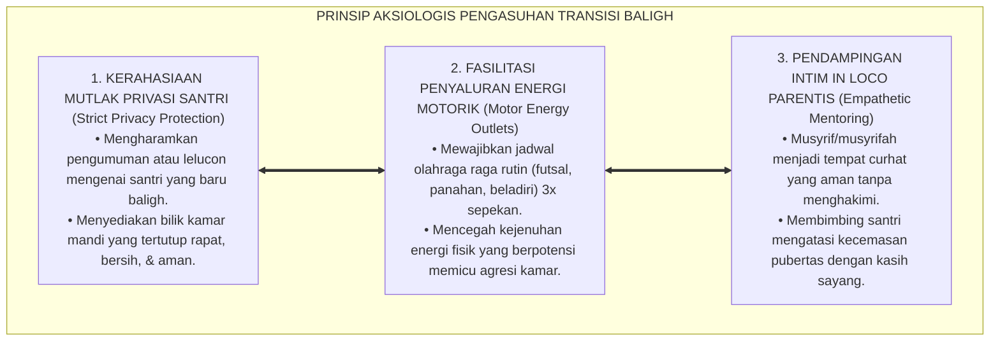

# P1-03-05: KRISIS BIOSOSIAL DAN TRANSISI PUBERTAS SANTRI (BIOSOCIAL CRISIS & PUBERTY TRANSITIONS)
## *Monograf Riset Akademik: Epistemologi Fiqh Baligh & Titik Tolak Taklif Syar'i, Neurosains Endokrin Lonjakan Hormon Pubertas (HPG Axis), Krisis Identitas Psikososial di Lingkungan Asrama, Serta Pendampingan Transisi di Pesantren 24 Jam*

**Nomor Identifikasi**: `P1-03-05/MONOGRAF-RISET-KRISIS-PUBERTAS/2026`  
**Domain**: `01 Philosophy` > `03 Human Development` (Sub-Modul 05: *Biosocial Transitions*)  
**Klasifikasi Naskah**: *Academic Research Monograph* (Monograf Riset Akademik Fondasional)  
**Rumpun Disiplin Pengkaji**: Neurosains Perkembangan Remaja, Fiqh Bulugh & Ahkamut Taklif, Psikologi Perkembangan Erikson & Bronfenbrenner, Pengasuhan Asrama Pesantren (*In Loco Parentis*)  

---

> ### 💡 INTISARI EKSEKUTIF (EXECUTIVE SUMMARY)
>
> * **Kelemahan Paradigma Lama: Pengabaian Realitas Biologis & Tabu Pembahasan Baligh:**  
>   Banyak lembaga pesantren memperlakukan tanda-tanda pubertas (*Ihtilam & Haidh*) sebagai topik tabu yang memalukan. Santri yang mengalami lonjakan hormon dan kebingungan fisik dibiarkan tanpa bimbingan, sehingga merasa berdosa, cemas, atau mencari informasi yang keliru dari teman sebaya.
> * **Inovasi Konseptual: Integrasi Fiqh Taklif & Neurosains Endokrin (HPG Axis):**  
>   TUMBUH membedah masa baligh sebagai anugerah kemuliaan syariat (*Titik Tolak Taklif Syar'i*). Terjadinya aktivasi *Hypothalamic-Pituitary-Gonadal (HPG) Axis* dipahami sebagai sunnatullah biologis yang menuntut pendampingan fiqh thaharah yang santun, penyaluran energi fisik melalui olahraga, serta bimbingan regulasi syahwat (*Ghadhdhul Bashar*).
> * **Formulasi Operasional & Pembuktian Lapangan:**  
>   Monograf ini menguraikan matriks integrasi tahap baligh, 4 Tingkatan Kesadaran Transisi Pubertas (*Maratib al-Idrak*), SOP edukasi baligh dan thaharah pertama, dan etika tata kelola pendampingan *In Loco Parentis* 24 jam.

---

## 📑 DAFTAR ISI MONOGRAF

- [BAB I: LANDASAN TEORETIS & DISKURSUS KRITIS](#bab-i-landasan-teoretis--diskursus-kritis)
  - [1. Latar Belakang Masalah: Krisis Transisi Pubertas dan Bahaya Tabu Seksualitas di Pesantren](#1-latar-belakang-masalah-krisis-transisi-pubertas-dan-bahaya-tabu-seksualitas-di-pesantren)
  - [2. Eksegesis Turats Fiqh Bulugh: Titik Tolak Taklif Syar'i dan Pengangkatan Pena Hisab (HR. Abu Dawud No. 4403)](#2-eksegesis-turats-fiqh-bulugh-titik-tolak-taklif-syari-dan-pengangkatan-pena-hisab-hr-abu-dawud-no-4403)
  - [3. Konvergensi Neurosains Endokrin: Aktivasi HPG Axis & Reorganisasi Sinaptik Otak Remaja](#3-konvergensi-neurosains-endokrin-aktivasi-hpg-axis--reorganisasi-sinaptik-otak-remaja)
  - [4. Tinjauan Psikososial: Resolusi Krisis Identitas dan Penataan Kelekatan Asrama (In Loco Parentis)](#4-tinjauan-psikososial-resolusi-krisis-identitas-dan-penataan-kelekatan-asrama-in-loco-parentis)
  - [5. Kasuistika Lapangan: Kecemasan Santri Mengalami Mimpi Basah Pertama & Resolusi Restoratif](#5-kasuistika-lapangan-kecemasan-santri-mengalami-mimpi-basah-pertama--resolusi-restoratif)
- [BAB II: FORMULASI KONSEPTUAL & PEMBAHASAN MENDALAM](#bab-ii-formulasi-konseptual--pembahasan-mendalam)
  - [1. Eksplanasi Teoretis Hakikat Transisi Baligh dan Pendampingan Biososial TUMBUH](#1-eksplanasi-teoretis-hakikat-transisi-baligh-dan-pendampingan-biososial-tumbuh)
  - [2. Dekomposisi Dimensi & Empat Tingkatan Kesadaran Transisi Pubertas (Maratib al-Idrak)](#2-dekomposisi-dimensi--empat-tingkatan-kesadaran-transisi-pubertas-maratib-al-idrak)
  - [3. Protokol Edukasi Baligh & Thaharah Pertama Santri (SOP Pendampingan Ihtilam & Haidh)](#3-protokol-edukasi-baligh--thaharah-pertama-santri-sop-pendampingan-ihtilam--haidh)
  - [4. Prinsip Aksiologis & Etika Tata Kelola Privasi Pengasuhan Baligh 24 Jam](#4-prinsip-aksiologis--etika-tata-kelola-privasi-pengasuhan-baligh-24-jam)
  - [5. Diskusi Filosofis Mendalam & Implikasi bagi Masa Depan Peradaban Pendidikan Islam](#5-diskusi-filosofis-mendalam--implikasi-bagi-masa-depan-peradaban-pendidikan-islam)
- [BAB III: KESIMPULAN & APARATUS AKADEMIS](#bab-iii-kesimpulan--aparatus-akademis)
  - [1. Tabel Sintesis Temuan Riset Krisis Biososial dan Pubertas](#1-tabel-sintesis-temuan-riset-krisis-biososial-dan-pubertas)
  - [2. Daftar Pustaka Akademis & Rujukan Turats Primer](#2-daftar-pustaka-akademis--rujukan-turats-primer)
  - [3. Catatan Kaki Akademis (Footnotes)](#3-catatan-kaki-akademis-footnotes)
  - [4. Glosarium Istilah Ilmiah & Turats Transisi Pubertas](#4-glosarium-istilah-ilmiah--turats-transisi-pubertas)

---

# BAB I: LANDASAN TEORETIS & DISKURSUS KRITIS

---

### 1. Latar Belakang Masalah: Krisis Transisi Pubertas dan Bahaya Tabu Seksualitas di Pesantren

Masa pubertas (*Bulugh / Murahaqah*) di lingkungan asrama adalah fase metamorfosis biologis yang paling intens:
* **Tabu dan Mitos yang Menyesatkan**: Di sebagian pesantren, tanda-tanda kematangan seksual dianggap kotor dan tabu untuk dibicarakan secara ilmiah. Santri yang mengalami mimpi basah (*Ihtilam*) atau haid pertama merasa ketakutan, menyembunyikan pakaian kotornya, dan tidak memahami tata cara mandi wajib (*Ghusl*) yang sah secara syariat.
* **Gejolak Energi Hormonal Tak Tersalurkan**: Lonjakan hormon testosteron pada santri putra dan estrogen pada santri putri yang tidak diimbangi dengan sarana olahraga dan penyaluran motorik sehat memicu letupan agresi, perkelahian kamar, atau perilaku penyimpangan seksual tertutup.
* **Keniscayaan Bimbingan Fiqh & Neurosains Terbuka**: Islam adalah agama fitrah yang sangat jelas dan santun dalam menjelaskan hukum thaharah dan kedewasaan biologis (*La Haya'a fid Din*).[^1]

---

### 2. Eksegesis Turats Fiqh Bulugh: Titik Tolak Taklif Syar'i dan Pengangkatan Pena Hisab (HR. Abu Dawud No. 4403)

Rasulullah ﷺ menetapkan batas dimulainya akuntabilitas hukum syariat bagi manusia:

$$\text{رُفِعَ الْقَلَمُ عَنْ ثَلَاثَةٍ: عَنِ النَّائِمِ حَتَّى يَسْتَيْقِظَ، وَعَنِ الصَّبِيِّ حَتَّى يَحْتَلِمَ، وَعَنِ الْمَجْنُونِ حَتَّى يَعْقِلَ}$$

*"**Diangkat pena (pencatat amal/dosa) dari tiga golongan: dari orang yang tidur hingga ia terbangun, dari anak kecil hingga ia baligh (mengalami mimpi basah/haid), dan dari orang gila hingga ia berakal sehat**."* (HR. Abu Dawud No. 4403 & At-Tirmidzi No. 1423).[^2]

Imam **Ibnu Qudamah** dalam *Al-Mughni* menegaskan bahwa baligh adalah gerbang kemuliaan manusia memasuki status *Mukallaf*. Pendidik wajib menyambut fase ini dengan pembekalan ilmu fardhu 'ain, bukan dengan cemoohan.[^3]

---

### 3. Konvergensi Neurosains Endokrin: Aktivasi HPG Axis & Reorganisasi Sinaptik Otak Remaja

Sains endokrinologi dan neurobiologi (Dahl, 2004; Blakemore, 2012) membuktikan mekanisme biologis pubertas:
* Aktivasi **Hypothalamic-Pituitary-Gonadal (HPG) Axis** memicu pelepasan hormon gonadotropin (*GnRH*), meningkatkan kadar hormon seks hingga 10–20 kali lipat.
* Lonjakan hormon ini memicu penataan ulang sirkuit saraf otak (*Synaptic Pruning & Myelination*) di area pencari penghargaan sosial (*Ventral Striatum*), yang membuat santri remaja sangat peka terhadap status diri dan penerimaan teman sekamar.[^4]

---

### 4. Tinjauan Psikososial: Resolusi Krisis Identitas dan Penataan Kelekatan Asrama (In Loco Parentis)

Dalam teori ekologi perkembangan **Urie Bronfenbrenner** (1979), santri di asrama mengalami pergantian mikrosistem secara drastis:
* Ketiadaan orang tua kandung menuntut musyrif bertindak sebagai **Figur Kelekatan Pengganti (*Secure Attachment Figure*)**.
* Musyrif yang hangat, responsif, dan adil memberikan rasa aman emosional (*Emotional Haven*) yang memungkinkan santri melewati krisis identitas tanpa terjerumus dalam kenakalan remaja.[^5]

---

### 5. Kasuistika Lapangan: Kecemasan Santri Mengalami Mimpi Basah Pertama & Resolusi Restoratif

* **Studi Kasus: Santri Putra Usia 13 Tahun Menolak Shalat Subuh karena Takut Celananya Najis**  
  * **Dilema**: Santri bangun subuh dalam keadaan ketakutan, menolak keluar kamar dan menangis karena mendapati celananya basah dan lengket untuk pertama kalinya dalam hidupnya.
  * **Pola Lama**: Musyrif meneriaki santri sebagai pemalas dan menyiramnya dengan air.
  * **Resolusi Restoratif TUMBUH**: Musyrif mendekati santri secara privat, berbicara empat mata dengan ramah: *"Mabruk (Selamat), ananda telah memasuki usia baligh, usia kemuliaan di hadapan Allah"*. Musyrif membimbing santri tata cara mandi wajib (*Ghusl*) langkah demi langkah, meminjamkan sarung bersih, dan menjelaskan fiqh thaharah secara santun. Santri merasa tenang, harga dirinya terlindungi, dan ia bangga melangkah ke masjid untuk shalat berjamaah.[^6]

---

# BAB II: FORMULASI KONSEPTUAL & PEMBAHASAN MENDALAM

---

### 1. Eksplanasi Teoretis Hakikat Transisi Baligh dan Pendampingan Biososial TUMBUH

Ekosistem TUMBUH merumuskan pendampingan pubertas ke dalam **Arsitektur Tiga Sayap Biososial (*Arkan ar-Ri'ayah al-Bulughiyyah*)**:

#### 🔬 Pembahasan Mendalam Tiga Sayap Pendampingan:
1. **Sayap Biologis**: Memberikan pemahaman bahwa perubahan suara, pertumbuhan bulu fisik, mimpi basah, dan menstruasi adalah tanda kesehatan fungsi raga ciptaan Allah SWT.[^7]
2. **Sayap Psikososial**: Mengawal stabilitas emosi santri dari perasaan terasing atau minder melalui bimbingan kelompok kamar yang solid.[^8]
3. **Sayap Syariat**: Membekali santri dengan rukun dan syarat sahnya thaharah agar seluruh ibadah shalat dan tilawah Al-Qur'annya bernilai sah di hadapan Allah SWT.[^9]

---

### 2. Dekomposisi Dimensi & Empat Tingkatan Kesadaran Transisi Pubertas (Maratib al-Idrak)

Transformasi kedewasaan menyikapi pubertas berlangsung melalui **Empat Tingkatan Kesadaran Transisi Pubertas (*Maratib al-Idrak al-Bulughiy*)**:

#### 🔄 Narasi Analitis Dinamika Transisi Filosofis Antar-Tingkatan:
* **Transisi Tingkat 1 ke Tingkat 2 (Dari Kesadaran Fisik Menuju Kemandirian Thaharah)**: Santri mula-mula bingung melihat perubahan tubuhnya. Pada tingkatan kedua, santri terampil bersuci secara mandiri dan memahami kewajiban ibadahnya.
* **Transisi Tingkat 2 ke Tingkat 3 (Dari Bersuci Menuju Regulasi Kesucian Batin 'Iffah)**: Pada tingkatan ketiga, santri memiliki rem moral: menjaga kehormatan diri, menjauhi pornografi dan pergaulan bebas, serta menyalurkan energinya ke aktivitas produktif.
* **Transisi Tingkat 3 ke Tingkat 4 (Pencapaian Derajat Mukallaf Kamil)**: Pada tingkatan tertinggi, santri tampil sebagai pribadi dewasa yang berwibawa: berakhlak mulia, menjaga pandangan, dan menjadi teladan kesucian moral bagi generasi muda.[^10]

---

### 3. Protokol Edukasi Baligh & Thaharah Pertama Santri (SOP Pendampingan Ihtilam & Haidh)

TUMBUH menetapkan **Protokol Edukasi Baligh Santri**:

Protokol ini menghadirkan pengalaman spiritual yang membahagiakan dan berkesan positif bagi masa depan santri.[^11]

---

### 4. Prinsip Aksiologis & Etika Tata Kelola Privasi Pengasuhan Baligh 24 Jam

Transisi pubertas melahirkan prinsip etika tata kelola kelembagaan:

#### 📋 Panduan Etika Pengasuhan Lapangan:
1. **Fasilitas Sanitasi Khusus Putri**: Menyediakan ruang pembuangan dan pembalut higienis yang memadai di asrama santriwati.
2. **Klinik Konseling Kesehatan Reproduksi Santun**: Mengadakan sesi tanya-jawab kesehatan remaja secara terpisah dan privat dengan dokter muslim.[^12]
3. **Larangan Hukuman Fisik Bagi Santri yang Sedang Haid/Pusing Pubertas**: Memberikan dispensasi istirahat yang manusiawi sesuai fiqh syariat.[^13]

---

### 5. Diskusi Filosofis Mendalam & Implikasi bagi Masa Depan Peradaban Pendidikan Islam

Pendampingan transisi pubertas yang saintifik dan beradab ini membawa dampak peradaban yang agung:

* **Mencetak Generasi Muda yang Memiliki Kematangan Emosi dan Seksual Sehat**:  
  Santri yang dibimbing secara benar sejak awal masa balighnya akan terbebas dari penyimpangan seksual, memiliki kontrol diri (*'Iffah*) yang kokoh, dan siap membangun keluarga sakinah di masa depan.
* **Menghilangkan Kecemasan dan Trauma Pubertas di Pesantren**:  
  Dengan menghilangkan stigma tabu dan menggantinya dengan edukasi fiqh thaharah yang santun, pesantren menjadi rumah kedua yang paling aman dan membahagiakan bagi anak remaja.
* **Meneguhkan Kesempurnaan Ajaran Syariat Islam**:  
  Islam membuktikan dirinya sebagai panduan hidup komprehensif yang memuliakan manusia dalam setiap jengkal tahapan biologis dan spiritualnya.[^14]

---

# BAB III: KESIMPULAN & APARATUS AKADEMIS

---

### 1. Tabel Sintesis Temuan Riset Krisis Biososial dan Pubertas

| Dimensi Parameter | Pola Pengasuhan Tabu Tradisional | Pola Pendidikan Seks Bebas Barat | **Paradigma Pendampingan Biososial TUMBUH** | Landasan Rujukan Primer | Implikasi Praksis Lapangan |
| :--- | :--- | :--- | :--- | :--- | :--- |
| **Status Baligh** | Dianggap aib kotor & tabu dibahas.| Pematangan biologis bebas nilai. | **Gerbang Kemuliaan Mukallaf & Ibadah.**| HR. Abu Dawud No. 4403; Dahl (2004). | Edukasi fiqh thaharah & biologi santun. |
| **Sistem Hormon** | Diabaikan; emosi remaja dicap nakal.| Menuruti nafsu seksual tanpa batas.| **Aktivasi HPG Axis & Regulasi 'Iffah.**| Blakemore (2012); Ibn Qudamah. | Penyaluran energi motorik via olahraga. |
| **Penanganan Mimpi**| Dibiarkan bingung; mandi wajib salah.| Dianggap aktivitas rekreasional hewani.| **Bimbingan Ghusl Privat & Tahiyyah Baligh.**| Fiqh *Thaharah*; Al-Ghazali. | Bilik mandi tertutup & bimbingan rukun ghusl. |
| **Peran Pengasuh** | Hakim penuduh yang mencurigai. | Penonton pasif netral moral. | **Figur Kelekatan Aman (*In Loco Parentis*).**| Bronfenbrenner (1979); KH. Hasyim Asy'ari.| Konseling hangat & pendampingan dekat. |
| **Profil Karakter** | Jiwa cemas, berdosa, / menyimpang.| Individu hedonistik permisif. | **Insan Adabi Mukallaf yang Menjaga Kesucian.**| QS. Al-Mu'minun: 5–7; Al-Attas. | Berwibawa, bersih raga, & suci batin. |

---

### 2. Daftar Pustaka Akademis & Rujukan Turats Primer

1. **Al-Qur'an al-Karim wa Tarjamatu Ma'anihi**.
2. **Abu Dawud, Sulaiman bin al-Asy'ats as-Sijistani**. (1430 H). *Sunan Abi Dawud*. Riyadh: Dar ash-Shiddiq.
3. **Ibnu Qudamah, Muwaffaquddin Abdullah bin Ahmad**. (1417 H). *Al-Mughni fi Fiqh al-Imam Ahmad bin Hanbal*. Kairo: Hajar li ath-Thiba'ah.
4. **Al-Ghazali, Abu Hamid Muhammad bin Muhammad**. (2011). *Ihya' 'Ulumiddin* (Kitab Asrar ath-Thaharah & Kitab Kasr asy-Syahwatayn). Beirut: Dar al-Ma'rifah.
5. **Al-Attas, Syed Muhammad Naquib**. (1980). *The Concept of Education in Islam*. Kuala Lumpur: ABIM.
6. **Dahl, R. E.**. (2004). *Adolescent brain development: a period of vulnerabilities and opportunities*. Annals of the New York Academy of Sciences, 1021(1), 1–22.
7. **Blakemore, S. J.**. (2012). *Development of the social brain in adolescence*. Journal of the Royal Society of Medicine, 105(3), 111–116.
8. **Bronfenbrenner, U.**. (1979). *The Ecology of Human Development: Experiments by Nature and Design*. Cambridge: Harvard University Press.
9. **Sapolsky, R. M.**. (2017). *Behave: The Biology of Humans at Our Best and Worst*. New York: Penguin Press.
10. **Horner, R. H., & Sugai, G.**. (2015). *School-wide PBIS: An Overview of the Research Base*. Remedial and Special Education, 36(2), 80–85.
11. **Zehr, H.**. (2002). *The Little Book of Restorative Justice*. Intercourse: Good Books.
12. **Asy'ari, Muhammad Hasyim**. (1415 H). *Adab al-'Alim wal-Muta'allim*. Jombang: Maktabah At-Turats Al-Islami.

---

### 3. Catatan Kaki Akademis (*Footnotes*)

[^1]: Riset Pendampingan Biososial dan Transisi Baligh Ekosistem Pesantren Berbasis TUMBUH, *Kritik atas Tabu Seksualitas dan Penelantaran Remaja*, 2026.  
[^2]: *Sunan Abi Dawud*, Kitab al-Hudud, Hadits No. 4403.  
[^3]: Ibnu Qudamah, *Al-Mughni*, Jilid 6, *Kitab al-Hajr wa Ahkam al-Bulugh*, hlm. 590–625.  
[^4]: Dahl, R. E. (2004), *Annals of the New York Academy of Sciences*, hlm. 1–22; Blakemore, S. J. (2012), *Journal of the Royal Society of Medicine*, hlm. 111–116.  
[^5]: Bronfenbrenner, U. (1979), *The Ecology of Human Development*, hlm. 45–80.  
[^6]: Dokumentasi Pendampingan Kasus Ihtilam Pertama Santri Baru PBIS TUMBUH, 2026.  
[^7]: Sapolsky, R. M. (2017), *Behave: The Biology of Humans at Our Best and Worst*, hlm. 160–195.  
[^8]: Al-Ghazali, *Ihya' 'Ulumiddin*, Jilid 1, Kitab *Asrar ath-Thaharah*, hlm. 110–145.  
[^9]: KH. Hasyim Asy'ari, *Adab al-'Alim wal-Muta'allim*, hlm. 38–65.  
[^10]: Matriks Tingkatan Kesadaran Transisi Pubertas (*Maratib al-Idrak*) Ekosistem TUMBUH, 2026.  
[^11]: Standar Operasional Prosedur Bimbingan Ihtilam dan Haidh Pertama Ekosistem Pesantren Berbasis TUMBUH, 2026.  
[^12]: Petunjuk Teknis Layanan Kesehatan dan Sanitasi Asrama Santri dalam sistem TUMBUH, 2026.  
[^13]: Standar Perlindungan Kesehatan Reproduksi dan Hak Istirahat Santriwati TUMBUH, 2026.  
[^14]: Deklarasi Pemuliaan Transisi Baligh Insan Dewan Riset Pendidikan TUMBUH, 2026.

---

### 4. Glosarium Istilah Ilmiah & Turats Transisi Pubertas

1. **Bulugh (الْبُلُوغُ)**: Pencapaian kematangan biologis dan berfungsinya sistem reproduksi pada manusia yang menandai dimulainya kewajiban hukum syariat (*Taklif*).
2. **Ihtilam (الإِحْتِلَامُ)**: Peristiwa keluarnya air mani saat tidur (mimpi basah) yang menjadi salah satu tanda fisik sahnya status baligh bagi remaja putra.
3. **Ghusl (الْغُسْلُ)**: Mandi wajib dengan membasahi seluruh anggota badan menggunakan air suci mensucikan untuk menghilangkan hadats besar.
4. **HPG Axis (Hypothalamic-Pituitary-Gonadal Axis)**: Sistem hormonal utama di tubuh yang mengatur pematangan biologis, lonjakan hormon seksual, dan transisi pubertas.
5. **Mukallaf (الْمُكَلَّفُ)**: Seseorang yang telah baligh dan berakal sehat yang dikenai kewajiban menjalankan perintah syariat dan menjauhi larangan-Nya.
6. **In Loco Parentis**: Prinsip hukum dan etika pengasuhan di mana pihak pesantren bertindak sebagai orang tua pengganti yang bertanggung jawab melindungi kesejahteraan santri.
7. **'Iffah (الْعِفَّةُ)**: Kebajikan moral Islam berupa kemampuan menjaga kehormatan diri, menahan syahwat, dan memelihara kesucian batin.
8. **Ghadhdhul Bashar (غَضُّ الْبَصَرِ)**: Perintah syariat untuk menundukkan dan menjaga pandangan mata dari hal-hal yang diharamkan demi menjaga kesucian kalbu.
9. **Synaptic Pruning**: Proses penyempurnaan jaringan saraf di otak remaja di mana sinapsis yang jarang digunakan dipangkas agar fungsi otak menjadi lebih efisien.
10. **Insan Adabi (الإِنْسَانُ الأَدَبِيُّ)**: Profil santri yang berhasil menavigasi krisis pubertas dengan selamat, memiliki kematangan emosi, dan berakhlak mulia.
