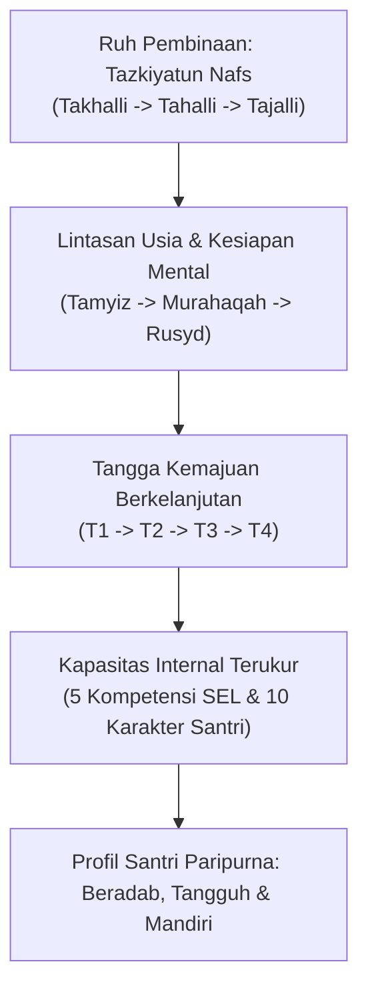

# P1-03-05-Sintesis-Human-Development

## Rangkuman Integratif: Perkembangan Santri dalam TUMBUH

Dokumen ini menyintesiskan pilar-pilar filosofis perkembangan manusia (*Human Development*) dalam kerangka sistemik TUMBUH:

---

## 4 Prinsip Kunci Perkembangan Manusia (Human Development)

1. **Pertumbuhan Berakar pada Penyucian Jiwa (*Tazkiyah-Driven*)**: Perkembangan santri sejati tidak diukur semata dari hafalan atau nilai kognitif, melainkan dari transformasi akhlak dan kejernihan hati yang tercermin dalam perilaku nyata.
2. **Kesesuaian dengan Karakteristik Usia (*Mura'at al-Marhalah*)**: Sistem pendidikan harus menghormati dinamika psikologis usia remaja santri. Pembinaan tidak boleh menuntut kematangan instan melainkan mendampingi proses adaptasi dan gejolak emosi dengan bimbingan arif.
3. **Progresi yang Terstruktur & Terukur (*Marhaliyyah wa Tadrij*)**: Perjalanan santri dari adaptasi (T1), pembiasaan (T2), internalisasi pemahaman (T3), hingga kemandirian dan keteladanan (T4) harus dipandu oleh roadmap kurikulum dan SOP yang jelas bagi seluruh musyrif dan asatidz.
4. **Keseimbangan Kapasitas Internal & Nilai Luhur (*Tawazun al-Kafa'ah wa al-Qiyam*)**: Mengintegrasikan keterampilan sosial-emosional modern (SEL) sebagai sarana implementasi karakter santri yang berlandaskan nilai tauhid dan adab Islam.
