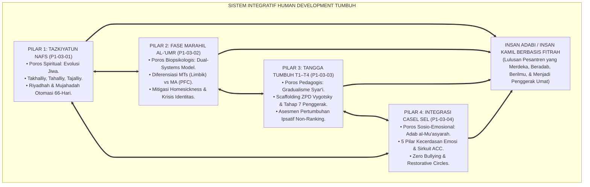
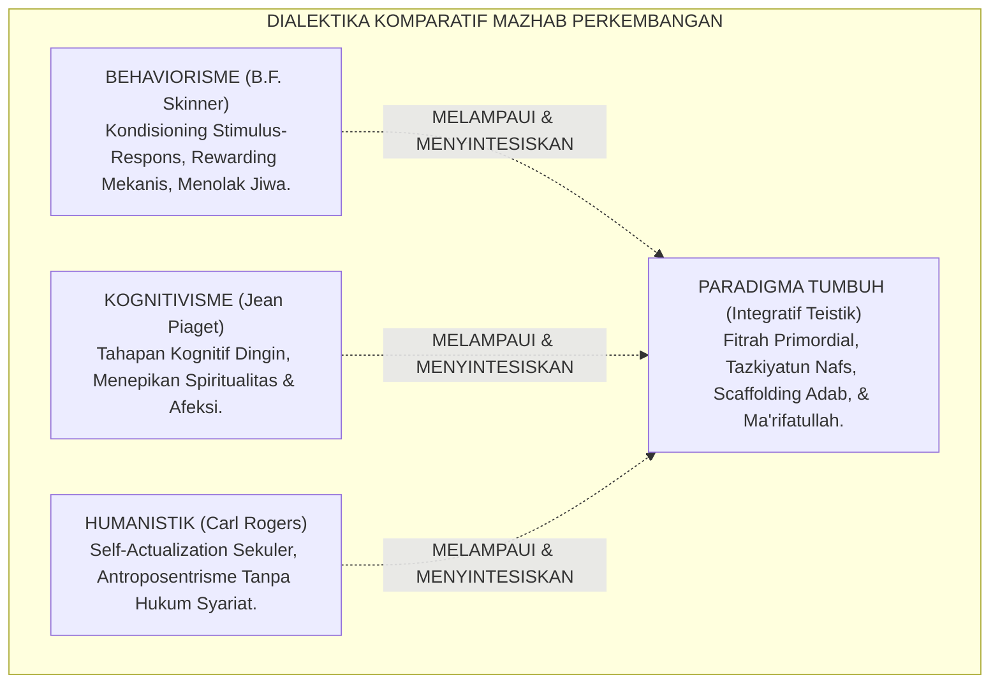
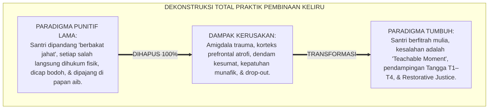
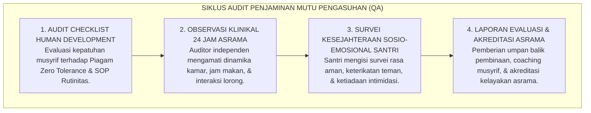

# P1-03-05: SINTESIS FILOSOFIS HUMAN DEVELOPMENT DAN PIAGAM TRAJEKTORI PERTUMBUHAN SANTRI
## *Monograf Terpadu: Sintesis Komprehensif 4 Pilar Perkembangan Jiwa (Tazkiyatun Nafs, Fase Marahil al-'Umr, Tangga T1–T4, & CASEL SEL), Matriks Komparasi 4 Mazhab Barat vs TUMBUH, Deklarasi Zero Tolerance Stagnasi Punitif, serta Jembatan Epistemologis Menuju Sub-Domain 04 Education*

**Nomor Identifikasi**: `P1-03-05/MONOGRAF-TERPADU-SINTESIS-HUMAN-DEVELOPMENT/2026`  
**Domain**: `01 Philosophy` > `03 Human Development`  
**Klasifikasi Naskah**: *Comprehensive Synthesis Monograph* (Monograf Sintesis Filosofis & Piagam Baku Kelembagaan)  
**Rumpun Disiplin Pengkaji**: Filsafat Perkembangan Manusia (*Philosophy of Human Development*), Teologi Pendidikan Islam (*Tazkiyah & Ta'dib*), Psikologi Perkembangan Integratif, Tata Kelola Pengasuhan Pesantren 24 Jam  

---

> ### 💡 INTISARI PRAKTIS (3 MENIT PAHAM UNTUK ASATIDZ & MUSYRIF)
>
> * **Kesatuan Utuh 4 Pilar Human Development Ekosistem TUMBUH:**  
>   Pertumbuhan santri bukanlah proses mekanis yang terpisah-pisah, melainkan orkestrasi 4 dimensi yang menyatu:  
>   1. **P1-03-01 (Tazkiyatun Nafs):** Poros spiritual pembersihan kalbu (*Takhalliy*), penghiasan adab (*Tahalliy*), dan pembiasaan 66 hari menuju watak kedua (*Tajalliy*).  
>   2. **P1-03-02 (Fase Marahil al-'Umr):** Pembedaan kebutuhan biologis-emosional jenjang MTs (awal pubertas/limbik) vs jenjang MA (maturasi nalar/PFC).  
>   3. **P1-03-03 (Tangga TUMBUH T1–T4):** Lintasan kemandirian adab bertahap (*Tadarruj & Scaffolding*) menuju **Tahap 7 Penggerak**, dengan asesmen ipsatif non-komparatif.  
>   4. **P1-03-04 (Integrasi SEL):** Penerjemahan adab ke dalam 5 kecerdasan sosio-emosional nyata, penguatan sirkuit empati otak (*ACC*), dan budaya *Zero Bullying*.
> * **Posisi TUMBUH vs Mazhab Barat:**  
>   TUMBUH menolak reduksionisme mekanis Behaviorisme Skinner, menolak intelektualisme kering Piagetian, dan melampaui humanisme sekuler Carl Rogers dengan menancapkan **Poros Tauhid, Ma'rifatullah, dan Akuntabilitas Akhirat**.
> * **Piagam Perlindungan Hak Bertumbuh Santri (Zero Tolerance):**  
>   Lembaga menyatakan **HARAM DAN BATAL** segala bentuk tindakan yang mematikan pertumbuhan santri: pemukulan fisik, pembentakan, pelabelan permanen (santri nakal/bodoh), perangkingan kelas toksik, dan penelantaran krisis transisi.

---

## 📑 DAFTAR ISI MONOGRAF

- [BAGIAN I: SINTESIS FILOSOFIS 4 PILAR HUMAN DEVELOPMENT & MATRIKS KOMPARATIF EPISTEMOLOGIS](#bagian-i-sintesis-filosofis-4-pilar-human-development--matriks-komparatif-epistemologis)
  - [1. Arsitektur Sintesis Holistik: Konvergensi 4 Pilar Perkembangan Jiwa Santri](#1-arsitektur-sintesis-holistik-konvergensi-4-pilar-perkembangan-jiwa-santri)
  - [2. Matriks Komparasi Filosofis: TUMBUH vs 4 Mazhab Perkembangan Barat (Behaviorisme, Kognitivisme, Psikososial, & Humanistik)](#2-matriks-komparasi-filosofis-tumbuh-vs-4-mazhab-perkembangan-barat-behaviorisme-kognitivisme-psikososial--humanistik)
  - [3. Dekonstruksi Paradigma Reduksionis & Penghapusan Mutlak Stagnasi Punitif](#3-dekonstruksi-paradigma-reduksionis--penghapusan-mutlak-stagnasi-punitif)
  - [4. Jembatan Filosofis & Pedagogis Menuju Sub-Domain 04 Education](#4-jembatan-filosofis--pedagogis-menuju-sub-domain-04-education)
- [BAGIAN II: PIAGAM KELEMBAGAAN & DEKLARASI DOKTRIN BAKU HUMAN DEVELOPMENT](#bagian-ii-piagam-kelembagaan--deklarasi-doktrin-baku-human-development)
  - [1. Piagam Kelembagaan Pemuliaan Hak Bertumbuh Santri Pesantren TUMBUH](#1-piagam-kelembagaan-pemuliaan-hak-bertumbuh-santri-pesantren-tumbuh)
  - [2. Matriks Integrasi Operasional 4 Pilar Human Development ke dalam Kurikulum Pengasuhan 24 Jam](#2-matriks-integrasi-operasional-4-pilar-human-development-ke-dalam-kurikulum-pengasuhan-24-jam)
  - [3. Protokol Audit Kualitas Pengasuhan Asrama Berbasis Human Development](#3-protokol-audit-kualitas-pengasuhan-asrama-berbasis-human-development)
- [BAGIAN III: APARATUS AKADEMIS & APENDIKS](#bagian-iii-aparatus-akademis--apendiks)
  - [1. Tabel Sintesis Master Sub-Domain 03](#1-tabel-sintesis-master-sub-domain-03)
  - [2. Daftar Pustaka Otoritatif Turats & Jurnal Internasional Peer-Reviewed](#2-daftar-pustaka-akademis--rujukan-turats-primer)
  - [3. Catatan Kaki Akademis (Footnotes)](#3-catatan-kaki-akademis-footnotes)
  - [4. Glosarium Master Istilah Kunci Human Development](#4-glosarium-master-istilah-kunci-human-development)

---

# BAGIAN I: SINTESIS FILOSOFIS 4 PILAR HUMAN DEVELOPMENT & MATRIKS KOMPARATIF EPISTEMOLOGIS

---

### 1. Arsitektur Sintesis Holistik: Konvergensi 4 Pilar Perkembangan Jiwa Santri

Pertumbuhan manusia dalam ekosistem TUMBUH bukanlah serangkaian peristiwa acak yang terfragmentasi, melainkan sebuah **Sistem Perkembangan Holistik Simbiotik (*Symbiotic Holistic Development System*)**. Keempat pilar saling mengunci dan menyempurnakan satu sama lain:



* **Pilar 1 (Tazkiyatun Nafs)** memberikan **Bahan Bakar & Arah Spiritual**: tanpa tazkiyah, pembinaan karakter terjebak dalam behaviorisme mekanis tanpa jiwa.
* **Pilar 2 (Fase Perkembangan)** memberikan **Pijakan Kematangan Biologis**: tanpa pemahaman usia remaja, tuntutan adab berubah menjadi kezaliman ekspektasi orang dewasa (*Adultomorfisme*).
* **Pilar 3 (Tangga TUMBUH T1–T4)** memberikan **Metodologi Pentahapan Bertingkat**: tanpa tangga gradual, santri akan jatuh dalam keputusasaan (*Learned Helplessness*) atau kepura-puraan instan.
* **Pilar 4 (Integrasi SEL)** memberikan **Keterampilan Interaksi Sosial Nyata**: tanpa kecerdasan emosi, adab hanya menjadi teori hafalan kitab yang mandul di kehidupan komunal asrama.[^1]

---

### 2. Matriks Komparasi Filosofis: TUMBUH vs 4 Mazhab Perkembangan Barat



| Mazhab Pemikiran | Tokoh Utama & Asumsi Dasar Manusia | Pandangan tentang Sumber Pertumbuhan | Titik Kritis Kelemahan Paradigma | Koreksi & Penyempurnaan oleh Ekosistem TUMBUH |
| :--- | :--- | :--- | :--- | :--- |
| **1. Behaviorisme Radikal** | **B.F. Skinner, J.B. Watson**<br/>Manusia adalah organisme mekanis (*Tabula Rasa*) yang sepenuhnya dibentuk oleh pengkondisian stimulus-respons eksternal. | *Operant Conditioning*, jadwal penguatan (*Reinforcement Schedule*), dan manipulasi lingkungan fisik. | Mengabaikan eksistensi Ruh, Kalbu, kesadaran bebas, dan niat ikhlas. Melahirkan kepatuhan semu yang rapuh saat pengawasan hilang. | Menegakkan konsep **Tazkiyatun Nafs & Motivasi Muraqabatullah**; penguatan eksternal hanya alat bantu transisi (*Scaffolding*) yang harus dilepas menuju kemandirian moral otonom.[^2] |
| **2. Kognitivisme Perkembangan** | **Jean Piaget**<br/>Manusia adalah pemroses informasi rasional yang membangun skema mental melalui asimilasi dan akomodasi logis. | Kematangan biologis otak dan interaksi eksploratif dengan objek fisik/matematis lingkungan. | Reduksionis ke ranah nalar intelektual (*Kognisi Dingin*); mengabaikan dimensi penyucian hati (*Tazkiyah*), intuisi spiritual, dan kehangatan relasi ukhuwah. | Memadukan nalar rasional dengan **Kecerdasan Hati (*Qalb*) dan Dimensi Afektif CASEL SEL**, melahirkan pemikiran yang berakar pada hikmah syar'i.[^3] |
| **3. Psikososial Perkembangan** | **Erik Erikson**<br/>Manusia berkembang melalui resolusi 8 krisis psikososial yang dipicu oleh tuntutan lingkungan sosial dan budaya. | Interaksi individu dengan institusi sosial keluarga, sekolah, dan masyarakat luas (*Ego Identity*). | Bersifat sosiologis sekuler; identitas diri (*Fidelity*) tidak memiliki jangkar transendental hakiki (tidak mengenal *Mitsaq Azali* dan fitrah tauhid). | Mengintegrasikan krisis identitas remaja dengan **Pembentukan Identitas Thalibul 'Ilmi & Insan Adabi** yang terikat pada kesaksian tauhid azali.[^4] |
| **4. Psikologi Humanistik** | **Carl Rogers, Abraham Maslow**<br/>Manusia pada dasarnya baik dan memiliki dorongan alami menuju aktualisasi potensi diri (*Self-Actualization*). | Pemenuhan kebutuhan hierarkis (*Unconditional Positive Regard*) dan kebebasan memilih tanpa restriksi dogma. | Antroposentrisme individualistik; rentan terjebak pada pengagungan ego (*Nafs*) yang menolak batas halal-haram syariat atas nama "otentisitas diri". | Melampaui aktualisasi diri egoistik menuju **Maqam 'Ubudiyyah & Khilafah**; kebebasan manusia menemukan kesempurnaannya dalam ketaatan sukarela kepada Allah SWT.[^5] |

---

### 3. Dekonstruksi Paradigma Reduksionis & Penghapusan Mutlak Stagnasi Punitif



#### 📐 Formalisasi Logika Silogisme (*Qiyas Mantiqi Sintesis*)
* **Premis Mayor (*al-Muqaddimah al-Kubra*)**: Setiap lembaga pendidikan Islam yang terbukti menerapkan praktik pembinaan yang melumpuhkan neurobiologi fitrah, memicu trauma psikologis permanen, dan menghentikan laju pertumbuhan jiwa santri niscaya telah menyimpang dari amanah risalah kenabian (*Khianatut Tarbiyah*).
* **Premis Minor (*al-Muqaddimah ash-Shughra*)**: Praktik hukuman fisik, penyeragaman ranking komparatif, dan intimidasi senioritas feodal terbukti secara syar'i dan empiris melumpuhkan proses *Tazkiyatun Nafs* dan memicu regresi perilaku.
* **Konklusi (*an-Natijah*)**: Maka, seluruh entitas pengasuhan di bawah naungan ekosistem TUMBUH wajib mendeklarasikan *Zero Tolerance Policy* terhadap segala bentuk kekerasan dan menggantinya dengan ekosistem restoratif multi-tier.[^6]

---

### 4. Jembatan Filosofis & Pedagogis Menuju Sub-Domain `04 Education`

Sintesis *Sub-Domain 03 Human Development* menjadi batu pijakan ontologis dan epistemologis yang mutlak bagi perumusan **Sub-Domain 04: Education (Filsafat Pendidikan & Kurikulum Adab)**:

```mermaid
graph TD
    HD["SUB-DOMAIN 03: HUMAN DEVELOPMENT<br/>(Memahami Trajektori Pertumbuhan Jiwa Santri: Tazkiyah, Usia, Tangga T1–T4, SEL)"]
    ==>|MENDASARI SECARA MUTLAK|
    ED["SUB-DOMAIN 04: EDUCATION (PENDIDIKAN)<br/>(Merancang Kurikulum Adab, Didaktik Ta'dib, Desain Kelas Interaktif, & Asesmen Formatif)"]
    
    subgraph ImplikasiKeSubDomain04["IMPLIKASI PEDAGOGIS KE SUB-DOMAIN 04"]
        I1["Kurikulum Berdiferensiasi (MTs vs MA)"]
        I2["Didaktik Berbasis Scaffolding ZPD"]
        I3["Integrasi SEL dalam Rencana Pembelajaran"]
        I4["Asesmen Otentik Berbasis Kemajuan Ipsatif"]
    end
    
    ED --> ImplikasiKeSubDomain04
```

1. **Dari Hakikat Jiwa Menuju Tujuan Pendidikan**: Karena santri adalah insan berfitrah yang bertumbuh melalui tazkiyah, maka tujuan utama pendidikan bukan sekadar transfer wawasan (*Ta'lim Kognitif*), melainkan penanaman adab ke dalam diri secara menyeluruh (*Ta'dib* ala Al-Attas).
2. **Dari Tangga TUMBUH Menuju Kurikulum Modular**: Kurikulum kelas dan asrama di Sub-Domain 04 harus dirancang dalam modul-modul pembelajaran yang kompatibel dengan etape T1, T2, T3, hingga T4.
3. **Dari Neurosains Kognitif Menuju Manajemen Kelas Positif**: Desain kelas dan interaksi guru-santri harus bebas dari ancaman yang memicu pembajakan amigdala (*Threat-Free Learning Environment*), sehingga korteks prefrontal santri dapat menyerap ilmu dengan optimal.[^7]

---

# BAGIAN II: PIAGAM KELEMBAGAAN & DEKLARASI DOKTRIN BAKU HUMAN DEVELOPMENT

---

### 1. Piagam Kelembagaan Pemuliaan Hak Bertumbuh Santri Pesantren TUMBUH

```
===================================================================================================
             PIAGAM KELEMBAGAAN PEMULIAAN HAK BERTUMBUH SANTRI (HUMAN DEVELOPMENT CHARTER)
                          SUB-DOMAIN 03: HUMAN DEVELOPMENT — EKOSISTEM TUMBUH
===================================================================================================

BISMILLAHIRRAHMANIRRAHIM. DENGAN KESADARAN PENUH AKAN AMANAH ILAHIYAH DALAM MEMELIHARA GENERASI
PEWARIS NABI, DEWAN KEILMUAN BESERTA SELURUH PIMPINAN PESANTREN EKOSISTEM TUMBUH DENGAN INI
MENETAPKAN KETENTUAN HUKUM DAN ETIKA BAKU KELEMBAGAAN SEBAGAI BERIKUT:

PASAL 1: HAK MUTLAK KESUCIAN FITRAH & MARTABAT
Setiap santri dilahirkan suci dan mulia (Mukarram). Lembaga menjamin hak setiap santri untuk dibina
dengan cinta, rasa hormat, dan kasih sayang (Firm & Kind), tanpa ancaman kekerasan fisik maupun verbal.

PASAL 2: PENERAPAN STANDAR TRIADIK TAZKIYATUN NAFS
Seluruh lini pengasuhan asrama 24 jam wajib menerapkan tahapan Takhalliy (pembersihan penyakit hati),
Tahalliy (penanaman kebajikan), dan Tajalliy (pemantapan watak kedua) melalui kurikulum riyadhah 66 hari.

PASAL 3: PENGAKUAN DIFERENSIASI USIA & NEUROSAINS PERKEMBANGAN
Lembaga mewajibkan pemisahan strategi pedagogis antara santri jenjang MTs (awal pubertas) dan santri
jenjang MA (akhir pubertas). Perilaku labil santri disikapi dengan pembimbingan nalar logis, bukan amarah.

PASAL 4: PENGHAPUSAN MUTLAK PERANGKINGAN TUNGGAL TOKSIK
Sistem perangkingan kelas komparatif (Ranking 1-30) DINYATAKAN HAPUS DAN TIDAK BERLAKU LAGI.
Lembaga menegakkan Asesmen Pertumbuhan Ipsatif yang menilai kemajuan personal setiap santri.

PASAL 5: KEBIJAKAN ZERO TOLERANCE KEKERASAN & SENIORITAS FEODAL
Segala bentuk pemukulan, tamparan, push-up berlebihan, penyiraman air malam hari, pembentakan,
pencukuran botak paksa, dan perpeloncoan senior DIKATEGORIKAN SEBAGAI PELANGGARAN BERAT
DENGAN SANKSI PEMBERHENTIAN BAGI PELAKU DEWASA DAN REHABILITASI RESTORATIF BAGI SANTRI.

PASAL 6: INTEGRASI KECERDASAN SOSIO-EMOSIONAL (CASEL SEL)
Mewajibkan pelaksanaan 3 jangkar rutinitas harian di seluruh kamar asrama: Halaqah Sapa Pagi, Makan Satu
Nampan Berjamaah, dan Lingkaran Muhasabah Reflektif Malam.

DITETAPKAN DI: PUSAT RISET EKOSISTEM PENDIDIKAN TUMBUH
TANGGAL: 24 AGUSTUS 2026
ATAS NAMA DEWAN PAKAR FILOSOFI, EPISENTRUM PENGASUHAN, & TATA KELOLA PESANTREN TUMBUH
===================================================================================================
```

---

### 2. Matriks Integrasi Operasional 4 Pilar Human Development ke dalam Kurikulum Pengasuhan 24 Jam

| Pilar Human Development | Dokumen Rujukan | Komponen Kunci Kurikulum Asrama | Output Terukur pada Diri Santri |
| :--- | :--- | :--- | :--- |
| **Pilar 1: Tazkiyatun Nafs** | [**`P1-03-01`**](./P1-03-01-Tazkiyatun-Nafs-dan-Pertumbuhan-Jiwa.md) | Blok pembiasaan 66 hari, kurikulum pembersihan ghashab, SOP Muhasabah Hening Malam. | Terbentuknya *Moral Automaticity* (kebiasaan adab otomatis tanpa perlu disuruh).[^8] |
| **Pilar 2: Fase Marahil al-'Umr** | [**`P1-03-02`**](./P1-03-02-Fase-dan-Lintasan-Perkembangan-Santri.md) | Zonasi gedung MTs vs MA, SOP Mitigasi Homesickness Pekan 1–4, De-Eskalasi Ledakan Emosi. | Tingkat adaptasi santri baru >95%, terbebas dari depresi krisis transisi asrama. |
| **Pilar 3: Tangga TUMBUH T1–T4** | [**`P1-03-03`**](./P1-03-03-Landasan-Filosofis-Tangga-TUMBUH-T1-T4.md) | Penjenjangan level T1 s/d T4, Kaderisasi Tahap 7 Penggerak, Portofolio Asesmen Ipsatif. | Santri bertransformasi menjadi Duta Adab (*Servant Leader*) yang mengayomi junior. |
| **Pilar 4: Integrasi CASEL SEL** | [**`P1-03-04`**](./P1-03-04-Integrasi-SEL-dan-Karakter-Santri.md) | 3 Jangkar Rutinitas Harian (Sapa Pagi, Makan Nampan, Muhasabah), Restorative Circles. | Terciptanya asrama *Zero Bullying* dengan kohesi ukhuwah islamiyah yang kokoh.[^9] |

---

### 3. Protokol Audit Kualitas Pengasuhan Asrama Berbasis Human Development



---

# BAGIAN III: APARATUS AKADEMIS & APENDIKS

---

### 1. Tabel Sintesis Master Sub-Domain 03

| Sub-Modul | Judul Monograf | Landasan Teori Utama | Fokus Inovasi Pedagogis |
| :---: | :--- | :--- | :--- |
| **P1-03-01** | Tazkiyatun Nafs & Pertumbuhan Jiwa | QS. Asy-Syams: 9–10, Al-Ghazali (*Ihya*), Dr. Phillippa Lally (UCL 2010) | Pembiasaan 66 hari mengubah beban korteks prefrontal ke refleks basal ganglia. |
| **P1-03-02** | Fase & Lintasan Perkembangan Santri | Fiqh *Marahil al-'Umr*, Erik Erikson (1968), Laurence Steinberg (2008) | Zonasi dan kurikulum berdiferensiasi MTs (Limbik) vs MA (PFC); SOP Homesickness. |
| **P1-03-03** | Landasan Tangga TUMBUH T1–T4 | Prinsip *Tadarruj Syar'i* (HR. Bukhari), Lev Vygotsky ZPD (1978), Hughes (2014) | Penjenjangan 4 level kemandirian, Tahap 7 Penggerak, dan Asesmen Ipsatif non-ranking. |
| **P1-03-04** | Integrasi SEL & Adab Nabawi | Kitab *Adab al-Mu'asyarah* An-Nawawi, CASEL Framework (2020), Tania Singer (2014) | Harmonisasi 5 kompetensi SEL, aktivasi sirkuit empati ACC otak, dan 3 jangkar asrama. |
| **P1-03-05** | Sintesis Filosofis Human Development | Integrasi Triad TUMBUH, Kritik atas Behaviorisme & Humanisme Sekuler | Deklarasi Baku Piagam Hak Bertumbuh Santri & Jembatan ke Sub-Domain 04 Education. |

---

### 2. Daftar Pustaka Akademis & Rujukan Turats Primer

1. **Al-Qur'an al-Karim wa Tarjamatu Ma'anih**.
2. **Al-Bukhari, Muhammad bin Isma'il**. (1422 H). *Shahih al-Bukhari*. Beirut: Dar Thawq an-Najah.
3. **Muslim bin al-Hajjaj an-Naisaburi**. (1374 H). *Shahih Muslim*. Kairo: Isa al-Babi al-Halabi.
4. **Al-Ghazali, Abu Hamid Muhammad bin Muhammad**. (2011). *Ihya 'Ulumiddin*. Beirut: Dar al-Ma'rifah.
5. **Al-Attas, Syed Muhammad Naquib**. (1980). *The Concept of Education in Islam: A Framework for an Islamic Philosophy of Education*. Kuala Lumpur: ABIM.
6. **Ibnul Qayyim al-Jauziyyah, Syamsuddin Muhammad**. (1996). *Madarijus Salikin*. Beirut: Dar al-Kitab al-'Arabi.
7. **Steinberg, L.**. (2008). *A social neuroscience perspective on adolescent risk-taking*. Developmental Review, 28(1), 78–106.
8. **Erikson, E. H.**. (1968). *Identity: Youth and Crisis*. New York: W. W. Norton.
9. **Vygotsky, L. S.**. (1978). *Mind in Society: The Development of Higher Psychological Processes*. Cambridge: Harvard University Press.
10. **CASEL**. (2020). *CASEL's SEL Framework*. Chicago: Collaborative for Academic, Social, and Emotional Learning.
11. **Lally, P., et al.**. (2010). *How are habits formed: Modelling habit formation in the real world*. European Journal of Social Psychology, 40(6), 998–1009.
12. **Hughes, G.**. (2014). *Ipsative Assessment: Motivation through marking progress*. London: Palgrave Macmillan.
13. **Singer, T., & Klimecki, O. M.**. (2014). *Empathy and compassion*. Current Biology, 24(18), R875–R878.
14. **Skinner, B. F.**. (1953). *Science and Human Behavior*. New York: Macmillan.
15. **Piaget, J.**. (1972). *Intellectual evolution from adolescence to adulthood*. Human Development, 15(1), 1–12.
16. **Rogers, C. R.**. (1961). *On Becoming a Person: A Therapist's View of Psychotherapy*. Boston: Houghton Mifflin.

---

### 3. Catatan Kaki Akademis (*Footnotes*)

[^1]: Al-Attas, *The Concept of Education in Islam*, hlm. 15–22.  
[^2]: Skinner, B. F. (1971), *Beyond Freedom and Dignity*, Knopf. Untuk kritik epistemologi Islam, lihat Al-Attas, *Islam and Secularism*, hlm. 135.  
[^3]: Piaget, J. (1954), *The Construction of Reality in the Child*, Basic Books.  
[^4]: Erikson, E. H. (1968), *Identity: Youth and Crisis*, hlm. 130.  
[^5]: Rogers, C. R. (1969), *Freedom to Learn*, Merrill.  
[^6]: Sugai, G., & Horner, R. H. (2006), *A promising approach for expanding and sustaining school-wide positive behavior support*, School Psychology Review.  
[^7]: Caine, R. N., & Caine, G. (1991), *Making Connections: Teaching and the Human Brain*, ASCD.  
[^8]: Lally et al. (2010), *European Journal of Social Psychology*, hlm. 1002.  
[^9]: Durlak et al. (2011), *Child Development*, hlm. 405–432.

---

### 4. Glosarium Master Istilah Kunci Human Development

1. **Human Development (تَنْمِيَةُ الْإِنْسَانِ)**: Proses evolusi holistik manusia dari dimensi spiritual-moral (*Tazkiyah*), kematangan biologis-neurologis (*Maturasi Otak*), kemandirian adab bertingkat (*Tangga T1–T4*), dan kecerdasan sosio-emosional (*CASEL SEL*) menuju terwujudnya *Insan Kamil*.
2. **Spiritual-Moral Evolution**: Pandangan bahwa hakikat perkembangan sejati manusia diukur dari penyucian kalbu dan pemancaran akhlak mulia di hadapan Allah SWT, bukan semata akumulasi usia biologis atau kekayaan materi.
3. **Marahil al-'Umr (مَرَاحِلُ الْعُمْرِ)**: Periodisasi rentang usia kehidupan manusia dalam khazanah Islam: *Thufulah* (anak), *Tamyiz* (sadar nilai), *Murahaqah* (remaja/pubertas), *Bulugh* (baligh), dan *Rusyd* (kematangan bijaksana).
4. **Dual-Systems Model**: Model neurosains yang mendeskripsikan kesenjangan laju perkembangan antara sistem sosio-emosional (Limbik yang matang cepat di awal pubertas) dan sistem kendali kognitif (Korteks Prefrontal yang baru matang sempurna di usia 25 tahun).
5. **Tangga TUMBUH (T1–T4)**: Empat etape progresi kemandirian adab santri: T1 (Ta'aruf/Adaptasi), T2 (Ta'allum/Pembiasaan), T3 (Tafahhum/Internalisasi), dan T4 (Tawaqquf/Transformasi).
6. **Tahap 7 Penggerak**: Tahap kulminasi kaderisasi santri TUMBUH di mana santri bertransformasi menjadi teladan hidup (*Qudwah*) dan pemimpin yang melayani (*Servant Leader*).
7. **Asesmen Pertumbuhan Ipsatif**: Sistem penilaian non-komparatif yang mengukur kemajuan santri dengan membandingkan capaian dirinya saat ini terhadap capaian awalnya sendiri di masa lalu (*Self-Referenced Progress*).
8. **CASEL SEL**: Kerangka kerja 5 kompetensi sosial-emosional internasional: *Self-Awareness, Self-Management, Social Awareness, Relationship Skills,* dan *Responsible Decision-Making*.
9. **Restorative Justice**: Pendekatan penanganan pelanggaran yang berfokus pada pemulihan rasa aman korban, penyadaran empati pelaku, dan perbaikan relasi komunitas tanpa pembalasan kekerasan fisik.
10. **Adultomorfisme**: Kesalahan psikologis dan pedagogis di mana orang dewasa memaksakan standar emosi, logika, dan ketenangan orang dewasa matang kepada anak remaja yang otaknya masih dalam proses perkembangan.
