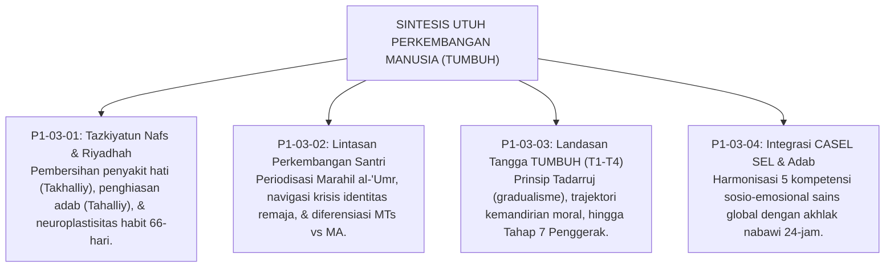

# P1-03-05: SINTESIS FILOSOFIS PERKEMBANGAN MANUSIA
## *Konsolidasi Paradigma Pertumbuhan Holistik: Dari Tazkiyah Ruhani Menuju Kemandirian Karakter Paripurna*

**Nomor Identifikasi**: `P1-03-05/SINTESIS-HUMAN-DEVELOPMENT/2026`  
**Domain**: `01 Philosophy` > `03 Human Development`  
**Dewan Pakar**: `pakar-filosofi-tumbuh`, `pakar-epistemologi-turats`, `pakar-neurosains-perkembangan`

---

## 📑 DAFTAR ISI ANALITIS

1. [1. Integrasi Empat Pilar Pertumbuhan Manusia](#1-integrasi-empat-pilar-pertumbuhan-manusia)
2. [2. Matriks Epistemologis: Domain Human Development TUMBUH](#2-matriks-epistemologis-domain-human-development-tumbuh)
3. [3. Jembatan Filosofis Menuju Sub-Domain 04 (Education & Ta'dib)](#3-jembatan-filosofis-menuju-sub-domain-04-education--tadib)
4. [4. Prinsip Abadi Pertumbuhan Santri TUMBUH](#4-prinsip-abadi-pertumbuhan-santri-tumbuh)

---

### 1. Integrasi Empat Pilar Pertumbuhan Manusia

Sub-Domain `03 Human Development` telah merumuskan cetak biru ilmiah dan spiritual bagaimana fitrah santri bertumbuh dan berkembang melalui empat pilar terpadu:

---

### 2. Matriks Epistemologis: Domain Human Development TUMBUH

| Modul Analisis | Landasan Turats Klasik | Landasan Sains Kontemporer | Manifestasi Praktis di Asrama |
| :--- | :--- | :--- | :--- |
| **P1-03-01 (Tazkiyatun Nafs)** | Al-Ghazali (*Ihya*), QS. Asy-Syams: 9–10, Muhasibi (*Adab an-Nufus*). | *Neuroplasticity & Habit Formation 66-Day* (Phillippa Lally, UCL). | Rutinitas asrama 24-jam sebagai kurikulum riyadhah pembiasaan otomatis. |
| **P1-03-02 (Lintasan Usia)** | *Marahil al-'Umr*, HR. Abu Dawud (Tamyiz & Shalat), Taklif Bulugh. | *Psychosocial Stages* (Erikson) & *Dual-Systems Model* (Steinberg). | Pendampingan kehangatan untuk MTs dan pemberdayaan mentor untuk MA. |
| **P1-03-03 (Tangga T1–T4)** | *Prinsip Tadarruj Syar'i*, HR. Bukhari (Aisyah RA), Sunnatullah. | *Scaffolding Theory* (Vygotsky) & *Ipsative Growth Assessment*. | Trajektori kemajuan adaptasi (T1) hingga keteladanan penggerak (T4). |
| **P1-03-04 (Integrasi SEL)** | *Adab al-Mu'asyarah* (An-Nawawi), HR. Muslim (Ukhuwah Satu Tubuh). | *5 Core Competencies SEL Framework* (CASEL, Durlak et al.). | Circle restoratif kamar, morning check-in, dan resolusi konflik damai. |

---

### 3. Jembatan Filosofis Menuju Sub-Domain 04 (Education & Ta'dib)

Setelah memahami hakikat manusia (*Human Nature*) dan dinamika pertumbuhannya (*Human Development*), pertanyaan pokok berikutnya adalah: **bagaimana rekayasa pedagogis dan sistem pendidikan (*Education*) dirancang untuk memfasilitasi pertumbuhan tersebut?**

Diskursus ini akan dibedah secara tuntas pada **Sub-Domain `04 Education`**, yang menguraikan redefinisi *Ta'dib vs Tarbiyah vs Ta'lim*, kritik model perbankan Freirean, pedagogi dialogis sorogan, dan integrasi kurikulum 24 jam.

---

### 4. Prinsip Abadi Pertumbuhan Santri TUMBUH

> *"Pertumbuhan karakter bukanlah hasil dari paksaan yang menindas, melainkan buah dari benih fitrah suci yang disiram dengan keteladanan (*Qudwah*), dipupuk dengan pembiasaan sabar (*Riyadhah*), dipangkas dari hama maksiat dengan disiplin restoratif (*Tazkiyah*), dan disinari dengan cahaya kasih sayang ilahi dalam naungan Bi'ah Shalihah."*
