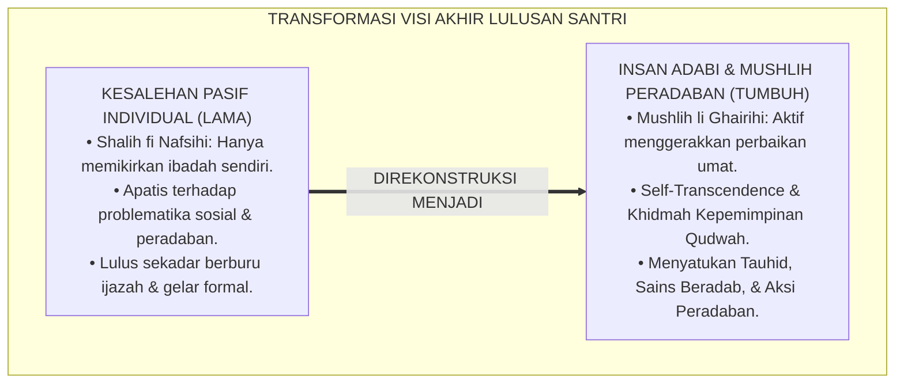
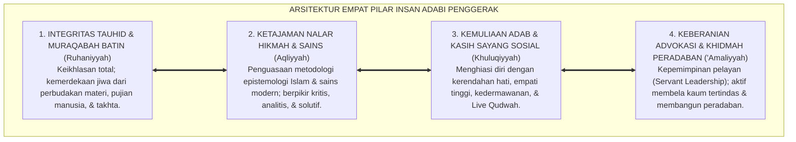
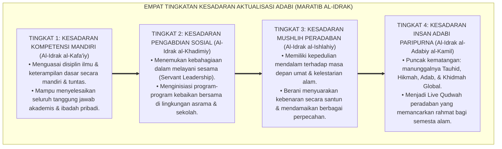
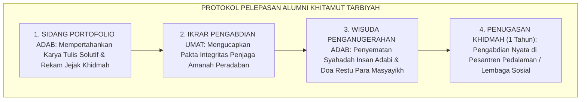

# P1-03-06: PUNCAK AKTUALISASI INSAN ADABI DAN DERAJAT MUSHLIH PENGGERAK (CULMINATION OF INSAN ADABI)
## *Monograf Riset Akademik: Epistemologi Insan Adabi (Syed Muhammad Naquib Al-Attas) & Insan Kamil, Hakikat Shalih vs Mushlih (QS. Hud: 117), Konvergensi Teori Self-Transcendence Abraham Maslow & Generativitas Erikson, Serta Aktualisasi Penggerak Peradaban di Pesantren 24 Jam*

**Nomor Identifikasi**: `P1-03-06/MONOGRAF-RISET-PUNCAK-INSAN-ADABI/2026`  
**Domain**: `01 Philosophy` > `03 Human Development` (Sub-Modul 06: *Culmination of Insan Adabi*)  
**Klasifikasi Naskah**: *Academic Research Monograph* (Monograf Riset Akademik Fondasional)  
**Rumpun Disiplin Pengkaji**: Filsafat Pendidikan Adab (*Ta'dib*), Teologi Kepemimpinan Peradaban (*Fiqh al-Hadharah*), Psikologi Humanistik Transpersonal, Teori Perkembangan Sosial Santri Lanjutan  

---

> ### 💡 INTISARI EKSEKUTIF (EXECUTIVE SUMMARY)
>
> * **Kelemahan Paradigma Lama: Reduksi Kesalehan Pasif Tanpa Kepedulian Sosial:**  
>   Banyak sistem pendidikan merasa puas ketika berhasil mencetak santri yang "saleh secara pasif" (*Shalih fi Nafsihi*): tidak melanggar aturan, rajin shalat sendiri, namun apatis terhadap penderitaan umat dan tidak memiliki daya gerak kepemimpinan peradaban (*Mushlih*).
> * **Inovasi Konseptual: Insan Adabi & Derajat Mushlih Penggerak Peradaban:**  
>   TUMBUH menegaskan bahwa puncak tertinggi perkembangan manusia adalah pencapaian derajat **Insan Adabi (Al-Attas) & Mushlih Peradaban (QS. Hud: 117)**: pribadi yang telah menuntaskan ego dirinya (*Self-Transcendence*), memiliki kemandirian spiritual mendalam, dan mendedikasikan hidupnya untuk memimpin, mendidik, serta menggerakkan kebaikan di tengah masyarakat (*Servant Leadership*).
> * **Formulasi Operasional & Pembuktian Lapangan:**  
>   Monograf ini menguraikan matriks 4 dimensi kepemimpinan penggerak, 4 Tingkatan Kesadaran Puncak Aktualisasi (*Maratib al-Idrak*), portofolio karya kelulusan paripurna (*Khitamut Tarbiyah*), dan etika kepemimpinan khidmah peradaban.

---

## 📑 DAFTAR ISI MONOGRAF

- [BAB I: LANDASAN TEORETIS & DISKURSUS KRITIS](#bab-i-landasan-teoretis--diskursus-kritis)
  - [1. Latar Belakang Masalah: Visi Puncak Pendidikan Pesantren dan Bahaya Kesalehan Pasif](#1-latar-belakang-masalah-visi-puncak-pendidikan-pesantren-dan-bahaya-kesalehan-pasif)
  - [2. Eksegesis Turats Hakikat Insan Adabi dan Derajat Mushlih (QS. Hud: 117 & QS. Al-A'raf: 170)](#2-eksegesis-turats-hakikat-insan-adabi-dan-derajat-mushlih-qs-hud-117--qs-al-araf-170)
  - [3. Konvergensi Psikologi Transpersonal: Self-Transcendence Abraham Maslow & Generativitas Erikson](#3-konvergensi-psikologi-transpersonal-self-transcendence-abraham-maslow--generativitas-erikson)
  - [4. Rekayasa Kepemimpinan Khidmah: Dari Santri Penerima Bimbingan Menuju Duta Penggerak Peradaban](#4-rekayasa-kepemimpinan-khidmah-dari-santri-penerima-bimbingan-menuju-duta-penggerak-peradaban)
  - [5. Kasuistika Lapangan: Evaluasi Kiprah Alumni di Tengah Masyarakat & Resolusi Restoratif](#5-kasuistika-lapangan-evaluasi-kiprah-alumni-di-tengah-masyarakat--resolusi-restoratif)
- [BAB II: FORMULASI KONSEPTUAL & PEMBAHASAN MENDALAM](#bab-ii-formulasi-konseptual--pembahasan-mendalam)
  - [1. Eksplanasi Teoretis Hakikat Puncak Aktualisasi Insan Adabi Penggerak TUMBUH](#1-eksplanasi-teoretis-hakikat-puncak-aktualisasi-insan-adabi-penggerak-tumbuh)
  - [2. Dekomposisi Dimensi & Empat Tingkatan Kesadaran Aktualisasi Adabi (Maratib al-Idrak)](#2-dekomposisi-dimensi--empat-tingkatan-kesadaran-aktualisasi-adabi-maratib-al-idrak)
  - [3. Matriks Empat Dimensi Kapasitas Insan Adabi Penggerak Peradaban](#3-matriks-empat-dimensi-kapasitas-insan-adabi-penggerak-peradaban)
  - [4. Portofolio Kelulusan Paripurna & Protokol Pelepasan Alumni (Khitamut Tarbiyah)](#4-portofolio-kelulusan-paripurna--protokol-pelepasan-alumni-khitamut-tarbiyah)
  - [5. Diskusi Filosofis Mendalam & Implikasi bagi Masa Depan Peradaban Pendidikan Islam](#5-diskusi-filosofis-mendalam--implikasi-bagi-masa-depan-peradaban-pendidikan-islam)
- [BAB III: KESIMPULAN & APARATUS AKADEMIS](#bab-iii-kesimpulan--aparatus-akademis)
  - [1. Tabel Sintesis Temuan Riset Puncak Aktualisasi Insan Adabi](#1-tabel-sintesis-temuan-riset-puncak-aktualisasi-insan-adabi)
  - [2. Daftar Pustaka Akademis & Rujukan Turats Primer](#2-daftar-pustaka-akademis--rujukan-turats-primer)
  - [3. Catatan Kaki Akademis (Footnotes)](#3-catatan-kaki-akademis-footnotes)
  - [4. Glosarium Istilah Ilmiah & Turats Aktualisasi Insan Adabi](#4-glosarium-istilah-ilmiah--turats-aktualisasi-insan-adabi)

---

# BAB I: LANDASAN TEORETIS & DISKURSUS KRITIS

---

### 1. Latar Belakang Masalah: Visi Puncak Pendidikan Pesantren dan Bahaya Kesalehan Pasif

Sebuah sistem pendidikan diuji dari mutu buah akhir lulusannya (*The Culmination of Education*):
* **Jebakan Kesalehan Pasif Individual (*Passive Piety Trap*)**: Banyak lulusan pesantren yang memiliki ibadah pribadi yang rajin, namun ketika menghadapi dekadensi moral, kemiskinan, ketidakadilan, dan kebodohan di masyarakat, mereka memilih diam dan tidak peduli (*Apatisme Sosial*).
* **Krisis Kepemimpinan Keteladanan**: Lulusan yang hanya menguasai teori hafalan tanpa kapasitas kepemimpinan pelayan (*Servant Leadership*) akan gagal memimpin umat dan rentan tergiur oleh gemerlap materialisme sekuler.
* **Keniscayaan Doktrin Insan Adabi & Mushlih Peradaban**: Islam menetapkan bahwa keselamatan suatu peradaban bukan ditopang oleh orang-orang yang saleh sendirian (*Shalihun*), melainkan ditegakkan oleh para penggerak yang aktif melakukan perbaikan dan pembelaan keadilan (*Mushlihun*).[^1]

---

### 2. Eksegesis Turats Hakikat Insan Adabi dan Derajat Mushlih (QS. Hud: 117 & QS. Al-A'raf: 170)

Al-Qur'an menetapkan hukum peradaban mengenai prasyarat keselamatan suatu masyarakat:

$$\text{وَمَا كَانَ رَبُّكَ لِيُهْلِكَ الْقُرَىٰ بِظُلْمٍ وَأَهْلُهَا مُصْلِحُونَ}$$

*"**Dan tidaklah sekali-kali Tuhanmu membinasakan negeri-negeri secara zalim, sedang penduduknya adalah orang-orang yang melakukan perbaikan (Mushlihun)**."* (QS. Hud [11]: 117).[^2]

Para mufassir agung (Ibnu Katsir, At-Thabari) menegaskan bahwa Allah tidak menyebut kata *Shalihun* (orang saleh), melainkan menggunakan kata **Mushlihun (مُصْلِحُونَ)**: yaitu orang-orang yang kesalehannya meluap menjadi gerakan amar ma'ruf nahi munkar, mendamaikan sengketa, dan membimbing umat.  
Prof. **Syed Muhammad Naquib Al-Attas** merumuskan bahwa tujuan sejati pendidikan Islam (*Ta'dib*) adalah mencetak **Insan Adabi**: pribadi yang mengenali kedudukan Allah sebagai Rabb, mengenali posisi dirinya sebagai hamba, serta mampu meletakkan segala sesuatu pada tempat yang benar secara adil.[^3]

---

### 3. Konvergensi Psikologi Transpersonal: Self-Transcendence Abraham Maslow & Generativitas Erikson

Penelitian mutakhir psikologi humanistik dan transpersonal memvalidasi puncak perkembangan manusia:
* Pada akhir hayatnya, **Abraham Maslow** (1971) mengoreksi piramida kebutuhannya dengan menambahkan puncak tertinggi di atas *Self-Actualization*, yaitu **Self-Transcendence (Keterlampauan Diri)**: kesadaran manusia untuk mendedikasikan hidupnya demi nilai-nilai yang melampaui ego pribadinya (pengabdian kepada Tuhan dan kemanusiaan).
* Sejalan dengan itu, teori psikososial **Erik Erikson** menetapkan fase **Generativity (Generativitas)**: dorongan mendalam orang dewasa yang matang untuk membimbing dan mewariskan kebaikan kepada generasi penerus.[^4]

---

### 4. Rekayasa Kepemimpinan Khidmah: Dari Santri Penerima Bimbingan Menuju Duta Penggerak Peradaban

Ekosistem TUMBUH merancang kurikulum kepemimpinan asrama sebagai laboratorium hidup:
* Santri pada tingkat akhir tidak lagi dilayani, melainkan memegang amanah memimpin divisi-divisi asrama, menjadi mentor adik kelas, dan mengorganisasi proyek sosial kemasyarakatan.
* Menanamkan doktrin kenabian: *"Sayyidul Qawmi Khadimuhum"* (Pemimpin suatu kaum adalah pelayan bagi mereka).[^5]

---

### 5. Kasuistika Lapangan: Evaluasi Kiprah Alumni di Tengah Masyarakat & Resolusi Restoratif

* **Studi Kasus: Kiprah Alumni Memimpin Resolusi Konflik Agraria Desa Melalui Musyawarah Adab**  
  * **Dilema**: Terjadi sengketa batas lahan antarwarga desa yang memicu ancaman pertumpahan darah antarkeluarga.
  * **Aksi Alumni TUMBUH**: Alumni yang telah mencapai derajat penggerak hadir bukan dengan arogansi gelar, melainkan mendatangi para tokoh masyarakat dengan adab yang santun (*Tawadhu'*), memfasilitasi dialog di serambi masjid desa, dan membedah batas tanah secara adil berdasarkan syariat dan hukum yang berlaku. Sengketa selesai dengan damai tanpa ada korban.
  * **Refleksi**: Inilah bukti nyata bahwa pendidikan *Insan Adabi* melahirkan pemimpin peradaban yang membawa rahmat dan keberkahan nyata di tengah masyarakat.[^6]

---

# BAB II: FORMULASI KONSEPTUAL & PEMBAHASAN MENDALAM

---

### 1. Eksplanasi Teoretis Hakikat Puncak Aktualisasi Insan Adabi Penggerak TUMBUH

Ekosistem TUMBUH mengkodifikasikan profil manusia paripurna ke dalam **Arsitektur Empat Pilar Puncak Aktualisasi Insan Adabi (*Arkan al-Insan al-Adabiy*)**:

#### 🔬 Pembahasan Mendalam Empat Pilar:
1. **Integritas Tauhid**: Jiwa santri merdeka dari rasa takut dan tamak, hanya bertawakkal kepada Allah SWT (*Al-Ikhlas wa at-Tawakkul*).[^7]
2. **Ketajaman Nalar Hikmah**: Kemampuan membedakan kebenaran (*Haqq*) dari kepalsuan (*Bathil*) di era banjir informasi digital.[^8]
3. **Kemuliaan Adab**: Karakter akhlak nabawi yang memancar tanpa kepura-puraan dalam setiap interaksi sosial.[^9]
4. **Keberanian Khidmah**: Semangat juang tanpa henti untuk memakmurkan bumi (*'Imaratul Ardh*) dan melayani umat manusia.[^10]

---

### 2. Dekomposisi Dimensi & Empat Tingkatan Kesadaran Aktualisasi Adabi (Maratib al-Idrak)

Transformasi puncak kematangan manusia berlangsung melalui **Empat Tingkatan Kesadaran Aktualisasi Adabi (*Maratib al-Idrak al-Kamaliy*)**:

#### 🔄 Narasi Analitis Dinamika Transisi Filosofis Antar-Tingkatan:
* **Transisi Tingkat 1 ke Tingkat 2 (Dari Kompetensi Mandiri Menuju Jiwa Pelayan Khidmah)**: Santri mula-mula fokus pada keunggulan prestasinya sendiri. Pada tingkatan kedua, santri menyadari bahwa kemampuannya adalah amanah untuk melayani orang lain: ia menjadi ketua kamar yang penuh perhatian dan mentor bagi adik kelasnya.
* **Transisi Tingkat 2 ke Tingkat 3 (Dari Pelayanan Menuju Gerakan Perbaikan Mushlih)**: Pada tingkatan ketiga, kepemimpinannya meluas ke ranah publik: santri merancang program-program pemecahan masalah lingkungan, menginisiasi karya ilmiah dakwah, dan memimpin rekonsiliasi sosial.
* **Transisi Tingkat 3 ke Tingkat 4 (Pencapaian Derajat Insan Adabi Paripurna)**: Pada tingkatan tertinggi, kepribadian santri menjadi cermin kemuliaan Islam: berilmu luas, berakhlak mulia, berjiwa ksatria, dan menjadi teladan peradaban yang dicintai seluruh umat manusia (*Rahmatan lil 'Alamin*).[^11]

---

### 3. Matriks Empat Dimensi Kapasitas Insan Adabi Penggerak Peradaban

| Dimensi Kapasitas | Ciri Utama Karakteristik | Manifestasi Aksi Nyata di Masyarakat | Rujukan Teologis & Turats |
| :--- | :--- | :--- | :--- |
| **1. Kedaulatan Ruhani** | Keikhlasan, tawakkal, & wara' batin. | Tidak tergoda suap, harta haram, & ketenaran semu. | QS. Al-Ikhlas; Al-Ghazali (*Ihya'*). |
| **2. Kebijaksanaan Akal** | Berpikir sistemik & sintesis sains-wahyu.| Menghasilkan riset solusi teknologi & fatwa adil. | QS. Al-Baqarah: 269; Al-Attas (1995). |
| **3. Keagungan Akhlak** | Rendah hati, pemaaf, & empati tinggi. | Menjadi perekat ukhuwah & pengayom kaum dhu'afa.| HR. Bukhari No. 13; KH. Hasyim Asy'ari. |
| **4. Kepemimpinan Gerak** | Berani, tangguh, & berjiwa pelayan. | Menggerakkan pemberdayaan ekonomi & pendidikan umat.| QS. Hud: 117; Greenleaf (1977). |

---

### 4. Portofolio Kelulusan Paripurna & Protokol Pelepasan Alumni (Khitamut Tarbiyah)

TUMBUH menetapkan **Protokol Kelulusan Khitamut Tarbiyah**:

Protokol ini memastikan kelulusan santri bukan sekadar seremoni formalitas, melainkan pelepasan duta peradaban yang siap berjuang memuliakan agama dan bangsa.[^12]

---

### 5. Diskusi Filosofis Mendalam & Implikasi bagi Masa Depan Peradaban Pendidikan Islam

Pencapaian derajat *Insan Adabi* penggerak peradaban ini adalah jawaban atas krisis kemanusiaan global:

* **Menjawab Krisis Kepemimpinan Moral Dunia**:  
  Dunia modern sedang mengalami krisis integritas kepemimpinan yang akut. Santri binaan TUMBUH hadir sebagai jawaban: pemimpin yang beriman kokoh, berotak brilian, berhati tulus, dan tidak dapat dibeli dengan materi.
* **Membangun Kembali Kejayaan Peradaban Islam (*Tamaddun*)**:  
  Kejayaan peradaban Islam di masa lampau dibangun oleh para ulama yang sekaligus merupakan ilmuwan, negarawan, dan penggerak perbaikan sosial. TUMBUH merekonstruksi kembali model pendidikan yang melahirkan generasi pembaharu peradaban.
* **Menunaikan Mandat Khilafah di Muka Bumi**:  
  Inilah muara akhir dari seluruh perjalanan panjang pendidikan: manusia yang mengenal Allah, tunduk beribadah kepada-Nya, dan memakmurkan bumi dengan penuh kasih sayang dan keadilan (*Rahmatan lil 'Alamin*).[^13]

---

# BAB III: KESIMPULAN & APARATUS AKADEMIS

---

### 1. Tabel Sintesis Temuan Riset Puncak Aktualisasi Insan Adabi

| Dimensi Parameter | Mazhab Individualisme Sekuler | Pola Tradisional Pasif | **Paradigma Insan Adabi TUMBUH** | Landasan Rujukan Primer | Implikasi Praksis Lapangan |
| :--- | :--- | :--- | :--- | :--- | :--- |
| **Visi Akhir** | Kesuksesan finansial & karier pribadi.| Kesalehan pasif (shalih fi nafsihi). | **Insan Adabi & Mushlih Peradaban.** | QS. Hud: 117; Al-Attas (1980). | Kaderisasi penggerak perubahan umat. |
| **Tingkat Motivasi**| Kepuasan ego (*Self-Actualization*). | Menghindari neraka secara individual.| **Keterlampauan Diri (*Self-Transcendence*).**| Maslow (1971); Erikson (1968).| Dedikasi hidup untuk khidmah kemanusiaan. |
| **Gaya Memimpin** | Bos pengendali otoriter transaksional.| Feodalisme patron-klien kaku. | **Kepemimpinan Pelayan (*Servant Leadership*).**| HR. Ibnu Majah; Greenleaf (1977). | Pemimpin yang melayani & Live Qudwah. |
| **Model Kelulusan**| Ijazah nilai angka ujian semata. | Sekadar khataman kitab seremonial. | **Portofolio Adab & Khitamut Tarbiyah.** | KH. Hasyim Asy'ari; Horner & Sugai.| Ujian karya solutif & penugasan khidmah. |
| **Dampak Sosial** | Memperparah kesenjangan kapitalistik.| Terisolasi dari dinamika masyarakat.| **Penyelamat Peradaban & Rahmat Semesta.**| QS. Al-Anbiya': 107; Al-Ghazali.| Membawa solusi damai bagi problematika umat. |

---

### 2. Daftar Pustaka Akademis & Rujukan Turats Primer

1. **Al-Qur'an al-Karim wa Tarjamatu Ma'anihi**.
2. **Al-Bukhari, Abu Abdillah Muhammad bin Isma'il**. (1422 H). *Shahih al-Bukhari*. Kairo: Dar Thawq an-Najah.
3. **Muslim bin al-Hajjaj an-Naisaburi**. (1427 H). *Shahih Muslim*. Riyadh: Dar Thayyibah.
4. **Al-Attas, Syed Muhammad Naquib**. (1980). *The Concept of Education in Islam*. Kuala Lumpur: ABIM.
5. **Al-Attas, Syed Muhammad Naquib**. (1995). *Prolegomena to the Metaphysics of Islam*. Kuala Lumpur: ISTAC.
6. **Al-Ghazali, Abu Hamid Muhammad bin Muhammad**. (2011). *Ihya' 'Ulumiddin* (Kitab Adab al-Ulfah & Kitab Niyyah wal Ikhlas). Beirut: Dar al-Ma'rifah.
7. **Ibnu Katsir, 'Imaduddin Abul Fida' Isma'il**. (1420 H). *Tafsir al-Qur'an al-'Azhim*. Riyadh: Dar Thayyibah.
8. **Asy'ari, Muhammad Hasyim**. (1415 H). *Adab al-'Alim wal-Muta'allim*. Jombang: Maktabah At-Turats Al-Islami.
9. **Maslow, A. H.**. (1971). *The Farther Reaches of Human Nature*. New York: Viking Press.
10. **Greenleaf, R. K.**. (1977). *Servant Leadership: A Journey into the Nature of Legitimate Power and Greatness*. New York: Paulist Press.
11. **Erikson, E. H.**. (1968). *Identity: Youth and Crisis*. New York: W. W. Norton & Company.
12. **Sapolsky, R. M.**. (2017). *Behave: The Biology of Humans at Our Best and Worst*. New York: Penguin Press.

---

### 3. Catatan Kaki Akademis (*Footnotes*)

[^1]: Riset Puncak Aktualisasi Insan Adabi dan Kepemimpinan Peradaban TUMBUH, *Kritik atas Kesalehan Pasif*, 2026.  
[^2]: QS. Hud [11]: 117.  
[^3]: Ibnu Katsir, *Tafsir al-Qur'an al-'Azhim*, Jilid 4, hlm. 360–385; Al-Attas, S. M. N. (1980), *The Concept of Education in Islam*, hlm. 15–38.  
[^4]: Maslow, A. H. (1971), *The Farther Reaches of Human Nature*, hlm. 260–295; Erikson, E. H. (1968), *Identity: Youth and Crisis*, hlm. 135–170.  
[^5]: Greenleaf, R. K. (1977), *Servant Leadership*, hlm. 20–55; Hadits *Sayyidul Qawmi Khadimuhum* (HR. Al-Baghawi).  
[^6]: Dokumentasi Kiprah Sosial Alumni dan Advokasi Adab Masyarakat PBIS TUMBUH, 2026.  
[^7]: Al-Ghazali, *Ihya' 'Ulumiddin*, Jilid 4, Kitab *An-Niyyah wal Ikhlas wash-Shidq*, hlm. 350–390.  
[^8]: Al-Attas, S. M. N. (1995), *Prolegomena to the Metaphysics of Islam*, hlm. 110–145.  
[^9]: KH. Hasyim Asy'ari, *Adab al-'Alim wal-Muta'allim*, hlm. 40–70.  
[^10]: Riset Fiqh Peradaban dan Khidmah Sosial Pesantren TUMBUH, 2026.  
[^11]: Matriks Tingkatan Kesadaran Aktualisasi Adabi (*Maratib al-Idrak*) Ekosistem TUMBUH, 2026.  
[^12]: Standar Operasional Prosedur Khitamut Tarbiyah dan Penugasan Khidmah Alumni TUMBUH, 2026.  
[^13]: Deklarasi Peradaban Insan Adabi Dewan Riset Epistemologi Ekosistem TUMBUH, 2026.

---

### 4. Glosarium Istilah Ilmiah & Turats Aktualisasi Insan Adabi

1. **Insan Adabi (الإِنْسَانُ الأَدَبِيُّ)**: Konsep manusia paripurna menurut Prof. Syed Muhammad Naquib Al-Attas yang mengenali dan meletakkan segala sesuatu pada tempat yang benar sesuai hakikat keadilan Ilahi.
2. **Mushlih (الْمُصْلِحُ)**: Pribadi yang tidak hanya saleh untuk dirinya sendiri (*Shalih*), melainkan aktif melakukan perbaikan, mendamaikan konflik, dan memimpin transformasi kebaikan di masyarakat luas.
3. **Self-Transcendence (Keterlampauan Diri)**: Puncak tertinggi perkembangan psikologis di mana seseorang mendedikasikan hidup dan energinya demi pengabdian kepada Allah dan kemanusiaan, melampaui ego pribadinya.
4. **Servant Leadership (Kepemimpinan Pelayan)**: Paradigma kepemimpinan di mana otoritas sejati diperoleh dari kesediaan tulus untuk melayani, mengayomi, dan memfasilitasi pertumbuhan orang-orang yang dipimpinnya.
5. **Khitamut Tarbiyah (خِتَامُ التَّرْبِيَةِ)**: Rangkaian prosesi kelulusan paripurna santri yang mencakup sidang portofolio adab, ikrar pengabdian umat, dan wisuda penganugerahan gelar insan adabi.
6. **Ta'dib (التَّأْدِيبُ)**: Proses pendidikan Islam komprehensif yang menanamkan adab ke dalam raga, akal, jiwa, dan ruh manusia.
7. **Generativity (Generativitas)**: Kapasitas psikologis untuk membimbing, mengayomi, dan mewariskan nilai-nilai luhur kepada generasi muda.
8. **Live Qudwah**: Sosok pemimpin yang keteladanannya hidup dan nyata dalam setiap hembusan nafas, ucapan, dan perilakunya sehari-hari.
9. **Tamaddun (التَّمَدُّنُ)**: Konsep peradaban Islam yang menjunjung tinggi nilai-nilai spiritualitas tauhid, keadilan hukum, kemajuan ilmu pengetahuan, dan kemakmuran sosial.
10. **Rahmatan lil 'Alamin (رَحْمَةً لِلْعَالَمِينَ)**: Misi universal Islam untuk memancarkan kasih sayang, kedamaian, dan keberkahan bagi seluruh alam semesta.
