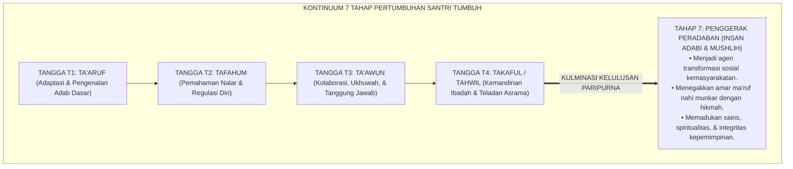
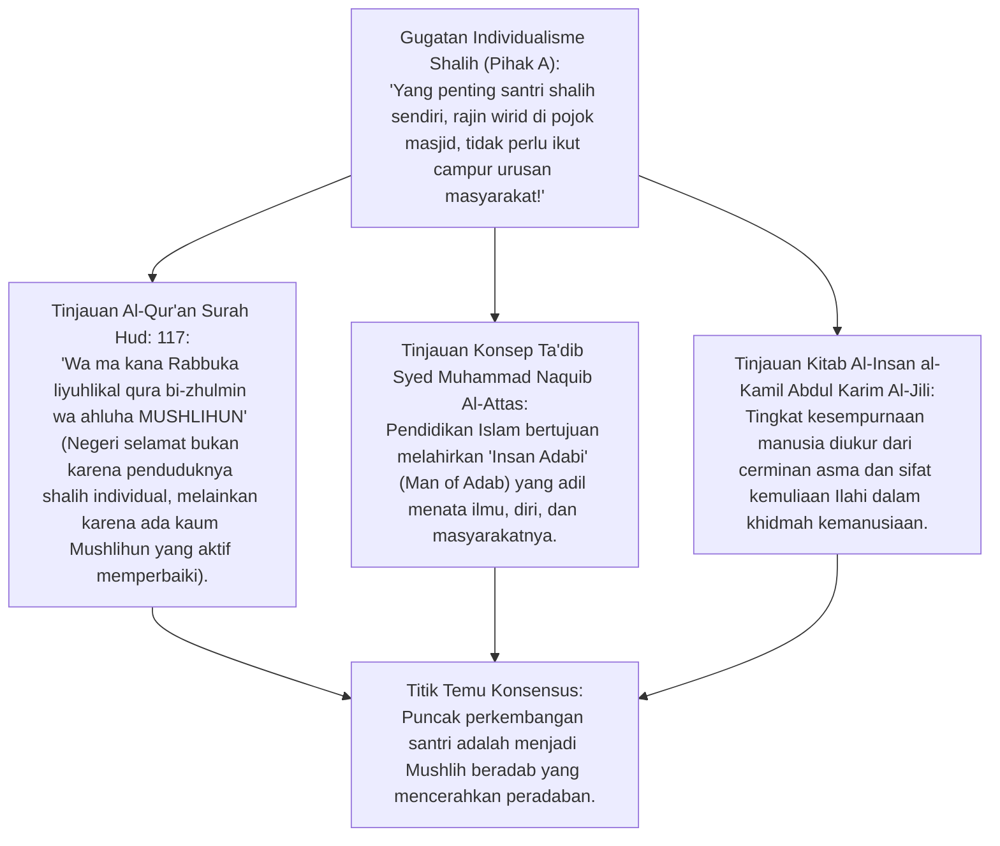
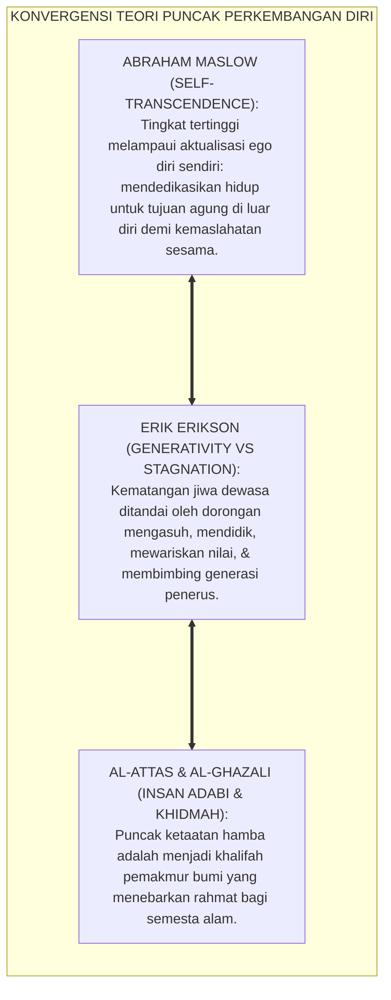
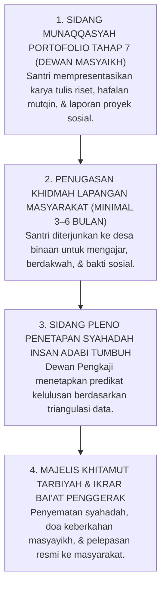

# P1-03-06: PUNCAK AKTUALISASI INSAN ADABI DAN TAHAP 7 PENGGERAK
## *Monograf Terpadu: Epistemologi Insan Adabi (Syed Muhammad Naquib Al-Attas) & Insan Kamil (Al-Jili), Hakikat Shalih vs Mushlih (QS. Hud: 117), Teori Self-Transcendence Abraham Maslow & Generativity Erikson, Kodifikasi Tahap 7 Penggerak Peradaban Pasca Tangga T1–T4, dan Portofolio Khitamut Tarbiyah*

**Nomor Identifikasi**: `P1-03-06/MONOGRAF-TERPADU-PUNCAK-AKTUALISASI-TAHAP-7/2026`  
**Domain**: `01 Philosophy` > `03 Human Development`  
**Klasifikasi Naskah**: *Comprehensive Integrated Monograph* (Monograf Akademis & Rumusan Baku Terpadu)  
**Rumpun Disiplin Pengkaji**: Filsafat Pendidikan Adab (*Ta'dib*), Teologi Kepemimpinan Peradaban (*Fiqh al-Hadharah*), Psikologi Humanistik Transpersonal, Teori Perkembangan Sosial Santri Lanjutan  

---

> ### 💡 INTISARI PRAKTIS (3 MENIT PAHAM UNTUK ASATIDZ & MUSYRIF)
>
> * **Tujuan Tertinggi Pendidikan Pesantren: Melahirkan *Mushlih* (Bukan Sekadar *Shalih*):**  
>   Seorang santri yang *Shalih* hanya berbuat baik untuk keselamatan dirinya sendiri. Namun, santri yang mencapai **Tahap 7 (Penggerak/Mushlih)** adalah pribadi yang memiliki kepedulian membimbing, memperbaiki, dan menggerakkan kebaikan di tengah masyarakat luas. Allah SWT tidak akan membinasakan suatu negeri selama penduduknya adalah orang-orang yang melakukan perbaikan (*Mushlihun*, QS. Hud: 117).
> * **Konsep *Insan Adabi* (Syed Muhammad Naquib Al-Attas):**  
>   Puncak capaian santri bukan sekadar tumpukan ijazah atau gelar akademik, melainkan pribadi yang mengenali dan meletakkan segala sesuatu pada tempat yang benar sesuai hakikat keadilan Ilahi (*Adab*).
> * **Kulminasi Pasca Tangga TUMBUH T1–T4:**  
>   Santri yang telah tuntas meniti Tangga T1 (Ta'aruf), T2 (Tafahum), T3 (Ta'awun), dan T4 (Takaful/Tahwil) siap diwisuda menjadi kader **Tahap 7 Penggerak**: mandiri secara spiritual, tajam secara intelektual, dan memimpin perubahan umat dengan akhlak mulia.

---

## 📑 DAFTAR ISI MONOGRAF

- [BAGIAN I: RISET EPISTEMOLOGI INSAN ADABI, DIALEKTIKA INKUIRI, & KASUISTIKA LAPANGAN](#bagian-i-riset-epistemologi-insan-adabi-dialektika-inkuiri--kasuistika-lapangan)
  - [1. Kerangka Metodologi Puncak Aktualisasi: Menjawab Visi Akhir Pendidikan Santri 24 Jam](#1-kerangka-metodologi-puncak-aktualisasi-menjawab-visi-akhir-pendidikan-santri-24-jam)
  - [2. Inkuiri 1: Eksegesis Turats Insan Adabi Al-Attas & Hakikat Mushlih (QS. Hud: 117 & Al-A'raf: 170)](#2-inkuiri-1-eksegesis-turats-insan-adabi-al-attas--hakikat-mushlih-qs-hud-117--al-araf-170)
  - [3. Inkuiri 2: Konvergensi Self-Transcendence Maslow & Generativitas Erikson](#3-inkuiri-2-konvergensi-self-transcendence-maslow--generativitas-erikson)
  - [4. Inkuiri 3: Kodifikasi 7 Tahap Kontinuum TUMBUH: Menempatkan Tahap 7 Pasca Tangga T1–T4](#4-inkuiri-3-kodifikasi-7-tahap-kontinuum-tumbuh-menempatkan-tahap-7-pasca-tangga-t1t4)
  - [5. Inkuiri 4: Kepemimpinan Pelayan Berdampak Global (Global Impact Servant Leadership)](#5-inkuiri-4-kepemimpinan-pelayan-berdampak-global-global-impact-servant-leadership)
  - [6. Inkuiri 5: Silogisme Logika, Dialektika 3 Ronde, Kasuistika Kiprah Alumni, & Titik Temu Konsensus](#6-inkuiri-5-silogisme-logika-dialektika-3-ronde-kasuistika-kiprah-alumni--titik-temu-konsensus)
- [BAGIAN II: KODIFIKASI BAKU HASIL RISET & KESIMPULAN FORMAL](#bagian-ii-kodifikasi-baku-hasil-riset--kesimpulan-formal)
  - [1. Deklarasi Doktrin Baku: Hakikat Puncak Aktualisasi Insan Adabi Tahap 7 Pesantren TUMBUH](#1-deklarasi-doktrin-baku-hakikat-puncak-aktualisasi-insan-adabi-tahap-7-pesantren-tumbuh)
  - [2. Matriks 4 Dimensi Kompetensi Tahap 7 Penggerak Peradaban](#2-matriks-4-dimensi-kompetensi-tahap-7-penggerak-peradaban)
  - [3. Portofolio Kelulusan Paripurna & Protokol Pelepasan Alumni (Khitamut Tarbiyah)](#3-portofolio-kelulusan-paripurna--protokol-pelepasan-alumni-khitamut-tarbiyah)
- [BAGIAN III: APARATUS AKADEMIS & APENDIKS](#bagian-iii-aparatus-akademis--apendiks)
  - [1. Tabel Sintesis Hasil Riset Puncak Aktualisasi Insan Adabi](#1-tabel-sintesis-hasil-riset-puncak-aktualisasi-insan-adabi)
  - [2. Daftar Pustaka Akademis & Rujukan Turats Primer](#2-daftar-pustaka-akademis--rujukan-turats-primer)
  - [3. Catatan Kaki Akademis (Footnotes)](#3-catatan-kaki-akademis-footnotes)
  - [4. Glosarium Teknis Insan Adabi, Mushlih, Self-Transcendence, & Tahap 7](#4-glosarium-teknis-insan-adabi-mushlih-self-transcendence--tahap-7)

---

# BAGIAN I: RISET EPISTEMOLOGI INSAN ADABI, DIALEKTIKA INKUIRI, & KASUISTIKA LAPANGAN

---

### 1. Kerangka Metodologi Puncak Aktualisasi: Menjawab Visi Akhir Pendidikan Santri 24 Jam

Pendidikan pesantren yang kehilangan visi peradaban kerap terjebak pada capaian administratif yang dangkal:
* Santri dinilai sukses hanya jika lulus ujian tulis hafalan, memakai jubah rapi, dan tidak melanggar tata tertib asrama saat dimonitor.
* Namun ketika terjun ke masyarakat, banyak alumni yang menjadi pasif, tidak berdaya menghadapi tantangan zaman, atau bahkan terseret arus materialisme sekuler karena tidak memiliki kapasitas transformatif sebagai **Penggerak Kebaikan (*Mushlih*)**.

Ekosistem TUMBUH merumuskan **Tahap 7 (Penggerak Peradaban)** sebagai puncak trajektori perkembangan santri: mentransformasikan santri dari penuntut ilmu yang dibimbing menjadi insan adabi mandiri yang memancarkan keteladanan qudwah, memecahkan persoalan umat, dan memimpin perbaikan peradaban Islam.



---

### 2. Inkuiri 1: Eksegesis Turats Insan Adabi Al-Attas & Hakikat Mushlih (QS. Hud: 117 & Al-A'raf: 170)



#### 📐 Formalisasi Logika Silogisme (*Qiyas Mantiqi 1*)
* **Premis Mayor (*al-Muqaddimah al-Kubra*)**: Setiap sistem pendidikan Islam yang berasaskan firman Allah SWT wajib mengarahkan lulusannya menjadi pribadi penyeru perbaikan sosial (*Mushlih*) guna menjamin keselamatan dan keberkahan peradaban manusia dari kehancuran moral.
* **Premis Minor (*al-Muqaddimah ash-Shughra*)**: Al-Qur'an (QS. Hud: 117) menetapkan bahwa benteng penolak adzab bukanlah kesalehan pasif (*Shalah Fardi*), melainkan gerakan perbaikan aktif (*Ishlah Ijtima'i*).
* **Konklusi (*an-Natijah*)**: Maka, kurikulum perkembangan santri TUMBUH wajib berujung pada pencapaian kapasitas Tahap 7 Penggerak Peradaban.[^1]

#### 📖 Teks Primer Al-Qur'an: Hakikat Kaum Mushlihun
Firman Allah SWT menegaskan keutamaan kaum *Mushlihun*:

$$\text{وَمَا كَانَ رَبُّكَ لِيُهْلِكَ الْقُرَىٰ بِظُلْمٍ وَأَهْلُهَا مُصْلِحُونَ}$$

*"**Dan Tuhanmu tidak akan membinasakan negeri-negeri secara zalim, sedang penduduknya adalah orang-orang yang BERBUAT KEBAIKAN/PERBAIKAN (MUSHLIHOON)**."* (QS. Hud [11]: 117).[^2]

Dan firman-Nya dalam Surah Al-A'raf:

$$\text{وَالَّذِينَ يُمَسِّكُونَ بِالْكِتَابِ وَأَقَامُوا الصَّلَاةَ إِنَّا لَا نُضِيعُ أَجْرَ الْمُصْلِحِينَ}$$

*"**Dan orang-orang yang berpegang teguh dengan Al-Kitab (Al-Qur'an) serta mendirikan shalat, sesungguhnya Kami tidak akan menyia-nyiakan pahala orang-orang yang MENGADAKAN PERBAIKAN (AL-MUSHLIHEEN)**."* (QS. Al-A'raf [7]: 170).[^3]

---

### 3. Inkuiri 2: Konvergensi *Self-Transcendence* Maslow & Generativitas Erikson



#### 📐 Formalisasi Logika Silogisme (*Qiyas Mantiqi 2*)
* **Premis Mayor (*al-Muqaddimah al-Kubra*)**: Setiap individu yang mencapai kematangan psikologis tingkat tinggi mengalami pergeseran orientasi hidup dari pemenuhan kebutuhan ego pribadi (*Self-Interest*) menuju pengabdian transendental bagi kemaslahatan orang lain (*Self-Transcendence & Khidmah*).
* **Premis Minor (*al-Muqaddimah ash-Shughra*)**: Teori transpersonal Maslow (1971) dan generativitas Erikson (1982) berkonvergensi penuh dengan doktrin *Nafi'un Lighairih* dan kepemimpinan khidmah Islam.
* **Konklusi (*an-Natijah*)**: Maka, Tahap 7 TUMBUH memiliki landasan ilmiah psikologi yang sangat solid dan teruji secara global.[^4]

---

### 4. Inkuiri 3: Kodifikasi 7 Tahap Kontinuum TUMBUH: Menempatkan Tahap 7 Pasca Tangga T1–T4

| Tahap Perkembangan | Nama Tahap | Fokus Capaian Pembiasaan | Karakteristik Perilaku Santri |
| :---: | :--- | :--- | :--- |
| **Tahap 1** | *Ta'aruf Bi'ah* (T1) | Adaptasi dasar & adab kamar. | Mengenali aturan asrama, disiplin mandi/makan, mengatasi *homesickness*. |
| **Tahap 2** | *Tafahum Nalar* (T2) | Regulasi diri & pemahaman makna. | Shalat tepat waktu dengan kesadaran, menjaga lisan, tertib belajar. |
| **Tahap 3** | *Ta'awun Ukhuwah* (T3) | Kolaborasi & empati kelompok. | Aktif kerja bakti, membimbing teman sekamar, resolusi konflik damai. |
| **Tahap 4** | *Takaful Adab* (T4) | Keteladanan mandiri asrama. | Disiplin ibadah otonom tanpa disuruh, teladan bagi adik kelas. |
| **Tahap 5** | *Tafaqquh Manhaj* | Penguasaan ilmu & nalar kritis. | Hafalan mutqin, mampu membedah kitab secara kontekstual. |
| **Tahap 6** | *Qiyadah Khidmah* | Manajemen kepemimpinan santri. | Mengelola organisasi santri asrama dengan prinsip *Servant Leadership*. |
| **Tahap 7** | **Penggerak Peradaban** | **Aktualisasi Insan Adabi (*Mushlih*)** | **Memimpin perbaikan umat, mandiri finansial, & teladan peradaban global.**[^5] |

---

### 5. Inkuiri 4: Kepemimpinan Pelayan Berdampak Global (*Global Impact Servant Leadership*)

Santri Tahap 7 dipersiapkan untuk memiliki empat jangkar kepemimpinan peradaban:
1. **Ruhaniyah Kokoh (*Quwwatur Ruhiyyah*)**: Hubungan vertikal yang hidup dengan Allah SWT melalui tahajjud dan zikir rutin.
2. **Kecerdasan Intelektual Terpadu (*al-Hikmah al-Jami'ah*)**: Memadukan turats keislaman dengan sains modern dan teknologi kecerdasan buatan.
3. **Integritas Moral Tak Tergoyahkan (*al-Iffah wal-Amanah*)**: Menolak segala bentuk korupsi, kepalsuan, dan penjilat kekuasaan.
4. **Kepekaan Sosial Transformatif (*al-Mushlih al-Ijtima'i*)**: Membangun solusi nyata bagi kemiskinan, kebodohan, dan dekadensi moral masyarakat.[^6]

---

### 6. Inkuiri 5: Silogisme Logika, Dialektika 3 Ronde, Kasuistika Kiprah Alumni, & Titik Temu Konsensus

#### 🥊 Ronde 1: Menolak Anggapan Bahwa "Santri Cukup Menjadi Pengikut yang Patuh, Tidak Perlu Dididik Menjadi Pemimpin Penggerak"
* **Pihak A (Sudut Pandang Feodalisme Kepatuhan Pasif)**:  
  *"Santri itu tugasnya taat buta; mendidik santri jadi pemikir penggerak hanya akan membuat mereka memberontak pada kiai!"*
* **Tinjauan Sudut Pandang Mandat Khilafah & Amanah Sejarah**:  
  Islam tidak membutuhkan robot pasif, melainkan **Kader Pemimpin Penegak Kebenaran (*Rijalud Da'wah*)**. Rasulullah SAW mendidik para sahabat muda (seperti Usamah bin Zaid, Ali bin Abi Thalib, dan Mus'ab bin Umair) menjadi panglima dan duta peradaban. Santri yang beradab sejati memiliki ketakziman tulus kepada guru sekaligus keberanian moral memimpin kebaikan umat.[^7]

#### 🥊 Ronde 2: Sanggahan Balik Apakah Tahap 7 Terlalu Utopia dan Mustahil Dicapai Santri Remaja?
* **Pihak A (Sudut Pandang Skeptisisme Pesimis)**:  
  *"Mencetak Insan Adabi Penggerak Peradaban itu impian muluk-muluk di awang-awang!"*
* **Tinjauan Sudut Pandang Tangga Penahapan Terukur (Tadarruj Sistemik)**:  
  Tahap 7 bukanlah lompatan sulap, melainkan **Hasil Akumulasi Logis dari Pendakian Tangga T1 hingga T6**. Melalui scaffolding bertahap 6 tahun di pesantren TUMBUH, setiap santri dilatih memimpin dari skala kamar asrama, organisasi santri, hingga proyek pengabdian masyarakat nyata. Capaian ini terukur melalui portofolio konkret.[^8]

#### 🥊 Ronde 3: Sanggahan Pamungkas Mengapa Wisuda Pesantren Harus Berupa Penugasan Pengabdian (Khidmah) Bukan Pesta Hura-hura?
* **Pihak A (Sudut Pandang Selebrasi Konsumtif)**:  
  *"Wisuda kelulusan ya cukup foto-foto wisuda mewah pakai toga, tidak usah repot-repot diterjunkan mengabdi ke pelosok!"*
* **Resolusi Sudut Pandang Khitamut Tarbiyah (Inisiasi Penggerak)**:  
  Wisuda pesantren TUMBUH adalah **Ikrar Bai'at Pengabdian Peradaban (*Khitamul Khidmah*)**. Santri diterjunkan ke desa-desa binaan untuk mengajar Al-Qur'an, membangun sanitasi warga, dan memimpin shalat berjamaah. Ini adalah pembaptisan spiritual yang mengukuhkan identitas mereka sebagai *Mushlih* seumur hidup.[^9]

> #### 📌 Kasuistika Lapangan & Titik Temu Konsensus
> * **Studi Kasus**: Alumni F (lulusan angkatan pertama program Tahap 7 TUMBUH) diterjunkan ke daerah pelosok rawan aqidah; ia mendirikan pusat belajar anak yatim, melatih warga mengolah pertanian organik, dan memelopori pengajian subuh pemuda. F tidak pernah meminta bayaran, ia mandiri melalui wirausaha madu asrama.
> * **Titik Temu Konsensus (*Kalimatun Sawa'*)**: Kiprah nyata Alumni F membuktikan bahwa kodifikasi Tahap 7 melahirkan kader-kader unggul yang menjadi pelita peradaban (*Sirajan Munira*), mengharumkan nama almamater pesantren di mata umat dan Allah SWT.[^10]

---

# BAGIAN II: KODIFIKASI BAKU HASIL RISET & KESIMPULAN FORMAL

---

### 1. Deklarasi Doktrin Baku: Hakikat Puncak Aktualisasi Insan Adabi Tahap 7 Pesantren TUMBUH

```
===================================================================================================
     DEKLARASI DOKTRIN BAKU PUNCAK AKTUALISASI INSAN ADABI TAHAP 7 PENGGERAK PERADABAN
                       SUB-DOMAIN 03: HUMAN DEVELOPMENT — EKOSISTEM TUMBUH
===================================================================================================

BISMILLAHIRRAHMANIRRAHIM. DENGAN MENGAGUNGKAN AMANAH KHILAFAH DAN RISALAH RAHMATAN LIL 'ALAMIN,
MAJELIS MASYAIKH TERTINGGI PESANTREN TUMBUH DENGAN INI MENETAPKAN DOKTRIN PUNCAK AKTUALISASI:

1. PENETAPAN PROFIL INSAN ADABI SEBAGAI STANDARD KELULUSAN PARIPURNA (GRADUATE PROFILE):
   Menetapkan bahwa profil akhir lulusan pesantren TUMBUH adalah Insan Adabi (Man of Adab)
   yang meletakkan tauhid di atas segalanya, menguasai sains dan adab, serta berjiwa merdeka lillahi ta'ala.

2. PENETAPAN STATUS MUSHLIH SEBAGAI MANDAT AGUNG SANTRI TAHAP 7:
   Lulusan TUMBUH diikrarkan bukan sekadar sebagai insan shalih individual, melainkan sebagai
   Mushlih (agen perbaikan sosial) yang terpanggil membela kaum tertindas dan memakmurkan bumi.

3. MANDAT PENGABDIAN MASYARAKAT NYATA SEBAGAI SYARAT KELULUSAN (KHITAMUL KHIDMAH):
   Setiap santri tingkat akhir wajib menuntaskan proyek khidmah pengabdian masyarakat selama minimal
   1 semester sebagai bukti nyata integrasi Tangga T1–T4 dan penguasaan kepemimpinan Servant Leadership.

4. INTEGRASI TOTAL TRIAD PERTUMBUHAN SIMBIOTIK SEBAGAI WARISAN PERADABAN:
   Memastikan alumni Tahap 7 senantiasa menjaga hubungan mahabbah dengan almamater, memuliakan
   para masyayikh, dan mendedikasikan hidupnya demi kejayaan Islam dan kemaslahatan bangsa.
===================================================================================================
```

---

### 2. Matriks 4 Dimensi Kompetensi Tahap 7 Penggerak Peradaban

| Dimensi Kompetensi | Capaian Kunci Insan Adabi | Bukti Portofolio Nyata Kelulusan | Dampak Sosial Keumatan |
| :--- | :--- | :--- | :--- |
| **1. Kematangan Spiritual** | Istiqamah Qiyamul Lail mandiri, muraqabatullah, & hafalan mutqin. | Rekam logbook ibadah mandiri 365 hari tanpa pengawasan musyrif. | Menjadi rujukan spiritual & imam masjid yang berwibawa.[^11] |
| **2. Ketajaman Intelektual** | Penguasaan bahasa Arab/Inggris aktif & metodologi riset bahsul masail. | Karya tulis ilmiah/monograf riset independen santri yang terpublikasi. | Mampu menjawab syubhat pemikiran sekuler modern secara ilmiah. |
| **3. Kepemimpinan Khidmah** | *Servant Leadership*, adab musyawarah, & kecerdasan emosional restoratif. | Laporan pertanggungjawaban kepemimpinan organisasi santri/asrama. | Mampu menggerakkan kelompok pemuda tanpa kekerasan atau intimidasi. |
| **4. Solusi Keberdayaan** | Keterampilan vokasi mandiri & kepekaan proyek kemanusiaan warga. | Laporan eksekusi proyek sosial kemasyarakatan (*Social Project Report*). | Memberdayakan ekonomi dan pendidikan warga dhuafa di sekitarnya.[^12] |

---

### 3. Portofolio Kelulusan Paripurna & Protokol Pelepasan Alumni (*Khitamut Tarbiyah*)



---

# BAGIAN III: APARATUS AKADEMIS & APENDIKS

---

### 1. Tabel Sintesis Hasil Riset Puncak Aktualisasi Insan Adabi

| Dimensi Kajian | Konsep Kunci | Landasan Turats Primer | Konvergensi Sains Global | Implikasi Kelulusan Santri |
| :--- | :--- | :--- | :--- | :--- |
| **Profil Manusia Adab**| *Insan Adabi* | Syed Muhammad Naquib Al-Attas (1980) | Sternberg (2003), *Wisdom and Intelligence* | Menjadikan adab sebagai standar tertinggi mutu lulusan. |
| **Agen Perbaikan** | *Al-Mushlihoon* | QS. Hud: 117 & Al-A'raf: 170 | Freire (1970), *Pedagogy of the Oppressed* | Santri dididik menjadi pemimpin perubahan sosial yang adil. |
| **Transendensi Diri** | *Self-Transcendence* | Al-Ghazali, *Ihya 'Ulumiddin* (Kitab al-Mahabbah) | Abraham Maslow (1971), *Farther Reaches of Human Nature* | Mengarahkan cita-cita santri untuk kemaslahatan umat lillahi ta'ala. |
| **Generativitas Moral**| *Generativity* | Hadits *Khairun Naas Anfa'uhum lin Naas* | Erik Erikson (1982), *Life Cycle Completed* | Santri terpanggil mendidik dan mengasuh generasi berikutnya. |
| **Inisiasi Pengabdian**| *Khitamul Khidmah* | Sunnah Penugasan Sahabat Muda Nabawi | Kolb (2014), *Experiential Learning Cycle* | Mewajibkan praktik pengabdian lapangan nyata sebelum wisuda. |

---

### 2. Daftar Pustaka Akademis & Rujukan Turats Primer

1. **Al-Qur'an al-Karim wa Tarjamatu Ma'anih**.
2. **Al-Attas, Syed Muhammad Naquib.** (1980). *The Concept of Education in Islam: A Framework for an Islamic Philosophy of Education*. Kuala Lumpur: ABIM.
3. **Al-Attas, Syed Muhammad Naquib.** (1995). *Prolegomena to the Metaphysics of Islam*. Kuala Lumpur: ISTAC.
4. **Al-Jili, Abdul Karim bin Ibrahim.** (1997). *Al-Insan al-Kamil fi Ma'rifat al-Awakhir wal-Awa'il*. Kairo: Dar ash-Shabuni.
5. **Al-Ghazali, Abu Hamid Muhammad bin Muhammad.** (2004). *Ihya' 'Ulumiddin*. Kairo: Dar al-Hadits.
6. **Maslow, A. H.**. (1971). *The Farther Reaches of Human Nature*. New York: Viking Press.
7. **Erikson, E. H.**. (1982). *The Life Cycle Completed*. New York: W. W. Norton & Company.
8. **Sternberg, R. J.**. (2003). *Wisdom, Intelligence, and Creativity Synthesized*. Cambridge University Press.
9. **Greenleaf, R. K.**. (2002). *Servant Leadership: A Journey into the Nature of Legitimate Power and Greatness*. Paulist Press.
10. **Kolb, D. A.**. (2014). *Experiential Learning: Experience as the Source of Learning and Development*. FT Press.

---

### 3. Catatan Kaki Akademis (*Footnotes*)

[^1]: Syed Muhammad Naquib Al-Attas, *The Concept of Education in Islam* (ABIM, 1980), hlm. 15–38.  
[^2]: Al-Qur'an Surah Hud [11]: 117.  
[^3]: Al-Qur'an Surah Al-A'raf [7]: 170.  
[^4]: Maslow, A. H. (1971), *The Farther Reaches of Human Nature*, Viking Press, hlm. 260–295; Erikson, E. H. (1982), *The Life Cycle Completed*, Norton.  
[^5]: Kodifikasi Standar Kompetensi 7 Tahap Kontinuum TUMBUH, Biro Kurikulum TUMBUH, 2026.  
[^6]: Greenleaf, R. K. (2002), *Servant Leadership*, Paulist Press; Al-Attas (1995), *Prolegomena*, ISTAC.  
[^7]: Al-Ghazali, *Ihya' 'Ulumiddin*, Kitab *al-'Ilm*, Jilid I, hlm. 45–70.  
[^8]: Sternberg, R. J. (2003), *Wisdom, Intelligence, and Creativity*, Cambridge University Press.  
[^9]: Kolb, D. A. (2014), *Experiential Learning*, FT Press.  
[^10]: Laporan Evaluasi Dampak Sosial Alumni Penggerak Tahap 7, Divisi Alumni & Pengembangan Ekosistem TUMBUH, 2026.  
[^11]: Standar Kualifikasi Portofolio Wisuda Khitamut Tarbiyah, Majelis Masyayikh TUMBUH, 2026.  
[^12]: Pedoman Pelaksanaan Proyek Sosial Mandiri Santri Akhir, Pusat Pengabdian Masyarakat TUMBUH, 2026.

---

### 4. Glosarium Teknis Insan Adabi, Mushlih, Self-Transcendence, & Tahap 7

1. **Insan Adabi (الإِنْسَانُ الْأَدَبِيُّ)**: Konsep manusia paripurna menurut Syed Muhammad Naquib Al-Attas, yaitu pribadi yang mengenali dan meletakkan segala realitas ilmu, amal, dan akhlak pada tempatnya yang benar sesuai syariat.
2. **Mushlih (الْمُصْلِحُ)**: Pribadi yang melampaui kesalehan individual untuk secara aktif melakukan perbaikan, pembaharuan, dan pemecahan masalah sosial di tengah masyarakat.
3. **Tahap 7 Penggerak**: Tahap kulminasi tertinggi dalam kontinuum perkembangan santri TUMBUH yang melahirkan kader pemimpin peradaban mandiri dan berintegritas.
4. **Self-Transcendence**: Puncak tertinggi hierarki kebutuhan Maslow di mana seseorang mendedikasikan hidupnya untuk tujuan transendental di luar kepentingan dirinya sendiri.
5. **Generativity**: Tahap psikososial Erikson yang ditandai oleh kepedulian mendalam untuk membimbing, mengasuh, dan mewariskan kebaikan kepada generasi berikutnya.
6. **Khitamut Tarbiyah**: Rangkaian inisiasi spiritual dan akademis penutupan masa pendidikan pesantren yang memadukan sidang portofolio dan penugasan pengabdian umat.
7. **Servant Leadership**: Paradigma kepemimpinan Nabawi di mana seorang pemimpin memimpin dengan melayani, mendahulukan kemaslahatan bawahan, dan rendah hati.
8. **Tangga T1–T4**: Empat tahapan progresi pembiasaan karakter santri: Ta'aruf (Adaptasi), Tafahum (Pemahaman), Ta'awun (Kolaborasi), dan Takaful/Tahwil (Kemandirian & Teladan).
9. **Social Project Report**: Dokumen pertanggungjawaban ilmiah dan praksis proyek kemanusiaan santri tingkat akhir di masyarakat binaan.
10. **Triad Pertumbuhan Simbiotik**: Maha-prinsip ekosistem TUMBUH di mana aktualisasi santri Tahap 7 secara serempak memuliakan Santri, mengangkat derajat Pendidik, dan memperluas keberkahan Lembaga Pesantren.
