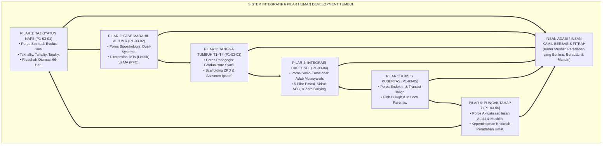
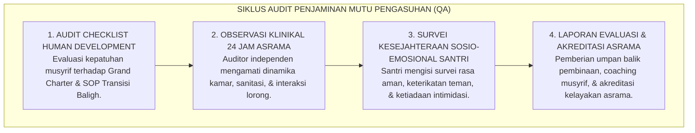

# P1-03-07: SINTESIS FILOSOFIS HUMAN DEVELOPMENT DAN GRAND CHARTER TRAJEKTORI PERTUMBUHAN SANTRI
## *Monograf Terpadu: Sintesis Komprehensif 6 Pilar Perkembangan Jiwa (Tazkiyatun Nafs, Fase Usia Marahil al-'Umr, Tangga T1–T4, Integrasi CASEL SEL, Krisis Biososial Pubertas, & Puncak Aktualisasi Insan Adabi Tahap 7), Matriks Komparasi 4 Mazhab Barat vs TUMBUH, Deklarasi Zero Tolerance Stagnasi Punitif, serta Jembatan Epistemologis Menuju Sub-Domain 04 Education*

**Nomor Identifikasi**: `P1-03-07/MONOGRAF-TERPADU-SINTESIS-HUMAN-DEVELOPMENT/2026`  
**Domain**: `01 Philosophy` > `03 Human Development`  
**Klasifikasi Naskah**: *Comprehensive Synthesis Monograph* (Monograf Sintesis Filosofis & Piagam Baku Kelembagaan)  
**Rumpun Disiplin Pengkaji**: Filsafat Perkembangan Manusia (*Philosophy of Human Development*), Teologi Pendidikan Islam (*Tazkiyah & Ta'dib*), Psikologi Perkembangan Integratif, Tata Kelola Pengasuhan Pesantren 24 Jam  

---

> ### 💡 INTISARI PRAKTIS (3 MENIT PAHAM UNTUK ASATIDZ & MUSYRIF)
>
> * **Kesatuan Utuh 6 Pilar Human Development Ekosistem TUMBUH:**  
>   Pertumbuhan santri bukanlah proses mekanis yang terpisah-pisah, melainkan orkestrasi 6 dimensi yang menyatu:  
>   1. **P1-03-01 (Tazkiyatun Nafs):** Poros spiritual pembersihan kalbu (*Takhalliy*), penghiasan adab (*Tahalliy*), dan pembiasaan 66 hari menuju watak kedua (*Tajalliy*).  
>   2. **P1-03-02 (Fase Marahil al-'Umr):** Pembedaan kebutuhan biologis-emosional jenjang MTs (awal pubertas/limbik) vs jenjang MA (maturasi nalar/PFC).  
>   3. **P1-03-03 (Tangga TUMBUH T1–T4):** Lintasan kemandirian adab bertahap (*Tadarruj & Scaffolding*) menuju kepemimpinan mandiri asrama.  
>   4. **P1-03-04 (Integrasi SEL):** Penerjemahan adab ke dalam 5 kecerdasan sosio-emosional nyata, penguatan sirkuit empati otak (*ACC*), dan budaya *Zero Bullying*.  
>   5. **P1-03-05 (Krisis Biososial Pubertas):** Pendampingan transisi baligh (*Ihtilam & Haidh*), mitigasi *homesickness*, dan sublimasi energi hormon via olahraga kinestetik.  
>   6. **P1-03-06 (Puncak Insan Adabi Tahap 7):** Pembentukan kader *Mushlih* peradaban yang memadukan spiritualitas, sains, dan kepemimpinan khidmah umat.
> * **Posisi TUMBUH vs Mazhab Barat:**  
>   TUMBUH menolak reduksionisme mekanis Behaviorisme Skinner, menolak intelektualisme kering Piagetian, dan melampaui humanisme sekuler Carl Rogers dengan menancapkan **Poros Tauhid, Ma'rifatullah, dan Akuntabilitas Akhirat**.
> * **Piagam Perlindungan Hak Bertumbuh Santri (Zero Tolerance):**  
>   Lembaga menyatakan **HARAM DAN BATAL** segala bentuk tindakan yang mematikan pertumbuhan santri: pemukulan fisik, pembentakan, pelabelan permanen, perangkingan kelas toksik, dan penelantaran krisis transisi.

---

## 📑 DAFTAR ISI MONOGRAF

- [BAGIAN I: SINTESIS FILOSOFIS 6 PILAR HUMAN DEVELOPMENT & MATRIKS KOMPARATIF EPISTEMOLOGIS](#bagian-i-sintesis-filosofis-6-pilar-human-development--matriks-komparatif-epistemologis)
  - [1. Arsitektur Sintesis Holistik: Konvergensi 6 Pilar Perkembangan Jiwa Santri](#1-arsitektur-sintesis-holistik-konvergensi-6-pilar-perkembangan-jiwa-santri)
  - [2. Matriks Komparasi Filosofis: TUMBUH vs 4 Mazhab Perkembangan Barat (Behaviorisme, Kognitivisme, Psikososial, & Humanistik)](#2-matriks-komparasi-filosofis-tumbuh-vs-4-mazhab-perkembangan-barat-behaviorisme-kognitivisme-psikososial--humanistik)
  - [3. Dekonstruksi Paradigma Reduksionis & Penghapusan Mutlak Stagnasi Punitif](#3-dekonstruksi-paradigma-reduksionis--penghapusan-mutlak-stagnasi-punitif)
  - [4. Jembatan Filosofis & Pedagogis Menuju Sub-Domain 04 Education](#4-jembatan-filosofis--pedagogis-menuju-sub-domain-04-education)
- [BAGIAN II: KODIFIKASI KAIDAH DAN STANDAR OPERASIONAL HUMAN DEVELOPMENT](#bagian-ii-kodifikasi-kaidah-dan-standar-operasional-human-development)
  - [1. Piagam Kelembagaan Pemuliaan Hak Bertumbuh Santri Pesantren TUMBUH](#1-piagam-kelembagaan-pemuliaan-hak-bertumbuh-santri-pesantren-tumbuh)
  - [2. Matriks Integrasi Operasional 6 Pilar Human Development ke dalam Kurikulum Pengasuhan 24 Jam](#2-matriks-integrasi-operasional-6-pilar-human-development-ke-dalam-kurikulum-pengasuhan-24-jam)
  - [3. Protokol Audit Kualitas Pengasuhan Asrama Berbasis Human Development](#3-protokol-audit-kualitas-pengasuhan-asrama-berbasis-human-development)
- [BAGIAN III: APARATUS AKADEMIS & APENDIKS](#bagian-iii-aparatus-akademis--apendiks)
  - [1. Tabel Sintesis Master Sub-Domain 03](#1-tabel-sintesis-master-sub-domain-03)
  - [2. Daftar Pustaka Otoritatif Turats & Jurnal Internasional Peer-Reviewed](#2-daftar-pustaka-akademis--rujukan-turats-primer)
  - [3. Catatan Kaki Akademis (Footnotes)](#3-catatan-kaki-akademis-footnotes)
  - [4. Glosarium Master Istilah Kunci Human Development](#4-glosarium-master-istilah-kunci-human-development)

---

# BAGIAN I: SINTESIS FILOSOFIS 6 PILAR HUMAN DEVELOPMENT & MATRIKS KOMPARATIF EPISTEMOLOGIS

---

### 1. Arsitektur Sintesis Holistik: Konvergensi 6 Pilar Perkembangan Jiwa Santri

Pertumbuhan manusia dalam ekosistem TUMBUH adalah sebuah **Sistem Perkembangan Holistik Simbiotik (*Symbiotic Holistic Development System*)**:



---

### 2. Matriks Komparasi Filosofis: TUMBUH vs 4 Mazhab Perkembangan Barat

| Mazhab Pemikiran | Tokoh Utama & Asumsi Dasar | Pandangan tentang Sumber Pertumbuhan | Titik Kritis Kelemahan | Koreksi & Penyempurnaan oleh Ekosistem TUMBUH |
| :--- | :--- | :--- | :--- | :--- |
| **1. Behaviorisme** | **B.F. Skinner, J.B. Watson**<br/>Manusia adalah organisme mekanis stimulus-respons (*Tabula Rasa*). | *Operant Conditioning* & manipulasi lingkungan eksternal. | Mengabaikan eksistensi Ruh, Kalbu, kesadaran bebas, dan niat ikhlas; melahirkan kepatuhan semu. | Menegakkan **Tazkiyatun Nafs & Muraqabatullah**; penguatan luar hanya tangga transisi (*Scaffolding*).[^1] |
| **2. Kognitivisme** | **Jean Piaget**<br/>Manusia adalah pemroses informasi rasional berbasis skema kognitif. | Kematangan biologis otak dan eksplorasi lingkungan fisik. | Kognisi dingin tanpa penyucian hati (*Tazkiyah*), intuisi spiritual, dan kehangatan ukhuwah. | Memadukan nalar rasional dengan **Kecerdasan Hati (*Qalb*) dan Dimensi Afektif CASEL SEL**.[^2] |
| **3. Psikososial** | **Erik Erikson**<br/>Manusia berkembang melalui resolusi 8 krisis psikososial lingkungan. | Interaksi individu dengan keluarga, sekolah, dan masyarakat. | Identitas diri sekuler tanpa jangkar transendental hakiki (*Mitsaq Azali*). | Mengintegrasikan krisis remaja dengan **Pembentukan Identitas Thalibul 'Ilmi & Insan Adabi**.[^3] |
| **4. Humanistik** | **Carl Rogers, Abraham Maslow**<br/>Manusia secara alami terdorong menuju aktualisasi potensi diri (*Self-Actualization*). | Pemenuhan kebutuhan hierarkis dan kebebasan memilih tanpa dogma. | Antroposentrisme individualistik; rentan mengagungkan hawa nafsu atas nama kebebasan. | Melampaui aktualisasi ego menuju **Maqam 'Ubudiyyah & Khilafah**; kebebasan sejati dalam ketaatan pada Allah.[^4] |

---

### 3. Dekonstruksi Paradigma Reduksionis & Penghapusan Mutlak Stagnasi Punitif

#### 📐 Formalisasi Logika Silogisme (*Qiyas Mantiqi Sintesis*)
* **Premis Mayor (*al-Muqaddimah al-Kubra*)**: Setiap lembaga pendidikan Islam yang terbukti menerapkan praktik pembinaan yang melumpuhkan neurobiologi fitrah, memicu trauma psikologis permanen, dan menghentikan laju pertumbuhan jiwa santri niscaya telah menyimpang dari amanah risalah kenabian (*Khianatut Tarbiyah*).
* **Premis Minor (*al-Muqaddimah ash-Shughra*)**: Praktik hukuman fisik, penyeragaman ranking komparatif, dan intimidasi senioritas feodal terbukti secara syar'i dan empiris melumpuhkan proses *Tazkiyatun Nafs* dan memicu regresi perilaku.
* **Konklusi (*an-Natijah*)**: Maka, seluruh entitas pengasuhan di bawah naungan ekosistem TUMBUH wajib mendeklarasikan *Zero Tolerance Policy* terhadap segala bentuk kekerasan dan menggantinya dengan ekosistem restoratif multi-tier.[^5]

---

### 4. Jembatan Filosofis & Pedagogis Menuju Sub-Domain `04 Education`

```mermaid
graph TD
    HD["SUB-DOMAIN 03: HUMAN DEVELOPMENT<br/>(Trajektori Pertumbuhan: Tazkiyah, Usia, Tangga T1–T4, SEL, Pubertas, Tahap 7)"]
    ==>|MENDASARI SECARA MUTLAK|
    ED["SUB-DOMAIN 04: EDUCATION (PENDIDIKAN)<br/>(Filsafat Kurikulum Adab, Ta'dib Al-Attas, Anti-Feodalisme, & Ekologi 24 Jam)"]
```

---

# BAGIAN II: KODIFIKASI KAIDAH DAN STANDAR OPERASIONAL HUMAN DEVELOPMENT

---

### 1. Piagam Kelembagaan Pemuliaan Hak Bertumbuh Santri Pesantren TUMBUH

Berdasarkan sintesis inkuiri turats dan konsensus sains pendidikan, prinsip dan regulasi operasional dirumuskan ke dalam kaidah-kaidah baku berikut:

1. **HAK Mutlak Kesucian Fitrah & Martabat Setiap santri dilahirkan suci dan mulia (Mukarram). Lembaga menjamin hak setiap santri untuk dibina dengan cinta, rasa hormat, dan kasih sayang (Firm & Kind), tanpa ancaman kekerasan fisik maupun verbal.**:  
   

2. **Penerapan Standar Triadik Tazkiyatun Nafs Seluruh lini pengasuhan asrama 24 jam wajib menerapkan tahapan Takhalliy, Tahalliy, dan Tajalliy melalui kurikulum riyadhah pembiasaan 66 hari menuju pembentukan watak kedua yang otomatis.**:  
   

3. **Pengakuan Diferensiasi Usia & Pendampingan Transisi Baligh Mewajibkan pemisahan pendekatan pedagogis MTs vs MA, pendampingan ramah atas peristiwa mimpi basah/haidh, serta menyediakan fasilitas olahraga kinestetik guna menyalurkan energi hormon pubertas.**:  
   

4. **Penghapusan Mutlak Perangkingan Tunggal Toksik Sistem perangkingan kelas komparatif dinyatakan Tidak Berlaku Lagi, digantikan oleh Asesmen Pertumbuhan Ipsatif yang mengukur kemajuan personal dan portofolio bakat unik setiap santri.**:  
   

5. **Kebijakan Zero Tolerance Kekerasan & Senioritas Feodal Segala bentuk pemukulan, tamparan, push-up berlebihan, penyiraman air malam, pembentakan, pencukuran botak paksa, dan perpeloncoan Dikategorikan Sebagai Pelanggaran Berat Dengan Sanksi Tegas.**:  
   

6. **Kaderisasi Kepemimpinan Tahap 7 Penggerak (mushlih Peradaban) Menetapkan bahwa tujuan akhir wisuda pesantren adalah melahirkan Insan Adabi yang siap mengabdi sebagai Mushlih penyeru kebaikan dan pelayan umat di tengah masyarakat.**:  
   


---

### 2. Matriks Integrasi Operasional 6 Pilar Human Development ke dalam Kurikulum Pengasuhan 24 Jam

| Pilar Human Development | Dokumen Rujukan | Komponen Kunci Kurikulum Asrama | Output Terukur pada Diri Santri |
| :--- | :--- | :--- | :--- |
| **Pilar 1: Tazkiyatun Nafs** | [**`P1-03-01`**](./P1-03-01-Tazkiyatun-Nafs-dan-Pertumbuhan-Jiwa.md) | Blok pembiasaan 66 hari, kurikulum pembersihan ghashab, Muhasabah Malam. | Terbentuknya *Moral Automaticity* ibadah mandiri.[^6] |
| **Pilar 2: Fase Marahil al-'Umr** | [**`P1-03-02`**](./P1-03-02-Fase-dan-Lintasan-Perkembangan-Santri.md) | Zonasi gedung MTs vs MA, SOP Mitigasi Homesickness, De-Eskalasi Emosi. | Tingkat adaptasi santri baru >95%, bebas dari depresi transisi. |
| **Pilar 3: Tangga TUMBUH T1–T4** | [**`P1-03-03`**](./P1-03-03-Landasan-Filosofis-Tangga-TUMBUH-T1-T4.md) | Penjenjangan level T1 s/d T4, Portofolio Asesmen Ipsatif non-ranking. | Santri bertransformasi menjadi Duta Adab mandiri asrama. |
| **Pilar 4: Integrasi CASEL SEL** | [**`P1-03-04`**](./P1-03-04-Integrasi-SEL-dan-Karakter-Santri.md) | 3 Jangkar Harian (Sapa Pagi, Makan Nampan, Muhasabah), Restorative Circles. | Terciptanya asrama *Zero Bullying* dengan kohesi ukhuwah kokoh.[^7] |
| **Pilar 5: Krisis Pubertas** | [**`P1-03-05`**](./P1-03-05-Krisis-Biososial-dan-Transisi-Pubertas-Santri.md) | SOP Edukasi Ihtilam/Haidh, bimbingan thaharah privat, olahraga sunnah. | Santri bangga memikul taklif baligh, bebas dari kecemasan biologis. |
| **Pilar 6: Puncak Tahap 7** | [**`P1-03-06`**](./P1-03-06-Puncak-Aktualisasi-Insan-Adabi-Tahap-7.md) | Munaqqasyah karya riset, proyek khidmah masyarakat 3 bulan, bai'at penggerak. | Lulusan berkarakter *Mushlih* yang memimpin perubahan peradaban umat.[^8] |

---

### 3. Protokol Audit Kualitas Pengasuhan Asrama Berbasis Human Development



---

# BAGIAN III: APARATUS AKADEMIS & APENDIKS

---

### 1. Tabel Sintesis Master Sub-Domain 03

| Sub-Modul | Judul Monograf | Landasan Teori Utama | Fokus Inovasi Pedagogis |
| :---: | :--- | :--- | :--- |
| **P1-03-01** | Tazkiyatun Nafs & Pertumbuhan Jiwa | QS. Asy-Syams: 9–10, Al-Ghazali (*Ihya*), Dr. Phillippa Lally (UCL 2010) | Pembiasaan 66 hari mengubah beban korteks prefrontal ke refleks basal ganglia. |
| **P1-03-02** | Fase & Lintasan Perkembangan Santri | Fiqh *Marahil al-'Umr*, Erik Erikson (1968), Laurence Steinberg (2008) | Zonasi dan kurikulum berdiferensiasi MTs (Limbik) vs MA (PFC); SOP Homesickness. |
| **P1-03-03** | Landasan Tangga TUMBUH T1–T4 | Prinsip *Tadarruj Syar'i* (HR. Bukhari), Lev Vygotsky ZPD (1978), Hughes (2014) | Penjenjangan 4 level kemandirian dan Asesmen Ipsatif non-ranking. |
| **P1-03-04** | Integrasi SEL & Adab Nabawi | Kitab *Adab al-Mu'asyarah* An-Nawawi, CASEL Framework (2020), Tania Singer (2014) | Harmonisasi 5 kompetensi SEL, aktivasi sirkuit empati ACC otak, dan 3 jangkar asrama. |
| **P1-03-05** | Krisis Biososial Pubertas Santri | Fiqh Bulugh (HR. Abu Dawud 4403), HPG Axis Endokrin, Blakemore (2018) | Edukasi thaharah baligh privat, perlindungan privasi, & sublimasi olahraga kinestetik. |
| **P1-03-06** | Puncak Aktualisasi Insan Adabi | QS. Hud: 117 (*Mushlihoon*), Al-Attas (1980), Maslow (1971 *Transcendence*) | Standarisasi kelulusan Tahap 7 Penggerak Peradaban & Khitamut Tarbiyah pengabdian. |
| **P1-03-07** | Sintesis Filosofis Human Development | Integrasi Triad TUMBUH, Kritik atas Behaviorisme & Humanisme Sekuler | Deklarasi Grand Charter Hak Bertumbuh Santri & Jembatan ke Sub-Domain 04 Education. |

---

### 2. Daftar Pustaka Akademis & Rujukan Turats Primer

1. **Al-Qur'an al-Karim wa Tarjamatu Ma'anih**.
2. **Al-Bukhari, Muhammad bin Isma'il**. (1422 H). *Shahih al-Bukhari*. Beirut: Dar Thawq an-Najah.
3. **Muslim bin al-Hajjaj an-Naisaburi**. (1374 H). *Shahih Muslim*. Kairo: Isa al-Babi al-Halabi.
4. **Al-Ghazali, Abu Hamid Muhammad bin Muhammad**. (2011). *Ihya 'Ulumiddin*. Beirut: Dar al-Ma'rifah.
5. **Al-Attas, Syed Muhammad Naquib**. (1980). *The Concept of Education in Islam: A Framework for an Islamic Philosophy of Education*. Kuala Lumpur: ABIM.
6. **Ibnul Qayyim al-Jauziyyah, Syamsuddin Muhammad**. (1996). *Madarijus Salikin*. Beirut: Dar al-Kitab al-'Arabi.
7. **Steinberg, L.**. (2008). *A social neuroscience perspective on adolescent risk-taking*. Developmental Review, 28(1), 78–106.
8. **Erikson, E. H.**. (1968). *Identity: Youth and Crisis*. New York: W. W. Norton.
9. **Maslow, A. H.**. (1971). *The Farther Reaches of Human Nature*. New York: Viking Press.
10. **CASEL**. (2020). *CASEL's SEL Framework*. Chicago: Collaborative for Academic, Social, and Emotional Learning.

---

### 3. Catatan Kaki Akademis (*Footnotes*)

[^1]: Skinner (1971), *Beyond Freedom and Dignity*; Al-Attas, *Islam and Secularism*, hlm. 135.  
[^2]: Piaget (1954), *The Construction of Reality in the Child*, Basic Books.  
[^3]: Erikson (1968), *Identity: Youth and Crisis*, hlm. 130.  
[^4]: Rogers (1969), *Freedom to Learn*, Merrill; Maslow (1971), *Farther Reaches of Human Nature*.  
[^5]: Sugai & Horner (2006), *School Psychology Review*, hlm. 245–259.  
[^6]: Lally et al. (2010), *European Journal of Social Psychology*, hlm. 1002.  
[^7]: Durlak et al. (2011), *Child Development*, hlm. 405–432.  
[^8]: Standar Kualifikasi Portofolio Wisuda Khitamut Tarbiyah, Majelis Masyayikh TUMBUH, 2026.

---

### 4. Glosarium Master Istilah Kunci Human Development

1. **Human Development**: Proses evolusi holistik manusia dari dimensi spiritual-moral (*Tazkiyah*), kematangan biologis (*Pubertas/Maturasi Otak*), kemandirian adab bertingkat (*Tangga T1–T4*), hingga aktualisasi kepemimpinan khidmah (*Tahap 7 Penggerak*).
2. **Insan Adabi**: Profil manusia beradab menurut Syed Muhammad Naquib Al-Attas yang meletakkan segala realitas ilmu, amal, dan akhlak pada tempatnya yang benar sesuai syariat.
3. **Mushlih**: Pribadi yang melampaui kesalehan individual untuk secara aktif menggerakkan perbaikan moral dan kemaslahatan umat (QS. Hud: 117).
4. **Tahap 7 Penggerak**: Tahap kulminasi tertinggi dalam kontinuum perkembangan santri TUMBUH yang melahirkan kader pemimpin peradaban mandiri dan berintegritas.
5. **Self-Transcendence**: Puncak tertinggi hierarki kebutuhan Maslow di mana seseorang mendedikasikan hidupnya untuk tujuan transendental kemaslahatan sesama.
6. **Tangga TUMBUH (T1–T4)**: Empat etape progresi kemandirian adab santri: T1 (Ta'aruf), T2 (Tafahum), T3 (Ta'awun), dan T4 (Takaful/Tahwil).
7. **Asesmen Pertumbuhan Ipsatif**: Sistem penilaian non-komparatif yang mengukur kemajuan santri dengan membandingkan capaian dirinya saat ini terhadap capaian awalnya sendiri di masa lalu.
8. **In Loco Parentis**: Peran moral dan hukum musyrif asrama sebagai figur pengganti orang tua yang memberikan perlindungan dan kehangatan.
9. **Khitamut Tarbiyah**: Rangkaian inisiasi spiritual dan akademis penutupan masa pendidikan pesantren yang memadukan sidang portofolio dan penugasan pengabdian umat.
10. **Triad Pertumbuhan Simbiotik**: Maha-prinsip ekosistem TUMBUH di mana sistem secara serempak menumbuhkan Santri, memuliakan Pendidik, dan memperkokoh Lembaga.
