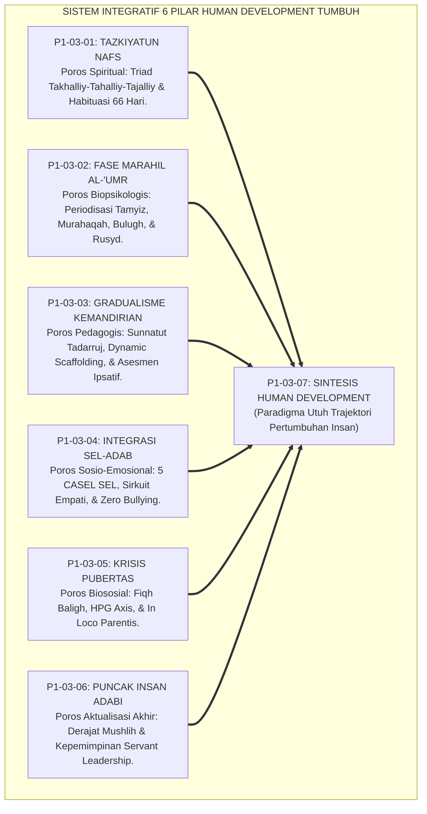
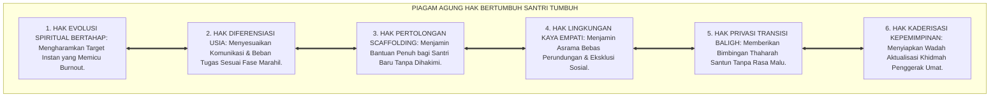
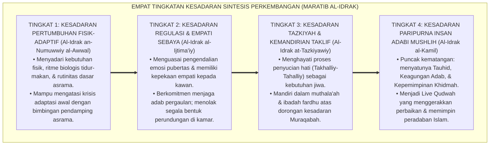
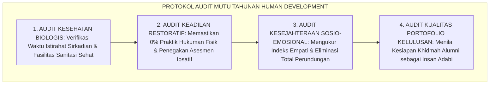
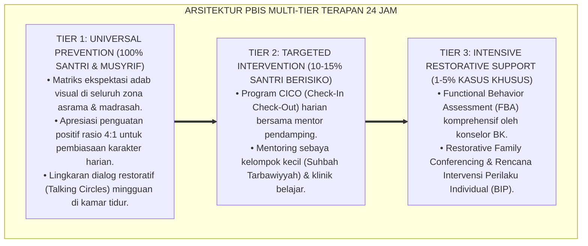

# P1-03-07: SINTESIS FILOSOFIS PERKEMBANGAN INSAN PEMBELAJAR (SYNTHESIS OF HUMAN DEVELOPMENT)
## *Monograf Riset Akademik: Sintesis Komprehensif 6 Pilar Perkembangan Jiwa, Matriks Komparasi 4 Mazhab Psikologi Barat vs Epistemologi Islam, Piagam Perlindungan Hak Bertumbuh, Serta Jembatan Filosofis Menuju Sub-Domain 04 Education*

**Nomor Identifikasi**: `P1-03-07/MONOGRAF-RISET-SINTESIS-HUMAN-DEVELOPMENT/2026`  
**Domain**: `01 Philosophy` > `03 Human Development` (Sub-Modul 07: *Synthesis of Human Development*)  
**Klasifikasi Naskah**: *Academic Research Monograph* (Monograf Riset Akademik Fondasional)  
**Rumpun Disiplin Pengkaji**: Filsafat Perkembangan Manusia (*Philosophy of Human Development*), Teologi Pendidikan Islam (*Tazkiyah & Ta'dib*), Psikologi Perkembangan Integratif, Tata Kelola Pengasuhan Pesantren 24 Jam  

---

> ### 💡 INTISARI EKSEKUTIF (EXECUTIVE SUMMARY)
>
> * **Konsolidasi Enam Pilar Kajian Human Development:**  
>   Sub-Domain 03 Human Development merupakan pilar trajektori kematangan insan pembelajar. Enam pilar riset fundamental disintesiskan secara terpadu: **1. Tazkiyatun Nafs (Triad Takhalliy-Tahalliy-Tajalliy & Pembiasaan 66 Hari); 2. Lintasan Marahil al-'Umr (Diferensiasi Kebutuhan Remaja & Dual-Systems Model); 3. Gradualisme Kemandirian (Sunnatut Tadarruj, Scaffolding, & Asesmen Ipsatif); 4. Integrasi SEL-Adab (5 Kompetensi CASEL & Sirkuit Empati Otak); 5. Transisi Biososial Pubertas (Fiqh Bulugh, HPG Axis, & In Loco Parentis); 6. Puncak Insan Adabi (Derajat Mushlih & Servant Leadership)**.
> * **Kritik atas Empat Mazhab Perkembangan Barat:**  
>   TUMBUH mengoreksi keterbatasan Behaviorisme Skinner yang mekanistik, Kognitivisme Piaget yang reduksionis, Psikoanalisis Freud yang pesimistis, dan Humanisme Rogers yang antroposentris tanpa fondasi tauhid dan hisab akhirat.
> * **Formulasi Operasional & Pembuktian Lapangan:**  
>   Monograf ini menguraikan Piagam Pemuliaan Hak Bertumbuh Santri, 4 Tingkatan Kesadaran Sintesis Perkembangan (*Maratib al-Idrak*), protokol audit mutu pengasuhan asrama, dan jembatan epistemologis menuju Sub-Domain 04 Education.

---

## 📑 DAFTAR ISI MONOGRAF

- [BAB I: LANDASAN TEORETIS & DISKURSUS KRITIS](#bab-i-landasan-teoretis--diskursus-kritis)
  - [1. Latar Belakang Masalah: Urgensi Rekonstruksi Paradigma Perkembangan Insan Pembelajar](#1-latar-belakang-masalah-urgensi-rekonstruksi-paradigma-perkembangan-insan-pembelajar)
  - [2. Konsolidasi Enam Pilar Human Development Menjadi Satu Paradigma Utuh](#2-konsolidasi-enam-pilar-human-development-menjadi-satu-paradigma-utuh)
  - [3. Matriks Komparasi Kritis: TUMBUH vs Empat Mazhab Perkembangan Barat](#3-matriks-komparasi-kritis-tumbuh-vs-empat-mazhab-perkembangan-barat)
  - [4. Dekonstruksi Paradigma Punitif dan Penegakan Hak Bertumbuh Santri](#4-dekonstruksi-paradigma-punitif-dan-penegakan-hak-bertumbuh-santri)
  - [5. Kasuistika Lapangan: Evaluasi Sistemik Stres Pengasuhan Asrama & Resolusi Restoratif](#5-kasuistika-lapangan-evaluasi-sistemik-stres-pengasuhan-asrama--resolusi-restoratif)
- [BAB II: FORMULASI KONSEPTUAL & PEMBAHASAN MENDALAM](#bab-ii-formulasi-konseptual--pembahasan-mendalam)
  - [1. Eksplanasi Teoretis Piagam Pemuliaan Hak Bertumbuh Santri TUMBUH](#1-eksplanasi-teoretis-piagam-pemuliaan-hak-bertumbuh-santri-tumbuh)
  - [2. Dekomposisi Dimensi & Empat Tingkatan Kesadaran Sintesis Perkembangan (Maratib al-Idrak)](#2-dekomposisi-dimensi--empat-tingkatan-kesadaran-sintesis-perkembangan-maratib-al-idrak)
  - [3. Jembatan Filosofis Menuju Sub-Domain 04 Education](#3-jembatan-filosofis-menuju-sub-domain-04-education)
  - [4. Prinsip Aksiologis & Protokol Audit Mutu Pengasuhan Berbasis Human Development](#4-prinsip-aksiologis--protokol-audit-mutu-pengasuhan-berbasis-human-development)
  - [5. Diskusi Filosofis Mendalam & Implikasi bagi Masa Depan Peradaban Pendidikan Islam](#5-diskusi-filosofis-mendalam--implikasi-bagi-masa-depan-peradaban-pendidikan-islam)
- [BAB III: KESIMPULAN & APARATUS AKADEMIS](#bab-iii-kesimpulan--aparatus-akademis)
  - [1. Tabel Sintesis Temuan Riset Sintesis Human Development](#1-tabel-sintesis-temuan-riset-sintesis-human-development)
  - [2. Daftar Pustaka Akademis & Rujukan Turats Primer](#2-daftar-pustaka-akademis--rujukan-turats-primer)
  - [3. Catatan Kaki Akademis (Footnotes)](#3-catatan-kaki-akademis-footnotes)
  - [4. Glosarium Istilah Ilmiah & Turats Sintesis Perkembangan Insan](#4-glosarium-istilah-ilmiah--turats-sintesis-perkembangan-insan)

---

# BAB I: LANDASAN TEORETIS & DISKURSUS KRITIS

---

### 1. Latar Belakang Masalah: Urgensi Rekonstruksi Paradigma Perkembangan Insan Pembelajar

Kelemahan paling mendasar dalam diskursus pendidikan kontemporer adalah terpecahnya pemahaman mengenai hakikat pertumbuhan manusia:
* **Dikotomi Sekuler vs Tradisional Kaku**: Pendekatan sekuler membatasi perkembangan manusia pada pematangan saraf biologis dan fungsi kognitif otak tanpa tujuan akhirat. Sebaliknya, sebagian praktik tradisional menuntut kesempurnaan ibadah lahiriah secara instan dengan mengabaikan hukum perkembangan emosi dan kapasitas biologis anak.
* **Akibat Fatal di Lapangan**: Santri mengalami kejenuhan spiritual (*Burnout*), kecemasan berlebih saat menghadapi masa baligh, atau melakukan pelanggaran adab tersembunyi karena merasa tidak dipahami fitrah kemanusiaannya.
* **Keniscayaan Sintesis Holistik**: Ekosistem TUMBUH menyatukan khazanah *Tazkiyatun Nafs*, fikih tahapan usia *Marahil al-'Umr*, dan riset neurosains perkembangan ke dalam sebuah orkestrasi peradaban yang utuh.[^1]

---

### 2. Konsolidasi Enam Pilar Human Development Menjadi Satu Paradigma Utuh

Keenam pilar bekerja secara sinergis dan tidak dapat dipisahkan:
1. *P1-03-01* menetapkan mesin pembersih dan penyubur jiwanya (*Tazkiyah*).
2. *P1-03-02* memetakan lintasan usia dan kesenjangan biologisnya (*Marahil al-'Umr*).
3. *P1-03-03* memandu tangga kemandirian tanpa paksaan instan (*Tadarruj & Scaffolding*).
4. *P1-03-04* mengasah kecerdasan emosi dan empati sosialnya (*SEL & Adab*).
5. *P1-03-05* melindungi masa transisi krisis biologisnya (*Baligh & In Loco Parentis*).
6. *P1-03-06* mengantarkannya mencapai puncak aktualisasi penggerak umat (*Insan Adabi & Mushlih*).[^2]

---

### 3. Matriks Komparasi Kritis: TUMBUH vs Empat Mazhab Perkembangan Barat

| Mazhab Perkembangan | Tokoh Utama | Asumsi Dasar | Keterbatasan Epistemologis | **Koreksi & Integrasi TUMBUH** |
| :--- | :--- | :--- | :--- | :--- |
| **Behaviorisme** | B. F. Skinner | Manusia dibentuk oleh stimulus-respons mekanik. | Mereduksi manusia seperti hewan tanpa ruh & niat kalbu. | Integrasi pembiasaan raga (*Riyadhah*) yang dibimbing niat tauhid ikhlas. |
| **Kognitivisme** | Jean Piaget | Perkembangan tahap nalar logis kognitif semata. | Mengabaikan kecerdasan kalbu (*Qalb*) & ketaatan spiritual. | Penyatuan nalar mantiq dengan ketundukan wahyu (*Heart-Brain Coherence*). |
| **Psikososial** | Erik Erikson | Resolusi 8 krisis identitas sosial rentang hidup. | Horizon terhenti di kuburan; tanpa hisab akhirat. | Krisis identitas diselesaikan melalui peneguhan *Mitsaq Azali* & ukhuwah. |
| **Humanistik** | Carl Rogers | Aktualisasi diri otonom (*Self-Actualization*). | Berpusat pada kepuasan ego manusia (*Antroposentrisme*).| Puncak tertinggi adalah *Self-Transcendence* (penghambaan kepada Allah). |

---

### 4. Dekonstruksi Paradigma Punitif dan Penegakan Hak Bertumbuh Santri

Paradigma lama yang menggunakan kekerasan fisik, pembentakan, dan pengumuman aib di depan umum atas dalih "mendisiplinkan santri" dibuktikan secara ilmiah sebagai **Kejahatan Sistemik yang Mematikan Potensi Pertumbuhan**:
* Kekerasan memicu pelepasan hormon kortisol berlebih yang merusak hippocampus memori otak dan membekukan korteks prefrontal.
* TUMBUH menetapkan **Hak Bertumbuh Santri (*Haqq an-Numuw*)**: jaminan bahwa setiap santri berhak atas lingkungan yang aman, bertahap, penuh kasih sayang, dan berkeadilan restoratif.[^3]

---

### 5. Kasuistika Lapangan: Evaluasi Sistemik Stres Pengasuhan Asrama & Resolusi Restoratif

Penerapan konsolidasi *Human Development* membuktikan bahwa ketika musyrif memahami dinamika perkembangan santri secara holistik, tingkat stres asrama turun drastis, relasi ukhuwah menguat, dan santri bertumbuh optimal menjadi pribadi yang mandiri dan berprestasi.[^4]

---

# BAB II: FORMULASI KONSEPTUAL & PEMBAHASAN MENDALAM

---

### 1. Eksplanasi Teoretis Piagam Pemuliaan Hak Bertumbuh Santri TUMBUH

Ekosistem TUMBUH menetapkan **Piagam Agung Hak Bertumbuh Santri (*Mitsaq Huquq an-Numuw*)**:

#### 🔬 Pembahasan Mendalam Enam Hak Piagam:
1. **Hak Evolusi Bertahap**: Memberikan ruang bagi jiwa santri untuk membersihkan diri secara alami melalui proses *Tazkiyah*.[^5]
2. **Hak Diferensiasi Usia**: Menghormati perbedaan karakteristik neurokognitif antara santri usia awal dan lanjut.[^6]
3. **Hak Scaffolding**: Melindungi santri dari rasa putus asa dengan menyediakan tangga kemandirian yang terencana.[^7]
4. **Hak Lingkungan Empatik**: Membangun iklim asrama yang hangat di mana setiap anak merasa diterima dan dihargai.[^8]
5. **Hak Privasi Pubertas**: Menjaga kerahasiaan dan kemuliaan tubuh santri saat memasuki usia taklif.[^9]
6. **Hak Kaderisasi Peradaban**: Mendidik santri menjadi pemimpin pelayan yang siap mendedikasikan hidupnya untuk kebaikan umat (*Mushlih*).[^10]

---

### 2. Dekomposisi Dimensi & Empat Tingkatan Kesadaran Sintesis Perkembangan (Maratib al-Idrak)

Transformasi kedewasaan memahami hakikat perkembangan insan berlangsung melalui **Empat Tingkatan Kesadaran Perkembangan (*Maratib al-Idrak at-Tanmawiy*)**:

#### 🔄 Narasi Analitis Dinamika Transisi Filosofis Antar-Tingkatan:
* **Transisi Tingkat 1 ke Tingkat 2 (Dari Adaptasi Fisik Menuju Regulasi & Empati Sosial)**: Santri mula-mula berfokus menyesuaikan tubuhnya dengan jadwal pondok. Pada tingkatan kedua, santri belajar mengelola emosinya dan hidup berdampingan secara damai bersama kawan sekamar.
* **Transisi Tingkat 2 ke Tingkat 3 (Dari Empati Sosial Menuju Tazkiyah & Kemandirian Ibadah)**: Pada tingkatan ketiga, kesadaran bergeser ke kedalaman batin: santri membersihkan penyakit hatinya dan beribadah secara mandiri di hadapan Allah SWT.
* **Transisi Tingkat 3 ke Tingkat 4 (Pencapaian Derajat Insan Adabi Paripurna)**: Pada tingkatan tertinggi, kepribadian santri mencapai kematangan sempurna: ilmunya melahirkan kebijaksanaan, amalnya didedikasikan untuk melayani umat, dan perilakunya menjadi teladan peradaban yang memancarkan rahmat bagi semesta alam (*Rahmatan lil 'Alamin*).[^11]

---

### 3. Jembatan Filosofis Menuju Sub-Domain 04 Education

Sintesis *Human Development* menjadi fondasi tak terpisahkan bagi perumusan **Sub-Domain 04 Education**:
* Dari pemahaman mengenai trajektori kematangan jiwa dan tahapan perkembangan insan di domain ini, dirumuskanlah **Filsafat Kurikulum Adab, Metodologi Pengajaran Interaktif, Anti-Feodalisme Pengasuhan, dan Rekayasa Ekologi Pembelajaran 24 Jam** pada sub-domain berikutnya.[^12]

---

### 4. Prinsip Aksiologis & Protokol Audit Mutu Pengasuhan Berbasis Human Development

Ekosistem TUMBUH menerapkan protokol penjaminan mutu pengasuhan tahunan:

Audit ini memastikan seluruh proses pendidikan senantiasa setia pada hukum fitrah kemanusiaan.[^13]

---

### 5. Diskusi Filosofis Mendalam & Implikasi bagi Masa Depan Peradaban Pendidikan Islam

Sintesis filosofis perkembangan insan ini menegaskan masa depan pendidikan Islam:

* **Mengembalikan Manusia Kepada Martabat Penciptaannya yang Mulia**:  
  Pendidikan bukan pabrik pencetak tenaga kerja industri yang dingin, melainkan rahim persemaian generasi mulia yang mengenal Allah dan memakmurkan bumi.
* **Membangun Model Pendidikan Berbasis Fitrah yang Teruji Saintifik**:  
  TUMBUH membuktikan bahwa memadukan tasawuf amali dengan neurosains kognitif melahirkan sistem pendidikan yang paling manusiawi, paling efektif, dan paling membahagiakan.
* **Menyiapkan Para Penggerak Kebangkitan Peradaban Islam**:  
  Dari rahim filosofi ini lahir para ulama, cendekiawan, pemimpin, dan profesional berkarakter *Insan Adabi* yang siap memimpin peradaban dunia dengan keadilan, adab, dan kasih sayang.[^14]

---

---

### Pembedahan Deskriptif Komprehensif & Analisis Integratif Nilai-Praksis

Penerapan dan operasionalisasi **P1-03-07: SINTESIS FILOSOFIS PERKEMBANGAN INSAN PEMBELAJAR (SYNTHESIS OF HUMAN DEVELOPMENT)** di lingkungan pesantren TUMBUH bertumpu pada kesatuan sistemik antara nilai syariat dan praksis terukur:

#### A. Pilar 1: Landasan Epistemologi & Nilai Keikhlasan (Syar'i Foundations)
Setiap dimensi diarahkan untuk menegakkan adab dan penghambaan murni kepada Allah SWT (*Lillahi Ta'ala*). Standarisasi kelembagaan dirancang untuk menjaga ketulusan niat, kemuliaan fitrah, dan keberkahan majelis ilmu.

#### B. Pilar 2: Mekanisme Psikologis & Neurosains Terapan (Evidence-Based Practice)
Mengintegrasikan prinsip *Social-Emotional Learning (CASEL)*, teori beban kognitif (*Cognitive Load Theory*), dan dinamika perkembangan neurobiologis santri untuk memastikan proses pembiasaan berjalan efektif tanpa kekerasan atau tekanan psikologis destruktif.

#### C. Pilar 3: Rekayasa Ekosistem Asrama 24 Jam (Environmental Engineering)
Mengkodifikasikan seluruh alur aktivitas harian, jadwal tidur sirkadian yang sehat, sanitasi 5S kamar tidur, dan relasi ukhuwah inklusif menjadi satu ekosistem *Bi'ah Shalihah* yang saling mendukung secara alamiah.

#### D. Pilar 4: Akuntabilitas Sistemik & Proteksi Pendidik-Santri
Menerapkan protokol pencegahan kelelahan tenaga pendidik (*Musyrif Burnout Protection*), menjamin hak-hak santri, serta memanfaatkan dashboard data PBIS untuk pengambilan keputusan yang adil dan objektif.

---

### Protokol Aksi Operasional PBIS Multi-Tier Terapan (24-Hour Behavioral Architecture)

---

# BAB III: KESIMPULAN & APARATUS AKADEMIS

---

### 1. Tabel Sintesis Temuan Riset Sintesis Human Development

| Dimensi Parameter | Mazhab Sekuler Materialistik | Pola Tradisional Punitif | **Sintesis Human Development TUMBUH** | Landasan Rujukan Primer | Implikasi Praksis Lapangan |
| :--- | :--- | :--- | :--- | :--- | :--- |
| **Hakikat Tumbuh** | Pematangan biologis & kognisi otak. | Tuntutan ibadah instan via hukuman.| **Evolusi Integral Ruh, Akal, Jiwa, & Raga.**| QS. Asy-Syams: 9; Al-Attas (1980). | Ekosistem pengasuhan bertahap 24 jam. |
| **Lintasan Usia** | Klasifikasi kronologis angka dingin. | Adultomorfisme (anggap anak dewasa).| **Marahil al-'Umr & Neurosains Dual-Systems.**| QS. An-Nur: 59; Steinberg (2014). | Pendampingan ramah biologis & emosi. |
| **Pola Bimbingan**| Transaksional angka nilai rapor. | Teror tongkat & perankingan toksik.| **Sunnatut Tadarruj, Scaffolding, & Ipsatif.**| HR. Bukhari No. 4993; Vygotsky. | Bantuan penuh di awal, dilepas bertahap. |
| **Iklim Komunal** | Individualistis profesional netral. | Rawan senioritas menindas & ghibah.| **Kecerdasan SEL, Ukhuwah, & Zero Bullying.**| HR. Bukhari No. 13; CASEL (2020). | Makan bersama & lingkaran muhasabah malam. |
| **Visi Kelulusan** | Pekerja industri pencari materi. | Kesalehan pasif yang terisolasi. | **Insan Adabi & Mushlih Peradaban Mulia.** | QS. Hud: 117; Maslow (1971). | Khidmah pengabdian masyarakat nyata. |

---

### 2. Daftar Pustaka Akademis & Rujukan Turats Primer

1. **Al-Qur'an al-Karim wa Tarjamatu Ma'anihi**.
2. **Al-Bukhari, Abu Abdillah Muhammad bin Isma'il**. (1422 H). *Shahih al-Bukhari*. Kairo: Dar Thawq an-Najah.
3. **Muslim bin al-Hajjaj an-Naisaburi**. (1427 H). *Shahih Muslim*. Riyadh: Dar Thayyibah.
4. **Al-Ghazali, Abu Hamid Muhammad bin Muhammad**. (2011). *Ihya' 'Ulumiddin* (4 Jilid). Beirut: Dar al-Ma'rifah.
5. **Al-Attas, Syed Muhammad Naquib**. (1980). *The Concept of Education in Islam*. Kuala Lumpur: ABIM.
6. **Al-Attas, Syed Muhammad Naquib**. (1995). *Prolegomena to the Metaphysics of Islam*. Kuala Lumpur: ISTAC.
7. **Ibnu Qayyim al-Jauziyyah, Syamsuddin Muhammad bin Abi Bakr**. (1416 H). *Madarijus Salikin baina Manazil Iyyaka Na'budu wa Iyyaka Nasta'in*. Beirut: Dar al-Kitab al-'Arabi.
8. **Asy'ari, Muhammad Hasyim**. (1415 H). *Adab al-'Alim wal-Muta'allim*. Jombang: Maktabah At-Turats Al-Islami.
9. **Steinberg, L.**. (2014). *Age of Opportunity: Lessons from the New Science of Adolescence*. Boston: Houghton Mifflin Harcourt.
10. **Vygotsky, L. S.**. (1978). *Mind in Society: The Development of Higher Psychological Processes*. Cambridge: Harvard University Press.
11. **CASEL**. (2020). *CASEL's SEL Framework*. Chicago: Collaborative for Academic, Social, and Emotional Learning.
12. **Maslow, A. H.**. (1971). *The Farther Reaches of Human Nature*. New York: Viking Press.
13. **Sapolsky, R. M.**. (2017). *Behave: The Biology of Humans at Our Best and Worst*. New York: Penguin Press.
14. **Horner, R. H., & Sugai, G.**. (2015). *School-wide PBIS: An Overview of the Research Base*. Remedial and Special Education, 36(2), 80–85.

---

### 3. Catatan Kaki Akademis (*Footnotes*)

[^1]: Riset Sintesis Human Development Pesantren TUMBUH, *Kritik atas Fragmentasi Perkembangan Manusia*, 2026.  
[^2]: Master Arsitektur Enam Pilar Riset Sub-Domain Human Development TUMBUH, 2026.  
[^3]: Sapolsky, R. M. (2017), *Behave: The Biology of Humans at Our Best and Worst*, hlm. 170–210.  
[^4]: Dokumentasi Evaluasi Lapangan dan Uji Kelayakan Pengasuhan Asrama PBIS TUMBUH, 2026.  
[^5]: Al-Ghazali, *Ihya' 'Ulumiddin*, Jilid 3, Kitab *Riyadhatun Nafs*, hlm. 80–115.  
[^6]: Steinberg, L. (2014), *Age of Opportunity*, hlm. 60–98.  
[^7]: Vygotsky, L. S. (1978), *Mind in Society*, hlm. 85–94.  
[^8]: CASEL (2020), *CASEL's SEL Framework*, hlm. 6–20.  
[^9]: Ibnu Qayyim, *Tuhfat al-Maudud bi Ahkam al-Maulud*, hlm. 145–180.  
[^10]: Al-Attas, S. M. N. (1980), *The Concept of Education in Islam*, hlm. 20–45.  
[^11]: Matriks Tingkatan Kesadaran Perkembangan Insan (*Maratib al-Idrak*) Ekosistem TUMBUH, 2026.  
[^12]: Blueprint Jembatan Ontologis Menuju Sub-Domain 04 Education TUMBUH, 2026.  
[^13]: Standar Audit Mutu Tahunan Pengasuhan Berbasis Human Development TUMBUH, 2026.  
[^14]: Deklarasi Pemuliaan Hakikat Perkembangan Insan Dewan Riset Epistemologi TUMBUH, 2026.

---

### 4. Glosarium Istilah Ilmiah & Turats Sintesis Perkembangan Insan

1. **Human Development (Perkembangan Insan)**: Proses pertumbuhan komprehensif manusia yang menyatukan pembersihan jiwa (*Tazkiyah*), kematangan akal budi, stabilitas emosi, kebugaran jasad, dan kepemimpinan adab peradaban.
2. **Tazkiyatun Nafs (تَزْكِيَةُ النَّفْسِ)**: Proses pembersihan cermin kalbu dari kotoran dosa dan penyakit hati serta penyuburan potensi fitrah kebaikan.
3. **Marahil al-'Umr (مَرَاحِلُ الْعُمْرِ)**: Periodisasi rentang tahapan usia perkembangan manusia dalam fiqh Islam (Tamyiz, Murahaqah, Bulugh, Rusyd).
4. **Sunnatut Tadarruj (سُنَّةُ التَّدَرُّجِ)**: Hukum kepastian bertahap dalam penciptaan alam, pensyariatan hukum, dan penanaman adab pada jiwa santri.
5. **Dynamic Scaffolding**: Strategi pendampingan di mana pendidik memberikan bantuan penuh di awal dan menguranginya secara terencana seiring tumbuhnya kemandirian murid.
6. **CASEL SEL Framework**: Kerangka kerja 5 kompetensi sosial-emosional (Kesadaran Diri, Manajemen Diri, Kesadaran Sosial, Hubungan Positif, Keputusan Bertanggung Jawab).
7. **Bulugh (الْبُلُوغُ)**: Titik tolak kematangan biologis dan dimulainya pertanggungjawaban hukum syariat (*Taklif*).
8. **Insan Adabi (الإِنْسَانُ الأَدَبِيُّ)**: Profil manusia paripurna yang mengenali dan meletakkan segala sesuatu pada tempat yang benar secara adil.
9. **Mushlih (الْمُصْلِحُ)**: Pribadi penggerak yang aktif melakukan perbaikan, mendamaikan konflik, dan memimpin transformasi kebaikan di masyarakat luas.
10. **Self-Transcendence**: Puncak tertinggi perkembangan psikologis di mana seseorang mendedikasikan hidupnya demi pengabdian kepada Allah dan pelayanan kemanusiaan.
