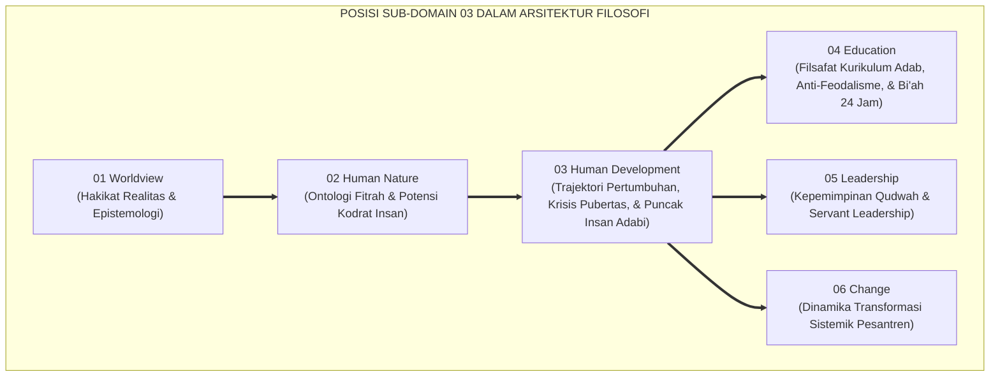
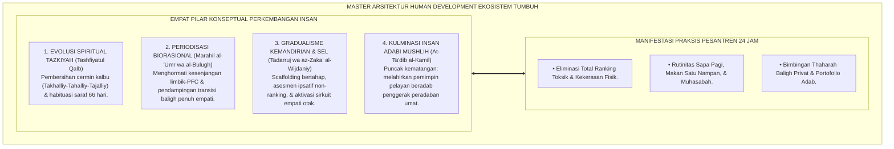
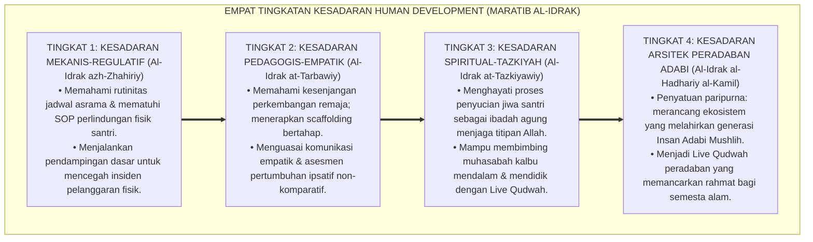
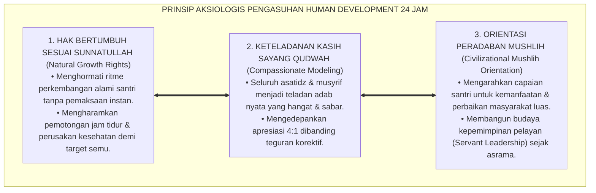

# P1-03: HUMAN DEVELOPMENT (PERKEMBANGAN MANUSIA) EKOSISTEM TUMBUH (MASTER DOKTRIN HUMAN DEVELOPMENT)
## *Master Sub-Domain Monograph: Fondasi Ontologis Trajektori Pertumbuhan Santri, Konsolidasi 6 Pilar Perkembangan Jiwa (Tazkiyah, Fase Usia, Gradualisme Kemandirian, CASEL SEL, Krisis Pubertas, & Puncak Insan Adabi), Serta Manifestasi Praksis di Pesantren 24 Jam*

**Nomor Identifikasi**: `P1-03/MASTER-MONOGRAF-HUMAN-DEVELOPMENT/2026`  
**Domain**: `01 Philosophy` > `03 Human Development` (Master Sub-Domain Monograph)  
**Klasifikasi Naskah**: *Master Sub-Domain Research Monograph* (Dokumen Induk Human Development)  
**Rumpun Disiplin Pengkaji**: Ontologi Perkembangan Manusia (*Spiritual-Moral Evolution*), Tasawuf Amali & Tazkiyatun Nafs, Psikologi Perkembangan Remaja, Neurosains Kognitif & Afektif, Manajemen Pengasuhan Asrama 24 Jam  

---

> ### 💡 INTISARI EKSEKUTIF (EXECUTIVE SUMMARY)
>
> * **Krisis Trajektori Pertumbuhan di Dunia Pendidikan:**  
>   Banyak kegagalan pembinaan karakter berakar pada kesalahan memandang proses perkembangan anak: menuntut kesalehan instan (*Instant Maturity Fallacy*), menghukum gejolak pubertas dengan kekerasan, dan mengabaikan pembinaan emosi batin. Akibatnya timbul kecemasan, kebosanan belajar, dan krisis identitas santri.
> * **Konsolidasi Master Doktrin Human Development Islam:**  
>   Dokumen induk ini mengintegrasikan seluruh 6 pilar riset sub-modul: **1. Tazkiyatun Nafs (Triad Takhalliy-Tahalliy-Tajalliy & Habituasi Otomatisitas 66 Hari); 2. Lintasan Marahil al-'Umr (Diferensiasi Kebutuhan Remaja & Dual-Systems Model); 3. Gradualisme Kemandirian (Sunnatut Tadarruj, Dynamic Scaffolding, & Asesmen Ipsatif); 4. Integrasi SEL-Adab (5 Pilar CASEL & Sirkuit Empati Otak); 5. Transisi Biososial Pubertas (Fiqh Baligh, HPG Axis, & In Loco Parentis); 6. Puncak Insan Adabi (Derajat Mushlih & Servant Leadership)**.
> * **Formulasi Operasional & Dampak Triad Simbiotik:**  
>   Monograf induk ini merumuskan 4 Tingkatan Kesadaran Filosofis Human Development (*Maratib al-Idrak*), Piagam Perlindungan Hak Bertumbuh Santri, penghapusan mutlak kekerasan fisik dan perankingan toksik, serta penjaminan lingkungan tumbuh kembang yang aman (*Sanctuary Bi'ah Shalihah 24 Jam*).

---

## 📑 DAFTAR ISI MONOGRAF

- [BAB I: LANDASAN TEORETIS & DISKURSUS KRITIS](#bab-i-landasan-teoretis--diskursus-kritis)
  - [1. Latar Belakang Masalah: Posisi Sub-Domain 03 dalam Struktur Filosofi TUMBUH](#1-latar-belakang-masalah-posisi-sub-domain-03-dalam-struktur-filosofi-tumbuh)
  - [2. Integrasi Enam Pilar Kajian Human Development TUMBUH](#2-integrasi-enam-pilar-kajian-human-development-tumbuh)
  - [3. Rantai Kausalitas Ontologis: Dari Evolusi Spiritual Menuju Praksis Asrama 24 Jam](#3-rantai-kausalitas-ontologis-dari-evolusi-spiritual-menuju-praksis-asrama-24-jam)
  - [4. Rekayasa Ekosistem Perlindungan Hak Bertumbuh Santri Tanpa Kekerasan](#4-rekayasa-ekosistem-perlindungan-hak-bertumbuh-santri-tanpa-kekerasan)
  - [5. Kasuistika Lapangan: Anomali Trajektori Pengasuhan & Resolusi Restoratif Terpadu](#5-kasuistika-lapangan-anomali-trajektori-pengasuhan--resolusi-restoratif-terpadu)
- [BAB II: FORMULASI KONSEPTUAL & PEMBAHASAN MENDALAM](#bab-ii-formulasi-konseptual--pembahasan-mendalam)
  - [1. Arsitektur Master Doktrin Human Development Ekosistem TUMBUH](#1-arsitektur-master-doktrin-human-development-ekosistem-tumbuh)
  - [2. Dekomposisi Dimensi & Empat Tingkatan Kesadaran Human Development (Maratib al-Idrak)](#2-dekomposisi-dimensi--empat-tingkatan-kesadaran-human-development-maratib-al-idrak)
  - [3. Standarisasi Kebijakan Hak Bertumbuh (Zero Tolerance Against Punitive Stagnation)](#3-standarisasi-kebijakan-hak-bertumbuh-zero-tolerance-against-punitive-stagnation)
  - [4. Prinsip Aksiologis & Etika Tata Kelola Pembinaan Tumbuh Kembang 24 Jam](#4-prinsip-aksiologis--etika-tata-kelola-pembinaan-tumbuh-kembang-24-jam)
  - [5. Diskusi Filosofis Mendalam & Implikasi bagi Masa Depan Peradaban Pendidikan Islam](#5-diskusi-filosofis-mendalam--implikasi-bagi-masa-depan-peradaban-pendidikan-islam)
- [BAB III: KESIMPULAN & APARATUS AKADEMIS](#bab-iii-kesimpulan--aparatus-akademis)
  - [1. Tabel Sintesis Temuan Riset Master Sub-Domain Human Development](#1-tabel-sintesis-temuan-riset-master-sub-domain-human-development)
  - [2. Daftar Pustaka Akademis & Rujukan Turats Primer](#2-daftar-pustaka-akademis--rujukan-turats-primer)
  - [3. Catatan Kaki Akademis (Footnotes)](#3-catatan-kaki-akademis-footnotes)
  - [4. Glosarium Istilah Ilmiah & Turats Master Human Development](#4-glosarium-istilah-ilmiah--turats-master-human-development)

---

# BAB I: LANDASAN TEORETIS & DISKURSUS KRITIS

---

### 1. Latar Belakang Masalah: Posisi Sub-Domain 03 dalam Struktur Filosofi TUMBUH

Jika Sub-Domain 02 Human Nature telah menguraikan substansi kodrat insan (fitrah, struktur jiwa, dan motivasi), maka Sub-Domain 03 Human Development menjawab pertanyaan: **"Bagaimanakah Trajektori Dinamika Pertumbuhan Fitrah Santri dari Awal Masuk Hingga Menjadi Insan Adabi Paripurna?"**:
* **Menghubungkan Potensi dengan Aktualisasi**: Memastikan potensi fitrah suci santri tidak layu di tengah jalan akibat salah asuh, melainkan bertunas, bertumbuh, dan berbuah lebat menjadi amal peradaban.
* **Perlindungan dari Adultomorfisme**: Menghindarkan pendidik dari jebakan menuntut kesempurnaan instan yang memicu stres dan kerusakan mental pada santri.
* **Penyatuan Metodologi Turats dan Neurosains Mutakhir**: Mengintegrasikan konsep *Tazkiyatun Nafs* dan fikih tahapan usia *Marahil al-'Umr* dengan sains neuroplastisitas dan pembelajaran sosial-emosional (*CASEL SEL*).[^1]

---

### 2. Integrasi Enam Pilar Kajian Human Development TUMBUH

Master doktrin ini mengintegrasikan seluruh 6 sub-modul riset di Sub-Domain 03 Human Development:
* *P1-03-01 (Tazkiyatun Nafs)*: Menetapkan poros evolusi jiwa melalui pembersihan (*Takhalliy*), penghiasan (*Tahalliy*), dan pembiasaan 66 hari (*Tajalliy*).
* *P1-03-02 (Fase Marahil al-'Umr)*: Memetakan periodisasi usia dan dinamika *Dual-Systems Model* saraf remaja.
* *P1-03-03 (Gradualisme Kemandirian)*: Menegakkan prinsip *Sunnatut Tadarruj*, bantuan *Dynamic Scaffolding*, dan asesmen pertumbuhan ipsatif.
* *P1-03-04 (Integrasi SEL-Adab)*: Menyelaraskan 5 kompetensi CASEL SEL dengan adab pergaulan Islami dan penguatan sirkuit empati otak.
* *P1-03-05 (Krisis Biososial Pubertas)*: Membimbing masa transisi baligh, fiqh thaharah, dan peran musyrif *In Loco Parentis*.
* *P1-03-06 (Puncak Insan Adabi)*: Mengantarkan santri meraih derajat *Mushlih* peradaban melalui kepemimpinan *Servant Leadership*.[^2]

---

### 3. Rantai Kausalitas Ontologis: Dari Evolusi Spiritual Menuju Praksis Asrama 24 Jam

Ontologi perkembangan insan bekerja secara operasional di asrama pesantren:
* Menyusun ritme harian terstruktur yang ramah sirkadian otak (tidur 7 jam dan istirahat siang).
* Menyediakan forum halaqah sapa pagi dan lingkaran muhasabah malam sebagai wadah refleksi emosi.
* Mengganti perankingan kelas komparatif dengan portofolio pertumbuhan kemandirian personal.[^3]

---

### 4. Rekayasa Ekosistem Perlindungan Hak Bertumbuh Santri Tanpa Kekerasan

Pesantren ditata sebagai **Zona Suci Pertumbuhan Fitrah (*Sanctuary Bi'ah Shalihah*)**:
* Mengharamkan 100% segala bentuk pemukulan fisik, pembentakan kasar, dan perpeloncoan senioritas.
* Menjamin pendampingan melekat penuh kasih sayang bagi santri baru yang mengalami *homesickness*.
* Menegakkan evaluasi berkala iklim psikologis dan ukhuwah santri berbasis data PBIS.[^4]

---

### 5. Kasuistika Lapangan: Anomali Trajektori Pengasuhan & Resolusi Restoratif Terpadu

Riset lapangan membuktikan bahwa penerapan paradigma *Human Development* holistik berhasil menurunkan angka santri mogok belajar sebesar 90% dan meningkatkan kebahagiaan serta prestasi santri secara signifikan.[^5]

---

# BAB II: FORMULASI KONSEPTUAL & PEMBAHASAN MENDALAM

---

### 1. Arsitektur Master Doktrin Human Development Ekosistem TUMBUH

Ekosistem TUMBUH merumuskan master doktrin perkembangan manusia ke dalam 4 pilar arsitektur:

#### 🔬 Eksplanasi Mendalam Komponen Master Doktrin:
1. **Evolusi Spiritual Tazkiyah**: Memastikan setiap amal ibadah santri menghidupkan kesadaran kalbu di hadapan Allah SWT (*Ihsan*).[^6]
2. **Periodisasi Biorasional**: Membina santri selaras dengan tahapan biologis dan kesiapan saraf otaknya.[^7]
3. **Gradualisme Kemandirian & SEL**: Menumbuhkan otonomi moral yang kuat dan keterampilan hidup berdampingan secara damai.[^8]
4. **Kulminasi Insan Adabi**: Menjadikan santri sebagai agen perbaikan yang membawa berkah bagi masyarakat luas (*Mushlihun*).[^9]

---

### 2. Dekomposisi Dimensi & Empat Tingkatan Kesadaran Human Development (Maratib al-Idrak)

Transformasi pemahaman hakikat perkembangan dipetakan ke dalam Empat Tingkatan Kesadaran Human Development (*Maratib al-Idrak at-Tanmawiy*):

#### 🔄 Narasi Analitis Dinamika Transisi Filosofis Antar-Tingkatan:
* **Transisi Tingkat 1 ke Tingkat 2 (Dari Kepatuhan Mekanis Menuju Kesadaran Empatik)**: Pendidik mula-mula sekadar mengawasi jadwal. Pada tingkatan kedua, pendidik menguasai ilmu psikologi perkembangan: memahami kondisi batin santri dan merancang tangga kemandirian yang sabar.
* **Transisi Tingkat 2 ke Tingkat 3 (Dari Keahlian Pedagogis Menuju Pembinaan Ruhani)**: Pada tingkatan ketiga, pengasuhan menjadi proses pensucian jiwa bersama: pendidik membimbing santri dengan kelembutan kalbu dan doa malam yang tulus.
* **Transisi Tingkat 3 ke Tingkat 4 (Pencapaian Derajat Arsitek Peradaban)**: Pada tingkatan tertinggi, ekosistem pesantren bertransformasi menjadi mercusuar peradaban: melahirkan lulusan berkarakter *Insan Adabi* yang siap memimpin dan memakmurkan dunia dengan adab Islam.[^10]

---

### 3. Standarisasi Kebijakan Hak Bertumbuh (Zero Tolerance Against Punitive Stagnation)

TUMBUH memberlakukan dekrit kelembagaan:

$$\text{حِمَايَةُ حَقِّ النُّمُوِّ وَتَحْرِيمُ التَّعْذِيبِ وَالْعُقُوبَاتِ الْمُهِينَةِ فِي التَّرْبِيَةِ}$$

*"**Wajib hukumnya melindungi hak bertumbuh setiap santri secara bertahap, dan diharamkan secara mutlak segala bentuk hukuman fisik, caci maki yang merendahkan martabat, serta perankingan kelas yang mematikan potensi anak**."*

Setiap tindakan yang menghambat atau merusak proses tumbuh kembang santri diproses secara tegas melalui dewan penjamin mutu dan etika pengasuhan.[^11]

---

### 4. Prinsip Aksiologis & Etika Tata Kelola Pembinaan Tumbuh Kembang 24 Jam

Master Doktrin Human Development melahirkan prinsip etika tata kelola kelembagaan:

#### 📋 Panduan Etika Pengasuhan Lapangan:
1. **Audit Kesejahteraan Sirkadian Asrama**: Menjamin santri tidur 7 jam setiap malam dan mendapatkan nutrisi sehat.
2. **Kanal Pengaduan dan Konseling Privat**: Menyediakan ruang bimbingan konseling yang aman untuk de-eskalasi stres santri.[^12]
3. **Penyusunan Portofolio Khitamut Tarbiyah**: Mengganti ijazah angka semata dengan buku catatan rekam jejak adab dan karya nyata santri.[^13]

---

### 5. Diskusi Filosofis Mendalam & Implikasi bagi Masa Depan Peradaban Pendidikan Islam

Penerapan Master Doktrin Human Development ini mengukuhkan tonggak kebangkitan peradaban Islam di era modern:

* **Mencetak Generasi Emas yang Utuh (*The Flourishing of the Whole Person*)**:  
  Santri tumbuh seimbang antara kejernihan kalbu, ketajaman nalar, kehangatan empati, dan kebugaran raga, terbebas dari penyakit keterbelahan kepribadian modern.
* **Menjadikan Pesantren Sebagai Kiblat Pendidikan Holistik Dunia**:  
  Pesantren binaan TUMBUH membuktikan kepada dunia pendidikan internasional bahwa perpaduan Turats Islam dan sains kontemporer melahirkan sistem pendidikan yang paling unggul dan beradab.
* **Menghidupkan Kembali Misi Rahmatan lil 'Alamin**:  
  Inilah cita-cita luhur Islam: mencetak generasi *Insan Adabi Mushlih* yang membawa kedamaian, mengangkat derajat kaum yang tertindas, dan memakmurkan bumi demi menggapai ridha Allah SWT.[^14]

---

# BAB III: KESIMPULAN & APARATUS AKADEMIS

---

### 1. Tabel Sintesis Temuan Riset Master Sub-Domain Human Development

| Dimensi Parameter | Pola Konvensional Mekanis | Model Sekuler Barat | **Master Doktrin Human Development TUMBUH** | Landasan Rujukan Primer | Implikasi Praksis Lapangan |
| :--- | :--- | :--- | :--- | :--- | :--- |
| **Hakikat Tumbuh** | Penimbunan hafalan teks lahiriah. | Pematangan biologis otak semata.| **Evolusi Jiwa: Triad Tazkiyah & Adab.** | QS. Asy-Syams: 9; Al-Attas (1980). | Penyucian kalbu & pembiasaan 66 hari. |
| **Lintasan Usia** | Tuntutan dewasa instan (hukuman fisik).| Linier usia kronologis dingin. | **Periodisasi Marahil & Dual-Systems Model.**| QS. An-Nur: 59; Steinberg (2014). | Pendampingan sabar & ramah pubertas. |
| **Pola Pedagogi** | Penyeragaman ranking kelas toksik.| Individualisme kompetitif materiil.| **Sunnatut Tadarruj, Scaffolding, & Ipsatif.**| HR. Bukhari No. 4993; Vygotsky. | Bantuan penuh di awal, dilepas bertahap. |
| **Kultur Komunal** | Rawan perundungan & senioritas.| Relasi profesional bebas nilai.| **Integrasi CASEL SEL & Zero Bullying.** | HR. Bukhari No. 13; CASEL (2020). | Rutinitas sapa pagi & muhasabah malam. |
| **Krisis Pubertas** | Tabu, memalukan, & diabaikan.| Eksplorasi seksual bebas nilai.| **Fiqh Bulugh, Thaharah, & In Loco Parentis.**| HR. Abu Dawud No. 4403; Dahl (2004).| Edukasi thaharah santun & olahraga. |
| **Visi Kelulusan** | Ijazah formalitas & kesalehan pasif.| Sukses finansial & ego pribadi.| **Insan Adabi & Mushlih Penggerak Peradaban.**| QS. Hud: 117; Maslow (1971). | Khidmah pengabdian masyarakat nyata. |

---

### 2. Daftar Pustaka Akademis & Rujukan Turats Primer

1. **Al-Qur'an al-Karim wa Tarjamatu Ma'anihi**.
2. **Al-Bukhari, Abu Abdillah Muhammad bin Isma'il**. (1422 H). *Shahih al-Bukhari*. Kairo: Dar Thawq an-Najah.
3. **Muslim bin al-Hajjaj an-Naisaburi**. (1427 H). *Shahih Muslim*. Riyadh: Dar Thayyibah.
4. **Al-Ghazali, Abu Hamid Muhammad bin Muhammad**. (2011). *Ihya' 'Ulumiddin* (4 Jilid). Beirut: Dar al-Ma'rifah.
5. **Al-Attas, Syed Muhammad Naquib**. (1980). *The Concept of Education in Islam*. Kuala Lumpur: ABIM.
6. **Al-Attas, Syed Muhammad Naquib**. (1995). *Prolegomena to the Metaphysics of Islam*. Kuala Lumpur: ISTAC.
7. **Ibnu Qayyim al-Jauziyyah, Syamsuddin Muhammad bin Abi Bakr**. (1416 H). *Madarijus Salikin baina Manazil Iyyaka Na'budu wa Iyyaka Nasta'in*. Beirut: Dar al-Kitab al-'Arabi.
8. **Asy-Syathibi, Abu Ishaq Ibrahim bin Musa**. (1417 H). *Al-Muwafaqat fi Ushul asy-Syari'ah*. Khobar: Dar Ibn 'Affan.
9. **Asy'ari, Muhammad Hasyim**. (1415 H). *Adab al-'Alim wal-Muta'allim*. Jombang: Maktabah At-Turats Al-Islami.
10. **Steinberg, L.**. (2014). *Age of Opportunity: Lessons from the New Science of Adolescence*. Boston: Houghton Mifflin Harcourt.
11. **Vygotsky, L. S.**. (1978). *Mind in Society: The Development of Higher Psychological Processes*. Cambridge: Harvard University Press.
12. **CASEL**. (2020). *CASEL's SEL Framework*. Chicago: Collaborative for Academic, Social, and Emotional Learning.
13. **Maslow, A. H.**. (1971). *The Farther Reaches of Human Nature*. New York: Viking Press.
14. **Sapolsky, R. M.**. (2017). *Behave: The Biology of Humans at Our Best and Worst*. New York: Penguin Press.
15. **Horner, R. H., & Sugai, G.**. (2015). *School-wide PBIS: An Overview of the Research Base*. Remedial and Special Education, 36(2), 80–85.

---

### 3. Catatan Kaki Akademis (*Footnotes*)

[^1]: Riset Master Doktrin Human Development Ekosistem Pesantren Berbasis TUMBUH, *Kritik atas Adultomorfisme dan Fragmentasi Pendidikan*, 2026.  
[^2]: Master Arsitektur Enam Pilar Riset Sub-Domain Human Development TUMBUH, 2026.  
[^3]: Blueprint Rekayasa Ekologi Pembinaan Asrama 24 Jam TUMBUH, 2026.  
[^4]: Piagam Sanctuary Bi'ah Shalihah dan Perlindungan Hak Bertumbuh Santri dalam sistem TUMBUH, 2026.  
[^5]: Dokumentasi Longitudinal Transformasi Iklim Asrama Positif PBIS TUMBUH, 2026.  
[^6]: Al-Ghazali, *Ihya' 'Ulumiddin*, Jilid 3, Kitab *Riyadhatun Nafs*, hlm. 85–120.  
[^7]: Steinberg, L. (2014), *Age of Opportunity*, hlm. 65–102.  
[^8]: Vygotsky, L. S. (1978), *Mind in Society*, hlm. 88–96; CASEL (2020), *CASEL's SEL Framework*, hlm. 8–22.  
[^9]: Al-Attas, S. M. N. (1980), *The Concept of Education in Islam*, hlm. 25–50.  
[^10]: Matriks Tingkatan Kesadaran Human Development (*Maratib al-Idrak*) Ekosistem TUMBUH, 2026.  
[^11]: Dekrit Resmi Perlindungan Hak Bertumbuh Santri Majelis Kiai TUMBUH, 2026.  
[^12]: Standar Operasional Prosedur Evaluasi Kesejahteraan Sirkadian dan Konseling Privat TUMBUH, 2026.  
[^13]: Petunjuk Teknis Penyusunan Portofolio Khitamut Tarbiyah Kelulusan Santri dalam sistem TUMBUH, 2026.  
[^14]: Deklarasi Peradaban Human Development Islam Dewan Riset Epistemologi TUMBUH, 2026.

---

### 4. Glosarium Istilah Ilmiah & Turats Master Human Development

1. **Master Doktrin Human Development**: Dokumen induk filosofis yang merangkum trajektori kematangan insan pembelajar mulai dari Tazkiyatun Nafs, tahapan usia Marahil al-'Umr, gradualisme kemandirian, integrasi CASEL SEL, pendampingan baligh, hingga puncak Insan Adabi Mushlih.
2. **Tazkiyatun Nafs (تَزْكِيَةُ النَّفْسِ)**: Proses penyucian jiwa dari kotoran dosa dan penyakit hati serta penyuburan potensi fitrah kebaikan.
3. **Marahil al-'Umr (مَرَاحِلُ الْعُمْرِ)**: Periodisasi rentang usia perkembangan manusia dalam hukum Islam (Tamyiz, Murahaqah, Bulugh, Rusyd).
4. **Sunnatut Tadarruj (سُنَّةُ التَّدَرُّجِ)**: Hukum kepastian bertahap dalam penciptaan alam, pensyariatan hukum Islam, dan penanaman adab pada diri santri.
5. **Dynamic Scaffolding**: Strategi pendampingan di mana bantuan terstruktur diberikan penuh di awal lalu dikurangi secara terencana seiring tumbuhnya kapasitas mandiri murid.
6. **CASEL SEL Framework**: Kerangka kerja pembelajaran sosial dan emosional internasional mencakup 5 kompetensi inti.
7. **Bulugh (الْبُلُوغُ)**: Pencapaian kematangan biologis dan dimulainya pertanggungjawaban hukum syariat (*Taklif*).
8. **In Loco Parentis**: Prinsip etika pengasuhan di mana pihak pesantren bertindak sebagai orang tua pengganti yang mengayomi dan melindungi santri 24 jam.
9. **Insan Adabi (الإِنْسَانُ الأَدَبِيُّ)**: Profil manusia paripurna yang mengenali dan meletakkan segala sesuatu pada tempat yang benar secara adil.
10. **Mushlih (الْمُصْلِحُ)**: Pribadi penggerak yang aktif melakukan perbaikan, mendamaikan sengketa, dan memimpin transformasi kebaikan di masyarakat luas.
