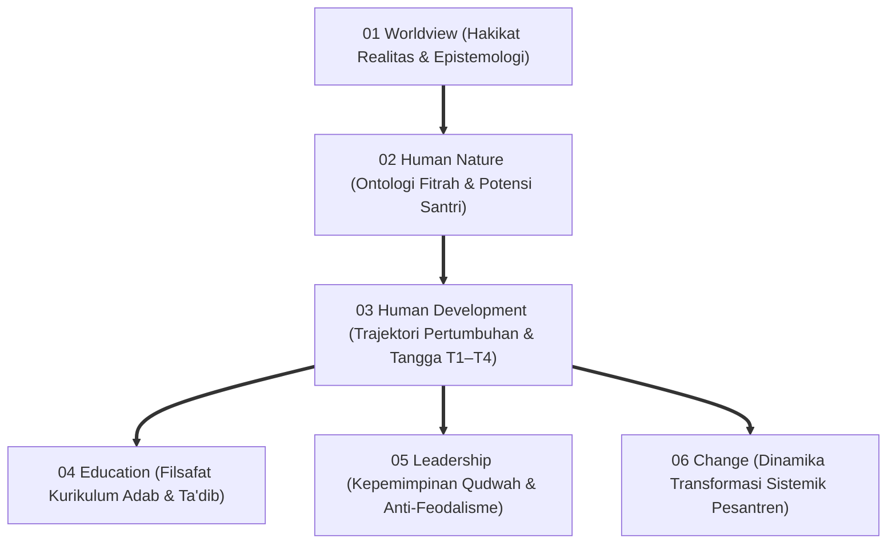
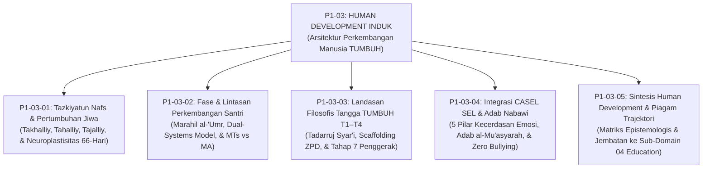
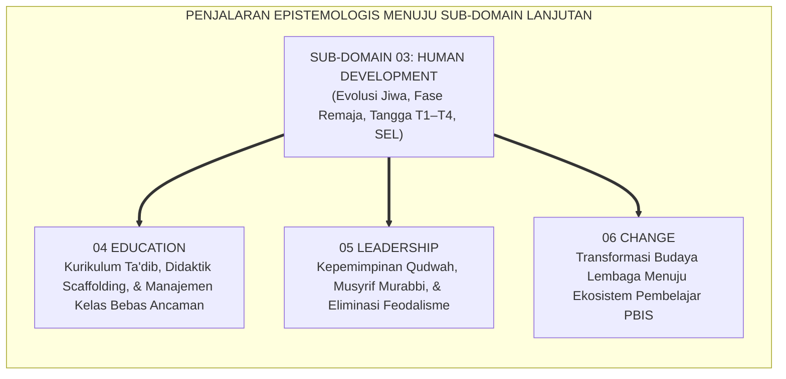

# P1-03: HUMAN DEVELOPMENT (PERKEMBANGAN MANUSIA) EKOSISTEM TUMBUH
## *Monograf Induk Sub-Domain 03: Fondasi Ontologis Trajektori Pertumbuhan Santri, Rekapitulasi 4 Pilar Human Development, Matriks Epistemologis, & Piagam Kelembagaan Pemuliaan Hak Bertumbuh Santri*

**Nomor Identifikasi**: `P1-03/MONOGRAF-INDUK-HUMAN-DEVELOPMENT/2026`  
**Domain**: `01 Philosophy` > `03 Human Development`  
**Klasifikasi Naskah**: *Master Sub-Domain Monograph* (Monograf Induk Sub-Domain Perkembangan Manusia)  
**Rumpun Disiplin Pengkaji**: Ontologi Perkembangan Manusia (*Spiritual-Moral Evolution*), Tasawuf Amali & Tazkiyatun Nafs, Psikologi Perkembangan Remaja (*Adolescent Psychology*), Neurosains Kognitif & Afektif, Manajemen Pengasuhan Asrama Pesantren 24 Jam  

---

> ### 💡 INTISARI PRAKTIS (3 MENIT PAHAM UNTUK ASATIDZ & MUSYRIF)
>
> * **Posisi Sub-Domain 03 Human Development:**  
>   Menjawab pertanyaan mendasar kedua dalam pendidikan: *"Bagaimanakah trajektori dinamika pertumbuhan fitrah santri dari awal masuk hingga menjadi manusia dewasa beradab yang mandiri?"*
> * **Empat Pilar Perkembangan Santri yang Terintegrasi 100%:**  
>   1. **P1-03-01 (Tazkiyatun Nafs):** Poros evolusi jiwa melalui pembersihan (*Takhalliy*), penghiasan (*Tahalliy*), dan pembiasaan konsisten 66 hari (*Riyadhah & Mujahadah*) menuju watak kedua (*Tajalliy*).  
>   2. **P1-03-02 (Fase Marahil al-'Umr):** Pembedaan kebutuhan perkembangan MTs (awal pubertas/sistem limbik dominan) vs MA (maturasi nalar/PFC); perlindungan krisis transisi asrama (*Homesickness*).  
>   3. **P1-03-03 (Tangga TUMBUH T1–T4):** Lintasan gradualisme syar'i (*Tadarruj & Scaffolding*) dari T1 Adaptasi hingga T4 Transformasi / **Tahap 7 Penggerak**, dengan asesmen ipsatif non-komparatif.  
>   4. **P1-03-04 (Integrasi SEL):** Harmonisasi 5 pilar kecerdasan sosio-emosional CASEL dengan khazanah Adab al-Mu'asyarah Turats, aktivasi sirkuit empati otak (*ACC*), dan budaya *Zero Bullying*.
> * **Komitmen Kelembagaan Zero Tolerance:**  
>   Segala bentuk kekerasan fisik, pembentakan kasar, perpeloncoan feodal senior, penyeragaman ranking komparatif toksik, dan pengabaian distres adaptasi dinyatakan **HARAM DAN DILARANG KERAS** di seluruh jaringan pesantren TUMBUH.

---

## 📑 DAFTAR ISI MONOGRAF INDUK

- [BAGIAN I: ARSITEKTUR ONTOLOGIS & POHON HUBUNGAN SUB-DOMAIN 03](#bagian-i-arsitektur-ontologis--pohon-hubungan-sub-domain-03)
  - [1. Posisi Dokumen dalam Taksonomi 11 Domain TUMBUH](#1-posisi-dokumen-dalam-taksonomi-11-domain-tumbuh)
  - [2. Pohon Hubungan Antar-Monograf Sub-Domain 03 Human Development](#2-pohon-hubungan-antar-monograf-sub-domain-03-human-development)
  - [3. Rangkuman 4 Pilar Perkembangan Insan Pembelajar Ekosistem TUMBUH](#3-rangkuman-4-pilar-perkembangan-insan-pembelajar-ekosistem-tumbuh)
  - [4. Matriks Komitmen Perlindungan Hak Bertumbuh (Zero Tolerance Policy 100%)](#4-matriks-komitmen-perlindungan-hak-bertumbuh-zero-tolerance-policy-100)
- [BAGIAN II: KODIFIKASI MATRIKS RESMI & DIREKTORI MONOGRAF TERPADU](#bagian-ii-kodifikasi-matriks-resmi--direktori-monograf-terpadu)
  - [1. Matriks Rujukan Lengkap 5 Berkas Monograf Sub-Domain 03](#1-matriks-rujukan-lengkap-5-berkas-monograf-sub-domain-03)
  - [2. Alur Penjalaran Filosofis Menuju 3 Sub-Domain Lanjutan (P1-04 s/d P1-06)](#2-alur-penjalaran-filosofis-menuju-3-sub-domain-lanjutan-p1-04-sd-p1-06)
- [BAGIAN III: APARATUS AKADEMIS & APENDIKS](#bagian-iii-aparatus-akademis--apendiks)
  - [1. Daftar Pustaka Otoritatif Turats & Sains Global](#1-daftar-pustaka-otoritatif-turats--sains-global)
  - [2. Catatan Kaki Akademis (Footnotes)](#2-catatan-kaki-akademis-footnotes)
  - [3. Glosarium Istilah Kunci Human Development Induk](#3-glosarium-istilah-kunci-human-development-induk)

---

# BAGIAN I: ARSITEKTUR ONTOLOGIS & POHON HUBUNGAN SUB-DOMAIN 03

---

### 1. Posisi Dokumen dalam Taksonomi 11 Domain TUMBUH

Jika **Domain 01 Philosophy > 02 Human Nature** menetapkan *Siapa Santri Sebenarnya* (Ontologi Fitrah & Potensi Primordial), maka **Domain 01 Philosophy > 03 Human Development** menetapkan **Bagaimana Jiwa dan Raga Santri Mengalami Dinamika Pertumbuhan Menuju Kesempurnaan Adab**:

---

### 2. Pohon Hubungan Antar-Monograf Sub-Domain 03 Human Development

Sub-Domain `03 Human Development` memuat 1 Monograf Induk dan 5 Monograf Riset Khusus yang saling menopang secara utuh:

---

### 3. Rangkuman 4 Pilar Perkembangan Insan Pembelajar Ekosistem TUMBUH

1. **Pilar 1: Tazkiyatun Nafs & Evolusi Spiritual-Moral (P1-03-01)**:  
   Pertumbuhan sejati adalah penyucian kalbu melalui dialektika *Takhalliy* (pengikisan penyakit hati dan ghashab) dan *Tahalliy* (penghiasan akhlak). Didukung riset neuroplastisitas pembiasaan 66 hari Dr. Phillippa Lally yang memindahkan kendali perilaku dari korteks prefrontal ke refleks basal ganglia (*Tajalliy*).
2. **Pilar 2: Diferensiasi Usia & Neurosains Remaja (P1-03-02)**:  
   Memadukan periodisasi *Marahil al-'Umr* Turats dengan *Dual-Systems Model* Laurence Steinberg. Mengakui kesenjangan perkembangan antara sistem limbik (emosi yang matang cepat di pubertas) dan korteks prefrontal (kendali nalar yang baru matang sempurna di usia 25 th). Menyusun diferensiasi pengasuhan jenjang MTs vs MA dan protokol mitigasi homesickness.
3. **Pilar 3: Gradualisme Tangga Pertumbuhan T1–T4 (P1-03-03)**:  
   Menegakkan prinsip *Tadarruj Syar'i* dan *Scaffolding ZPD* Lev Vygotsky. Menghapus tuntutan kesempurnaan instan dengan membagi trajektori kemandirian santri ke dalam 4 etape (T1 Adaptasi, T2 Pembiasaan, T3 Internalisasi, T4 Transformasi) menuju **Tahap 7 Penggerak**, serta mengganti perankingan kelas dengan Asesmen Pertumbuhan Ipsatif.
4. **Pilar 4: Integrasi Kecerdasan Sosio-Emosional SEL (P1-03-04)**:  
   Mengharmonisasikan 5 pilar kompetensi CASEL SEL dengan khazanah *Adab al-Mu'asyarah* Turats Islam. Mengaktifkan sirkuit empati biologis otak (*ACC-Insula*) melalui 3 jangkar rutinitas asrama (Sapa Pagi, Makan Bersama Satu Nampan, Muhasabah Malam) dan penegakan budaya *Zero Bullying* berbasis Restorative Justice.[^1]

---

### 4. Matriks Komitmen Perlindungan Hak Bertumbuh (Zero Tolerance Policy 100%)

| Larangan Terhadap Hak Bertumbuh | Praktik Konvensional yang Dihapus 100% | Alternatif Beradab dalam Ekosistem TUMBUH |
| :--- | :--- | :--- |
| **1. Tuntutan Kesempurnaan Instan** | Menghukum berat santri baru yang belum lancar membaca kitab atau bangun tahajud. | **Pendampingan Tangga T1–T4**: Bantuan intensif (*Scaffolding*) 80% di awal dan pembiasaan bertahap 66 hari.[^2] |
| **2. Adultomorfisme & Kekerasan Emosi** | Menuntut remaja bersikap setenang orang dewasa; membentak santri yang labil. | **Dual-Systems De-escalation**: Musyrif bertindak sebagai 'rem eksternal' penuh kasih sayang (*Firm & Kind*). |
| **3. Senioritas Feodal & Perpeloncoan** | Penyerahan wewenang hukuman kepada senior; tradisi sidang malam kamar gelap. | **Kaderisasi Tahap 7 Penggerak**: Senior dilatih menjadi Duta Adab dan mentor pelayan (*Servant Leader*). |
| **4. Ranking Komparatif Toksik** | Mengumumkan ranking 1-30; melabeli santri rangking bawah sebagai anak bodoh. | **Asesmen Pertumbuhan Ipsatif**: Mengukur kemajuan personal diri santri dari waktu ke waktu (*Growth Portfolio*).[^3] |
| **5. Pengabaian Distres Adaptasi** | Menghina santri menangis sebagai "tidak ikhlas"; melarang total kontak keluarga. | **Protokol Ramah Homesickness**: Validasi emosi, pelukan kasih, dan jadwal komunikasi terukur dengan orang tua.[^4] |

---

# BAGIAN II: KODIFIKASI MATRIKS RESMI & DIREKTORI MONOGRAF TERPADU

---

### 1. Matriks Rujukan Lengkap 5 Berkas Monograf Sub-Domain 03

| Kode Berkas | Judul Naskah Monograf | Dewan Keilmuan Pengkaji | Tautan Berkas Markdown |
| :---: | :--- | :--- | :---: |
| **P1-03-01** | **Tazkiyatun Nafs dan Pertumbuhan Jiwa Santri** | `pakar-filosofi-tumbuh` `pakar-epistemologi-turats` `pakar-social-emotional-learning` | [**`Buka Naskah P1-03-01`**](./P1-03-01-Tazkiyatun-Nafs-dan-Pertumbuhan-Jiwa.md) |
| **P1-03-02** | **Fase dan Lintasan Perkembangan Santri** | `pakar-neurosains-perkembangan` `pakar-pengasuhan-asrama` `pakar-bimbingan-konseling` | [**`Buka Naskah P1-03-02`**](./P1-03-02-Fase-dan-Lintasan-Perkembangan-Santri.md) |
| **P1-03-03** | **Landasan Filosofis Tangga TUMBUH (T1–T4)** | `pakar-desain-kurikulum-adab` `pakar-simulasi-sistem-tumbuh` `pakar-psikometri-dan-validasi-instrumen` | [**`Buka Naskah P1-03-03`**](./P1-03-03-Landasan-Filosofis-Tangga-TUMBUH-T1-T4.md) |
| **P1-03-04** | **Integrasi CASEL SEL dan Taksonomi Adab Nabawi** | `pakar-social-emotional-learning` `pakar-psikologi-sosial-santri` `pakar-kuratif-restoratif` | [**`Buka Naskah P1-03-04`**](./P1-03-04-Integrasi-SEL-dan-Karakter-Santri.md) |
| **P1-03-05** | **Sintesis Filosofis Human Development & Piagam Trajektori** | `pakar-filosofi-tumbuh` `pakar-metodologi-riset-tumbuh` `pakar-tata-kelola-qudwah` | [**`Buka Naskah P1-03-05`**](./P1-03-05-Sintesis-Human-Development.md) |

---

### 2. Alur Penjalaran Filosofis Menuju 3 Sub-Domain Lanjutan (P1-04 s/d P1-06)

---

# BAGIAN III: APARATUS AKADEMIS & APENDIKS

---

### 1. Daftar Pustaka Otoritatif Turats & Sains Global

1. **Al-Qur'an al-Karim wa Tarjamatu Ma'anih**.
2. **Al-Bukhari, Muhammad bin Isma'il**. (1422 H). *Shahih al-Bukhari*. Beirut: Dar Thawq an-Najah.
3. **Muslim bin al-Hajjaj an-Naisaburi**. (1374 H). *Shahih Muslim*. Kairo: Isa al-Babi al-Halabi.
4. **Al-Ghazali, Abu Hamid Muhammad bin Muhammad**. (2011). *Ihya 'Ulumiddin*. Beirut: Dar al-Ma'rifah.
5. **Al-Attas, Syed Muhammad Naquib**. (1980). *The Concept of Education in Islam*. Kuala Lumpur: ABIM.
6. **Ibnul Qayyim al-Jauziyyah, Syamsuddin Muhammad**. (1996). *Madarijus Salikin*. Beirut: Dar al-Kitab al-'Arabi.
7. **Lally, P., et al.**. (2010). *How are habits formed: Modelling habit formation in the real world*. European Journal of Social Psychology, 40(6), 998–1009.
8. **Steinberg, L.**. (2008). *A social neuroscience perspective on adolescent risk-taking*. Developmental Review, 28(1), 78–106.
9. **Erikson, E. H.**. (1968). *Identity: Youth and Crisis*. New York: W. W. Norton.
10. **Vygotsky, L. S.**. (1978). *Mind in Society: The Development of Higher Psychological Processes*. Cambridge: Harvard University Press.
11. **Hughes, G.**. (2014). *Ipsative Assessment: Motivation through marking progress*. London: Palgrave Macmillan.
12. **CASEL**. (2020). *CASEL's SEL Framework*. Chicago: Collaborative for Academic, Social, and Emotional Learning.
13. **Singer, T., & Klimecki, O. M.**. (2014). *Empathy and compassion*. Current Biology, 24(18), R875–R878.

---

### 2. Catatan Kaki Akademis (*Footnotes*)

[^1]: Al-Attas, *The Concept of Education in Islam*, hlm. 24–28.  
[^2]: Vygotsky, L. S. (1978), *Mind in Society*, Harvard University Press, hlm. 86.  
[^3]: Hughes, G. (2014), *Ipsative Assessment*, Palgrave Macmillan.  
[^4]: Thurber & Walton (2007), *Preventing and treating homesickness*, Pediatrics, hlm. 192–201.

---

### 3. Glosarium Istilah Kunci Human Development Induk

1. **Human Development (تَنْمِيَةُ الْإِنْسَانِ)**: Evolusi terpadu dimensi spiritual, biologis, kognitif, dan emosional santri menuju kematangan adab paripurna (*Insan Kamil*).
2. **Tazkiyatun Nafs**: Poros utama penyucian dan penumbuhan jiwa yang terdiri atas tiga tahapan: *Takhalliy* (pembersihan), *Tahalliy* (penghiasan), dan *Tajalliy* (pemancaran watak kedua).
3. **Marahil al-'Umr**: Periodisasi rentang usia dalam Islam (*Thufulah, Tamyiz, Murahaqah, Bulugh, Rusyd*).
4. **Dual-Systems Model**: Teori neurosains mengenai ketimpangan kematangan sistem emosi limbik (cepat) vs korteks prefrontal (lambat) pada usia remaja.
5. **Tangga TUMBUH (T1–T4)**: Framework empat etape kemandirian adab santri (Adaptasi, Pembiasaan, Internalisasi, Transformasi).
6. **Tahap 7 Penggerak**: Puncak kaderisasi santri sebagai teladan hidup (*Qudwah*) dan pemimpin yang melayani sesama (*Servant Leader*).
7. **Asesmen Ipsatif**: Evaluasi kemajuan personal non-ranking yang membandingkan performa santri saat ini dengan titik awalnya di masa lalu.
8. **CASEL SEL**: Kerangka kerja 5 kompetensi kecerdasan sosio-emosional terpadu berbasis *Adab al-Mu'asyarah*.
