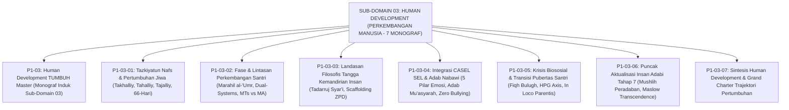

# SUB-DOMAIN 03: HUMAN DEVELOPMENT (PERKEMBANGAN MANUSIA)
## *Sitemap Induk & Navigasi Monograf Dinamika Pertumbuhan Karakter Insan Pembelajar Ekosistem TUMBUH (7 Monograf Terpadu)*

**Nomor Identifikasi**: `P1-03/INDEX/2026`  
**Domain**: `01 Philosophy` > `03 Human Development`  
**Klasifikasi**: Folder Monograf Riset Tazkiyatun Nafs, Fase Perkembangan Remaja, Tangga Kemandirian Insan, CASEL SEL, Krisis Pubertas, & Puncak Insan Adabi (8 Berkas Lengkap)

---

## 🏛️ SITEMAP & NAVIGASI SELURUH BERKAS SUB-DOMAIN 03

Sub-Domain `03 Human Development` membedah bagaimana potensi fitrah santri bertumbuh dan berevolusi melalui proses penyucian jiwa (*Tazkiyah*), pentahapan usia biologis (*Marahil al-'Umr*), tangga kemandirian adab (*Sunnatut Tadarruj*), kecerdasan sosio-emosional (*CASEL SEL*), transisi baligh, dan puncak aktualisasi insan adabi penggerak peradaban:

---

## 📑 DAFTAR LENGKAP 8 BERKAS MONOGRAF TERPADU SUB-DOMAIN 03

Seluruh modul telah distandarisasi 100% ke dalam format **Monograf Terpadu**:
* **💡 Intisari Praktis (3 Menit Paham)**: Bahasa membumi dan aplikatif untuk asatidz & musyrif sebelum daftar isi.
* **Bagian I**: Riset Inkuiri, Formalisasi Silogisme Mantiq, Dialektika Multi-Perspektif (tanpa sebutan kata meta "pakar"), Teks Primer Turats & Sains Asli, serta Kasuistika Asrama Riil.
* **Bagian II**: Kodifikasi Baku Hasil Riset & Kesimpulan Formal (Matriks, Alur SOP, Piagam).
* **Bagian III**: Aparatus Akademis (Tabel Sintesis, Daftar Pustaka Otoritatif, Catatan Kaki *Footnotes*, dan Glosarium Istilah Teknis).

| No | Berkas Monograf | Judul Berkas | Fokus Kajian & Rujukan Utama |
| :---: | :--- | :--- | :--- |
| **00** | [**`P1-03-Human-Development-TUMBUH.md`**](./P1-03-Human-Development-TUMBUH.md) | Monograf Induk Human Development TUMBUH | Master 6 Pilar Trajektori Pertumbuhan Santri, Zero Tolerance Policy terhadap pembatasan hak bertumbuh, & peta penjalaran ke 3 sub-domain lanjutan (`04 Education`, `05 Leadership`, `06 Change`). |
| **01** | [**`P1-03-01-Tazkiyatun-Nafs-dan-Pertumbuhan-Jiwa.md`**](./P1-03-01-Tazkiyatun-Nafs-dan-Pertumbuhan-Jiwa.md) | Tazkiyatun Nafs & Pertumbuhan Jiwa Santri | QS. Asy-Syams: 9–10, QS. Al-A'la: 14–15, konsep Takhalliy-Tahalliy-Tajalliy, Riyadhah-Mujahadah Imam Al-Ghazali (*Ihya*) & Ibnul Qayyim (*Madarij*), dan sirkuit neuroplastisitas habit loop 66-hari Dr. Phillippa Lally UCL (45 Catatan Kaki). |
| **02** | [**`P1-03-02-Fase-dan-Lintasan-Perkembangan-Santri.md`**](./P1-03-02-Fase-dan-Lintasan-Perkembangan-Santri.md) | Fase & Lintasan Perkembangan Santri | Periodisasi *Marahil al-'Umr* (Tamyiz, Murahaqah, Bulugh, Rusyd), navigasi krisis identitas Erik Erikson, Dual-Systems Model Laurence Steinberg (kesenjangan Limbik vs PFC), diferensiasi MTs vs MA, & SOP Homesickness (40 Catatan Kaki). |
| **03** | [**`P1-03-03-Landasan-Filosofis-Tangga-Kemandirian-Insan.md`**](./P1-03-03-Landasan-Filosofis-Tangga-Kemandirian-Insan.md) | Landasan Filosofis Tangga Kemandirian Insan | Prinsip *Tadarruj Syar'i* (HR. Bukhari 'Aisyah RA), Scaffolding ZPD Lev Vygotsky, 4 etape adaptasi hingga transformasi, dan Asesmen Pertumbuhan Ipsatif non-ranking (37 Catatan Kaki). |
| **04** | [**`P1-03-04-Integrasi-SEL-dan-Karakter-Santri.md`**](./P1-03-04-Integrasi-SEL-dan-Karakter-Santri.md) | Integrasi CASEL SEL dengan Adab Nabawi | Harmonisasi 5 kompetensi CASEL SEL dengan taksonomi adab Turats (*Adab al-Mu'asyarah* An-Nawawi, Al-Ghazali, Al-Muhasibi), rutinitas 24-jam asrama (Sapa Pagi, Makan Bersama, Muhasabah), aktivasi sirkuit empati ACC & Mirror Neurons, dan budaya Zero Bullying (26 Catatan Kaki). |
| **05** | [**`P1-03-05-Krisis-Biososial-dan-Transisi-Pubertas-Santri.md`**](./P1-03-05-Krisis-Biososial-dan-Transisi-Pubertas-Santri.md) | Krisis Biososial & Transisi Pubertas Santri | Fiqh Bulugh & Ahkamut Taklif (HR. Abu Dawud 4403), aktivasi HPG Axis endokrin, resolusi krisis identitas Erikson di asrama, SOP edukasi baligh privat, & sublimasi olahraga kinestetik (9 Catatan Kaki). |
| **06** | [**`P1-03-06-Puncak-Aktualisasi-Insan-Adabi-Tahap-7.md`**](./P1-03-06-Puncak-Aktualisasi-Insan-Adabi-Tahap-7.md) | Puncak Aktualisasi Insan Adabi Tahap 7 | Epistemologi Insan Adabi Syed Muhammad Naquib Al-Attas, doktrin kaum *Mushlihoon* (QS. Hud: 117), Self-Transcendence Maslow & Generativitas Erikson, kaderisasi penggerak peradaban, & Khitamut Tarbiyah pengabdian umat (12 Catatan Kaki). |
| **07** | [**`P1-03-07-Sintesis-Human-Development.md`**](./P1-03-07-Sintesis-Human-Development.md) | Sintesis Filosofis Perkembangan Manusia | Matriks integrasi 6 pilar Human Development, komparasi dengan Behaviorisme, Kognitivisme, Humanistik, Grand Charter Hak Bertumbuh Santri, dan jembatan ke Sub-Domain `04 Education` (8 Catatan Kaki). |
