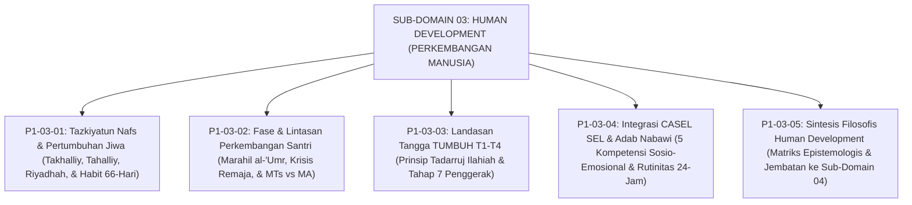

# SUB-DOMAIN 03: HUMAN DEVELOPMENT (PERKEMBANGAN MANUSIA)
## *Sitemap Induk & Navigasi Monograf Dinamika Pertumbuhan Karakter Santri*

**Nomor Identifikasi**: `P1-03/INDEX/2026`  
**Domain**: `01 Philosophy` > `03 Human Development`  
**Klasifikasi**: Folder Monograf Tazkiyatun Nafs, Perkembangan Remaja, & SEL

---

## 🏛️ SITEMAP & NAVIGASI SELURUH BERKAS SUB-DOMAIN 03

Sub-Domain `03 Human Development` membedah bagaimana potensi fitrah santri bertumbuh dan berevolusi melalui proses tazkiyah, pentahapan usia, tangga kemandirian, dan kecerdasan sosio-emosional:

---

## 📑 DAFTAR BERKAS MODULAR SUB-DOMAIN 03

| No | Berkas Monograf | Judul Berkas | Fokus Kajian & Rujukan Utama |
| :---: | :--- | :--- | :--- |
| **01** | [**`P1-03-01-Tazkiyatun-Nafs-dan-Pertumbuhan-Jiwa.md`**](./P1-03-01-Tazkiyatun-Nafs-dan-Pertumbuhan-Jiwa.md) | Tazkiyatun Nafs & Pertumbuhan Jiwa Santri | QS. Asy-Syams: 9–10, konsep Takhalliy-Tahalliy, Riyadhah-Mujahadah Imam Al-Ghazali (*Ihya*), dan sirkuit neuroplastisitas habit loop 66-hari Dr. Phillippa Lally. |
| **02** | [**`P1-03-02-Fase-dan-Lintasan-Perkembangan-Santri.md`**](./P1-03-02-Fase-dan-Lintasan-Perkembangan-Santri.md) | Fase & Lintasan Perkembangan Santri | Periodisasi *Marahil al-'Umr* (Tamyiz, Murahaqah, Rusyd), navigasi krisis identitas Erikson, dual-systems model Steinberg, dan diferensiasi MTs vs MA. |
| **03** | [**`P1-03-03-Landasan-Filosofis-Tangga-TUMBUH-T1-T4.md`**](./P1-03-03-Landasan-Filosofis-Tangga-TUMBUH-T1-T4.md) | Landasan Filosofis Tangga TUMBUH (T1–T4) | Prinsip *Tadarruj Syar'i* (HR. Bukhari Aisyah RA), 4 etape adaptasi hingga transformasi, progresi Tahap 7 Penggerak, dan asesmen pertumbuhan ipsatif. |
| **04** | [**`P1-03-04-Integrasi-SEL-dan-Karakter-Santri.md`**](./P1-03-04-Integrasi-SEL-dan-Karakter-Santri.md) | Integrasi CASEL SEL dengan Adab Nabawi | Harmonisasi 5 kompetensi CASEL SEL dengan taksonomi adab Turats (*Adab al-Mu'asyarah* An-Nawawi, Al-Muhasibi), rutinitas 24-jam asrama, dan *ACC empathy brain*. |
| **05** | [**`P1-03-05-Sintesis-Human-Development.md`**](./P1-03-05-Sintesis-Human-Development.md) | Sintesis Filosofis Perkembangan Manusia | Matriks integrasi 4 pilar Human Development, deklarasi prinsip abadi pertumbuhan, dan jembatan ke Sub-Domain `04 Education`. |
