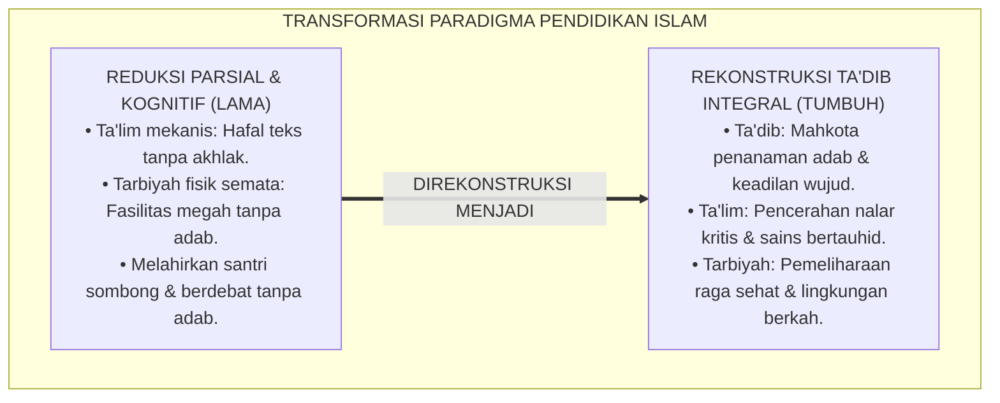
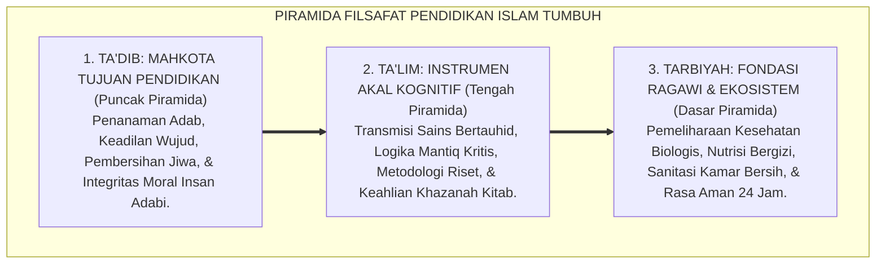
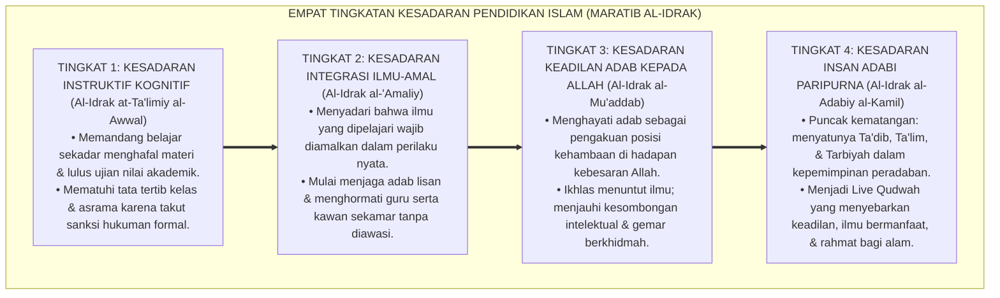
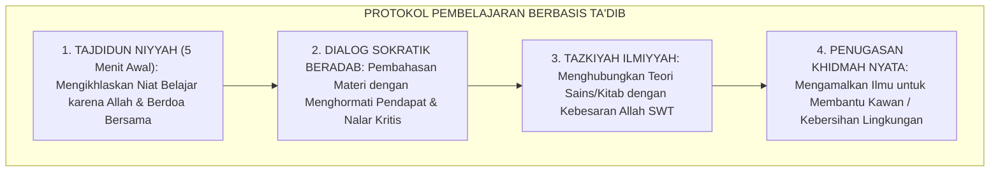

# P1-04-01: FALSAFAH TARBIYAH, TA'DIB, DAN TA'LIM (PHILOSOPHY OF ISLAMIC EDUCATION)
## *Monograf Riset Akademik: Dekonstruksi Semantik Triad Istilah Pendidikan Islam, Rekonstruksi Ta'dib Syed Muhammad Naquib Al-Attas, Hermeneutika Hadits "Addabani Rabbi", Kritik atas Intelektualisme Sekuler, Serta Integrasi Kurikulum Adab 24 Jam di Pesantren*

**Nomor Identifikasi**: `P1-04-01/MONOGRAF-RISET-FALSAFAH-TADIB/2026`  
**Domain**: `01 Philosophy` > `04 Education` (Sub-Modul 01: *Philosophy of Islamic Education*)  
**Klasifikasi Naskah**: *Academic Research Monograph* (Monograf Riset Akademik Fondasional)  
**Rumpun Disiplin Pengkaji**: Filsafat Pendidikan Islam (*Falsafah at-Tarbiyah wat-Ta'dib*), Semantik & Hermeneutika Bahasa Arab Klasik, Epistemologi Islam (*Islamization of Knowledge*), Desain Kurikulum Pesantren Holistik  

---

> ### 💡 INTISARI EKSEKUTIF (EXECUTIVE SUMMARY)
>
> * **Kelemahan Paradigma Lama: Reduksi Pendidikan Menjadi Sekadar Transfer Kognitif:**  
>   Banyak lembaga pendidikan Islam mereduksi tugasnya sekadar transfer informasi dan hafalan teks (*Ta'lim Kognitif Mekanis*) atau sekadar penyediaan fasilitas fisik asrama (*Tarbiyah Ragawi*). Hal ini mengabaikan substansi mahkota pendidikan Islam, yaitu **Ta'dib** (penanaman adab dan keadilan wujud), sehingga melahirkan lulusan berotak tajam namun sombong dan miskin adab (*Loss of Adab*).
> * **Inovasi Konseptual: Ta'dib sebagai Episentrum Filsafat Pendidikan Islam:**  
>   TUMBUH menegaskan rekonstruksi filosofis Prof. Syed Muhammad Naquib Al-Attas: membedakan secara tegas triad **Tarbiyah (Pemeliharaan Fisik-Biologis), Ta'lim (Transmisi Ilmu & Nalar Logis), dan Ta'dib (Penanaman Adab, Pengenalan Posisi Diri di Hadapan Allah, & Keadilan Wujud)**. Ta'dib adalah mahkota yang memandu seluruh proses pembelajaran.
> * **Formulasi Operasional & Pembuktian Lapangan:**  
>   Monograf ini menguraikan matriks 5 dimensi adab 24 jam, 4 Tingkatan Kesadaran Filosofi Pendidikan Islam (*Maratib al-Idrak*), protokol integrasi ta'dib kelas-asrama, dan etika desakralisasi ilmu.

---

## 📑 DAFTAR ISI MONOGRAF

- [BAB I: LANDASAN TEORETIS & DISKURSUS KRITIS](#bab-i-landasan-teoretis--diskursus-kritis)
  - [1. Latar Belakang Masalah: Krisis Kehilangan Adab (Loss of Adab) dan Reduksi Pendidikan](#1-latar-belakang-masalah-krisis-kehilangan-adab-loss-of-adab-dan-reduksi-pendidikan)
  - [2. Dekonstruksi Semantik Triad Istilah Turats: Tarbiyah, Ta'lim, dan Ta'dib](#2-dekonstruksi-semantik-triad-istilah-turats-tarbiyah-talim-dan-tadib)
  - [3. Rekonstruksi Epistemologis Syed Muhammad Naquib Al-Attas: Ta'dib dan Keadilan Wujud](#3-rekonstruksi-epistemologis-syed-muhammad-naquib-al-attas-tadib-dan-keadilan-wujud)
  - [4. Eksegesis Hadits "Addabani Rabbi" & Ayat Pensucian Jiwa (QS. Al-Baqarah: 151)](#4-eksegesis-hadits-addabani-rabbi--ayat-pensucian-jiwa-qs-al-baqarah-151)
  - [5. Kasuistika Lapangan: Fenomena Kesombongan Intelektual Santri Berprestasi & Resolusi Restoratif](#5-kasuistika-lapangan-fenomena-kesombongan-intelektual-santri-berprestasi--resolusi-restoratif)
- [BAB II: FORMULASI KONSEPTUAL & PEMBAHASAN MENDALAM](#bab-ii-formulasi-konseptual--pembahasan-mendalam)
  - [1. Eksplanasi Teoretis Ta'dib sebagai Episentrum Filsafat Pendidikan TUMBUH](#1-eksplanasi-teoretis-tadib-sebagai-episentrum-filsafat-pendidikan-tumbuh)
  - [2. Dekomposisi Dimensi & Empat Tingkatan Kesadaran Pendidikan Islam (Maratib al-Idrak)](#2-dekomposisi-dimensi--empat-tingkatan-kesadaran-pendidikan-islam-maratib-al-idrak)
  - [3. Matriks Lima Dimensi Penanaman Adab dalam Ekosistem Pesantren 24 Jam](#3-matriks-lima-dimensi-penanaman-adab-dalam-ekosistem-pesantren-24-jam)
  - [4. Protokol Pembelajaran Berbasis Ta'dib di Kelas dan Asrama](#4-protokol-pembelajaran-berbasis-tadib-di-kelas-dan-asrama)
  - [5. Diskusi Filosofis Mendalam & Implikasi bagi Masa Depan Peradaban Pendidikan Islam](#5-diskusi-filosofis-mendalam--implikasi-bagi-masa-depan-peradaban-pendidikan-islam)
- [BAB III: KESIMPULAN & APARATUS AKADEMIS](#bab-iii-kesimpulan--aparatus-akademis)
  - [1. Tabel Sintesis Temuan Riset Falsafah Pendidikan Islam](#1-tabel-sintesis-temuan-riset-falsafah-pendidikan-islam)
  - [2. Daftar Pustaka Akademis & Rujukan Turats Primer](#2-daftar-pustaka-akademis--rujukan-turats-primer)
  - [3. Catatan Kaki Akademis (Footnotes)](#3-catatan-kaki-akademis-footnotes)
  - [4. Glosarium Istilah Ilmiah & Turats Falsafah Pendidikan](#4-glosarium-istilah-ilmiah--turats-falsafah-pendidikan)

---

# BAB I: LANDASAN TEORETIS & DISKURSUS KRITIS

---

### 1. Latar Belakang Masalah: Krisis Kehilangan Adab (Loss of Adab) dan Reduksi Pendidikan

Krisis peradaban umat manusia kontemporer pada hakikat terdalamnya berakar pada krisis epistemologis: **Hilangnya Adab (*Loss of Adab / Fasād al-Ma'rifah*)**:
* **Desakralisasi dan Fragmentasi Ilmu**: Ilmu pengetahuan dipisahkan dari nilai-nilai ketuhanan dan moralitas, melahirkan generasi sarjana yang pandai menciptakan teknologi perusak, mengeksploitasi alam, dan menindas kaum yang lemah.
* **Reduksi Parsial di Lembaga Islam**: Sebagian pesantren mereduksi pendidikan menjadi sekadar hafalan teks dan nilai raport (*Ta'lim Kognitif*), sementara penanaman integritas akhlak dan keadilan batin terpinggirkan.
* **Keniscayaan Doktrin Ta'dib**: Pendidikan Islam yang sejati bukan sekadar mencetak manusia pekerja industri, melainkan membentuk **Insan Adabi** yang mengenali Tuhannya dan meletakkan segala sesuatu pada tempat yang benar secara adil.[^1]

---

### 2. Dekonstruksi Semantik Triad Istilah Turats: Tarbiyah, Ta'lim, dan Ta'dib

Analisis linguistik bahasa Arab membongkar distingsi tegas triad istilah:

1. **At-Tarbiyah (التَّرْبِيَةُ)**: Berakar dari kata *raba-yarbu* (tumbuh/berkembang) atau *rabba-yarubbu* (mengasuh/memelihara). Tarbiyah bermakna pengasuhan fisik, pemenuhan nutrisi, dan perlindungan raga. (Hewan dan tanaman pun mengalami tarbiyah biologis).
2. **At-Ta'lim (التَّعْلِيمُ)**: Berakar dari kata *'alima-ya'lamu* (mengetahui). Ta'lim adalah proses transmisi fakta, teori ilmiah, dan keterampilan kognitif ke dalam akal rasional.
3. **At-Ta'dib (التَّأْدِيبُ)**: Berakar dari kata *aduba-ya'dubu* (beradab/santun). Ta'dib adalah proses penanaman adab ke dalam kalbu, mengenalkan posisi diri yang adil di hadapan Allah dan sesama makhluk, serta menyatukan ilmu dengan amal saleh.[^2]

---

### 3. Rekonstruksi Epistemologis Syed Muhammad Naquib Al-Attas: Ta'dib dan Keadilan Wujud

Prof. **Syed Muhammad Naquib Al-Attas** (1980) menegaskan bahwa **Ta'dib adalah konsep yang paling tepat dan komprehensif mewakili pendidikan dalam Islam**:
* Adab didefinisikan sebagai *"Pengenalan dan pengakuan akan hakikat bahwa pengetahuan dan wujud itu bertingkat-tingkat menurut hierarki martabatnya, serta penempatan diri yang tepat dalam kaitannya dengan hierarki tersebut"*.
* Orang yang beradab adalah orang yang adil: ia tidak meninggikan hal-hal yang rendah (hawa nafsu dan materi dunia) di atas hal-hal yang agung (wahyu Allah dan akhirat).[^3]

---

### 4. Eksegesis Hadits "Addabani Rabbi" & Ayat Pensucian Jiwa (QS. Al-Baqarah: 151)

Rasulullah ﷺ menegaskan poros pendidikan yang diterimanya dari Allah SWT:

$$\text{أَدَّبَنِي رَبِّي فَأَحْسَنَ تَأْدِيبِي}$$

*"**Tuhanku telah mendidik adab kepadaku (Addabani), maka Dia telah memperindah pendidikan adabku**."* (HR. As-Sam'ani & As-Suyuthi dalam *Jami' al-Ahadits*).[^4]

Al-Qur'an mengurutkan pilar risalah kenabian dengan mendahulukan pembacaan ayat dan pensucian jiwa sebelum pengajaran kitab dan hikmah:

$$\text{كَمَا أَرْسَلْنَا فِيكُمْ رَسُولًا مِّنكُمْ يَتْلُو عَلَيْكُمْ آيَاتِنَا وَيُزَكِّيكُمْ وَيُعَلِّمُكُمُ الْكِتَابَ وَالْحِكْمَةَ وَيُعَلِّمُكُم مَّا لَمْ تَكُونُوا تَعْلَمُونَ}$$

*"Sebagaimana Kami telah mengutus kepadamu seorang Rasul di antara kamu yang membacakan ayat-ayat Kami kepada kamu dan menyucikan kamu (Yuzakkikum) dan mengajarkan kepadamu Al-Kitab dan Al-Hikmah serta mengajarkan apa yang belum kamu ketahui."* (QS. Al-Baqarah [2]: 151).[^5]

---

### 5. Kasuistika Lapangan: Fenomena Kesombongan Intelektual Santri Berprestasi & Resolusi Restoratif

* **Studi Kasus: Juara Lomba Debat Meremehkan Asatidz dan Membentak Pelayan Dapur**  
  * **Dilema**: Santri cerdas yang sering memenangkan lomba pidato dan debat kitab kuning bersikap arogan: mendebat guru dengan nada sinis dan membentak petugas dapur saat makan asrama.
  * **Pola Lama**: Lembaga membiarkannya karena bangga atas piala kejuaraan yang disumbangkannya.
  * **Resolusi Restoratif TUMBUH**: Lembaga menegakkan keadilan Ta'dib: piala kejuaraan tidak bernilai tanpa adab. Santri tersebut diistirahatkan sementara dari delegasi lomba dan ditugaskan melakukan *Khidmah* (membantu mencuci piring di dapur bersama petugas asrama selama 14 hari). Pengalaman ini menyadarkan santri akan kerendahan hati dan nilai kemanusiaan. Santri meminta maaf kepada para pelayan dan asatidz, serta tumbuh menjadi cendekiawan yang rendah hati (*Tawadhu'*).[^6]

---

# BAB II: FORMULASI KONSEPTUAL & PEMBAHASAN MENDALAM

---

### 1. Eksplanasi Teoretis Ta'dib sebagai Episentrum Filsafat Pendidikan TUMBUH

Ekosistem TUMBUH merumuskan arsitektur pendidikan Islam ke dalam **Struktur Piramida Ta'dib-Ta'lim-Tarbiyah**:

#### 🔬 Pembahasan Mendalam Tiga Tingkat Piramida:
1. **Dasar Tarbiyah**: Menjamin seluruh kebutuhan fisik, biologis, dan keamanan asrama terpenuhi secara prima agar santri siap belajar (*Physiological Stability*).[^7]
2. **Instrumen Ta'lim**: Mentransmisikan ilmu syariat dan sains kontemporer dengan metodologi kritis tanpa doktrin pembodohan (*Epistemological Rigor*).[^8]
3. **Mahkota Ta'dib**: Memastikan ilmu yang dipelajari bertransformasi menjadi kerendahan hati, rasa takut kepada Allah, dan pengabdian peradaban (*Spiritual-Moral Culmination*).[^9]

---

### 2. Dekomposisi Dimensi & Empat Tingkatan Kesadaran Pendidikan Islam (Maratib al-Idrak)

Transformasi kedewasaan memahami tujuan pendidikan berlangsung melalui **Empat Tingkatan Kesadaran Pendidikan (*Maratib al-Idrak at-Ta'dibiy*)**:

#### 🔄 Narasi Analitis Dinamika Transisi Filosofis Antar-Tingkatan:
* **Transisi Tingkat 1 ke Tingkat 2 (Dari Hafalan Kognitif Menuju Pengamalan Nyata)**: Santri mula-mula belajar demi nilai rapor. Pada tingkatan kedua, santri menyadari bahwa ilmu yang berkah adalah ilmu yang diamalkan dalam etika pergaulan sehari-hari.
* **Transisi Tingkat 2 ke Tingkat 3 (Dari Amal Lahiriah Menuju Keadilan Batin Adab)**: Pada tingkatan ketiga, santri memiliki kesadaran spiritual mendalam: menuntut ilmu untuk membersihkan kebodohan diri dan mencari ridha Allah, bukan untuk mencari popularitas duniawi.
* **Transisi Tingkat 3 ke Tingkat 4 (Pencapaian Derajat Insan Adabi Paripurna)**: Pada tingkatan tertinggi, kepribadian santri menjadi perwujudan nyata peradaban Islam: ilmunya melahirkan kedamaian, akhlaknya memancarkan keindahan, dan amalnya memakmurkan bumi (*Rahmatan lil 'Alamin*).[^10]

---

### 3. Matriks Lima Dimensi Penanaman Adab dalam Ekosistem Pesantren 24 Jam

Ekosistem TUMBUH mengintegrasikan kurikulum adab ke dalam 5 ranah kehidupan:

| Dimensi Adab | Objek dan Manifestasi Utama | Penerapan Praksis di Pesantren 24 Jam | Landasan Turats & Dalil |
| :--- | :--- | :--- | :--- |
| **1. Adab kepada Allah** | Tauhid, ikhlas, khusyuk, & muraqabah. | Shalat berjamaah tepat waktu & dzikir malam.| QS. Al-Bayyinah: 5; Al-Ghazali. |
| **2. Adab kepada Nabi ﷺ** | Cinta sunnah, shalawat, & meneladani akhlak.| Menghidupkan adab makan, tidur, & bersuci.| QS. Al-Ahzab: 21; Asy-Syathibi. |
| **3. Adab kepada Guru** | Tawadhu', mendengarkan aktif, & doa berkah. | Menyapa santun, tidak memotong pembicaraan.| HR. At-Thabrani; KH. Hasyim Asy'ari. |
| **4. Adab kepada Sesama** | Menjaga lisan, empati, itsar, & anti-ghibah.| Makan satu nampan & saling memaafkan malam.| HR. Bukhari No. 13; Al-Muhasibi. |
| **5. Adab kepada Alam** | Hemat air, menjaga kebersihan, & peduli flora.| Piket kebersihan kamar & konservasi air wudhu.| QS. Al-A'raf: 56; Fiqh al-Bi'ah. |

---

### 4. Protokol Pembelajaran Berbasis Ta'dib di Kelas dan Asrama

TUMBUH menetapkan **Protokol Pembelajaran Berbasis Ta'dib (*Manhaj at-Ta'lim al-Mu'addab*)**:

Protokol ini menjamin kelas bukan sekadar ruang transfer teori, melainkan bengkel pembentukan kepribadian mulia.[^11]

---

### 5. Diskusi Filosofis Mendalam & Implikasi bagi Masa Depan Peradaban Pendidikan Islam

Penerapan filsafat *Ta'dib* sebagai episentrum pendidikan Islam membawa implikasi transformatif bagi peradaban:

* **Menyelamatkan Umat dari Bahaya Sekularisme dan Nihilisme**:  
  Dengan menancapkan Tauhid dan adab pada jantung ilmu pengetahuan, generasi muda muslim terbentengi dari racun ateisme, materialisme sekuler, dan keraguan iman (*Syubhat*).
* **Membangkitkan Kembali Tradisi Keilmuan Keemasan Islam**:  
  Kejayaan ilmuwan muslim klasik (Ibnu Sina, Al-Biruni, Al-Ghazali) lahir karena mereka dididik dalam ekosistem *Ta'dib* yang memuliakan integritas spiritual di atas segalanya.
* **Menjadikan Pesantren Sebagai Lokomotif Peradaban Adab Global**:  
  Pesantren yang mempraktikkan *Ta'dib* secara konsisten akan tampil sebagai oase peradaban yang memancarkan pencerahan akal budi dan keagungan moral bagi seluruh dunia.[^12]

---

# BAB III: KESIMPULAN & APARATUS AKADEMIS

---

### 1. Tabel Sintesis Temuan Riset Falsafah Pendidikan Islam

| Dimensi Parameter | Mazhab Sekuler Modern | Mazhab Tradisional Formalistik | **Filsafat Ta'dib Ekosistem TUMBUH** | Landasan Rujukan Primer | Implikasi Praksis Lapangan |
| :--- | :--- | :--- | :--- | :--- | :--- |
| **Episentrum Konsep**| *Education* sekuler (bebas nilai).| *Ta'lim* hafalan teks kitab kuning. | **Ta'dib (Penanaman Adab & Keadilan).**| Al-Attas (1980); Hadits *Addabani*.| Kurikulum adab terintegrasi 24 jam. |
| **Hierarki Struktur**| Kognitif di atas segala-galanya. | Dogma hafalan tanpa nalar kritis.| **Piramida: Ta'dib > Ta'lim > Tarbiyah.** | QS. Al-Baqarah: 151; Al-Ghazali. | Keseimbangan ruh, akal, jiwa, & raga. |
| **Tujuan Akhir** | Lulusan siap kerja industri materi.| Santri pintar membaca teks kitab.| **Insan Adabi Berkarakter Ulul Albab.** | QS. Ali 'Imran: 190–191; Al-Attas.| Cendekiawan beradab & pemimpin peradaban. |
| **Kultur Belajar** | Kompetisi individualistis dingin. | Feodalisme kaku satu arah. | **Dialogis Sokratik, Ihsan, & Qudwah.**| KH. Hasyim Asy'ari; Horner & Sugai.| Suasana kelas interaktif & apresiasi 4:1. |
| **Dampak Peradaban**| Kerusakan moral & krisis ekologi. | Stagnasi sosial & ketertinggalan.| **Peradaban Islam yang Makmur & Berkah.**| QS. Hud: 117; Asy-Syathibi. | Pelopor solusi problematika umat & alam. |

---

### 2. Daftar Pustaka Akademis & Rujukan Turats Primer

1. **Al-Qur'an al-Karim wa Tarjamatu Ma'anihi**.
2. **Al-Attas, Syed Muhammad Naquib**. (1980). *The Concept of Education in Islam: A Framework for an Islamic Philosophy of Education*. Kuala Lumpur: ABIM.
3. **Al-Attas, Syed Muhammad Naquib**. (1995). *Prolegomena to the Metaphysics of Islam*. Kuala Lumpur: ISTAC.
4. **Al-Ghazali, Abu Hamid Muhammad bin Muhammad**. (2011). *Ihya' 'Ulumiddin* (Kitab al-'Ilm & Kitab Adab al-Muta'allimin). Beirut: Dar al-Ma'rifah.
5. **Asy'ari, Muhammad Hasyim**. (1415 H). *Adab al-'Alim wal-Muta'allim fi ma Yahtaju Ilaihi al-Muta'allim fi Ahwali Ta'allumihi wa ma Yatawaqqafu 'Alaihi al-Mu'allim fi Maqamati Ta'limihi*. Jombang: Maktabah At-Turats Al-Islami.
6. **As-Sam'ani, Abu Sa'ad Abdul Karim bin Muhammad**. (1414 H). *Adab al-Imla' wal-Istimla'*. Beirut: Dar al-Kutub al-'Ilmiyyah.
7. **Ibnu Manzhur, Abul Fadhl Muhammad bin Mukarram**. (1414 H). *Lisan al-'Arab*. Beirut: Dar Shadir.
8. **Asy-Syathibi, Abu Ishaq Ibrahim bin Musa**. (1417 H). *Al-Muwafaqat fi Ushul asy-Syari'ah*. Khobar: Dar Ibn 'Affan.
9. **Horner, R. H., & Sugai, G.**. (2015). *School-wide PBIS: An Overview of the Research Base*. Remedial and Special Education, 36(2), 80–85.
10. **Zehr, H.**. (2002). *The Little Book of Restorative Justice*. Intercourse: Good Books.
11. **Deci, E. L., & Ryan, R. M.**. (2000). *The "what" and "why" of goal pursuits: Human needs and the self-determination of behavior*. Psychological Inquiry, 11(4), 227–268.
12. **Sapolsky, R. M.**. (2017). *Behave: The Biology of Humans at Our Best and Worst*. New York: Penguin Press.

---

### 3. Catatan Kaki Akademis (*Footnotes*)

[^1]: Riset Falsafah Pendidikan Islam dan Rekonstruksi Ta'dib TUMBUH, *Kritik atas Reduksi Kognitif dan Hilangnya Adab*, 2026.  
[^2]: Ibnu Manzhur, *Lisan al-'Arab*, Entri *R-B-W*, *'-L-M*, dan *A-D-B*; Riset Semantik Bahasa Arab TUMBUH, 2026.  
[^3]: Al-Attas, S. M. N. (1980), *The Concept of Education in Islam*, hlm. 15–35.  
[^4]: As-Sam'ani, *Adab al-Imla' wal-Istimla'*, hlm. 1–10; As-Suyuthi, *Jami' al-Ahadits*, No. 1284.  
[^5]: QS. Al-Baqarah [2]: 151.  
[^6]: Dokumentasi Mediasi Ta'dib dan Restorasi Adab Santri PBIS TUMBUH, 2026.  
[^7]: Sapolsky, R. M. (2017), *Behave: The Biology of Humans at Our Best and Worst*, hlm. 180–215.  
[^8]: Al-Ghazali, *Ihya' 'Ulumiddin*, Jilid 1, Kitab *Al-'Ilm*, hlm. 20–55.  
[^9]: KH. Hasyim Asy'ari, *Adab al-'Alim wal-Muta'allim*, hlm. 15–42.  
[^10]: Matriks Tingkatan Kesadaran Pendidikan Islam (*Maratib al-Idrak*) Ekosistem TUMBUH, 2026.  
[^11]: Standar Operasional Prosedur Pembelajaran Berbasis Ta'dib Kelas dan Asrama TUMBUH, 2026.  
[^12]: Deklarasi Filsafat Ta'dib dan Kebangkitan Peradaban Islam Dewan Riset Epistemologi TUMBUH, 2026.

---

### 4. Glosarium Istilah Ilmiah & Turats Falsafah Pendidikan

1. **Ta'dib (التَّأْدِيبُ)**: Konsep inti pendidikan Islam menurut Prof. Syed Muhammad Naquib Al-Attas yang bermakna penanaman adab ke dalam raga, akal, jiwa, dan ruh manusia guna mengenali dan meletakkan segala sesuatu pada tempat yang benar secara adil.
2. **Ta'lim (التَّعْلِيمُ)**: Proses transmisi ilmu pengetahuan, teori, dalil, dan keterampilan kognitif ke dalam akal manusia.
3. **Tarbiyah (التَّرْبِيَةُ)**: Pemeliharaan fisik, biologis, nutrisi, dan sarana prasarana material guna menopang kehidupan manusia.
4. **Loss of Adab (Fasād al-Ma'rifah)**: Kondisi hilangnya kompas adab di mana manusia tidak lagi mampu mengenali hierarki kebenaran dan bertindak zalim meletakkan sesuatu tidak pada tempatnya.
5. **Insan Adabi (الإِنْسَانُ الأَدَبِيُّ)**: Profil manusia paripurna hasil dari proses Ta'dib yang memiliki ketakwaan, kecerdasan nalar, keagungan akhlak, dan kepedulian sosial peradaban.
6. **Keadilan Wujud**: Prinsip meletakkan segala entitas ciptaan Allah pada posisinya yang hakiki dan harmonis sesuai hukum syariat dan sunnatullah.
7. **Tawadhu' (التَّوَاضُعُ)**: Kerendahan hati yang luhur di hadapan kebenaran wahyu Allah dan kebaikan sesama manusia, lawan dari kesombongan intelektual (*Kibr*).
8. **Khidmah (الْخِدْمَةُ)**: Sikap dan tindakan pengabdian tulus melayani guru, rekan, lembaga, dan masyarakat demi mengharapkan keridhaan Allah SWT.
9. **Desakralisasi Ilmu**: Proses sekulerisasi yang membuang dimensi ketuhanan dan nilai-nilai sakral dari ilmu pengetahuan, menjadikannya sekadar alat komoditas materi.
10. **Ulul Albab (أُولُو الأَلْبَابِ)**: Insan pembelajar yang senantiasa memadukan dzikir mengingat Allah dengan fikir meneliti rahasia alam semesta (QS. Ali 'Imran: 190–191).
