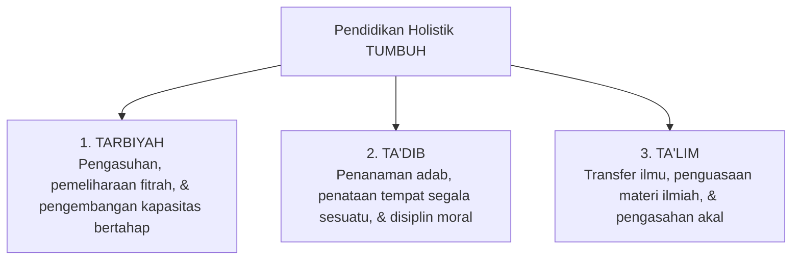

# P1-04-01-Falsafah-Tarbiyah-Tadib-Talim

## Tujuan
Membedah trilogi konsep pendidikan dalam Islam: **Tarbiyah**, **Ta'dib**, dan **Ta'lim**, serta meletakkannya sebagai kerangka operasional kurikulum holistik di ekosistem pesantren TUMBUH.

---

## Trilogi Pendidikan Islam

Dalam khazanah peradaban Islam, proses pendidikan diurai melalui tiga terminologi yang saling melengkapi dan tak terpisahkan:

---

## 1. Tarbiyah (*Developmental Nurturing*)
* **Akar Kata**: *Rabaa - Yarbuu* (bertambah, berkembang) dan *Rabba - Yarubbu* (memelihara, mendidik, memimpin).
* **Makna**: Proses menumbuhkan dan memelihara seluruh potensi fitrah manusia secara bertahap (*tadarruj*) hingga mencapai kematangan optimal sesuai tujuan penciptaannya.
* **Fungsi di Pesantren**: Pengasuhan harian di asrama (*musyrif/ah*), penyediaan gizi dan kesehatan, bimbingan emosi, dan penjagaan lingkungan yang aman.

## 2. Ta'dib (*Inculcation of Adab*)
* **Akar Kata**: *Addaba - Yu'addibu - Ta'diiban* (mendidik beradab, berakhlak luhur).
* **Konsep Inti (Syed Muhammad Naquib al-Attas)**: *Adab* adalah pengenalan dan pengakuan atas posisi yang tepat bagi segala sesuatu dalam tatanan penciptaan—mengenal kedudukan Allah sebagai Pencipta, Nabi sebagai teladan, guru sebagai pembimbing, sesama santri sebagai saudara, serta ilmu sebagai amanah.
* **Fungsi di Pesantren**: Penegakan tata tertib yang mendidik (*Disiplin Positif*), adab pergaulan, etika thalabul 'ilmi, dan pembiasaan rasa hormat.

## 3. Ta'lim (*Instruction & Intellectual Mastery*)
* **Akar Kata**: *'Allama - Yu'allimu - Ta'liiman* (mengajarkan ilmu).
* **Makna**: Proses transmisi pengetahuan, pemahaman kaidah, pengasahan logika, dan penguasaan cabang-cabang ilmu syariat maupun sains alam/sosial.
* **Fungsi di Pesantren**: Kegiatan Belajar Mengajar (KBM) di ruang kelas, sorogan, bandongan, dan telaah kitab.

---

## Integrasi dalam Sistem TUMBUH

Kegagalan pendidikan pesantren konvensional sering terjadi ketika institusi hanya menjalankan **Ta'lim** (hafalan dan nilai ujian) sembari mengabaikan **Ta'dib** dan **Tarbiyah**.

Sistem TUMBUH menyatukan ketiganya:
* **Ta'lim** memberi pencerahan akal.
* **Ta'dib** menata hati dan perilaku dalam tatanan adab.
* **Tarbiyah** merawat proses pertumbuhan jiwa-raga sepanjang waktu di pondok.
