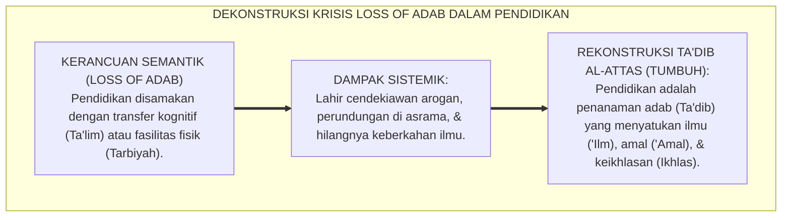
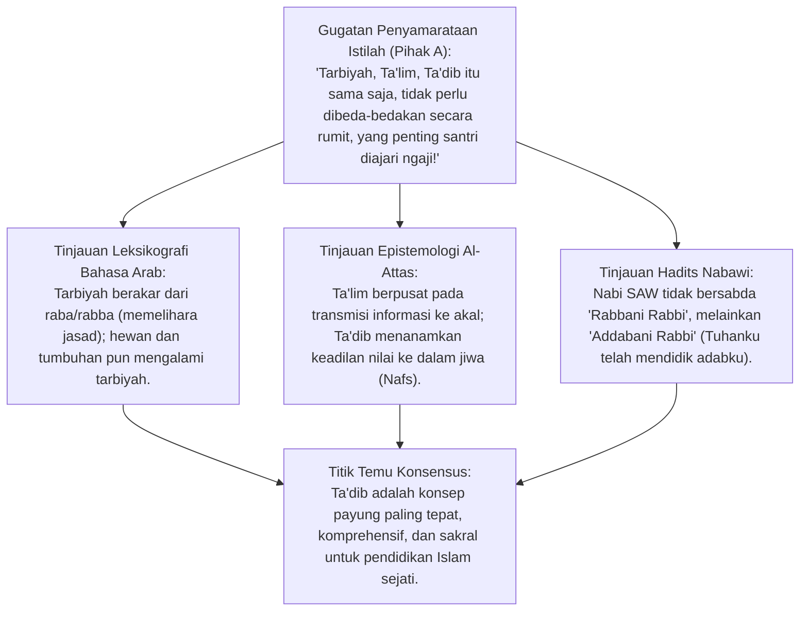
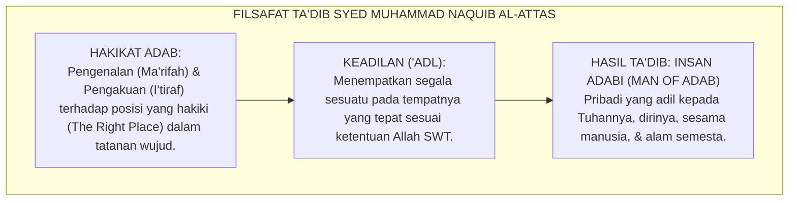
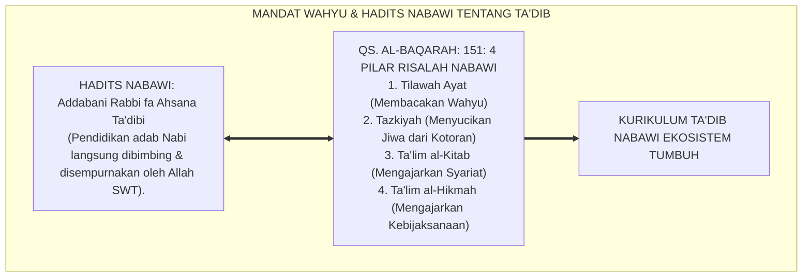
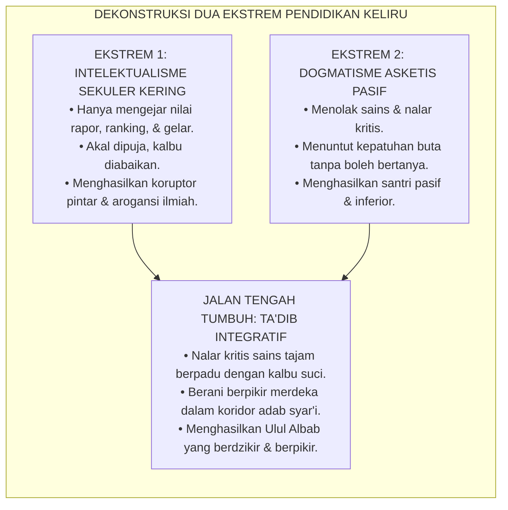
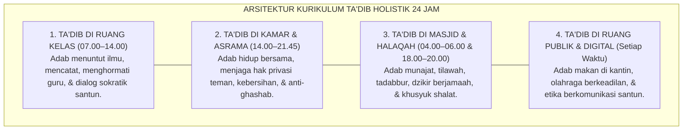
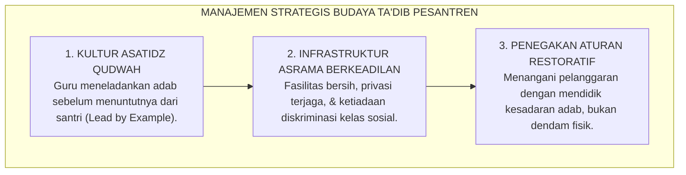
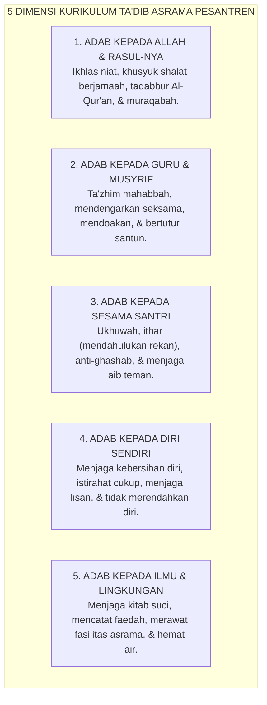
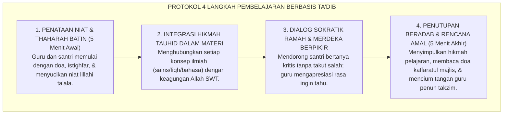

# P1-04-01: FALSAFAH TARBIYAH, TA'DIB, DAN TA'LIM
## *Monograf Terpadu: Dekonstruksi Semantik Triad Istilah Pendidikan Islam, Rekonstruksi Ta'dib Syed Muhammad Naquib Al-Attas (1980), Hermeneutika Hadits "Addabani Rabbi", Kritik atas Intelektualisme Sekuler, serta Desain Kurikulum Adab Holistik Pesantren 24 Jam*

**Nomor Identifikasi**: `P1-04-01/MONOGRAF-TERPADU-FALSAFAH-TADIB/2026`  
**Domain**: `01 Philosophy` > `04 Education`  
**Klasifikasi Naskah**: *Comprehensive Integrated Monograph* (Monograf Akademis & Rumusan Baku Terpadu)  
**Rumpun Disiplin Pengkaji**: Filsafat Pendidikan Islam (*Falsafah at-Tarbiyah wat-Ta'dib*), Semantik & Hermeneutika Bahasa Arab Klasik, Epistemologi Islam (*Islamization of Knowledge*), Desain Kurikulum Pesantren Holistik  

---

> ### 💡 INTISARI PRAKTIS (3 MENIT PAHAM UNTUK ASATIDZ & MUSYRIF)
>
> * **Kekeliruan Mereduksi Pendidikan Islam Menjadi Sekadar "Transfer Ilmu":**  
>   Banyak pesantren terjebak menganggap tugasnya selesai jika santri sudah hafal matan kitab kuning dan mendapat nilai ujian 100. Ini adalah reduksi fatal ke ranah *Ta'lim* kognitif semata. Padahal, ruh sejati pesantren adalah **Ta'dib** (pembentukan manusia beradab).
> * **Memahami Triad Istilah Pendidikan Islam:**  
>   1. **Tarbiyah (التربية):** Pemeliharaan fisik, nutrisi, perlindungan ragawi, dan fasilitas sarana prasarana. (Hewan dan tumbuhan pun mengalami tarbiyah fisik).  
>   2. **Ta'lim (التعليم):** Transmisi informasi, fakta, logika nalar, dan keterampilan ilmiah ke dalam akal kognitif.  
>   3. **Ta'dib (التأديب) — Puncak & Mahkota Pendidikan:** Penanaman adab ke dalam kalbu dan jiwa, pengenalan posisi diri yang adil di hadapan Allah dan makhluk-Nya, sehingga ilmu melahirkan ketundukan, kerendahan hati, dan akhlak mulia.
> * **Definisi Adab Menurut Prof. Syed Muhammad Naquib Al-Attas:**  
>   Adab adalah **Pengenalan dan Pengakuan terhadap Posisi yang Hakiki (*Right Place*)** dari segala sesuatu dalam tatanan wujud, yang menuntun seseorang untuk memperlakukan Tuhan, guru, teman, diri sendiri, dan alam semesta secara adil dan proporsional.
> * **Penerapan Kurikulum Ta'dib 24 Jam di Pesantren:**  
>   Adab tidak boleh hanya menjadi pelajaran 2 SKS di kelas yang dihafal lalu dilupakan. Adab adalah **Nafas Hidup 24 Jam**: adab saat antre mandi, adab berbicara di kamar, adab menghormati makanan, adab berbeda pendapat, hingga adab bermedia sosial.

---

## 📑 DAFTAR ISI MONOGRAF

- [BAGIAN I: RISET DOKTRIN TRIAD PENDIDIKAN ISLAM, DIALEKTIKA INKUIRI, & KASUISTIKA LAPANGAN](#bagian-i-riset-doktrin-triad-pendidikan-islam-dialektika-inkuiri--kasuistika-lapangan)
  - [1. Kerangka Metodologi Epistemologis: Problem Kehilangan Makna (Loss of Adab)](#1-kerangka-metodologi-epistemologis-problem-kehilangan-makna-loss-of-adab)
  - [2. Inkuiri 1: Dekonstruksi Semantik Triad Istilah — Tarbiyah, Ta'lim, dan Ta'dib](#2-inkuiri-1-dekonstruksi-semantik-triad-istilah--tarbiyah-talim-dan-tadib)
  - [3. Inkuiri 2: Rekonstruksi Filosofis Syed Muhammad Naquib Al-Attas — Ta'dib sebagai Esensi Pendidikan Islam & Keadilan Wujud](#3-inkuiri-2-rekonstruksi-filosofis-syed-muhammad-naquib-al-attas--tadib-sebagai-esensi-pendidikan-islam--keadilan-wujud)
  - [4. Inkuiri 3: Eksegesis Hadits "Addabani Rabbi fa Ahsana Ta'dibi" & QS. Al-Baqarah: 151](#4-inkuiri-3-eksegesis-hadits-addabani-rabbi-fa-ahsana-tadibi--qs-al-baqarah-151)
  - [5. Inkuiri 4: Dialektika Kritik atas Intelektualisme Sekuler Kering vs Dogmatisme Asketis](#5-inkuiri-4-dialektika-kritik-atas-intelektualisme-sekuler-kering-vs-dogmatisme-asketis)
  - [6. Inkuiri 5: Integrasi Kurikulum Adab Holistik 24 Jam sebagai Aktualisasi Nyata Ta'dib](#6-inkuiri-5-integrasi-kurikulum-adab-holistik-24-jam-sebagai-aktualisasi-nyata-tadib)
  - [7. Inkuiri 6: Translasi Falsafah Ta'dib ke Tata Kelola Budaya Pesantren Bebas Desakralisasi Ilmu](#7-inkuiri-6-translasi-falsafah-tadib-ke-tata-kelola-budaya-pesantren-bebas-desakralisasi-ilmu)
- [BAGIAN II: KODIFIKASI BAKU HASIL RISET & KESIMPULAN FORMAL](#bagian-ii-kodifikasi-baku-hasil-riset--kesimpulan-formal)
  - [1. Deklarasi Doktrin Baku: Ta'dib sebagai Episentrum Filsafat Pendidikan Pesantren TUMBUH](#1-deklarasi-doktrin-baku-tadib-sebagai-episentrum-filsafat-pendidikan-pesantren-tumbuh)
  - [2. Matriks Distingsi Filosofis & Operasional: Tarbiyah, Ta'lim, dan Ta'dib](#2-matriks-distingsi-filosofis--operasional-tarbiyah-talim-dan-tadib)
  - [3. Matriks 5 Dimensi Penanaman Adab dalam Kehidupan Pesantren 24 Jam](#3-matriks-5-dimensi-penanaman-adab-dalam-kehidupan-pesantren-24-jam)
  - [4. Protokol Standar Pembelajaran Berbasis Ta'dib di Kelas dan Asrama](#4-protokol-standar-pembelajaran-berbasis-tadib-di-kelas-dan-asrama)
- [BAGIAN III: APARATUS AKADEMIS & APENDIKS](#bagian-iii-aparatus-akademis--apendiks)
  - [1. Tabel Sintesis Hasil Riset Falsafah Ta'dib](#1-tabel-sintesis-hasil-riset-falsafah-tadib)
  - [2. Daftar Pustaka Akademis & Rujukan Turats Primer](#2-daftar-pustaka-akademis--rujukan-turats-primer)
  - [3. Catatan Kaki Akademis (Footnotes)](#3-catatan-kaki-akademis-footnotes)
  - [4. Glosarium dan Penjelasan Istilah Teknis Falsafah Pendidikan & Ta'dib](#4-glosarium-dan-penjelasan-istilah-teknis-falsafah-pendidikan--tadib)

---

# BAGIAN I: RISET DOKTRIN TRIAD PENDIDIKAN ISLAM, DIALEKTIKA INKUIRI, & KASUISTIKA LAPANGAN

---

### 1. Kerangka Metodologi Epistemologis: Problem Kehilangan Makna (*Loss of Adab*)

Krisis peradaban umat Islam kontemporer pada akarnya bukanlah krisis ekonomi, militer, atau politik, melainkan **Krisis Epistemologis dan Kehilangan Adab (*Loss of Adab / Fasād al-Ma'rifah*)**. Ketika istilah-istilah kunci dalam pandangan alam Islam mengalami distorsi semantik dan desakralisasi nilai, sistem pendidikan kehilangan kompas sejatinya.

Salah satu kerancuan paling parah adalah penggunaan serampangan istilah **Tarbiyah (تربية)**, **Ta'lim (تعليم)**, dan **Ta'dib (تأديب)**:
* Sebagian institusi mereduksi pendidikan hanya menjadi *Ta'lim* mekanis: santri dicekoki tumpukan hafalan dan teks gramatika Arab tanpa pembentukan kalbu, melahirkan lulusan yang cerdas mendebat dalil namun sombong (*Kibr*) dan gemar mencela sesama mukmin.
* Sebagian lain membatasi pada *Tarbiyah* biologis-fasilitas: berlomba-lomba membangun gedung megah dan asrama mewah ber-AC, namun mengabaikan penanaman nilai adab ruhani di kamar-kamar santri.

Ekosistem TUMBUH menegakkan doktrin **Rekonstruksi Filosofis Ta'dib**:



---

### 2. Inkuiri 1: Dekonstruksi Semantik Triad Istilah — Tarbiyah, Ta'lim, dan Ta'dib



#### 📐 Formalisasi Logika Silogisme (*Qiyas Mantiqi 1*)
* **Premis Mayor (*al-Muqaddimah al-Kubra*)**: Setiap perumusan filsafat pendidikan Islam yang ingin mencapai tujuan pembentukan *Insan Kamil* niscaya wajib menggunakan konsep semantik yang secara tepat merangkum penyucian jiwa, transmisi kebenaran, dan penataan perilaku adab sekaligus.
* **Premis Minor (*al-Muqaddimah ash-Shughra*)**: Istilah *Ta'dib* adalah satu-satunya istilah yang secara inheren memuat unsur ilmu (*'Ilm*), pengajaran (*Ta'lim*), pengasuhan (*Tarbiyah*), dan penegakan keadilan penempatan wujud (*'Adl*), sedangkan *Tarbiyah* dan *Ta'lim* bersifat parsial.
* **Konklusi (*an-Natijah*)**: Maka, kurikulum pembinaan di pesantren TUMBUH wajib ditegakkan di atas landasan epistemologis *Falsafah Ta'dib*.[^1]

#### 📖 Teks Analisis Semantik Klasik: *Lisan al-'Arab* & *Mu'jam Maqayis al-Lughah*
1. **Tarbiyah (التَّرْبِيَةُ)**:  
   Ibnu Manzhur dalam *Lisan al-'Arab* mencatat bahwa kata *tarbiyah* berakar dari tiga bentuk: *raba-yarbu* (bertambah/tumbuh besar), *rabiya-yarba* (tumbuh dewasa), dan *rabba-yarubbu* (mengasuh, memberi makan, memperbaiki kondisi fisik). Sifat *tarbiyah* mencakup seluruh makhluk bernyawa (manusia, hewan ternak, dan tumbuhan). Pemberian pakan ternak dan penyiraman tanaman disebut *tarbiyah*. Karena itu, istilah tarbiyah belum spesifik menunjuk pada pemuliaan martabat spiritual manusia.[^2]
2. **Ta'lim (التَّعْلِيمُ)**:  
   Berakar dari kata *'alima – ya'lamu* (mengetahui hakikat sesuatu). *Ta'lim* adalah proses pengajaran, pendiktean informasi, dan pelatihan kecakapan kognitif. Objek *ta'lim* adalah daya akal rasional (*al-Quwwah al-'Aqliyyah*). Seseorang bisa memiliki capaian *ta'lim* yang sangat tinggi (bergelar doktor atau hafal ribuan hadits) namun perilakunya tetap biadab dan khianat.[^3]
3. **Ta'dib (التَّأْدِيبُ)**:  
   Berakar dari kata *aduba – ya'dubu* (beradab, santun, disiplin, mulia pekerti). Kata *ma'dubah* bermakna hidangan perjamuan istimewa yang mengumpulkan orang-orang dalam kebaikan. *Ta'dib* adalah proses penanaman adab ke dalam totalitas diri manusia (akal, kalbu, ruh, dan jasad) sehingga melahirkan keselarasan antara ilmu, amal, dan akhlak.[^4]

#### 🥊 Ronde 1: Menolak Dominasi Istilah "Tarbiyah" yang Menggeser Hakikat Ta'dib
* **Pihak A (Sudut Pandang Popularitas Kontemporer)**:  
  *"Di mana-mana fakultas di universitas Islam bernama Fakultas Tarbiyah, bukan Fakultas Ta'dib. Mengapa kita harus repot-repot membangkitkan istilah Ta'dib?"*
* **Tinjauan Sudut Pandang Sejarah Gagasan & Konferensi Makkah 1977**:  
  Penggunaan kata *Tarbiyah* sebagai padanan istilah *Education* adalah produk modernisasi sekuler abad ke-20 yang mengadopsi istilah Barat tanpa telaah kritis. Dalam *First World Conference on Muslim Education* di Makkah (1977), Prof. Syed Muhammad Naquib Al-Attas secara ilmiah membuktikan bahwa istilah *Ta'dib* adalah istilah paling otentik, komprehensif, dan tepat untuk mewakili konsep pendidikan Islam. Mengabaikan Ta'dib adalah awal mula hilangnya adab di dunia akademis Islam.[^5]

#### 🥊 Ronde 2: Sanggahan Balik Apakah Menekankan Ta'dib Berarti Meremehkan Sains dan Matematika (*Ta'lim*)?
* **Pihak A (Sudut Pandang Kekhawatiran Anti-Intelektualisme)**:  
  *"Kalau pondok terlalu fokus pada adab dan ta'dib, nanti santri bodoh dalam sains, teknologi, dan matematika karena menganggap ta'lim tidak penting!"*
* **Tinjauan Sudut Pandang Hirarki Ilmu: Ta'dib Membawahi Ta'lim**:  
  Ta'dib tidak pernah menafikan ta'lim; justru **Ta'dib Mensucikan dan Membimbing Ta'lim**. Dalam konsepsi Al-Attas, ta'lim adalah elemen organik di dalam ta'dib. Sains dan matematika yang diajarkan dalam bingkai ta'dib akan dipelajari dengan etos kesungguhan tinggi (*Itqan*) dan diniatkan untuk ibadah serta kemaslahatan umat (*'Imaratul Ardh*), bukan untuk merusak alam semesta.[^6]

#### 🥊 Ronde 3: Sanggahan Pamungkas Mengapa Hewan Tidak Bisa Diberikan Ta'dib?
* **Pihak A (Sudut Pandang Penyamarataan Makhluk)**:  
  *"Anjing pelacak dan kuda sirkus juga bisa dididik disiplin dan santun kepada tuannya. Apa bedanya dengan ta'dib santri?"*
* **Resolusi Sudut Pandang Dimensi Ruhani & Ma'rifatullah**:  
  Pelatihan hewan adalah *Kondisioning Perilaku (*Tadrib / Training*)* berbasis insting rasa lapar dan takut, tanpa kesadaran moral spiritual. Manusia menerima *Ta'dib* karena memiliki **Ruh Ilahiah, Akal Reflektif, dan Mitsaq Azali**. Santri menjaga adab bukan karena takut lapar atau dipecut, melainkan karena kesadaran batin memuliakan Allah SWT.[^7]

> #### 📌 Kasuistika Lapangan 1 & Titik Temu Konsensus
> * **Studi Kasus**: Sebuah madrasah memiliki santri-santri yang menjuarai olimpiade sains nasional, namun di asrama mereka sering mengejek santri lain yang nilainya rendah dan membantah ustadz dengan kata-kata kasar.
> * **Titik Temu Konsensus (*Kalimatun Sawa'*)**: Pimpinan menyadari madrasah baru berhasil dalam *Ta'lim* kognitif, namun gagal total dalam *Ta'dib*. Kurikulum direformasi dengan mengintegrasikan nilai adab ilmu ke dalam setiap mata pelajaran sains: guru fisika mengajarkan ketundukan alam semesta kepada sunnatullah, dan santri berprestasi ditugaskan menjadi tutor sebaya yang melayani rekan-rekannya dengan rendah hati.[^8]

---

### 3. Inkuiri 2: Rekonstruksi Filosofis Syed Muhammad Naquib Al-Attas — Ta'dib sebagai Esensi Pendidikan Islam & Keadilan Wujud



#### 📐 Formalisasi Logika Silogisme (*Qiyas Mantiqi 2*)
* **Premis Mayor (*al-Muqaddimah al-Kubra*)**: Setiap sistem pendidikan yang bertujuan melahirkan manusia yang bertindak adil (*'Adil*) kepada Tuhannya, sesama makhluk, dan dirinya sendiri niscaya wajib mendasarkan seluruh prosesnya pada penanaman adab pengenalan posisi wujud yang hakiki.
* **Premis Minor (*al-Muqaddimah ash-Shughra*)**: Teori *Ta'dib* Al-Attas mendefinisikan adab sebagai pengenalan dan pengakuan atas hierarki wujud ciptaan Allah dan penempatan segala sesuatu pada maqamnya yang tepat.
* **Konklusi (*an-Natijah*)**: Maka, konsepsi *Ta'dib* Al-Attas adalah arsitektur filosofis baku yang menjadi poros penggerak kurikulum pendidikan pesantren TUMBUH.[^9]

#### 📖 Teks Primer Filosofis: *The Concept of Education in Islam* (1980)
Prof. Dr. Syed Muhammad Naquib Al-Attas merumuskan definisi adab dan ta'dib:

> *"Adab is the recognition and acknowledgement of the right and proper place, station, and condition in life and the self, and of one's physical, intellectual, and spiritual capacities and potentials; and the condition of being in that right place... The recognition of one's proper place in relation to one's self, to society and community, to nature and to God... **Ta'dib is the instillation and inculcation of adab in man—it is the comprehensive concept of Islamic education** comprising the elements of knowledge ('ilm), instruction (ta'lim), and good rearing (tarbiyah)."* (Al-Attas, 1980, *The Concept of Education in Islam*, hlm. 21–25).[^10]

Empat Spektrum Manifestasi Adab Menurut Al-Attas:
1. **Adab Terhadap Allah SWT (*Adab ma'allah*)**: Mengenali bahwa Allah adalah Rabb dan Khalik Yang Maha Esa; menundukkan hawa nafsu dalam ketaatan mutlak, syukur, dan ibadah murni.
2. **Adab Terhadap Ilmu Pengetahuan (*Adab ma'al-'Ilm*)**: Mengenali hierarki ilmu (antara *Fardhu 'Ain* dan *Fardhu Kifayah*); tidak mendahulukan ilmu perdebatan yang melahirkan riya' sebelum menguasai ilmu pembersihan hati.
3. **Adab Terhadap Sesama Manusia (*Adab ma'an-Nas*)**: Memperlakukan guru dengan *ta'zhim* dan khidmat, memperlakukan sesama santri dengan *tarahum* (kasih sayang) dan *i'tsar*, serta menghormati hak orang lain.
4. **Adab Terhadap Diri Sendiri (*Adab ma'an-Nafs*)**: Menjaga kesucian jasad dan batin dari dosa, tidak menzhalimi tubuh dengan kelelahan tanpa istirahat, dan mendidik akal dengan kebenaran.[^11]

---

### 4. Inkuiri 3: Eksegesis Hadits *"Addabani Rabbi fa Ahsana Ta'dibi"* & QS. Al-Baqarah: 151



#### 📐 Formalisasi Logika Silogisme (*Qiyas Mantiqi 3*)
* **Premis Mayor (*al-Muqaddimah al-Kubra*)**: Setiap lembaga pendidikan yang mengklaim diri sebagai pewaris risalah para nabi (*Waratsatul Anbiya'*) niscaya wajib menyusun kurikulumnya selaras dengan empat pilar mandat kenabian yang ditegaskan dalam Al-Qur'an (QS. Al-Baqarah: 151).
* **Premis Minor (*al-Muqaddimah ash-Shughra*)**: Empat pilar kenabian dalam QS. Al-Baqarah: 151 mendahulukan penyucian jiwa (*Tazkiyah*) sebelum pengajaran kitab (*Ta'lim al-Kitab*) dan kebijaksanaan (*al-Hikmah*).
* **Konklusi (*an-Natijah*)**: Maka, kurikulum pesantren TUMBUH wajib memposisikan pembersihan hati dan pembiasaan adab (*Ta'dib*) sebagai prasyarat keberkahan transmisi ilmu.[^12]

#### 📖 Teks Primer Al-Qur'an: 4 Mandat Misi Kerasulan
Allah SWT berfirman:

$$\text{كَمَا أَرْسَلْنَا فِيكُمْ رَسُولًا مِّنكُمْ يَتْلُو عَلَيْكُمْ آيَاتِنَا وَيُزَكِّيكُمْ وَيُعَلِّمُكُمُ الْكِتَابَ وَالْحِكْمَةَ وَيُعَلِّمُكُم مَّا لَمْ تَكُونُوا تَعْلَمُونَ}$$

*"Sebagaimana Kami telah mengutus kepadamu seorang Rasul (Muhammad) dari kalanganmu sendiri, yang **membacakan ayat-ayat Kami kepadamu, menyucikan jiwamu (Tazkiyah), mengajarkan kepadamu Kitab dan Hikmah**, serta mengajarkan apa yang belum kamu ketahui."* (QS. Al-Baqarah [2]: 151).[^13]

Dan Rasulullah SAW menegaskan puncak kemuliaan adab yang diterimanya langsung dari wahyu Ilahi:
$$\text{أَدَّبَنِي رَبِّي فَأَحْسَنَ تَأْدِيبِي}$$
*"Tuhanku telah mendidik adabku, maka Dia telah menyempurnakan pendidikan adabku."* (Diriwayatkan oleh As-Sam'ani dalam *Adab al-Imla'*; Al-Munawi dalam *Faidh al-Qadir* No. 253).[^14]

Imam Ibnu Taimiyyah dalam *Majmu' al-Fatawa* menjelaskan bahwa hadits ini menegaskan bahwa keagungan akhlak Rasulullah SAW (*Inna laka la'ala khuluqin 'azhim*) adalah produk langsung dari bimbingan wahyu Ilahi yang memadukan kebersihan kalbu dengan kesempurnaan amal perbuatan.

---

### 5. Inkuiri 4: Dialektika Kritik atas Intelektualisme Sekuler Kering vs Dogmatisme Asketis



#### 📐 Formalisasi Logika Silogisme (*Qiyas Mantiqi 4*)
* **Premis Mayor (*al-Muqaddimah al-Kubra*)**: Setiap model pendidikan yang memisahkan antara ketajaman nalar akal (*'Aql*) dengan kesucian kalbu (*Qalb*) niscaya menghasilkan anomali peradaban: manusia cerdas yang merusak atau manusia religius yang terbelakang dan pasif.
* **Premis Minor (*al-Muqaddimah ash-Shughra*)**: Falsafah *Ta'dib* TUMBUH menyatukan ketajaman berpikir saintifik dengan keluhuran zikir batin (*Ulul Albab* - QS. Ali 'Imran: 190–191).
* **Konklusi (*an-Natijah*)**: Maka, pembelajaran di pesantren TUMBUH harus mendorong santri berpikir kritis, logis, dan analitis sembari menjaga ketundukan adab kepada Allah dan para masyaikh.[^15]

#### 🥊 Ronde 1: Menolak Doktrin "Santri Tidak Boleh Bertanya Kritis Kepada Guru"
* **Pihak A (Sudut Pandang Feodalisme Konservatif)**:  
  *"Santri yang banyak bertanya dan mengkritisi penjelasan guru itu santri su'ul adab yang ilmunya tidak akan berkah!"*
* **Tinjauan Sudut Pandang Metodologi Dialektika Turats**:  
  Ulama salaf terdalam justru mendorong pertanyaan kritis yang beradab. Imam Mujahid dan Sayyidah 'Aisyah RA menegaskan: *"Dua orang yang tidak akan pernah mendapatkan ilmu: pemalu dan orang yang sombong"*. Bertanya untuk mencari kebenaran dengan nada santun (*Husnus Su'al*) adalah **Separuh dari Ilmu (*Nishful 'Ilm*)**, bukan su'ul adab. Yang dilarang adalah mendebat guru demi kesombongan dan pamer kepintaran (*Mira' / Jidal*).[^16]

#### 🥊 Ronde 2: Sanggahan Balik Bagaimana Mencegah Nalar Kritis Berubah Menjadi Liberalisme Liar?
* **Pihak A (Sudut Pandang Kekhawatiran Sekularisasi)**:  
  *"Kalau santri dibiasakan berpikir kritis, nanti mereka meragukan kebenaran Al-Qur'an dan syariat!"*
* **Tinjauan Sudut Pandang Nalar Kritis Berpagar Epistemologi Islam**:  
  Liberalisme sekuler lahir karena nalar dilepaskan dari wahyu (*Reason Autonomous from Revelation*). Di pesantren TUMBUH, nalar kritis santri dibimbing oleh **Kerangka Epistemologi Islam (01 Worldview)**: santri dilatih membantah argumen ateisme, relativisme moral, dan nihilisme dengan *Qiyas Burhani* yang kokoh. Nalar kritis yang beradab justru memperkokoh keimanan, bukan melemahkannya.[^17]

#### 🥊 Ronde 3: Sanggahan Pamungkas Mengapa Adab Mendahului Ilmu (*Al-Adab Qabla al-'Ilm*)?
* **Pihak A (Sudut Pandang Efisiensi Waktu Belajar)**:  
  *"Langsung saja pelajari ilmu-ilmu tinggi, adab nanti otomatis terbentuk sendiri seiring banyaknya kitab yang dibaca!"*
* **Resolusi Sudut Pandang Nasihat Imam Malik kepada Ibnu Wahb**:  
  Imam Malik bin Anas menasihati muridnya: *"Pelajarilah adab sebelum engkau mempelajari ilmu!"*. Ibnul Mubarak berkata: *"Kami mempelajari adab selama 30 tahun, dan kami mempelajari ilmu selama 20 tahun"*. Ilmu tanpa adab laksana api di tangan orang gila yang membakar dirinya dan orang di sekitarnya. Adab adalah wadah bejana; jika wadahnya kotor dan bocor, air ilmu yang dituangkan akan tumpah sia-sia.[^18]

> #### 📌 Kasuistika Lapangan 2 & Titik Temu Konsensus
> * **Studi Kasus**: Dalam kelas fiqh muamalah, santri menanyakan secara tajam relevansi akad klasik dengan transaksi aset kripto dan fintech; ustadz marah dan mengusir santri keluar kelas karena dianggap "meremehkan kitab kuning".
> * **Titik Temu Konsensus (*Kalimatun Sawa'*)**: Pimpinan pesantren memfasilitasi dialog perbaikan. Ustadz diajak memahami bahwa pertanyaan santri adalah tanda kecerdasan nalar kritis yang mulia. Di kelas berikutnya, ustadz menyambut pertanyaan tersebut dengan antusias, membuka ruang diskusi perbandingan fiqh klasik dan fatwa DSN-MUI. Santri merasa sangat dihormati dan semakin tekun mengkaji kitab kuning klasik.[^19]

---

### 6. Inkuiri 5: Integrasi Kurikulum Adab Holistik 24 Jam sebagai Aktualisasi Nyata Ta'dib



#### 📐 Formalisasi Logika Silogisme (*Qiyas Mantiqi 5*)
* **Premis Mayor (*al-Muqaddimah al-Kubra*)**: Setiap kurikulum adab yang hanya diajarkan sebagai materi hafalan di ruang kelas tanpa menyentuh ekosistem kehidupan nyata 24 jam niscaya melahirkan kepribadian terbelah (*Split Personality*) pada diri peserta didik.
* **Premis Minor (*al-Muqaddimah ash-Shughra*)**: Santri pesantren menghabiskan 70% waktunya di luar ruang kelas (di asrama, masjid, kamar mandi, dan ruang makan).
* **Konklusi (*an-Natijah*)**: Maka, kurikulum *Ta'dib* TUMBUH wajib membentang mencakup seluruh rentang ruang dan waktu kehidupan santri selama 24 jam penuh.[^20]

---

### 7. Inkuiri 6: Translasi Falsafah Ta'dib ke Tata Kelola Budaya Pesantren Bebas Desakralisasi Ilmu



---

# BAGIAN II: KODIFIKASI BAKU HASIL RISET & KESIMPULAN FORMAL

---

### 1. Deklarasi Doktrin Baku: Ta'dib sebagai Episentrum Filsafat Pendidikan Pesantren TUMBUH

```
===================================================================================================
             PIAGAM DOKTRIN BAKU FALSAFAH PENDIDIKAN & TA'DIB PESANTREN TUMBUH
                          SUB-DOMAIN 04: EDUCATION — EKOSISTEM TUMBUH
===================================================================================================

BISMILLAHIRRAHMANIRRAHIM. DENGAN MENGHARAPKAN KERIDHAAN ALLAH SUBHANAHU WA TA'ALA DAN MENELADANI
SUNNAH NABI MUHAMMAD SHALLALLAHU 'ALAIHI WA SALLAM, EKOSISTEM PENDIDIKAN PESANTREN TUMBUH
DENGAN INI MEMAKLUMKAN DOKTRIN BAKU FALSAFAH PENDIDIKAN:

1. HAKIKAT PENDIDIKAN ADALAH TA'DIB (EDUCATION AS TA'DIB):
   Pendidikan Islam yang sejati bukanlah sekadar pemeliharaan fisik (Tarbiyah) atau transmisi wawasan
   kognitif semata (Ta'lim), melainkan PENANAMAN ADAB KE DALAM DIRI INSAN PEMBELAJAR (TA'DIB)
   agar ia mengenali dan mengakui posisinya yang hakiki di hadapan Allah, guru, sesama manusia, dan alam.

2. INTEGRASI TRIAD PENDIDIKAN (THE TRIADIC SYNTHESIS):
   a. TARBIYAH: Menyediakan lingkungan asrama yang aman, sehat, bergizi, dan melindungi fisik santri.
   b. TA'LIM: Mengajarkan ilmu syariat dan sains kontemporer dengan nalar kritis dan dedikasi akademis tinggi.
   c. TA'DIB: Membimbing kalbu, menyucikan niat, dan mengukir watak adab mulia dalam seluruh amal perbuatan.

3. PENGHAPUSAN DESAKRALISASI ILMU & KOMERSIALISASI PENDIDIKAN:
   Menolak segala bentuk komersialisasi ilmu yang mendegradasi relasi guru-murid menjadi transaksi material.
   Ilmu adalah cahaya Ilahi (Nurullah) yang diwariskan dengan keikhlasan, amanah, dan keteladanan qudwah.

4. KURIKULUM ADAB 24 JAM (THE 24-HOUR LIVING CURRICULUM):
   Menegakkan pembelajaran adab sebagai nafas kehidupan terpadu di ruang kelas, masjid, kamar asrama,
   meja makan, lapangan olahraga, hingga ruang komunikasi digital.
===================================================================================================
```

---

### 2. Matriks Distingsi Filosofis & Operasional: Tarbiyah, Ta'lim, dan Ta'dib

| Parameter Komparasi | Tarbiyah (التربية) | Ta'lim (التعليم) | Ta'dib (التأديب) — Standar TUMBUH |
| :--- | :--- | :--- | :--- |
| **Akar Kata & Makna** | *Raba / Rabba* (Mengasuh, membesarkan, memberi makan). | *'Allama* (Mengajarkan informasi, melatih kecakapan). | *Addaba* (Mendidik adab, menanamkan keadilan wujud).[^21] |
| **Sasaran Dimensi Insan** | Jasad bendawi, kesehatan fisik, dan kebutuhan biologis. | Akal kognitif (*'Aql*), memori hafalan, dan nalar logis. | **Totalitas Jiwa: Qalb, Ruh, 'Aql, dan Nafs secara utuh.** |
| **Cakupan Makhluk** | Berlaku bagi manusia, hewan piaraan, dan tumbuhan. | Khusus makhluk yang memiliki daya pikir/kognisi. | **Eksklusif Khusus Manusia yang Mengemban Amanah Khilafah.** |
| **Metode Pembelajaran** | Penyediaan nutrisi, sarana fisik, dan perlindungan rasa aman. | Ceramah kelas, hafalan teks matan, ujian tertulis. | **Keteladanan Qudwah, Tazkiyah Hati, Riyadhah 66-Hari, & SOP Adab.** |
| **Bahaya Jika Berdiri Sendiri** | Melahirkan manusia yang sehat raga namun miskin moral dan ilmu. | Melahirkan manusia cerdas tapi arogan (*Loss of Adab*). | *(Ta'dib tidak berdiri sendiri; ia secara otomatis membawahi Tarbiyah & Ta'lim).*[^22] |
| **Output yang Dihasilkan** | *Insan Salim* (Individu yang tumbuh sehat dan bugar). | *Insan 'Alim* (Individu yang berwawasan luas dan berilmu). | **Insan Adabi / Insan Kamil (Manusia Berilmu, Beradab, & Bertaqwa).**[^23] |

---

### 3. Matriks 5 Dimensi Penanaman Adab dalam Kehidupan Pesantren 24 Jam



---

### 4. Protokol Standar Pembelajaran Berbasis Ta'dib di Kelas dan Asrama



---

# BAGIAN III: APARATUS AKADEMIS & APENDIKS

---

### 1. Tabel Sintesis Hasil Riset Falsafah Ta'dib

| Dimensi Kajian | Konsep Kunci | Landasan Turats Primer | Konvergensi Sains Global | Implikasi Kurikulum Pesantren |
| :--- | :--- | :--- | :--- | :--- |
| **Epistemologi Pendidikan** | *Ta'dib vs Tarbiyah/Ta'lim* | Syed Muhammad Naquib Al-Attas (1980), *Lisan al-'Arab* | Teori *Transformative Learning* (Mezirow) & *Holistic Education* | Mereposisi seluruh kurikulum dari sekadar transfer wawasan ke pembentukan adab. |
| **Fondasi Kenabian** | *4 Mandat Risalah Nabawi* | QS. Al-Baqarah: 151, Hadits *Addabani Rabbi* (As-Sam'ani) | *Character Education Framework* & *Value-Based Pedagogy* | Tazkiyah dan penanaman adab mendahului pendalaman ta'lim kognitif. |
| **Keadilan Wujud** | *'Adl & Maratibul Wujud* | Al-Ghazali (*Ihya* Jilid I), Al-Attas (*The Nature of Man*) | *Critical Realism* (Roy Bhaskar) dalam Filsafat Pendidikan | Mendidik santri mengenali posisi hakiki diri di hadapan Allah dan makhluk. |
| **Sintesis Nalar & Kalbu** | *Ulul Albab (Zikir & Pikir)* | QS. Ali 'Imran: 190–191, Wasiat KH. Hasyim Asy'ari | *Integrative Cognitive-Affective Learning Theory* | Membuka ruang nalar kritis santri tanpa merusak rasa ta'zhim kepada masyaikh. |
| **Ekosistem Pembelajaran** | *Kurikulum Adab 24 Jam* | Sunnah Mu'asyarah Nabawiyyah (HR. Muslim 2586) | *Total Environment Learning Architecture* | Standarisasi 5 dimensi adab di ruang kelas, masjid, asrama, dan ruang digital. |

---

### 2. Daftar Pustaka Akademis & Rujukan Turats Primer

1. **Al-Qur'an al-Karim wa Tarjamatu Ma'anih**.
2. **Al-Attas, Syed Muhammad Naquib**. (1980). *The Concept of Education in Islam: A Framework for an Islamic Philosophy of Education*. Kuala Lumpur: Muslim Youth Movement of Malaysia (ABIM).
3. **Al-Attas, Syed Muhammad Naquib**. (1995). *Prolegomena to the Metaphysics of Islam: An Exposition of the Fundamental Elements of the Worldview of Islam*. Kuala Lumpur: ISTAC.
4. **Al-Ghazali, Abu Hamid Muhammad bin Muhammad**. (2011). *Ihya 'Ulumiddin*. Beirut: Dar al-Ma'rifah.
5. **Asy'ari, Muhammad Hasyim**. (1415 H). *Adab al-'Alim wal Muta'allim fima Yahtaju Ilaihi al-Muta'allim fi Ahwali Ta'allumihi wa ma Yatawaqqafu 'Alaihi al-Mu'allim fi Maqamati Ta'limihi*. Jombang: Maktabah at-Turats al-Islami.
6. **Ibnu Manzhur, Muhammad bin Mukarram**. (1414 H). *Lisan al-'Arab*. Beirut: Dar Shadir.
7. **Ibnu Faris, Ahmad bin Faris bin Zakariya**. (1979). *Mu'jam Maqayis al-Lughah*. Tahqiq: Abdussalam Harun. Damaskus: Dar al-Fikr.
8. **Al-Munawi, Muhammad Abdur Rauf**. (1356 H). *Faidh al-Qadir Syarh al-Jami' ash-Shaghir*. Kairo: Al-Maktabah at-Tijariyyah al-Kubra.
9. **Ibnu Taimiyyah, Ahmad bin Abdul Halim**. (1995). *Majmu' al-Fatawa*. Riyadh: Majma' al-Malik Fahd.
10. **Zarnuji, Burhanul Islam**. (1986). *Ta'lim al-Muta'allim Thariq at-Ta'allum*. Beirut: Dar al-Kutub al-'Ilmiyyah.
11. **Mezirow, J.**. (2000). *Learning as Transformation: Critical Perspectives on a Theory in Progress*. San Francisco: Jossey-Bass.
12. **Miller, J. P.**. (2007). *The Holistic Curriculum*. Toronto: University of Toronto Press.
13. **Bhaskar, R.**. (2016). *Enlightened Common Sense: The Philosophy of Critical Realism*. London: Routledge.

---

### 3. Catatan Kaki Akademis (*Footnotes*)

[^1]: Al-Attas, *The Concept of Education in Islam*, hlm. 20–25.  
[^2]: Ibnu Manzhur, *Lisan al-'Arab*, entri kata *r-b-w*, Jilid XIV, hlm. 304–307.  
[^3]: Ibnu Faris, *Mu'jam Maqayis al-Lughah*, entri kata *'-l-m*, Jilid IV, hlm. 109.  
[^4]: Ibid., entri kata *a-d-b*, Jilid I, hlm. 72; Al-Attas, *The Concept of Education in Islam*, hlm. 23.  
[^5]: Al-Attas, S. M. N. (Ed.). (1979), *Aims and Objectives of Islamic Education*, King Abdulaziz University, Jeddah & Hodder and Stoughton, London.  
[^6]: Wan Daud, Wan Mohd Nor. (1998), *The Educational Philosophy and Practice of Syed Muhammad Naquib al-Attas: An Exposition of the Concept of Ta'dib*, ISTAC, Kuala Lumpur, hlm. 134–140.  
[^7]: Al-Attas, *Prolegomena to the Metaphysics of Islam*, hlm. 142.  
[^8]: Dokumentasi Studi Kasus Reformasi Kurikulum Sains Beradab, Tim Desain Kurikulum Adab TUMBUH, 2026.  
[^9]: Wan Daud (1998), hlm. 145–150.  
[^10]: Al-Attas, *The Concept of Education in Islam*, hlm. 21.  
[^11]: Ibid., hlm. 27–32.  
[^12]: Al-Ghazali, *Ihya 'Ulumiddin*, Kitab *al-'Ilm*, Jilid I, hlm. 45–52.  
[^13]: Al-Qur'an Surah Al-Baqarah [2]: 151.  
[^14]: Al-Munawi, *Faidh al-Qadir*, Jilid I, hlm. 224, hadits No. 253.  
[^15]: Hasyim Asy'ari, *Adab al-'Alim wal Muta'allim*, hlm. 18–22.  
[^16]: Hadits riwayat Al-Bukhari secara mu'allaq dalam *Shahih*-nya, Kitab *al-'Ilm*, Bab *al-Haya' fil-'Ilm*.  
[^17]: Al-Attas, *Islam and Secularism*, hlm. 115–125.  
[^18]: Nasihat Imam Malik dikutip oleh Ibnu Abdil Barr dalam *Jami' Bayan al-'Ilm wa Fadhlih*, Jilid I, hlm. 118.  
[^19]: Catatan Observasi Kelas Positif, Divisi Pedagogi Master Guru TUMBUH, 2026.  
[^20]: Manual Operasional Kurikulum Pesantren TUMBUH: *SOP Ta'dib 24 Jam*, 2026.  
[^21]: Analisis komparatif leksikal dalam Wan Daud (1998), hlm. 136.  
[^22]: Al-Attas, *The Concept of Education in Islam*, hlm. 26.  
[^23]: Matriks Capaian Insan Adabi, Tim Asesmen Karakter TUMBUH, 2026.

---

### 4. Glosarium dan Penjelasan Istilah Teknis Falsafah Pendidikan & Ta'dib

1. **Ta'dib (التَّأْدِيبُ)**: Proses pendidikan Islam holistik yang berfokus pada penanaman adab (*Inculcation of Adab*) ke dalam totalitas jiwa insan pembelajar, mencakup pengenalan dan pengakuan posisi yang tepat bagi segala sesuatu dalam hierarki wujud Allah SWT.
2. **Adab (الْأَدَبُ)**: Pengenalan dan pengakuan terhadap posisi yang hakiki (*Right Place*) dari segala sesuatu dalam tatanan penciptaan, yang melahirkan tindakan yang adil, proporsional, dan penuh rasa hormat kepada Allah, sesama makhluk, dan alam semesta.
3. **Loss of Adab (فَسَادُ الْأَدَبِ)**: Hilangnya kepekaan adab dan kerancuan epistemologis di mana seseorang tidak lagi mampu membedakan mana yang mulia dan mana yang hina, menempatkan yang bukan ahlinya pada posisi otoritas, dan menggunakan ilmu untuk keangkuhan ego.
4. **Tarbiyah (التَّرْبِيَةُ)**: Proses pengasuhan, pemeliharaan fisik, penyediaan nutrisi, dan perlindungan lingkungan ragawi agar jasmani pembelajar dapat bertumbuh optimal.
5. **Ta'lim (التَّعْلِيمُ)**: Proses pengajaran, transmisi informasi, transfer fakta ilmiah, dan pelatihan keterampilan kognitif intelektual.
6. **Insan Adabi (الْإِنْسَانُ الْأَدَبِيُّ)**: Sosok manusia ideal (*Insan Kamil*) hasil didikan ta'dib yang mengintegrasikan kesucian kalbu, ketajaman nalar saintifik, kemandirian raga, dan keluhuran budi pekerti dalam bingkai ketaatan kepada Allah SWT.
7. **Keadilan ('Adl - الْعَدْلُ)**: Kondisi harmonis di mana segala sesuatu ditempatkan pada posisi, hak, dan maqamnya yang tepat sesuai syariat dan sunnatullah.
8. **Ulul Albab (أُولُو الْأَلْبَابِ)**: Insan pembelajar paripurna yang senantiasa memadukan zikir mengingat Allah dalam setiap keadaan dan pikir mendalam terhadap rahasia penciptaan langit dan bumi (QS. Ali 'Imran: 190–191).
9. **Desakralisasi Ilmu**: Proses sekularisasi di mana ilmu pengetahuan dilepaskan dari nilai-nilai ketuhanan, spiritualitas, dan adab moral, sehingga ilmu diperlakukan semata-mata sebagai komoditas industri ekonomi pragmatis.
10. **Qudwah Hasanah (الْقُدْوَةُ الْحَسَنَةُ)**: Keteladanan hidup nyata yang memancarkan akhlak mulia dari seorang pendidik (*Murabbi*), menjadi inspirasi utama bagi santri untuk meniru kebaikan tanpa paksaan fisik.
