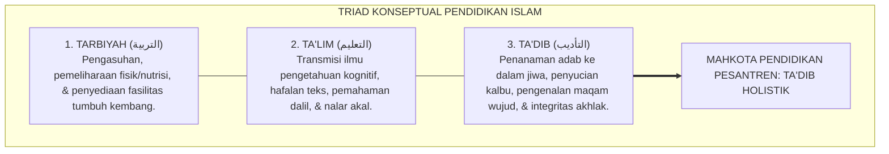

# P1-04-01: FALSAFAH TARBIYAH, TA'DIB, DAN TA'LIM
## *Dekonstruksi Semantik Tiga Istilah Pendidikan Islam, Rekonstruksi Ta'dib Syed Muhammad Naquib al-Attas, dan Kurikulum Adab Holistik*

**Nomor Identifikasi**: `P1-04-01/FALSAFAH-TADIB/2026`  
**Domain**: `01 Philosophy` > `04 Education`  
**Dewan Pakar**: `pakar-filosofi-tumbuh`, `pakar-epistemologi-turats`, `pakar-desain-kurikulum-adab`

---

## 📑 DAFTAR ISI ANALITIS

1. [1. Problem Semantik: Kerancuan Istilah Pendidikan Islam Kontemporer](#1-problem-semantik-kerancuan-istilah-pendidikan-islam-kontemporer)
2. [2. Triad Konseptual: Tarbiyah, Ta'lim, dan Ta'dib](#2-triad-konseptual-tarbiyah-talim-dan-tadib)
3. [3. Rekonstruksi Filosofis Al-Attas: Ta'dib sebagai Inti Pendidikan Islam](#3-rekonstruksi-filosofis-al-attas-tadib-sebagai-inti-pendidikan-islam)
4. [4. Matriks Distingsi Filosofis & Operasional Triad Pendidikan](#4-matriks-distingsi-filosofis--operasional-triad-pendidikan)
5. [5. Implikasi bagi Ekosistem Pesantren TUMBUH 24-Jam](#5-implikasi-bagi-ekosistem-pesantren-tumbuh-24-jam)

---

### 1. Problem Semantik: Kerancuan Istilah Pendidikan Islam Kontemporer

Salah satu krisis paling mendasar dalam pendidikan Islam modern adalah terjadinya **kehilangan makna (*loss of adab & semantic confusion*)** akibat penerjemahan serampangan istilah-istilah Barat ke dalam bahasa Arab atau sebaliknya. Kata bahasa Inggris *"Education"* sering diterjemahkan secara bervariasi menjadi *Tarbiyah*, *Ta'lim*, atau *Ta'dib* tanpa pemahaman mendalam mengenai batas-batas epistemologis dan implikasi aksiologis dari masing-masing istilah tersebut.

Akibat kerancuan ini, banyak pesantren mereduksi pendidikan hanya menjadi *Ta'lim* (pengajaran kognitif dan hafalan matan) atau *Tarbiyah* dalam pengertian fisik semata, sembari mengabaikan jantung esensial dari pendidikan Islam yang sejati, yaitu **Ta'dib** (penanaman dan pembentukan adab).

---

### 2. Triad Konseptual: Tarbiyah, Ta'lim, dan Ta'dib

Untuk meletakkan dasar kurikulum yang kokoh, kita harus mengurai akar semantik dan filosofis ketiga istilah ini:

#### A. Tarbiyah (التربية)
Secara etimologis berakar dari kata *Rabaa – Yarbu* (bertambah, berkembang) dan *Rabba – Yarubbu* (mengasuh, memelihara). Istilah ini merujuk pada proses pemeliharaan, pemberian makan, perlindungan fisik, dan pemenuhan kebutuhan biologis agar organisme tumbuh besar. Dalam konteks ini, hewan dan tumbuhan pun mengalami proses tarbiyah. Jika pesantren hanya fokus pada penyediaan asrama dan makan santri, itu baru berada pada taraf tarbiyah biologis dasar.

#### B. Ta'lim (التعليم)
Berakar dari kata *'Allama – Yu'allimu* (mengajarkan ilmu). Istilah ini berpusat pada transmisi informasi intelektual, fakta, konsep, dan metodologi ilmiah ke dalam akal rasional (*Aql*). Ta'lim sangat penting untuk melahirkan kecerdasan kognitif, namun jika berdiri sendiri tanpa tazkiyah, ia berisiko melahirkan cendekiawan yang cerdas secara logika namun miskin nurani dan adab.

#### C. Ta'dib (التأديب)
Berakar dari kata *Addaba – Yu'addibu* (mendidik adab, mendisiplinkan dengan keadilan dan kasih sayang). Rasulullah SAW bersabda dalam riwayat masyhur:
> $$\text{أَدَّبَنِي رَبِّي فَأَحْسَنَ تَأْدِيبِي}$$
> 
> *"Tuhanku telah mendidik adabku, maka Dia telah membaguskan adab pendidikanku."* (HR. As-Sam'ani; Al-Munawi dalam *Faidh al-Qadir*).

Ta'dib adalah proses pengasuhan ruhani, penataan kalbu, dan penanaman disiplin moral yang menghasilkan manusia beradab (*insan mu'addab*)—manusia yang mengenali hak Tuhannya, menghormati gurunya, menyayangi sesamanya, dan adil dalam menempatkan segala sesuatu pada maqamnya yang tepat.

---

### 3. Rekonstruksi Filosofis Al-Attas: Ta'dib sebagai Inti Pendidikan Islam

Prof. Syed Muhammad Naquib al-Attas (1980) dalam mahakaryanya *The Concept of Education in Islam* menegaskan bahwa **Ta'dib adalah istilah yang paling tepat, lengkap, dan berwibawa untuk mendefinisikan Pendidikan Islam**:

> *"Adab adalah pengenalan serta pengakuan akan hakikat bahwa ilmu dan wujud ini teratur secara hierarkis sesuai dengan berbagai tingkatannya, dan bahwa setiap wujud memiliki posisi yang tepat dalam hubungannya dengan Tuhannya dan makhluk lainnya. Maka Ta'dib adalah proses penanaman adab ke dalam diri manusia (*the inculcation of adab in man*)."* (Al-Attas, 1980, hlm. 21).

Al-Attas membuktikan bahwa konsep Ta'dib secara otomatis telah mencakup dimensi *Ta'lim* (karena tidak ada adab tanpa ilmu) dan dimensi *Tarbiyah* (karena pembentukan adab menuntut pengasuhan yang berkelanjutan). Oleh karena itu, kurikulum pesantren yang sejati adalah **Kurikulum Berbasis Ta'dib**.

---

### 4. Matriks Distingsi Filosofis & Operasional Triad Pendidikan

| Parameter Analisis | Tarbiyah (التربية) | Ta'lim (التعليم) | Ta'dib (التأديب - TUMBUH) |
| :--- | :--- | :--- | :--- |
| **Sasaran Utama** | Fisik, raga, dan kebutuhan biologis santri. | Akal, kognisi, dan memori deklaratif. | **Kalbu, jiwa, akhlak, dan integritas moral.** |
| **Aktivitas Kunci** | Pemberian makan, kamar asrama, kesehatan raga. | Pengajaran kelas, setoran hafalan, ujian tertulis. | **Habituasi adab 24 jam, muhasabah, teladan qudwah.** |
| **Hasil Capaian** | Santri tumbuh sehat dan bugar secara jasmani. | Santri pintar, hafal matan, nilai ujian tinggi. | **Insan Mu'addab yang berkarakter mandiri & shaleh.** |
| **Metodologi Utama** | Penataan fasilitas dan logistik asrama. | Ceramah, sorogan kognitif, mudzakarah teks. | **Modeling (*Qudwah*), Riyadhah, & Disiplin Restoratif.** |

---

### 5. Implikasi bagi Ekosistem Pesantren TUMBUH 24-Jam

1. **Kurikulum Terpadu 24-Jam**: Menghapus sekat pemisah antara "kegiatan kurikuler madrasah" (Ta'lim) dan "kegiatan non-kurikuler asrama" (Tarbiyah). Seluruh helaan nafas hidup santri selama 24 jam diposisikan sebagai **Laboratorium Ta'dib Terpadu**.
2. **Kriteria Kelulusan Holistik**: Kelulusan santri tidak hanya dinilai dari IPK akademik atau jumlah juz hafalan, melainkan mengintegrasikan **Portofolio Adab 10 Muwashafat** yang diverifikasi melalui observasi harian Wali Kelas dan Musyrif.
3. **Pendidik sebagai Mu'addib**: Asatidz dan musyrif tidak memposisikan diri sekadar sebagai "guru pengajar mata pelajaran" atau "penjaga malam asrama", melainkan sebagai **Mu'addib Murabbi** yang bertanggung jawab atas keselamatan ruhani dan pembentukan adab santri.
