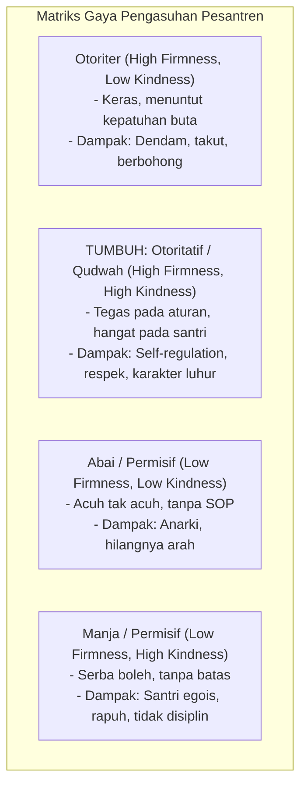

# P1-04-02-Relasi-Murabbi-dan-Santri

## Tujuan
Merumuskan hakikat relasi antara pendidik/pengasuh (*Murabbi, Musyrif, Ustadz*) dan santri dalam ekosistem TUMBUH, dengan berpijak pada prinsip kehangatan, ketegasan (*Firm & Kind*), dan kekuatan **Qudwah** (keteladanan).

---

## Hakikat Relasi Pendidikan: Relasi di Atas Kontrol

Prinsip dasar Disiplin Positif dan tradisi Tarbiyah Islam menegaskan:
> *"Anak lebih mudah diarahkan dan dibimbing oleh orang yang memiliki hubungan positif, aman, dan penuh rasa saling menghargai dengannya."*

Pembinaan bukanlah dominasi kekuasaan atau hierarki ketakutan, melainkan ikatan spiritual dan kasih sayang yang mendalam (*Rahmah*).

---

## 4 Pola Relasi Pendidik & Pengasuh

---

## Karakteristik Murabbi Berbasis Qudwah dalam TUMBUH

1. **Qudwah Qabla ad-Da'wah (Keteladanan Sebelum Seruan)**:
   - Murabbi dan musyrif adalah kurikulum hidup. Kejujuran, disiplin waktu sholat, dan tutur kata santun pembina jauh lebih membekas dibanding seribu kata ceramah.
2. **Kombinasi Tegas & Hangat (*Firm and Kind*)**:
   - **Tegas (Firm)**: Menghormati kebutuhan situasi, menegakkan batasan yang disepakati, konsisten pada konsekuensi logis.
   - **Hangat (Kind)**: Menghormati martabat santri, mendengarkan aktif (*active listening*), tidak merendahkan atau mencaci saat santri keliru.
3. **Membimbing (*Coaching & Mentoring*) Bukan Menghakimi**:
   - Membantu santri menemukan solusi atas permasalahannya sendiri melalui pertanyaan reflektif: *"Apa yang terjadi? Mengapa hal itu bisa terjadi? Bagaimana rencanamu untuk memperbaikinya besok?"*
4. **Membendung Budaya 'Labeling'**:
   - Memisahkan antara perbuatan salah dengan pribadi santri. Kesalahan adalah perilaku yang perlu diperbaiki, bukan identitas mutlak santri.
