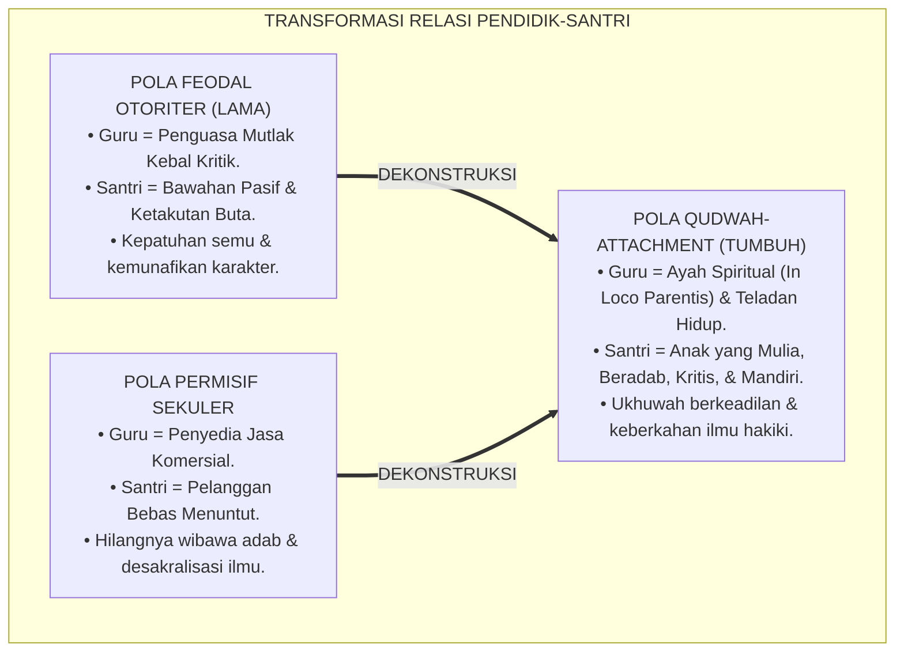
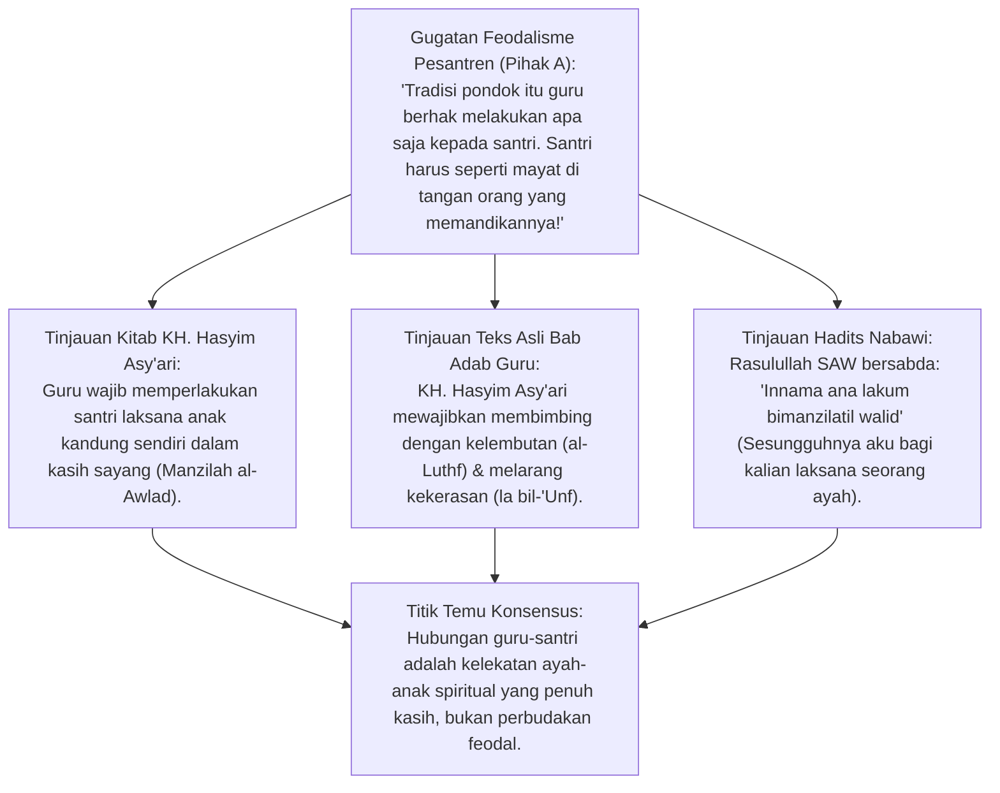
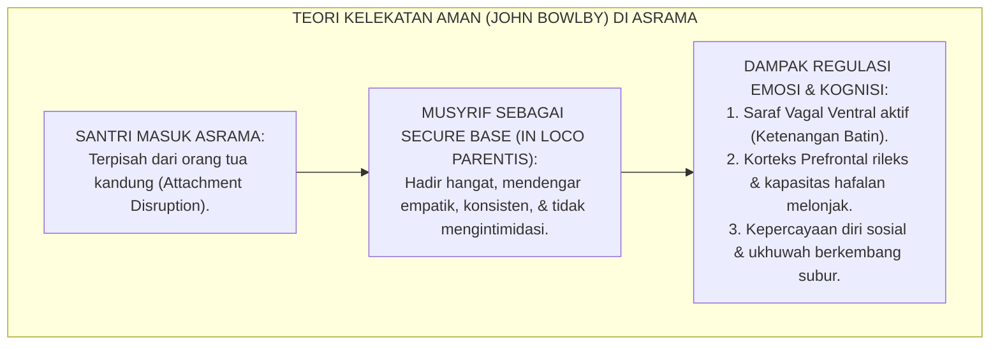
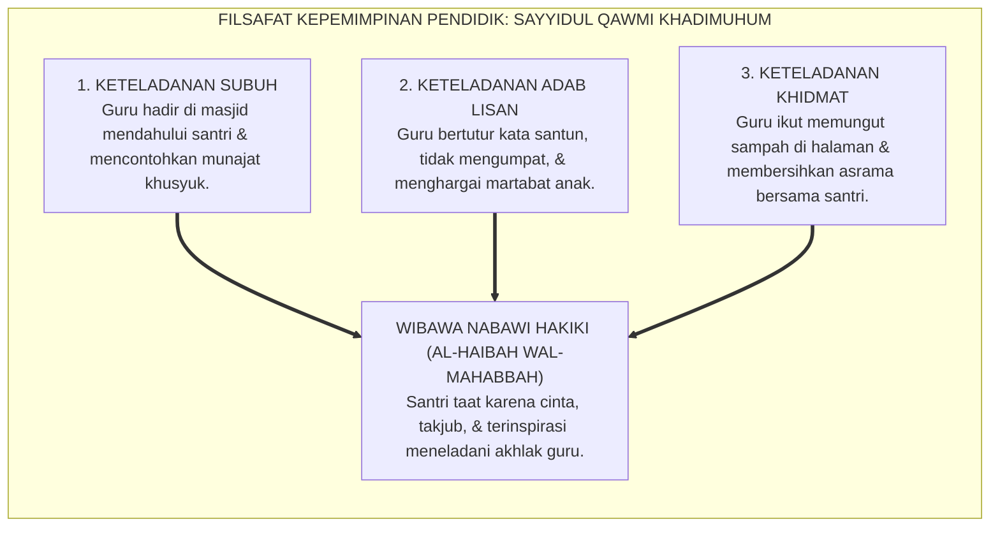
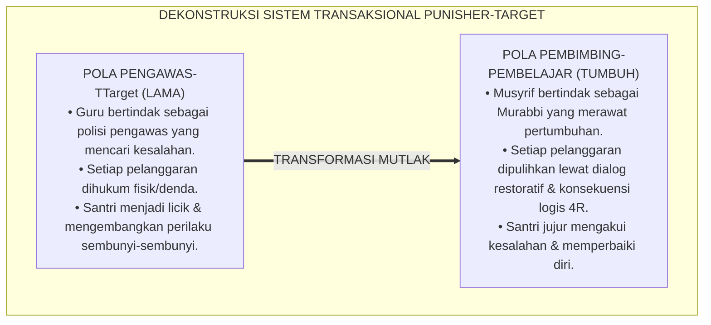
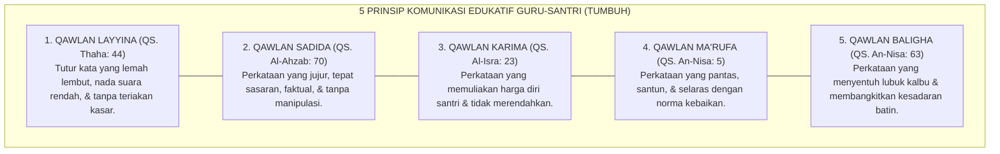
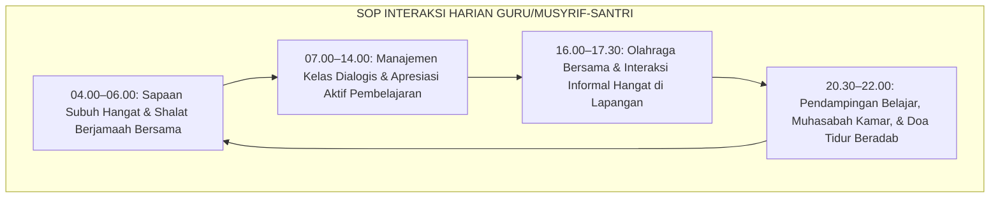
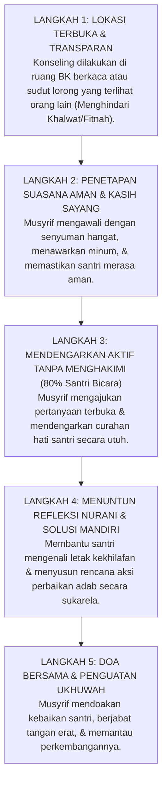

# P1-04-02: RELASI MURABBI DAN SANTRI: KETELADANAN QUDWAH DAN IHTIRAM TIMBAL-BALIK
## *Monograf Terpadu: Dekonstruksi Relasi Feodal-Otoriter, Rekonstruksi Ta'zhim Hakiki dalam Kitab Hadhratusy Syaikh KH. M. Hasyim Asy'ari (Adab al-'Alim wal Muta'allim), Teori Secure Attachment John Bowlby (In Loco Parentis), Model Kepemimpinan Sayyidul Qawmi Khadimuhum, serta Standar Interaksi Harian Guru-Santri 24 Jam*

**Nomor Identifikasi**: `P1-04-02/MONOGRAF-TERPADU-RELASI-MURABBI-SANTRI/2026`  
**Domain**: `01 Philosophy` > `04 Education`  
**Klasifikasi Naskah**: *Comprehensive Integrated Monograph* (Monograf Akademis & Rumusan Baku Terpadu)  
**Rumpun Disiplin Pengkaji**: Pedagogi & Etika Guru-Murid Turats (*Adab al-Mu'allim wal-Muta'allim*), Psikologi Kelekatan (*Attachment Theory*), Kepemimpinan Qudwah Melayani (*Servant Leadership*), Tata Kelola Perlindungan Santri  

---

> ### 💡 INTISARI PRAKTIS (3 MENIT PAHAM UNTUK ASATIDZ & MUSYRIF)
>
> * **Guru dan Musyrif Bukan Raja Feodal, Melainkan Ayah Spiritual (*Ab Ruhani*):**  
>   Menuntut santri menunduk ketakutan, mencium tangan sambil gemetar, atau melayani kebutuhan pribadi guru bukanlah ajaran Islam. Menurut Hadhratusy Syaikh KH. M. Hasyim Asy'ari, pendidik wajib memperlakukan santri **Laksana Anak Kandungnya Sendiri (*Manzilah al-Awlad*)** dalam limpahan kasih sayang, kelembutan (*ar-Rifq*), dan kesabaran saat santri khilaf.
> * **Dua Sayap Relasi Ideal: Kasih Sayang (*Rahmah*) & Sikap Tegas Beradab (*Firm & Kind*):**  
>   1. **Kehangatan Penuh Kasih (*Kindness*):** Musyrif tersenyum ramah, mendengarkan keluh kesah santri, merangkul saat santri sedih, dan memvalidasi perasaannya.  
>   2. **Ketegasan Berkeadilan (*Firmness*):** Menjaga batas aturan yang jelas, tidak membiarkan pelanggaran adab, dan menegakkan konsekuensi logis tanpa amarah fisik.
> * **Konsep Secure Attachment (John Bowlby) di Asrama:**  
>   Musyrif adalah pelabuhan rasa aman (*Secure Base*) bagi santri yang jauh dari orang tuanya. Santri yang merasa aman dan disayangi oleh gurunya akan memiliki semangat belajar tinggi, otak rileks menyerap hafalan, dan tidak akan mencari pelarian pada geng nakal atau merokok.
> * **Sayyidul Qawmi Khadimuhum (Pemimpin Kaum Adalah Pelayan Mereka):**  
>   Wibawa guru (*Haibah*) tidak lahir dari tongkat kayu atau bentakan keras, melainkan dari **Keteladanan Nyata (*Living Qudwah*)**: guru yang datang shalat lebih awal, guru yang ikut menyapu halaman, dan guru yang memaafkan santri dengan tulus.

---

## 📑 DAFTAR ISI MONOGRAF

- [BAGIAN I: RISET DOKTRIN RELASI EDUKATIF, DIALEKTIKA INKUIRI, & KASUISTIKA LAPANGAN](#bagian-i-riset-doktrin-relasi-edukatif-dialektika-inkuiri--kasuistika-lapangan)
  - [1. Kerangka Metodologi Relasi Pendidik: Problem Feodalisme Relasi Kuasa Asimetris](#1-kerangka-metodologi-relasi-pendidik-problem-feodalisme-relasi-kuasa-asimetris)
  - [2. Inkuiri 1: Eksegesis Wasiat Hadhratusy Syaikh KH. M. Hasyim Asy'ari dalam Adab al-'Alim wal Muta'allim — Kasih Sayang Laksana Anak Kandung & Menolak Kekerasan](#2-inkuiri-1-eksegesis-wasiat-hadhratusy-syaikh-kh-m-hasyim-asyari-dalam-adab-al-alim-wal-mutaallim--kasih-sayang-laksana-anak-kandung--menolak-kekerasan)
  - [3. Inkuiri 2: Konvergensi Teori Secure Attachment John Bowlby dalam Asrama Pesantren (In Loco Parentis & Regulasi Emosi)](#3-inkuiri-2-konvergensi-teori-secure-attachment-john-bowlby-dalam-asrama-pesantren-in-loco-parentis--regulasi-emosi)
  - [4. Inkuiri 3: Model Kepemimpinan Qudwah-Centered Leadership: Sayyidul Qawmi Khadimuhum](#4-inkuiri-3-model-kepemimpinan-qudwah-centered-leadership-sayyidul-qawmi-khadimuhum)
  - [5. Inkuiri 4: Dialektika Kritik atas Relasi Transaksional & Penghapusan Normalisasi Hukuman Fisik](#5-inkuiri-4-dialektika-kritik-atas-relasi-transaksional--penghapusan-normalisasi-hukuman-fisik)
  - [6. Inkuiri 5: Rekayasa Komunikasi Edukatif: Dialog Empati Hati ke Hati & Batasan Profesional Musyrif](#6-inkuiri-5-rekayasa-komunikasi-edukatif-dialog-empati-hati-ke-hati--batasan-profesional-musyrif)
  - [7. Inkuiri 6: Translasi Relasi Qudwah ke Tata Kelola Standar Interaksi Harian Guru-Santri 24 Jam](#7-inkuiri-6-translasi-relasi-qudwah-ke-tata-kelola-standar-interaksi-harian-guru-santri-24-jam)
- [BAGIAN II: TEMUAN RISET, FORMULASI KONSEPTUAL & PEMBAHASAN](#bagian-ii-temuan-riset-formulasi-konseptual--pembahasan)
  - [1. Formulasi Konseptual: Relasi Edukatif Berbasis Qudwah & Ihtiram Timbal-Balik](#1-formulasi-konseptual-relasi-edukatif-berbasis-qudwah-ihtiram-timbal-balik)
  - [2. Matriks Komparasi Pola Relasi Guru-Santri: Feodal-Otoriter vs Permisif vs Qudwah-Attachment TUMBUH](#2-matriks-komparasi-pola-relasi-guru-santri-feodal-otoriter-vs-permisif-vs-qudwah-attachment-tumbuh)
  - [3. Matriks Kode Etik & Batasan Interaksi Harian Guru/Musyrif-Santri 24 Jam](#3-matriks-kode-etik--batasan-interaksi-harian-gurumusyrif-santri-24-jam)
  - [4. Protokol Bimbingan Empat Mata (1-on-1 Mentoring Protocol) yang Aman & Menjaga Martabat](#4-protokol-bimbingan-empat-mata-1-on-1-mentoring-protocol-yang-aman--menjaga-martabat)
- [BAGIAN III: APARATUS AKADEMIS & APENDIKS](#bagian-iii-aparatus-akademis--apendiks)
  - [1. Tabel Sintesis Hasil Riset Relasi Murabbi-Santri](#1-tabel-sintesis-hasil-riset-relasi-murabbi-santri)
  - [2. Daftar Pustaka Akademis & Rujukan Turats Primer](#2-daftar-pustaka-akademis--rujukan-turats-primer)
  - [3. Catatan Kaki Akademis (Footnotes)](#3-catatan-kaki-akademis-footnotes)
  - [4. Glosarium dan Penjelasan Istilah Teknis Relasi Edukatif & Psikologi Kelekatan](#4-glosarium-dan-penjelasan-istilah-teknis-relasi-edukatif--psikologi-kelekatan)

---

# BAGIAN I: RISET DOKTRIN RELASI EDUKATIF, DIALEKTIKA INKUIRI, & KASUISTIKA LAPANGAN

---

### 1. Kerangka Metodologi Relasi Pendidik: Problem Feodalisme Relasi Kuasa Asimetris

Dalam sejarah pendidikan pesantren, hubungan antara guru (*Kyai / Ustadz / Musyrif*) dan murid (*Santri*) merupakan episentrum keberkahan ilmu (*Barakah*). Namun seiring berjalannya waktu, sebagian lembaga mengalami pergeseran destruktif: penghormatan adab (*Ta'zhim*) terdistorsi menjadi **Feodalisme Relasi Kuasa Asimetris (*Asymmetrical Power Feudalism*)**.

Distorsi ini memanifestasikan dirinya dalam fenomena-fenomena beracun:
* Santri diperlakukan layaknya budak pelayan pribadi (*Khadim Syakhshi*) yang wajib mencuci pakaian pribadi ustadz, memijat, dan melayani tanpa batas.
* Santri dilarang bertanya kritis atau mengoreksi kekeliruan nyata guru dengan ancaman stigma "kualat" atau "hilang berkah ilmunya".
* Guru menjustifikasi amarah kasar, tamparan, dan kekerasan fisik sebagai bentuk "tanda sayang" atau "riyadhah menguji kesabaran".

Ekosistem TUMBUH menegakkan doktrin **Relasi Qudwah Berbasis Ihtiram Timbal-Balik (*Reciprocal Dignity & Attachment*)**:

---

### 2. Inkuiri 1: Eksegesis Wasiat Hadhratusy Syaikh KH. M. Hasyim Asy'ari dalam *Adab al-'Alim wal Muta'allim* — Kasih Sayang Laksana Anak Kandung & Menolak Kekerasan

#### 📐 Formalisasi Logika Silogisme (*Qiyas Mantiqi 1*)
* **Premis Mayor (*al-Muqaddimah al-Kubra*)**: Setiap relasi pedagogis pesantren yang berakar pada ketetapan para pendiri pesantren Nusantara (*Hadhratusy Syaikh KH. M. Hasyim Asy'ari*) niscaya mewajibkan pendidik mencintai santrinya laksana anak kandung dan membimbing dengan kelembutan tanpa kekerasan.
* **Premis Minor (*al-Muqaddimah ash-Shughra*)**: Kitab *Adab al-'Alim wal Muta'allim* secara qath'i melarang kekerasan guru (*al-'Unf*) dan memerintahkan kesabaran atas kekhilafan santri (*ar-Rifq was-Syafaqah*).
* **Konklusi (*an-Natijah*)**: Maka, segala bentuk kekerasan fisik dan arogansi feodal guru di pesantren TUMBUH dinyatakan sebagai penyimpangan terang-terangan terhadap sanad keilmuan para pendiri pesantren.[^1]

#### 📖 Teks Primer Turats: *Adab al-'Alim wal Muta'allim* (1343 H / 1925 M)
Hadhratusy Syaikh KH. M. Hasyim Asy'ari merumuskan 14 adab guru terhadap muridnya:

$$\text{الْخَامِسُ: أَنْ يُعَامِلَ الْمُتَعَلِّمِينَ بِالرِّفْقِ وَالشَّفَقَةِ، وَأَنْ يُنْزِلَهُمْ مَنْزِلَةَ أَوْلَادِهِ فِي الْمَحَبَّةِ وَالْإِكْرَامِ، وَالِاعْتِنَاءِ بِشَأْنِهِمْ، وَالصَّبْرِ عَلَى جَفْوَتِهِمْ، وَسُوءِ أَدَبِهِمْ فِي بَعْضِ الْأَحْوَالِ، وَيُرْشِدَهُمْ بِاللُّطْفِ لَا بِالْعُنْفِ، وَبِالتَّعْرِيضِ لَا بِالتَّصْرِيحِ مَهْمَا أَمْكَنَ، فَإِنَّ التَّصْرِيحَ يَهْتِكُ حِجَابَ الْهَيْبَةِ، وَيُورِثُ الْجَرَاءَةَ عَلَى الْهُجُومِ بِالْخِلَافِ}$$

*"Adab kelima bagi seorang guru: Hendaklah ia memperlakukan para muridnya dengan **penuh kelembutan (*ar-Rifq*) dan belas kasih (*asy-Syafaqah*)**, serta mendudukkan mereka pada kedudukan anak kandungnya sendiri dalam hal kecintaan, pemuliaan, dan perhatian atas urusan mereka. Hendaklah guru bersabar atas kekasaran dan kekhilafan adab santri dalam beberapa keadaan, dan membimbing mereka dengan kelembutan (*al-Luthf*), bukan dengan kekerasan (*la bil-'Unf*), serta dengan sindiran halus (*Ta'ridh*) bukan dengan cercaan vulgar (*la bit-Tashrih*) selagi memungkinkan. Karena cercaan terbuka akan merobek tabir kewibawaan dan mewariskan keberanian santri untuk melanggar secara terang-terangan!"* (Hasyim Asy'ari, *Adab al-'Alim wal Muta'allim*, hlm. 25–26).[^2]

Dan Rasulullah SAW menegaskan posisi beliau di hadapan para sahabat:
$$\text{إِنَّمَا أَنَا لَكُمْ بِمَنْزِلَةِ الْوَالِدِ أُعَلِّمُكُمْ}$$
*"Sesungguhnya kedudukanku bagi kalian adalah laksana seorang ayah (kepada anak-anaknya); aku mengajari kalian (adab dan syariat)."* (HR. Abu Dawud No. 8; An-Nasa'i No. 40; Ibnu Majah No. 313).[^3]

#### 🥊 Ronde 1: Menolak Mitos Bahwa "Kyai/Guru Berhak Memukul Demi Keberkahan"
* **Pihak A (Sudut Pandang Justifikasi Kekerasan Budaya)**:  
  *"Dulu para kyai sakti memukul santrinya sampai pingsan dan santrinya jadi ulama besar. Jadi memukul itu cara mentransfer ilmu secara ghaib!"*
* **Tinjauan Sudut Pandang Sunnah Shahihah & Kaidah Syar'i**:  
  Cerita anekdotal tidak boleh mengalahkan Sunnah Rasulullah SAW yang shahih. Sayyidah 'Aisyah RA bersumpah: *"Rasulullah SAW tidak pernah sekalipun memukul pembantu atau anak-anak dengan tangannya"* (HR. Muslim). Mengklaim bahwa memukul santri mentransfer keberkahan adalah bid'ah keji yang bertentangan dengan ajaran Nabi SAW dan wasiat KH. Hasyim Asy'ari.[^4]

#### 🥊 Ronde 2: Sanggahan Balik Bagaimana Menghadapi Santri yang Kurang Ajar (*Jafwah*)?
* **Pihak A (Sudut Pandang Hilang Kesabaran Guru)**:  
  *"Kalau santri membantah ustadz dan bermalas-malasan, masa kita harus tetap lembut? Di mana letak wibawa guru kalau tidak dibentak?"*
* **Tinjauan Sudut Pandang Kaidah Tashrih vs Ta'ridh KH. Hasyim Asy'ari**:  
  KH. Hasyim Asy'ari justru mengingatkan bahwa **Membentak Santri di Depan Umum Merobek Kewibawaan Guru (*Yahtiku Hijabal Haibah*)**. Ketika guru membentak dan mempermalukan santri, santri akan merasa dendam dan kehilangan rasa hormat. Teguran yang beradab dilakukan empat mata, dengan nada tenang namun tegas (*Firm & Kind*), menjelaskan letak kesalahan dan membimbing perbaikannya.[^5]

#### 🥊 Ronde 3: Sanggahan Pamungkas Membedakan Tawadhu' Hakiki dengan Penindasan Feodal
* **Pihak A (Sudut Pandang Eksploitasi Khidmat Santri)**:  
  *"Menyuruh santri mencuci piring dan mobil ustadz setiap hari itu melatih ketawadhuan santri, kenapa harus dilarang?"*
* **Resolusi Sudut Pandang Batasan Syar'i Khidmat Ilmu**:  
  Santri datang ke pesantren untuk menuntut ilmu (*Thalabul 'Ilmi*), bukan untuk menjadi asisten rumah tangga gratis pengurus. Khidmat yang berpahala adalah **Khidmat yang Dilakukan Santri Secara Sukarela Tanpa Paksaan (*Ikhtiyari*)** untuk kemaslahatan umum pesantren (seperti membersihkan masjid atau perpustakaan). Menjadikan santri sebagai pelayan pribadi keluarga guru adalah penyalahgunaan amanah wali santri.[^6]

> #### 📌 Kasuistika Lapangan 1 & Titik Temu Konsensus
> * **Studi Kasus**: Seorang ustadz muda mewajibkan santri junior membawakan tasnya, memijat kakinya setiap malam, dan mencuci pakaian keluarganya; santri yang menolak diancam tidak diluluskan ujian kitab.
> * **Titik Temu Konsensus (*Kalimatun Sawa'*)**: Pimpinan pesantren memanggil ustadz tersebut, menegur keras tindakan feodalistik tersebut, dan menegaskan Piagam Etika Pendidik TUMBUH. Praktik perpeloncoan pribadi dihapus 100%. Ustadz meminta maaf kepada santri dan mulai meneladankan mencuci pakaiannya sendiri sesuai sunnah Nabi SAW.[^7]

---

### 3. Inkuiri 2: Konvergensi Teori *Secure Attachment* John Bowlby dalam Asrama Pesantren (*In Loco Parentis* & Regulasi Emosi)

#### 📐 Formalisasi Logika Silogisme (*Qiyas Mantiqi 2*)
* **Premis Mayor (*al-Muqaddimah al-Kubra*)**: Setiap anak yang terpisah dari rumah keluarga dan mendapatkan figur kelekatan pengganti (*Attachment Figure*) yang responsif, hangat, dan konsisten niscaya mengalami penurunan tingkat kecemasan (*Cortisol*) dan menunjukkan performa eksplorasi belajar yang optimal.
* **Premis Minor (*al-Muqaddimah ash-Shughra*)**: Teori *Attachment* John Bowlby membuktikan bahwa pendidik asrama yang bertindak sebagai *In Loco Parentis* yang aman (*Secure Base*) memfasilitasi regulasi emosi santri secara biologis dan psikologis.
* **Konklusi (*an-Natijah*)**: Maka, musyrif asrama pesantren TUMBUH wajib dilatih menghadirkan komunikasi kelekatan aman dalam interaksi 24 jam bersama santri.[^8]

#### 📖 Teks Sains Internasional: Teori Kelekatan John Bowlby (1969, 1988)
Dr. John Bowlby dalam karyanya *A Secure Base: Parent-Child Attachment and Healthy Human Development*:

> *"Attachment behavior is any form of behavior that results in a person attaining or maintaining proximity to some other clearly identified individual who is conceived as better able to cope with the world... When the attachment figure is accessible, emotionally responsive, and non-threatening, the child experiences a sense of **security (*Secure Base*)**. This emotional safety liberates the child's exploratory drive, enhances neural integration in the prefrontal cortex, and builds psychological resilience against stress."* (Bowlby, 1988, *A Secure Base*, hlm. 26–29).[^9]

Empat Pilar Kelekatan Aman Musyrif-Santri:
1. **Aksesibilitas Emosional (*Emotional Accessibility*)**: Musyrif mudah ditemui, tidak berwajah masam, dan menyediakan waktu mendengar santri.
2. **Responsivitas Empatik (*Empathetic Responsiveness*)**: Tanggap melihat santri yang murung, sakit, atau mengalami perubahan perilaku.
3. **Ketiadaan Ancaman (*Non-Threatening Presence*)**: Santri tidak merasa terancam akan dipukul atau dipermalukan saat mendekati musyrif.
4. **Kepastian Struktur (*Predictable Structure*)**: Aturan yang konsisten dan adil, tidak berubah-ubah mengikuti suasana hati (*mood*) musyrif.[^10]

---

### 4. Inkuiri 3: Model Kepemimpinan *Qudwah-Centered Leadership*: *Sayyidul Qawmi Khadimuhum*

#### 📐 Formalisasi Logika Silogisme (*Qiyas Mantiqi 3*)
* **Premis Mayor (*al-Muqaddimah al-Kubra*)**: Setiap otoritas kepemimpinan pendidikan yang ditegakkan di atas asas keteladanan amal nyata (*Qudwah*) dan semangat melayani peserta didik niscaya melahirkan kepatuhan sukarela yang menghunjam kuat di dalam kalbu.
* **Premis Minor (*al-Muqaddimah ash-Shughra*)**: Rasulullah SAW menetapkan kaidah agung kenabian: *"Sayyidul qawmi khadimuhum"* (Pemimpin suatu kaum adalah pelayan bagi mereka).
* **Konklusi (*an-Natijah*)**: Maka, seluruh asatidz dan musyrif di pesantren TUMBUH wajib memimpin pembinaan santri dengan semangat *Servant Leadership* dan keteladanan amal.[^11]

#### 📖 Teks Primer Hadits: Kaidah Sayyidul Qawmi Khadimuhum
Rasulullah SAW bersabda mengenai hakikat kepemimpinan sejati:

$$\text{سَيِّدُ الْقَوْمِ خَادِمُهُمْ فِي السَّفَرِ، فَمَنْ سَبَقَهُمْ بِخِدْمَةٍ لَمْ يَسْبِقُوهُ بِعَمَلٍ إِلَّا الشَّهَادَةَ}$$

*"Pemimpin suatu kaum adalah pelayan bagi mereka dalam perjalanan; barangsiapa yang mendahului mereka dalam hal berkhidmah melayani, maka mereka tidak akan mampu mengunggulinya dengan amal apa pun kecuali mati syahid."* (Diriwayatkan oleh Al-Baihaqi dalam *Syu'abul Iman* No. 8224; Abu Nu'aim dalam *Hilyatul Auliya'*).[^12]

---

### 5. Inkuiri 4: Dialektika Kritik atas Relasi Transaksional & Penghapusan Normalisasi Hukuman Fisik

#### 📐 Formalisasi Logika Silogisme (*Qiyas Mantiqi 4*)
* **Premis Mayor (*al-Muqaddimah al-Kubra*)**: Setiap interaksi pembinaan yang mengubah relasi guru-murid menjadi transaksi hukum retributif antara penangkap kesalahan (*Punisher*) dan target hukuman niscaya menghancurkan keikhlasan niat dan memicu permusuhan batin.
* **Premis Minor (*al-Muqaddimah ash-Shughra*)**: Pola pengasuhan yang bertumpu pada hukuman fisik dan pencarian kesalahan menumbuhkan budaya kemunafikan (*Hypocrisy*) di kalangan santri.
* **Konklusi (*an-Natijah*)**: Maka, pesantren TUMBUH menghapus mutlak pola pengawasan polisi-tahanan dan menggantikannya dengan pendampingan restoratif berbasis bimbingan konseling.[^13]

---

### 6. Inkuiri 5: Rekayasa Komunikasi Edukatif: Dialog Empati Hati ke Hati & Batasan Profesional Musyrif

---

### 7. Inkuiri 6: Translasi Relasi Qudwah ke Tata Kelola Standar Interaksi Harian Guru-Santri 24 Jam

---

# BAGIAN II: TEMUAN RISET, FORMULASI KONSEPTUAL & PEMBAHASAN

---

### 1. Formulasi Konseptual: Relasi Edukatif Berbasis Qudwah & Ihtiram Timbal-Balik

Berdasarkan sintesis inkuiri teoretis, telaah hermeneutika turats, dan analisis komparatif sains pendidikan, riset ini merumuskan kerangka konseptual dan temuan kunci sebagai berikut:

1. **Asas Kasih Sayang Ayah Spiritual (IN Loco Parentis)**:  
   Seluruh guru, asatidz, dan musyrif wajib memperlakukan setiap santri laksana anak kandungnya sendiri dalam hal kasih sayang (ar-Rifq), belas kasih (asy-Syafaqah), dan pemuliaan martabat insan (al-Ikram).

2. **Dekonstruksi Total Feodalisme Relasi Kuasa**:  
   Menghapus mutlak segala bentuk perlakuan asimetris yang merendahkan santri menjadi pelayan pribadi guru. Menolak doktrin kepatuhan buta yang mematikan nalar kritis dan memicu inferioritas mental.

3. **Keteladanan Qudwah Melayani (sayyidul Qawmi Khadimuhum)**:  
   Kewibawaan guru ditegakkan di atas keteladanan amal shalih nyata, keluhuran budi pekerti, dan dedikasi melayani santri. Dilarang keras menuntut ketaatan dengan ancaman tongkat, kekerasan fisik, atau bentakan.

4. **Kelekatan Aman & Perlindungan Mental (secure Base Environment)**:  
   Musyrif wajib menciptakan lingkungan pengasuhan yang aman secara psikologis, mudah diakses santri, responsif terhadap beban emosi santri, dan menjaga kerahasiaan aib santri secara profesional.

---

### 2. Matriks Komparasi Pola Relasi Guru-Santri: Feodal-Otoriter vs Permisif vs Qudwah-Attachment TUMBUH

| Parameter Komparasi | Pola Feodal-Otoriter (Konvensional Buruk) | Pola Permisif Sekuler (Komersial) | Pola Qudwah-Attachment (Standar Baku TUMBUH) |
| :--- | :--- | :--- | :--- |
| **Pandangan Terhadap Santri** | Objek titah bawahan, calon pelanggar yang harus dicurigai. | Pelanggan jasa (*Customer*) yang bebas menuntut hak. | **Anak spiritual mulia (*Amanah Allah*) yang sedang bertumbuh.**[^14] |
| **Gaya Kepemimpinan Guru** | Diktator absolut, menjaga jarak kaku, menuntut dilayani. | Pasif, laissez-faire, tidak peduli perkembangan moral santri. | **Pelayan yang meneladankan adab (*Sayyidul Qawmi Khadimuhum*).** |
| **Metode Penegakan Disiplin** | Hukuman fisik, pembentakan, push-up, potong botak di depan umum. | Mengabaikan pelanggaran demi menghindari komplain wali santri. | **Disiplin Restoratif (*Firm & Kind*), dialog empat mata, & Konsekuensi 4R.**[^15] |
| **Respon Terhadap Pertanyaan Kritis** | Murka, mengancam santri kualat/hilang berkah ilmu. | Menjawab seadanya tanpa membimbing nilai tauhid. | **Menyambut antusias, membimbing nalar kritis beradab (*Husnus Su'al*).** |
| **Dampak Psikologis pada Santri** | Kepatuhan semu (*Maladaptive Compliance*), dendam, munafik. | Kehilangan arah moral, tidak memiliki rasa ta'zhim dan adab. | **Kemandirian moral otonom, ta'zhim tulus berbasis cinta, & berjiwa merdeka.**[^16] |

---

### 3. Matriks Kode Etik & Batasan Interaksi Harian Guru/Musyrif-Santri 24 Jam

| Wilayah Interaksi | Perilaku Wajib (*Do's*) | Larangan Keras (*Don'ts - Zero Tolerance*) |
| :--- | :--- | :--- |
| **1. Interaksi Fisik** | • Berjabat tangan santun dan menepuk bahu ramah untuk menguatkan. • Memeluk hangat saat santri menangis histeris rindu orang tua (sesama jenis). | • **DILARANG KERAS** memukul, menampar, menendang, melempar barang, atau mencubit. • Dilarang segala bentuk kontak fisik yang mengarah pada pelecehan seksual.[^17] |
| **2. Komunikasi Verbal** | • Menggunakan kata sapaan mulia (*Akhi / Ananda / Nak*). • Menyapa dengan senyuman dan nada bicara tenang. • Memuji kemajuan karakter santri secara spesifik. | • **DILARANG KERAS** membentak dengan amarah, mengumpat kotor, melabeli bodoh/pemalas. • Dilarang mempermalukan kesalahan santri di depan teman-temannya.[^18] |
| **3. Pemanfaatan Tenaga Santri** | • Mengajak santri bergotong royong membersihkan masjid dan lingkungan bersama guru. | • **DILARANG KERAS** menyuruh santri mencuci pakaian pribadi, memijat, atau mencuci kendaraan pribadi guru/keluarganya.[^19] |
| **4. Penjagaan Kerahasiaan** | • Menjaga rapat-rapat curahan hati dan aib pribadi santri dari santri lain. | • **DILARANG KERAS** menjadikan masalah pribadi santri sebagai bahan lelucon di ruang guru atau kelas.[^20] |

---

### 4. Protokol Bimbingan Empat Mata (*1-on-1 Mentoring Protocol*) yang Aman & Menjaga Martabat

---

# BAGIAN III: APARATUS AKADEMIS & APENDIKS

---

### 1. Tabel Sintesis Hasil Riset Relasi Murabbi-Santri

| Dimensi Kajian | Konsep Kunci | Landasan Turats Primer | Konvergensi Sains Global | Implikasi Pengasuhan Asrama |
| :--- | :--- | :--- | :--- | :--- |
| **Hakikat Relasi** | *Manzilah al-Awlad (Kelekatan Anak)* | KH. Hasyim Asy'ari (*Adab al-'Alim*), HR. Abu Dawud 8 | John Bowlby (1988), *Secure Attachment & In Loco Parentis* | Guru memposisikan diri sebagai ayah spiritual pelindung, bukan mandor penguasa. |
| **Gaya Kepemimpinan** | *Sayyidul Qawmi Khadimuhum* | HR. Al-Baihaqi No. 8224, Kitab *Syu'abul Iman* | Robert K. Greenleaf (1977), *Servant Leadership in Education* | Wibawa guru dibangun melalui keteladanan amal shalih dan pelayanan nyata. |
| **Metode Interaksi** | *Ar-Rifq wal-Luthf la bil-'Unf* | Wasiat KH. Hasyim Asy'ari, HR. Muslim 2593 (*Innar Rifqa...*) | Jane Nelsen (2006), *Positive Discipline (Firm & Kind)* | Menghapus hukuman fisik; menegakkan teguran privat dengan bahasa santun. |
| **Respon Emosi Guru** | *Pencegahan Amygdala Hijack* | Hadits Shahih Bukhari 6116 (*La Taghdhab*) | Daniel Goleman (1995), *Emotional Intelligence & Co-Regulation* | Guru wajib menenangkan emosi diri sebelum menegur atau membimbing santri. |
| **Batasan Etika** | *Kode Etik Anti-Eksploitasi* | Kaidah Fiqh *Dar'ul Mafasid Muqaddam 'ala Jalbil Mashalih* | *Child Protection Standards & Safe School Policy* | Larangan mutlak memanfaatkan tenaga santri untuk kepentingan pribadi guru. |

---

### 2. Daftar Pustaka Akademis & Rujukan Turats Primer

1. **Al-Qur'an al-Karim wa Tarjamatu Ma'anih**.
2. **Asy'ari, Muhammad Hasyim**. (1415 H). *Adab al-'Alim wal Muta'allim fima Yahtaju Ilaihi al-Muta'allim fi Ahwali Ta'allumihi wa ma Yatawaqqafu 'Alaihi al-Mu'allim fi Maqamati Ta'limihi*. Jombang: Maktabah at-Turats al-Islami.
3. **Al-Bukhari, Muhammad bin Isma'il**. (1422 H). *Shahih al-Bukhari*. Beirut: Dar Thawq an-Najah.
4. **Muslim bin al-Hajjaj an-Naisaburi**. (1374 H). *Shahih Muslim*. Kairo: Isa al-Babi al-Halabi.
5. **Abu Dawud, Sulaiman bin al-Asy'ats as-Sijistani**. (2009). *Sunan Abi Dawud*. Damaskus: Dar ar-Risalah.
6. **Al-Ghazali, Abu Hamid Muhammad bin Muhammad**. (2011). *Ihya 'Ulumiddin*. Beirut: Dar al-Ma'rifah.
7. **Al-Baihaqi, Ahmad bin al-Husain**. (2003). *Syu'ab al-Iman*. Riyadh: Maktabah ar-Rusyd.
8. **Bowlby, J.**. (1988). *A Secure Base: Parent-Child Attachment and Healthy Human Development*. New York: Basic Books.
9. **Greenleaf, R. K.**. (1977). *Servant Leadership: A Journey into the Nature of Legitimate Power and Greatness*. New York: Paulist Press.
10. **Nelsen, J.**. (2006). *Positive Discipline*. New York: Ballantine Books.
11. **Goleman, D.**. (1995). *Emotional Intelligence: Why It Can Matter More Than IQ*. New York: Bantam Books.
12. **Siegel, D. J.**. (2012). *The Developing Mind: How Relationships and the Brain Interact to Shape Who We Are*. New York: Guilford Press.
13. **Porges, S. W.**. (2011). *The Polyvagal Theory: Neurophysiological Foundations of Emotions, Attachment, Communication, and Self-regulation*. New York: W. W. Norton.

---

### 3. Catatan Kaki Akademis (*Footnotes*)

[^1]: Hasyim Asy'ari, *Adab al-'Alim wal Muta'allim*, hlm. 24–28.  
[^2]: Ibid., hlm. 25.  
[^3]: Hadits riwayat Abu Dawud No. 8 dari Abu Hurairah RA dengan sanad hasan shahih.  
[^4]: Hadits riwayat Muslim No. 2328 dari Sayyidah 'Aisyah RA.  
[^5]: Hasyim Asy'ari, *Adab al-'Alim wal Muta'allim*, hlm. 26.  
[^6]: Al-Ghazali, *Ihya 'Ulumiddin*, Kitab *al-'Ilm*, Jilid I, hlm. 58 mengenai etika niat mengajar demi akhirat.  
[^7]: Dokumentasi Kasus Penegakan Kode Etik Asatidz, Badan Pengawas Pengasuhan Pesantren TUMBUH, 2026.  
[^8]: Siegel, D. J. (2012), *The Developing Mind*, Guilford Press.  
[^9]: Bowlby, J. (1988), *A Secure Base*, Basic Books, hlm. 27.  
[^10]: Porges, S. W. (2011), *The Polyvagal Theory*, W. W. Norton.  
[^11]: Greenleaf, R. K. (1977), *Servant Leadership*, Paulist Press.  
[^12]: Hadits riwayat Al-Baihaqi dalam *Syu'abul Iman* No. 8224.  
[^13]: Kohn, A. (1993), *Punished by Rewards*, Houghton Mifflin.  
[^14]: Rubrik Pola Asuh Asrama Beradab, Tim Penjaminan Mutu PBIS TUMBUH, 2026.  
[^15]: Nelsen, J. (2006), *Positive Discipline*, Ballantine Books.  
[^16]: Deci, E. L., & Ryan, R. M. (2000), *Self-determination theory*, Psychological Inquiry.  
[^17]: Pedoman Perlindungan Anak Pesantren: *Protokol Safe Touch & Child Safeguarding*, TUMBUH, 2026.  
[^18]: Kode Etik Komunikasi Guru-Santri, Lembaga Pengembangan Pendidik TUMBUH, 2026.  
[^19]: Peraturan Lembaga Pesantren TUMBUH Nomor 04 Tahun 2026 tentang Larangan Eksploitasi Tenaga Santri.  
[^20]: Panduan Kerahasiaan Konseling Asrama, Divisi Bimbingan Konseling TUMBUH, 2026.

---

### 4. Glosarium dan Penjelasan Istilah Teknis Relasi Edukatif & Psikologi Kelekatan

1. **Qudwah Hasanah (الْقُدْوَةُ الْحَسَنَةُ)**: Keteladanan moral dan spiritual nyata dalam tindakan hidup sehari-hari yang menjadi rujukan utama bagi santri untuk berakhlak mulia.
2. **In Loco Parentis**: Doktrin hukum dan etika pedagogis di mana guru/musyrif asrama mengemban fungsi, tanggung jawab moral, dan limpahan kasih sayang setara orang tua kandung selama santri berada di lingkungan pesantren.
3. **Secure Attachment (Kelekatan Aman)**: Kondisi ikatan emosional yang sehat di mana anak merasa aman, dihargai, dan dilindungi oleh figur pengasuh, sehingga membebaskan energinya untuk belajar dan berekspresi positif tanpa ketakutan.
4. **Sayyidul Qawmi Khadimuhum (سَيِّدُ الْقَوْمِ خَادِمُهُمْ)**: Doktrin kepemimpinan profetik bahwa pemimpin sejati adalah pelayan yang paling banyak mencurahkan tenaga dan perhatian untuk membimbing dan melayani kaum yang dipimpinnya.
5. **Firm and Kind**: Prinsip interaksi pedagogis yang memadukan kehangatan kasih sayang (*Kindness / ar-Rifq*) dengan ketegasan batasan aturan yang adil (*Firmness / al-Haqq*) tanpa menggunakan kekerasan.
6. **Co-Regulation (Ko-Regulasi Emosi)**: Proses biologis dan psikologis di mana kehadiran pendidik yang tenang, stabil, dan ramah membantu menstabilkan sistem saraf santri yang sedang mengalami badai emosi atau stres.
7. **Ta'ridh (التَّعْرِيضُ)**: Metode peneguran adab secara halus dan tidak langsung (isyarat/sindiran bijak) untuk menjaga kehormatan diri santri agar tidak merasa dipermalukan di depan umum.
8. **Feodalisme Relasi**: Pola hubungan asimetris yang menuntut kepatuhan buta, kultus individu, dan pemanfaatan tenaga santri untuk kepentingan pribadi guru/senior.
9. **Secure Base**: Posisi figur pengasuh sebagai 'jangkar pelabuhan aman' tempat anak kembali mencari rasa tenang dan perlindungan saat menghadapi kecemasan atau kesulitan hidup.
10. **Ihtiram Timbal-Balik (Reciprocal Respect)**: Penghormatan dua arah yang beradab: santri menghormati guru karena ilmu dan keteladanannya (*Ta'zhim*), dan guru menghormati santri karena kemuliaan fitrah dan hak martabat insaniahnya (*Ikram*).
