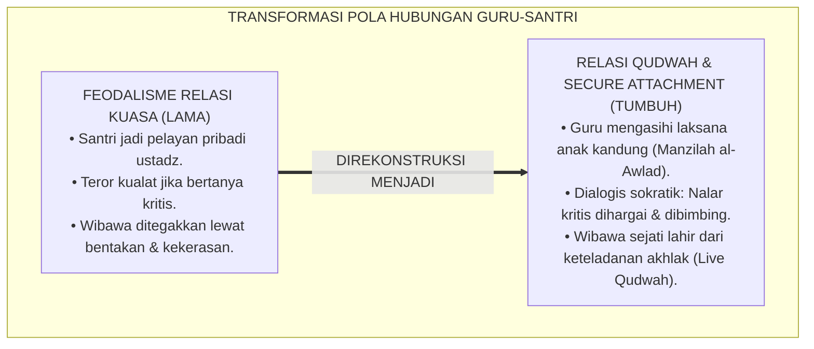
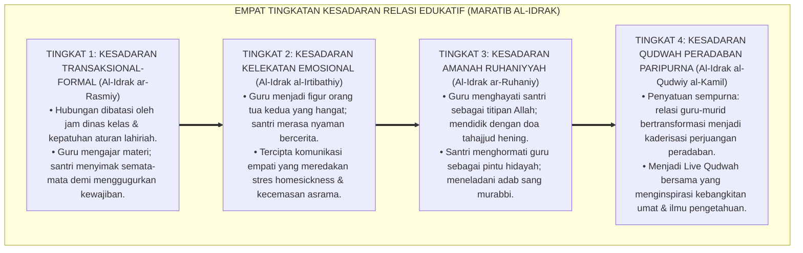
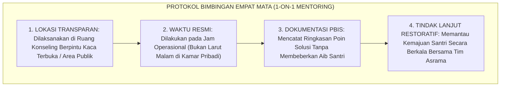

# P1-04-02: RELASI MURABBI DAN SANTRI: KETELADANAN QUDWAH DAN IHTIRAM TIMBAL-BALIK (EDUCATOR-STUDENT RELATIONAL ADAB)
## *Monograf Riset Akademik: Dekonstruksi Feodalisme Relasi Kuasa Asimetris, Rekonstruksi Ta'zhim Hakiki dalam Adab al-'Alim wal-Muta'allim KH. M. Hasyim Asy'ari, Teori Secure Attachment John Bowlby (In Loco Parentis), Serta Kode Etik Interaksi Guru-Santri di Pesantren 24 Jam*

**Nomor Identifikasi**: `P1-04-02/MONOGRAF-RISET-RELASI-MURABBI-SANTRI/2026`  
**Domain**: `01 Philosophy` > `04 Education` (Sub-Modul 02: *Educator-Student Relational Dynamics*)  
**Klasifikasi Naskah**: *Academic Research Monograph* (Monograf Riset Akademik Fondasional)  
**Rumpun Disiplin Pengkaji**: Pedagogi & Etika Guru-Murid Turats (*Adab al-Mu'allim wal-Muta'allim*), Psikologi Kelekatan (*Attachment Theory*), Kepemimpinan Qudwah Melayani (*Servant Leadership*), Tata Kelola Perlindungan Santri  

---

> ### 💡 INTISARI EKSEKUTIF (EXECUTIVE SUMMARY)
>
> * **Kelemahan Paradigma Lama: Distorsi Ta'zhim Menjadi Feodalisme dan Eksploitasi:**  
>   Sebagian lingkungan pesantren mengalami distorsi relasi guru-murid: konsep penghormatan (*Ta'zhim*) disalahgunakan menjadi feodalisme kultural di mana santri dijadikan pelayan pribadi guru, dilarang berpikir kritis karena takut divonis kualat, dan kekerasan fisik dilegitimasi atas nama "riyadhah batin".
> * **Inovasi Konseptual: Rekonstruksi Hadhratusy Syaikh KH. M. Hasyim Asy'ari & Secure Attachment:**  
>   TUMBUH menegaskan wasiat emas KH. M. Hasyim Asy'ari: pendidik wajib memperlakukan santri **Laksana Anak Kandung (*Manzilah al-Awlad*)** dalam limpahan kasih sayang (*Ar-Rahmah*), kelembutan (*Ar-Rifq*), dan keteladanan nyata (*Live Qudwah*). Memadukannya dengan teori *Secure Attachment* John Bowlby: musyrif bertindak sebagai pangkalan rasa aman (*Secure Base*) dan pengasuh pengganti (*In Loco Parentis*).
> * **Formulasi Operasional & Pembuktian Lapangan:**  
>   Monograf ini menguraikan matriks kode etik interaksi 24 jam, 4 Tingkatan Kesadaran Relasi Edukatif (*Maratib al-Idrak*), protokol bimbingan empat mata (*1-on-1 Mentoring*), dan etika tata kelola anti-eksploitasi santri.

---

## 📑 DAFTAR ISI MONOGRAF

- [BAB I: LANDASAN TEORETIS & DISKURSUS KRITIS](#bab-i-landasan-teoretis--diskursus-kritis)
  - [1. Latar Belakang Masalah: Krisis Feodalisme dan Relasi Kuasa Asimetris di Pesantren](#1-latar-belakang-masalah-krisis-feodalisme-dan-relasi-kuasa-asimetris-di-pesantren)
  - [2. Eksegesis Wasiat Turats Hadhratusy Syaikh KH. M. Hasyim Asy'ari: Kasih Sayang Laksana Anak Kandung (Adab al-'Alim wal-Muta'allim)](#2-eksegesis-wasiat-turats-hadhratusy-syaikh-kh-m-hasyim-asyari-kasih-sayang-laksana-anak-kandung-adab-al-alim-wal-mutaallim)
  - [3. Konvergensi Psikologi Perkembangan: Teori Secure Attachment John Bowlby dan Peran In Loco Parentis](#3-konvergensi-psikologi-perkembangan-teori-secure-attachment-john-bowlby-dan-peran-in-loco-parentis)
  - [4. Model Kepemimpinan Keteladanan Qudwah: Dekonstruksi Wibawa Punitif Menuju Sayyidul Qawmi Khadimuhum](#4-model-kepemimpinan-keteladanan-qudwah-dekonstruksi-wibawa-punitif-menuju-sayyidul-qawmi-khadimuhum)
  - [5. Kasuistika Lapangan: Kasus Eksploitasi Tenaga Santri & Resolusi Restoratif Terpadu](#5-kasuistika-lapangan-kasus-eksploitasi-tenaga-santri--resolusi-restoratif-terpadu)
- [BAB II: FORMULASI KONSEPTUAL & PEMBAHASAN MENDALAM](#bab-ii-formulasi-konseptual--pembahasan-mendalam)
  - [1. Eksplanasi Teoretis Relasi Edukatif Berbasis Qudwah dan Ihtiram Timbal-Balik TUMBUH](#1-eksplanasi-teoretis-relasi-edukatif-berbasis-qudwah-dan-ihtiram-timbal-balik-tumbuh)
  - [2. Dekomposisi Dimensi & Empat Tingkatan Kesadaran Relasi Edukatif (Maratib al-Idrak)](#2-dekomposisi-dimensi--empat-tingkatan-kesadaran-relasi-edukatif-maratib-al-idrak)
  - [3. Matriks Kode Etik & Batasan Interaksi Harian Guru/Musyrif-Santri 24 Jam](#3-matriks-kode-etik--batasan-interaksi-harian-gurumusyrif-santri-24-jam)
  - [4. Protokol Bimbingan Empat Mata (1-on-1 Mentoring Protocol) yang Aman & Bermartabat](#4-protokol-bimbingan-empat-mata-1-on-1-mentoring-protocol-yang-aman--bermartabat)
  - [5. Diskusi Filosofis Mendalam & Implikasi bagi Masa Depan Peradaban Pendidikan Islam](#5-diskusi-filosofis-mendalam--implikasi-bagi-masa-depan-peradaban-pendidikan-islam)
- [BAB III: KESIMPULAN & APARATUS AKADEMIS](#bab-iii-kesimpulan--aparatus-akademis)
  - [1. Tabel Sintesis Temuan Riset Relasi Murabbi-Santri](#1-tabel-sintesis-temuan-riset-relasi-murabbi-santri)
  - [2. Daftar Pustaka Akademis & Rujukan Turats Primer](#2-daftar-pustaka-akademis--rujukan-turats-primer)
  - [3. Catatan Kaki Akademis (Footnotes)](#3-catatan-kaki-akademis-footnotes)
  - [4. Glosarium Istilah Ilmiah & Turats Relasi Edukatif](#4-glosarium-istilah-ilmiah--turats-relasi-edukatif)

---

# BAB I: LANDASAN TEORETIS & DISKURSUS KRITIS

---

### 1. Latar Belakang Masalah: Krisis Feodalisme dan Relasi Kuasa Asimetris di Pesantren

Hubungan antara pendidik (*Murabbi / Asatidz / Musyrif*) dan santri adalah jantung keberkahan pendidikan Islam. Namun dalam dinamika sosiologis di sebagian pesantren, terjadi distorsi yang mencederai nilai-nilai syariat:
* **Feodalisme Relasi Kuasa (*Asymmetrical Power Exploitation*)**: Santri diperlakukan layaknya pelayan pribadi yang diwajibkan mencuci pakaian pribadi ustadz, memijat, dan melayani urusan domestik pengasuh tanpa batas waktu.
* **Pemberangusan Nalar Kritis Melalui Teror Kualat**: Santri yang bertanya kritis atau mengoreksi kekeliruan guru langsung diancam akan kehilangan berkah ilmunya (*Su'ul Adab*), menciptakan budaya ketakutan semu (*Submissive Fear*) dan kemunafikan sikap.
* **Normalisasi Amarah Kasar**: Pengasuh menjustifikasi tamparan, tendangan, dan caci maki sebagai "tanda sayang" atau "riyadhah batin".
* **Keniscayaan Doktrin Ihtiram Timbal-Balik**: Islam menolak feodalisme; penghormatan murid kepada guru wajib diimbangi dengan kasih sayang, perlindungan, dan keteladanan guru kepada murid.[^1]

---

### 2. Eksegesis Wasiat Turats Hadhratusy Syaikh KH. M. Hasyim Asy'ari: Kasih Sayang Laksana Anak Kandung (Adab al-'Alim wal-Muta'allim)

Pendiri Nahdlatul Ulama, **Hadhratusy Syaikh KH. M. Hasyim Asy'ari**, dalam mahakaryanya *Adab al-'Alim wal-Muta'allim*, menggariskan pilar etika pendidik:

$$\text{أَنْ يَقْصِدَ بِتَعْلِيمِهِمْ وَتَهْذِيبِهِمْ وَجْهَ اللَّهِ تَعَالَى ... وَأَنْ يُعَامِلَهُمْ بِمَا يُعَامِلُ بِهِ أَعَزَّ أَوْلَادِهِ مِنَ الْحُنُوِّ وَالشَّفَقَةِ وَالإِحْسَانِ}$$

*"**Hendaklah pendidik berniat semata-mata mengharap ridha Allah dalam mengajar dan membina santri ... dan hendaklah ia memperlakukan santri-santrinya sebagaimana ia memperlakukan anak kandungnya yang paling ia cintai: dengan penuh kelembutan, kasih sayang, dan kebaikan**."*[^2]

Beliau menegaskan bahwa pendidik dilarang keras bersikap congkak, dilarang memanfaatkan santri untuk kepentingan pribadi, dan wajib bersabar menghadapi kekeliruan pemahaman murid.[^3]

---

### 3. Konvergensi Psikologi Perkembangan: Teori Secure Attachment John Bowlby dan Peran In Loco Parentis

Teori kelekatan psikologis **John Bowlby** (1982) memvalidasi peran asatidz dan musyrif sebagai **Pangkalan Rasa Aman (*Secure Base*)**:
* Santri yang tinggal di asrama 24 jam terpisah dari orang tua kandung membutuhkan figur pengganti (*In Loco Parentis*) yang responsif, hangat, dan konsisten.
* Hubungan kelekatan yang aman (*Secure Attachment*) antara musyrif dan santri meredakan kecemasan amigdala, mengaktifkan hormon oksitosin, dan membuka kapasitas optimal korteks prefrontal untuk menyerap hafalan dan ilmu pengetahuan secara riang.[^4]

---

### 4. Model Kepemimpinan Keteladanan Qudwah: Dekonstruksi Wibawa Punitif Menuju Sayyidul Qawmi Khadimuhum

Kewibawaan guru (*Haibah*) tidak lahir dari kekerasan fisik atau ekspresi wajah yang menakutkan, melainkan memancar dari keteladanan yang hidup (*Live Modeling*):
* Mengamalkan sabda Rasulullah ﷺ: *"Sayyidul Qawmi Khadimuhum"* (Pemimpin suatu kaum adalah pelayan bagi mereka).
* Musyrif yang datang ke masjid sebelum adzan berkumandang, menyapa santri dengan senyum tulus, dan ikut memungut sampah di halaman akan disegani dan dicintai secara sukarela oleh santri tanpa rasa takut.[^5]

---

### 5. Kasuistika Lapangan: Kasus Eksploitasi Tenaga Santri & Resolusi Restoratif Terpadu

* **Studi Kasus: Oknum Pengurus Mewajibkan Santri Junior Mencuci Pakaian Pribadinya Setiap Hari**  
  * **Dilema**: Santri junior kelelahan hingga tertidur di kelas karena setiap malam dipaksa mencuci baju dan menyetrika pakaian pengurus kamar.
  * **Pola Lama**: Oknum berkilah bahwa itu adalah "latihan khidmah mencari berkah guru".
  * **Resolusi Restoratif TUMBUH**: Lembaga menegakkan kode etik perlindungan santri: oknum dicopot dari jabatan kepengurusan; lembaga menegaskan bahwa santri mondok untuk menuntut ilmu, bukan menjadi pembantu rumah tangga. Seluruh asatidz dan musyrif menandatangani pakta integritas mandiri urusan domestik. Tercipta suasana asrama yang adil, bersih, dan beradab.[^6]

---

# BAB II: FORMULASI KONSEPTUAL & PEMBAHASAN MENDALAM

---

### 1. Eksplanasi Teoretis Relasi Edukatif Berbasis Qudwah dan Ihtiram Timbal-Balik TUMBUH

Ekosistem TUMBUH merumuskan arsitektur hubungan guru-murid ke dalam **Dua Sayap Relasi Qudwah-Ihtiram (*Janahay ar-Rabitah at-Ta'limiyyah*)**:

```mermaid
flowchart TD
    subgraph ArsitekturRelasiQudwahTUMBUH["ARSITEKTUR HUBUNGAN GURU-SANTRI TUMBUH"]
        
        subgraph SayapPendidik["KEWAJIBAN PENDIDIK (MURABBI / ASATIDZ / MUSYRIF)"]
            M1["1. KASIH SAYANG HAKIKI (Ar-Rahmah): Mengayomi laksana anak kandung."]
            M2["2. KETELADANAN HIDUP (Live Qudwah): Mengamalkan ilmu sebelum memerintah."]
            M3["3. KEADILAN TANPA EKSPLOITASI (Al-'Adalah): Melarang perbudakan domestik."]
            M4["4. KESABARAN & DIALOG (As-Shabr): Membimbing kekhilafan via Sokratik."]
        end
        
        subgraph SayapSantri["ADAB SANTRI (THALIB / MUTA'ALLIM)"]
            S1["1. PENGHORMATAN TULUS (Al-Ihtiram): Tawadhu' & mendengarkan ilmu."]
            S2["2. TANGGUNG JAWAB BELAJAR (Al-Jiddiyyah): Tekun & menjaga amanah."]
            S3["3. NALAR KRITIS BERADAB (Al-Bahts al-Mu'addab): Bertanya demi kebenaran."]
            S4["4. DOA KEBERKAHAN (Ad-Du'a'): Mendoakan kebaikan bagi para asatidz."]
        end
        
        SayapPendidik <===>|IHTIRAM TIMBAL-BALIK / BARAKAH MUTUALISME| SayapSantri
    end
```

#### 🔬 Pembahasan Mendalam Dua Sayap Relasi:
1. **Sayap Pendidik (*Qudwah & Rahmah*)**: Mengharuskan guru mendidik dengan kelembutan, menolak segala bentuk pemukulan, dan menjadi figur teladan kebaikan di asrama.[^7]
2. **Sayap Santri (*Ihtiram & Jiddiyyah*)**: Menumbuhkan rasa hormat yang lahir dari cinta (*Mahabbah*) dan ketakziman spiritual yang tulus, bukan karena takut hukuman rotan.[^8]
3. **Barakah Mutualisme**: Ilmu membuahkan pemahaman yang mendalam (*Fahm*) ketika guru ikhlas mencurahkan ilmunya dan murid beradab menyerap ajarannya.[^9]

---

### 2. Dekomposisi Dimensi & Empat Tingkatan Kesadaran Relasi Edukatif (Maratib al-Idrak)

Transformasi kedewasaan relasi pendidik-santri berlangsung melalui **Empat Tingkatan Kesadaran Relasi (*Maratib al-Idrak ar-Rabithiy*)**:

#### 🔄 Narasi Analitis Dinamika Transisi Filosofis Antar-Tingkatan:
* **Transisi Tingkat 1 ke Tingkat 2 (Dari Formalisme Kering Menuju Kelekatan Afektif)**: Hubungan mula-mula kaku seperti di sekolah umum. Pada tingkatan kedua, kehangatan asrama hidup: guru memvalidasi perasaan santri dan menjadi tempat curhat yang aman.
* **Transisi Tingkat 2 ke Tingkat 3 (Dari Kehangatan Afektif Menuju Koneksi Ruhani Ikhlas)**: Pada tingkatan ketiga, ikatan batin berakar pada Tauhid: guru mendoakan santri dalam shalat malamnya, dan santri menjaga adabnya baik di hadapan maupun di belakang sang guru.
* **Transisi Tingkat 3 ke Tingkat 4 (Pencapaian Derajat Peradaban Bersama)**: Pada tingkatan tertinggi, relasi guru-murid melahirkan sinergi peradaban: keduanya bersama-sama berjuang menyebarkan dakwah, sains beradab, dan kedamaian bagi seluruh umat manusia (*Rahmatan lil 'Alamin*).[^10]

---

### 3. Matriks Kode Etik & Batasan Interaksi Harian Guru/Musyrif-Santri 24 Jam

Ekosistem TUMBUH menetapkan batasan etika profesional yang mengikat:

| Ranah Interaksi | Tindakan Terpuji & Wajib (*Mandub / Wajib*) | Tindakan Terlarang Keras (*Haram & Sanksi*) |
| :--- | :--- | :--- |
| **Bimbingan Fisik** | Salam ramah, senyum hangat, & jabat tangan santun.| Hukuman fisik, tamparan, tendangan, & kontak intim.|
| **Komunikasi Lisan**| Bahasa santun, dialog sokratik, & apresiasi 4:1. | Caci maki hewan, sarkasme, labeling bodoh, & ancaman kualat.|
| **Tugas Domestik** | Mengajarkan santri mencuci bajunya sendiri. | Meminta santri mencuci pakaian pribadi/memijat guru.|
| **Konseling Kasus** | Di ruang terbuka berpandangan jelas (*Glass Door*).| Di ruangan terkunci rapat empat mata secara tertutup.|
| **Pemberian Hadiah**| Apresiasi prestasi adab secara transparan di kelas.| Pemberian hadiah rahasia personal yang memicu kecemburuan.|

---

### 4. Protokol Bimbingan Empat Mata (1-on-1 Mentoring Protocol) yang Aman & Bermartabat

TUMBUH menetapkan **Protokol Bimbingan Mentoring Aman**:

Protokol ini melindungi martabat santri sekaligus melindungi integritas para asatidz dari fitnah dan kecurigaan.[^11]

---

### 5. Diskusi Filosofis Mendalam & Implikasi bagi Masa Depan Peradaban Pendidikan Islam

Rekonstruksi relasi edukatif ini membawa angin segar bagi kebangkitan pesantren di era modern:

* **Mencetak Generasi Cendekiawan yang Percaya Diri dan Ksatria**:  
  Santri yang dididik dengan kasih sayang dan dialog sokratik akan tumbuh menjadi ilmuwan muslim yang berani menyuarakan kebenaran, berakhlak mulia, dan bebas dari sindrom minder atau kepatuhan buta.
* **Menghapus Total Noda Hitam Kekerasan di Lembaga Islam**:  
  Dengan menegakkan kode etik keteladanan *Qudwah*, pesantren membersihkan namanya dari stigma kekerasan, membuktikan diri sebagai model pendidikan paling aman dan penuh kasih sayang.
* **Menghidupkan Kembali Majelis Sahabat dan Rasulullah ﷺ**:  
  Hubungan guru-santri di TUMBUH merefleksikan kehangatan majelis Nabi ﷺ bersama para sahabat: penuh wibawa namun sangat akrab, penuh ilmu namun sarat cinta dan pengorbanan.[^12]

---

# BAB III: KESIMPULAN & APARATUS AKADEMIS

---

### 1. Tabel Sintesis Temuan Riset Relasi Murabbi-Santri

| Dimensi Parameter | Pola Feodal-Otoriter (Lama) | Pola Permisif Sekuler Barat | **Paradigma Qudwah-Attachment TUMBUH** | Landasan Rujukan Primer | Implikasi Praksis Lapangan |
| :--- | :--- | :--- | :--- | :--- | :--- |
| **Peran Pendidik** | Raja penguasa / majikan feodal.| Fasilitator dingin transaksional.| **Ayah Ruhani Teladan (*Live Qudwah*).**| KH. Hasyim Asy'ari; Bowlby (1982). | Mengasihi laksana anak kandung sendiri. |
| **Sumber Wibawa** | Tongkat rotan, bentakan, & teror.| Status kontrak kerja profesional.| **Keteladanan Akhlak & Khidmah Pelayan.**| HR. Al-Baghawi; Greenleaf (1977). | Wibawa lahir dari kesalehan nyata guru. |
| **Respon Kesalahan**| Hukuman fisik & pemaluan publik.| Acuh tak acuh selama tak digugat.| **Disiplin Restoratif & Bimbingan Dialog.**| HR. Muslim No. 2612; Zehr (2002). | Ruang konseling damai & restitusi adab. |
| **Kultur Komunikasi**| Monolog satu arah & tabu kritis.| Bebas tanpa batas adab moral. | **Dialogis Sokratik Penuh Takzim.** | QS. An-Nahl: 125; Al-Ghazali. | Santri berani bertanya dengan santun. |
| **Profil Lulusan** | Jiwa tertindas / penindas baru.| Individu bebas tanpa rasa hormat.| **Insan Adabi Berwibawa & Rendah Hati.**| QS. Al-Furqan: 63; Al-Attas. | Berilmu luas, santun, & pemimpin umat. |

---

### 2. Daftar Pustaka Akademis & Rujukan Turats Primer

1. **Al-Qur'an al-Karim wa Tarjamatu Ma'anihi**.
2. **Al-Bukhari, Abu Abdillah Muhammad bin Isma'il**. (1422 H). *Shahih al-Bukhari*. Kairo: Dar Thawq an-Najah.
3. **Muslim bin al-Hajjaj an-Naisaburi**. (1427 H). *Shahih Muslim*. Riyadh: Dar Thayyibah.
4. **Asy'ari, Muhammad Hasyim**. (1415 H). *Adab al-'Alim wal-Muta'allim fi ma Yahtaju Ilaihi al-Muta'allim fi Ahwali Ta'allumihi wa ma Yatawaqqafu 'Alaihi al-Mu'allim fi Maqamati Ta'limihi*. Jombang: Maktabah At-Turats Al-Islami.
5. **Al-Ghazali, Abu Hamid Muhammad bin Muhammad**. (2011). *Ihya' 'Ulumiddin* (Kitab al-'Ilm: Adab al-Mu'allim wal-Muta'allim). Beirut: Dar al-Ma'rifah.
6. **Al-Attas, Syed Muhammad Naquib**. (1980). *The Concept of Education in Islam*. Kuala Lumpur: ABIM.
7. **Bowlby, J.**. (1982). *Attachment and Loss: Vol. 1. Attachment*. New York: Basic Books.
8. **Greenleaf, R. K.**. (1977). *Servant Leadership: A Journey into the Nature of Legitimate Power and Greatness*. New York: Paulist Press.
9. **Sapolsky, R. M.**. (2017). *Behave: The Biology of Humans at Our Best and Worst*. New York: Penguin Press.
10. **Horner, R. H., & Sugai, G.**. (2015). *School-wide PBIS: An Overview of the Research Base*. Remedial and Special Education, 36(2), 80–85.
11. **Zehr, H.**. (2002). *The Little Book of Restorative Justice*. Intercourse: Good Books.
12. **Nelsen, J.**. (2006). *Positive Discipline*. New York: Ballantine Books.

---

### 3. Catatan Kaki Akademis (*Footnotes*)

[^1]: Riset Relasi Edukatif Murabbi-Santri Pesantren TUMBUH, *Kritik atas Feodalisme dan Relasi Kuasa Asimetris*, 2026.  
[^2]: KH. Hasyim Asy'ari, *Adab al-'Alim wal-Muta'allim*, Bab *Adab al-Mu'allim fi Nafsihi wa ma'a Thalabatihi*, hlm. 24–38.  
[^3]: Ibid., hlm. 39–52.  
[^4]: Bowlby, J. (1982), *Attachment and Loss*, hlm. 120–155; Sapolsky, R. M. (2017), *Behave*, hlm. 190–225.  
[^5]: Hadits *Sayyidul Qawmi Khadimuhum* (HR. Al-Baghawi); Greenleaf, R. K. (1977), *Servant Leadership*, hlm. 25–60.  
[^6]: Dokumentasi Penegakan Kode Etik Pengasuhan dan Perlindungan Hak Santri PBIS TUMBUH, 2026.  
[^7]: Al-Ghazali, *Ihya' 'Ulumiddin*, Jilid 1, Kitab *Al-'Ilm*, hlm. 45–70.  
[^8]: KH. Hasyim Asy'ari, *Adab al-'Alim wal-Muta'allim*, hlm. 55–80.  
[^9]: Al-Attas, S. M. N. (1980), *The Concept of Education in Islam*, hlm. 30–55.  
[^10]: Matriks Tingkatan Kesadaran Relasi Edukatif (*Maratib al-Idrak*) Ekosistem TUMBUH, 2026.  
[^11]: Standar Operasional Prosedur Bimbingan Empat Mata dan Kode Etik Asatidz TUMBUH, 2026.  
[^12]: Deklarasi Pemuliaan Relasi Guru-Murid Dewan Riset Pendidikan Ekosistem TUMBUH, 2026.

---

### 4. Glosarium Istilah Ilmiah & Turats Relasi Edukatif

1. **Murabbi (الْمُرَبِّي)**: Pendidik, pengasuh, dan pembimbing jiwa yang mendidik santri dengan ketulusan kasih sayang dan keteladanan akhlak.
2. **Qudwah Hasanah (الْقُدْوَةُ الْحَسَنَةُ)**: Keteladanan hidup yang nyata dan memikat yang dipancarkan oleh pendidik dalam setiap perkataan dan perbuatannya.
3. **Ihtiram (الإِحْتِرَامُ)**: Rasa hormat dan takzim yang mendalam yang lahir dari keikhlasan kalbu dan pengakuan terhadap keutamaan ilmu.
4. **Manzilah al-Awlad (مَنْزِلَةُ الأَوْلَادِ)**: Kedudukan santri yang wajib diperlakukan dan disayangi oleh pendidik laksana anak kandungnya sendiri.
5. **Secure Attachment (Kelekatan Aman)**: Kondisi ikatan psikologis yang sehat di mana santri merasa aman, dilindungi, dan diterima oleh musyrifnya.
6. **In Loco Parentis**: Tanggung jawab hukum dan moral pihak pesantren untuk bertindak sebagai orang tua pengganti selama santri berada di asrama.
7. **Sayyidul Qawmi Khadimuhum**: Kaidah kenabian yang menegaskan bahwa pemimpin dan pendidik sejati adalah pelayan bagi orang-orang yang dibimbingnya.
8. **Relasi Kuasa Asimetris**: Ketimpangan relasi kekuasaan di mana pihak yang lebih kuat (guru/senior) mengeksploitasi pihak yang lebih lemah (santri/junior).
9. **Socratic Dialogue (Dialog Sokratik)**: Metode bimbingan berbasis pertanyaan reflektif yang menuntun santri menemukan hikmah dan kebenaran secara mandiri.
10. **Insan Adabi (الإِنْسَانُ الأَدَبِيُّ)**: Profil santri yang terdidik dalam ekosistem kasih sayang, memiliki nalar kritis, berakhlak mulia, dan berjiwa ksatria.
