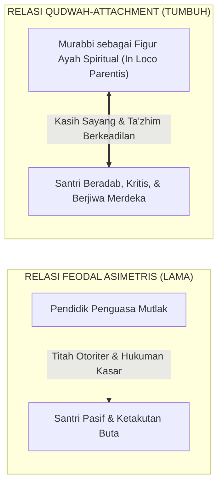

# P1-04-02: RELASI MURABBI DAN SANTRI: KETELADANAN QUDWAH DAN IHTIRAM TIMBAL-BALIK
## *Dekonstruksi Relasi Feodal-Otoriter, Rekonstruksi Ta'zhim Hakiki dalam Kitab KH. Hasyim Asy'ari, dan Konsep Secure Attachment*

**Nomor Identifikasi**: `P1-04-02/RELASI-EDUKATIF/2026`  
**Domain**: `01 Philosophy` > `04 Education`  
**Dewan Pakar**: `pakar-pedagogi-master-guru`, `pakar-filosofi-tumbuh`, `pakar-tata-kelola-qudwah`

---

## 📑 DAFTAR ISI ANALITIS

1. [1. Problem Feodalisme Relasi: Distorsi Makna Tawadhu' dan Ta'zhim](#1-problem-feodalisme-relasi-distorsi-makna-tawadhu-dan-tazhim)
2. [2. Khazanah Turats: Etika Relasi Murid-Guru dalam Kitab KH. Hasyim Asy'ari](#2-khazanah-turats-etika-relasi-murid-guru-dalam-kitab-kh-hasyim-asyari)
3. [3. Konsep Secure Attachment (John Bowlby) dalam Asrama Pesantren](#3-konsep-secure-attachment-john-bowlby-dalam-asrama-pesantren)
4. [4. Model Qudwah-Centered Leadership: Sayyidul Qawmi Khadimuhum](#4-model-qudwah-centered-leadership-sayyidul-qawmi-khadimuhum)
5. [5. Implikasi bagi Standar Interaksi Harian Guru-Santri](#5-implikasi-bagi-standar-interaksi-harian-guru-santri)

---

### 1. Problem Feodalisme Relasi: Distorsi Makna Tawadhu' dan Ta'zhim

Di sebagian pesantren tradisional, relasi antara pendidik (*kyai / ustadz / musyrif*) dan santri sering kali terdistorsi menjadi relasi kuasa yang asimetris dan feodalistik. Sikap hormat (*Ihtiram*) dan kerendahhatian (*Tawadhu'*) yang diajarkan oleh ulama salaf disalahpahami sebagai kepatuhan buta tanpa nalar, di mana santri diposisikan laksana "mayat di tangan orang yang memandikannya" (*ka al-mayyit bayna yaday al-ghassil*) dalam seluruh aspek kehidupan duniawi.

Distorsi ini melahirkan dua dampak buruk:
* **Santri bermental inferior (*learned helplessness*)**: Kehilangan daya kritis, takut bertanya, dan enggan mengambil inisiatif mandiri karena takut dicap kualat (*su'ul adab*).
* **Pendidik terperangkap dalam arogansi spiritual**: Merasa kebal dari kritik, menganggap kesalahan pendidik sebagai hal yang tabu dievaluasi, dan menjustifikasi perlakuan kasar dengan dalih "menguji kesabaran santri".

---

### 2. Khazanah Turats: Etika Relasi Guru-Santri dalam Adab al-'Alim wal Muta'allim

Hadhratusy Syaikh KH. M. Hasyim Asy'ari (1343 H / 1925 M) dalam *Adab al-'Alim wal Muta'allim* (hlm. 24–28) meletakkan fondasi etika relasi yang sangat indah dan memuliakan manusia. Seorang pendidik diwajibkan memperlakukan santrinya laksana anak kandungnya sendiri dalam kasih sayang:

> $$\text{يَنْبَغِي لِلْمُعَلِّمِ أَنْ يَقْصِدَ بِتَعْلِيمِهِ وَجْهَ اللَّهِ تَعَالَى، وَأَنْ يُعَامِلَ الْمُتَعَلِّمِينَ بِالرِّفْقِ وَالشَّفَقَةِ، وَأَنْ يُنْزِلَهُمْ مَنْزِلَةَ أَوْلَادِهِ فِي الْمَحَبَّةِ وَالْإِكْرَامِ، وَأَنْ يَصْبِرَ عَلَى جَفْوَتِهِمْ وَسُوءِ أَدَبِهِمْ فِي بَعْضِ الْأَحْوَالِ، وَيُرْشِدَهُمْ بِاللُّطْفِ لَا بِالْعُنْفِ}$$
> 
> *"Seyogianya bagi seorang guru berniat dalam mengajar semata-mata mengharap wajah Allah Ta'ala, dan **memperlakukan para muridnya dengan penuh kelembutan (*ar-Rifq*) dan belas kasih (*asy-Syafaqah*)**, serta mendudukkan para santri pada kedudukan anak kandungnya sendiri dalam hal kecintaan dan penghormatan. Hendaklah guru bersabar atas kekasaran dan kekhilafan adab mereka dalam beberapa keadaan, dan membimbing mereka dengan kelembutan (*al-Luthf*), bukan dengan kekerasan (*al-'Unf*)!"* (Hasyim Asy'ari, *Adab al-'Alim*, hlm. 25).

Wasiat KH. Hasyim Asy'ari di atas membuktikan bahwa kebesaran seorang guru di pesantren tidak diukur dari seberapa keras ia mampu memukul atau membentak santri, melainkan dari seberapa luas samudera kesabaran dan kelembutan kasih sayangnya dalam menuntun santri yang berbuat salah.

---

### 3. Konsep Secure Attachment dalam Asrama Pesantren

Dalam psikologi perkembangan modern, teori kelekatan aman (**Secure Attachment Theory** oleh John Bowlby, 1969; 1988) membuktikan bahwa anak yang terpisah dari orang tuanya membutuhkan figur pengganti orang tua yang aman (*In Loco Parentis*).

Ketika musyrif asrama mampu menghadirkan kelekatan yang aman (*secure base*):
* Santri merasa aman secara emosional (*Ventral Vagal Tone* stabil).
* Santri berani bereksplorasi belajar, tidak takut salah, dan terbuka menceritakan beban jiwanya kepada musyrif.
* Risiko santri melarikan diri (*kabur*) atau terjerumus dalam kelompok geng asrama menyimpang turun hingga mendekati nol.

---

### 4. Model Qudwah-Centered Leadership: Sayyidul Qawmi Khadimuhum

Ekosistem TUMBUH menegakkan kepemimpinan asatidz dan musyrif di atas hadits nabawi yang mulia:
$$\text{سَيِّدُ الْقَوْمِ خَادِمُهُمْ}$$
*"Pemimpin suatu kaum adalah pelayan bagi kaumnya."* (HR. Abu Nu'aim dalam *Hilyat al-Auliya'*).

Keteladanan (*Qudwah Hasanah*) adalah kurikulum hidup yang paling berpengaruh di pesantren:
* Musyrif yang ingin santrinya shalat berjamaah awal waktu harus hadir di shaf terdepan 15 menit sebelum adzan.
* Musyrif yang ingin santrinya menjaga kebersihan kamar harus ikut memegang sapu dan mencontohkan cara menyapu yang rapi.
* Musyrif yang ingin santrinya berbicara santun tidak boleh melontarkan kata-kata makian atau sarkasme di hadapan santri.

---

### 5. Implikasi bagi Standar Interaksi Harian Guru-Santri

1. **Eliminasi Budaya Intimidasi**: Menghapus seluruh bentuk hukuman fisik, pembentakan massal di aula, dan tatapan mata yang merendahkan.
2. **Keterbukaan Dialog Edukatif**: Membuka ruang tanya-jawab kritis dalam halaqah ilmiah tanpa santri merasa takut dianggap tidak sopan.
3. **Penegakan Ta'zhim Berbasis Cinta (*Respect through Love*)**: Menumbuhkan rasa hormat santri kepada kiai dan guru yang lahir dari kekaguman atas keluasan ilmu dan ketulusan akhlak guru, bukan rasa takut akan rotan atau sanksi.
