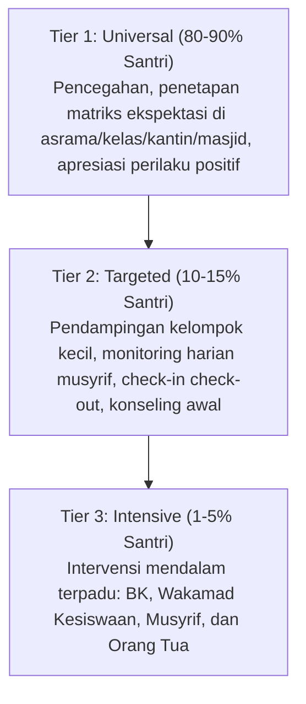

# P1-04-03-Paradigma-Disiplin-Restoratif-dan-PBIS

## Tujuan
Mendefinisikan pergeseran paradigma penanganan kedisiplinan di dunia pesantren: beralih dari model hukuman konvensional (*retributive punishment*) menuju model **Disiplin Restoratif** dan **Sistem Pendukung Perilaku Positif (PBIS)**.

---

## Landasan Sains Global: PBIS, Positive Discipline & Restorative Justice

Pergeseran ini ditopang oleh konsensus riset pedagogi dan behavioral global:
* **School-Wide PBIS (Horner & Sugai, 2015)**: Pendekatan sistemik multi-tier yang terbukti di lebih dari 27.000 institusi pendidikan dunia menurunkan angka pelanggaran sebesar 30–50% dan meningkatkan keamanan iklim belajar (*school climate*).
* **Positive Discipline (Jane Nelsen & Alfred Adler)**: Menegaskan prinsip *Firm and Kind*—menghormati kebutuhan situasi dengan ketegasan aturan, dan menghormati martabat santri dengan kehangatan relasi.
* **Restorative Justice in Education (Howard Zehr, 2002; Brenda Morrison, 2007)**: Mengalihkan fokus dari "menghukum pelanggar" menjadi "memulihkan kerugian, menyembuhkan hubungan sosial, dan melatih tanggung jawab nyata".
* **Visible Learning Meta-Analysis (John Hattie, 2009)**: Membuktikan bahwa kualitas hubungan pendidik-siswa memiliki *effect size* tinggi ($d = 0.72$) terhadap keberhasilan karakter dan belajar, jauh melampaui efektivitas sanksi hukuman.

---

## Perbandingan Paradigma: Hukuman vs Disiplin Restoratif

| Dimensi | Paradigma Lama (Hukuman / Punitive) | Paradigma Baru TUMBUH (Disiplin Restoratif & PBIS) |
| :--- | :--- | :--- |
| **Pertanyaan Inti** | *"Siapa yang salah dan hukuman apa yang membuatnya jera?"* | *"Kebutuhan apa yang memicu pelanggaran, siapa yang terdampak, dan bagaimana cara memulihkannya?"* |
| **Fokus Waktu** | Masa lalu (membalas perbuatan salah). | Masa depan (pembelajaran, perbaikan, dan pencegahan). |
| **Bentuk Respon** | Hukuman acak / fisik (contoh: telat sholat → push up / lari keliling lapangan). | Konsekuensi logis & edukatif (contoh: mengotori kamar → membersihkan kamar & latihan disiplin waktu). |
| **Dampak Mental** | Melahirkan 4R: *Resentment* (dendam), *Rebellion* (pemberontakan), *Revenge* (balas dendam pada adik kelas), *Retreat* (minder/berbohong). | Membangun *Responsibility* (tanggung jawab), *Self-Regulation*, dan pemulihan relasi persaudaraan. |
| **Pengelolaan Data** | Insidental, reaktif, menunggu kasus besar meledak. | Sistemik (PBIS), berbasis data titik rawan/waktu, preventif. |

---

## Integrasi PBIS: Intervensi Berjenjang di Pesantren

1. **Tier 1 (Universal Support - 80-90%)**:
   - Menetapkan matriks ekspektasi perilaku secara jelas untuk seluruh area pondok (contoh: ekspektasi di asrama, masjid, kantin, kelas).
   - Melatih perilaku tersebut secara eksplisit, bukan berasumsi santri otomatis tahu.
2. **Tier 2 (Targeted Support - 10-15%)**:
   - Memberikan dukungan tambahan bagi santri yang mulai menunjukkan kesulitan adaptasi atau pelanggaran berulang minor.
3. **Tier 3 (Intensive Support - 1-5%)**:
   - Penanganan kasus khusus atau pelanggaran berat dengan rencana intervensi individual komprehensif tanpa mengorbankan masa depan santri.

---

## Siklus Dialog Restoratif (Restorative Chat)

Ketika terjadi pelanggaran, musyrif atau pembina menjalankan 5 langkah siklus:
1. **Pause**: Berhenti sejenak, mengendalikan emosi pembina, mendengarkan dengan tenang.
2. **Pahami**: Menggali akar penyebab (apakah lelah, konflik teman, atau masalah keluarga?).
3. **Dialog**: Mengajak santri merefleksikan dampak perbuatannya bagi diri dan orang lain.
4. **Perbaikan**: Menetapkan kesepakatan konsekuensi logis untuk memulihkan keadaan.
5. **Monitoring & Penguatan**: Mendampingi pelaksanaan perbaikan dan memberi apresiasi atas komitmen santri.
