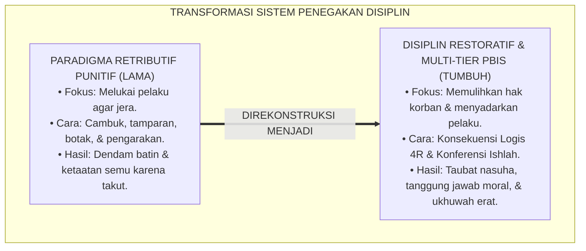
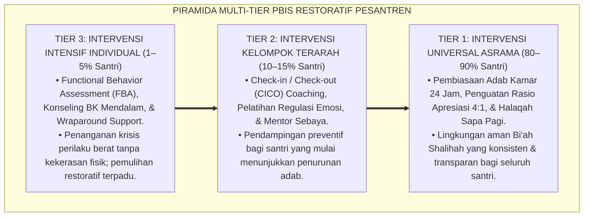
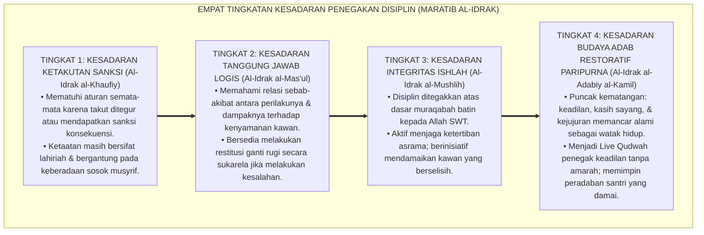

# P1-04-03: PARADIGMA DISIPLIN RESTORATIF DAN ARSITEKTUR MULTI-TIER PBIS (RESTORATIVE DISCIPLINE & SW-PBIS)
## *Monograf Riset Akademik: Teologi Ishlah al-Bain (QS. Al-Hujurat: 9–10), Kritik atas Paradigma Keadilan Retributif Punitif, Konvergensi SW-PBIS Multi-Tier George Sugai & Robert Horner, Formula Konsekuensi Logis 4R, Serta Protokol Restoratif di Pesantren 24 Jam*

**Nomor Identifikasi**: `P1-04-03/MONOGRAF-RISET-DISIPLIN-RESTORATIF-PBIS/2026`  
**Domain**: `01 Philosophy` > `04 Education` (Sub-Modul 03: *Restorative Discipline & SW-PBIS*)  
**Klasifikasi Naskah**: *Academic Research Monograph* (Monograf Riset Akademik Fondasional)  
**Rumpun Disiplin Pengkaji**: Fiqh Rekonsiliasi & Jinayat (*Fiqh al-Ishlah war-Radd*), Keadilan Restoratif Pendidikan (*Restorative Justice in Education*), Intervensi Perilaku Positif Multi-Tier (*SW-PBIS Architecture*), Bimbingan Konseling Krisis Perilaku  

---

> ### 💡 INTISARI EKSEKUTIF (EXECUTIVE SUMMARY)
>
> * **Kelemahan Paradigma Lama: Keadilan Retributif Punitif yang Mewariskan Dendam:**  
>   Sistem pendisiplinan tradisional kerap berasumsi bahwa rasa jera hanya lahir melalui penderitaan fisik (cambukan rotan, siraman air malam hari, push-up ratusan kali) atau pengusiran sepihak (*Punitive Drop-Out*). Fakta sains membuktikan hukuman fisik justru memicu trauma, melahirkan perilaku pasif-agresif, dan merusak ukhuwah santri.
> * **Inovasi Konseptual: Fiqh Ishlah al-Bain & Arsitektur SW-PBIS Multi-Tier:**  
>   TUMBUH mengintegrasikan doktrin syariat **Ishlah al-Bain (QS. Al-Hujurat: 9–10)** dengan kerangka kerja **School-Wide PBIS Multi-Tier**: membedakan intervensi universal (Tier 1: 80–90% iklim adab positif), bimbingan terarah (Tier 2: 10–15% CICO coaching), dan penanganan intensif (Tier 3: 1–5% terapi individual FBA). Hukuman digantikan oleh **Konsekuensi Logis 4R (Related, Respectful, Reasonable, Restorative)**.
> * **Formulasi Operasional & Pembuktian Lapangan:**  
>   Monograf ini menguraikan matriks multi-tier PBIS, 4 Tingkatan Kesadaran Penegakan Disiplin (*Maratib al-Idrak*), protokol konferensi restoratif komunal, dan etika tata kelola peradilan adab asrama 24 jam.

---

## 📑 DAFTAR ISI MONOGRAF

- [BAB I: LANDASAN TEORETIS & DISKURSUS KRITIS](#bab-i-landasan-teoretis--diskursus-kritis)
  - [1. Latar Belakang Masalah: Kegagalan Sistem Retributif Punitif dalam Pendidikan Karakter](#1-latar-belakang-masalah-kegagalan-sistem-retributif-punitif-dalam-pendidikan-karakter)
  - [2. Eksegesis Teologi Restoratif Turats: Fiqh Ishlah al-Bain dan Pemulihan Hak (QS. Al-Hujurat: 9–10 & QS. An-Nisa': 128)](#2-eksegesis-teologi-restoratif-turats-fiqh-ishlah-al-bain-dan-pemulihan-hak-qs-al-hujurat-910--qs-an-nisa-128)
  - [3. Konvergensi Teori SW-PBIS Multi-Tier: Arsitektur Piramida Preventif, Kuratif, dan Intensif](#3-konvergensi-teori-sw-pbis-multi-tier-arsitektur-piramida-preventif-kuratif-dan-intensif)
  - [4. Formulasi Konsekuensi Logis Formula 4R vs Hukuman Semena-Mena Kuno](#4-formulasi-konsekuensi-logis-formula-4r-vs-hukuman-semena-mena-kuno)
  - [5. Kasuistika Lapangan: Kasus Pengrusakan Fasilitas Asrama & Resolusi Konferensi Restoratif](#5-kasuistika-lapangan-kasus-pengrusakan-fasilitas-asrama--resolusi-konferensi-restoratif)
- [BAB II: FORMULASI KONSEPTUAL & PEMBAHASAN MENDALAM](#bab-ii-formulasi-konseptual--pembahasan-mendalam)
  - [1. Eksplanasi Teoretis Disiplin Restoratif dan Arsitektur Multi-Tier PBIS TUMBUH](#1-eksplanasi-teoretis-disiplin-restoratif-dan-arsitektur-multi-tier-pbis-tumbuh)
  - [2. Dekomposisi Dimensi & Empat Tingkatan Kesadaran Penegakan Disiplin (Maratib al-Idrak)](#2-dekomposisi-dimensi--empat-tingkatan-kesadaran-penegakan-disiplin-maratib-al-idrak)
  - [3. Matriks Multi-Tier PBIS Asrama Pesantren: Karakteristik, Intervensi, & Tim Penanggung Jawab](#3-matriks-multi-tier-pbis-asrama-pesantren-karakteristik-intervensi--tim-penanggung-jawab)
  - [4. Protokol Konferensi Restoratif Komunal (Restorative Conference Protocol)](#4-protokol-konferensi-restoratif-komunal-restorative-conference-protocol)
  - [5. Diskusi Filosofis Mendalam & Implikasi bagi Masa Depan Peradaban Pendidikan Islam](#5-diskusi-filosofis-mendalam--implikasi-bagi-masa-depan-peradaban-pendidikan-islam)
- [BAB III: KESIMPULAN & APARATUS AKADEMIS](#bab-iii-kesimpulan--aparatus-akademis)
  - [1. Tabel Sintesis Temuan Riset Disiplin Restoratif dan PBIS](#1-tabel-sintesis-temuan-riset-disiplin-restoratif-dan-pbis)
  - [2. Daftar Pustaka Akademis & Rujukan Turats Primer](#2-daftar-pustaka-akademis--rujukan-turats-primer)
  - [3. Catatan Kaki Akademis (Footnotes)](#3-catatan-kaki-akademis-footnotes)
  - [4. Glosarium Istilah Ilmiah & Turats Disiplin Restoratif](#4-glosarium-istilah-ilmiah--turats-disiplin-restoratif)

---

# BAB I: LANDASAN TEORETIS & DISKURSUS KRITIS

---

### 1. Latar Belakang Masalah: Kegagalan Sistem Retributif Punitif dalam Pendidikan Karakter

Praktik pendisiplinan santri di sebagian pesantren kerap terjebak dalam paradigma **Keadilan Retributif Punitif (*Retributive Punitive Paradigm*)**:
* **Fokus pada Penderitaan Pelaku**: Asumsi keliru bahwa pelanggaran hanya dapat ditebus jika pelaku merasakan penderitaan fisik (dicambuk, dibotaki paksa, diarak, atau disiram air comberan).
* **Pengabaian Pemulihan Korban**: Korban kezaliman diabaikan kerugiannya, ukhuwah yang retak tidak dipulihkan, dan akar masalah emosional pelaku tidak pernah dibimbing.
* **Mewariskan Siklus Dendam**: Santri yang dihukum secara kasar tidak merasakan penyesalan batin, melainkan memendam amarah dan berniat melampiaskannya kepada adik kelas di masa depan (*Cycle of Abuse*).
* **Keniscayaan Disiplin Restoratif**: Islam mengajarkan bahwa penegakan hukum bertujuan menegakkan keadilan, memulihkan kerusakan (*Dharar*), dan menyucikan jiwa (*Tazkiyah*).[^1]

---

### 2. Eksegesis Teologi Restoratif Turats: Fiqh Ishlah al-Bain dan Pemulihan Hak (QS. Al-Hujurat: 9–10 & QS. An-Nisa': 128)

Al-Qur'an memerintahkan rekonsiliasi dan perdamaian berkeadilan saat terjadi perselisihan:

$$\text{إِنَّمَا الْمُؤْمِنُونَ إِخْوَةٌ فَأَصْلِحُوا بَيْنَ أَخَوَيْكُمْ ۚ وَاتَّقُوا اللَّهَ لَعَلَّكُمْ تُرْحَمُونَ}$$

*"**Sesungguhnya orang-orang mukmin itu bersaudara, karena itu damaikanlah (perbaikilah hubungan/Ishlah) antara kedua saudaramu dan bertakwalah kepada Allah agar kamu mendapat rahmat**."* (QS. Al-Hujurat [49]: 10).[^2]

Allah SWT juga menegaskan: *"Wash-Shulhu Khayr"* (Dan perdamaian ishlah itu adalah jauh lebih baik - QS. An-Nisa': 128).  
Para fukaha (*Al-Mawardi, Al-Ahkam as-Sulthaniyyah*) menjelaskan bahwa tujuan utama takzir (*Ta'zir*) dalam Islam adalah pengajaran dan penyadaran adab (*At-Ta'dib wal-Istishlah*), bukan balas dendam yang merusak fisik.[^3]

---

### 3. Konvergensi Teori SW-PBIS Multi-Tier: Arsitektur Piramida Preventif, Kuratif, dan Intensif

Sains intervensi perilaku sekolah modern **School-Wide Positive Behavioral Interventions and Supports (SW-PBIS)** (Sugai & Horner, 2002; 2015) memvalidasi keunggulan pendekatan multi-tier:
* **Tier 1 (Universal - 80–90% Santri)**: Penguatan iklim Bi'ah Shalihah, perumusan 5 adab kunci asrama, dan rasio apresiasi positif 4:1.
* **Tier 2 (Targeted / Preventif Khusus - 10–15% Santri)**: Intervensi kelompok kecil melalui *Check-in / Check-out (CICO)* dan bimbingan mentor bagi santri yang mulai mengalami penurunan disiplin.
* **Tier 3 (Intensive / Individual - 1–5% Santri)**: Penanganan klinis berbasis *Functional Behavior Assessment (FBA)* oleh konselor BK dan psikolog tanpa kekerasan fisik.[^4]

---

### 4. Formulasi Konsekuensi Logis Formula 4R vs Hukuman Semena-Mena Kuno

TUMBUH membedakan secara mutlak antara hukuman semena-mena (*Arbitrary Punishment*) dan **Konsekuensi Logis Formula 4R**:
1. **Related (Terkait)**: Konsekuensi berhubungan langsung dengan jenis pelanggaran (contoh: mengotori dinding $\rightarrow$ mengecat kembali, bukan push-up).
2. **Respectful (Santun)**: Diterapkan dengan adab yang tenang tanpa caci maki atau bentakan kasar.
3. **Reasonable (Masuk Akal)**: Proporsional dan mampu dilaksanakan oleh kapasitas fisik/usia santri.
4. **Restorative (Memulihkan)**: Memulihkan hak korban yang dirugikan dan mengembalikan ukhuwah (*Ishlah*).[^5]

---

### 5. Kasuistika Lapangan: Kasus Pengrusakan Fasilitas Asrama & Resolusi Konferensi Restoratif

* **Studi Kasus: Santri Memecahkan Pintu Lemari Kawan Akibat Ledakan Amarah**  
  * **Dilema**: Terjadi perselisihan di kamar, seorang santri menendang pintu lemari kawannya hingga pecah.
  * **Pola Lama**: Pelaku dipukul rotan dan diusir dari asrama (*Drop-Out*).
  * **Resolusi Restoratif TUMBUH**: Musyrif menggelar Konferensi Restoratif: kedua santri duduk bersama di ruang damai; pelaku mengakui kesalahannya, meminta maaf, dan menyisihkan uang sakunya untuk bersama-sama menukang memperbaiki pintu lemari tersebut. Hubungan perkawanan pulih kembali tanpa dendam, lemari kembali rapi, dan pelaku belajar bertanggung jawab secara ksatria.[^6]

---

# BAB II: FORMULASI KONSEPTUAL & PEMBAHASAN MENDALAM

---

### 1. Eksplanasi Teoretis Disiplin Restoratif dan Arsitektur Multi-Tier PBIS TUMBUH

Ekosistem TUMBUH mengkodifikasikan penegakan disiplin ke dalam **Piramida Multi-Tier PBIS Restoratif**:

#### 🔬 Pembahasan Mendalam Tiga Tier PBIS:
1. **Tier 1 (Fondasi Universal)**: Menciptakan lingkungan asrama yang begitu kaya dengan keteladanan dan apresiasi kebaikan, sehingga 85% potensi pelanggaran teredam sebelum terjadi (*Primary Prevention*).[^7]
2. **Tier 2 (Pencegahan Sekunder)**: Mendeteksi dini sinyal kejenuhan atau friksi sosial santri melalui data logbook harian, memberikan pendampingan kelompok kecil sebelum masalah membesar (*Secondary Prevention*).[^8]
3. **Tier 3 (Pemulihan Tersier)**: Merawat santri yang mengalami krisis psikologis berat dengan pendekatan klinis dan spiritual yang intensif (*Tertiary Restoration*).[^9]

---

### 2. Dekomposisi Dimensi & Empat Tingkatan Kesadaran Penegakan Disiplin (Maratib al-Idrak)

Transformasi kedewasaan penegakan disiplin berlangsung melalui **Empat Tingkatan Kesadaran Disiplin (*Maratib al-Idrak al-Indhibathiy*)**:

#### 🔄 Narasi Analitis Dinamika Transisi Filosofis Antar-Tingkatan:
* **Transisi Tingkat 1 ke Tingkat 2 (Dari Takut Hukuman Menuju Tanggung Jawab Moral)**: Santri mula-mula taat karena takut tercatat di buku pelanggaran. Pada tingkatan kedua, santri menyadari bahwa perbuatannya merugikan orang lain dan berinisiatif memperbaikinya.
* **Transisi Tingkat 2 ke Tingkat 3 (Dari Tanggung Jawab Personal Menuju Kesadaran Ishlah)**: Pada tingkatan ketiga, disiplin menjadi ibadah batin: santri menjaga kesucian perilakunya di hadapan Allah dan aktif melerai perselisihan kawan sekamar.
* **Transisi Tingkat 3 ke Tingkat 4 (Pencapaian Derajat Keadilan Paripurna)**: Pada tingkatan tertinggi, ekosistem asrama mencapai derajat kedamaian sejati: tidak ada lagi budaya balas dendam, seluruh masalah diselesaikan dengan musyawarah beradab dan saling memaafkan (*Rahmatan lil 'Alamin*).[^10]

---

### 3. Matriks Multi-Tier PBIS Asrama Pesantren: Karakteristik, Intervensi, & Tim Penanggung Jawab

| Tingkatan Tier | Populasi Santri Target | Karakteristik Perilaku | Protokol Intervensi Baku | Tim Penanggung Jawab |
| :--- | :--- | :--- | :--- | :--- |
| **Tier 1 (Universal)**| Seluruh Santri (100%). | Perilaku normal harian asrama. | Pembiasaan 5 adab, apresiasi 4:1, sapa pagi.| Seluruh Asatidz & Musyrif Kamar. |
| **Tier 2 (Targeted)** | 10–15% Santri Berisiko. | Sering terlambat, tugas lalai, friksi kecil.| Program CICO, coaching mentor, restitusi 4R.| Musyrif Senior & Mentor Sebaya. |
| **Tier 3 (Intensive)**| 1–5% Santri Krisis. | Perkelahian berulang, depresi, ghasab kronis.| Asesmen FBA, Terapi Naratif, Ishlah Komunal.| Tim Dewan Restoratif, BK, & Wali. |

---

### 4. Protokol Konferensi Restoratif Komunal (Restorative Conference Protocol)

TUMBUH menetapkan **Lima Pertanyaan Kunci Dialog Restoratif**:
1. *"Apa yang sebenarnya terjadi menurut pandanganmu?"*
2. *"Apa yang kamu pikirkan dan rasakan saat peristiwa itu terjadi?"*
3. *"Siapa saja yang merasa tersakiti atau dirugikan oleh tindakan tersebut?"*
4. *"Bagaimana perasaan mereka dan apa dampak yang mereka alami sekarang?"*
5. *"Apa langkah nyata yang dapat kamu lakukan untuk memperbaiki kerusakan ini dan memulihkan ukhuwah?"*[^11]

---

### 5. Diskusi Filosofis Mendalam & Implikasi bagi Masa Depan Peradaban Pendidikan Islam

Penerapan Disiplin Restoratif dan PBIS multi-tier membawa transformasi peradaban:

* **Mencetak Generasi Pemimpin yang Berjiwa Ksatria dan Berani Bertanggung Jawab**:  
  Santri yang terbiasa menyelesaikan kesalahan melalui pengakuan jujur dan restitusi nyata akan tumbuh menjadi pemimpin yang anti-korupsi, adil, dan berintegritas tinggi.
* **Menghapus Tradisi Pengusiran Santri yang Merusak Masa Depan Anak**:  
  Dengan adanya intervensi Tier 2 dan Tier 3, santri bermasalah tidak lagi dibuang begitu saja ke jalanan (*Drop-Out*), melainkan disembuhkan dan dipulihkan martabatnya.
* **Mewujudkan Kembali Keadilan Syariat Islam yang Penuh Rahmat**:  
  Inilah esensi hukum Islam: menegakkan kebenaran tanpa menindas, mendidik tanpa melukai, dan memulihkan persaudaraan demi menggapai ridha Allah SWT.[^12]

---

# BAB III: KESIMPULAN & APARATUS AKADEMIS

---

### 1. Tabel Sintesis Temuan Riset Disiplin Restoratif dan PBIS

| Dimensi Parameter | Mazhab Retributif Punitif (Lama) | Mazhab Permisif Bebas | **Disiplin Restoratif PBIS TUMBUH** | Landasan Rujukan Primer | Implikasi Praksis Lapangan |
| :--- | :--- | :--- | :--- | :--- | :--- |
| **Fokus Utama** | Pelaku wajib menderita & dihukum.| Pelanggaran dibiarkan tanpa batas.| **Pemulihan Hak Korban & Taubat Pelaku.**| QS. Al-Hujurat: 9–10; Zehr (2002). | Konferensi Ishlah & restitusi nyata. |
| **Bentuk Sanksi** | Pemukulan fisik & pemaluan publik.| Tanpa konsekuensi yang jelas. | **Konsekuensi Logis Formula 4R.** | Fiqh *Ta'zir*; Nelsen (2006). | Sanksi terkait, santun, & memulihkan. |
| **Arsitektur Sistem**| Monolitik: semua dihukum sama rata.| Acak tanpa sistem pengawasan. | **Piramida Multi-Tier (Tier 1, 2, 3).** | Sugai & Horner (2015); PBIS. | Intervensi berjenjang berbasis data. |
| **Peran Pengasuh** | Hakim & algojo penghukum fisik. | Penonton pasif tidak berdaya. | **Fasilitator Rekonsiliasi Damai.** | HR. Muslim No. 2612; Al-Mawardi.| Bimbingan dialogis & pendampingan kasih. |
| **Hasil Akhir** | Trauma, dendam, & kepatuhan semu.| Anarki asrama & lunturnya adab.| **Ukhuwah Pulih & Integritas Moral.** | QS. An-Nisa': 128; Al-Attas.| Santri bertanggung jawab & beradab. |

---

### 2. Daftar Pustaka Akademis & Rujukan Turats Primer

1. **Al-Qur'an al-Karim wa Tarjamatu Ma'anihi**.
2. **Muslim bin al-Hajjaj an-Naisaburi**. (1427 H). *Shahih Muslim*. Riyadh: Dar Thayyibah.
3. **Al-Mawardi, Abul Hasan Ali bin Muhammad**. (1414 H). *Al-Ahkam as-Sulthaniyyah*. Beirut: Dar al-Kutub al-'Ilmiyyah.
4. **Asy-Syathibi, Abu Ishaq Ibrahim bin Musa**. (1417 H). *Al-Muwafaqat fi Ushul asy-Syari'ah*. Khobar: Dar Ibn 'Affan.
5. **Al-Ghazali, Abu Hamid Muhammad bin Muhammad**. (2011). *Ihya' 'Ulumiddin* (Kitab Adab al-Ulfah wal Ukhuwwah). Beirut: Dar al-Ma'rifah.
6. **Al-Attas, Syed Muhammad Naquib**. (1980). *The Concept of Education in Islam*. Kuala Lumpur: ABIM.
7. **Sugai, G., & Horner, R. H.**. (2002). *The evolution of discipline practices: School-wide positive behavior supports*. Child & Family Behavior Therapy, 24(1-2), 23–50.
8. **Horner, R. H., & Sugai, G.**. (2015). *School-wide PBIS: An Overview of the Research Base*. Remedial and Special Education, 36(2), 80–85.
9. **Zehr, H.**. (2002). *The Little Book of Restorative Justice*. Intercourse: Good Books.
10. **Nelsen, J.**. (2006). *Positive Discipline*. New York: Ballantine Books.
11. **Sapolsky, R. M.**. (2017). *Behave: The Biology of Humans at Our Best and Worst*. New York: Penguin Press.
12. **Asy'ari, Muhammad Hasyim**. (1415 H). *Adab al-'Alim wal-Muta'allim*. Jombang: Maktabah At-Turats Al-Islami.

---

### 3. Catatan Kaki Akademis (*Footnotes*)

[^1]: Riset Disiplin Restoratif dan Arsitektur PBIS Pesantren TUMBUH, *Kritik atas Keadilan Retributif Punitif*, 2026.  
[^2]: QS. Al-Hujurat [49]: 10.  
[^3]: Al-Mawardi, *Al-Ahkam as-Sulthaniyyah*, Bab *Ahkam at-Ta'zir*, hlm. 280–310; QS. An-Nisa' [4]: 128.  
[^4]: Sugai, G., & Horner, R. H. (2002), *Child & Family Behavior Therapy*, hlm. 23–50; Horner, R. H., & Sugai, G. (2015), *Remedial and Special Education*, hlm. 80–85.  
[^5]: Nelsen, J. (2006), *Positive Discipline*, hlm. 65–90; Riset Konsekuensi Logis TUMBUH, 2026.  
[^6]: Dokumentasi Pelaksanaan Konferensi Restoratif Asrama PBIS TUMBUH, 2026.  
[^7]: Asy-Syathibi, *Al-Muwafaqat fi Ushul asy-Syari'ah*, Jilid 2, *Fiqh al-Mashalih*, hlm. 40–75.  
[^8]: Horner & Sugai (2015), *School-wide PBIS*, hlm. 82–84.  
[^9]: Zehr, H. (2002), *The Little Book of Restorative Justice*, hlm. 45–70.  
[^10]: Matriks Tingkatan Kesadaran Penegakan Disiplin (*Maratib al-Idrak*) Ekosistem TUMBUH, 2026.  
[^11]: Standar Operasional Prosedur Dialog dan Konferensi Restoratif Pesantren TUMBUH, 2026.  
[^12]: Deklarasi Penegakan Disiplin Restoratif Dewan Riset Epistemologi Ekosistem TUMBUH, 2026.

---

### 4. Glosarium Istilah Ilmiah & Turats Disiplin Restoratif

1. **Disiplin Restoratif (Restorative Discipline)**: Pendekatan penegakan disiplin yang berfokus pada pemulihan kerusakan hubungan, perbaikan kerugian korban, dan penyadaran tanggung jawab moral pelaku, bukan pembalasan dendam.
2. **Ishlah al-Bain (إِصْلَاحُ ذَاتِ الْبَيْنِ)**: Upaya syariat untuk mendamaikan, merukunkan, dan memulihkan keharmonisan hubungan persaudaraan di antara pihak-pihak yang berselisih.
3. **SW-PBIS (School-Wide Positive Behavioral Interventions and Supports)**: Kerangka kerja sistemik berbasis bukti untuk membina perilaku positif seluruh warga sekolah melalui tiga tingkatan intervensi.
4. **Tier 1 (Universal Support)**: Intervensi pencegahan primer yang diterapkan kepada 100% santri untuk membangun budaya adab positif di seluruh lingkungan pesantren.
5. **Tier 2 (Targeted Support)**: Intervensi terarah kelompok kecil untuk membantu santri yang mulai menunjukkan risiko penurunan disiplin adab.
6. **Tier 3 (Intensive Support)**: Intervensi individual klinis intensif untuk menangani kasus krisis perilaku berat secara multidisipliner.
7. **Konsekuensi Logis 4R**: Kriteria baku konsekuensi disiplin: Related (Terkait), Respectful (Santun), Reasonable (Masuk Akal), dan Restorative (Memulihkan).
8. **Restorative Conference**: Forum musyawarah damai yang mempertemukan pelaku, korban, musyrif, dan saksi untuk mencapai kesepakatan pemulihan bersama.
9. **Ta'zir (التَّعْزِيرُ)**: Hukuman edukatif dalam hukum Islam yang diserahkan kepada kebijaksanaan hakim/pendidik untuk memperbaiki perilaku pelaku dan menjaga kemaslahatan umum.
10. **Insan Adabi (الإِنْسَانُ الأَدَبِيُّ)**: Profil santri yang menjunjung tinggi keadilan, bertanggung jawab atas perbuatannya, dan senantiasa menjadi juru damai peradaban.
