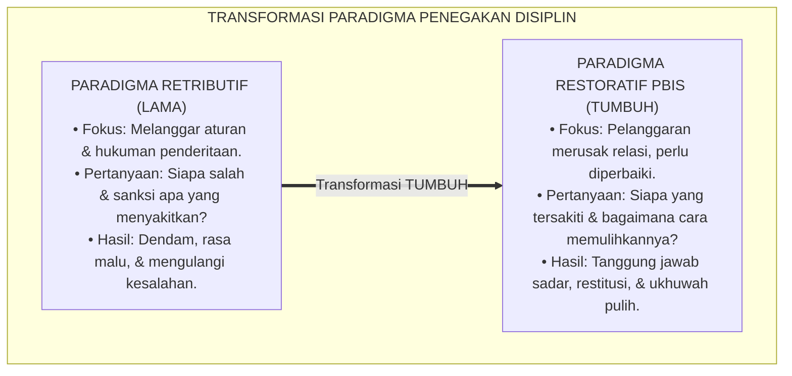
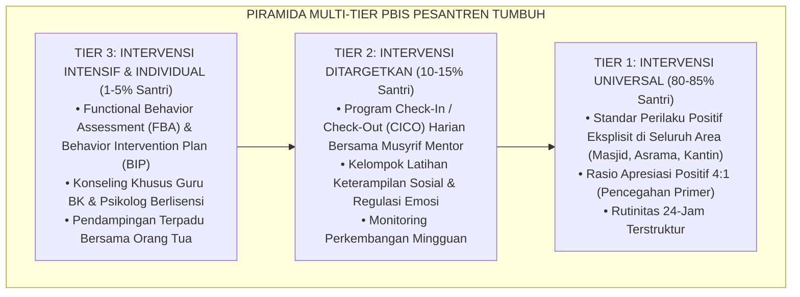
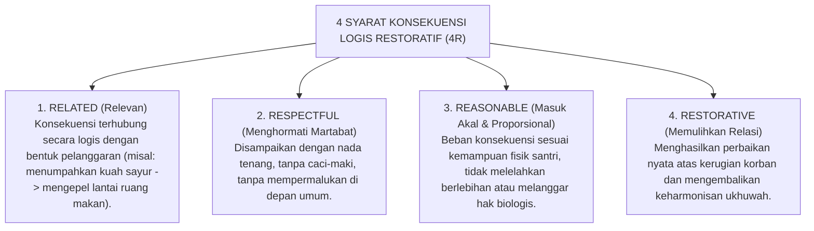

# P1-04-03: PARADIGMA DISIPLIN RESTORATIF DAN PBIS MULTI-TIER
## *Transformasi Sistem Penegakan Perilaku: Dari Retributif-Hukuman Menuju Intervensi Berbasis Bukti dan Pemulihan Relasi Islami*

**Nomor Identifikasi**: `P1-04-03/DISIPLIN-RESTORATIF-PBIS/2026`  
**Domain**: `01 Philosophy` > `04 Education`  
**Dewan Pakar**: `pakar-arsitektur-pbis-restoratif`, `pakar-disiplin-positif`, `pakar-kuratif-restoratif`

---

## 📑 DAFTAR ISI ANALITIS

1. [1. Kegagalan Paradigma Disiplin Retributif (Hukum Balas Dendam)](#1-kegagalan-paradigma-disiplin-retributif-hukum-balas-dendam)
2. [2. Arsitektur Positive Behavioral Interventions and Supports (SW-PBIS)](#2-arsitektur-positive-behavioral-interventions-and-supports-sw-pbis)
3. [3. Prinsip Disiplin Restoratif: Menjadikan Kesalahan sebagai Peluang Belajar](#3-prinsip-disiplin-restoratif-menjadikan-kesalahan-sebagai-peluang-belajar)
4. [4. Integrasi Fiqhiyyah Restoratif: Ishlah al-Bain dan Ta'widh](#4-integrasi-fiqhiyyah-restoratif-ishlah-al-bain-dan-tawidh)
5. [5. Empat Prinsip Konsekuensi Logis Restoratif (4R)](#5-empat-prinsip-konsekuensi-logis-restoratif-4r)

---

### 1. Kegagalan Paradigma Disiplin Retributif (Hukum Balas Dendam)

Sistem disiplin konvensional di banyak pesantren beroperasi di atas logika retributif: *"Siapa yang melanggar harus merasakan penderitaan fisik atau malu yang setimpal."* Pertanyaan yang diajukan oleh pengurus selalu berorientasi masa lalu:
1. Aturan apa yang dilanggar?
2. Siapa yang bersalah?
3. Hukuman apa yang pantas dijatuhkan untuk membuatnya jera?

Logika retributif ini terbukti gagal secara ilmiah dan syar'i: ia melahirkan rasa dendam, melatih santri menjadi pembohong ulung demi menghindari sanksi, dan memutus hubungan ukhuwah antara korban dan pelaku.

Ekosistem TUMBUH mengganti logika retributif ini dengan **Paradigma Disiplin Restoratif (*Restorative Justice in Education*)** dan **School-Wide PBIS Multi-Tier**:

---

### 2. Arsitektur Positive Behavioral Interventions and Supports (SW-PBIS)

Merujuk pada konsensus sains perilaku internasional (Sugai & Horner, 2002; 2006), ekosistem TUMBUH membagi struktur pembinaan perilaku ke dalam **Sistem Piramida Tiga Tingkat (Multi-Tier PBIS)**:

---

### 3. Prinsip Disiplin Restoratif: Kesalahan sebagai Peluang Belajar

Dalam disiplin restoratif, pelanggaran tidak dipandang sebagai "aib yang harus dibasmi", melainkan sebagai **indikasi adanya keterampilan adab yang belum tuntas dipelajari (*unmet skill / learning opportunity*)**. 

Tugas pendidik adalah membimbing santri melalui **Lima Pertanyaan Restoratif (*Restorative Inquiry*)**:
1. *Apa yang sebenarnya terjadi?* (Mendengarkan fakta tanpa menghakimi).
2. *Apa yang antum pikirkan dan rasakan saat peristiwa itu terjadi?* (Refleksi kesadaran emosi).
3. *Siapa saja yang terdampak dan dirugikan oleh tindakan antum tadi?* (Menumbuhkan empati pada korban).
4. *Bagaimana perasaan antum sekarang setelah melihat dampaknya?* (Muhasabah batin).
5. *Apa yang bisa antum lakukan secara nyata untuk memperbaiki kerusakan dan memulihkan hubungan baik dengan rekan antum?* (Tanggung jawab restitusi).

---

### 4. Integrasi Fiqhiyyah Restoratif: Ishlah al-Bain dan Ta'widh

Paradigma restoratif modern ini sesungguhnya adalah intisari dari ajaran Fiqh Jinayat dan Mu'amalat Islam:
* **Ishlah al-Bain (إِصْلَاحُ ذَاتِ الْبَيْنِ - Rekonsiliasi Ukhuwah)**: Allah SWT berfirman: *"Sesungguhnya orang-orang mukmin itu bersaudara, karena itu damaikanlah antara kedua saudaramu (*fa ashlihu bayna akhawaykum*)"* (QS. Al-Hujurat: 10).
* **Ta'widh & Radd al-Madhalim (Ganti Rugi & Pengembalian Hak Terzalimi)**: Pelaku yang merusak barang temannya tidak dihukum cambuk atau dicukur gundul, melainkan diwajibkan mengganti barang tersebut atau memperbaikinya hingga utuh kembali (*Daman al-Mutlafat*).

---

### 5. Empat Prinsip Konsekuensi Logis Restoratif (4R)

Setiap konsekuensi disiplin yang dijatuhkan di pesantren TUMBUH wajib memenuhi kriteria **4R**:

