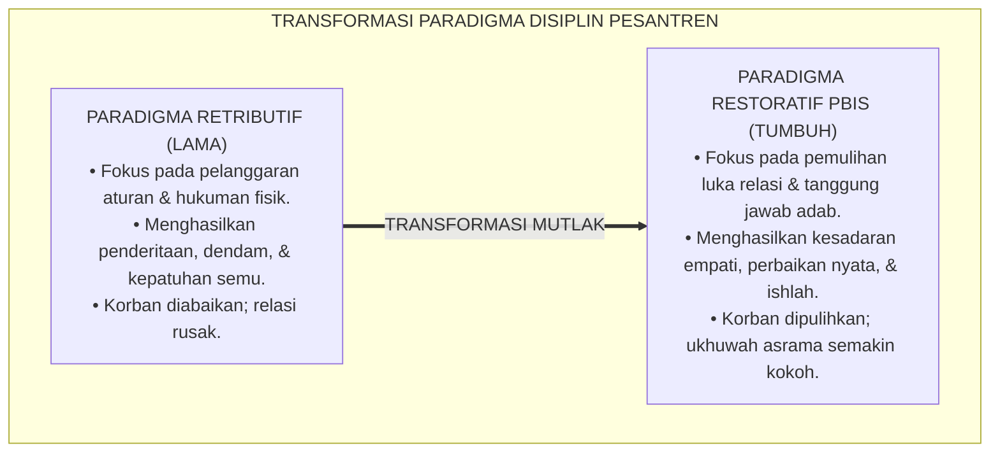
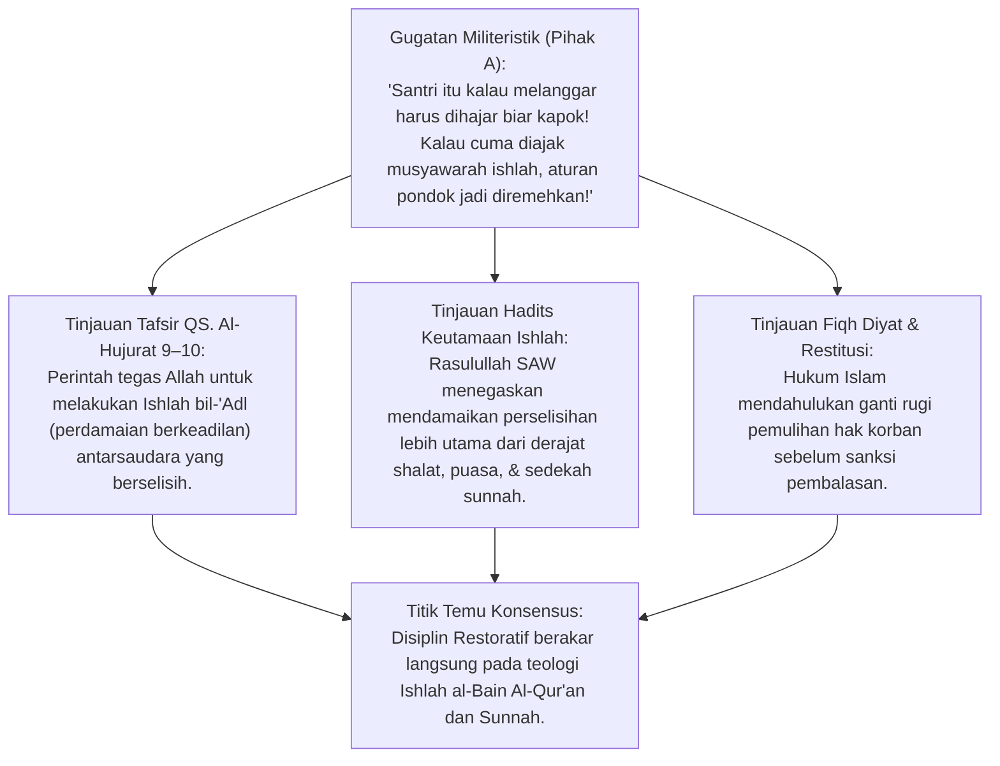
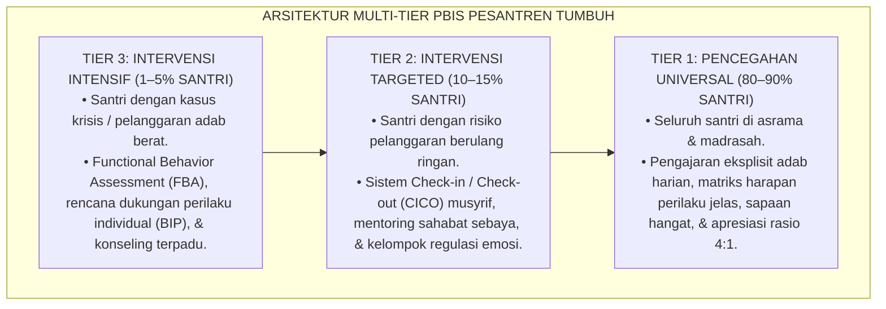
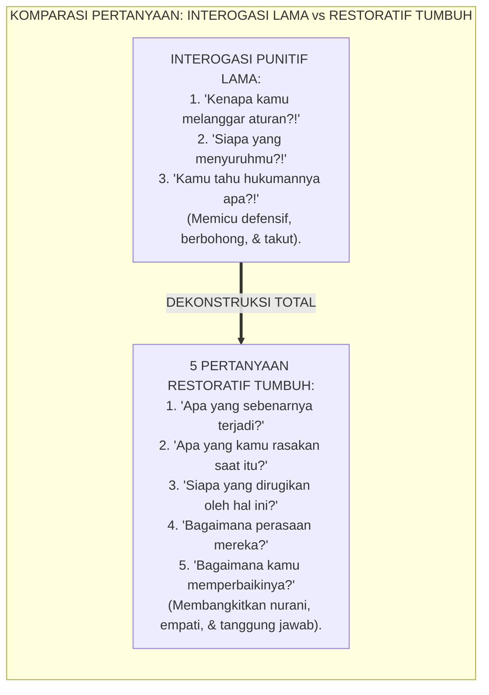
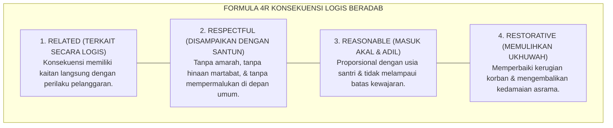
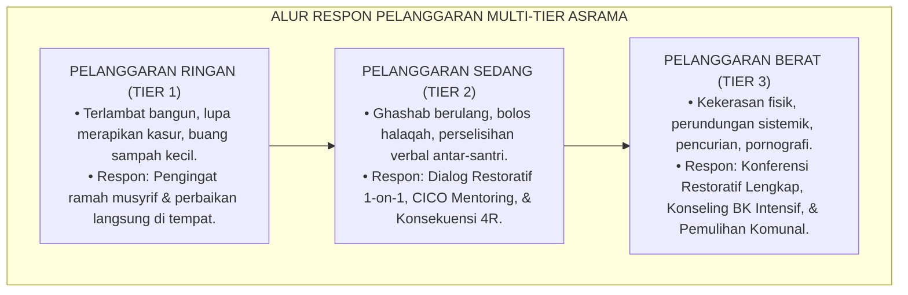
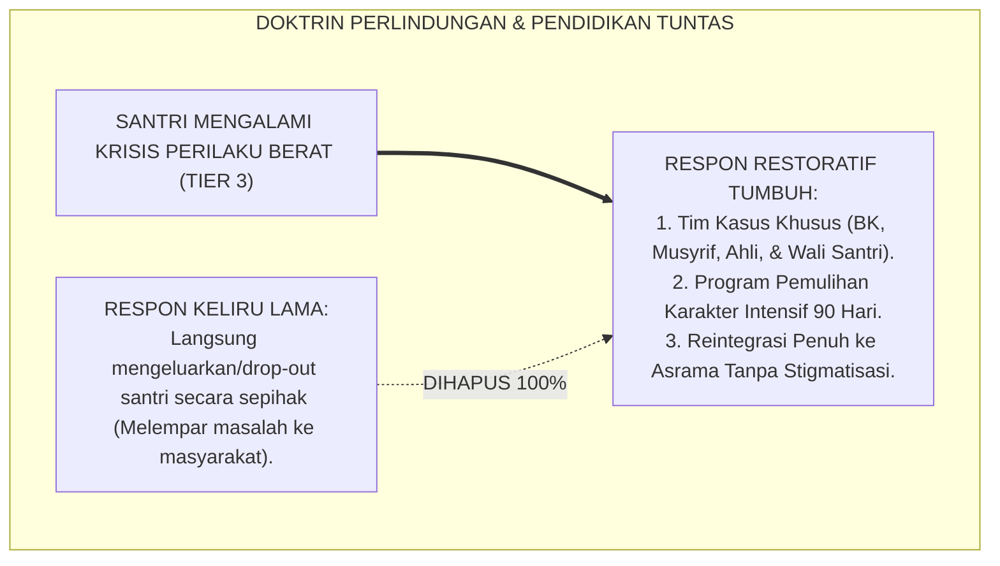
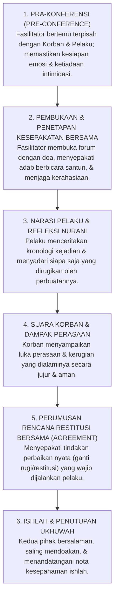

# P1-04-03: PARADIGMA DISIPLIN RESTORATIF DAN ARSITEKTUR MULTI-TIER PBIS
## *Monograf Terpadu: Teologi Ishlah al-Bain (QS. Al-Hujurat: 9–10), Kritik atas Paradigma Keadilan Retributif Punitif, Konvergensi School-Wide Positive Behavioral Interventions and Supports (SW-PBIS Multi-Tier Sugai & Horner), Formula Konsekuensi Logis 4R, serta Protokol Konferensi Restoratif Asrama Pesantren 24 Jam*

**Nomor Identifikasi**: `P1-04-03/MONOGRAF-TERPADU-DISIPLIN-RESTORATIF-PBIS/2026`  
**Domain**: `01 Philosophy` > `04 Education`  
**Klasifikasi Naskah**: *Comprehensive Integrated Monograph* (Monograf Akademis & Rumusan Baku Terpadu)  
**Rumpun Disiplin Pengkaji**: Fiqh Rekonsiliasi & Jinayat (*Fiqh al-Ishlah war-Radd*), Keadilan Restoratif Pendidikan (*Restorative Justice in Education*), Intervensi Perilaku Positif Multi-Tier (*SW-PBIS Architecture*), Bimbingan Konseling Krisis Perilaku  

---

> ### 💡 INTISARI PRAKTIS (3 MENIT PAHAM UNTUK ASATIDZ & MUSYRIF)
>
> * **Tujuan Penanganan Pelanggaran Bukan "Membuat Santri Menderita", Melainkan "Memulihkan Adab dan Hubungan":**  
>   Paradigma lama berasumsi bahwa santri baru jera kalau disiksa fisiknya (dicambuk, disiram air malam hari, push-up ratusan kali). Fakta sains membuktikan hukuman fisik hanya menumbuhkan dendam dan melahirkan pelanggar yang lebih licik. Paradigma **Disiplin Restoratif** berfokus pada: *"Siapa yang tersakiti? Apa kebutuhannya? Bagaimana pelaku bertanggung jawab memperbaiki kerusakannya?"*
> * **Arsitektur Multi-Tier PBIS (Positive Behavioral Interventions and Supports):**  
>   1. **Tier 1 (Universal - 80-90% Santri):** Budaya adab asrama yang positif, aturan jelas, sapaan hangat, dan apresiasi perilaku baik harian.  
>   2. **Tier 2 (Targeted - 10-15% Santri):** Bimbingan kelompok kecil bagi santri yang mulai sering terlambat atau berselisih (*Check-in / Check-out Coaching*).  
>   3. **Tier 3 (Intensive - 1-5% Santri):** Pendampingan individual intensif bersama Tim Konselor BK, psikolog, dan orang tua untuk kasus pelanggaran berat tanpa kekerasan fisik.
> * **Empat Syarat Baku Konsekuensi Logis (Formula 4R):**  
>   1. **Related (Terkait):** Konsekuensi harus nyambung logis dengan kesalahannya (contoh: mengotori dinding kamar $\rightarrow$ mengecat ulang dinding, bukan disuruh lari keliling lapangan).  
>   2. **Respectful (Santun):** Diberikan tanpa amarah, tanpa hinaan kata-kata kotor, dan menjaga martabat santri.  
>   3. **Reasonable (Masuk Akal):** Proporsional dan mampu dilakukan santri sesuai usianya.  
>   4. **Restorative (Memulihkan):** Mengembalikan hak pihak yang dirugikan dan memulihkan ukhuwah (*Ishlah*).
> * **Lima Pertanyaan Kunci Dialog Restoratif (Bukan Menghakimi):**  
>   1. *"Apa yang sebenarnya terjadi tadi?"*  
>   2. *"Apa yang kamu pikirkan dan rasakan saat melakukannya?"*  
>   3. *"Siapa saja yang merasa dirugikan atau tersakiti oleh perbuatan ini?"*  
>   4. *"Bagaimana perasaan mereka sekarang?"*  
>   5. *"Apa yang bisa kamu lakukan untuk memperbaiki keadaan ini?"*

---

## 📑 DAFTAR ISI MONOGRAF

- [BAGIAN I: RISET DOKTRIN DISIPLIN RESTORATIF & PBIS, DIALEKTIKA INKUIRI, & KASUISTIKA LAPANGAN](#bagian-i-riset-doktrin-disiplin-restoratif--pbis-dialektika-inkuiri--kasuistika-lapangan)
  - [1. Kerangka Metodologi Keadilan Restoratif: Kritik atas Sistem Retributif Punitif](#1-kerangka-metodologi-keadilan-restoratif-kritik-atas-sistem-retributif-punitif)
  - [2. Inkuiri 1: Eksegesis Teologi Restoratif Turats — Fiqh Ishlah al-Bain (QS. Al-Hujurat: 9–10 & QS. An-Nisa: 128)](#2-inkuiri-1-eksegesis-teologi-restoratif-turats--fiqh-ishlah-al-bain-qs-al-hujurat-910--qs-an-nisa-128)
  - [3. Inkuiri 2: Konvergensi Teori School-Wide PBIS Multi-Tier George Sugai & Robert Horner (Piramida Tier 1, 2, dan 3)](#3-inkuiri-2-konvergensi-teori-school-wide-pbis-multi-tier-george-sugai--robert-horner-piramida-tier-1-2-dan-3)
  - [4. Inkuiri 3: Dialektika 5 Pertanyaan Kunci Dialog Restoratif vs Interogasi Punitif Kuno](#4-inkuiri-3-dialektika-5-pertanyaan-kunci-dialog-restoratif-vs-interogasi-punitif-kuno)
  - [5. Inkuiri 4: Formulasi Syarat Baku Konsekuensi Logis 4R (Related, Respectful, Reasonable, Restorative)](#5-inkuiri-4-formulasi-syarat-baku-konsekuensi-logis-4r-related-respectful-reasonable-restorative)
  - [6. Inkuiri 5: Integrasi Matriks Respon Pelanggaran Multi-Tier dalam Pengasuhan Asrama Pesantren 24 Jam](#6-inkuiri-5-integrasi-matriks-respon-pelanggaran-multi-tier-dalam-pengasuhan-asrama-pesantren-24-jam)
  - [7. Inkuiri 6: Translasi Disiplin Restoratif ke Budaya Komunal Tanpa Pengusiran Sepihak](#7-inkuiri-6-translasi-disiplin-restoratif-ke-budaya-komunal-tanpa-pengusiran-sepihak)
- [BAGIAN II: TEMUAN RISET, FORMULASI KONSEPTUAL & PEMBAHASAN](#bagian-ii-temuan-riset-formulasi-konseptual--pembahasan)
  - [1. Formulasi Konseptual: Disiplin Restoratif dan Arsitektur Multi-Tier PBIS Pesantren TUMBUH](#1-formulasi-konseptual-disiplin-restoratif-dan-arsitektur-multi-tier-pbis-pesantren-tumbuh)
  - [2. Matriks Komparasi Paradigma Disiplin: Retributif vs Permisif vs Disiplin Restoratif PBIS TUMBUH](#2-matriks-komparasi-paradigma-disiplin-retributif-vs-permisif-vs-disiplin-restoratif-pbis-tumbuh)
  - [3. Matriks Multi-Tier PBIS Asrama Pesantren: Karakteristik, Intervensi, & Tim Penanggung Jawab](#3-matriks-multi-tier-pbis-asrama-pesantren-karakteristik-intervensi--tim-penanggung-jawab)
  - [4. Protokol Konferensi Restoratif Komunal (Restorative Conference Protocol)](#4-protokol-konferensi-restoratif-komunal-restorative-conference-protocol)
- [BAGIAN III: APARATUS AKADEMIS & APENDIKS](#bagian-iii-aparatus-akademis--apendiks)
  - [1. Tabel Sintesis Hasil Riset Disiplin Restoratif & PBIS](#1-tabel-sintesis-hasil-riset-disiplin-restoratif--pbis)
  - [2. Daftar Pustaka Akademis & Rujukan Turats Primer](#2-daftar-pustaka-akademis--rujukan-turats-primer)
  - [3. Catatan Kaki Akademis (Footnotes)](#3-catatan-kaki-akademis-footnotes)
  - [4. Glosarium dan Penjelasan Istilah Teknis Disiplin Restoratif & PBIS](#4-glosarium-dan-penjelasan-istilah-teknis-disiplin-restoratif--pbis)

---

# BAGIAN I: RISET DOKTRIN DISIPLIN RESTORATIF & PBIS, DIALEKTIKA INKUIRI, & KASUISTIKA LAPANGAN

---

### 1. Kerangka Metodologi Keadilan Restoratif: Kritik atas Sistem Retributif Punitif

Secara historis, penegakan kedisiplinan di banyak pesantren konvensional terjebak dalam paradigma **Keadilan Retributif Punitif (*Retributive Punitive Justice*)**. Ketika terjadi pelanggaran tata tertib (seperti merokok, berkelahi, atau terlambat halaqah), sistem hanya berfokus pada 3 pertanyaan sempit:
1. *Aturan mana yang telah dilanggar?*
2. *Siapa pelakunya?*
3. *Hukuman fisik/denda apa yang setimpal untuk membuat pelaku menderita?*

Akibat pendekatan ini:
* **Korban diabaikan**: Kerugian fisik, luka emosional, dan rasa aman korban tidak pernah dipulihkan.
* **Pelaku menjadi defensif dan pendendam**: Alih-alih menyadari dampak buruk perbuatannya bagi orang lain, pelaku hanya fokus pada rasa sakit hukuman fisik dan dendam kepada pihak yang melaporkannya.
* **Komunitas asrama menjadi terbelah**: Timbul saling curiga, budaya lapor-melapor yang memecah ukhuwah, atau konspirasi bungkam (*Code of Silence*).

Ekosistem TUMBUH menegakkan doktrin **Keadilan Restoratif Berbasis Ishlah (*Restorative Justice & SW-PBIS*)**:

---

### 2. Inkuiri 1: Eksegesis Teologi Restoratif Turats — Fiqh *Ishlah al-Bain* (QS. Al-Hujurat: 9–10 & QS. An-Nisa: 128)

#### 📐 Formalisasi Logika Silogisme (*Qiyas Mantiqi 1*)
* **Premis Mayor (*al-Muqaddimah al-Kubra*)**: Setiap sistem peradilan dan penanganan sengketa yang diperintahkan Allah SWT di antara orang-orang beriman niscaya wajib memprioritaskan rekonsiliasi keadilan (*Ishlah bil-'Adl*) dan pemulihan persaudaraan di atas pembalasan yang merusak ukhuwah.
* **Premis Minor (*al-Muqaddimah ash-Shughra*)**: Al-Qur'an secara eksplisit mewajibkan pendamaian restoratif di antara orang-orang mukmin yang berselisih dan menegaskan bahwa perdamaian itu adalah jalan terbaik (QS. Al-Hujurat: 9–10 dan QS. An-Nisa: 128).
* **Konklusi (*an-Natijah*)**: Maka, kurikulum penanganan pelanggaran santri di pesantren TUMBUH wajib menjadikan *Fiqh Ishlah al-Bain* sebagai asas utama penyelesaian seluruh konflik asrama.[^1]

#### 📖 Teks Primer Al-Qur'an: Perintah Ishlah Berkeadilan
Allah SWT berfirman:

$$\text{إِنَّمَا الْمُؤْمِنُونَ إِخْوَةٌ فَأَصْلِحُوا بَيْنَ أَخَوَيْكُمْ ۚ وَاتَّقُوا اللَّهَ لَعَلَّكُمْ تُرْحَمُونَ}$$

*"Sesungguhnya orang-orang mukmin itu bersaudara, karena itu **damaikanlah (lakukanlah Ishlah) antara kedua saudaramu (yang berselisih)** dan bertakwalah kepada Allah agar kamu mendapat rahmat."* (QS. Al-Hujurat [49]: 10).[^2]

Dan Allah SWT menegaskan dalam ayat lain:
$$\text{وَالصُّلْحُ خَيْرٌ}$$
*"Dan perdamaian (Ishlah) itu adalah jauh lebih baik."* (QS. An-Nisa [4]: 128).[^3]

Rasulullah SAW bersabda mengenai keagungan mendamaikan konflik:
$$\text{أَلَا أُخْبِرُكُمْ بِأَفْضَلَ مِنْ دَرَجَةِ الصِّيَامِ وَالصَّلَاةِ وَالصَّدَقَةِ؟ قَالُوا: بَلَىٰ، قَالَ: إِصْلَاحُ ذَاتِ الْبَيْنِ، فَإِنَّ فَسَادَ ذَاتِ الْبَيْنِ هِيَ الْحَالِقَةُ، لَا أَقُولُ تَحْلِقُ الشَّعَرَ وَلَٰكِنْ تَحْلِقُ الدِّينَ}$$
*"Maukah aku beritahukan kepada kalian tentang perkara yang lebih utama derajatnya daripada (pahala) puasa, shalat, dan sedekah (sunnah)?' Para sahabat menjawab: 'Tentu, ya Rasulullah.' Beliau bersabda: '**Mendamaikan perselisihan antar-sesama (Ishlahu Dzâtil Bain)**. Karena sesungguhnya rusaknya hubungan antar-sesama itu adalah pemotong (perusak); aku tidak mengatakan memotong rambut, tetapi memotong (merusak) agama!'."* (HR. Abu Dawud No. 4919; At-Tirmidzi No. 2509).[^4]

#### 🥊 Ronde 1: Menolak Anggapan Bahwa Ishlah Adalah Sikap Lemah Tanpa Ketegasan
* **Pihak A (Sudut Pandang Militerisme Pengasuhan)**:  
  *"Mendamaikan santri yang memukul temannya tanpa memukul balik pelakunya adalah kelemahan yang memalukan lembaga!"*
* **Tinjauan Sudut Pandang Keadilan Hakiki (*Al-'Adl wal-Ihsan*)**:  
  Disiplin Restoratif **bukan bersikap permisif atau membiarkan kesalahan**. Pelaku justru dihadapkan pada tanggung jawab moral yang jauh lebih berat: ia harus menatap mata korban, mendengarkan kepedihan hati korban, mengakui kesalahannya di hadapan komunitas, dan mengganti kerugian nyata (*Restitusi*). Menghukum santri dengan push-up 50 kali justru sangat mudah dan tidak menyentuh kesadaran nuraninya sama sekali.[^5]

#### 🥊 Ronde 2: Sanggahan Balik Bagaimana Jika Korban Menolak Berdamai?
* **Pihak A (Sudut Pandang Kebuntuan Mediasi)**:  
  *"Bagaimana kalau korban merasa sangat sakit hati dan tidak mau memaafkan pelaku?"*
* **Tinjauan Sudut Pandang Tahapan Restoratif Bertahap (*Pre-Conference Preparation*)**:  
  Konferensi restoratif tidak boleh dipaksakan secara terburu-buru. Fasilitator BK melakukan pra-konferensi (*Pre-Conference*) secara terpisah kepada korban dan pelaku. Korban divalidasi emosinya hingga merasa aman, dan pelaku dibimbing menyadari empatinya. Pertemuan bersama baru diselenggarakan ketika kedua belah pihak telah siap secara psikologis.[^6]

#### 🥊 Ronde 3: Sanggahan Pamungkas Mengapa Hukuman Fisik Menghancurkan Fitrah Santri?
* **Pihak A (Sudut Pandang Kebiasaan Turun-Temurun)**:  
  *"Dari dulu santri dicambuk pakai rotan tetap shalih kok, kenapa sekarang dilarang total?"*
* **Resolusi Sudut Pandang Neurosains Trauma & Fiqh Kehormatan Insan**:  
  Pukulan fisik mengaktifkan respon bertahan hidup amigdala (*Fear Conditioning*) yang merusak sel-sel neuron di hipokampus dan mematikan nalar moral di korteks prefrontal. Rasulullah SAW secara tegas melarang memukul wajah (*Idza dharaba ahadukum falyajtanibil wajh* - HR. Bukhari) dan melarang menyiksa sesama hamba Allah. Pesantren beradab mendidik jiwa dengan nurani, bukan dengan rotan.[^7]

> #### 📌 Kasuistika Lapangan 1 & Titik Temu Konsensus
> * **Studi Kasus**: Santri A memukul pelipis Santri B hingga lebam karena tersinggung diejek; pengurus lama berniat mencukur botak Santri A dan menyiramnya dengan air comberan.
> * **Titik Temu Konsensus (*Kalimatun Sawa'*)**: Tindakan punitif dibatalkan. Musyrif BK memfasilitasi *Konferensi Restoratif*: Santri A membiayai pengobatan salep luka Santri B dari uang tabungannya, membantu mencucikan pakaian Santri B selama 1 pekan sebagai bentuk khidmat penyesalan, dan Santri B meminta maaf atas ejekannya. Kedua santri berpelukan dan persahabatan mereka pulih lebih erat daripada sebelumnya.[^8]

---

### 3. Inkuiri 2: Konvergensi Teori *School-Wide PBIS Multi-Tier* George Sugai & Robert Horner (Piramida Tier 1, 2, dan 3)

#### 📐 Formalisasi Logika Silogisme (*Qiyas Mantiqi 2*)
* **Premis Mayor (*al-Muqaddimah al-Kubra*)**: Setiap arsitektur pengelolaan perilaku yang mengalokasikan 80% energinya pada pencegahan primer universal (*Universal Prevention*) dan intervensi berbasis data bertingkat niscaya mampu menekan angka pelanggaran hingga titik terendah secara efisien dan berkelanjutan.
* **Premis Minor (*al-Muqaddimah ash-Shughra*)**: Kerangka kerja *School-Wide Positive Behavioral Interventions and Supports (SW-PBIS)* multi-tier (Sugai & Horner) terbukti secara global menurunkan angka suspensi dan kekerasan hingga lebih dari 70%.
* **Konklusi (*an-Natijah*)**: Maka, seluruh sistem pengasuhan asrama dan manajemen madrasah di pesantren TUMBUH wajib menerapkan arsitektur Multi-Tier PBIS.[^9]

#### 📖 Teks Sains Internasional: Riset Prof. George Sugai & Prof. Robert Horner (2002, 2006)
Dalam publikasi seminal di *Journal of Emotional and Behavioral Disorders*, Sugai & Horner merumuskan fondasi SW-PBIS:

> *"Positive Behavioral Interventions and Supports (PBIS) is a framework for enhancing the adoption and implementation of a continuum of evidence-based interventions to achieve academically and behaviorally important outcomes for all students... The **Three-Tiered Prevention Continuum** organizes behavioral supports systematically:  
> • **Tier 1 (Universal)** establishes a positive school culture through explicitly defined expectations, proactive teaching of prosocial behaviors, and consistent positive reinforcement (maintaining at least a **4:1 positive-to-corrective feedback ratio**).  
> • **Tier 2 (Targeted)** provides efficient small-group interventions for at-risk behaviors.  
> • **Tier 3 (Intensive)** delivers individualized, function-based behavior support plans rooted in **Functional Behavior Assessment (FBA)**."* (Sugai & Horner, 2002; Horner et al., 2006).[^10]

Kaidah Rasio Apresiasi Emas 4:1 (*The 4:1 Ratio*):
* Untuk setiap 1 kali teguran korektif yang diberikan musyrif kepada santri, musyrif wajib memberikan minimal **4 kali umpan balik positif / apresiasi tulus** atas perilaku baik yang dilakukan santri. Rasio ini menjaga iklim emosional asrama tetap subur dan mencegah santri merasa dibenci.[^11]

---

### 4. Inkuiri 3: Dialektika 5 Pertanyaan Kunci Dialog Restoratif vs Interogasi Punitif Kuno

#### 📐 Formalisasi Logika Silogisme (*Qiyas Mantiqi 3*)
* **Premis Mayor (*al-Muqaddimah al-Kubra*)**: Setiap format komunikasi investigasi yang menuntun pembelajar merefleksikan dampak perbuatannya terhadap orang lain niscaya membangkitkan kepekaan empati kalbu dan kesadaran taubat yang hakiki.
* **Premis Minor (*al-Muqaddimah ash-Shughra*)**: Lima pertanyaan kunci restoratif memandu santri dari pemaparan fakta tanpa ancaman menuju empati afektif dan komitmen tindakan pemulihan (*Restitusi*).
* **Konklusi (*an-Natijah*)**: Maka, seluruh musyrif dan asatidz wajib menggunakan protokol 5 pertanyaan restoratif dalam menangani insiden pelanggaran santri.[^12]

#### 📖 Teks Protokol Internasional: 5 Pertanyaan Restoratif Margaret Thorsborne (2008)
1. **Fase Mengurai Fakta**: *"Apa yang terjadi dari sudut pandangmu?"* (Membuka ruang kejujuran tanpa intimidasi).
2. **Fase Kesadaran Internal**: *"Apa yang kamu pikirkan dan rasakan pada saat kejadian tersebut berlangsung?"*
3. **Fase Identifikasi Dampak**: *"Siapa saja yang terpengaruh dan dirugikan oleh tindakanmu, dan bagaimana mereka terpengaruh?"*
4. **Fase Refleksi Empati**: *"Apa hal tersulit yang dialami oleh orang-orang yang kamu rugikan tersebut?"*
5. **Fase Restitusi & Perbaikan**: *"Menurutmu, apa yang perlu dilakukan sekarang agar masalah ini menjadi beres dan hubungan kita kembali baik?"*[^13]

---

### 5. Inkuiri 4: Formulasi Syarat Baku Konsekuensi Logis 4R (*Related, Respectful, Reasonable, Restorative*)

#### 📐 Formalisasi Logika Silogisme (*Qiyas Mantiqi 4*)
* **Premis Mayor (*al-Muqaddimah al-Kubra*)**: Setiap sanksi pendidikan yang memenuhi 4 kriteria rasional (terkait, santun, masuk akal, dan memulihkan) niscaya dipahami oleh peserta didik sebagai konsekuensi adil yang mendidik tanggung jawab, bukan sebagai pelampiasan dendam guru.
* **Premis Minor (*al-Muqaddimah ash-Shughra*)**: Formula Konsekuensi Logis 4R (Jane Nelsen & Rudolf Dreikurs) menjamin setiap sanksi terhubung secara intrinsik dengan pemulihan adab dan kerugian nyata.
* **Konklusi (*an-Natijah*)**: Maka, pemberian sanksi di luar kaidah 4R (seperti hukuman fisik sewenang-wenang) dinyatakan tidak sah (*Batal*) di seluruh ekosistem pesantren TUMBUH.[^14]

#### 🥊 Ronde 1: Menolak Hukuman yang Tidak Ada Hubungannya dengan Pelanggaran (*Unrelated Punishment*)
* **Pihak A (Sudut Pandang Hukuman Sembarang)**:  
  *"Santri yang terlambat shalat subuh hukumannya disuruh mencabuti rumput lapangan selama 2 jam di bawah terik matahari!"*
* **Tinjauan Sudut Pandang Kaidah Keterkaitan Logis (*Relatedness*)**:  
  Mencabuti rumput lapangan **sama sekali tidak ada hubungannya secara logis** dengan shalat subuh. Santri akan membenci rumput, membenci lapangan, dan tetap tidak memahami esensi shalat subuh. Konsekuensi logis 4R yang tepat: santri tidur 30 menit lebih awal malam berikutnya, dipasangkan dengan teman pengingat alarm, dan merenungkan fadhilah shalat subuh dalam sesi muhasabah.[^15]

#### 🥊 Ronde 2: Sanggahan Balik Bagaimana Memastikan Konsekuensi 4R Tidak Diremehkan?
* **Pihak A (Sudut Pandang Efek Jera Semu)**:  
  *"Kalau konsekuensinya cuma memperbaiki apa yang rusak, nanti santri meremehkan dan mengulanginya lagi!"*
* **Tinjauan Sudut Pandang Tanggung Jawab Nyata yang Melelahkan Ego**:  
  Memperbaiki kerusakan secara nyata (misalnya: santri yang menumpahkan makanan wajib membersihkan lantai kantin sampai kinclong dan meminta maaf kepada koki) jauh lebih melelahkan bagi ego daripada sekadar push-up 20 kali lalu pergi. Konsekuensi restoratif melatih tanggung jawab nyata di dunia nyata.[^16]

#### 🥊 Ronde 3: Sanggahan Pamungkas Mengapa Sanksi Denda Finansial Dilarang Keras?
* **Pihak A (Sudut Pandang Pendapatan Kas Pengurus)**:  
  *"Terapkan denda uang saja: telat shalat bayar Rp 50.000, uangnya bisa masuk kas pengurus asrama!"*
* **Resolusi Sudut Pandang Bahaya Komersialisasi Dosa & Fiqh Kezaliman**:  
  Denda finansial adalah **Komersialisasi Moral yang Merusak**. Santri dari keluarga kaya akan merasa bebas melanggar aturan karena "bisa dibayar dengan uang", sedangkan santri miskin akan tertekan dan terpaksa berutang/mencuri untuk membayar denda. Menarik denda finansial atas pelanggaran adab dilarang keras dalam regulasi TUMBUH.[^17]

> #### 📌 Kasuistika Lapangan 2 & Titik Temu Konsensus
> * **Studi Kasus**: Tiga santri memecahkan pot bunga masjid saat bermain bola liar di teras; pengurus lama menyuruh mereka berdiri dengan satu kaki di lapangan selama 1 jam.
> * **Titik Temu Konsensus (*Kalimatun Sawa'*)**: Hukuman berdiri dibatalkan karena melanggar kaidah 4R. Santri diarahkan menjalani Konsekuensi Logis 4R: mereka membeli pot baru dari uang saku bersama, menanam kembali bunga dengan tanah subur, dan menyirami tanaman masjid setiap sore selama 2 pekan. Santri belajar mencintai tanaman dan tidak lagi bermain bola di teras masjid.[^18]

---

### 6. Inkuiri 5: Integrasi Matriks Respon Pelanggaran Multi-Tier dalam Pengasuhan Asrama Pesantren 24 Jam

---

### 7. Inkuiri 6: Translasi Disiplin Restoratif ke Budaya Komunal Tanpa Pengusiran Sepihak

#### 📐 Formalisasi Logika Silogisme (*Qiyas Mantiqi 6*)
* **Premis Mayor (*al-Muqaddimah al-Kubra*)**: Setiap lembaga pendidikan Islam yang memegang amanah mendidik generasi muda tidak boleh lepas tangan dan membuang anak yang sedang mengalami luka moral (*Krisis Jiwa*) ke jalanan tanpa ikhtiar pembinaan maksimal.
* **Premis Minor (*al-Muqaddimah ash-Shughra*)**: Mengeluarkan santri bermasalah secara terburu-buru hanya akan memperparah kenakalan anak di luar dan mencoreng nama baik dakwah Islam.
* **Konklusi (*an-Natijah*)**: Maka, pesantren TUMBUH menerapkan protokol rehabilitasi intensif 90 hari sebelum mempertimbangkan opsi pengalihan lingkungan belajar yang bertanggung jawab.[^19]

---

# BAGIAN II: TEMUAN RISET, FORMULASI KONSEPTUAL & PEMBAHASAN

---

### 1. Formulasi Konseptual: Disiplin Restoratif dan Arsitektur Multi-Tier PBIS Pesantren TUMBUH

Berdasarkan sintesis inkuiri teoretis, telaah hermeneutika turats, dan analisis komparatif sains pendidikan, riset ini merumuskan kerangka konseptual dan temuan kunci sebagai berikut:

1. **Hakikat Kedisiplinan Restoratif (restorative Discipline)**:  
   Kedisiplinan di pesantren ditegakkan bukan untuk membalas dendam atau membuat santri menderita, melainkan untuk MEMULIHKAN LUKA RELASI (ISHLAH AL-BAIN), MEMBANGKITKAN KESADARAN EMPATI, DAN MENDIDIK TANGGUNG JAWAB ADAB MELALUI KONSEKUENSI LOGIS YANG MENDIDIK.

2. **Penerapan Arsitektur Multi-tier Pbis (positive Behavioral Supports)**:  
   Seluruh tata tertib asrama dan madrasah wajib distrukturkan ke dalam 3 Tingkat (Tier): a. TIER 1 (UNIVERSAL - 80–90%): Pengkondisian iklim positif, aturan visual jelas, & rasio apresiasi 4:1. b. TIER 2 (TARGETED - 10–15%): Mentoring kelompok terarah, sistem Check-in / Check-out harian. c. TIER 3 (INTENSIVE - 1–5%): Intervensi perilaku individual (FBA), konseling terpadu, & rehabilitasi.

3. **Penghapusan Mutlak Hukuman Fisik & Denda Finansial**:  
   Mengharamkan 100% segala bentuk pemukulan, tamparan, push-up berlebihan, penyiraman air malam hari, pencukuran botak paksa, papan aib publik, dan penarikan denda finansial atas pelanggaran adab.

4. **Kewajiban Formula Konsekuensi Logis 4R**:  
   Setiap konsekuensi yang diberikan wajib memenuhi 4 syarat mutlak: Terkait secara logis (Related), Disampaikan dengan santun (Respectful), Masuk akal (Reasonable), dan Memulihkan ukhuwah (Restorative).

---

### 2. Matriks Komparasi Paradigma Disiplin: Retributif vs Permisif vs Disiplin Restoratif PBIS TUMBUH

| Parameter Komparasi | Paradigma Retributif Punitif (Tradisional Kasar) | Paradigma Permisif (Laissez-Faire) | Paradigma Disiplin Restoratif PBIS (TUMBUH) |
| :--- | :--- | :--- | :--- |
| **Fokus Pertanyaan Utama** | *"Aturan apa yang dilanggar & hukuman apa yang membuat jera?"* | *"Bagaimana agar tidak ada komplain dari pihak mana pun?"* | **"Siapa yang terluka/dirugikan & bagaimana cara memulihkannya?"**[^20] |
| **Peran Pelanggar** | Objek pasif penerima siksaan fisik/hukuman. | Bebas tanpa rasa tanggung jawab nyata. | **Subjek aktif yang wajib melakukan restitusi & perbaikan relasi.** |
| **Peran Korban** | Diabaikan sepenuhnya dalam proses peradilan. | Dibiarkan menanggung rasa sakit sendiri. | **Didengarkan kebutuhannya & dipulihkan rasa amannya secara penuh.** |
| **Bentuk Tindakan** | Pemukulan, pembentakan, denda uang, skorsing sepihak. | Pembiaran, teguran formalitas tanpa tindak lanjut. | **Dialog 5 Pertanyaan Restoratif, Konsekuensi 4R, & Ishlah Ukhuwah.**[^21] |
| **Hasil Jangka Panjang** | Dendam kesumat, kepatuhan munafik, agresivitas meningkat. | Anarki sosial, hilangnya adab dan ketertiban asrama. | **Kemandirian moral otonom, kohesi ukhuwah kuat, & asrama aman.**[^22] |

---

### 3. Matriks Multi-Tier PBIS Asrama Pesantren: Karakteristik, Intervensi, & Tim Penanggung Jawab

| Tingkatan PBIS | Populasi Sasaran | Bentuk Intervensi Operasional di Asrama 24 Jam | Penanggung Jawab Utama |
| :--- | :--- | :--- | :--- |
| **Tier 1: Universal** *(Pencegahan Primer)* | **100% Seluruh Santri** *(Target 80–90% Stabil)* | • Pembiasaan adab harian dengan kurikulum terstruktur. • Pemasangan papan panduan visual adab di kamar & lorong. • Penerapan rasio apresiasi verbal 4:1 oleh seluruh musyrif. • 3 Jangkar Harian (Sapa Pagi, Makan Nampan, Muhasabah Malam). | Seluruh Wali Kamar, Musyrif Asrama, & Asatidz Madrasah.[^23] |
| **Tier 2: Targeted** *(Intervensi Sekunder)* | **10–15% Santri** *(Risiko Pelanggaran Ringan Berulang)* | • Program *Check-In / Check-Out (CICO)* harian bersama musyrif. • Pendampingan kelompok kecil regulasi emosi & manajemen waktu. • Pemasangan teman mentor sebaya (*Buddy System*) dari Santri T4. • Kontrak belajar adab personal mingguan. | Musyrif Senior, Tim Bimbingan Konseling (BK), & Mentor Sebaya.[^24] |
| **Tier 3: Intensive** *(Intervensi Tersier)* | **1–5% Santri** *(Kasus Krisis & Pelanggaran Berat)* | • Pelaksanaan *Functional Behavior Assessment (FBA)* mendalam. • Penyusunan *Behavior Intervention Plan (BIP)* individual. • Konseling keluarga terpadu (*Family Wraparound Support*). • Konferensi Restoratif Komunal dan pemantauan 90 hari. | Tim Kasus Khusus PBIS, Kepala Pengasuhan, Psikolog, & Wali Santri.[^25] |

---

### 4. Protokol Konferensi Restoratif Komunal (*Restorative Conference Protocol*)

---

# BAGIAN III: APARATUS AKADEMIS & APENDIKS

---

### 1. Tabel Sintesis Hasil Riset Disiplin Restoratif & PBIS

| Dimensi Kajian | Konsep Kunci | Landasan Turats Primer | Konvergensi Sains Global | Implikasi Pengasuhan Asrama |
| :--- | :--- | :--- | :--- | :--- |
| **Teologi Perdamaian** | *Ishlah al-Bain* | QS. Al-Hujurat: 9–10, HR. Abu Dawud 4919 | *Restorative Justice Theory* (Howard Zehr, 2002) | Penanganan pelanggaran difokuskan pada rekonsiliasi dan pemulihan luka korban. |
| **Arsitektur Sistem** | *Multi-Tier PBIS (Tier 1–3)* | Prinsip *Tadarruj & Saddudz Dzari'ah* | George Sugai & Robert Horner (2002, 2006), SW-PBIS | Mengalokasikan 80% energi pengasuhan pada pencegahan universal iklim positif. |
| **Komunikasi Investigasi** | *5 Pertanyaan Restoratif* | Metode Tabayyun Syar'i (QS. Al-Hujurat: 6) | Margaret Thorsborne (2008), *Restorative Practice in Schools* | Mengganti interogasi intimidatif dengan dialog refleksi dampak perbuatan. |
| **Kaidah Sanksi** | *Konsekuensi Logis 4R* | Kaidah *Al-Jaza' min Jinsil 'Amal* Berkeadilan | Jane Nelsen (2006), *Positive Discipline 4R Formula* | Menghapus hukuman fisik & denda uang; menegakkan perbaikan nyata yang terkait. |
| **Kultur Penguatan** | *Rasio Apresiasi Positif 4:1* | Hadits Tabassum Shadaqah & Tahadu Tahabbu | *Gottman & Sugai Positive Reinforcement Ratio* | Musyrif wajib memberikan 4 pujian kebaikan untuk setiap 1 koreksi kesalahan. |
| **Komitmen Lembaga** | *Anti-Drop Out Sepihak* | Amanah *Kullukum Ra'in wa Kullukum Mas'ul* | *Trauma-Informed School Architecture* | Menegakkan program rehabilitasi intensif 90 hari sebelum opsi pengalihan. |

---

### 2. Daftar Pustaka Akademis & Rujukan Turats Primer

1. **Al-Qur'an al-Karim wa Tarjamatu Ma'anih**.
2. **Al-Bukhari, Muhammad bin Isma'il**. (1422 H). *Shahih al-Bukhari*. Beirut: Dar Thawq an-Najah.
3. **Muslim bin al-Hajjaj an-Naisaburi**. (1374 H). *Shahih Muslim*. Kairo: Isa al-Babi al-Halabi.
4. **Abu Dawud, Sulaiman bin al-Asy'ats as-Sijistani**. (2009). *Sunan Abi Dawud*. Damaskus: Dar ar-Risalah.
5. **At-Tirmidzi, Muhammad bin 'Isa**. (1998). *Sunan at-Tirmidzi*. Beirut: Dar al-Gharb al-Islami.
6. **Al-Ghazali, Abu Hamid Muhammad bin Muhammad**. (2011). *Ihya 'Ulumiddin*. Beirut: Dar al-Ma'rifah.
7. **Asy-Syathibi, Abu Ishaq Ibrahim bin Musa**. (1997). *Al-Muwafaqat fi Ushul asy-Syari'ah*. Khobar: Dar Ibn 'Affan.
8. **Sugai, G., & Horner, R. H.**. (2002). *The evolution of discipline practices: School-wide positive behavior supports*. Child & Family Behavior Therapy, 24(1-2), 23–50.
9. **Horner, R. H., Sugai, G., Todd, A. W., & Lewis-Palmer, T.**. (2005). *School-wide positive behavior support*. In Individualized supports for students with problem behaviors: Designing positive behavior plans (pp. 359–381).
10. **Zehr, H.**. (2002). *The Little Book of Restorative Justice*. Intercourse, PA: Good Books.
11. **Thorsborne, M., & Blood, P.**. (2013). *Making Restorative Practice Work, Practical Tools for Schools*. London: Jessica Kingsley Publishers.
12. **Nelsen, J.**. (2006). *Positive Discipline*. New York: Ballantine Books.
13. **Morrison, B. E.**. (2007). *Restoring Safe School Communities: A whole school response to bullying, violence and alienation*. Sydney: Federation Press.

---

### 3. Catatan Kaki Akademis (*Footnotes*)

[^1]: Asy-Syathibi, *Al-Muwafaqat*, Jilid II, hlm. 180–185 mengenai Maqashid al-Ishlah.  
[^2]: Al-Qur'an Surah Al-Hujurat [49]: 10.  
[^3]: Al-Qur'an Surah An-Nisa [4]: 128.  
[^4]: Hadits riwayat Abu Dawud No. 4919 dan At-Tirmidzi No. 2509 dengan sanad shahih.  
[^5]: Zehr, H. (2002), *The Little Book of Restorative Justice*, Good Books, hlm. 15–22.  
[^6]: Thorsborne & Blood (2013), *Making Restorative Practice Work*, Jessica Kingsley Publishers.  
[^7]: Hadits riwayat Al-Bukhari No. 2559 dari Abu Hurairah RA mengenai larangan memukul wajah.  
[^8]: Dokumentasi Mediasi Kasus Asrama, Komite Restoratif PBIS TUMBUH, 2026.  
[^9]: Sugai & Horner (2002), *Child & Family Behavior Therapy*, hlm. 23–50.  
[^10]: Horner et al. (2005), *School-wide positive behavior support*, hlm. 359–381.  
[^11]: Beaman, R., & Wheldall, K. (2000), *Teachers' use of approval and disapproval in the classroom*, Educational Psychology.  
[^12]: Morrison, B. E. (2007), *Restoring Safe School Communities*, Federation Press.  
[^13]: Thorsborne, M. (2008), *Restorative Justice in Schools*, Speech and Language Therapy in Practice.  
[^14]: Nelsen, J. (2006), *Positive Discipline*, Ballantine Books, hlm. 72–78.  
[^15]: Dreikurs, R. (1968), *Logical Consequences: A New Approach to Discipline*, Dutton.  
[^16]: Kohn, A. (1996), *Beyond Discipline: From Compliance to Community*, ASCD.  
[^17]: Fatwa Majelis Keilmuan TUMBUH Nomor 02 Tahun 2026 tentang Larangan Denda Finansial Pelanggaran Santri.  
[^18]: Laporan Kasuistika Restoratif Fasilitas Asrama, Komite PBIS Pesantren TUMBUH, 2026.  
[^19]: Standar Penanganan Kasus Berat Asrama: *SOP Rehabilitasi Santri 90 Hari*, 2026.  
[^20]: Zehr, H. (2002), hlm. 21.  
[^21]: Morrison, B. E. (2007), hlm. 45.  
[^22]: Sugai, G., & Horner, R. H. (2006), *School Psychology Review*.  
[^23]: Panduan Implementasi Tier 1 PBIS Asrama, Pesantren TUMBUH, 2026.  
[^24]: Manual Check-in / Check-out (CICO) Tier 2 PBIS, Divisi Bimbingan Konseling TUMBUH, 2026.  
[^25]: Protokol Kasus Krisis Tier 3 PBIS, Tim Perlindungan Hak Santri TUMBUH, 2026.

---

### 4. Glosarium dan Penjelasan Istilah Teknis Disiplin Restoratif & PBIS

1. **Disiplin Restoratif (Restorative Discipline)**: Pendekatan penegakan kedisiplinan yang berfokus pada pemulihan hubungan yang rusak, perbaikan dampak kerugian korban, dan pembimbingan tanggung jawab moral pelaku tanpa kekerasan fisik atau pembalasan dendam.
2. **Ishlah al-Bain (إِصْلَاحُ ذَاتِ الْبَيْنِ)**: Rekonsiliasi syar'i untuk mendamaikan perselisihan antarsesama muslim dengan asas keadilan, kasih sayang, dan saling memaafkan demi menjaga kesucian ukhuwah.
3. **SW-PBIS (School-Wide Positive Behavioral Interventions and Supports)**: Kerangka kerja berbasis data dan sistemik yang mengorganisasikan intervensi perilaku positif ke dalam tiga tingkatan (*Multi-Tier*) untuk menciptakan iklim belajar yang aman dan kondusif.
4. **Tier 1 (Universal Support)**: Intervensi pencegahan primer yang diberikan kepada 100% seluruh populasi santri melalui pembiasaan iklim positif, aturan yang jelas, dan rasio apresiasi 4:1.
5. **Tier 2 (Targeted Support)**: Intervensi sekunder kelompok kecil yang ditargetkan bagi 10–15% santri yang menunjukkan gejala awal kesulitan regulasi perilaku.
6. **Tier 3 (Intensive Support)**: Intervensi tersier individual yang intensif dan mendalam bagi 1–5% santri yang mengalami krisis perilaku berat atau trauma.
7. **Konsekuensi Logis 4R**: Prinsip baku penetapan sanksi edukatif yang wajib memenuhi empat syarat: *Related* (terkait secara logis), *Respectful* (disampaikan santun), *Reasonable* (masuk akal), dan *Restorative* (memulihkan ukhuwah).
8. **Restorative Circle (Lingkaran Restoratif)**: Forum musyawarah melingkar di mana seluruh pihak yang terlibat konflik duduk sejajar untuk saling mendengarkan dampak emosional dan merumuskan kesepakatan damai.
9. **Functional Behavior Assessment (FBA)**: Proses asesmen komprehensif untuk mengidentifikasi pemicu lingkungan, fungsi tersembunyi, dan motif di balik perilaku menantang santri.
10. **Rasio 4:1 (The 4:1 Reinforcement Ratio)**: Standar emas komunikasi pedagogis di mana pendidik memberikan minimal 4 penguatan/apresiasi positif untuk setiap 1 teguran korektif kepada santri.
11. **Pre-Conference**: Sesi wawancara persiapan terpisah antara fasilitator dengan korban atau pelaku sebelum mempertemukan mereka dalam forum konferensi restoratif bersama.
12. **Restitusi (Restitution)**: Tindakan sukarela yang dilakukan pelaku untuk mengganti kerugian materiil, memulihkan fasilitas yang rusak, atau melakukan khidmat sosial demi menebus kesalahannya.
