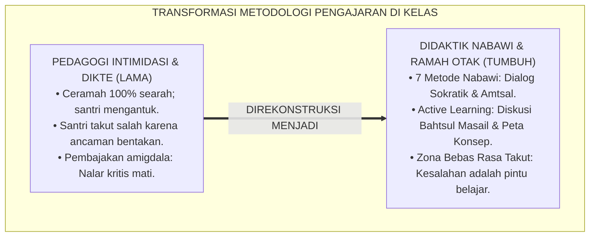
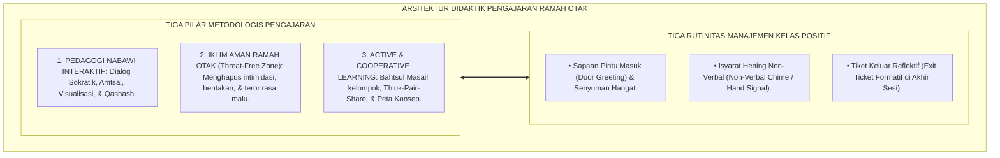
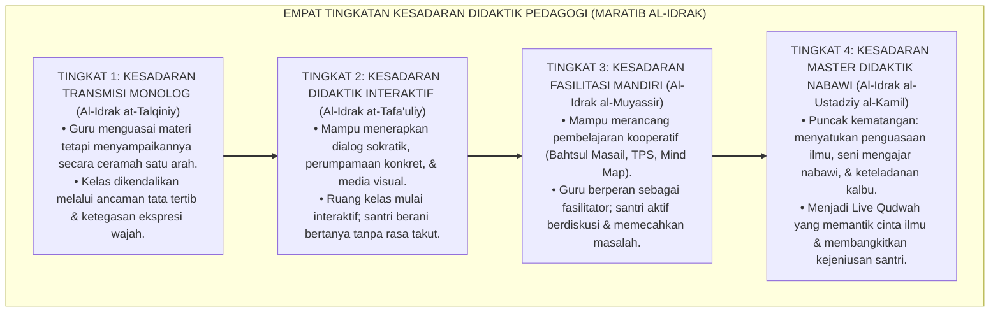
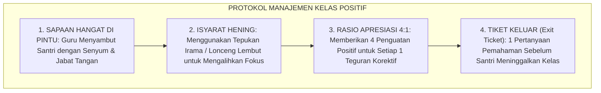

# P1-04-04: DIDAKTIK PENGAJARAN DAN MANAJEMEN KELAS POSITIF (BRAIN-FRIENDLY DIDACTICS & CLASS MANAGEMENT)
## *Monograf Riset Akademik: Seni Didaktik Pengajaran Rasulullah SAW (Metode Amtsal, Dialog Sokratik, & Visualisasi), Konvergensi Neurosains Pembelajaran Ramah Otak, Integrasi Active Learning dalam Halaqah Kitab, Serta Manajemen Kelas Positif Bebas Rasa Takut*

**Nomor Identifikasi**: `P1-04-04/MONOGRAF-RISET-DIDAKTIK-KELAS-POSITIF/2026`  
**Domain**: `01 Philosophy` > `04 Education` (Sub-Modul 04: *Brain-Friendly Pedagogy & Positive Class Management*)  
**Klasifikasi Naskah**: *Academic Research Monograph* (Monograf Riset Akademik Fondasional)  
**Rumpun Disiplin Pengkaji**: Didaktik & Metodologi Pengajaran Islam (*Thuruqut Tadris an-Nabawiyyah*), Neurosains Kognitif Pendidikan (*Educational Neuroscience*), Pembelajaran Aktif & Kooperatif (*Active & Cooperative Learning*), Manajemen Kelas Positif Pesantren  

---

> ### 💡 INTISARI EKSEKUTIF (EXECUTIVE SUMMARY)
>
> * **Kelemahan Paradigma Lama: Pedagogi Intimidatif dan Dikte Monolog Pasif:**  
>   Banyak ruang kelas pesantren terjebak dalam metode ceramah monolog 100% yang menjemukan (*Passive Rote Learning*) diiringi ancaman bentakan kasar atau lemparan penghapus papan tulis ketika santri salah menjawab. Hal ini memicu pembajakan amigdala (*Amygdala Hijack*), mematikan nalar kritis, dan membuat santri takut berpendapat.
> * **Inovasi Konseptual: Seni Didaktik Nabawi & Neurosains Pedagogi Ramah Otak:**  
>   TUMBUH menghidupkan 7 metode didaktik kenabian (**1. Dialog Sokratik; 2. Analogi Amtsal; 3. Visualisasi Sketsa Grafis; 4. Isyarat Bahasa Tubuh; 5. Umpan Balik Positif; 6. Humor Santun; 7. Narasi Kisah Inspiratif**). Memadukannya dengan neurosains bahwa pembelajaran optimal hanya terjadi ketika ruang kelas bebas dari rasa takut (*Threat-Free Zone*).
> * **Formulasi Operasional & Pembuktian Lapangan:**  
>   Monograf ini menguraikan matriks integrasi didaktik nabawi dan pembelajaran aktif, 4 Tingkatan Kesadaran Didaktik Pedagogi (*Maratib al-Idrak*), protokol penjaminan mutu mengajar, dan etika manajemen kelas positif 24 jam.

---

## 📑 DAFTAR ISI MONOGRAF

- [BAB I: LANDASAN TEORETIS & DISKURSUS KRITIS](#bab-i-landasan-teoretis--diskursus-kritis)
  - [1. Latar Belakang Masalah: Krisis Pedagogi Intimidatif dan Kebuntuan Kelas Pasif di Pesantren](#1-latar-belakang-masalah-krisis-pedagogi-intimidatif-dan-kebuntuan-kelas-pasif-di-pesantren)
  - [2. Eksegesis Turats Seni Didaktik Pengajaran Rasulullah SAW: Amtsal, Sokratik, dan Visualisasi](#2-eksegesis-turats-seni-didaktik-pengajaran-rasulullah-saw-amtsal-sokratik-dan-visualisasi)
  - [3. Konvergensi Neurosains Kognitif Pembelajaran Ramah Otak (Threat-Free Brain-Friendly Pedagogy)](#3-konvergensi-neurosains-kognitif-pembelajaran-ramah-otak-threat-free-brain-friendly-pedagogy)
  - [4. Transformasi Halaqah Kitab Kuning Melalui Pembelajaran Aktif dan Kooperatif (Active Learning)](#4-transformasi-halaqah-kitab-kuning-melalui-pembelajaran-aktif-dan-kooperatif-active-learning)
  - [5. Kasuistika Lapangan: Fenomena Amigdala Hijack Saat Ujian Lisan & Resolusi Restoratif Terpadu](#5-kasuistika-lapangan-fenomena-amigdala-hijack-saat-ujian-lisan--resolusi-restoratif-terpadu)
- [BAB II: FORMULASI KONSEPTUAL & PEMBAHASAN MENDALAM](#bab-ii-formulasi-konseptual--pembahasan-mendalam)
  - [1. Eksplanasi Teoretis Didaktik Pengajaran Ramah Otak dan Manajemen Kelas Positif TUMBUH](#1-eksplanasi-teoretis-didaktik-pengajaran-ramah-otak-dan-manajemen-kelas-positif-tumbuh)
  - [2. Dekomposisi Dimensi & Empat Tingkatan Kesadaran Didaktik Pedagogi (Maratib al-Idrak)](#2-dekomposisi-dimensi--empat-tingkatan-kesadaran-didaktik-pedagogi-maratib-al-idrak)
  - [3. Matriks Tujuh Metode Didaktik Nabawi & Konvergensi Pedagogi Kontemporer](#3-matriks-tujuh-metode-didaktik-nabawi--konvergensi-pedagogi-kontemporer)
  - [4. Protokol Standar Manajemen Kelas Positif: Rutinitas, Transisi, & Respon Distraksi](#4-protokol-standar-manajemen-kelas-positif-rutinitas-transisi--respon-distraksi)
  - [5. Diskusi Filosofis Mendalam & Implikasi bagi Masa Depan Peradaban Pendidikan Islam](#5-diskusi-filosofis-mendalam--implikasi-bagi-masa-depan-peradaban-pendidikan-islam)
- [BAB III: KESIMPULAN & APARATUS AKADEMIS](#bab-iii-kesimpulan--aparatus-akademis)
  - [1. Tabel Sintesis Temuan Riset Didaktik Kelas Positif](#1-tabel-sintesis-temuan-riset-didaktik-kelas-positif)
  - [2. Daftar Pustaka Akademis & Rujukan Turats Primer](#2-daftar-pustaka-akademis--rujukan-turats-primer)
  - [3. Catatan Kaki Akademis (Footnotes)](#3-catatan-kaki-akademis-footnotes)
  - [4. Glosarium Istilah Ilmiah & Turats Didaktik Pengajaran](#4-glosarium-istilah-ilmiah--turats-didaktik-pengajaran)

---

# BAB I: LANDASAN TEORETIS & DISKURSUS KRITIS

---

### 1. Latar Belakang Masalah: Krisis Pedagogi Intimidatif dan Kebuntuan Kelas Pasif di Pesantren

Ruang kelas madrasah dan halaqah pesantren kerap mengalami kebuntuan metodologis:
* **Pedagogi Intimidasi dan Teror Rasa Malu**: Guru menganggap kelas yang tenang adalah kelas di mana santri duduk membisu karena takut dibentak atau ditertawakan saat salah membaca harakat kitab kuning.
* **Metode Ceramah Monolog 100%**: Guru mendiktekan terjemahan kata per kata (*Maknani Gandul*) selama berjam-jam tanpa memberikan ruang bagi santri untuk berdiskusi, bertanya, atau menguji pemahamannya secara aktif.
* **Dampak Kelumpuhan Kognitif (*Cognitive Paralysis*)**: Ketakutan memicu sekresi hormon adrenalin dan kortisol yang mengunci kerja korteks prefrontal (*dlPFC*), sehingga santri tidak mampu menyerap konsep logika dengan baik dan rentan mengalami kantuk berat.
* **Keniscayaan Didaktik Ramah Otak**: Mengajar adalah seni memantik fitrah rasa ingin tahu (*Curiosity*) santri melalui pendekatan yang hangat, interaktif, dan memuliakan akal budi.[^1]

---

### 2. Eksegesis Turats Seni Didaktik Pengajaran Rasulullah SAW: Amtsal, Sokratik, dan Visualisasi

Rasulullah ﷺ adalah pendidik teragung (*Al-Mu'allim al-Awwal*) yang menggunakan ragam didaktik interaktif:

1. **Dialog Sokratik (Pertanyaan Pemantik Nalar)**:  
   Rasulullah ﷺ sering memulai pelajaran dengan pertanyaan mendalam: *"Tahukah kalian siapakah orang yang bangkrut itu (Al-Muflis)?"* (HR. Muslim No. 2581), memancing para sahabat untuk berpikir analitis sebelum memberikan definisi hakiki.[^2]
2. **Perumpamaan Konkret (*Al-Amtsal*)**:  
   Menggambarkan mukmin yang membaca Al-Qur'an laksana buah *Utrujjah* (harum baunya dan manis rasanya - HR. Al-Bukhari No. 5059).
3. **Visualisasi Sketsa Grafis di Atas Tanah**:  
   Rasulullah ﷺ menggambar garis lurus di atas pasir dan garis-garis bercabang di sampingnya untuk memvisualisasikan jalan Allah yang lurus dan jalan godaan setan (HR. Ahmad No. 4142).[^3]

---

### 3. Konvergensi Neurosains Kognitif Pembelajaran Ramah Otak (Threat-Free Brain-Friendly Pedagogy)

Sains pembelajaran ramah otak (Immordino-Yang & Damasio, 2007; Medina, 2014) membuktikan hubungan erat antara emosi dan kognisi:
* Otak manusia tidak dapat memproses informasi abstrak tingkat tinggi ketika berada dalam status ancaman (*Fight-or-Flight Response*).
* Lingkungan kelas yang aman (*Psychologically Safe Classroom*) memicu pelepasan **Dopamin** (hormon motivasi) dan **Oksitosin**, yang memperkuat pembentukan memori jangka panjang (*Long-Term Potentiation*) di hippocampus.[^4]

---

### 4. Transformasi Halaqah Kitab Kuning Melalui Pembelajaran Aktif dan Kooperatif (Active Learning)

Ekosistem TUMBUH mentransformasikan tradisi pembacaan kitab kuning:
* Mengadopsi struktur pembelajaran kooperatif (*Kagan Cooperative Structures*): metode *Think-Pair-Share*, diskusi *Bahtsul Masail* kelompok kecil, dan pembuatan peta konsep (*Mind Mapping*) bab kitab.
* Santri membaca, menerjemahkan, menganalisis kedudukan gramatika (*I'rab*), dan mendiskusikan kontekstualisasi hukum syariat secara bergantian dalam suasana yang riang dan saling menguatkan.[^5]

---

### 5. Kasuistika Lapangan: Fenomena Amigdala Hijack Saat Ujian Lisan & Resolusi Restoratif Terpadu

* **Studi Kasus: Santri Berprestasi Mendadak Gagap dan Menangis Saat Ujian Membaca Kitab**  
  * **Dilema**: Santri yang pandai mendadak membisu dan gemetar hebat saat diuji di depan meja penguji karena penguji memasang wajah galak dan membentak saat santri salah membaca satu harakat.
  * **Analisis Neurosains**: Terjadi kelumpuhan kognitif total akibat *Amygdala Hijack*.
  * **Resolusi Restoratif TUMBUH**: Penguji mengubah atmosfer: tersenyum ramah, menyuguhkan segelas air putih, dan mengajak santri menarik nafas dalam (*Thuma'ninah Breathing*). Penguji berkata: *"Tenang ananda, berbuat salah adalah hal wajar dalam belajar. Coba ulangi perlahan dari awal"*. Ketegangan saraf santri mencair, amigdala tenang, korteks prefrontal aktif kembali, dan santri mampu membaca serta meng-i'rab seluruh matan kitab dengan sangat lancar dan sempurna.[^6]

---

# BAB II: FORMULASI KONSEPTUAL & PEMBAHASAN MENDALAM

---

### 1. Eksplanasi Teoretis Didaktik Pengajaran Ramah Otak dan Manajemen Kelas Positif TUMBUH

Ekosistem TUMBUH mengkodifikasikan didaktik kelas ke dalam **Arsitektur Pembelajaran Aktif Ramah Otak**:

#### 🔬 Pembahasan Mendalam Komponen Didaktik:
1. **Pedagogi Nabawi**: Mengaktivasi seluruh modalitas belajar santri (auditori, visual, dan kinestetik) secara terpadu.[^7]
2. **Iklim Bebas Ancaman**: Menjadikan kesalahan sebagai bahan diskusi ilmiah yang mencerahkan, bukan aib yang dihukum.[^8]
3. **Rutinitas Positif**: Menghemat waktu transisi dan meminimalkan distraksi kelas secara beradab tanpa perlu guru berteriak marah.[^9]

---

### 2. Dekomposisi Dimensi & Empat Tingkatan Kesadaran Didaktik Pedagogi (Maratib al-Idrak)

Transformasi kepiawaian mengajar asatidz berlangsung melalui **Empat Tingkatan Kesadaran Didaktik (*Maratib al-Idrak at-Tadrisiy*)**:

#### 🔄 Narasi Analitis Dinamika Transisi Filosofis Antar-Tingkatan:
* **Transisi Tingkat 1 ke Tingkat 2 (Dari Dikte Monolog Menuju Dialog Interaktif)**: Guru mula-mula sekadar membaca kitab di depan kelas. Pada tingkatan kedua, guru mulai mengajukan pertanyaan pemantik dan menggunakan analogi kehidupan nyata.
* **Transisi Tingkat 2 ke Tingkat 3 (Dari Tanya Jawab Sederhana Menuju Fasilitasi Kolaboratif)**: Pada tingkatan ketiga, guru memberdayakan santri: merancang kerja kelompok Bahtsul Masail di mana santri saling mengoreksi bacaan kitab dalam suasana ukhuwah.
* **Transisi Tingkat 3 ke Tingkat 4 (Pencapaian Derajat Master Teacher Nabawi)**: Pada tingkatan tertinggi, kehadiran guru di kelas menjadi magnet inspirasi: setiap patah katanya mencerahkan nalar, membakar semangat belajar, dan menanamkan cinta abadi kepada ilmu dan kebenaran.[^10]

---

### 3. Matriks Tujuh Metode Didaktik Nabawi & Konvergensi Pedagogi Kontemporer

| Metode Didaktik Nabawi | Manifestasi Karakteristik | Konvergensi Pedagogi Modern | Aplikasi Praksis di Kelas Pesantren |
| :--- | :--- | :--- | :--- |
| **1. Dialog Sokratik** | Mengajukan pertanyaan pemantik nalar.| *Inquiry-Based Learning*. | Membuka sesi dengan kasus fiqh kontemporer. |
| **2. Analogi Amtsal** | Menggunakan perumpamaan alamiah konkret.| *Metaphorical & Analogical Thinking*.| Mengumpamakan hukum ushul fiqh dengan rambu lalu lintas.|
| **3. Visualisasi Sketsa**| Menggambar garis & skema di tanah. | *Visual Learning & Graphic Organizers*.| Menggambar diagram alir pembagian waris di papan tulis.|
| **4. Bahasa Tubuh Isyarat**| Menggunakan gestur tangan & ekspresi.| *Non-Verbal Communication*. | Menunjukkan kesungguhan dengan tatapan mata hangat.|
| **5. Umpan Balik Positif** | Memberikan apresiasi atas kecerdasan murid.| *Immediate Positive Reinforcement*. | Memuji ketepatan i'rab santri secara tulus.|
| **6. Humor Santun** | Mencairkan suasana tanpa merendahkan.| *Affective Engagement & Relaxed Alertness*.| Guyonan cerdas tentang kaidah nahwu yang lucu.|
| **7. Narasi Kisah** | Menyampaikan hikmah melalui kisah nyata.| *Narrative Storytelling Pedagogy*.| Menceritakan biografi perjuangan para ulama salaf.|

---

### 4. Protokol Standar Manajemen Kelas Positif: Rutinitas, Transisi, & Respon Distraksi

TUMBUH menetapkan **Protokol Manajemen Kelas Positif**:

Protokol ini menciptakan suasana belajar yang kondusif, tertib, dan membahagiakan bagi seluruh santri.[^11]

---

### 5. Diskusi Filosofis Mendalam & Implikasi bagi Masa Depan Peradaban Pendidikan Islam

Penerapan didaktik nabawi dan manajemen kelas positif membawa revolusi pembelajaran:

* **Mencetak Generasi Cendekiawan Muslim yang Kritis dan Kreatif**:  
  Santri yang terbiasa berdialog dan berpikir analitis di kelas akan tumbuh menjadi peneliti dan inovator handal yang mampu menjawab tantangan sains global.
* **Menghilangkan Trauma Belajar di Lingkungan Pesantren**:  
  Dengan mengubah kelas menjadi zona bebas rasa takut, pesantren menjadi tempat belajar yang paling dirindukan, membebaskan santri dari stres dan kebosanan belajar.
* **Menghidupkan Kembali Tradisi Keilmuan Baitul Hikmah**:  
  Ruang kelas pesantren bertransformasi menjadi laboratorium keilmuan yang dinamis laksana era keemasan peradaban Islam di Baghdad dan Andalusia.[^12]

---

# BAB III: KESIMPULAN & APARATUS AKADEMIS

---

### 1. Tabel Sintesis Temuan Riset Didaktik Kelas Positif

| Dimensi Parameter | Mazhab Dikte Intimidatif (Lama) | Model Individualis Sekuler | **Didaktik Nabawi & Kelas Positif TUMBUH** | Landasan Rujukan Primer | Implikasi Praksis Lapangan |
| :--- | :--- | :--- | :--- | :--- | :--- |
| **Metode Mengajar**| Ceramah monolog 100% satu arah. | Belajar mandiri digital dingin. | **7 Seni Didaktik Nabawi & Active Learning.**| HR. Bukhari No. 5059; Kagan (1994).| Dialog sokratik, amtsal, & Bahtsul Masail. |
| **Iklim Emosi** | Tegang, takut salah, & dibentak.| Netral tanpa ikatan batin guru. | **Zona Bebas Rasa Takut (*Threat-Free*).** | Medina (2014); Immordino-Yang.| Kesalahan dianggap peluang belajar. |
| **Kontrol Kelas** | Teriakan keras & pukulan meja. | Sistem poin administratif kaku. | **Rutinitas Positif & Isyarat Non-Verbal.**| Nelsen (2006); Horner & Sugai.| Sapaan pintu masuk & lonceng hening. |
| **Respon Kesalahan**| Dicaci bodoh & dilempar spidol. | Dibiarkan tanpa umpan balik adab.| **Umpan Balik Positif & Penguatan 4:1.** | HR. Muslim No. 2581; Al-Ghazali.| Koreksi santun & penguatan pemahaman. |
| **Hasil Belajar** | Hafalan mekanis yang cepat hilang.| Keterampilan pragmatis tanpa adab.| **Pemahaman Mendalam, Kritis, & Beradab.**| QS. Ali 'Imran: 191; Al-Attas.| Cendekiawan beradab & mencintai ilmu. |

---

### 2. Daftar Pustaka Akademis & Rujukan Turats Primer

1. **Al-Qur'an al-Karim wa Tarjamatu Ma'anihi**.
2. **Al-Bukhari, Abu Abdillah Muhammad bin Isma'il**. (1422 H). *Shahih al-Bukhari*. Kairo: Dar Thawq an-Najah.
3. **Muslim bin al-Hajjaj an-Naisaburi**. (1427 H). *Shahih Muslim*. Riyadh: Dar Thayyibah.
4. **Ahmad bin Hanbal**. (1421 H). *Musnad al-Imam Ahmad bin Hanbal*. Beirut: Mu'assasah ar-Risalah.
5. **Al-Ghazali, Abu Hamid Muhammad bin Muhammad**. (2011). *Ihya' 'Ulumiddin* (Kitab al-'Ilm: Adab al-Mu'allim). Beirut: Dar al-Ma'rifah.
6. **Al-Attas, Syed Muhammad Naquib**. (1980). *The Concept of Education in Islam*. Kuala Lumpur: ABIM.
7. **Asy'ari, Muhammad Hasyim**. (1415 H). *Adab al-'Alim wal-Muta'allim*. Jombang: Maktabah At-Turats Al-Islami.
8. **Kagan, S.**. (1994). *Cooperative Learning*. San Clemente: Kagan Publishing.
9. **Medina, J.**. (2014). *Brain Rules: 12 Principles for Surviving and Thriving at Work, Home, and School*. Seattle: Pear Press.
10. **Immordino-Yang, M. H., & Damasio, A.**. (2007). *We feel, therefore we learn: The relevance of affective and social neuroscience to education*. Mind, Brain, and Education, 1(1), 3–10.
11. **Horner, R. H., & Sugai, G.**. (2015). *School-wide PBIS: An Overview of the Research Base*. Remedial and Special Education, 36(2), 80–85.
12. **Nelsen, J.**. (2006). *Positive Discipline*. New York: Ballantine Books.

---

### 3. Catatan Kaki Akademis (*Footnotes*)

[^1]: Riset Didaktik Pengajaran Nabawi dan Manajemen Kelas Positif TUMBUH, *Kritik atas Pedagogi Intimidatif dan Dikte Pasif*, 2026.  
[^2]: *Shahih Muslim*, Kitab al-Birr wash-Shilah, Hadits No. 2581; *Shahih al-Bukhari*, Hadits No. 5059.  
[^3]: *Musnad Ahmad*, Hadits No. 4142; Riset Visualisasi Didaktik Hadits Nabawi TUMBUH, 2026.  
[^4]: Medina, J. (2014), *Brain Rules*, hlm. 75–110; Immordino-Yang, M. H., & Damasio, A. (2007), *Mind, Brain, and Education*, hlm. 3–10.  
[^5]: Kagan, S. (1994), *Cooperative Learning*, hlm. 40–85; Riset Transformasi Bahtsul Masail TUMBUH, 2026.  
[^6]: Dokumentasi De-eskalasi Krisis Ujian Lisan PBIS TUMBUH, 2026.  
[^7]: Al-Ghazali, *Ihya' 'Ulumiddin*, Jilid 1, Kitab *Al-'Ilm*, hlm. 50–78.  
[^8]: KH. Hasyim Asy'ari, *Adab al-'Alim wal-Muta'allim*, hlm. 32–58.  
[^9]: Nelsen, J. (2006), *Positive Discipline*, hlm. 80–105.  
[^10]: Matriks Tingkatan Kesadaran Didaktik Pedagogi (*Maratib al-Idrak*) Ekosistem TUMBUH, 2026.  
[^11]: Standar Operasional Prosedur Manajemen Kelas Positif dan Pembelajaran Ramah Otak TUMBUH, 2026.  
[^12]: Deklarasi Pemuliaan Didaktik Nabawi Dewan Riset Pendidikan Ekosistem TUMBUH, 2026.

---

### 4. Glosarium Istilah Ilmiah & Turats Didaktik Pengajaran

1. **Didaktik Nabawi (الطَّرَائِقُ النَّبَوِيَّةُ فِي التَّعْلِيمِ)**: Seni dan metodologi pengajaran yang dicontohkan oleh Rasulullah ﷺ yang memadukan dialog reflektif, analogi konkret, visualisasi, dan kehangatan empati.
2. **Amtsal (الأَمْثَالُ)**: Metode pengajaran menggunakan perumpamaan, analogi, dan metafora konkret untuk memudahkan akal memahami konsep-konsep abstrak.
3. **Dialog Sokratik (Socratic Questioning)**: Teknik pengajaran berbasis pengajuan pertanyaan pemantik nalar kritis untuk menuntun santri menemukan pemahaman secara mandiri.
4. **Threat-Free Brain-Friendly Pedagogy**: Pendekatan pembelajaran yang merancang suasana kelas bebas dari ancaman fisik dan intimidasi emosi agar fungsi otak kognitif bekerja secara optimal.
5. **Amygdala Hijack**: Reaksi emosional otomatis berlebih di amigdala otak saat merasa terancam yang melumpuhkan kemampuan nalar logis korteks prefrontal.
6. **Active Learning (Pembelajaran Aktif)**: Model pembelajaran di mana santri secara aktif membaca, berdiskusi, menganalisis, dan memecahkan masalah secara langsung.
7. **Bahtsul Masail**: Tradisi musyawarah ilmiah khas pesantren untuk membedah dan mencari solusi hukum Islam atas problematika kontemporer melalui rujukan kitab turats.
8. **Exit Ticket (Tiket Keluar)**: Instrumen asesmen formatif singkat di akhir sesi pelajaran untuk mengukur pemahaman santri sebelum meninggalkan kelas.
9. **Rasio Apresiasi 4:1**: Prinsip psikologi positif yang memberikan minimal 4 penguatan apresiasi kebaikan untuk setiap 1 teguran korektif.
10. **Insan Adabi (الإِنْسَانُ الأَدَبِيُّ)**: Profil santri yang memiliki ketajaman nalar ilmiah, kematangan berpikir kritis, dan keluhuran adab dalam menuntut ilmu.
