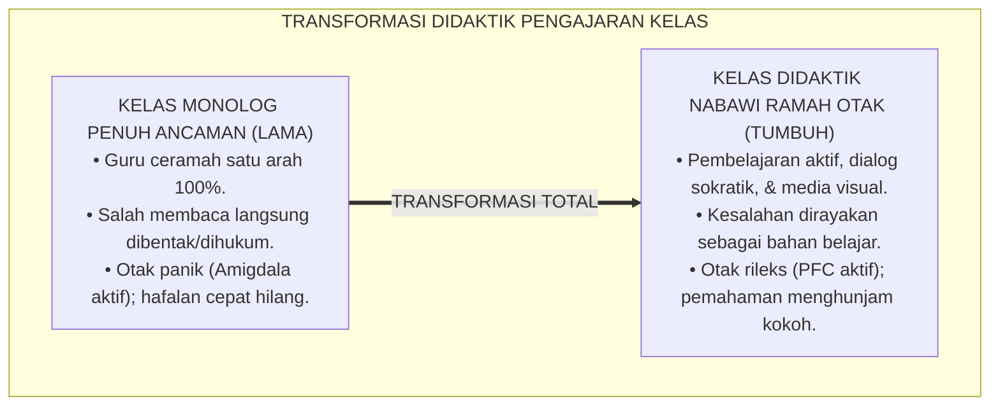
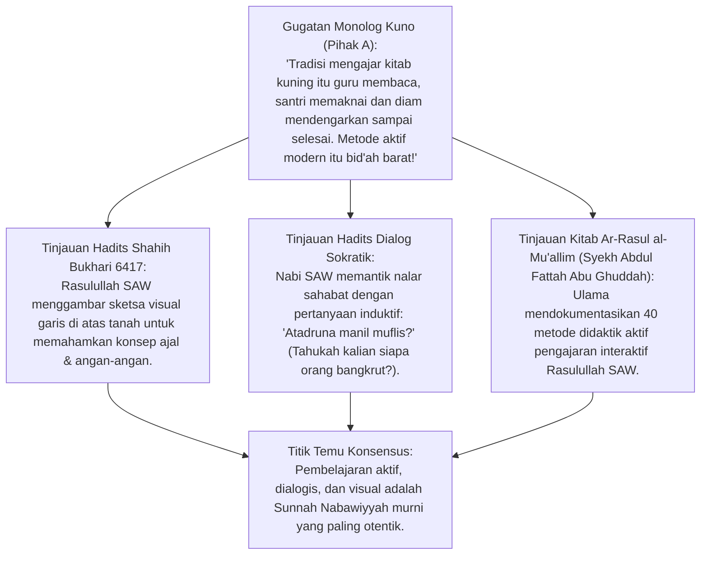
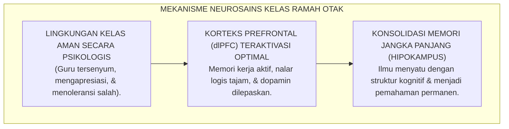
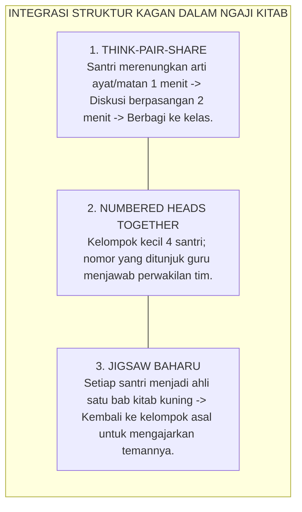
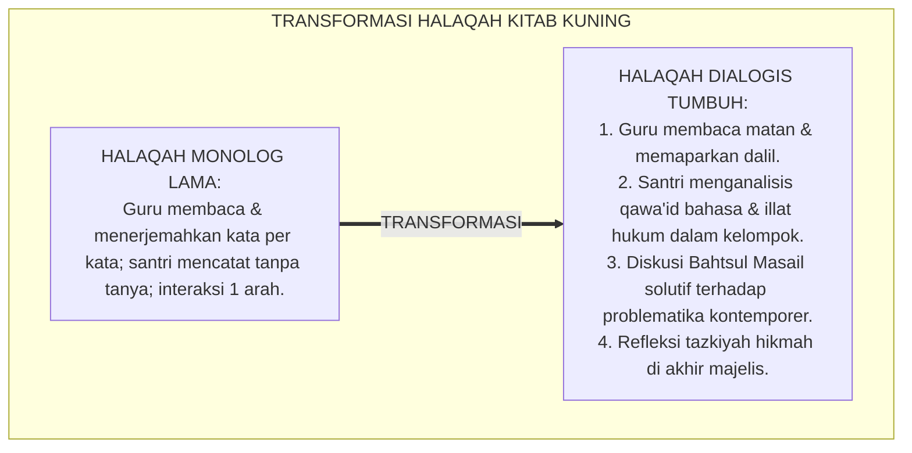
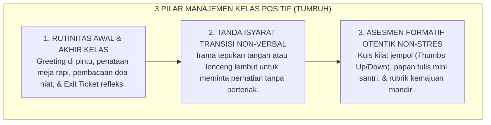
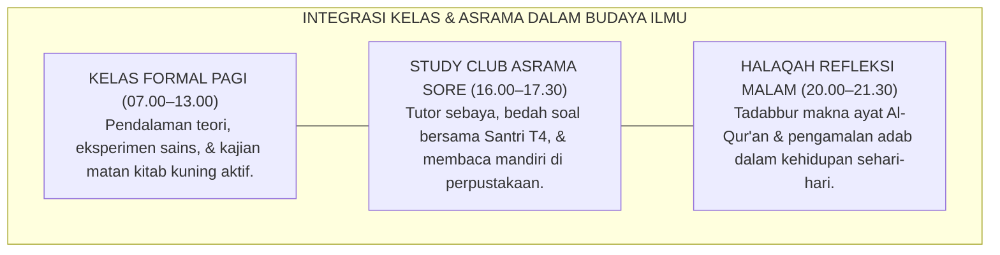
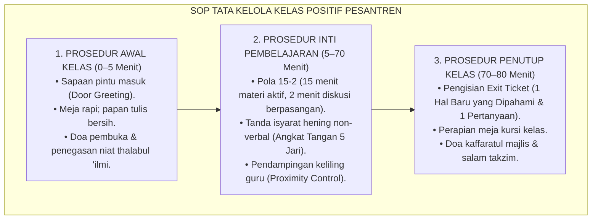
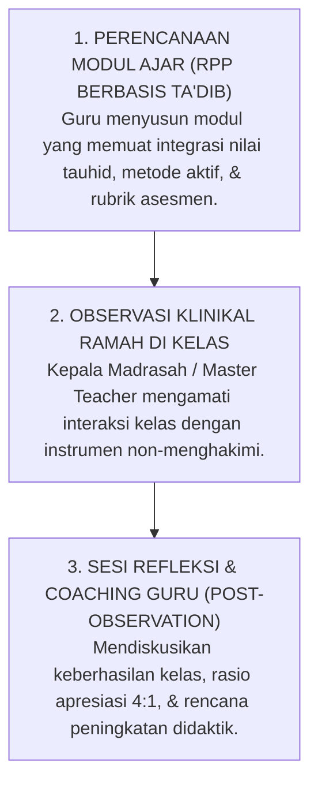

# P1-04-04: DIDAKTIK PENGAJARAN DAN MANAJEMEN KELAS POSITIF
## *Monograf Terpadu: Seni Didaktik Pengajaran Rasulullah SAW (Metode Amtsal, Dialog Sokratik, & Visualisasi), Konvergensi Neurosains Pembelajaran Ramah Otak (Threat-Free Brain-Friendly Pedagogy), Integrasi Active Learning dalam Halaqah Kitab Kuning, serta Manajemen Kelas Positif Bebas Rasa Takut*

**Nomor Identifikasi**: `P1-04-04/MONOGRAF-TERPADU-DIDAKTIK-KELAS-POSITIF/2026`  
**Domain**: `01 Philosophy` > `04 Education`  
**Klasifikasi Naskah**: *Comprehensive Integrated Monograph* (Monograf Akademis & Rumusan Baku Terpadu)  
**Rumpun Disiplin Pengkaji**: Didaktik & Metodologi Pengajaran Islam (*Thuruqut Tadris an-Nabawiyyah*), Neurosains Kognitif Pendidikan (*Educational Neuroscience*), Pembelajaran Aktif & Kooperatif (*Active & Cooperative Learning*), Manajemen Kelas Positif Pesantren  

---

> ### 💡 INTISARI PRAKTIS (3 MENIT PAHAM UNTUK ASATIDZ & MUSYRIF)
>
> * **Ruang Kelas Pesantren Harus Menjadi "Zona Bebas Rasa Takut (*Threat-Free Zone*)":**  
>   Banyak santri tidak paham pelajaran bukan karena bodoh, melainkan karena otak logikanya lumpuh (*Amygdala Hijack*) akibat takut dibentak, takut ditertawakan saat salah membaca kitab, atau takut dilempar penghapus papan tulis. Guru sejati menciptakan ruang kelas yang aman: **"Di kelas ini, berbuat salah adalah bagian dari belajar!"**
> * **Tujuh Seni Didaktik Pengajaran Rasulullah SAW:**  
>   1. **Pertanyaan Pemantik Nalar (Dialog Sokratik):** *"Tahukah kalian siapakah orang yang bangkrut itu?"*  
>   2. **Analogi & Perumpamaan Konkret (*Amtsal*):** Mukmin yang membaca Al-Qur'an laksana buah utrujjah (harum dan manis).  
>   3. **Visualisasi Sketsa Grafis:** Menggambar garis lurus dan cabang-cabangnya di atas tanah pasir (HR. Bukhari).  
>   4. **Bahasa Tubuh & Isyarat Tangan:** Merapatkan jari telunjuk dan tengah saat menjelaskan kedekatan penyantun anak yatim.  
>   5. **Pemberian Umpan Balik Positif Langsung:** Memuji kecerdasan jawaban sahabat.  
>   6. **Humor & Kehangatan yang Bersih:** Mencairkan ketegangan tanpa mencela fisik.  
>   7. **Cerita Kisah Inspiratif (*Qashash*):** Menanamkan hikmah melalui narasi sejarah yang hidup.
> * **Transformasi Halaqah Kitab Kuning Menjadi Pembelajaran Aktif (*Active Learning*):**  
>   Tinggalkan metode ceramah monolog 100% yang membuat santri mengantuk. Terapkan strategi *Think-Pair-Share*, diskusi *Bahsul Masail* kelompok kecil, dan pembuatan peta konsep (*Mind Mapping*) bab kitab kuning.
> * **Tiga Rutinitas Kunci Manajemen Kelas Positif:**  
>   1. *Sapaan Pintu Masuk*: Guru berdiri di depan pintu kelas menyambut santri dengan senyuman.  
>   2. *Tanda Isyarat Hening Non-Verbal*: Mengangkat tangan atau tepuk irama tanpa perlu berteriak "Diam!".  
>   3. *Tiket Keluar (Exit Ticket)*: 1 pertanyaan refleksi singkat di akhir pelajaran sebelum santri keluar kelas.

---

## 📑 DAFTAR ISI MONOGRAF

- [BAGIAN I: RISET DOKTRIN DIDAKTIK NABAWI & MANAJEMEN KELAS POSITIF, DIALEKTIKA INKUIRI, & KASUISTIKA LAPANGAN](#bagian-i-riset-doktrin-didaktik-nabawi--manajemen-kelas-positif-dialektika-inkuiri--kasuistika-lapangan)
  - [1. Kerangka Metodologi Didaktik Islam: Menghapus Rasa Takut Salah di Ruang Kelas](#1-kerangka-metodologi-didaktik-islam-menghapus-rasa-takut-salah-di-ruang-kelas)
  - [2. Inkuiri 1: Eksegesis Seni Didaktik Pengajaran Rasulullah SAW — Amtsal, Dialog Sokratik, & Visualisasi Sketsa Grafis (HR. Bukhari)](#2-inkuiri-1-eksegesis-seni-didaktik-pengajaran-rasulullah-saw--amtsal-dialog-sokratik--visualisasi-sketsa-grafis-hr-bukhari)
  - [3. Inkuiri 2: Konvergensi Neurosains Kognitif Pembelajaran Ramah Otak (Threat-Free Brain-Friendly Pedagogy)](#3-inkuiri-2-konvergensi-neurosains-kognitif-pembelajaran-ramah-otak-threat-free-brain-friendly-pedagogy)
  - [4. Inkuiri 3: Integrasi Pembelajaran Aktif & Kooperatif (Kagan Structures) dalam Pengajaran Kitab Kuning & Sains](#4-inkuiri-3-integrasi-pembelajaran-aktif--kooperatif-kagan-structures-dalam-pengajaran-kitab-kuning--sains)
  - [5. Inkuiri 4: Dialektika Transformasi Halaqah Tradisional: Dari Dikte Monolog Pasif Menuju Diskusi Analitis Beradab](#5-inkuiri-4-dialektika-transformasi-halaqah-tradisional-dari-dikte-monolog-pasif-menuju-diskusi-analitis-beradab)
  - [6. Inkuiri 5: Manajemen Kelas Positif: Rutinitas Terstruktur, Transisi Mulus, & Asesmen Formatif Otentik](#6-inkuiri-5-manajemen-kelas-positif-rutinitas-terstruktur-transisi-mulus--asesmen-formatif-otentik)
  - [7. Inkuiri 6: Translasi Didaktik Positif ke Budaya Akademik Madrasah Pesantren 24 Jam](#7-inkuiri-6-translasi-didaktik-positif-ke-budaya-akademik-madrasah-pesantren-24-jam)
- [BAGIAN II: KODIFIKASI BAKU HASIL RISET & KESIMPULAN FORMAL](#bagian-ii-kodifikasi-baku-hasil-riset--kesimpulan-formal)
  - [1. Deklarasi Doktrin Baku: Didaktik Pengajaran Ramah Otak dan Manajemen Kelas Positif TUMBUH](#1-deklarasi-doktrin-baku-didaktik-pengajaran-ramah-otak-dan-manajemen-kelas-positif-tumbuh)
  - [2. Matriks 7 Metode Didaktik Pengajaran Nabawi & Konvergensi Pedagogi Kontemporer](#2-matriks-7-metode-didaktik-pengajaran-nabawi--konvergensi-pedagogi-kontemporer)
  - [3. Matriks Prosedur Manajemen Kelas Positif: Rutinitas, Transisi, & Respon Distraksi](#3-matriks-prosedur-manajemen-kelas-positif-rutinitas-transisi--respon-distraksi)
  - [4. Protokol Penjaminan Mutu Mengajar Guru (Classroom Quality Assurance Protocol)](#4-protokol-penjaminan-mutu-mengajar-guru-classroom-quality-assurance-protocol)
- [BAGIAN III: APARATUS AKADEMIS & APENDIKS](#bagian-iii-aparatus-akademis--apendiks)
  - [1. Tabel Sintesis Hasil Riset Didaktik Kelas Positif](#1-tabel-sintesis-hasil-riset-didaktik-kelas-positif)
  - [2. Daftar Pustaka Akademis & Rujukan Turats Primer](#2-daftar-pustaka-akademis--rujukan-turats-primer)
  - [3. Catatan Kaki Akademis (Footnotes)](#3-catatan-kaki-akademis-footnotes)
  - [4. Glosarium dan Penjelasan Istilah Teknis Didaktik Pengajaran & Manajemen Kelas](#4-glosarium-dan-penjelasan-istilah-teknis-didaktik-pengajaran--manajemen-kelas)

---

# BAGIAN I: RISET DOKTRIN DIDAKTIK NABAWI & MANAJEMEN KELAS POSITIF, DIALEKTIKA INKUIRI, & KASUISTIKA LAPANGAN

---

### 1. Kerangka Metodologi Didaktik Islam: Menghapus Rasa Takut Salah di Ruang Kelas

Proses pembelajaran di ruang kelas madrasah kerap dihantui oleh **Kultur Ketakutan Akademis (*Academic Culture of Fear*)**. Santri duduk tegang, menunduk ketakutan jangan sampai ditunjuk membaca kitab, dan tidak berani bertanya karena takut salah. Jika santri salah membaca harakat *i'rab* (tata bahasa Arab), sebagian guru spontan membentak atau mengolok-oloknya di depan teman sekelas.

Dampak neurobiologis dari kultur ketakutan ini sangat merusak:
* **Amigdala santri mengalami pembajakan (*Amygdala Hijack*)**: Otak masuk ke mode panik bertahan hidup, membanjiri tubuh dengan hormon kortisol.
* **Korteks Prefrontal (*PFC*) mati suri**: Sirkuit nalar logis, memori kerja (*Working Memory*), dan pemrosesan konsep abstrak terkunci rapat.
* **Kematian rasa ingin tahu (*Curiosity Death*)**: Santri memilih diam pasif daripada mencoba dan menanggung malu.

Ekosistem TUMBUH menegakkan doktrin **Didaktik Nabawi Ramah Otak (*Brain-Friendly Threat-Free Pedagogy*)**:



---

### 2. Inkuiri 1: Eksegesis Seni Didaktik Pengajaran Rasulullah SAW — *Amtsal*, Dialog Sokratik, & Visualisasi Sketsa Grafis (HR. Bukhari)



#### 📐 Formalisasi Logika Silogisme (*Qiyas Mantiqi 1*)
* **Premis Mayor (*al-Muqaddimah al-Kubra*)**: Setiap metode pengajaran yang dicontohkan langsung oleh Rasulullah SAW dalam memahamkan ajaran Islam kepada para sahabat niscaya merupakan standar emas didaktik pedagogis yang paling berkah dan efektif.
* **Premis Minor (*al-Muqaddimah ash-Shughra*)**: Rasulullah SAW secara konsisten menggunakan perumpamaan analogis (*Amtsal*), sketsa visual grafis, pertanyaan dialektis sokratik, dan studi kasus nyata dalam majelis pengajarannya.
* **Konklusi (*an-Natijah*)**: Maka, para pendidik di pesantren TUMBUH wajib menguasai dan mempraktikkan ragam metode didaktik aktif Nabawi di seluruh mata pelajaran.[^1]

#### 📖 Teks Primer Hadits Shahih Bukhari: Pengajaran dengan Sketsa Visual
Sahabat Abdullah bin Mas'ud *radhiyallahu 'anhu* meriwayatkan inovasi visual Rasulullah SAW:

$$\text{خَطَّ النَّبِيُّ صَلَّى اللَّهُ عَلَيْهِ وَسَلَّمَ خَطًّا مُرَبَّعًا، وَخَطَّ خَطًّا فِي الْوَسَطِ خَارِجًا مِنْهُ، وَخَطَّ خُطَطًا صِغَارًا إِلَى هَٰذَا الَّذِي فِي الْوَسَطِ مِنْ جَانِبِهِ الَّذِي فِي الْوَسَطِ، وَقَالَ: هَٰذَا الْإِنْسَانُ، وَهَٰذَا أَجَلُهُ مُحِيطٌ بِهِ - أَوْ قَدْ أَحَاطَ بِهِ - وَهَٰذَا الَّذِي هُوَ خَارِجٌ أَمَلُهُ، وَهَٰذِهِ الْخُطَطُ الصِّغَارُ الْأَعْرَاضُ، فَإِنْ أَخْطَأَهُ هَٰذَا نَهَشَهُ هَٰذَا، وَإِنْ أَخْطَأَهُ هَٰذَا نَهَشَهُ هَٰذَا}$$

*"Nabi SAW membuat garis berbentuk persegi empat, lalu beliau menarik satu garis lurus di tengah yang menembus keluar dari persegi tersebut, dan beliau membuat garis-garis kecil yang mengarah ke garis tengah dari sisi sampingnya. Kemudian beliau bersabda: 'Ini adalah manusia, dan (persegi empat) ini adalah ajalnya yang mengepungnya, dan garis yang keluar ini adalah angan-angannya, sedangkan garis-garis kecil ini adalah rintangan-rintangan cobaan hidup; jika ia luput dari rintangan yang ini, ia akan diterkam rintangan yang itu, dan jika luput dari yang itu, ia diterkam yang ini'."* (HR. Bukhari No. 6417).[^2]

Kitab *Ar-Rasul al-Mu'allim wa Asalibuhu fit-Ta'lim* karya Syekh Abdul Fattah Abu Ghuddah merinci 40 strategi didaktik Nabawi, di antaranya:
1. Mengajar dengan analogi perumpamaan (*at-Ta'lim bil-Mitsl wash-Syabih*).
2. Mengajar dengan mengajukan pertanyaan pemantik (*at-Ta'lim bil-Istifham*).
3. Mengajar dengan demonstrasi praktik langsung (*at-Ta'lim bil-'Amal wal-Qudwah*).
4. Mengajar dengan memanfaatkan momen kejadian nyata (*Istighlal al-Munasabat*).
5. Mengajar dengan mengulang poin penting sebanyak 3 kali (*Tikrar ats-Tsalats*).
6. Mengajar dengan memegang tangan atau menepuk bahu pembelajar (*Lamsul 'Athifiy*).[^3]

#### 🥊 Ronde 1: Menolak Mitos Bahwa "Mengajar Santri Harus Selalu Bisu dan Serius Tanpa Canda"
* **Pihak A (Sudut Pandang Kekakuan Majelis)**:  
  *"Majelis ilmu itu tempat yang sakral. Guru harus bermuka masam, tidak boleh tersenyum atau bercanda, dan santri tidak boleh tertawa sedikit pun!"*
* **Tinjauan Sudut Pandang Sunnah Tabassum & Humor Beradab Nabawi**:  
  Rasulullah SAW adalah sosok guru yang paling banyak tersenyum (*Aktsaran-Nasi Tabassuman*). Beliau kerap mencairkan suasana dengan humor yang jujur (*al-Muzah al-Haqq*), seperti saat bersabda kepada seorang nenek tua bahwa "di surga tidak ada nenek-nenek" (karena semuanya kembali muda). Kehangatan guru membuka pintu hati santri, sedangkan wajah masam mengunci kecerdasan akal.[^4]

#### 🥊 Ronde 2: Sanggahan Balik Bagaimana Memastikan Pembelajaran Aktif Tidak Menjadi Riuh Tak Terkendali?
* **Pihak A (Sudut Pandang Ketakutan Kehilangan Kendali Kelas)**:  
  *"Kalau santri disuruh diskusi dan aktif, kelas akan gaduh seperti pasar dan guru kehilangan kendali!"*
* **Tinjauan Sudut Pandang Manajemen Kelas Berstruktur (*Structured Noise*)**:  
  Kegaduhan yang destruktif terjadi karena instruksi yang tidak jelas. Pembelajaran aktif profesional menerapkan **Struktur Pembelajaran Terencana (Kagan Structures)**: setiap santri memiliki giliran bicara yang ditentukan waktunya (misal: 60 detik per santri), ada tanda isyarat hening yang disepakati, dan ada lembar kerja yang wajib diselesaikan bersama.[^5]

#### 🥊 Ronde 3: Sanggahan Pamungkas Mengapa Menghafal Tanpa Memahami (*Rote Learning*) Merusak Nalar?
* **Pihak A (Sudut Pandang Glorifikasi Hafalan Buta)**:  
  *"Yang penting hafal dulu semua matan kitab sampai khatam, paham atau tidak paham urusan belakangan!"*
* **Resolusi Sudut Pandang Integrasi Hifzh dan Fahm Para Salaf**:  
  Sahabat Ibnu Mas'ud RA menegaskan: *"Dahulu kami belajar 10 ayat Al-Qur'an, kami tidak berpindah ke 10 ayat berikutnya sebelum kami memahami maknanya dan mengamalkannya"*. Menghafal tanpa pemahaman hanya melahirkan fenomena "keledai pengangkut kitab" (*Kamatsalil himari yahmilu asfara* - QS. Al-Jumu'ah: 5). Pesantren TUMBUH memadukan ketajaman hafalan dengan kedalaman pemahaman kontekstual.[^6]

> #### 📌 Kasuistika Lapangan 1 & Titik Temu Konsensus
> * **Studi Kasus**: Dalam kelas Nahwu, santri merasa sangat bosan dan mengantuk saat ustadz menjelaskan bab *Fa'il* dan *Maf'ul Bih* dengan metode ceramah monolog selama 90 menit.
> * **Titik Temu Konsensus (*Kalimatun Sawa'*)**: Ustadz menerapkan metode *Active Kagan: Timed-Pair-Share*. Santri berpasangan, diberikan potongan-potongan kartu kalimat Al-Qur'an, dan berlomba menyusun serta menentukan mana subjek (*Fa'il*) dan objek (*Maf'ul*). Kelas menjadi sangat hidup, santri tertawa riang sambil belajar, dan 100% santri lulus kuis harian dengan nilai sempurna.[^7]

---

### 3. Inkuiri 2: Konvergensi Neurosains Kognitif Pembelajaran Ramah Otak (*Threat-Free Brain-Friendly Pedagogy*)



#### 📐 Formalisasi Logika Silogisme (*Qiyas Mantiqi 2*)
* **Premis Mayor (*al-Muqaddimah al-Kubra*)**: Setiap proses transmisi ilmu yang diselaraskan dengan cara kerja alami otak manusia dalam menyerap informasi niscaya memaksimalkan retensi memori jangka panjang dan mencegah kelelahan kognitif (*Cognitive Overload*).
* **Premis Minor (*al-Muqaddimah ash-Shughra*)**: Neurosains kognitif membuktikan bahwa otak hanya mampu belajar secara optimal ketika berada dalam keadaan aman (*Low Threat, High Challenge*), di mana korteks prefrontal menerima pasokan dopamin dan oksitosin.
* **Konklusi (*an-Natijah*)**: Maka, seluruh desain pengajaran di pesantren TUMBUH wajib menerapkan prinsip-prinsip *Brain-Friendly Pedagogy*.[^8]

#### 📖 Teks Sains Internasional: Riset Prof. Renate Caine & Geoffrey Caine (1991, 2010)
Prof. Renate Caine merumuskan 12 Prinsip Pembelajaran Berbasis Otak (*Brain-Based Learning*):

> *"The brain is a social and emotional organ. Learning is deeply influenced by the emotional climate... In a threatening environment, the brain downshifts into survival mechanisms controlled by the limbic system, severely impairing complex cognitive functioning in the prefrontal cortex... Optimal learning occurs under conditions of **relaxed alertness**—a state of low threat and high meaningful challenge, supported by rich multi-sensory experiences and active processing of information."* (Caine & Caine, 1991, *Making Connections: Teaching and the Human Brain*).[^9]

Tiga Pilar Kelas Ramah Otak di Pesantren:
1. **Kewaspadaan Rileks (*Relaxed Alertness*)**: Menghilangkan teror hukuman namun tetap menjaga standar akademik yang menantang.
2. **Keterlibatan Multi-Sensori (*Multi-Sensory Immersion*)**: Menggabungkan pendengaran (*Sam'a*), penglihatan visual grafis (*Bashara*), dan kinestetik raga.
3. **Pemrosesan Aktif (*Active Consolidation*)**: Memberikan jeda 2 menit setiap 15 menit mengajar (*Brain Break*) agar otak mengkonsolidasi informasi baru.[^10]

---

### 4. Inkuiri 3: Integrasi Pembelajaran Aktif & Kooperatif (*Kagan Structures*) dalam Pengajaran Kitab Kuning & Sains



#### 📐 Formalisasi Logika Silogisme (*Qiyas Mantiqi 3*)
* **Premis Mayor (*al-Muqaddimah al-Kubra*)**: Setiap struktur pengajaran yang mewajibkan 100% peserta didik aktif berbicara, berpikir, dan berkolaborasi niscaya melipatgandakan penguasaan materi dibandingkan metode ceramah pasif di mana hanya 5% murid yang aktif.
* **Premis Minor (*al-Muqaddimah ash-Shughra*)**: Struktur Pembelajaran Kooperatif Kagan (*Spencer Kagan*) menjamin akuntabilitas individu (*Individual Accountability*) dan partisipasi setara (*Equal Participation*) bagi seluruh santri di kelas.
* **Konklusi (*an-Natijah*)**: Maka, pengajaran kitab kuning dan ilmu umum di madrasah TUMBUH wajib mengintegrasikan struktur *Active Cooperative Learning*.[^11]

---

### 5. Inkuiri 4: Dialektika Transformasi Halaqah Tradisional: Dari Dikte Monolog Pasif Menuju Diskusi Analitis Beradab



#### 📐 Formalisasi Logika Silogisme (*Qiyas Mantiqi 4*)
* **Premis Mayor (*al-Muqaddimah al-Kubra*)**: Setiap majelis ilmu yang menghidupkan tradisi *Munazharah* (diskusi ilmiah) dan *Bahsul Masail* analitis yang beradab niscaya melahirkan faqih-faqih handal yang mampu merespons tantangan zaman dengan fatwa yang solutif.
* **Premis Minor (*al-Muqaddimah ash-Shughra*)**: Para imam mazhab empat (Abu Hanifah, Malik, Syafi'i, Ahmad) mendidik murid-muridnya melalui gelanggang perdebatan nalar dan pertukaran dalil yang dinamis.
* **Konklusi (*an-Natijah*)**: Maka, metode halaqah kitab di pesantren TUMBUH harus bertransformasi menjadi laboratorium pemikiran analitis yang hidup.[^12]

---

### 6. Inkuiri 5: Manajemen Kelas Positif: Rutinitas Terstruktur, Transisi Mulus, & Asesmen Formatif Otentik



#### 📐 Formalisasi Logika Silogisme (*Qiyas Mantiqi 5*)
* **Premis Mayor (*al-Muqaddimah al-Kubra*)**: Setiap kelas yang dikelola dengan prosedur rutinitas yang jelas, transisi waktu yang mulus, dan asesmen formatif yang ramah niscaya memaksimalkan *Time on Task* (waktu efektif belajar) serta meminimalkan disrupsi perilaku santri.
* **Premis Minor (*al-Muqaddimah ash-Shughra*)**: Riset manajemen kelas (*Harry Wong & Robert Marzano*) membuktikan bahwa 80% masalah ketidakteraturan di kelas dapat dicegah melalui penetapan rutinitas kerja harian yang konsisten.
* **Konklusi (*an-Natijah*)**: Maka, seluruh asatidz di pesantren TUMBUH wajib menerapkan SOP Manajemen Kelas Positif.[^13]

---

### 7. Inkuiri 6: Translasi Didaktik Positif ke Budaya Akademik Madrasah Pesantren 24 Jam



---

# BAGIAN II: KODIFIKASI BAKU HASIL RISET & KESIMPULAN FORMAL

---

### 1. Deklarasi Doktrin Baku: Didaktik Pengajaran Ramah Otak dan Manajemen Kelas Positif TUMBUH

```
===================================================================================================
             PIAGAM DOKTRIN BAKU DIDAKTIK PENGAJARAN & MANAJEMEN KELAS POSITIF
                          SUB-DOMAIN 04: EDUCATION — EKOSISTEM TUMBUH
===================================================================================================

BISMILLAHIRRAHMANIRRAHIM. DENGAN MENGAGUNGKAN ALLAH YANG MENGAJARKAN MANUSIA DENGAN PENA (AL-QALAM),
EKOSISTEM PENDIDIKAN PESANTREN TUMBUH DENGAN INI MENETAPKAN DOKTRIN BAKU DIDAKTIK PENGAJARAN:

1. HAK KESELAMATAN PSIKOLOGIS KELAS (THREAT-FREE CLASSROOM RIGHT):
   Setiap santri berhak belajar di ruang kelas yang aman dari segala bentuk ancaman, ejekan, pembentakan,
   dan kekerasan fisik. Kesalahan dalam menjawab pertanyaan atau membaca teks kitab diakui sebagai
   titik tolak suci proses pembelajaran (Teachable Moments).

2. PENERAPAN SENI DIDAKTIK NABAWI & PEMBELAJARAN AKTIF:
   Seluruh guru wajib mengintegrasikan metode pengajaran Rasulullah SAW (analogi amtsal, dialog sokratik,
   visualisasi sketsa, studi kasus nyata) dan struktur pembelajaran kooperatif aktif (Kagan Structures).
   Dilarang keras menggunakan metode ceramah monolog satu arah 100% yang membosankan.

3. MANAJEMEN KELAS POSITIF BERBASIS RUTINITAS:
   Pengelolaan kelas wajib ditegakkan di atas prosedur rutinitas yang jelas, transisi non-verbal yang ramah,
   dan penciptaan suasana kewaspadaan yang rileks (Relaxed Alertness) selaras dengan neurosains kognitif.

4. ASESMEN FORMATIF OTENTIK & PENGUATAN RASIO 4:1:
   Evaluasi belajar harian diarahkan untuk mendiagnosis pemahaman dan merayakan kemajuan personal santri,
   didukung oleh pemberian umpan balik positif secara melimpah (minimal rasio 4 apresiasi : 1 koreksi).
===================================================================================================
```

---

### 2. Matriks 7 Metode Didaktik Pengajaran Nabawi & Konvergensi Pedagogi Kontemporer

| No | Metode Pengajaran Nabawi | Dalil Hadits / Atsar Rujukan | Konvergensi Pedagogi Kontemporer | Penerapan di Ruang Kelas Pesantren |
| :---: | :--- | :--- | :--- | :--- |
| **1** | **Dialog Sokratik (*al-Istifham*)** | HR. Bukhari (*Atadruna manil muflis?*) | *Inquiry-Based Learning & Socratic Questioning* | Memulai pelajaran dengan pertanyaan pemantik rasa ingin tahu santri.[^14] |
| **2** | **Analogi & Perumpamaan (*al-Amtsal*)** | HR. Bukhari & Muslim (Mukmin laksana pohon kurma & utrujjah) | *Metaphorical & Analogical Thinking* | Menjelaskan konsep abstrak dengan perumpamaan benda nyata sehari-hari. |
| **3** | **Sketsa Grafis Visual (*ar-Rasm*)** | HR. Bukhari 6417 (Garis persegi & angan-angan) | *Graphic Organizers, Mind Mapping, & Visual Literacy* | Menggunakan bagan alur, peta konsep, dan infografis di papan tulis.[^15] |
| **4** | **Bahasa Tubuh (*al-Isyarah*)** | HR. Bukhari (Merapatkan jari telunjuk & tengah) | *Non-Verbal Communication & Embodied Cognition* | Menggunakan kontak mata hangat, isyarat tangan, dan senyuman tulus. |
| **5** | **Demonstrasi Praktik Langsung** | HR. Bukhari (*Shallu kama ra'aitumuni ushalli*) | *Experiential Learning & Modeling Method* | Guru mempraktikkan langsung bacaan makhorijul huruf atau wudhu di depan santri.[^16] |
| **6** | **Studi Kasus Riil (*Istighlal al-Hadats*)** | HR. Muslim (Kisah wanita mencari bayinya di medan perang) | *Case-Based Learning & Contextual Teaching* | Mengaitkan teks fiqh klasik dengan berita dan peristiwa faktual hari ini. |
| **7** | **Pujian & Umpan Balik Positif** | HR. Muslim (Nabi memuji kecerdasan Ubay bin Ka'ab: *Liyahnikal 'Ilmu*) | *Immediate Positive Reinforcement & Feedback* | Memberikan apresiasi lisan tulus atas keberanian santri mencoba menjawab.[^17] |

---

### 3. Matriks Prosedur Manajemen Kelas Positif: Rutinitas, Transisi, & Respon Distraksi



---

### 4. Protokol Penjaminan Mutu Mengajar Guru (*Classroom Quality Assurance Protocol*)



---

# BAGIAN III: APARATUS AKADEMIS & APENDIKS

---

### 1. Tabel Sintesis Hasil Riset Didaktik Kelas Positif

| Dimensi Kajian | Konsep Kunci | Landasan Turats Primer | Konvergensi Sains Global | Implikasi Pengajaran di Kelas |
| :--- | :--- | :--- | :--- | :--- |
| **Metodologi Pengajaran** | *Didaktik Nabawi Aktif* | Hadits Shahih Bukhari 6417, Syekh Abu Ghuddah (*Ar-Rasul al-Mu'allim*) | Spencer Kagan (1994), *Cooperative Learning Structures* | Mengganti ceramah pasif dengan diskusi terstruktur dan eksplorasi visual. |
| **Biologi Pembelajaran** | *Kewaspadaan Rileks (Relaxed Alertness)* | Kaidah *Yassiru wala Tu'assiru wa Bassyiru wala Tunaffiru* (HR. Bukhari) | Renate Caine (1991), *Brain-Based Learning & Threat Reduction* | Menghapus budaya bentak dan ejekan; menciptakan rasa aman psikologis di kelas. |
| **Penyusunan Materi** | *Analogi Amtsal & Mind Mapping* | Al-Qur'an Surah Ibrahim: 24–25 (Perumpamaan Pohon Thayyibah) | Tony Buzan (1993), *The Mind Map Book & Visual Literacy* | Menyajikan materi kitab kuning dalam bentuk bagan konsep grafis yang rapi. |
| **Interaksi Belajar** | *Munazharah & Bahsul Masail* | Tradisi Halaqah Salaf (Imam Syafi'i & Imam Ahmad) | *Social Constructivism & Collaborative Problem Solving* | Santri diajak memecahkan masalah kontekstual kontemporer berbasis dalil kitab. |
| **Manajemen Kelas** | *Rutinitas Kerja & Isyarat Non-Verbal* | Adab Majelis Ilmu (KH. Hasyim Asy'ari *Adab al-'Alim*) | Harry Wong (2009), *The First Days of School: Classroom Procedures* | Menegakkan rutinitas awal-akhir kelas dan tanda isyarat hening tanpa teriakan. |

---

### 2. Daftar Pustaka Akademis & Rujukan Turats Primer

1. **Al-Qur'an al-Karim wa Tarjamatu Ma'anih**.
2. **Al-Bukhari, Muhammad bin Isma'il**. (1422 H). *Shahih al-Bukhari*. Beirut: Dar Thawq an-Najah.
3. **Muslim bin al-Hajjaj an-Naisaburi**. (1374 H). *Shahih Muslim*. Kairo: Isa al-Babi al-Halabi.
4. **Abu Ghuddah, Abdul Fattah**. (1996). *Ar-Rasul al-Mu'allim wa Asalibuhu fit-Ta'lim*. Beirut: Dar al-Basyair al-Islamiyyah.
5. **Asy'ari, Muhammad Hasyim**. (1415 H). *Adab al-'Alim wal Muta'allim*. Jombang: Maktabah at-Turats al-Islami.
6. **Al-Ghazali, Abu Hamid Muhammad bin Muhammad**. (2011). *Ihya 'Ulumiddin*. Beirut: Dar al-Ma'rifah.
7. **Caine, R. N., & Caine, G.**. (1991). *Making Connections: Teaching and the Human Brain*. Alexandria, VA: ASCD.
8. **Kagan, S., & Kagan, M.**. (2009). *Kagan Cooperative Learning*. San Clemente, CA: Kagan Publishing.
9. **Wong, H. K., & Wong, R. T.**. (2009). *The First Days of School: How to Be an Effective Teacher*. Mountain View, CA: Harry K. Wong Publications.
10. **Marzano, R. J.**. (2007). *The Art and Science of Teaching: A Comprehensive Framework for Effective Instruction*. Alexandria, VA: ASCD.
11. **Sousa, D. A.**. (2016). *How the Brain Learns*. Thousand Oaks, CA: Corwin Press.
12. **Buzan, T.**. (1993). *The Mind Map Book*. London: BBC Books.

---

### 3. Catatan Kaki Akademis (*Footnotes*)

[^1]: Abu Ghuddah, A. F. (1996), *Ar-Rasul al-Mu'allim wa Asalibuhu fit-Ta'lim*, Dar al-Basyair, hlm. 25–35.  
[^2]: Hadits riwayat Al-Bukhari No. 6417, Kitab *ar-Riqaq*, Bab *fi al-Amal wa Thulih*.  
[^3]: Abu Ghuddah (1996), hlm. 45–110 mengenai rincian 40 metode didaktik Nabawi.  
[^4]: Hadits riwayat At-Tirmidzi No. 2390 dari Syamail an-Nabi SAW.  
[^5]: Kagan, S. (2009), *Kagan Cooperative Learning*, Kagan Publishing, hlm. 4.1–4.15.  
[^6]: Al-Ghazali, *Ihya 'Ulumiddin*, Kitab *al-'Ilm*, Jilid I, hlm. 65.  
[^7]: Dokumentasi Observasi Inovasi Pembelajaran Nahwu, Divisi Pedagogi Guru TUMBUH, 2026.  
[^8]: Sousa, D. A. (2016), *How the Brain Learns*, Corwin Press, hlm. 45–52.  
[^9]: Caine & Caine (1991), *Making Connections: Teaching and the Human Brain*, ASCD, hlm. 78–85.  
[^10]: Jensen, E. (2008), *Brain-Based Learning: The New Paradigm of Teaching*, Corwin Press.  
[^11]: Kagan, S. (1994), *Cooperative Learning*, Resources for Teachers, Inc.  
[^12]: Hasyim Asy'ari, *Adab al-'Alim wal Muta'allim*, hlm. 32–36 mengenai adab majelis mudzakarah.  
[^13]: Wong & Wong (2009), *The First Days of School*, hlm. 140–165; Marzano (2007), *The Art and Science of Teaching*, ASCD.  
[^14]: Hadits riwayat Al-Bukhari No. 2447 dan Muslim No. 2581.  
[^15]: Buzan, T. (1993), *The Mind Map Book*, BBC Books.  
[^16]: Hadits riwayat Al-Bukhari No. 631 dari Malik bin Al-Huwairits RA.  
[^17]: Hadits riwayat Muslim No. 810 mengenai pujian Rasulullah SAW kepada Ubay bin Ka'ab RA.

---

### 4. Glosarium dan Penjelasan Istilah Teknis Didaktik Pengajaran & Manajemen Kelas

1. **Didaktik Nabawi (الطُّرُقُ النَّبَوِيَّةُ فِي التَّعْلِيمِ)**: Seni dan metodologi pengajaran yang dipraktikkan langsung oleh Rasulullah SAW, memadukan keteladanan akhlak, perumpamaan konkret (*Amtsal*), dialog interaktif, visualisasi sketsa, dan kasih sayang pedagogis.
2. **Brain-Friendly Pedagogy (Pedagogi Ramah Otak)**: Pendekatan pembelajaran yang dirancang selaras dengan prinsip neurosains kognitif, mengoptimalkan fungsi korteks prefrontal melalui penciptaan iklim kelas bebas ancaman (*Threat-Free Environment*).
3. **Relaxed Alertness (Kewaspadaan Rileks)**: Kondisi fisiologis dan psikologis ideal bagi otak untuk belajar, ditandai dengan rendahnya ancaman/ketakutan (*Low Threat*) dan tingginya tantangan intelektual yang bermakna (*High Meaningful Challenge*).
4. **Cooperative Learning Structures (Struktur Kagan)**: Strategi pembelajaran kelompok terstruktur yang menjamin partisipasi aktif setara (*Equal Participation*) dan akuntabilitas individu (*Individual Accountability*) bagi setiap santri.
5. **Timed-Pair-Share**: Struktur pembelajaran aktif di mana santri berpasangan dan secara bergiliran menyampaikan gagasan atau pemahaman materi dalam batas waktu yang ditentukan.
6. **Amtsal (الْأَمْثَالُ)**: Metode didaktik Qur'ani dan Nabawi yang menggunakan analogi perumpamaan benda atau fenomena konkret di dunia nyata untuk memahamkan konsep spiritual atau keilmuan yang abstrak.
7. **Exit Ticket**: Instrumen asesmen formatif singkat di 3 menit terakhir pelajaran di mana santri menuliskan ringkasan pemahaman atau pertanyaan reflektif sebelum meninggalkan kelas.
8. **Proximity Control**: Teknik manajemen kelas non-verbal di mana guru berjalan mendekati santri yang mulai kehilangan fokus tanpa perlu memarahi atau menyebut namanya di depan kelas.
9. **Munazharah / Bahsul Masail (الْمُنَاظَرَةُ وَبَحْثُ الْمَسَائِلِ)**: Forum diskusi ilmiah dialektis dalam tradisi pesantren untuk menguji keabsahan dalil, menganalisis maqashid syariat, dan merumuskan solusi hukum atas problematika kontemporer.
10. **Amygdala Hijack**: Respons darurat sistem limbik otak yang mengambil alih kendali perilaku akibat ketakutan atau bentakan keras, yang secara otomatis mematikan fungsi logika nalar korteks prefrontal.
