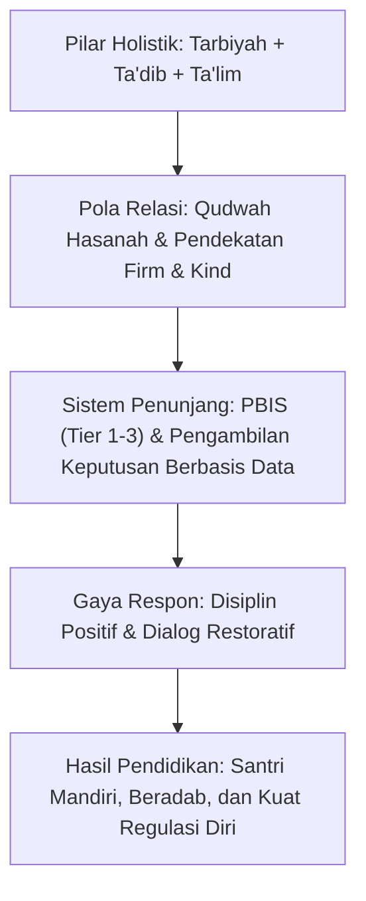

# P1-04-04-Sintesis-Filsafat-Pendidikan-TUMBUH

## Rangkuman Integratif: Falsafah Pendidikan Pesantren TUMBUH

Dokumen ini menyintesiskan pilar-pilar filosofis pendidikan (*Education*) dalam kerangka ekosistem TUMBUH:

---

## 4 Aksioma Utama Pendidikan Pesantren TUMBUH

1. **Aksioma Pendidikan Menyeluruh (*Kulliyyatut Tarbiyah*)**: Pendidikan pesantren sejati tidak boleh tereduksi menjadi sekadar pengajaran formal di kelas (*Ta'lim*), melainkan mencakup pembiasaan adab (*Ta'dib*) dan pemeliharaan fitrah jasmani-ruhani santri (*Tarbiyah*).
2. **Aksioma Keteladanan Mutlak (*Asasiyyatul Qudwah*)**: Fondasi utama pembinaan santri adalah keteladanan (*Qudwah*) dari asatidz, musyrif, dan pimpinan pesantren. Perilaku santri adalah cermin dari kultur yang dipraktikkan oleh para pendidiknya.
3. **Aksioma Disiplin dari Dalam (*Inba'ud Dhabti*)**: Disiplin sejati adalah kemampuan mengendalikan diri secara sadar (*Self-Regulation*), bukan kepatuhan semu karena takut hukuman fisik. Penegakan disiplin harus mendidik tanggung jawab dan memulihkan martabat (*Restorative*).
4. **Aksioma Ekosistem Pendukung (*Syumuliyyatul Bi'ah*)**: Keberhasilan pendidikan membutuhkan sistem lingkungan yang tertata rapi (*PBIS*), di mana ekspektasi perilaku jelas, SOP terstandarisasi, dan keputusan pembinaan didasarkan pada data objektif.
